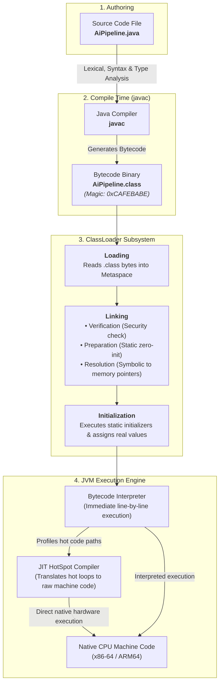
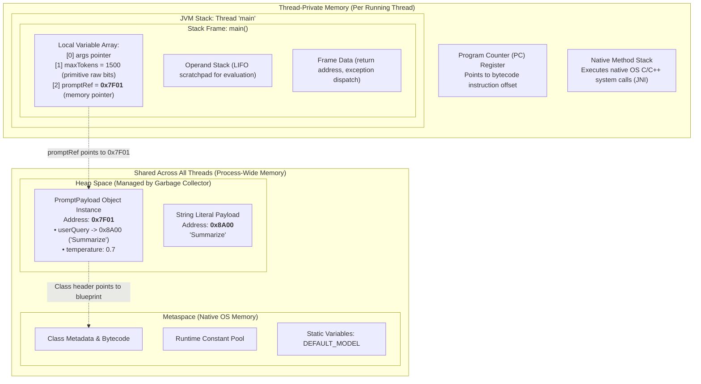

# Day_01 — Java Ecosystem, JVM Architecture, and Memory Hierarchy

| ⬅️ Previous Day | 📚 Course Hub | ➡️ Next Day |
|:---|:---:|---:|
| *🚀 Course Inception* | [All 60 Days Overview](../../README.md) | [Day 02: OOP — Classes, Objects & Memory →](../Day_02_OOP_Classes_Objects_Memory/Day_02_OOP_Classes_Objects_Memory.md) |

---

## 🎯 What You'll Understand By the End
- The structural nesting and mechanical differences between the **JDK**, **JRE**, and **JVM**, and how they interact with the host operating system.
- How the operating system resolves binary pointers using `JAVA_HOME` and `PATH`, and how to troubleshoot path configuration errors.
- The step-by-step compilation and execution lifecycle: from human-readable `.java` source code to `.class` bytecode, through the three phases of the **ClassLoader Subsystem** (**Loading**, **Linking**, **Initialization**), into native CPU execution via the **Interpreter** and **JIT HotSpot Compiler**.
- Deep JVM memory architecture: the exact physical roles of **Metaspace**, **Heap Space**, **JVM Stack Frames** (Local Variable Array, Operand Stack, Frame Data), **Program Counter (PC) Registers**, and **Native Method Stacks**.
- The **Memory-First Mandate**: how the JVM physically stores raw binary values for primitives versus memory address pointers for reference objects in RAM.
- How Java package namespaces map 1-to-1 to physical disk directories, how imports work, and how access specifiers protect class boundaries.
- How modern build tools like **Maven** and **Gradle** construct automated dependency trees and compile-time classpaths.

---

## 🧠 The Problem This Solves

Before Java was created in 1995, building production software suffered from three critical roadblocks:

1. **Direct CPU Coupling (The Machine Code Dilemma)**: In older compiled languages like C and C++, source code translates directly into raw native machine code—the exact binary `0`s and `1`s understood by a specific processor chip (such as an Intel x86 chip).
   - A binary compiled on Windows relied on the Windows kernel API and Intel instruction sets.
   - Running that same application on an Apple Mac or a Linux cloud server failed immediately because operating system system calls and CPU architectures were completely different.
   - Teams were forced to maintain divergent codebases, multiple toolchains, and recompile distinct binaries for every operating system and processor architecture.

```
Older Native Compilers:
Source Code (.c) ──(Compiler)──> Windows x86 Binary (Fails on macOS & Linux)
```

2. **The Fragility of Pure Interpreters**: Scripting languages (like Python) solved platform portability by interpreting raw source code line-by-line at runtime. However, if an error or typo exists on line 800 of a script, the program runs lines 1 through 799 before crashing abruptly in front of a live user. Interpreting raw text on the fly also resulted in significantly slower runtime performance.

3. **Manual Memory Management Disasters**: Developers had to manually request blocks of system RAM and remember to release them. Forgetting to free memory caused **memory leaks** (exhausting RAM until the server died), while freeing memory too early caused **dangling pointers**, memory corruption, and sudden segmentation faults.

Java solved these challenges by separating compilation from hardware execution:
- **Compile-Time Verification**: The Java compiler (`javac`) inspects your code upfront, catching type mismatches and syntax errors before the program ever runs.
- **Universal Intermediate Format**: Instead of targeting a physical CPU, Java compiles into an optimized, platform-neutral instruction set called **bytecode** (`.class`).
- **The Virtual Machine**: The **Java Virtual Machine (JVM)** runs on top of the host operating system, translating universal bytecode into native hardware instructions on the fly (**Write Once, Run Anywhere**).
- **Automated Memory Safety**: Memory is partitioned into specialized runtime data areas, and an automated **Garbage Collector** safely reclaims unreferenced objects, eliminating manual memory deallocation bugs.

---

## 📖 Core Concept, Explained Simply

### 1. JDK vs. JRE vs. JVM Architecture

To understand Java's ecosystem, visualize three concentric boxes nested inside each other:

```
┌────────────────────────────────────────────────────────────────────────┐
│ JDK (Java Development Kit)                                             │
│  - Developer Binaries: javac (compiler), javap (disassembler), jshell  │
│  - Packaging & Diagnostics: jar, jconsole, jdb (debugger)              │
│                                                                        │
│   ┌────────────────────────────────────────────────────────────────┐   │
│   │ JRE (Java Runtime Environment)                                 │   │
│   │  - Core Standard Java Libraries (java.base, java.util, etc.)   │   │
│   │                                                                │   │
│   │   ┌────────────────────────────────────────────────────────┐   │   │
│   │   │ JVM (Java Virtual Machine)                             │   │   │
│   │   │  - ClassLoader Subsystem (Loading, Linking, Init)      │   │   │
│   │   │  - Runtime Data Areas (Metaspace, Heap, Stack)         │   │   │
│   │   │  - Execution Engine (Interpreter + JIT Compiler + GC)  │   │   │
│   │   └────────────────────────────────────────────────────────┘   │   │
│   └────────────────────────────────────────────────────────────────┘   │
└────────────────────────────────────────────────────────────────────────┘
```

#### The Gourmet Restaurant Franchise Analogy
- **The JVM (Java Virtual Machine)** is the **Kitchen Crew**. A kitchen crew in Tokyo (macOS ARM) and a kitchen crew in London (Linux x86) use different stoves and appliances (local CPU instructions and OS system calls), but both know how to read and execute standardized recipe cards.
- **The JRE (Java Runtime Environment)** is the **Fully Stocked Kitchen**. It includes the kitchen crew (the JVM) plus all standard ingredients, pots, pans, and spices (the core Java Class Libraries like `String`, `List`, and `Math`). An end-user who only wants to run an existing application needs a working kitchen (the JRE).
- **The JDK (Java Development Kit)** is the **Culinary Research & Testing Institute**. It contains the entire kitchen (JRE), but adds recipe development tools, quality-control inspectors (`javac`), calorie meters, and diagnostic testing equipment. As software engineers creating applications from scratch, **we always install the JDK**.

> 💡 **New Word Alert — "Bytecode"**: A compact, numerical instruction set that does not target any physical processor chip, but is instead interpreted and executed by the Java Virtual Machine. Bytecode files always end with the `.class` extension.

> 💡 **New Word Alert — "JVM (Java Virtual Machine)"**: An abstract software execution engine that runs inside your computer's operating system memory. It loads compiled `.class` bytecode and translates it into native processor instructions on the fly.

> 💡 **New Word Alert — "JDK (Java Development Kit)"**: The complete software development package installed on an engineer's machine containing the compiler (`javac`), runtime launcher (`java`), and developer utilities.

---

### 2. Setting Up `JAVA_HOME` and `PATH`: How the OS Resolves Binary Pointers

When you enter `javac` in your terminal, the operating system does not search your entire hard drive. It checks an environment variable list called `PATH`:

```
Terminal Command: "javac MyCode.java"
          │
          ▼
Does the OS Shell know where "javac" lives?
          │
          ▼
Inspects the system PATH variable (left-to-right directory list):
[C:\Windows\system32] ──────────► No javac.exe found
[C:\Program Files\Git\cmd] ─────► No javac.exe found
[%JAVA_HOME%\bin] ──────────────► FOUND javac.exe! ──► Executes binary
```

- **`JAVA_HOME`**: An environment variable storing the absolute path to the root directory where your JDK is installed (e.g., `C:\Program Files\Eclipse Adoptium\jdk-21.0.2.13-hotspot` on Windows, or `/Library/Java/JavaVirtualMachines/temurin-21.jdk/Contents/Home` on macOS). Build tools (like Maven and Gradle) and enterprise servers inspect `JAVA_HOME` to locate JDK libraries.
- **`PATH`**: An operating system list of folder paths separated by semicolons (`;` on Windows) or colons (`:` on macOS/Linux). When you append `%JAVA_HOME%\bin` (or `$JAVA_HOME/bin`) to your `PATH`, the OS instantly finds the executable binaries (`javac.exe`, `java.exe`, `javap.exe`).

#### Verification Commands
```bash
# Verify the runtime launcher version
java -version

# Verify the compiler version
javac -version

# Inspect the configured JAVA_HOME path (PowerShell)
$env:JAVA_HOME

# Inspect the configured JAVA_HOME path (macOS / Linux)
echo $JAVA_HOME
```

---

### 3. The Java Compilation & Execution Cycle

The path from human-written text to CPU execution occurs across four structured steps:



*This diagram illustrates the complete execution pipeline. Source code (`.java`) is compiled by `javac` into universal bytecode (`.class`). The JVM ClassLoader loads, links, and initializes the class into memory, and the Execution Engine balances instant startup via the Interpreter with peak performance via the JIT HotSpot compiler.*

#### The 3 Phases of the ClassLoader Subsystem
When a class is first referenced in code, the JVM loads it on demand:
1. **Loading**:
   - Locates the `.class` file on disk, reads its raw byte stream into memory, and checks for the mandatory magic number `0xCAFEBABE`.
   - Constructs a `java.lang.Class` instance inside **Metaspace** to represent the blueprint of the class.
   - Follows the delegation hierarchy: **Bootstrap ClassLoader** (core Java runtime) → **Platform ClassLoader** (extensions/modules) → **Application ClassLoader** (your application's classpath).
2. **Linking**:
   - **Verification**: Inspects bytecode instructions to ensure structural safety. Verifies that code does not forge pointers, access illegal memory locations, or overflow operand stacks.
   - **Preparation**: Allocates memory in Metaspace for all `static` variables and initializes them to **default zeros** (numeric values to `0`, booleans to `false`, object references to `null`). *User values are not assigned yet!*
   - **Resolution**: Replaces symbolic names in the Runtime Constant Pool (such as `"java/lang/String"`) with **direct physical memory pointers**.
3. **Initialization**:
   - Executes all static initialization blocks (`static { ... }`) and assigns the actual programmer-defined values to `static` variables.

#### The Execution Engine: Interpreter vs. JIT Compiler
- **Interpreter**: Reads bytecode instructions one by one and executes them immediately. Delivers near-zero startup lag.
- **JIT (Just-In-Time) HotSpot Compiler**: Identifies "hot spots" (methods and loops executed thousands of times) and compiles them directly into native machine code (C1 client compiler for quick compilation; C2 server compiler for aggressive vectorization and inlining). Caches the machine code so subsequent executions run at **bare-metal native hardware speed**.

---

### 4. Deep JVM Memory Architecture & Runtime Data Areas

When the JVM starts up, the operating system assigns it a block of RAM. The JVM divides this RAM into five distinct runtime data areas:



*This diagram visualizes the JVM Runtime Data Areas. Metaspace and Heap Space are shared across the entire application. In contrast, each thread receives its own private JVM Stack (divided into Stack Frames containing a Local Variable Array, Operand Stack, and Frame Data), a PC Register (tracking bytecode instruction offsets), and a Native Method Stack.*

---

### 🔬 The 5 Runtime Data Areas Explained

#### 1. Metaspace (Method Area)
- **What lives here**: Class metadata (structural blueprints, field and method descriptors), method bytecodes, `static` variables, and the **Runtime Constant Pool** (string literals, numeric constants, and symbolic references).
- **Physical Location**: Stored in **native operating system memory** (outside the JVM Heap). Unlike older Java versions (Java 7 and earlier, which used a fixed "PermGen" pool that caused frequent `OutOfMemoryError: PermGen space`), Metaspace expands dynamically based on available system RAM.
- **Thread Sharing**: Shared across all threads in the application.

#### 2. Heap Space
- **What lives here**: Every single object created with the `new` keyword, all arrays, and the instance variables belonging to those objects.
- **Thread Sharing**: Shared across all threads. Any thread with a reference pointer can read or modify heap objects.
- **Lifecycle**: Managed entirely by the **Garbage Collector**. Objects remain in the Heap until no active Stack Frame or static variable holds a pointer to them.

#### 3. JVM Stack & Stack Frames
- **What lives here**: Each thread receives a private JVM Stack. Every time a method is invoked, the JVM pushes a new **Stack Frame** onto the stack.
- **Anatomy of a Stack Frame**:
  1. **Local Variable Array (LVA)**: An indexed array storing local primitive values and object reference pointers. Slot `0` in instance methods holds the `this` reference; subsequent slots store method parameters and locally declared variables.
  2. **Operand Stack**: A pushdown LIFO (Last-In, First-Out) workspace where JVM bytecode instructions push values, perform mathematical operations, and pop results before saving them into the Local Variable Array.
  3. **Frame Data**: Holds reference links to the class's Runtime Constant Pool, method return addresses, and exception handler tables.
- **Lifecycle**: Strictly LIFO. When a method finishes, its Stack Frame is popped and its memory is instantly freed with **zero Garbage Collection overhead**.

#### 4. Program Counter (PC) Register
- **What it does**: A dedicated, thread-private register that stores the memory address of the JVM bytecode instruction currently being executed by that thread.
- **Why it matters**: Modern CPUs use time-slicing to switch between threads (context switching). When a paused thread resumes, its PC Register tells the CPU exactly which bytecode offset to continue executing.

#### 5. Native Method Stack
- **What it does**: Tracks execution when Java invokes native C or C++ platform code using the **Java Native Interface (JNI)** (e.g., file system I/O, network socket creation, hardware interactions).

---

### 🧭 Rule 9: Memory-First Mandate — Primitives vs. Reference Pointers

Java strictly separates all data into two physical storage models:

| Dimension | Primitive Types (`int`, `boolean`, `double`, `char`, etc.) | Reference Types (Objects, Strings, Arrays, Records) |
|:---|:---|:---|
| **What the variable holds** | The **actual raw binary bits** representing the value. | A **memory pointer (32-bit or 64-bit numerical address)** pointing to where the object lives on the Heap. |
| **Storage Location** | Declared as local variable $\rightarrow$ **Stored directly in the Stack Frame**.<br>Declared as instance field $\rightarrow$ **Embedded directly inside the object on the Heap**. | Pointer variable is on the **Stack**; actual payload data is allocated on the **Heap**. |
| **Copy Semantics** | **Pass-by-value of the bits**: Assigning or passing a primitive duplicates the raw number. | **Pass-by-value of the pointer**: Assigning or passing a reference duplicates the **memory address**, pointing to the identical Heap object! |

---

## 💻 Concrete Code Walkthrough: Tracing Variable Allocations in Memory

Let's trace a complete, runnable Java 17+ program line-by-line through compilation, class loading, and physical memory placement:

```java
package com.genai.foundations;

public class AiMemoryTracker {

    // 1. Static constant: Lives in Metaspace (shared process-wide)
    public static final String DEFAULT_PROVIDER = "Anthropic";

    public static void main(String[] args) {
        // 2. Local primitive: Raw binary value 1500 stored directly in main's Stack Frame
        int maxTokens = 1500;

        // 3. Local reference: 'prompt' holds memory pointer 0x7F01 in main's Stack Frame;
        //    The PromptPayload instance data lives on the Heap at address 0x7F01
        PromptPayload prompt = new PromptPayload("Summarize research paper", 0.7);

        // 4. Method call: Pushes a new Stack Frame for executePrompt()
        int usedTokens = executePrompt(prompt, maxTokens);

        System.out.println("Execution finished using tokens: " + usedTokens);
    }

    public static int executePrompt(PromptPayload payload, int tokenLimit) {
        // A new Stack Frame is created here!
        // 'payload' holds a COPIED pointer (0x7F01) pointing to the same Heap object
        // 'tokenLimit' holds a COPIED primitive value (1500)
        boolean isSafe = payload.temperature() <= 1.0;
        int finalAllocation = isSafe ? tokenLimit : 0;
        return finalAllocation;
        // When this method returns, this Stack Frame is instantly popped and destroyed!
    }
}

// Immutable record representing prompt configuration
record PromptPayload(String query, double temperature) {}
```

### Physical Memory Allocation Trace Table

| Execution Step | Memory Area | What Physically Happens in RAM |
|:---|:---|:---|
| **Class Loading** | **Metaspace** | The ClassLoader reads `AiMemoryTracker.class`. Class metadata, method bytecodes, and the static reference `DEFAULT_PROVIDER` are placed in Metaspace. |
| `main()` Invocation | **JVM Stack** | The JVM pushes a new **Stack Frame** for `main()`. The thread's **PC Register** is set to instruction offset `0`. |
| `int maxTokens = 1500;` | **Stack (Local Variable Array)** | Slot `1` in `main`'s Local Variable Array is loaded with the raw 32-bit binary integer representation of `1500`. |
| `new PromptPayload(...)` | **Heap Space** | The JVM carves out a new object block at memory address `0x7F01` on the **Heap**. The string literal `"Summarize..."` is referenced from the constant pool, and `0.7` is written into the object's instance field. |
| `PromptPayload prompt = ...` | **Stack (Local Variable Array)** | Slot `2` in `main`'s Local Variable Array receives the 64-bit memory pointer `0x7F01`. |
| `executePrompt(prompt, maxTokens)` | **JVM Stack** | A **second Stack Frame** is pushed on top of `main`'s frame. Pointer `0x7F01` is copied into parameter slot `0` (`payload`), and raw value `1500` is copied into slot `1` (`tokenLimit`). |
| `boolean isSafe = ...` | **Stack (Operand Stack & LVA)** | The Operand Stack evaluates the condition `0.7 <= 1.0` (push `0.7`, push `1.0`, compare), and stores boolean value `true` in slot `2`. |
| `return finalAllocation;` | **JVM Stack** | The return value `1500` is passed back to `main()`. The `executePrompt()` Stack Frame is **popped off the stack and deallocated**. Memory is reclaimed immediately! |

---

### 5. Package Structures, Directory Mapping, and Access Specifiers

In enterprise Java, applications are organized using hierarchical namespaces called **packages**.

#### The Physical Directory Rule
Java strictly enforces that your package declaration **must match your physical operating system folder layout**:

```
Project Root Folder:
└── src/
    └── main/
        └── java/
            └── com/
                └── genai/
                    └── foundations/
                        └── AiMemoryTracker.java   <-- package com.genai.foundations;
```

If `AiMemoryTracker.java` declares `package com.genai.foundations;`, but you save it directly inside `src/AiMemoryTracker.java`, the compiler rejects the file with a fatal error: `Package declaration does not match directory path`.

#### Access Specifiers: Guarding Class Boundaries

Java provides four access levels to enforce encapsulation:

```
Most Restrictive ───────────────────────────────────────────► Most Accessible
[private]  ──►  [package-private (default)]  ──►  [protected]  ──►  [public]
```

| Modifier | Keyword | Accessible from Same Class? | Accessible from Same Package? | Accessible from Subclass in Different Package? | Accessible from Anywhere in Universe? | Real-World Architecture Role |
|:---|:---|:---:|:---:|:---:|:---:|:---|
| **Private** | `private` | ✅ Yes | ❌ No | ❌ No | ❌ No | Internal fields (API keys, raw tokens, helper methods). |
| **Package-Private** | *(no keyword)* | ✅ Yes | ✅ Yes | ❌ No | ❌ No | Internal package helpers; classes that collaborate within the package. |
| **Protected** | `protected` | ✅ Yes | ✅ Yes | ✅ Yes | ❌ No | Extensible framework hooks for subclasses. |
| **Public** | `public` | ✅ Yes | ✅ Yes | ✅ Yes | ✅ Yes | The official public API of your class or service. |

---

### 6. Build Tools Overview: Maven and Gradle

In modern enterprise AI systems, your code relies on third-party libraries:
- HTTP clients to invoke OpenAI or Anthropic REST APIs.
- JSON serialization libraries (like Jackson).
- Vector database connectors.

#### The "Jar Hell" Dilemma (Before Build Tools)
In early Java development, engineers had to manually download compressed library files called **JARs** (Java ARchives) and copy them into a `/lib` folder.
- If your code needed `Library-A` (v2.0), and `Library-A` depended on `Library-B` (v1.5), you had to manually track down and download `Library-B`. This is called a **transitive dependency**.
- If another library needed `Library-B` (v1.0), the two versions clashed, causing runtime crashes known as **Jar Hell**.

#### How Maven & Gradle Construct Classpaths
Modern build tools automate the entire software lifecycle:
1. **Automated Dependency Trees**: You declare what you need in a single configuration file (`pom.xml` for Maven, `build.gradle` for Gradle). The build tool queries Maven Central, downloads the exact library, recursively resolves its transitive dependencies, and constructs the compile-time and runtime **classpath**.
2. **Standardized Directory Convention**: Every project follows an identical layout (`src/main/java`, `src/test/java`), allowing any Java developer to contribute immediately.
3. **Build Lifecycle Automation**: A single command (`mvn clean package`) compiles your code, runs unit tests, and packages your application into an executable `.jar` file.

#### Minimal Maven `pom.xml` Example
```xml
<project xmlns="http://maven.apache.org/POM/4.0.0"
         xmlns:xsi="http://www.w3.org/2001/XMLSchema-instance"
         xsi:schemaLocation="http://maven.apache.org/POM/4.0.0 
         https://maven.apache.org/xsd/maven-4.0.0.xsd">
    <modelVersion>4.0.0</modelVersion>

    <groupId>com.genai</groupId>
    <artifactId>ai-memory-tracker</artifactId>
    <version>1.0.0</version>

    <properties>
        <maven.compiler.source>21</maven.compiler.source>
        <maven.compiler.target>21</maven.compiler.target>
        <project.build.sourceEncoding>UTF-8</project.build.sourceEncoding>
    </properties>

    <dependencies>
        <!-- Automated transitive dependency resolution -->
        <dependency>
            <groupId>org.slf4j</groupId>
            <artifactId>slf4j-api</artifactId>
            <version>2.0.12</version>
        </dependency>
    </dependencies>
</project>
```

---

## 🔑 Key Terminology

| Term | Plain-English Meaning |
|:---|:---|
| **JVM (Java Virtual Machine)** | The abstract computing engine that executes compiled `.class` bytecode instructions. |
| **JDK (Java Development Kit)** | The full developer kit containing the compiler (`javac`), runtime launcher (`java`), and developer tools. |
| **Metaspace** | The native OS memory area where the JVM stores class blueprints, method bytecodes, and static variables. |
| **Heap Space** | The shared memory area where all instantiated objects created with `new` and all arrays are allocated. |
| **JVM Stack Frame** | A thread-local block of memory pushed onto the stack for a single method execution, containing local variables, the operand stack, and frame data. |
| **Local Variable Array** | The zero-indexed array inside a Stack Frame storing local primitive values and object reference pointers. |
| **Operand Stack** | A LIFO scratchpad inside a Stack Frame where bytecode instructions push operands, perform arithmetic, and pop results. |
| **PC Register** | A thread-private register tracking the memory address of the bytecode instruction currently being executed. |
| **Memory Pointer / Reference** | A numerical address in RAM pointing to where an object's actual data is physically located on the Heap. |
| **Transitive Dependency** | A secondary library that your directly declared library depends upon to function. |

---

## ⚠️ Common Beginner Mistakes

### 1. Appending `.class` When Running the `java` Command
Beginners often pass the file name with its extension to the `java` runtime command.

❌ **Wrong Way**:
```bash
javac AiMemoryTracker.java
java AiMemoryTracker.class    # Fails with: Could not find or load main class AiMemoryTracker.class
```

✅ **Right Way**:
```bash
javac AiMemoryTracker.java
java AiMemoryTracker          # Provide the CLASS name only, never the file extension!
```
*Why it is wrong*: The `javac` compiler expects a **file path** (`AiMemoryTracker.java`), but the `java` runtime launcher expects a **fully-qualified class name** (`AiMemoryTracker`). Appending `.class` causes Java to look for a nested class named `class` inside a package named `AiMemoryTracker`.

---

### 2. Appending `/bin` to the `JAVA_HOME` Environment Variable
Setting `JAVA_HOME` directly to the `bin` folder breaks build tools.

❌ **Wrong Way**:
```bash
JAVA_HOME="C:\Program Files\Eclipse Adoptium\jdk-21.0.2.13-hotspot\bin"
```

✅ **Right Way**:
```bash
JAVA_HOME="C:\Program Files\Eclipse Adoptium\jdk-21.0.2.13-hotspot"
PATH="%JAVA_HOME%\bin;%PATH%"
```
*Why it is wrong*: Build tools like Maven and Gradle append `/bin` or `/lib` internally to find specific utilities. If your `JAVA_HOME` already contains `\bin`, Maven searches for `JAVA_HOME/bin/bin/java.exe` and crashes immediately.

---

### 3. Assuming Object Assignment Creates a Duplicate Copy (The Pointer Trap)
Beginners often assume assigning one object variable to another creates a separate duplicate copy of the object in memory.

❌ **Wrong Way**:
```java
PromptPayload p1 = new PromptPayload("Explain AI", 0.7);
PromptPayload p2 = p1; // Does NOT duplicate the object!

// Both p1 and p2 hold the IDENTICAL pointer (e.g., 0x7F01) pointing to the same Heap object!
```

✅ **Right Way**:
```java
// If you need an independent object in Heap memory, allocate a new instance:
PromptPayload p1 = new PromptPayload("Explain AI", 0.7);
PromptPayload p2 = new PromptPayload(p1.query(), p1.temperature());
```
*Why it is wrong*: In Java, reference variables store memory addresses, not raw data payloads. Assigning `p2 = p1` merely duplicates the 64-bit pointer address. Both variables now point to the exact same physical memory block on the Heap.

---

## ✅ Best Practices

1. **Standardize on Modern LTS Java (Java 21)**: Always build on Long-Term Support releases like Java 21 to take advantage of native Metaspace optimizations, modern language features, and enhanced JIT compiler performance.
2. **Keep Stack Frames Small and Ephemeral**: Write focused, short methods. Small methods keep Stack Frames compact and ensure memory is reclaimed almost instantaneously when the method returns, keeping your application fast.
3. **Always Declare Explicit Packages**: Never place production Java classes in the default (unnamed) package. Always organize classes into reverse-domain packages (`com.company.module`) that match your directory structure.
4. **Enforce Least Privilege with Access Modifiers**: Keep all instance fields `private`. Only expose methods as `public` if they are part of the class's official public API contract.

---

## 🔭 Looking Ahead
In **Day_02**, we will build directly upon this foundation in **OOP Classes, Objects, and Memory**: exploring constructors, the `this` reference, heap object lifecycle, and how the **Garbage Collector** detects and cleans up abandoned objects in RAM.

---

## 📝 Quick Recap
- The **JDK** contains the compiler and tools; the **JRE** provides the runtime libraries; the **JVM** is the virtual execution engine.
- `javac` compiles `.java` source files into platform-neutral `.class` bytecode; the **JVM** executes bytecode using an **Interpreter** and a **JIT HotSpot Compiler**.
- The **ClassLoader Subsystem** executes three phases: **Loading** (reading `.class` bytes), **Linking** (Verification, Preparation [zero-initialization], and Resolution [pointer mapping]), and **Initialization** (executing static blocks).
- Physical RAM is divided into **Metaspace** (class metadata and static fields), **Heap Space** (objects and arrays), and thread-private **JVM Stacks** (Stack Frames holding local variables and operand stacks).
- **Primitives** store raw binary values directly in the Stack Frame; **reference types** store memory pointers that point to object payloads living on the Heap.
- Modern build tools like **Maven** and **Gradle** automate dependency tree resolution, classpath configuration, and project packaging.

---

## 🧪 Try It Yourself

1. **Terminal Inspection**: Open your terminal. Run `javac -version` and `java -version`. Check that both commands report the exact same Java 21 LTS version, and verify that `JAVA_HOME` points to the JDK root.
2. **Bytecode Disassembly with `javap`**: Compile `AiMemoryTracker.java` using `javac AiMemoryTracker.java`. Then run `javap -c -v AiMemoryTracker` in your terminal to inspect the constant pool, opcode instructions (`sipush`, `invokevirtual`, `ireturn`), and the maximum stack depth calculated for the Operand Stack.
3. **Memory Experiment**: Inside a test class, create two reference variables pointing to the same instance (`p2 = p1`). Modify a mutable field on `p2` and observe how `p1` reflects the change, proving that both variables share the identical memory address on the Heap.
