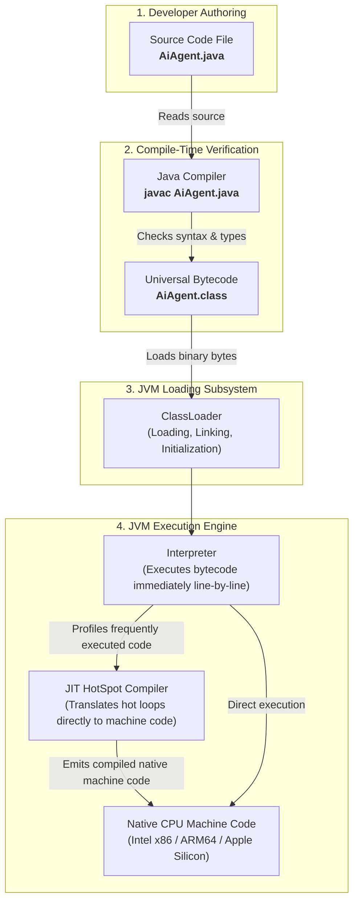
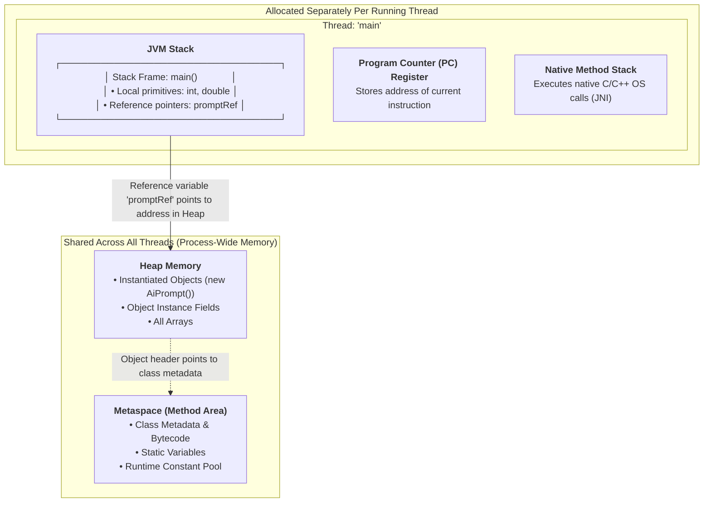

# Day_01 — Java Ecosystem, JVM Architecture, and Memory Hierarchy

| ⬅️ Previous Day | 📚 Course Hub | ➡️ Next Day |
|:---|:---:|---:|
| *🚀 Course Inception* | [All 60 Days Overview](../../README.md) | [Day 02: OOP — Classes, Objects & Memory →](../Day_02_OOP_Classes_Objects_Memory/Day_02_OOP_Classes_Objects_Memory.md) |

---

## 🎯 What You'll Understand By the End
- The structural nesting of the **JDK**, **JRE**, and **JVM**, and why developers must install the JDK.
- Exactly what the operating system searches for when reading `JAVA_HOME` and `PATH`, and how to resolve path configuration errors.
- The step-by-step journey of Java code: from human-readable `.java` text through the `javac` compiler, into universal bytecode `.class`, through the **ClassLoader**, and into native machine instructions via the **JIT (Just-In-Time) Execution Engine**.
- How the JVM arranges physical computer memory into distinct runtime data areas: **Metaspace**, the **Heap**, the **JVM Stack**, the **PC Register**, and the **Native Method Stack**.
- The physical difference between **primitive data types** (which store raw binary values directly on the stack) and **reference types** (which store memory addresses pointing to objects on the heap).
- How Java packages map directly to physical disk folders, how imports work, and how the four access modifiers protect your architecture.
- Why enterprise projects rely on build tools like **Maven** and **Gradle** instead of manually downloading library files.

---

## 🧠 The Problem This Solves

Before Java was created in 1995, writing cross-platform software was tedious, expensive, and fragile:

1. **Direct Hardware Coupling**: In compiled languages like C and C++, code is translated directly into native machine instructions—the exact `0`s and `1`s executed by a specific processor chip (such as an Intel x86 chip).
   - If you compiled a program on Windows, it ran exclusively on Windows x86 hardware.
   - Running that same software on an Apple Mac or a Linux cloud server required rewriting operating-system-specific system calls and compiling a completely separate binary.
   - Development teams spent weeks maintaining divergent codebases for every platform they wanted to support.

```
Older Native Compilers:
Source Code (.c) ──(Compiler)──> Windows x86 Binary (Crashes on macOS & Linux)
```

2. **The Fragility of Pure Interpreters**: Scripting languages (like Python or JavaScript) addressed portability by interpreting raw source code line-by-line at runtime. However, if a syntax typo or invalid operation exists on line 800 of a script, the program runs lines 1 through 799 before crashing abruptly in front of a live user.

3. **Memory Corruption & Manual Allocation**: In older languages, developers had to manually allocate blocks of system memory and remember to free them. Forgetting to free memory created **memory leaks** (exhausting RAM until the operating system crashed), while freeing memory too early caused **dangling pointers** and corrupted application data.

Java solved these problems with a unified architecture:
- **Compile Time Verification**: The Java compiler (`javac`) inspects your code upfront, catching syntax mistakes and type mismatches before any code ever touches a server.
- **Universal Intermediate Format**: Instead of producing machine-specific binary code, Java compiles source code into a platform-neutral intermediate language called **bytecode**.
- **The Virtual Machine**: A lightweight runtime engine—the **Java Virtual Machine (JVM)**—is installed on each target operating system. The JVM reads bytecode and translates it into native hardware instructions at runtime, guaranteeing **Write Once, Run Anywhere (WORA)**.
- **Managed Memory**: The JVM manages application memory automatically through isolated runtime data areas and an automated **Garbage Collector**, eliminating manual memory deallocation bugs.

---

# Module 1: The Java Ecosystem, Environment Configuration & The Execution Engine

## 📖 Core Concept: JDK vs. JRE vs. JVM

To work with Java, you must understand how its three foundational layers nest inside each other.

```
┌────────────────────────────────────────────────────────────────────────┐
│ JDK (Java Development Kit)                                             │
│  - javac (Java Compiler)                                               │
│  - javap (Disassembler / Bytecode Inspector)                           │
│  - jconsole, jshell, jar, diagnostic & profiling tools                 │
│                                                                        │
│   ┌────────────────────────────────────────────────────────────────┐   │
│   │ JRE (Java Runtime Environment)                                 │   │
│   │  - Core Standard Java Libraries (java.base, java.util, etc.)   │   │
│   │                                                                │   │
│   │   ┌────────────────────────────────────────────────────────┐   │   │
│   │   │ JVM (Java Virtual Machine)                             │   │   │
│   │   │  - ClassLoader Subsystem                               │   │   │
│   │   │  - Runtime Data Areas (Metaspace, Heap, Stack)         │   │   │
│   │   │  - Execution Engine (Interpreter + JIT Compiler + GC)  │   │   │
│   │   └────────────────────────────────────────────────────────┘   │   │
│   └────────────────────────────────────────────────────────────────┘   │
└────────────────────────────────────────────────────────────────────────┘
```

### The Gourmet Restaurant Analogy

To see how these three components cooperate, imagine an international gourmet restaurant franchise:

- **The JVM (Java Virtual Machine)** is the **Kitchen Crew**. A kitchen crew in Tokyo and a kitchen crew in New York use different stoves and power outlets (local CPU architecture and OS system calls), but both know how to execute standardized kitchen recipe cards.
- **The JRE (Java Runtime Environment)** is the **Fully Stocked Kitchen**. It includes the kitchen crew (the JVM) plus all the standard pantry ingredients, spices, pots, and utensils (the standard Java class libraries, like `java.lang.String` and `java.util.ArrayList`). An end-user who only wants to order a prepared meal needs a working kitchen (the JRE).
- **The JDK (Java Development Kit)** is the **Culinary Research & Testing Institute**. It contains the entire kitchen (JRE), but also provides recipe creation tools, quality-control inspectors (`javac`), calorie meters, and diagnostic testing equipment. As software engineers creating applications from scratch, **we always install the JDK**.

> 💡 **New Word Alert — "Bytecode"**: A compact, optimized set of computer instructions that is not designed for any physical processor chip, but is instead executed by the Java Virtual Machine. Bytecode files always end with the `.class` extension.

> 💡 **New Word Alert — "JVM (Java Virtual Machine)"**: An abstract software execution engine that runs in your computer's memory. It takes compiled `.class` bytecode and translates it into the native instructions of your physical computer processor on the fly.

> 💡 **New Word Alert — "JDK (Java Development Kit)"**: The full software development package that contains the compiler (`javac`), developer testing utilities, and the runtime environment needed to build Java software.

---

## ⚙️ Environment Variables: Configuring `JAVA_HOME` and `PATH`

When you open a terminal and type `javac`, how does your operating system know which program to run? It relies on two fundamental environment variables.

### 1. What the Operating System Looks For

- **`JAVA_HOME`**: An environment variable that stores the absolute directory path where your JDK is installed (for example: `C:\Program Files\Eclipse Adoptium\jdk-21.0.2.13-hotspot` on Windows, or `/Library/Java/JavaVirtualMachines/temurin-21.jdk/Contents/Home` on macOS). Build tools like Maven, Gradle, and enterprise servers (such as Tomcat or Spring Boot plugins) read `JAVA_HOME` to locate the JDK libraries.
- **`PATH`**: An operating system list of directories where the terminal searches for executable commands. When you type `java` or `javac` in your terminal, the operating system inspects every directory in your `PATH` variable from left to right. If `%JAVA_HOME%\bin` (or `$JAVA_HOME/bin`) is included in your `PATH`, the OS locates `javac.exe` (or `javac` on Unix) and executes it immediately.

### 2. Verifying Your Setup in Terminal

Open your terminal or command prompt and run:

```bash
# Verify the runtime launcher version
java -version

# Verify the compiler version
javac -version

# Print the configured home path (Windows PowerShell)
$env:JAVA_HOME

# Print the configured home path (macOS / Linux)
echo $JAVA_HOME
```

### 3. Troubleshooting Common Configuration Failures

| Error Message | Root Cause | Immediate Fix |
|:---|:---|:---|
| `'javac' is not recognized as an internal or external command` | The JDK's `bin` folder is missing from your system `PATH` variable. | Add `%JAVA_HOME%\bin` to your system `PATH` and restart your terminal. |
| `The JAVA_HOME environment variable is not defined correctly` | Build tools (Maven/Gradle) checked for `JAVA_HOME` and found either an empty variable or a path pointing to a deleted folder. | Set `JAVA_HOME` to the root folder of your installed JDK (do **not** include the `/bin` subfolder in `JAVA_HOME`). |
| `UnsupportedClassVersionError: ... has been compiled by a more recent version of the Java Runtime` | Your code was compiled with a newer JDK (e.g., JDK 21), but your current terminal `PATH` is invoking an older JRE/JVM (e.g., Java 11 or 17). | Ensure `JAVA_HOME` and `PATH` point to the identical JDK version. |

---

## 🔄 The Java Compilation and Execution Cycle

How does a line of Java text become electrical pulses in your CPU? The journey occurs in four structured phases:



*This diagram traces the full lifecycle of a Java application. Source code (`.java`) is verified and converted by `javac` into universal bytecode (`.class`). The JVM ClassLoader loads these instructions into memory, where the Execution Engine uses an interpreter for immediate startup and the JIT compiler to compile performance-critical code directly into native processor instructions.*

### The Three Internal JVM Subsystems

1. **The ClassLoader Subsystem**:
   - **Loading**: Reads the `.class` binary file from your hard drive into JVM memory.
   - **Linking**: Verifies that the bytecode follows JVM security rules, allocates memory for `static` fields, and resolves symbolic references (names of classes and methods) into direct memory references.
   - **Initialization**: Executes static initializers and assigns initial values to `static` variables.

2. **The Execution Engine**:
   - **The Bytecode Interpreter**: Reads bytecode instructions one by one and executes them immediately. This ensures your program boots instantly without waiting for a lengthy compilation step.
   - **The JIT (Just-In-Time) Compiler**: As the interpreter runs, it monitors your code for "hot spots"—methods or loops executed thousands of times. The JIT takes these hot sections, translates them directly into raw native machine code, and caches them in memory. The next time that method runs, the CPU executes it at full native speed.
   - **The Garbage Collector (GC)**: An automated background process that tracks objects residing in the Heap. When an object is no longer reachable by any running thread, the Garbage Collector reclaims its memory automatically.

---

# Module 2: Under the Hood — JVM Memory Hierarchy & Runtime Data Areas

When the JVM boots, the operating system allocates a block of RAM to it. The JVM subdivides this RAM into five distinct **Runtime Data Areas**.

## 🗺️ Visual Overview: JVM Memory Architecture



*This diagram illustrates how the JVM partitions memory. Metaspace and Heap are shared across all threads in the application, housing class blueprints and instantiated objects. In contrast, each thread receives its own private JVM Stack (holding Stack Frames with local variables), PC Register (tracking execution position), and Native Method Stack.*

---

## 🔬 The 5 Runtime Data Areas Explained

### 1. Metaspace (Formerly the Method Area)
- **What lives here**: Class blueprints (class structure, method names, parameter types), the Runtime Constant Pool (string literals and numeric constants), and `static` variables.
- **Thread Sharing**: Shared across all threads.
- **Physical Location**: Prior to Java 8, this lived in JVM-managed memory called "PermGen" (Permanent Generation), which frequently ran out of memory. Since Java 8, Metaspace is allocated in **native operating system memory**, expanding dynamically as new classes are loaded.

### 2. Heap Memory
- **What lives here**: Every single object created with the `new` keyword, all arrays, and the instance fields belonging to those objects.
- **Thread Sharing**: Shared across all threads. Any thread with a memory pointer can read or update an object on the Heap.
- **Lifecycle**: Managed entirely by the **Garbage Collector**. You never manually free heap memory; when no active reference variable points to an object, the GC marks it for deletion.

### 3. JVM Stack & Stack Frames
- **What lives here**: Every time a thread calls a method, the JVM pushes a new block of memory called a **Stack Frame** onto that thread's private Stack.
- **Contents of a Stack Frame**:
  1. **Local Variable Array**: Stores primitive local variables (like `int tokens = 42;`) and **reference variables** (like `AiPrompt prompt = ...;`).
  2. **Operand Stack**: A scratchpad used by the JVM bytecode interpreter to perform arithmetic calculations and evaluate method parameters.
  3. **Frame Data**: Houses the return value and exception dispatch information.
- **Lifecycle**: Strictly Last-In, First-Out (LIFO). When a method returns, its Stack Frame is instantly popped and its memory is reclaimed—with zero Garbage Collector overhead!

### 4. Program Counter (PC) Register
- **What it does**: A dedicated, ultra-small register maintained for each thread. It stores the memory address of the JVM bytecode instruction currently being executed.
- **Why it matters**: If the operating system pauses a thread to let another thread execute (context switching), the PC register preserves the exact line of bytecode where that thread paused so it can resume seamlessly.

### 5. Native Method Stack
- **What it does**: Tracks execution when your Java application calls underlying C or C++ operating-system-level libraries using the **Java Native Interface (JNI)** (such as file system interactions, network socket opening, or hardware graphics routines).

---

## 🧭 Primitives vs. Reference Types: Raw Values vs. Memory Pointers

Java categorizes all data into two fundamental families. Understanding how they physically live in memory prevents subtle bugs.

| Category | Data Types | How It Is Stored in Memory | Example |
|:---|:---|:---|:---|
| **Primitive Types** | `byte`, `short`, `int`, `long`, `float`, `double`, `boolean`, `char` | Stores the **actual raw bits/value** directly inside the Stack Frame. | `int score = 95;`<br>*(The number 95 sits directly in the stack slot).* |
| **Reference Types** | Classes, Interfaces, Arrays, Records, Strings | Stores a **memory pointer (address)** in the Stack Frame, which points to the real object sitting on the Heap. | `String model = new String("Claude");`<br>*(Stack slot holds address `0x7A4F`; the text `"Claude"` lives at `0x7A4F` on the Heap).* |

> 💡 **New Word Alert — "Memory Pointer / Reference"**: A 32-bit or 64-bit numerical value representing an address in RAM where an object's actual data is physically located.

---

## 💻 Concrete Code Walkthrough: Tracing Memory Placement

Let's trace a small, complete Java program through compilation, loading, and memory placement.

```java
package com.genai.foundations;

public class AiPromptRunner {

    // 1. Static variable: Lives in Metaspace (shared across entire application)
    public static final String DEFAULT_PROVIDER = "Anthropic";

    public static void main(String[] args) {
        // 2. Local primitive: Value 1500 stored directly on the Stack inside main's frame
        int maxTokens = 1500;

        // 3. Local reference: 'prompt' pointer lives on the Stack;
        //    The actual PromptPayload object instance is allocated on the Heap
        PromptPayload prompt = new PromptPayload("Explain quantum computing", 0.7);

        // 4. Method invocation: Pushes a new Stack Frame for executeCall()
        int returnedTokens = executeCall(prompt, maxTokens);

        System.out.println("Call completed using tokens: " + returnedTokens);
    }

    public static int executeCall(PromptPayload payload, int tokenLimit) {
        // A new Stack Frame is created here!
        // 'payload' holds a copy of the pointer pointing to the same Heap object
        // 'tokenLimit' holds a copied primitive value (1500)
        boolean isSafe = payload.temperature() <= 1.0;
        return isSafe ? tokenLimit : 0;
        // When this method returns, this Stack Frame is instantly destroyed!
    }
}

// Simple record representing our prompt data
record PromptPayload(String userQuery, double temperature) {}
```

### Memory Allocation Trace Table

| Phase / Line | Memory Area | What Actually Happens Under the Hood |
|:---|:---|:---|
| **Class Loading** | **Metaspace** | The JVM ClassLoader reads `AiPromptRunner.class`. It allocates class metadata, method bytecode, and stores the static string literal `"Anthropic"` in Metaspace. |
| `public static void main(...)` | **JVM Stack** | The JVM creates a **Stack Frame** for `main()`. The thread's **PC Register** points to instruction offset `0`. |
| `int maxTokens = 1500;` | **JVM Stack** | An integer slot inside `main`'s Stack Frame is filled with the raw binary representation of `1500`. |
| `new PromptPayload(...)` | **Heap** | The JVM calculates the memory required for `PromptPayload` and carves out a new object on the **Heap** at address `0x4A12`. Its fields (`userQuery` reference and `temperature` primitive) are initialized on the Heap. |
| `PromptPayload prompt = ...` | **JVM Stack** | The local variable `prompt` inside `main`'s Stack Frame is assigned the memory pointer address `0x4A12`. |
| `executeCall(prompt, maxTokens)` | **JVM Stack** | A **second Stack Frame** for `executeCall()` is pushed on top of the Stack. Java passes arguments strictly by value: a copy of pointer `0x4A12` is passed into `payload`, and the number `1500` is copied into `tokenLimit`. |
| `return isSafe ? ...` | **JVM Stack** | The method finishes. The `executeCall()` Stack Frame is **popped off the stack and deallocated**. Control and the PC Register return to `main()`. |

---

# Module 3: Project Architecture — Packages, Access Specifiers & Build Tools

## 📦 Package Structures and Directory Mapping

In enterprise Java, code is never written in loose, unorganized files. Java enforces strict architectural hygiene through **packages**.

### 1. Reverse Domain Name Convention
Package names are written in lowercase, starting with your organization's reversed internet domain name to prevent naming collisions across global libraries:
- Company domain: `anthropic.com`
- Java package: `com.anthropic.client.auth`

### 2. The Physical Directory Rule
Java mandates that your package declaration **must match your physical operating system folder structure exactly**:

```
Project Root Folder:
└── src/
    └── main/
        └── java/
            └── com/
                └── genai/
                    └── foundations/
                        └── AiPromptRunner.java   <-- package com.genai.foundations;
```

If the file `AiPromptRunner.java` declares `package com.genai.foundations;`, but you save it directly inside `src/AiPromptRunner.java`, the compiler rejects it with a fatal error: `Package declaration does not match directory path`.

---

## 🔒 Access Modifiers: Guarding Your Architecture

Java provides four access levels to protect sensitive application data and internals:

```
Most Restrictive ───────────────────────────────────────────► Most Accessible
[private]  ──►  [package-private (default)]  ──►  [protected]  ──►  [public]
```

| Modifier | Keyword | Accessible from Same Class? | Accessible from Same Package? | Accessible from Subclass in Different Package? | Accessible from Anywhere in Universe? | Real-World Architecture Role |
|:---|:---|:---:|:---:|:---:|:---:|:---|
| **Private** | `private` | ✅ Yes | ❌ No | ❌ No | ❌ No | Internal fields (API keys, raw tokens, helper methods). |
| **Package-Private** | *(no keyword)* | ✅ Yes | ✅ Yes | ❌ No | ❌ No | Internal module helpers; classes that collaborate within the package. |
| **Protected** | `protected` | ✅ Yes | ✅ Yes | ✅ Yes | ❌ No | Extensible framework hooks for subclasses. |
| **Public** | `public` | ✅ Yes | ✅ Yes | ✅ Yes | ✅ Yes | The official public API of your class or service. |

---

## 🛠️ Build Tools Overview: Why Maven and Gradle Exist

When you write real-world AI applications, your code relies on third-party libraries:
- HTTP clients to call LLM endpoints (like OpenAI or Anthropic).
- JSON serialization libraries (like Jackson).
- Vector database connectors.

### The "Jar Hell" Problem (Before Build Tools)

In early Java development, developers had to manually search the web for compressed library files called **JARs** (Java ARchives), download them, and place them into a `/lib` folder.

This quickly caused catastrophic failures:
- If your app needs `Library-A` (version 2.0), and `Library-A` needs `Library-B` (version 1.5), you had to locate and download `Library-B` by hand. This is called a **transitive dependency**.
- If another library in your project needed `Library-B` (version 1.0), the two versions clashed, causing runtime crashes known as **Jar Hell**.

### How Modern Build Tools Solve This

Modern tools like **Apache Maven** and **Gradle** act as automated software factories and pantry managers:
1. **Automated Dependency Resolution**: You declare what you need in one clean configuration file (`pom.xml` for Maven or `build.gradle` for Gradle). The build tool queries a central public repository (Maven Central), downloads the exact library, finds all of its sub-dependencies, and resolves version conflicts automatically.
2. **Standardized Directory Convention**: Every Maven and Gradle project in the world follows the identical folder layout (`src/main/java`, `src/test/java`), meaning any Java engineer can open your project and be productive immediately.
3. **Build Lifecycle Automation**: A single command compiles your code, executes automated unit tests, and packages your entire application into an executable `.jar` file ready for cloud deployment.

#### Minimal Maven `pom.xml` Example:

```xml
<project xmlns="http://maven.apache.org/POM/4.0.0"
         xmlns:xsi="http://www.w3.org/2001/XMLSchema-instance"
         xsi:schemaLocation="http://maven.apache.org/POM/4.0.0 
         https://maven.apache.org/xsd/maven-4.0.0.xsd">
    <modelVersion>4.0.0</modelVersion>

    <groupId>com.genai</groupId>
    <artifactId>ai-gateway</artifactId>
    <version>1.0.0</version>

    <properties>
        <maven.compiler.source>21</maven.compiler.source>
        <maven.compiler.target>21</maven.compiler.target>
    </properties>

    <!-- Declare external libraries here -->
    <dependencies>
        <dependency>
            <groupId>org.slf4j</groupId>
            <artifactId>slf4j-api</artifactId>
            <version>2.0.12</version>
        </dependency>
    </dependencies>
</project>
```

---

## 🔑 Key Terminology

| Term | Plain-English Meaning |
|:---|:---|
| **JVM (Java Virtual Machine)** | The runtime engine that loads bytecode and translates it into native hardware instructions. |
| **JDK (Java Development Kit)** | The complete software toolkit containing the compiler (`javac`), runtime, and developer diagnostic utilities. |
| **Metaspace** | The memory area in native OS memory where the JVM stores class definitions, static variables, and constants. |
| **Heap** | The shared pool of memory where all object instances created with `new` and all arrays are allocated. |
| **JVM Stack** | The fast, thread-local memory area where Stack Frames track method executions and local primitive variables. |
| **Stack Frame** | An isolated block of memory pushed onto the stack for a single method call, holding local variables and intermediate calculations. |
| **Primitive Type** | A basic data type (like `int` or `boolean`) that stores its raw binary value directly inside the Stack Frame. |
| **Reference Type** | A complex data type whose variable stores a memory pointer (address) pointing to an object residing on the Heap. |
| **Package** | A namespace mechanism that organizes related classes into physical directory hierarchies and prevents name collisions. |
| **Transitive Dependency** | A library that your direct library depends upon to function. |

---

## ⚠️ Common Beginner Mistakes

### 1. Appending `.class` or `.java` When Running the `java` Command

Beginners often pass the file name with its extension to the `java` runtime command.

❌ **Wrong Way**:
```bash
javac HelloGenAI.java
java HelloGenAI.class    # Error: Could not find or load main class HelloGenAI.class
```

✅ **Right Way**:
```bash
javac HelloGenAI.java
java HelloGenAI          # Provide the CLASS name only, never the file extension!
```
*Why it is wrong*: The `javac` compiler takes a **file path** (`HelloGenAI.java`), but the `java` runtime launcher takes a **fully-qualified class name** (`HelloGenAI`). Appending `.class` causes Java to search for an inner class named `class` inside a package named `HelloGenAI`.

---

### 2. Confusing `JAVA_HOME` with the `bin` Subdirectory

Setting `JAVA_HOME` directly to the `bin` folder breaks build tools.

❌ **Wrong Way**:
```bash
JAVA_HOME="C:\Program Files\Eclipse Adoptium\jdk-21.0.2.13-hotspot\bin"
```

✅ **Right Way**:
```bash
JAVA_HOME="C:\Program Files\Eclipse Adoptium\jdk-21.0.2.13-hotspot"
PATH="%JAVA_HOME%\bin;%PATH%"
```
*Why it is wrong*: Tools like Maven and Gradle expect `JAVA_HOME` to point to the **root** of the JDK installation. They internally append `/lib` or `/bin` to find specific assets. If your `JAVA_HOME` already ends in `/bin`, Maven will search for `bin/bin/java` and fail immediately.

---

### 3. Assuming Two Identical Object References Share Memory

Beginners often assume assigning one object variable to another creates a separate duplicate copy of the data.

❌ **Wrong Way**:
```java
PromptPayload p1 = new PromptPayload("Analyze prompt", 0.5);
PromptPayload p2 = p1; // Does NOT copy the object!

// Both p1 and p2 point to the EXACT SAME object on the Heap!
```

✅ **Right Way**:
```java
// If you need an independent copy, instantiate a new instance:
PromptPayload p1 = new PromptPayload("Analyze prompt", 0.5);
PromptPayload p2 = new PromptPayload(p1.userQuery(), p1.temperature());
```
*Why it is wrong*: Primitive variables copy their raw value. Reference variables copy only the **memory pointer**. Assigning `p2 = p1` merely copies the memory address (e.g., `0x4A12`). Both variables now point to the identical object on the Heap.

---

## ✅ Best Practices

1. **Standardize on Modern LTS (Java 21)**: Always use modern Long-Term Support (LTS) releases like Java 21 for production applications to leverage Metaspace performance optimizations and modern language features.
2. **Keep the Stack Fast and Ephemeral**: Keep methods focused and short. When methods are compact, Stack Frames stay small and memory is released almost instantaneously when the method returns.
3. **Always Declare Explicit Packages**: Never write Java classes in the default (empty) package. Every production class must reside in a declared package matching its physical folder hierarchy.
4. **Prefer Private by Default**: Make all class fields `private`. Expose access only through well-defined methods or public accessors.

---

## 🔭 Looking Ahead
In **Day_02**, we will dive into Object-Oriented Programming (OOP) to master how classes act as blueprints to create objects, how constructors initialize Heap memory, and how encapsulation prevents unauthorized data mutation.

---

## 📝 Quick Recap
- The **JDK** is the full toolkit (compiler + tools + JRE); the **JRE** is the runtime package; the **JVM** is the virtual execution engine.
- `javac` compiles `.java` text files into platform-neutral `.class` bytecode; the **JVM** uses an interpreter and a **JIT compiler** to run bytecode at native hardware speeds.
- The JVM partitions memory into **Metaspace** (class metadata and static fields), **Heap** (all instantiated objects and arrays), and thread-local **JVM Stacks** (Stack Frames holding local variables).
- **Primitives** store raw values directly in Stack Frames; **reference variables** store memory addresses pointing to objects living on the Heap.
- Packages organize code into physical directory hierarchies and avoid naming collisions across global libraries.
- Build tools like **Maven** and **Gradle** automate dependency management, compilation, testing, and packaging.

---

## 🧪 Try It Yourself

1. **Terminal Inspection**: Open your terminal. Run `javac -version` and `java -version`. Check whether your operating system environment has `JAVA_HOME` properly configured by echoing the variable.
2. **Bytecode Disassembly**: Write a minimal class with an `int` variable and a `String` variable. Compile it using `javac`, and then run `javap -c YourClassName` in your terminal to inspect the low-level JVM bytecode instructions (`bipush`, `ldc`, `astore_1`).
3. **Package Mapping Verification**: Create a folder structure `src/com/experiment/` and place a file `Tester.java` inside it with `package com.experiment;`. Compile it from your project root using `javac src/com/experiment/Tester.java` and run it with `java -cp src com.experiment.Tester`.
