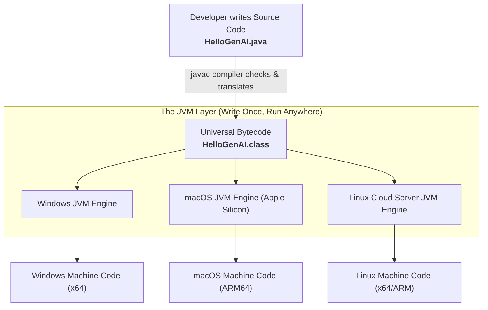

# Day_01 — Java Ecosystem and Setup

| ⬅️ Previous Day | 📚 Course Hub | ➡️ Next Day |
|:---|:---:|---:|
| *🚀 Course Inception* | [All 60 Days Overview](../../README.md) | [Day 02: OOP — Classes, Objects & Memory →](../Day_02_OOP_Classes_Objects_Memory/Day_02_OOP_Classes_Objects_Memory.md) |

---

## 🎯 What You'll Understand By the End
- How Java transforms human-written text into running software on any operating system without rewriting code.
- The precise differences between the **JDK**, the **JRE**, and the **JVM** — and why you need the JDK as a developer.
- What **bytecode** is and how it solves the classic "works on my machine" failure.
- How to write, compile, inspect, and run your first minimal AI-ready Java program from the command line.
- What build tools like **Maven** and **Gradle** do at a high level to save you from dependency chaos.

---

## 🧠 The Problem This Solves

Before Java appeared in 1995, software developers faced a massive, expensive problem: **platform lock-in**.

In older compiled languages (like C and C++), code compiles directly into raw machine code — the specific binary `0`s and `1`s understood by a single physical computer processor. 

- A program compiled on an Intel computer running Windows produces an executable binary tailored strictly for Windows and Intel chips.
- If you copy that exact compiled file to a Linux cloud server or an Apple Mac, it will not run. It crashes immediately because the operating system calls and processor instructions are completely different.
- Development teams had to maintain separate codebases and compile distinct binaries for every single operating system and processor architecture.

```
Older Compiled Languages:
Source Code (.c) ──(Compiler)──> Windows x86 Binary (Fails on Mac & Linux)
```

Purely interpreted languages (like Python) solved this portability issue by reading source code line-by-line at runtime. However, that introduced a different challenge: **runtime vulnerability and slower execution**. If a Python script contains a typo or incompatible data type on line 500, it runs lines 1 through 499 before crashing right in front of a live user.

Java introduced a hybrid two-stage model: **compile once into an universal intermediate format, then run anywhere on an optimized virtual engine.**

---

## 📖 Core Concept, Explained Simply

Java divides the process of running code into two distinct stages:

1. **Compile Time**: A tool called the Java compiler (`javac`) checks your code for syntax and type errors. If your code is valid, it translates your human-readable file (`HelloGenAI.java`) into a standardized, compact set of instructions called **bytecode** (`HelloGenAI.class`).
2. **Runtime**: A software engine installed on the computer, called the **Java Virtual Machine (JVM)**, reads that bytecode and translates it into the local processor's native machine code at lightning speed.

Because every operating system has its own customized JVM implementation, the exact same `.class` file runs identically on Windows, macOS, or Linux. This is Java's famous promise: **Write Once, Run Anywhere (WORA)**.

### The Restaurant Franchise Analogy

Think of Java like an international gourmet restaurant chain:

- **Source Code (`.java`)**: A chef's recipe written in detailed English.
- **The Compiler (`javac`)**: The master culinary inspection board. They review your recipe. If you forgot an essential ingredient or misspelled a command, they reject the recipe immediately before any cooking starts. Once approved, they translate the recipe into a standardized, universal cooking card (**Bytecode** / `.class`).
- **The JVM (Java Virtual Machine)**: The local kitchen crew. A kitchen crew in Tokyo (macOS ARM chip) and a kitchen crew in Frankfurt (Linux Intel server) both receive the exact same standardized cooking card. Each crew uses their local kitchen equipment (native CPU instructions) to prepare the dish perfectly.
- **The JRE (Java Runtime Environment)**: The local kitchen crew plus all standard ingredients, spices, and pre-chopped vegetables (the standard Java class libraries).
- **The JDK (Java Development Kit)**: The complete culinary institute toolkit. It includes the recipe writing tools, the inspection board (`javac`), testing tools, diagnostic utilities, and the kitchen crew (`JVM`). As a software engineer, you always install the **JDK**.

### High-Level Build Tools: Why Maven and Gradle Exist

As software grows, your code will rely on third-party libraries — such as an HTTP client to call OpenAI, or a JSON parser to process responses. 

In the early days of Java, developers had to manually download compressed library files called **JARs** (Java Archives), track version numbers, and copy them into project folders by hand. If Library A needed Library B version 2.0, but Library C needed Library B version 1.0, projects broke into what developers called "Jar Hell."

Modern build tools like **Apache Maven** and **Gradle** solve this:
- They act like an automated pantry manager.
- You declare the name and version of the library you need in a single configuration file (`pom.xml` for Maven, `build.gradle` for Gradle).
- The tool automatically downloads the library, resolves all secondary dependencies, runs your automated tests, and packages your application into a deployable bundle.

---

## 🗺️ Visual Overview



*This diagram illustrates Java's execution pipeline. Your human-readable `.java` file is compiled once into platform-neutral `.class` bytecode. That identical bytecode is then executed by the specific JVM built for each operating system, producing native hardware instructions.*

---

## 💻 Code Walkthrough

Here is a minimal, complete, runnable Java 17+ program representing an AI gateway entry point:

```java
public class HelloGenAI {
    public static void main(String[] args) {
        String modelName = "Claude 3.5 Sonnet";
        int promptTokens = 42;

        System.out.println("AI Gateway Online!");
        System.out.println("Routing prompt to: " + modelName);
        System.out.println("Estimated token count: " + promptTokens);
    }
}
```

### Line-by-Line Breakdown

| Line / Element | Plain-English Explanation |
|:---|:---|
| `public class HelloGenAI` | Defines a container for code called a **class**. In Java, all code must live inside a class, and the file name **must** be `HelloGenAI.java`. |
| `public static void main(String[] args)` | The official starting doorway of every standalone Java program. When the JVM boots your application, it specifically searches for this method signature. |
| `public` | Access modifier meaning this method can be reached and triggered from outside the class by the JVM launcher. |
| `static` | Allows the method to run immediately without needing to allocate an object instance in memory first. |
| `void` | Specifies the return type. `void` means this method completes its tasks and returns no value back to the caller. |
| `String[] args` | Parameter list that collects any command-line arguments passed to the program when running in the terminal. |
| `String modelName = "...";` | Creates a variable that stores a sequence of text characters. |
| `int promptTokens = 42;` | Creates an integer variable that holds a whole number. |
| `System.out.println(...);` | Prints text to the terminal console, followed by a new line. |

---

## 🔑 Key Terminology

| Term | Plain-English Meaning |
|:---|:---|
| **Source Code (`.java`)** | The text file written by a programmer using Java language syntax. |
| **Compiler (`javac`)** | The developer command-line tool that inspects source code and converts it into bytecode. |
| **Bytecode (`.class`)** | Compact, platform-independent binary instructions designed to be executed by a JVM. |
| **JVM (Java Virtual Machine)** | The software runtime engine that loads bytecode and translates it into native processor instructions. |
| **JRE (Java Runtime Environment)** | The package containing the JVM plus standard Java libraries; needed to run pre-built applications. |
| **JDK (Java Development Kit)** | The full developer toolkit containing the compiler (`javac`), runtime launcher (`java`), and developer utilities. |
| **Maven (`pom.xml`)** | An industry-standard build tool that automates dependency downloads, compilation, testing, and packaging. |
| **JIT (Just-In-Time) Compiler** | A component inside the JVM that monitors running bytecode and compiles frequently executed sections directly into raw machine code for high performance. |

---

## ⚠️ Common Beginner Mistakes

### 1. Mismatching the File Name and the Public Class Name
Java requires that a public class name matches the `.java` file name character for character, including capitalization.

❌ **Wrong Way** (File saved as `hellogenai.java`):
```java
public class HelloGenAI {
    // Fails to compile!
    // Error: class HelloGenAI is public, should be declared in a file named HelloGenAI.java
}
```

✅ **Right Way** (File saved as `HelloGenAI.java`):
```java
public class HelloGenAI {
    // Compiles cleanly with javac HelloGenAI.java
}
```
*Why it is wrong*: The Java compiler and classloader rely on the file system matching class names directly to locate dependencies quickly.

---

### 2. Modifying the Signature of `main`
The JVM searches for an exact method signature to start execution. Changing any keyword prevents the program from starting.

❌ **Wrong Way**:
```java
public class HelloGenAI {
    public void main() {
        System.out.println("Hello!"); // Error: Main method not found in class HelloGenAI
    }
}
```

✅ **Right Way**:
```java
public class HelloGenAI {
    public static void main(String[] args) {
        System.out.println("Hello!");
    }
}
```
*Why it is wrong*: Without `static`, the JVM would not know how to run the method without constructing an object first. Without `String[] args`, it cannot accept startup options.

---

### 3. Appending `.class` When Executing with the `java` Command
Beginners often supply the file extension when launching their compiled program.

❌ **Wrong Way (in terminal)**:
```bash
javac HelloGenAI.java
java HelloGenAI.class   # Error: Could not find or load main class HelloGenAI.class
```

✅ **Right Way (in terminal)**:
```bash
javac HelloGenAI.java   # Generates HelloGenAI.class
java HelloGenAI         # Provide the class name ONLY, not the file extension!
```
*Why it is wrong*: The `java` command expects the fully qualified class name, not a file path. Adding `.class` causes Java to look for a nested class named `class` inside a package named `HelloGenAI`.

---

### 4. Installing the JRE Instead of the JDK
If you install only the Java Runtime Environment, your computer will have the `java` command to run programs, but running `javac` will output `'javac' is not recognized as an internal or external command`.

❌ **Wrong Way**:
Installing a standalone JRE package.

✅ **Right Way**:
Download and install a full **JDK 21** distribution (such as Eclipse Temurin, Amazon Corretto, or Oracle OpenJDK), and ensure your operating system's `JAVA_HOME` environment variable points to the JDK directory.

---

## ✅ Best Practices

1. **Standardize on Modern Long-Term Support (LTS) Java**: Always use **Java 21 LTS** for new projects to access modern language features, enhanced performance, and current enterprise library support.
2. **Strictly Follow PascalCase for Classes**: Capitalize the first letter of each word in class names (e.g., `AiPromptService`, `TokenCounter`) to adhere to Java community standards.
3. **Keep `main` Lean**: Treat the `main` method as a bootstrap ignition key. Use it to configure and launch your application, rather than writing extensive business logic directly inside it.
4. **Use Build Tools for Real Projects**: While compiling single files with `javac` is essential for understanding the basics, always use **Maven** or **Gradle** for projects with external dependencies.

---

## 🔭 Looking Ahead
In **Day_02**, we will explore Object-Oriented Programming (OOP) to see how classes act as blueprints to create objects, and how computer memory is split between the **Stack** and the **Heap**.

---

## 📝 Quick Recap
- You write human-readable code in `.java` text files.
- The `javac` compiler converts `.java` files into universal `.class` bytecode while catching syntax and type errors.
- The **JVM** executes bytecode on any host operating system, fulfilling the "Write Once, Run Anywhere" principle.
- The **JDK** is the complete developer kit containing the compiler, tools, and runtime engine.
- Every standalone Java application starts execution at `public static void main(String[] args)`.
- Tools like **Maven** automate downloading third-party libraries and managing build lifecycles.

---

## 🧪 Try It Yourself

1. **Write and Execute**: Create a file named `AiModelProfile.java`. Write a `main` method that outputs an AI model name, its context window size in tokens, and whether it supports multimodal vision inputs. Compile and run it from your command line.
2. **Inspect the Bytecode**: After compiling `AiModelProfile.java`, run `javap -c AiModelProfile` in your terminal. Observe the low-level JVM instructions generated by the compiler.
3. **Trigger a Compiler Rejection**: Inside `AiModelProfile.java`, intentionally assign a text string to an integer variable (for example, `int tokens = "twenty thousand";`). Run `javac AiModelProfile.java` and observe how Java's compile-time type safety catches the mistake before any code can run.
