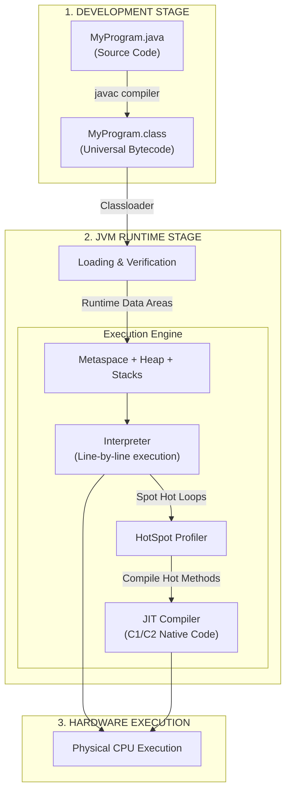

# Phase_01, Day_01 — Java Ecosystem, JVM Architecture, and Memory Hierarchy

| ⬅️ Previous Day | 📚 Course Hub | ➡️ Next Day |
|:---|:---:|---:|
| *🚀 Course Inception* | [Course Hub](../../README.md) | [Day 02: OOP — Classes, Objects & Memory →](../Day_02_OOP_Classes_Objects_Memory/Day_02_OOP_Classes_Objects_Memory.md) |

---

## 🎯 What You'll Understand By the End

- The physical and architectural boundaries between the **JDK**, **JRE**, and **JVM**, and why developers must install the JDK while end users only need a runtime.
- How the host operating system resolves command-line binary pointers using `JAVA_HOME` and `PATH`, and how to debug path resolution failures.
- The step-by-step lifecycle of Java code: from human-readable `.java` source code to platform-independent `.class` bytecode via `javac`, through the **ClassLoader Subsystem** (Loading, Linking, Initialization), and into raw native machine execution via the **Interpreter** and **HotSpot JIT Compiler**.
- The internal memory architecture of the JVM: the physical roles of **Metaspace**, **Heap Space**, **JVM Thread Stacks** (including Local Variable Arrays, Operand Stacks, and Frame Data), **Program Counter (PC) Registers**, and **Native Method Stacks**.
- The **Memory-First Mental Model**: how the JVM stores raw bits for primitive types directly on the Stack versus pointer memory addresses for reference objects living on the Heap.
- Why modern Java applications organize code using package namespaces matching physical disk paths, and why build tools like **Maven** are required for dependency resolution.
- How to set up and verify a production-ready Java 21 development environment with Maven and Docker.

---

## 🧠 The Problem This Solves / Why This Comes Up

Before Java was created in 1995, building production software suffered from three crippling engineering bottlenecks:

### 1. Direct CPU Coupling (The Machine Code Dilemma)
In natively compiled languages like C and C++, source code translates directly into raw machine code — the exact sequence of binary `0`s and `1`s understood by a specific central processing unit (such as an Intel x86 chip):

```
Older Native Compilers:
Source Code (.c) ──(Compiler)──> Windows x86 Binary (Fails completely on macOS & Linux)
```

- A binary compiled on Windows relied on the Windows kernel API and Intel instruction sets.
- Running that exact same application on a Mac (ARM) or a Linux cloud server failed immediately because operating system system calls and CPU architectures were completely different.
- Engineering teams were forced to maintain divergent codebases, separate build toolchains, and recompile distinct binaries for every operating system and processor architecture in production.

### 2. The Fragility of Pure Interpreters
Scripting languages (like Python or JavaScript) attempted to solve portability by interpreting raw source code line-by-line at runtime. However, pure interpretation introduces two severe drawbacks:
- **Runtime Crashes**: If a syntax error or type mismatch exists on line 800 of a script, the program runs lines 1 through 799 before crashing abruptly in front of a live user.
- **Performance Deficits**: Interpreting and parsing human-readable text into CPU instructions on the fly during every loop execution is 10x to 50x slower than running compiled instructions.

### 3. Manual Memory Management Disasters
In older languages, developers had to manually request blocks of system RAM and remember to release them when finished:
- **Memory Leaks**: Forgetting to free memory slowly consumed system RAM until the host server crashed.
- **Dangling Pointers & Segmentation Faults**: Freeing memory while another part of the program was still using it corrupted data or triggered catastrophic segmentation faults.

### How Java Solved All Three
Java solved these challenges by decoupling compilation from physical hardware execution:
- **Compile-Time Verification**: The Java compiler (`javac`) inspects your code upfront, catching type mismatches, missing symbols, and syntax errors before the program ever runs.
- **Universal Intermediate Format**: Instead of targeting a physical CPU, Java compiles into an optimized, platform-neutral instruction set called **bytecode** (`.class` files).
- **The Virtual Machine**: The **Java Virtual Machine (JVM)** runs on top of the host operating system, translating universal bytecode into native hardware instructions on the fly (**Write Once, Run Anywhere**).
- **Automated Memory Safety**: Memory is partitioned into specialized runtime data areas, and an automated **Garbage Collector** safely reclaims unreferenced objects, eliminating manual memory deallocation bugs.

---

# Section 1: Java Ecosystem Architecture — JDK vs. JRE vs. JVM

---

## 📖 Core Concept, Explained Simply

To master Java, you must visualize three concentric layers nested inside each other:

```
┌────────────────────────────────────────────────────────────────────────┐
│ JDK (Java Development Kit)                                             │
│  - Developer Binaries: javac (compiler), javap (disassembler), jshell  │
│  - Packaging & Diagnostics: jar, jconsole, jdb (debugger)              │
│                                                                        │
│   ┌────────────────────────────────────────────────────────────────┐   │
│   │ JRE (Java Runtime Environment)                                 │   │
│   │  - Core Standard Java Libraries (java.base, java.util, etc.)   │   │
│   │                                                                │   │
│   │   ┌────────────────────────────────────────────────────────┐   │   │
│   │   │ JVM (Java Virtual Machine)                             │   │   │
│   │   │  - ClassLoader Subsystem (Loading, Linking, Init)      │   │   │
│   │   │  - Runtime Data Areas (Metaspace, Heap, Stack)         │   │   │
│   │   │  - Execution Engine (Interpreter + JIT Compiler + GC)  │   │   │
│   │   └────────────────────────────────────────────────────────┘   │   │
│   └────────────────────────────────────────────────────────────────┘   │
└────────────────────────────────────────────────────────────────────────┘
```

### 1. The JVM (Java Virtual Machine)
The **JVM** is an abstract computing machine that lives inside your computer's RAM. It does not exist as a physical chip. Instead, it is a native program compiled for a specific operating system (Windows JVM, macOS JVM, Linux JVM). 

The JVM's job is singular and precise: **it accepts platform-independent bytecode (`.class` files) and translates it into the host machine's native CPU instructions.**
Because Oracle, RedHat, and the open-source community have written distinct JVM implementations for Windows, macOS, and Linux, the exact same bytecode runs identically across all of them.

### 2. The JRE (Java Runtime Environment)
The **JRE** is the execution package. It bundles:
- The **JVM** runtime execution engine.
- The **Core Java Class Libraries** (such as `java.lang`, `java.util`, `java.io`, `java.net`). These are the pre-compiled standard classes that provide basic building blocks like `String`, `ArrayList`, and networking utilities.

An end user who only wants to run a pre-packaged Java desktop application or game needs only the JRE.

### 3. The JDK (Java Development Kit)
The **JDK** is the complete software development toolkit for engineers. It contains:
- The entire **JRE** (so you can run programs).
- The **Java Compiler (`javac`)**: Translates `.java` source code into `.class` bytecode.
- **Diagnostic & Profiling Tools**: `javap` (disassembler), `jcmd` (diagnostic commands), `jconsole` (monitoring GUI), `jstack` (thread dump analyzer), and `jstat` (garbage collection statistics).
- **Archiving Utilities (`jar`)**: Packages compiled classes into compressed Java Archive (`.jar`) files.

> 💡 **The Rule of Thumb**: As software engineers building backend and GenAI systems, **we always install the JDK**.

---

## 🧭 Real-World Analogy

Think of an **International Restaurant Franchise**:

1. **The Recipe Card (Bytecode / `.class`)**: Written in an international culinary notation that describes ingredients, cooking temperatures, and steps. It does not mention whether the kitchen uses gas, electric, or induction stoves.
2. **The Kitchen Crew (The JVM)**: The kitchen staff stationed in Tokyo, London, or New York. The Tokyo crew uses Japanese appliances and 100V electricity; the London crew uses British stoves and 230V electricity. Both crews read the **exact same recipe card** and produce identical gourmet dishes using their local equipment.
3. **The Stocked Kitchen (The JRE)**: The kitchen crew plus the standardized pantry of ingredients, spices, pots, and measuring cups (the Java Standard Class Library).
4. **The Culinary Culinary Research Academy (The JDK)**: The entire stocked kitchen, plus recipe development desks, test ovens, chef knives, chemical flavor testers, and quality control inspectors (`javac`).

---

# Section 2: The Compilation and Execution Lifecycle

---

## 📖 How Code Travels from Your Editor to the CPU

When you write Java code, it goes through a multi-stage translation pipeline before the CPU executes a single instruction:

```
[ Your Editor ]
      │
      ▼ Source Code
 MyProgram.java
      │
      ▼ Compile Stage (javac)
 MyProgram.class (Platform-Neutral Bytecode)
      │
      ▼ ClassLoader Subsystem (Loading → Linking → Initialization)
 JVM Runtime Memory (Metaspace, Heap, Stack)
      │
      ▼ Execution Engine
 ┌─────────────────────────────────────────────────────────────┐
 │  Interpreter: Reads bytecode line-by-line (immediate start) │
 │       │                                                     │
 │       ▼ Profiler spots "Hot Spots" (frequently executed)    │
 │  JIT Compiler: Compiles hot loops into native machine code  │
 └─────────────────────────────────────────────────────────────┘
      │
      ▼ Hardware
 Host CPU Execution (Intel x86 / AMD / Apple Silicon ARM)
```

### Stage 1: Ahead-of-Time Compilation (`javac`)
You write human-readable code in `MyProgram.java`. You invoke the compiler:
```bash
javac MyProgram.java
```
The compiler verifies type safety, checks syntax, and emits `MyProgram.class`. This file contains **bytecode** — an array of compact 8-bit opcodes (like `aload_0`, `invokevirtual`, `ireturn`).

### Stage 2: The ClassLoader Subsystem
When you run `java MyProgram`, the JVM does not dump the entire application into memory at once. It loads classes lazily on-demand through three phases:
1. **Loading**: Reads the raw binary `.class` bytes from disk or network and creates a `java.lang.Class` object in memory.
   - *Bootstrap ClassLoader*: Loads core JDK classes (`java.lang.*`).
   - *Platform/Extension ClassLoader*: Loads platform modules.
   - *Application ClassLoader*: Loads classes from your application's classpath.
2. **Linking**:
   - *Verification*: A critical security guard! The bytecode verifier inspects the `.class` file to guarantee it conforms to JVM specifications, does not corrupt memory, and does not cause stack overflows.
   - *Preparation*: Allocates memory for `static` variables and initializes them to default values (e.g., `0`, `null`, `false`).
   - *Resolution*: Replaces symbolic references (names of classes and methods) with direct memory pointers.
3. **Initialization**: Executes `static` initialization blocks and assigns explicit initial values to static variables.

### Stage 3: The Hybrid Execution Engine (Interpreter + JIT HotSpot)
Why is Java so fast despite running inside a virtual machine? Because of its **hybrid execution engine**:
- **The Interpreter**: Begins executing bytecode immediately, instruction by instruction. There is zero startup lag.
- **The JIT (Just-In-Time) HotSpot Compiler**: As the interpreter runs, a background profiler monitors the code. It identifies **hot spots** — methods or loops executed hundreds or thousands of times. The JIT compiler takes those hot bytecode segments and compiles them directly into ultra-optimized, raw native machine code in RAM (Code Cache). Future executions run directly on the physical CPU at native C++ speeds!

---

# Section 3: JVM Runtime Memory Hierarchy

---

## 📖 Where Things Physically Live in RAM

When the JVM boots, the host operating system allocates a block of RAM to the process. The JVM partitions this memory into five distinct runtime data areas:

```
┌──────────────────────────────────────────────────────────────────────────────┐
│ JVM RUNTIME DATA AREAS (Process Memory Space)                                 │
│                                                                              │
│  SHARED ACROSS ALL THREADS:                                                  │
│  ┌────────────────────────────────────────┐ ┌─────────────────────────────┐  │
│  │ METASPACE (Native Memory)              │ │ HEAP SPACE (RAM)            │  │
│  │  - Class metadata & method bytecode    │ │  - All objects (instances)  │  │
│  │  - Static fields & runtime constants   │ │  - Object instance fields   │  │
│  │  - String Constant Pool                │ │  - Managed by Garbage Coll. │  │
│  └────────────────────────────────────────┘ └─────────────────────────────┘  │
│                                                                              │
│  ISOLATED PER THREAD (Created when thread starts, destroyed on exit):        │
│  ┌────────────────────────────────────────────────────────────────────────┐  │
│  │ THREAD 1                          THREAD 2                             │  │
│  │  ┌───────────────────────────┐     ┌───────────────────────────┐       │  │
│  │  │ JVM Stack                 │     │ JVM Stack                 │       │  │
│  │  │  ┌─────────────────────┐  │     │  ┌─────────────────────┐  │       │  │
│  │  │  │ Stack Frame (main)  │  │     │  │ Stack Frame (run)   │  │       │  │
│  │  │  ├─────────────────────┤  │     │  ├─────────────────────┤  │       │  │
│  │  │  │ Stack Frame (helper)│  │     │  │ Stack Frame (calc)  │  │       │  │
│  │  │  └─────────────────────┘  │     │  └─────────────────────┘  │       │  │
│  │  ├───────────────────────────┤     ├───────────────────────────┤       │  │
│  │  │ PC Register (Line pointer)│     │ PC Register (Line pointer)│       │  │
│  │  ├───────────────────────────┤     ├───────────────────────────┤       │  │
│  │  │ Native Method Stack (JNI) │     │ Native Method Stack (JNI) │       │  │
│  │  └───────────────────────────┘     └───────────────────────────┘       │  │
│  └────────────────────────────────────────────────────────────────────────┘  │
└──────────────────────────────────────────────────────────────────────────────┘
```

### 1. Metaspace (Shared)
- Lives in **native OS memory** (outside the JVM Heap limit).
- Stores loaded class blueprints, method bytecodes, field descriptors, static variables, and the **String Constant Pool**.
- Loaded once per class. It remains allocated as long as the application runs.

### 2. Heap Space (Shared)
- The memory pool where **all objects and arrays** live.
- Whenever you write the keyword `new`, memory is allocated on the Heap.
- Monitored and cleaned by the **Garbage Collector (GC)**. If the Heap fills up and the GC cannot reclaim enough memory, the JVM throws `java.lang.OutOfMemoryError: Java heap space`.

### 3. JVM Thread Stacks (Per-Thread)
- Every thread in Java receives its own private **Stack**.
- Every time a method is called, a new **Stack Frame** is pushed onto the top of the Stack.
- When the method returns, its Stack Frame is immediately popped off and destroyed.
- Inside each Stack Frame lives:
  - **Local Variable Array**: Holds method arguments and local variables. Primitives (`int`, `boolean`, `double`) hold raw binary values here. Reference variables hold memory address pointers pointing to objects out on the Heap.
  - **Operand Stack**: The JVM's working scratchpad for calculations (e.g., loading two numbers, adding them, pushing the result).
  - **Frame Data**: Exception dispatch tables and method return references.

### 4. Program Counter (PC) Registers (Per-Thread)
- A tiny memory pointer that stores the address of the currently executing JVM bytecode instruction for that thread.

### 5. Native Method Stacks (Per-Thread)
- Manages execution of native C/C++ libraries called through Java Native Interface (JNI) or modern Foreign Function & Memory APIs.

---

# Section 4: Packages, Namespaces, and Project Structure

---

## 📖 How Java Organizes Code

In real-world enterprise development, projects contain thousands of classes. To prevent name collisions (e.g., your application has a `User` class, and a third-party security library also has a `User` class), Java uses **packages**.

### The Disk-Path Mapping Rule
A Java package declaration directly maps to physical folders on your disk:
```java
package com.genai.foundations;

public class ModelConfig { ... }
```
This file **must physically reside** inside the directory:
`src/main/java/com/genai/foundations/ModelConfig.java`

### Standard Maven Project Layout
Enterprise Java projects follow the standardized Maven directory convention:
```
my-java-project/
├── pom.xml                     ← Project Object Model (dependencies & build instructions)
└── src/
    ├── main/
    │   ├── java/               ← Production source code (.java files)
    │   │   └── com/
    │   │       └── company/
    │   │           └── App.java
    │   └── resources/          ← Config files, prompts, application.properties
    └── test/
        ├── java/               ← Automated test code (JUnit)
        │   └── com/
        │       └── company/
        │           └── AppTest.java
        └── resources/          ← Test configurations and mocks
```

---

# Section 5: Setting Up and Verifying Your Environment

---

## 🛠️ Step-by-Step Tooling Configuration

To develop modern Java applications (including Spring AI, virtual threads, and pgvector), you need three core tools installed:

### 1. Java 21 JDK (LTS)
We standardize on **Java 21 LTS** (Long-Term Support). Install a trusted distribution like **Eclipse Temurin** (Adoptium), **Amazon Corretto**, or **Azul Zulu**.

#### Setting Up `JAVA_HOME` and `PATH`
When you type `javac` in your terminal, the operating system looks through directory paths listed in your system `PATH` variable:

```
Terminal Command: "javac MyCode.java"
          │
          ▼
Operating System inspects PATH directories left-to-right:
[C:\Windows\system32] ──────────► No javac found
[C:\Program Files\Git\cmd] ─────► No javac found
[%JAVA_HOME%\bin] ──────────────► FOUND javac.exe! ──► Executes binary
```

- **Set `JAVA_HOME`**: Point this environment variable to the root directory of your JDK installation (e.g., `C:\Program Files\Eclipse Adoptium\jdk-21.0.x` or `/Library/Java/JavaVirtualMachines/temurin-21.jdk/Contents/Home`).
- **Add to `PATH`**: Add `%JAVA_HOME%\bin` (Windows) or `$JAVA_HOME/bin` (macOS/Linux) to your system `PATH`.

### 2. Apache Maven
Maven is the standard build automation and dependency management tool. It reads `pom.xml` to download third-party libraries (like Jackson, Spring, or LangChain4j) and compile your project.

### 3. Docker Desktop
Required for spinning up local infrastructure like PostgreSQL with `pgvector` for embedding storage, Redis for caching, and Ollama for running local AI models.

### Verification Checklist
Run these commands in your terminal to verify your setup:

```bash
# 1. Verify Java Compiler and Runtime
javac --version
# Expected: javac 21.x.x

java --version
# Expected: openjdk 21.x.x (or build 21.x.x)

# 2. Verify Maven Build Engine
mvn --version
# Expected: Apache Maven 3.9.x

# 3. Verify Docker Engine
docker --version
# Expected: Docker version 24.x+ or 26.x+
```

---

## 🗺️ Visual Overview: Compilation to Execution



---

## 💻 Code Walkthrough: Inspecting Your JVM Environment

Let's write a runnable Java program that inspects your runtime environment, CPU cores, memory limits, and system properties:

```java
package com.genai.foundations;

import java.lang.management.ManagementFactory;
import java.lang.management.MemoryMXBean;

/**
 * Day 01: System Environment & JVM Inspector
 * Inspects host architecture, CPU availability, and JVM Heap boundaries.
 */
public class SystemEnvironmentInspector {

    public static void main(String[] args) {
        System.out.println("=================================================");
        System.out.println("   🚀 JAVA ECOSYSTEM & JVM ENVIRONMENT INSPECTOR ");
        System.out.println("=================================================");

        // 1. Inspect Java Runtime Version and Vendor
        String javaVersion = System.getProperty("java.version");
        String javaVendor = System.getProperty("java.vendor");
        String javaHome = System.getProperty("java.home");

        System.out.println("Java Version : " + javaVersion);
        System.out.println("Java Vendor  : " + javaVendor);
        System.out.println("Java Home Dir: " + javaHome);

        // 2. Inspect Host Hardware & Operating System Architecture
        String osName = System.getProperty("os.name");
        String osArch = System.getProperty("os.arch");
        int availableProcessors = Runtime.getRuntime().availableProcessors();

        System.out.println("\n--- Host Hardware Telemetry ---");
        System.out.println("Operating System : " + osName);
        System.out.println("CPU Architecture : " + osArch);
        System.out.println("Available Cores  : " + availableProcessors + " logical cores");

        // 3. Inspect JVM Memory Boundaries (Heap Allocation)
        Runtime runtime = Runtime.getRuntime();
        long maxMemoryMB = runtime.maxMemory() / (1024 * 1024);
        long totalMemoryMB = runtime.totalMemory() / (1024 * 1024);
        long freeMemoryMB = runtime.freeMemory() / (1024 * 1024);

        System.out.println("\n--- JVM Heap Memory Boundaries ---");
        System.out.println("Max Heap Allowed (-Xmx)   : " + maxMemoryMB + " MB");
        System.out.println("Current Allocated Heap    : " + totalMemoryMB + " MB");
        System.out.println("Free Memory Within Heap   : " + freeMemoryMB + " MB");

        // 4. Inspect Metaspace & Non-Heap Memory
        MemoryMXBean memoryBean = ManagementFactory.getMemoryMXBean();
        long nonHeapUsedMB = memoryBean.getNonHeapMemoryUsage().getUsed() / (1024 * 1024);
        System.out.println("Non-Heap (Metaspace) Used : " + nonHeapUsedMB + " MB");

        System.out.println("=================================================");
        System.out.println("   ✅ ENVIRONMENT VERIFIED: READY FOR GENAI COURSE");
        System.out.println("=================================================");
    }
}
```

### Line-by-Line Technical Breakdown

- **`package com.genai.foundations;`**: Declares that this class belongs to the `com.genai.foundations` namespace. The source file must be stored in `com/genai/foundations/SystemEnvironmentInspector.java`.
- **`public class SystemEnvironmentInspector`**: Defines an accessible class blueprint. In Java, public classes must match their filename exactly (`SystemEnvironmentInspector.java`).
- **`public static void main(String[] args)`**: The universal entrypoint of every Java application:
  - `public`: Accessible by the JVM launcher from outside the class.
  - `static`: Can be invoked without first instantiating an object on the Heap.
  - `void`: Does not return any value to the operating system shell upon standard completion.
  - `String[] args`: Accepts command-line arguments passed from the terminal.
- **`System.getProperty("java.version")`**: Queries the JVM's runtime configuration dictionary for environment properties.
- **`Runtime.getRuntime().availableProcessors()`**: Inspects the host operating system to determine how many CPU threads can be scheduled concurrently — critical later when tuning Virtual Threads and Thread Pools for AI workloads.
- **`runtime.maxMemory()`**: Reads the upper boundary of RAM the JVM can allocate to the Heap before throwing `OutOfMemoryError`. This is configurable via the `-Xmx` JVM flag (e.g., `-Xmx4g`).

---

## 🔬 Let's Trace Through It: From Command Line to Console Output

Let's trace the exact chronological sequence when you compile and run this class from your terminal:

```bash
# Step 1: Compile the source file
javac -d target/classes src/main/java/com/genai/foundations/SystemEnvironmentInspector.java

# Step 2: Run the compiled class
java -cp target/classes com.genai.foundations.SystemEnvironmentInspector
```

| Phase | Component | What Physically Happens in Memory & Hardware |
|:---|:---|:---|
| **1. Compilation** | `javac` | Parses syntax, validates that `ManagementFactory` exists, verifies types, and writes `SystemEnvironmentInspector.class` bytecode containing opcodes to disk. |
| **2. Process Launch** | OS Kernel & JVM | Operating system starts a new process, allocates a base virtual memory address space, and launches the JVM execution binary. |
| **3. Class Loading** | Application ClassLoader | Reads the `.class` file, verifies bytecode safety, and loads class metadata and method descriptors into **Metaspace**. |
| **4. Main Thread Spawn** | JVM Execution Engine | Spawns the `main` application thread, allocates a private **JVM Thread Stack**, and pushes the `main()` **Stack Frame** onto the top. |
| **5. Interpretation & JNI** | Interpreter | Interpreter reads `Runtime.getRuntime()`, executes JNI calls into the host C++ runtime to read OS hardware properties, and pushes results into the Operand Stack. |
| **6. Output & Exit** | Native Output Stream | Text bytes are written to the OS standard output buffer. The `main()` stack frame is popped, the main thread terminates, and the JVM process exits cleanly with code `0`. |

---

## 🧩 Why It's Designed This Way

### Why not compile directly to native machine code like C/C++?
If Java compiled directly to native machine code, we would lose **Write Once, Run Anywhere**. You would have to recompile and test separate binary distributions for Windows x86, Linux x86, macOS ARM64, and cloud servers. Furthermore, direct machine code compilation bypasses the security sandbox and automatic memory bounds checking that prevent memory corruption vulnerabilities.

### Why not use a pure interpreter like Python?
A pure interpreter parses human-readable text on every single line execution. Java's two-step approach — compiling to bytecode first, then executing with a JIT compiler — gives the best of both worlds:
1. **Ahead-of-time checking**: The compiler catches typos, invalid method calls, and type mismatches before runtime.
2. **Peak execution speed**: The HotSpot JIT compiler compiles heavily executed bytecode directly into native machine code at runtime, matching or approaching the speed of raw C++ for long-running server processes.

---

## ⚠️ Common Beginner Mistakes

### Mistake 1: Appending `.class` When Running the Application
```bash
# ❌ WRONG: Passing the file extension to the java launcher
java com.genai.foundations.SystemEnvironmentInspector.class

# Error: Could not find or load main class com.genai.foundations.SystemEnvironmentInspector.class
```
**Why it fails**: `javac` expects a **file path** (`MyClass.java`), but `java` expects a **fully qualified class name** (`com.package.MyClass`). When you add `.class`, the JVM searches for a nested class named `class` inside your class!
```bash
# ✅ CORRECT: Pass the fully qualified class name without extension
java -cp target/classes com.genai.foundations.SystemEnvironmentInspector
```

### Mistake 2: Directory Path Mismatching Package Declaration
```java
// File located on disk at: src/SystemEnvironmentInspector.java
package com.genai.foundations; // ❌ Package declared, but folder structure is flat!
```
**Why it fails**: The Java ClassLoader strictly enforces that packages mirror directory paths. If the package is `com.genai.foundations`, the file must reside in `com/genai/foundations/`.
```
# ✅ CORRECT directory structure:
src/main/java/com/genai/foundations/SystemEnvironmentInspector.java
```

### Mistake 3: Setting `PATH` to the JDK Root Instead of the `bin` Folder
```bash
# ❌ WRONG: Pointing PATH to the JDK root
PATH=C:\Program Files\Java\jdk-21

# Terminal output: 'javac' is not recognized as an internal or external command
```
**Why it fails**: The executable binaries (`javac.exe`, `java.exe`) live inside the `bin` subdirectory.
```bash
# ✅ CORRECT: Point JAVA_HOME to root, and PATH to bin
JAVA_HOME=C:\Program Files\Java\jdk-21
PATH=%JAVA_HOME%\bin;%PATH%
```

---

## ✅ Best Practices

1. **Standardize on LTS Releases**: In enterprise environments, always deploy to Long-Term Support (LTS) releases (Java 17 or Java 21). Java 21 is our standard for this course because it includes Virtual Threads and Sequenced Collections.
2. **Explicitly Set `JAVA_HOME`**: Never rely on OS auto-detect wrappers. Always explicitly export `JAVA_HOME` in your shell profile (`.bashrc`, `.zshrc`, or Windows Environment Variables) so tools like Maven and Docker use the exact intended runtime.
3. **Keep `src/main/java` Sacred**: Never place compiled `.class` files in your source directories. Always configure build output to a dedicated build folder (like `target/` in Maven or `build/` in Gradle) and ensure it is ignored in `.gitignore`.
4. **Tune Heap Boundaries Consciously in Production**: When deploying containerized Java services, always set explicit JVM memory boundaries (e.g., `-XX:MaxRAMPercentage=75.0` or `-Xmx2g`) so the JVM cooperates cleanly with Docker container limits.

---

## 🔭 Looking Ahead

Now that your Java 21 environment is operational and you understand how the JVM compiles and executes bytecode, we are ready to dive into the core engine of Java: **Object-Oriented Programming and Memory Mechanics**.

In **Day 02**, you will learn:
- The mechanical difference between a **Class** in Metaspace and an **Object** allocated on the Heap.
- How the JVM executes the **3-step allocation sequence** during `new ClassName()`.
- What happens inside the invisible **Object Header** (Mark Word & Klass Word).
- How the `this` reference is silently passed into Stack Frames as an implicit parameter.
- How to prevent insidious reference corruption bugs using **defensive copying**.

---

## 📝 Quick Recap

- **JDK** contains tools + compiler (`javac`) + runtime (JRE). **JRE** contains libraries + JVM. **JVM** executes bytecode on the host hardware.
- The OS finds binaries by checking directory paths listed in the `PATH` environment variable.
- Java source files (`.java`) compile into universal, platform-neutral bytecode (`.class`) via `javac`.
- The JVM uses a **hybrid execution engine**: the **Interpreter** starts immediately, while the **HotSpot JIT Compiler** turns frequently called hot code into native CPU machine code for peak speed.
- The JVM partitions memory into **Metaspace** (class blueprints & static data), **Heap Space** (objects & instances), and **Thread Stacks** (method execution frames, local variables, and calculation operands).
- Packages prevent name collisions and must map directly to physical folder paths on disk.

---

## 🧪 Try It Yourself

1. **Verify Your Environment**:
   Run `javac --version` and `java --version`. Verify that both report Java 21. If they differ, inspect your `PATH` and `JAVA_HOME` configuration to resolve the discrepancy.
2. **Execute the Environment Inspector**:
   Create a new file `SystemEnvironmentInspector.java` in the proper package directory (`src/main/java/com/genai/foundations/SystemEnvironmentInspector.java`). Compile it from your terminal using `javac` and run it using `java`. Observe how many CPU cores and how much Heap RAM your JVM allocates by default.
3. **Experiment with JVM Heap Flags**:
   Run the inspector again, but pass an explicit maximum Heap flag:
   ```bash
   java -Xmx512m -cp target/classes com.genai.foundations.SystemEnvironmentInspector
   ```
   Verify that `Max Heap Allowed` now prints approximately `512 MB`.

---

| ⬅️ Previous Day | 📚 Course Hub | ➡️ Next Day |
|:---|:---:|---:|
| *🚀 Course Inception* | [Course Hub](../../README.md) | [Day 02: OOP — Classes, Objects & Memory →](../Day_02_OOP_Classes_Objects_Memory/Day_02_OOP_Classes_Objects_Memory.md) |
