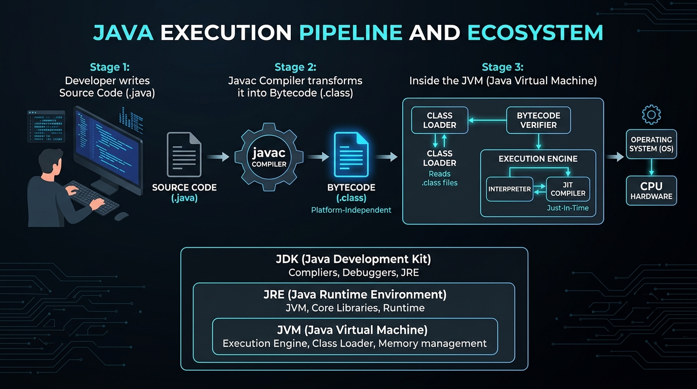

# ☕ Day 01: Java Ecosystem & Setup
## JDK 21, Maven, Project Architecture & Your First AI-Ready Java Program

| ⬅️ Previous Day | 📚 Course Hub | ➡️ Next Day |
|:---|:---:|---:|
| *🚀 Course Inception* | [All 60 Days Overview](../../README.md) | [Day 02: OOP — Classes, Objects & Memory →](../Day_02_OOP_Classes_Objects_Memory/Day_02_OOP_Classes_Objects_Memory.md) |

[](../../README.md)
[](../../README.md)
[](../../README.md)
[](https://openjdk.org/projects/jdk/21/)

---



## 🗺️ Table of Contents
- [1. Topic Overview](#1-topic-overview)
- [2. Basic Foundations (True Zero)](#2-basic-foundations-true-zero)
  - [2.1 What is Java and How Does It Run?](#21-what-is-java-and-how-does-it-run)
  - [2.2 The Big Three: JDK vs. JRE vs. JVM](#22-the-big-three-jdk-vs-jre-vs-jvm)
  - [2.3 Your First Minimal Working Program: HelloGenAI](#23-your-first-minimal-working-program-hellogenai)
  - [2.4 Line-by-Line Anatomy of `public static void main`](#24-line-by-line-anatomy-of-public-static-void-main)
- [3. Core Concept Walkthrough (Basic → Intermediate)](#3-core-concept-walkthrough-basic--intermediate)
  - [3.1 The Two-Step Compilation & Execution Pipeline](#31-the-two-step-compilation--execution-pipeline)
  - [3.2 Peeking Under the Hood: Inspecting Bytecode with `javap`](#32-peeking-under-the-hood-inspecting-bytecode-with-javap)
  - [3.3 Organizing Code: Packages & Namespaces](#33-organizing-code-packages--namespaces)
  - [3.4 Instant Feedback with JShell (Java REPL)](#34-instant-feedback-with-jshell-java-repl)
  - [3.5 Enterprise Dependency & Build Management with Maven](#35-enterprise-dependency--build-management-with-maven)
- [4. Prerequisite & Supporting Concepts](#4-prerequisite--supporting-concepts)
  - [Prerequisite / Supporting Concept: Operating System PATH & JAVA_HOME](#prerequisite--supporting-concept-operating-system-path--java_home)
  - [Prerequisite / Supporting Concept: Command-Line Interface (CLI) Basics](#prerequisite--supporting-concept-command-line-interface-cli-basics)
  - [Prerequisite / Supporting Concept: Python vs. Java Mental Bridge](#prerequisite--supporting-concept-python-vs-java-mental-bridge)
- [5. Advanced Depth (Intermediate → Advanced)](#5-advanced-depth-intermediate--advanced)
  - [5.1 HotSpot JIT (Just-In-Time) Tiered Compilation](#51-hotspot-jit-just-in-time-tiered-compilation)
  - [5.2 Single-File Source Code Execution (JEP 330)](#52-single-file-source-code-execution-jep-330)
  - [5.3 Common Mistakes & Misconceptions (With Bad vs. Good Code)](#53-common-mistakes--misconceptions-with-bad-vs-good-code)
  - [5.4 Architectural Trade-Offs: JVM Memory Overhead vs. Raw C/Rust](#54-architectural-trade-offs-jvm-memory-overhead-vs-raw-crust)
- [6. Quick Recap](#6-quick-recap)
- [7. Self-Check Questions & Practice Exercises](#7-self-check-questions--practice-exercises)
  - [Self-Check Questions (Basic to Advanced)](#self-check-questions-basic-to-advanced)
  - [Hands-On Practice Exercises with Full Solutions](#hands-on-practice-exercises-with-full-solutions)

---

# 1. Topic Overview

The Java ecosystem is the enterprise backbone of modern software engineering. It consists of the **Java Development Kit (JDK)**, the **Java Virtual Machine (JVM)**, and standardized build systems like **Apache Maven** that turn human-written source code into fast, secure, portable machine instructions.

### Why This Topic Matters
Modern enterprise Generative AI is not built in isolation inside Jupyter notebooks. While AI researchers train models in Python, the real-world production platforms handling customer authentication, payments, data security, and vector searches—at institutions like Amazon, Netflix, Citi, and Stripe—run on the JVM. Mastering the Java ecosystem allows you to build industrial-strength, AI-powered applications that scale reliably to millions of concurrent users.

> 💡 **New Word Alert — "Generative AI"**: Software that creates new content (text, code, structured JSON, images) by predicting patterns learned from vast datasets. The brain behind it is a Large Language Model (LLM) like GPT-4 or Claude. In Java, we build the robust application body that communicates with this brain.

> 💡 **New Word Alert — "Token"**: The atomic unit of text processed by an AI model. Roughly 4 characters of English text equal 1 token (e.g., "Hello world" $\approx$ 2–3 tokens). AI APIs meter and bill usage based on token consumption.

---

# 2. Basic Foundations (True Zero)

If you have never written a single line of Java before, welcome! Let's start from true zero.

### 2.1 What is Java and How Does It Run?

A computer CPU understands only raw binary numbers: `0`s and `1`s (machine code). As humans, writing millions of `0`s and `1`s is impossible. We write code in high-level programming languages that resemble English and mathematics.

Languages handle this translation in one of two traditional ways:
1. **Pure Interpreted Languages (like Python)**: An interpreter reads your source code line-by-line and executes it immediately. If there is a fatal type error on line 80, the program happily runs lines 1 through 79 before crashing at runtime.
2. **Pure Compiled Languages (like C or C++)**: A compiler translates the entire source file directly into machine code specific to your processor (e.g., Intel x86 or Apple ARM64). The resulting binary runs blisteringly fast, but a binary compiled on Windows cannot run on Linux or macOS.

**Java combines the best of both worlds**:
Java compiles your human-readable source code (`.java`) into an intermediate format called **Bytecode** (`.class`). Bytecode is not machine code for any real physical CPU. Instead, it is the machine code for an imaginary, standardized computer called the **Java Virtual Machine (JVM)**.

Because every major operating system (Windows, Linux, macOS) has its own JVM implementation, the exact same `.class` file runs anywhere without recompilation. This is Java's famous promise: **Write Once, Run Anywhere (WORA)**.

---

### 2.2 The Big Three: JDK vs. JRE vs. JVM

Beginners often get confused by these three acronyms. Here is their definitive distinction:

```
┌─────────────────────────────────────────────────────────────────────────┐
│ JDK (Java Development Kit)                                              │
│  - javac (The Java Compiler)                                            │
│  - jshell (Interactive Java Playground / REPL)                          │
│  - javap (Disassembler), javadoc, jdb (Debugger), jar                   │
│                                                                         │
│   ┌─────────────────────────────────────────────────────────────────┐   │
│   │ JRE (Java Runtime Environment)                                  │   │
│   │  - Core Standard Libraries (java.lang, java.util, java.net)     │   │
│   │                                                                 │   │
│   │   ┌─────────────────────────────────────────────────────────┐   │   │
│   │   │ JVM (Java Virtual Machine)                              │   │   │
│   │   │  - ClassLoader Subsystem                                │   │   │
│   │   │  - Memory Management (Stack & Heap)                     │   │   │
│   │   │  - Garbage Collector (Automatic Memory Cleanup)         │   │   │
│   │   │  - Just-In-Time (JIT) HotSpot Execution Engine          │   │   │
│   │   └─────────────────────────────────────────────────────────┘   │   │
│   └─────────────────────────────────────────────────────────────────┘   │
└─────────────────────────────────────────────────────────────────────────┘
```

| Acronym | Stands For | Who Needs It? | Real-World Physical Analogy |
| :--- | :--- | :--- | :--- |
| **JVM** | **Java Virtual Machine** | The host system running the app | The internal combustion engine converting fuel into movement. |
| **JRE** | **Java Runtime Environment** | End-users executing pre-built apps | The fully assembled car ready to drive on the road. |
| **JDK** | **Java Development Kit** | **Software Developers (YOU!)** | The auto-factory: contains the car, plus wrenches, cranes, and diagnostic computers. |

> 💡 **New Word Alert — "JDK (Java Development Kit)"**: The complete software package installed on a developer's computer containing the compiler (`javac`), runtime launcher (`java`), and developer diagnostic utilities.

> 💡 **New Word Alert — "JVM (Java Virtual Machine)"**: An abstract computing engine that resides in memory, reads compiled `.class` bytecode, and translates it on the fly into native CPU instructions.

---

### 2.3 Your First Minimal Working Program: HelloGenAI

Let's write, compile, and execute our first working Java program. In Java, source code must reside inside a file that matches the class name exactly.

Create a file named `HelloGenAI.java`:

```java
public class HelloGenAI {
    public static void main(String[] args) {
        System.out.println("Hello, Enterprise Gen AI World!");
        System.out.println("Java 21 + Spring AI is ready.");
    }
}
```

---

### 2.4 Line-by-Line Anatomy of `public static void main`

Beginners frequently ask: *"Why does Java require so many words just to print text?"* Every single keyword serves a vital architectural purpose:

```
 public  static  void  main ( String[]  args )
   │       │      │     │       │        │
   │       │      │     │       │        └─ Parameter variable name (array of strings)
   │       │      │     │       └────────── Parameter type (Array of Text inputs)
   │       │      │     └────────────────── Exact method name required by the JVM launcher
   │       │      └──────────────────────── Returns nothing (no return value)
   │       └─────────────────────────────── Belongs to the class itself; no object instance needed
   └─────────────────────────────────────── Accessible from anywhere by the external JVM launcher
```

1. **`public class HelloGenAI`**:
   - `public`: An access modifier meaning this class blueprint can be accessed by any code in the universe, including the JVM launcher outside the file.
   - `class`: The keyword used to declare a blueprint for state and behavior.
   - `HelloGenAI`: The identifier name of this class. Java convention dictates `PascalCase` for class names.
2. **`public` (on the method)**:
   - The JVM starts execution from outside your package. If this method were `private`, the JVM would be blocked by security boundaries and crash with an access error.
3. **`static` (The Bootstrapping Keyword)**:
   - Ordinarily, to call a method inside a class, you must instantiate an object in memory first (`HelloGenAI app = new HelloGenAI()`).
   - But when an application boots up, **no objects exist yet in RAM**.
   - Marking `main` as `static` instructs the JVM: *"You can invoke this method directly from the class blueprint without allocating an object in memory first."*
4. **`void`**:
   - Specifies the return type. `void` signifies that the method returns no value to the caller upon completion.
5. **`main`**:
   - The exact identifier that the JVM scans for as the program's official entry whistle. If misspelled (e.g., `Main` or `start`), the JVM will fail with `Main method not found`.
6. **`String[] args`**:
   - `String[]` indicates an array of text strings.
   - `args` receives any command-line parameters passed when the program is launched (e.g., `java HelloGenAI --model=gpt-4o`).
7. **`System.out.println(...)`**:
   - `System`: A standard class provided automatically in `java.lang`.
   - `out`: The standard output stream connected to your console/terminal.
   - `println`: Short for "print line"—outputs the string and inserts a newline character at the end.
   - `;` (Semicolon): The mandatory statement terminator in Java.

---

# 3. Core Concept Walkthrough (Basic → Intermediate)

Now that you understand the basic program, let's trace the journey code takes from your fingertips to your CPU.

### 3.1 The Two-Step Compilation & Execution Pipeline

```
Step 1: Developer Machine (Compile-Time)
┌───────────────────────┐         javac          ┌───────────────────────┐
│  HelloGenAI.java      │  ───────────────────►  │  HelloGenAI.class     │
│  (Human-Readable)     │    (Java Compiler)     │  (Bytecode - Portable)│
└───────────────────────┘                        └───────────────────────┘
                                                            │
Step 2: Any Machine / OS / Cloud (Runtime)                  │
                                                            ▼
┌────────────────────────────────────────────────────────────────────────┐
│                     JVM (Java Virtual Machine)                         │
│                                                                        │
│   ┌──────────────────┐    ┌─────────────────┐    ┌─────────────────┐   │
│   │   Class Loader   │───►│ Execution Engine│───►│  JIT Compiler   │   │
│   │ (Loads Bytecode) │    │  (Interpreter)  │    │  (Hotspot Opt)  │   │
│   └──────────────────┘    └─────────────────┘    └─────────────────┘   │
└────────────────────────────────────────────────────────────────────────┘
                                    │
                                    ▼
                         [ Native CPU Machine Code ]
                         (Intel x86, ARM64, AMD64)
```

Let's execute this manually via your command terminal:

```bash
# Step 1: Compile the Java source file into bytecode
javac HelloGenAI.java

# Notice: A new binary file named HelloGenAI.class appears in your directory!

# Step 2: Launch the JVM to run the compiled bytecode
java HelloGenAI
```

> [!WARNING]
> When running the compiled class with the `java` command, **do not append `.class` or `.java`**. You supply the class identifier name (`java HelloGenAI`), not the file name.

Output:
```text
Hello, Enterprise Gen AI World!
Java 21 + Spring AI is ready.
```

---

### 3.2 Peeking Under the Hood: Inspecting Bytecode with `javap`

Bytecode is not mysterious; it is simply an assembly language for the JVM. Java includes a built-in disassembler tool called `javap`.

Run this in your terminal:
```bash
javap -c HelloGenAI
```

The output reveals the exact low-level instructions executed by the JVM:

```text
Compiled from "HelloGenAI.java"
public class HelloGenAI {
  public HelloGenAI();
    Code:
       0: aload_0
       1: invokespecial #1                  // Method java/lang/Object."<init>":()V
       4: return

  public static void main(java.lang.String[]);
    Code:
       0: getstatic     #7                  // Field java/lang/System.out:Ljava/io/PrintStream;
       3: ldc           #13                 // String Hello, Enterprise Gen AI World!
       5: invokevirtual #15                 // Method java/io/PrintStream.println:(Ljava/lang/String;)V
       8: getstatic     #7                  // Field java/lang/System.out:Ljava/io/PrintStream;
      11: ldc           #21                 // String Java 21 + Spring AI is ready.
      13: invokevirtual #15                 // Method java/io/PrintStream.println:(Ljava/lang/String;)V
      16: return
}
```

Notice instruction `3` and `5`:
- `ldc`: Load constant string `"Hello, Enterprise Gen AI World!"` onto the JVM execution stack.
- `invokevirtual`: Invoke the `println` method on `System.out`.

Every JVM running on Windows, Linux, Docker, or macOS interprets these exact instructions identically.

---

### 3.3 Organizing Code: Packages & Namespaces

In enterprise software, thousands of classes coexist. If two developers both create a class named `Document` (one for a PDF parser, one for an AI vector embedding), their names would clash.

Java resolves this using **Packages**. Packages correspond directly to directory paths on disk.

```java
package com.javagenai.day01;

public class SystemProbe {

    public static void main(String[] args) {
        String javaVersion = System.getProperty("java.version");
        String osName = System.getProperty("os.name");
        int availableProcessors = Runtime.getRuntime().availableProcessors();
        long maxMemoryMB = Runtime.getRuntime().maxMemory() / (1024 * 1024);

        System.out.println("=== AI System Diagnostic Probe ===");
        System.out.println("Java Version  : " + javaVersion);
        System.out.println("Operating Sys : " + osName);
        System.out.println("CPU Cores     : " + availableProcessors);
        System.out.println("Max JVM Memory: " + maxMemoryMB + " MB");
    }
}
```

#### The Package Rule:
If a class declares `package com.javagenai.day01;`, it **must physically reside** inside the directory structure:
`src/main/java/com/javagenai/day01/SystemProbe.java`

Enterprise convention uses reversed internet domain names (`com.javagenai`) to guarantee global uniqueness across all open-source libraries.

---

### 3.4 Instant Feedback with JShell (Java REPL)

Developers coming from Python love the interactive REPL where single lines can be evaluated instantly without creating classes or project files. Java has its own official REPL: **`jshell`** (introduced in Java 9).

Launch it in your terminal:
```bash
jshell
```

```java
jshell> int promptTokens = 1200;
promptTokens ==> 1200

jshell> int completionTokens = 350;
completionTokens ==> 350

jshell> double costPer1k = 0.002;
costPer1k ==> 0.002

jshell> double totalCost = ((promptTokens + completionTokens) / 1000.0) * costPer1k;
totalCost ==> 0.0031

jshell> String summary = String.format("Total AI Cost: $%.4f USD", totalCost);
summary ==> "Total AI Cost: $0.0031 USD"

jshell> /exit
|  Goodbye
```

`jshell` is your scratchpad for testing snippets, regex patterns, or mathematical formulas during your daily workflow.

---

### 3.5 Enterprise Dependency & Build Management with Maven

In enterprise projects, you never manage `.jar` files manually. You use a build tool like **Apache Maven**.

```
my-ai-application/
├── pom.xml                        ← Project Object Model (The build manifest)
└── src/
    ├── main/
    │   ├── java/                  ← Production source code
    │   │   └── com/javagenai/Application.java
    │   └── resources/             ← Application configuration (application.yml, prompts)
    └── test/
        ├── java/                  ← Automated tests (JUnit 5)
        └── resources/             ← Test configuration
```

#### Understanding `pom.xml`
The `pom.xml` specifies your project coordinates and dependencies:

```xml
<?xml version="1.0" encoding="UTF-8"?>
<project xmlns="http://maven.apache.org/POM/4.0.0"
         xmlns:xsi="http://www.w3.org/2001/XMLSchema-instance"
         xsi:schemaLocation="http://maven.apache.org/POM/4.0.0 
         https://maven.apache.org/xsd/maven-4.0.0.xsd">
    <modelVersion>4.0.0</modelVersion>

    <!-- 1. G-A-V Coordinates: Project identity -->
    <groupId>com.javagenai</groupId>
    <artifactId>day01-setup</artifactId>
    <version>1.0.0</version>
    <packaging>jar</packaging>

    <properties>
        <java.version>21</java.version>
        <maven.compiler.source>21</maven.compiler.source>
        <maven.compiler.target>21</maven.compiler.target>
        <project.build.sourceEncoding>UTF-8</project.build.sourceEncoding>
    </properties>

    <!-- 2. Dependencies: External libraries from Maven Central -->
    <dependencies>
        <dependency>
            <groupId>org.junit.jupiter</groupId>
            <artifactId>junit-jupiter</artifactId>
            <version>5.11.3</version>
            <scope>test</scope>
        </dependency>
    </dependencies>
</project>
```

#### The Maven Build Lifecycle
Maven executes builds through standardized lifecycle phases:
```
[ validate ] ──► [ compile ] ──► [ test ] ──► [ package ] ──► [ verify ] ──► [ install ]
```

- `mvn compile`: Compiles all source files into `target/classes`.
- `mvn test`: Runs unit tests.
- `mvn clean`: Deletes the `target/` build directory.
- `mvn clean package`: Builds a clean, self-contained `.jar` file ready for production deployment.

---

# 4. Prerequisite & Supporting Concepts

### Prerequisite / Supporting Concept: Operating System PATH & JAVA_HOME

When you type `java` or `javac` into your terminal, how does your operating system know where the executable files live?

Your operating system uses an environment variable called **`PATH`**.
1. **`JAVA_HOME`**: An environment variable pointing to the root directory where the JDK is installed (e.g., `C:\Program Files\Eclipse Adoptium\jdk-21.0.x` on Windows, or `/Library/Java/JavaVirtualMachines/temurin-21.jdk/Contents/Home` on macOS).
2. **`PATH`**: An operating system list of directories where the command prompt searches for executable programs. Appending `%JAVA_HOME%\bin` (or `$JAVA_HOME/bin`) allows you to run `java`, `javac`, and `jshell` from any directory.

Verify this in your shell:
```bash
# Check Java version
java -version

# Check Compiler version
javac -version
```

If both print `21.0.x`, your `PATH` and `JAVA_HOME` are correctly configured.

---

### Prerequisite / Supporting Concept: Command-Line Interface (CLI) Basics

When compiling and packaging Java applications, you will interact with the terminal:
- `cd <folder>`: Change directory.
- `ls` (macOS/Linux) or `dir` (Windows): List files in the current folder.
- `mkdir <folder>`: Create a new folder.
- `pwd`: Print the current working directory path.

---

### Prerequisite / Supporting Concept: Python vs. Java Mental Bridge

For developers familiar with Python, here is a direct mapping of architectural concepts:

| Concept | Python | Modern Java 21 |
| :--- | :--- | :--- |
| **Typing Discipline** | Dynamic (`x = "hello"`, then `x = 42`) | Static & Strongly Typed (`String s = "hello";` or `var s = "hello";`) |
| **Execution Model** | Interpreted line-by-line | Compiled to Bytecode (`javac`), executed by JVM (`java`) |
| **Class/File Binding** | Multiple classes in any arbitrary file | One `public class` per file matching filename exactly |
| **Empty Reference** | `None` | `null` (or safer modern `Optional<T>`) |
| **Package Management**| `pip` with `requirements.txt` / Poetry | Maven (`pom.xml`) or Gradle (`build.gradle`) |
| **Interactive REPL** | Python interactive shell / Jupyter | `jshell` |
| **Entry Point** | `if __name__ == "__main__":` | `public static void main(String[] args)` |
| **Concurrency Model** | GIL limitation (asyncio / multiprocessing) | **Virtual Threads** (millions of lightweight concurrent threads) |

---

# 5. Advanced Depth (Intermediate → Advanced)

Now let's examine what happens inside production JVM engines when running high-load AI workloads.

### 5.1 HotSpot JIT (Just-In-Time) Tiered Compilation

Beginners often believe Java is purely interpreted at runtime. That is incorrect. The modern JVM uses **Tiered Compilation**:

```
[ .class Bytecode ]
        │
        ▼
[ Tier 0: Interpreter ] ──► Starts instantly, profiles execution counts
        │
        ▼ (Code executed thousands of times = "Hot Code")
[ Tier 1–3: C1 Compiler ] ──► Fast native machine compilation with light optimization
        │
        ▼ (Extreme hot loops, matrix calculations, vector comparisons)
[ Tier 4: C2 Compiler ] ──► Heavy, aggressive optimization (inlining, loop unrolling, SIMD vectorization)
```

When an AI vector similarity function or JSON tokenizer is called millions of times, the C2 compiler compiles it directly into native CPU assembly that rivals hand-optimized C++ speed.

---

### 5.2 Single-File Source Code Execution (JEP 330)

Since Java 11, you do not need to run `javac` and `java` separately for quick scripts. You can run source files directly:

```bash
java HelloGenAI.java
```

The JVM compiles the file in memory and executes it immediately without writing a `.class` file to your disk. This allows Java to feel as lightweight for scripting as Python.

---

### 5.3 Common Mistakes & Misconceptions (With Bad vs. Good Code)

#### Mistake 1: Class Name Does Not Match File Name
**Bad Code (`AppRunner.java`):**
```java
// ❌ COMPILE ERROR: class HelloGenAI is public, should be declared in a file named HelloGenAI.java
public class HelloGenAI {
    public static void main(String[] args) {
        System.out.println("Hello");
    }
}
```
**Correct Code (`HelloGenAI.java`):**
```java
// ✅ File name is HelloGenAI.java
public class HelloGenAI {
    public static void main(String[] args) {
        System.out.println("Hello");
    }
}
```

#### Mistake 2: Missing `static` on `main`
**Bad Code:**
```java
public class BadMain {
    // ❌ RUNTIME ERROR: Main method is not static in class BadMain
    public void main(String[] args) {
        System.out.println("This will not run!");
    }
}
```
**Why it fails**: When the JVM boots up, it has not allocated any object instance of `BadMain`. It cannot call an instance method without an existing object.
**Correct Code:**
```java
public class GoodMain {
    // ✅ JVM can invoke static methods directly on the class blueprint
    public static void main(String[] args) {
        System.out.println("Bootstrapped successfully!");
    }
}
```

#### Mistake 3: Package Declaration Does Not Match Directory Hierarchy
**Bad Layout:**
- File path: `src/main/java/SystemProbe.java`
- File header: `package com.javagenai.day01;`
- **Result**: `javac` fails with directory mismatch error.
**Good Layout:**
- File path: `src/main/java/com/javagenai/day01/SystemProbe.java`
- File header: `package com.javagenai.day01;`

---

### 5.4 Architectural Trade-Offs: JVM Memory Overhead vs. Raw C/Rust

| Factor | JVM (Java 21) | Native (C++ / Rust) | Python |
| :--- | :--- | :--- | :--- |
| **Startup Latency** | ~50ms to 200ms (JIT warmup) | < 5ms (Instant) | ~30ms |
| **Peak Throughput** | Extremely High (C2 JIT optimizations) | Maximum | Low (Global Interpreter Lock) |
| **Memory Safety** | 100% Managed (Garbage Collected) | Manual or Borrow Checker | Managed (Reference counted) |
| **Developer Velocity**| High (Rich ecosystems, type safety) | Medium | Very High |
| **Enterprise Concurrency**| Unmatched (Millions of Virtual Threads)| High (Manual async/epoll) | Constrained by GIL |

---

# 6. Quick Recap

| Concept | Key Takeaway |
| :--- | :--- |
| **Compilation** | `javac File.java` transforms source code into portable `.class` bytecode. |
| **Execution** | `java ClassName` launches the JVM to run bytecode on native CPU hardware. |
| **JDK vs JRE vs JVM**| JDK is for developers (tools + compiler); JRE is runtime libraries; JVM is the execution engine. |
| **`public static void main`**| Entry point; `static` enables invocation before any objects exist in RAM. |
| **Packages** | Enforce clean namespaces and must mirror folder directory paths on disk. |
| **Maven** | Standardizes enterprise project layout, builds `.jar` packages, and manages dependencies via `pom.xml`. |
| **JShell** | Java's built-in REPL for fast interactive code prototyping. |

---

# 7. Self-Check Questions & Practice Exercises

### Self-Check Questions (Basic to Advanced)

1. **Why does the JVM require the `main` method to be declared `static`?**
   - *Answer*: When the program launches, the JVM has not instantiated any objects. Declaring `main` as `static` allows the JVM to invoke the entry point directly from the class definition in memory without instantiating an instance.
2. **What occurs if you attempt to run `java HelloGenAI.class` in your console?**
   - *Answer*: The JVM fails with `Could not find or load main class HelloGenAI.class`. The `java` runtime command expects a fully qualified class name, not a file name extension.
3. **What is the fundamental difference between Java Bytecode and Machine Code?**
   - *Answer*: Machine code consists of raw CPU-specific instructions (e.g., x86-64 or ARM) executed directly by hardware. Bytecode is an intermediate instruction set understood by the JVM, making it completely platform-independent.
4. **How does the JVM achieve native C++ performance despite running bytecode?**
   - *Answer*: Through the HotSpot Tiered JIT Compiler. When the runtime identifies frequently executed "hot" bytecode loops, the C2 compiler compiles them directly into optimized native CPU machine code at runtime.
5. **What are the three mandatory coordinates (G-A-V) used in a Maven `pom.xml`?**
   - *Answer*: `groupId` (organization domain), `artifactId` (specific module/project name), and `version` (release version).

---

### Hands-On Practice Exercises with Full Solutions

#### 🏋️ Exercise 1: Build an Enterprise System Diagnostic Probe
**Objective**: Write a program named `GenAIRuntimeInfo.java` that evaluates host CPU cores and memory to verify if the machine meets local LLM inference requirements.

```java
public class GenAIRuntimeInfo {

    public static void main(String[] args) {
        String javaVersion = System.getProperty("java.version");
        String javaVendor = System.getProperty("java.vendor");
        String osName = System.getProperty("os.name");
        String osArch = System.getProperty("os.arch");

        int cores = Runtime.getRuntime().availableProcessors();
        long maxMemoryBytes = Runtime.getRuntime().maxMemory();
        long maxMemoryMB = maxMemoryBytes / (1024 * 1024);
        double maxMemoryGB = maxMemoryMB / 1024.0;

        System.out.println("==================================================");
        System.out.println("       ENTERPRISE GEN AI HOST DIAGNOSTIC          ");
        System.out.println("==================================================");
        System.out.printf("Java Runtime : %s (%s)%n", javaVersion, javaVendor);
        System.out.printf("Operating Sys: %s (%s)%n", osName, osArch);
        System.out.printf("CPU Cores    : %d threads available%n", cores);
        System.out.printf("Max Memory   : %d MB (%.2f GB)%n", maxMemoryMB, maxMemoryGB);
        System.out.println("--------------------------------------------------");

        if (cores >= 4 && maxMemoryMB >= 2048) {
            System.out.println("✅ [STATUS]: Host is READY for local Ollama LLM execution!");
        } else {
            System.out.println("⚠️  [STATUS]: Host resources are constrained for large local models.");
            System.out.println("   Recommendation: Use cloud endpoints (OpenAI/Anthropic).");
        }
        System.out.println("==================================================");
    }
}
```

---

#### 🏋️ Exercise 2: Command-Line Token Cost Calculator
**Objective**: Write `TokenCostCalculator.java` that accepts command-line arguments (`args`) for the model name, input token count, and output token count, and computes API billing costs.

```java
public class TokenCostCalculator {

    public static void main(String[] args) {
        if (args.length < 3) {
            System.out.println("Usage: java TokenCostCalculator <modelName> <inputTokens> <outputTokens>");
            System.out.println("Example: java TokenCostCalculator gpt-4o-mini 2500 800");
            return;
        }

        String model = args[0];
        long inputTokens = Long.parseLong(args[1]);
        long outputTokens = Long.parseLong(args[2]);

        // Pricing per million tokens ($)
        double inputPricePerMillion = 0.150;
        double outputPricePerMillion = 0.600;

        double inputCost = (inputTokens / 1_000_000.0) * inputPricePerMillion;
        double outputCost = (outputTokens / 1_000_000.0) * outputPricePerMillion;
        double totalCost = inputCost + outputCost;

        System.out.println("=== LLM API Call Cost Breakdown ===");
        System.out.println("Model Chosen : " + model);
        System.out.printf("Input Tokens : %,d tokens ($%.6f)%n", inputTokens, inputCost);
        System.out.printf("Output Tokens: %,d tokens ($%.6f)%n", outputTokens, outputCost);
        System.out.println("------------------------------------");
        System.out.printf("Total Cost   : $%.6f USD%n", totalCost);
    }
}
```

---

#### 🏋️ Exercise 3: JShell Rapid Token Estimation Experiment
**Objective**: Launch `jshell` and evaluate token counts for an arbitrary prompt using character-based and word-based heuristics.

```java
// Launch JShell in your terminal:
// $ jshell

String prompt = "Explain retrieval-augmented generation and vector databases in enterprise Java applications.";

// 1. Calculate character count
int charCount = prompt.length();

// 2. Approximate token count by character rule (1 token ≈ 4 characters)
int estimatedTokensByChars = charCount / 4;

// 3. Approximate token count by word rule (1 token ≈ 0.75 words)
String[] words = prompt.split("\\s+");
int wordCount = words.length;
int estimatedTokensByWords = (int) Math.ceil(wordCount / 0.75);

System.out.printf("Characters: %d, Words: %d%n", charCount, wordCount);
System.out.printf("Estimated Tokens (Char Rule): %d%n", estimatedTokensByChars);
System.out.printf("Estimated Tokens (Word Rule): %d%n", estimatedTokensByWords);
```

---

<p align="center">
  <b>Day 01 Complete! 🎉</b><br>
  Proceed to <b>Day 02</b>: <b>Object-Oriented Programming (OOP) — Classes, Objects & Memory Management</b>.<br>
  <a href="../Day_02_OOP_Classes_Objects_Memory/Day_02_OOP_Classes_Objects_Memory.md"><b>Continue to Day 02 →</b></a>
</p>
