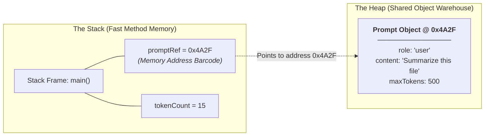

# Day_02 — OOP Classes, Objects, Memory

| ⬅️ Previous Day | 📚 Course Hub | ➡️ Next Day |
|:---|:---:|---:|
| [← Day 01: Java Ecosystem & Setup](../Day_01_Java_Ecosystem_and_Setup/Day_01_Java_Ecosystem_and_Setup.md) | [All 60 Days Overview](../../README.md) | [Day 03: Inheritance, Interfaces & Polymorphism →](../Day_03_Inheritance_Interfaces_Polymorphism/Day_03_Inheritance_Interfaces_Polymorphism.md) |

---

## 🎯 What You'll Understand By the End
- The foundational difference between a **class** (the blueprint) and an **object** (the living instance in RAM).
- Exactly how the JVM splits computer memory into the fast, thread-local **Stack** and the massive, shared **Heap**.
- Why Java is strictly **pass-by-value**, and what actually happens when you pass an object reference into a method.
- How **encapsulation** guards critical AI configuration data against accidental corruption.
- The vital difference between `==` (memory address check) and `.equals()` (content equality), and why the `hashCode()` contract matters.

---

## 🧠 The Problem This Solves

Imagine writing an AI chat system without structured objects:

- You would have to track user IDs, conversation histories, model names, and token counts in dozens of disconnected, loose variables (`userId1`, `messageText1`, `tokenCount1`, `userId2`, etc.).
- When you pass data across functions, any part of the program can arbitrarily change a token count to a negative number or overwrite a prompt, with zero validation.
- In languages without clear memory management rules (like C), developers must manually track every byte of memory allocated and remember to free it. If you forget, your server crashes with a **memory leak**; if you free memory too early, your application crashes with a **segmentation fault**.

Object-Oriented Programming (OOP) solves data chaos by grouping related **state** (data) and **behavior** (actions) into a single secure package. Meanwhile, Java's memory model and **Garbage Collector** solve memory corruption by managing allocations and cleanups automatically.

---

## 📖 Core Concept, Explained Simply

### Blueprint vs. House (Class vs. Object)

- **Class**: An architectural blueprint on paper. It defines what attributes a house will have (rooms, doors, color) and what actions can be taken in it (lock doors, turn on lights). The blueprint itself takes up no physical land.
- **Object (Instance)**: The physical house built on a plot of land using that blueprint. You can build 50 houses from one blueprint, and each house can have its own wall color and family inside.

In AI engineering terms:
- A `Prompt` class is the blueprint specifying that every prompt has a `role` (like "user" or "system") and a `content` string.
- When an incoming chat request arrives, you instantiate a new `Prompt` object in memory containing `"Explain quantum computing"`.

### The Desk and the Warehouse (Stack vs. Heap Memory)

The JVM divides physical RAM into two major working zones:

1. **The Stack (The Fast Personal Desk)**:
   - Extremely fast, organized memory.
   - Stores active method calls, local primitive variables (like `int`, `boolean`), and **reference pointers** (memory addresses pointing to objects).
   - When a method finishes executing, its entire section on the desk (its **stack frame**) vanishes instantly.
2. **The Heap (The Big Central Warehouse)**:
   - A large pool of shared memory where all **objects** actually live.
   - When you use the `new` keyword, the JVM allocates space for that object in the Heap warehouse and hands you back a reference address (a tracking barcode).
   - If no variables on the Stack are holding an object's address anymore, the **Garbage Collector (GC)** sweeps in and recycles that Heap memory automatically.

> 💡 **New Word Alert — "Encapsulation"**: Bundling data fields and the methods that operate on them inside a single class, while keeping fields `private` so outside code cannot modify them directly without going through controlled methods (getters and setters).

> 💡 **New Word Alert — "Garbage Collection (GC)"**: The JVM's automatic background process that scans the Heap, finds objects that are no longer referenced by any active part of the program, and frees their memory.

---

## 🗺️ Visual Overview



*This diagram illustrates how Java manages memory. The variable `promptRef` lives on the Stack and stores the memory address `0x4A2F`. That address points directly to the actual `Prompt` object residing inside the Heap.*

---

## 💻 Code Walkthrough

Here is a clean, encapsulated Java 17+ class modeling an AI prompt, demonstrating constructors, fields, methods, and equality comparison:

```java
import java.util.Objects;

public class Prompt {
    private String role;
    private String content;
    private int maxTokens;

    public Prompt(String role, String content, int maxTokens) {
        if (role == null || role.isBlank()) {
            throw new IllegalArgumentException("Role cannot be empty");
        }
        if (maxTokens <= 0) {
            throw new IllegalArgumentException("maxTokens must be positive");
        }
        this.role = role;
        this.content = content;
        this.maxTokens = maxTokens;
    }

    public String getRole() {
        return role;
    }

    public String getContent() {
        return content;
    }

    public int getMaxTokens() {
        return maxTokens;
    }

    @Override
    public boolean equals(Object o) {
        if (this == o) return true;
        if (o == null || getClass() != o.getClass()) return false;
        Prompt prompt = (Prompt) o;
        return maxTokens == prompt.maxTokens &&
               Objects.equals(role, prompt.role) &&
               Objects.equals(content, prompt.content);
    }

    @Override
    public int hashCode() {
        return Objects.hash(role, content, maxTokens);
    }

    @Override
    public String toString() {
        return "Prompt[role=" + role + ", tokens=" + maxTokens + ", content=" + content + "]";
    }
}
```

### Line-by-Line Breakdown

| Code Section | Plain-English Explanation |
|:---|:---|
| `private String role;` | `private` ensures external code cannot directly overwrite this field. It can only be read or modified through controlled methods. |
| `public Prompt(...)` | The **constructor**. A special initialization block that runs when `new Prompt(...)` is called. It sets initial values and validates business rules immediately. |
| `this.role = role;` | The keyword `this` refers to the current object instance, distinguishing the class field `this.role` from the incoming argument `role`. |
| `public String getRole()` | A **getter method** providing read-only access to private fields. |
| `@Override public boolean equals(...)` | Replaces the default `equals` method to compare the **contents** of two `Prompt` objects rather than their raw memory addresses. |
| `@Override public int hashCode()` | Computes an integer hash value based on the object's contents. Critical for fast storage and lookups inside hash-based collections. |
| `@Override public String toString()` | Provides a human-readable text representation when printing the object for logging and debugging. |

---

## 🔑 Key Terminology

| Term | Plain-English Meaning |
|:---|:---|
| **Class** | The blueprint or template that defines variables and behaviors. |
| **Object / Instance** | The concrete entity created in Heap memory from a class blueprint using `new`. |
| **Stack** | Fast, short-lived memory storing active method execution frames, local variables, and object references. |
| **Heap** | The shared pool of memory where all instantiated objects reside. |
| **Constructor** | A special method with the same name as the class that initializes a newly created object. |
| **Encapsulation** | The practice of keeping fields private and exposing safe public methods to access or modify them. |
| **Pass-by-Value** | Java's parameter rule: method arguments always receive a **copy** of the value (primitives get a copy of the number; objects get a copy of the reference address). |
| **`==` vs `.equals()`** | `==` checks if two references point to the exact same physical memory location; `.equals()` checks if the internal contents are equivalent. |

---

## ⚠️ Common Beginner Mistakes

### 1. Using `==` to Compare Strings or Objects
In Java, `==` tests whether two variables point to the same physical memory address, NOT whether their text or contents are identical.

❌ **Wrong Way**:
```java
String inputA = new String("llama3");
String inputB = new String("llama3");

if (inputA == inputB) { // Evaluates to FALSE! They are two separate objects in Heap memory.
    System.out.println("Models match!");
}
```

✅ **Right Way**:
```java
String inputA = new String("llama3");
String inputB = new String("llama3");

if (inputA.equals(inputB)) { // Evaluates to TRUE! Contents are identical.
    System.out.println("Models match!");
}
```
*Why it is wrong*: `==` compares raw pointer addresses. Always use `.equals()` to evaluate object contents.

---

### 2. Leaving Class Fields `public`
Exposing fields directly breaks encapsulation, allowing outside code to inject invalid or corrupt state.

❌ **Wrong Way**:
```java
public class PromptConfig {
    public int maxTokens; // Any code can set this to -500 or 99999999!
}
```

✅ **Right Way**:
```java
public class PromptConfig {
    private int maxTokens;

    public void setMaxTokens(int maxTokens) {
        if (maxTokens <= 0) {
            throw new IllegalArgumentException("Tokens must be greater than zero");
        }
        this.maxTokens = maxTokens;
    }
}
```
*Why it is wrong*: Without validation in setters or constructors, corrupted state causes sudden crashes deep inside external API calls.

---

### 3. Believing Java is "Pass-by-Reference"
Java is **strictly pass-by-value**. When you pass an object into a method, Java makes a copy of the reference address barcode. Reassigning that parameter inside the method does not change the original variable outside.

❌ **Misconception / Wrong Expectation**:
```java
public void reassignPrompt(Prompt p) {
    p = new Prompt("system", "New System Instructions", 100);
}
// Calling reassignPrompt(originalPrompt) does NOT alter originalPrompt in the caller!
```

✅ **Right Understanding**:
The method receives a copy of the pointer address. Modifying the fields of the object *through* that pointer affects the Heap object, but reassigning the pointer itself changes only the local copy.

---

## ✅ Best Practices

1. **Make Fields `private` by Default**: Guard state behind constructors and getter methods. Only provide setters if the state genuinely needs to change after creation.
2. **Always Override `hashCode()` Whenever You Override `equals()`**: If two objects are equal according to `.equals()`, they **must** return the exact same `hashCode()`. Breaking this contract causes items to disappear inside hash maps and sets.
3. **Validate in the Constructor**: Reject invalid arguments (such as `null`, empty strings, or negative numbers) immediately upon object creation using exceptions.
4. **Implement `toString()` for Clean Debugging**: Never let your objects print as `Prompt@4a2f8b` in application logs. A readable `toString()` makes debugging effortless.

---

## 🔭 Looking Ahead
In **Day_03**, we will see how multiple classes share common code through **Inheritance**, define architectural contracts using **Interfaces**, and swap behaviors dynamically via **Polymorphism**.

---

## 📝 Quick Recap
- A **class** is the structural blueprint; an **object** is the live instance living in Heap memory.
- The **Stack** holds fast method execution frames and reference pointers; the **Heap** holds all objects.
- Java is strictly **pass-by-value**: variables store values, and object variables store reference addresses.
- Never compare object contents with `==`; always use `.equals()`.
- Whenever you implement `.equals()`, you must also implement `.hashCode()`.

---

## 🧪 Try It Yourself

1. **Create an AI Model Class**: Build a `LanguageModel` class with `private` fields for `name` (String), `contextLimit` (int), and `costPerThousandTokens` (double). Include constructor validation so `contextLimit` cannot be negative.
2. **Verify the Equality Contract**: Create two separate instances of `LanguageModel` with identical values (e.g., `"gpt-4o"`, `128000`, `0.005`). Print the result of `model1 == model2` and `model1.equals(model2)` to observe the difference.
3. **Trace Memory**: Draw a simple diagram on paper showing where the local variable references sit on the Stack and where your two `LanguageModel` instances reside on the Heap.
