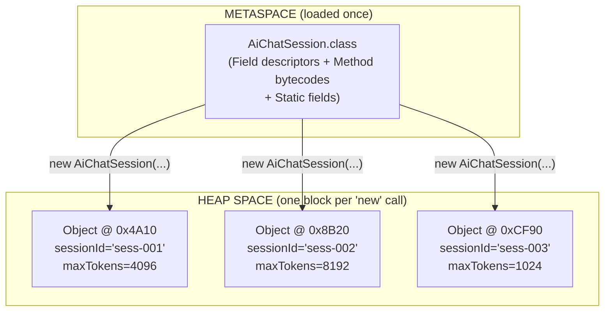
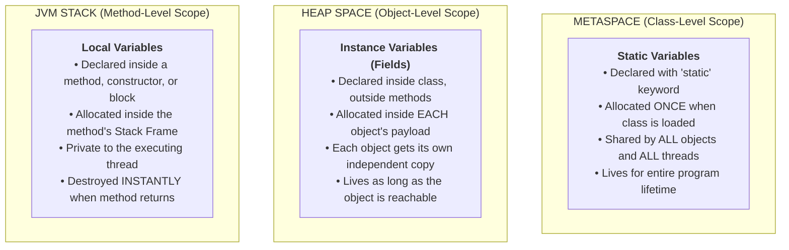
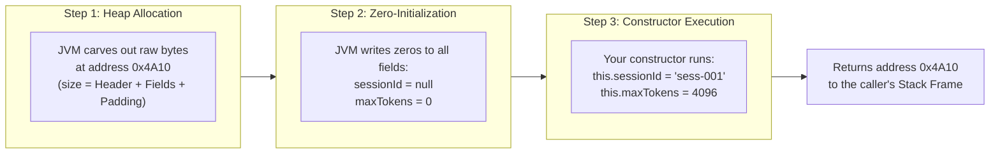
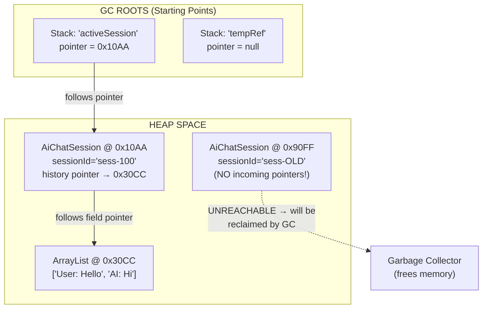

# Phase_01, Day_02 — OOP: Classes, Objects, and the Lifecycle of Memory

| ⬅️ Previous Day | 📚 Course Hub | ➡️ Next Day |
|:---|:---:|---:|
| [← Day 01: Java Ecosystem & Setup](../Day_01_Java_Ecosystem_and_Setup/Day_01_Java_Ecosystem_and_Setup.md) | [All 60 Days Overview](../../README.md) | [Day 03: Inheritance, Interfaces & Polymorphism →](../Day_03_Inheritance_Interfaces_Polymorphism/Day_03_Inheritance_Interfaces_Polymorphism.md) |

---

## 🎯 What You'll Understand By the End

- The physical, mechanical difference between a **Class** (a blueprint stored once in Metaspace) and an **Object** (a chunk of live RAM allocated on the Heap every time you write `new`).
- Where **local variables**, **instance variables (fields)**, and **static variables** each live in the JVM's memory — and exactly why each one lives where it does.
- The precise 3-step sequence the JVM executes every single time `new ClassName()` runs: **Heap Allocation → Default Zero-Initialization → Constructor Execution**.
- What the invisible **Object Header** is — a hidden metadata block the JVM stitches onto the front of every Heap object — and what the two pieces inside it (the **Mark Word** and the **Klass Word**) actually do.
- How the `this` keyword works at the memory level: it is not magic — it is a regular memory pointer that the JVM silently passes as the first argument in slot `0` of every instance method's Stack Frame.
- Why **defensive copying** is mandatory to prevent a specific class of invisible bugs where outside code can reach into your object's private memory and corrupt it — even though you marked the field `private`.
- How the JVM's **Garbage Collector** decides which Heap objects are alive and which are dead, using **GC Roots** and the **Mark-and-Sweep** algorithm — and how Java "memory leaks" actually happen despite automatic Garbage Collection.

---

## 🧠 The Problem This Solves / Why This Comes Up

Before Object-Oriented Programming existed, programs were written in a **procedural** style. Every piece of data was a disconnected, free-floating variable. Every function was a standalone block of instructions that took in raw values and returned raw values. There was no way to group related data together into a single, protected unit.

Let's make this concrete. Imagine you're building a GenAI chat service — something that talks to an AI model like GPT — using only disconnected variables and standalone functions:

```java
// Procedural chaos: no grouping, no protection, no structure
String userId1 = "user-alice";
String model1 = "gpt-4o";
int maxTokens1 = 4096;
double temperature1 = 0.7;
List<String> history1 = new ArrayList<>();

String userId2 = "user-bob";
String model2 = "claude-3";
int maxTokens2 = 2048;
double temperature2 = 0.3;
List<String> history2 = new ArrayList<>();
```

Three things go catastrophically wrong here:

**Problem 1 — Disconnected Data Chaos.** There is no structural link between `userId1` and `model1` and `history1`. They're related only by naming convention (the `1` suffix). If you pass these to a function, you must pass five separate arguments. If you add a sixth piece of data (say, `systemPrompt`), you must change every function signature in the entire codebase.

**Problem 2 — Zero Protection.** Any code, anywhere in the program, can directly write any value into any variable:

```java
maxTokens1 = -500;        // Corrupts billing calculations — nothing stops this
temperature1 = 999.0;     // No validation — the AI API will reject this silently
history2.clear();          // Wipes Bob's entire conversation from a completely unrelated function
```

There's no gatekeeper. No validation. No boundary. The data is naked and exposed.

**Problem 3 — Memory Management Nightmare.** In older languages (like C and C++), when you were done with data, you had to manually free the memory yourself. Forget to free it? Your server slowly runs out of RAM over hours or days — this is called a **memory leak**. Free it while another part of the program is still using it? The program crashes or silently corrupts data — this is called a **dangling pointer**. Both of these bugs are notoriously difficult to find because they don't crash immediately; they corrupt data silently and reveal themselves days later in production.

**What OOP Solves:**

Object-Oriented Programming solves Problem 1 and Problem 2 by letting you group related data (fields) and behavior (methods) into a single, self-contained unit called an **object**, with controlled access through `private` fields and validated methods. Java solves Problem 3 by automating memory management entirely through the **Garbage Collector** — you never call "free" manually, and the JVM reclaims abandoned memory safely in the background.

That's what this Day is about: understanding exactly how classes, objects, and memory work — not just the syntax, but the physical mechanics of what happens in your computer's RAM.

---

# Section 1: The Class vs. Object Distinction — Blueprints in Metaspace, Objects in Heap

---

## 📖 Core Concept, Explained Simply

The single most important idea in Java is the distinction between a **class** and an **object**. They are not the same thing. They live in completely different places in your computer's memory. They serve completely different purposes. Confusing them is like confusing an architectural blueprint with an actual house.

### What Is a Class?

A **class** is a text file you write that describes the structure of something. It says: "Things of this type will have these pieces of data (called **fields**) and these behaviors (called **methods**)."

When your program runs, the JVM reads your `.class` file (the compiled bytecode you learned about in Day 01) and loads its description into a memory area called **Metaspace**. This loaded description — the class blueprint — sits in Metaspace for the entire lifetime of your program. It is loaded **once**, no matter how many objects you create from it.

A class by itself does not hold any user data. It's just a structural recipe.

### What Is an Object?

An **object** (also called an **instance**) is a concrete block of RAM allocated on the **Heap** when you write `new ClassName()`. Each object holds its own independent copy of the data described by the class.

If a class says "things of this type will have a `sessionId` and a `maxTokens`," then each object created from that class gets its own `sessionId` and its own `maxTokens`, stored at its own unique memory address on the Heap.

You can create 1 object from a class, or 1,000 objects, or zero objects. Each one occupies its own separate block of Heap memory.

### The Physical Memory Picture

Here's where the class and its objects literally live in RAM:

```
┌──────────────────────────────────────────────────────────────────┐
│ METASPACE (Native OS Memory — loaded ONCE at class-loading time) │
│                                                                  │
│  Class Blueprint: AiChatSession.class                            │
│   ┌──────────────────────────────────────────────────────────┐   │
│   │ • Field descriptors: sessionId (String), maxTokens (int) │   │
│   │ • Method bytecodes: addMessage(), getHistory()           │   │
│   │ • Static field: DEFAULT_MODEL = "gpt-4o"                 │   │
│   └──────────────────────────────────────────────────────────┘   │
└──────────────────────────────────────────────────────────────────┘
                            │
            Instantiates via the "new" keyword
            (can happen 0, 1, 10, or 10,000 times)
                            ▼
┌──────────────────────────────────────────────────────────────────┐
│ HEAP SPACE (RAM — managed by the Garbage Collector)              │
│                                                                  │
│  ┌──────────────────────────┐   ┌──────────────────────────┐    │
│  │ Object @ address 0x4A10  │   │ Object @ address 0x8B20  │    │
│  │  [Object Header]         │   │  [Object Header]         │    │
│  │  sessionId: "sess-001"   │   │  sessionId: "sess-002"   │    │
│  │  maxTokens: 4096         │   │  maxTokens: 8192         │    │
│  └──────────────────────────┘   └──────────────────────────┘    │
│                                                                  │
│  Each object is an independent block of RAM at its own address.  │
│  Modifying one object has ZERO effect on any other object.       │
└──────────────────────────────────────────────────────────────────┘
```

Notice: there is **one** blueprint in Metaspace, but **two** objects on the Heap. Each object has its own memory address (`0x4A10` and `0x8B20`). Each holds its own independent data. The blueprint is shared; the objects are not.

---

## 🧭 Real-World Analogy

Think of a **cookie cutter** and **cookies**.

- **The class is the cookie cutter.** It defines the shape — the outline, the contours, the structure. The cookie cutter itself is not a cookie. You don't eat the cookie cutter. It sits in your kitchen drawer (Metaspace) permanently.

- **Each object is a cookie pressed from that cutter.** Every time you press the cutter into dough (write `new`), you get a new, independent cookie (Heap object). You can frost one cookie with chocolate and another with vanilla — they're independent. Eating one cookie doesn't affect any other cookie.

- **You can make 100 cookies from one cutter.** The cutter (class) is loaded once. Each cookie (object) takes up its own space on the baking sheet (Heap memory). Each has its own toppings (field values).

---

## 🗺️ Visual Overview



*One class blueprint in Metaspace can produce any number of independent object instances on the Heap. Each object occupies its own memory address and holds its own field values.*

---

## 💻 Code Walkthrough: Your First Class and Objects

Let's write a minimal class and create two objects from it. Then we'll trace exactly what happens in memory.

```java
package com.genai.foundations;

public class AiChatSession {

    // --- Instance fields (each object gets its own copy on the Heap) ---
    private String sessionId;
    private int maxTokens;

    // --- Constructor (initializes the Heap object's fields) ---
    public AiChatSession(String sessionId, int maxTokens) {
        this.sessionId = sessionId;
        this.maxTokens = maxTokens;
    }

    // --- Instance method (operates on the calling object's Heap data) ---
    public void printInfo() {
        System.out.println("Session: " + sessionId + ", Max Tokens: " + maxTokens);
    }
}
```

Now, in a separate file:

```java
package com.genai.foundations;

public class SessionDemo {
    public static void main(String[] args) {
        AiChatSession session1 = new AiChatSession("sess-001", 4096);
        AiChatSession session2 = new AiChatSession("sess-002", 8192);

        session1.printInfo();
        session2.printInfo();
    }
}
```

**Output:**
```
Session: sess-001, Max Tokens: 4096
Session: sess-002, Max Tokens: 8192
```

### Line-by-Line Explanation

Let's walk through each line of `main()` and unpack what it really does:

**`AiChatSession session1 = new AiChatSession("sess-001", 4096);`**

This single line does three things at once:

1. **Declares a variable** — `AiChatSession session1` creates a new slot in the `main()` Stack Frame. This slot will hold a **memory pointer** — a numerical address pointing to a location on the Heap. The slot itself lives on the Stack, not the Heap.

2. **Creates an object** — `new AiChatSession(...)` allocates a fresh block of memory on the Heap. The JVM calculates how many bytes are needed (Object Header + room for `sessionId` pointer + room for `maxTokens` integer), carves out that many bytes, and assigns a memory address to the block (say, `0x4A10`).

3. **Stores the address** — The memory address `0x4A10` is placed into the `session1` slot on the Stack. From this point forward, `session1` is a pointer that tells the JVM: "The object I'm referring to lives at Heap address `0x4A10`."

**`AiChatSession session2 = new AiChatSession("sess-002", 8192);`**

The exact same process repeats. A **completely new** block of Heap memory is carved out at a **different** address (say, `0x8B20`). The pointer `0x8B20` is stored in the `session2` slot on the Stack.

Now there are two independent objects on the Heap. Modifying `session1`'s data has zero effect on `session2`'s data, because they live at completely different memory addresses.

**`session1.printInfo();`**

The JVM looks at the pointer stored in `session1` (which is `0x4A10`), follows that pointer to the Heap object at address `0x4A10`, and invokes `printInfo()` on that specific object's data. Inside `printInfo()`, `sessionId` refers to `"sess-001"` and `maxTokens` refers to `4096` — because those are the values stored in the object at `0x4A10`.

**`session2.printInfo();`**

Same process, different pointer. The JVM follows `0x8B20` to the second object and prints its data: `"sess-002"` and `8192`.

---

## 🔬 Let's Trace Through It — The Memory State After Both Objects Are Created

Here is the exact state of the JVM's memory after both lines of object creation have executed:

```
┌─────────────────────────────────────────────────────────────────────┐
│ JVM STACK — Thread "main"                                           │
│                                                                     │
│  ┌────────────────────────────────────────────────────────────────┐ │
│  │ Stack Frame: main()                                            │ │
│  │                                                                │ │
│  │  Local Variable Array:                                         │ │
│  │   [0] args   → (pointer to String[] on Heap)                   │ │
│  │   [1] session1 → 0x4A10  (pointer to first Heap object)       │ │
│  │   [2] session2 → 0x8B20  (pointer to second Heap object)      │ │
│  └────────────────────────────────────────────────────────────────┘ │
└─────────────────────────────────────────────────────────────────────┘
         │                              │
         │ follows pointer 0x4A10       │ follows pointer 0x8B20
         ▼                              ▼
┌─────────────────────────────────────────────────────────────────────┐
│ HEAP SPACE                                                          │
│                                                                     │
│  ┌──────────────────────────────┐  ┌──────────────────────────────┐│
│  │ AiChatSession @ 0x4A10      │  │ AiChatSession @ 0x8B20      ││
│  │  [Object Header]             │  │  [Object Header]             ││
│  │  sessionId → 0xA100          │  │  sessionId → 0xA200          ││
│  │    (points to "sess-001")    │  │    (points to "sess-002")    ││
│  │  maxTokens = 4096            │  │  maxTokens = 8192            ││
│  └──────────────────────────────┘  └──────────────────────────────┘│
└─────────────────────────────────────────────────────────────────────┘
```

Notice:
- **Stack** holds only pointers (memory addresses). It does **not** hold the object data itself.
- **Heap** holds the actual object data (the `sessionId` and `maxTokens` values).
- Each object's `sessionId` field is itself a pointer to a `String` object elsewhere on the Heap (because `String` is a reference type, not a primitive).
- `maxTokens` is an `int` (a primitive type), so its raw value (`4096` or `8192`) is stored directly inside the object on the Heap — no pointer indirection needed.

---

# Section 2: The Three Variable Scopes — Where Data Lives in RAM

---

## 📖 Core Concept, Explained Simply

Not all variables are created equal. Where you declare a variable determines where it physically lives in the JVM's memory, how long it survives, and who can access it. There are exactly three scopes.

### Scope 1: Local Variables — Live on the Stack

A **local variable** is any variable declared inside a method, a constructor, or a code block (like an `if` statement or a `for` loop).

```java
public void processPrompt(String userInput) {    // 'userInput' is local (parameter)
    int tokenCount = userInput.length();          // 'tokenCount' is local
    boolean isValid = tokenCount > 0;             // 'isValid' is local
}
```

**Where it lives:** Inside the **Stack Frame** for the currently executing method. Specifically, in the **Local Variable Array** inside that frame (you learned about Stack Frames in Day 01).

**How long it lives:** From the moment the method starts executing until the moment the method finishes. When the method returns, its Stack Frame is popped off the Stack, and all local variables inside it are destroyed **instantly** — no Garbage Collection needed, no cleanup delay.

**Who can access it:** Only the code inside the method where it's declared. No other method, no other thread, no other part of the program can see or touch this variable. This is why local variables are **inherently thread-safe** — they exist exclusively in one thread's private Stack.

**Why it's designed this way:** Methods are meant to be short-lived computations. Their data should appear when the method starts and vanish when it ends. Storing method-local data on the Stack (which is a fast, LIFO push/pop structure) gives you instant allocation and instant cleanup — much faster than Heap allocation, which requires the Garbage Collector to eventually sweep up abandoned objects.

### Scope 2: Instance Variables (Fields) — Live on the Heap

An **instance variable** (also called an **instance field** or just a **field**) is any variable declared directly inside a class body, but not inside any method, and not marked with the `static` keyword.

```java
public class AiChatSession {
    private String sessionId;     // instance field
    private int maxTokens;        // instance field
}
```

**Where it lives:** Inside the **object's payload on the Heap**. When `new AiChatSession(...)` executes, the JVM allocates a block of Heap memory, and the `sessionId` and `maxTokens` fields are stored inside that block, right after the Object Header.

**How long it lives:** As long as the object itself is alive on the Heap. The object stays alive as long as at least one active reference (pointer) reaches it from a GC Root. When all pointers to the object disappear, the Garbage Collector eventually reclaims the entire object block — including all its fields.

**Who can access it:** Any code that holds a reference (pointer) to the object. If you have `session1` pointing to `0x4A10`, then `session1.maxTokens` follows the pointer to the Heap and reads the `maxTokens` field stored at that address. If the field is `private`, only methods inside the same class can access it — this is **encapsulation**, which we'll cover in detail later in this Day.

**Why it's designed this way:** Instance fields are the object's "memory" — the data that persists across multiple method calls. A chat session needs to remember its `sessionId` and `maxTokens` for the entire duration of the conversation, not just for a single method call. The Heap provides this longer-term storage, managed by the Garbage Collector for safe, automatic cleanup.

### Scope 3: Static Variables — Live in Metaspace

A **static variable** is any variable declared inside a class body with the `static` keyword.

```java
public class AiChatSession {
    public static final String DEFAULT_MODEL = "gpt-4o";   // static field
}
```

**Where it lives:** In **Metaspace** (the native memory area where class blueprints are stored). It's attached to the class itself, not to any individual object.

**How long it lives:** For the entire lifetime of the program. Static variables are allocated when the class is first loaded by the ClassLoader, and they are not released until the ClassLoader unloads the class — which, in most applications, means they live forever.

**Who can access it:** Every object of that class, every method in the program, and every thread. Static variables are globally shared. This makes them powerful but dangerous — if multiple threads modify a static variable simultaneously without synchronization, you get a **race condition** (a bug where the final value depends on unpredictable thread timing).

**Why it's designed this way:** Some data genuinely belongs to the class itself, not to any individual object. A default model name, a global counter, or a shared configuration value should exist exactly once, regardless of how many objects are created. Placing it in Metaspace (alongside the class blueprint) ensures there's exactly one copy, shared by everyone.

---

## 🗺️ Visual Overview: The Three Scopes in Memory



*Each variable scope lives in a different memory area. Static variables live longest (program lifetime). Instance fields live as long as their object. Local variables live only for the duration of a single method call.*

### Summary Table

| Scope | Where You Declare It | Where It Lives in RAM | Lifetime | Thread Safety |
|:---|:---|:---|:---|:---|
| **Local Variable** | Inside a method, constructor, or block | **Stack Frame** (Local Variable Array) | Created when method enters → Destroyed instantly when method returns | **Thread-safe by design** (private to one thread's Stack) |
| **Instance Field** | Inside a class body, no `static` keyword | **Heap** (inside the object's payload) | Created when `new` executes → Destroyed when GC collects the object | **Shared** — any code with a reference can access it |
| **Static Variable** | Inside a class body, with `static` keyword | **Metaspace** (attached to the class blueprint) | Created when class is loaded → Lives for entire program lifetime | **Globally shared** — all threads can access it |

---

## 💻 Code Walkthrough: All Three Scopes in One Program

```java
package com.genai.foundations;

public class ScopeDemo {

    // SCOPE 3: Static variable → lives in Metaspace
    public static int totalSessionsCreated = 0;

    // SCOPE 2: Instance variable (field) → lives on the Heap inside each object
    private String sessionId;

    // Constructor
    public ScopeDemo(String sessionId) {
        // SCOPE 1: 'sessionId' parameter is a local variable → lives in this
        //          constructor's Stack Frame until the constructor returns
        this.sessionId = sessionId;
        totalSessionsCreated++;   // Modifies the single static copy in Metaspace
    }

    public void describe() {
        // SCOPE 1: 'message' is a local variable → lives in describe()'s Stack Frame
        String message = "Session " + sessionId + " (Total created: " + totalSessionsCreated + ")";
        System.out.println(message);
        // When describe() returns, 'message' is destroyed instantly (Stack Frame popped)
    }

    public static void main(String[] args) {
        ScopeDemo s1 = new ScopeDemo("alpha");
        ScopeDemo s2 = new ScopeDemo("beta");

        s1.describe();
        s2.describe();
    }
}
```

**Output:**
```
Session alpha (Total created: 2)
Session beta (Total created: 2)
```

### Why Does It Print "2" Both Times?

Both `s1.describe()` and `s2.describe()` print `totalSessionsCreated = 2` because `totalSessionsCreated` is a **static variable**. There is only **one** copy of it, stored in Metaspace. Both constructors incremented the same single copy. By the time `describe()` is called on either object, the counter has already been incremented twice.

This is fundamentally different from instance fields. Each object has its own `sessionId` (`"alpha"` vs `"beta"`), but there is only one `totalSessionsCreated` shared across all objects.

---

# Section 3: The `new` Keyword — What Actually Happens in RAM (3 Steps)

---

## 📖 Core Concept, Explained Simply

When you write `new AiChatSession("sess-001", 4096)`, it looks like a single operation. It's not. The JVM executes a precise, 3-step sequence under the hood. Understanding these three steps is essential because it explains:

- Why fields have predictable default values even if your constructor never sets them
- Why constructors can assume all fields start at zero/null
- Why the order of operations matters when constructors call other methods

### Step 1: Heap Allocation — Carving Out Raw Memory

The JVM calculates exactly how many bytes this object needs:

```
Total bytes = Object Header (12-16 bytes)
            + All instance fields (each field takes a known number of bytes)
            + Alignment padding (0-7 bytes to round up to a multiple of 8)
```

Then it carves out a contiguous block of that size from the Heap.

In practice, this is extremely fast. The JVM maintains a **Thread-Local Allocation Buffer (TLAB)** for each thread — a pre-reserved chunk of Heap memory that belongs exclusively to that thread. Allocating an object just means moving a pointer forward by the required number of bytes within the TLAB. No locks, no synchronization with other threads.

After this step, you have a block of raw bytes at a specific Heap address (say, `0x4A10`). The bytes are meaningless garbage at this point — leftover data from whatever previously occupied that memory.

### Step 2: Default Zero-Initialization — Wiping the Slate Clean

Before any of your code runs, the JVM overwrites every byte of the newly allocated field space with zeros:

| Field Type | Default Zero Value |
|:---|:---|
| `byte`, `short`, `int`, `long` | `0` |
| `float`, `double` | `0.0` |
| `boolean` | `false` |
| `char` | `'\u0000'` (the null character) |
| Any object reference (`String`, `List`, etc.) | `null` |

**Why this matters:** In languages like C and C++, freshly allocated memory can contain arbitrary leftover values from previous operations. Reading this "garbage memory" causes unpredictable behavior. Java guarantees this can never happen. Every field starts in a known, clean state before your constructor even begins.

**Why it's designed this way:** Safety. The Java designers decided that the cost of zeroing out a few bytes is negligible compared to the catastrophic bugs caused by reading uninitialized memory. This guarantee lets you write constructors that can safely read fields (they'll be zero/null) before setting them to final values.

### Step 3: Constructor Execution — Your Code Finally Runs

Now the JVM pushes a new Stack Frame for your constructor. Inside this frame:

1. **Slot `0`** receives the `this` pointer — the memory address of the object just allocated on the Heap (`0x4A10`).
2. **Subsequent slots** receive the constructor parameters.
3. **`super()` is called first** — Java silently inserts a call to the parent class's constructor (by default, `java.lang.Object`'s constructor) before any of your code runs. This ensures inherited state is initialized.
4. **Explicit field initializers run** — if you wrote `private int retryCount = 3;` in the class body, the value `3` is assigned to `retryCount` now, overwriting the default `0` from Step 2.
5. **Your constructor body runs** — `this.sessionId = sessionId;` follows the `this` pointer to the Heap object and writes the value into the `sessionId` field slot.

When the constructor finishes, the Stack Frame is popped, and the memory address (`0x4A10`) is returned to the caller and stored in the local variable on the Stack.

---

## 🧭 Real-World Analogy

Think of building a house:

1. **Step 1 (Heap Allocation)** = **The construction company stakes out a plot of land.** They measure the exact footprint needed (foundation size, walls, rooms) and reserve that plot. At this point, it's just empty dirt with stakes in the ground.

2. **Step 2 (Zero-Initialization)** = **They pour a clean concrete foundation.** Every room starts as an empty, level surface. No furniture, no paint, no fixtures — just a clean, known starting state. You don't walk in and find random furniture left over from a previous house.

3. **Step 3 (Constructor)** = **The interior designer furnishes the house.** They install your chosen appliances, paint the walls your chosen colors, and arrange the furniture. This is your constructor body running — it takes the clean, zeroed-out object and fills it with the specific values you want.

---

## 🗺️ Visual Overview: The 3-Step Sequence



*The `new` keyword triggers three steps in strict order. The object exists in memory (with zeroed fields) before your constructor body even starts. Your constructor merely fills in the real values.*

---

## 🔬 Let's Trace Through It — Step by Step

Let's trace `AiChatSession session1 = new AiChatSession("sess-001", 4096);` through all three steps:

| Step | What Happens in RAM | Memory State |
|:---|:---|:---|
| **1. Allocation** | JVM reserves 32 bytes at address `0x4A10` on the Heap (12 bytes Object Header + 8 bytes for `sessionId` pointer + 4 bytes for `maxTokens` int + 4 bytes padding + 4 bytes alignment). | `0x4A10`: `[garbage bytes]` |
| **2. Zero-Init** | JVM overwrites the field area with binary zeros. `sessionId` is set to `null` (pointer `0x00000000`). `maxTokens` is set to `0`. | `0x4A10`: `[Header] [sessionId=null] [maxTokens=0]` |
| **3. Constructor** | JVM pushes a constructor Stack Frame. `this` = `0x4A10`. Runs `this.sessionId = "sess-001"` → follows `this` pointer to Heap, writes `sessionId` pointer to string object. Runs `this.maxTokens = 4096` → writes `4096` into the `maxTokens` field at `0x4A10`. Constructor returns `0x4A10`. | `0x4A10`: `[Header] [sessionId→"sess-001"] [maxTokens=4096]` |
| **Assignment** | The returned address `0x4A10` is stored in `session1`'s slot in `main()`'s Stack Frame. | Stack: `session1 = 0x4A10` |

---

## 🧩 Why It's Designed This Way

You might wonder: "Why not just let the constructor run directly without the zero-initialization step? It seems wasteful to set everything to zero and then immediately overwrite it."

The reason is **safety in the face of partial construction.**

Consider what happens if your constructor throws an exception halfway through:

```java
public AiChatSession(String sessionId, int maxTokens) {
    this.sessionId = sessionId;
    // What if this next line throws an exception?
    this.maxTokens = validateTokens(maxTokens);  // throws if maxTokens <= 0
}
```

If `validateTokens()` throws, the constructor aborts. But the object already exists in Heap memory (Step 1 already happened). If Step 2 hadn't zeroed out `maxTokens`, it would contain **garbage data** — leftover bits from whatever previously used that memory address. Any code that somehow accessed the partially constructed object would read unpredictable values.

With zero-initialization, even partially constructed objects have predictable, safe field values: `0`, `false`, or `null`. This is a core Java safety guarantee.

---

## ⚠️ Common Beginner Mistakes

### Mistake 1: Assuming `new` Creates the Object AND Sets Your Values in One Atomic Step

❌ **Wrong Mental Model:**
> "`new AiChatSession("sess-001", 4096)` creates an object with `sessionId = "sess-001"` and `maxTokens = 4096` all at once."

✅ **Correct Mental Model:**
> "`new` first allocates raw memory, then zeros all fields, then runs the constructor. The fields are `null` and `0` before my constructor code even starts."

**Why this matters:** If your constructor calls another method that reads a field before it's been assigned, you'll get the zero/null default — not the value you intended:

```java
public AiChatSession(String sessionId, int maxTokens) {
    printInfo();                    // BUG! sessionId is still null here!
    this.sessionId = sessionId;     // Assignment happens AFTER printInfo()
    this.maxTokens = maxTokens;
}
```

### Mistake 2: Confusing the Variable with the Object

❌ **Wrong:** "The variable `session1` IS the object."

✅ **Correct:** "The variable `session1` is a pointer (memory address) stored on the Stack. The object lives on the Heap. The variable merely tells the JVM where to find the object."

**Why this matters:** When you write `session2 = session1`, you are **not** copying the object. You are copying the pointer. Both variables now point to the same single object on the Heap. We'll explore this in detail in Section 4 (Memory Lifecycle).

---

# Section 4: The Object Header — The Hidden Metadata Block

---

## 📖 Core Concept, Explained Simply

Every single object on the Java Heap has a secret, invisible block of data stitched onto its front by the JVM. You never see it in your code. You never declare it. But it's always there, and the JVM depends on it for critical operations.

This invisible block is called the **Object Header**, and it takes up 12 to 16 bytes at the very beginning of every object's Heap memory.

The Object Header has two parts:

### Part 1: The Mark Word (8 bytes / 64 bits)

The **Mark Word** is a densely packed 64-bit block of JVM bookkeeping data. It stores:

- **Identity Hash Code (31 bits):** A number computed from the object's memory address, used by `HashMap` and other hash-based collections to decide which "bucket" the object goes into. This is what `System.identityHashCode(obj)` returns, and what the default `hashCode()` method produces (if you haven't overridden it).

- **GC Age (4 bits):** A counter from 0 to 15 that tracks how many Garbage Collection cycles this object has survived. Each time the GC runs and this object is still alive, the age counter increments by 1. When it reaches a threshold (typically 15), the object is "promoted" from the young generation to the old generation of Heap memory — a region that the GC scans less frequently. This is how the JVM optimizes GC for short-lived vs. long-lived objects.

- **Lock State Flags (2-3 bits):** Indicators of whether any thread currently holds a synchronization lock on this object. Java's `synchronized` keyword works by manipulating these bits. The states progress from "unlocked" to "biased lock" (optimistically assumed to be owned by a single thread) to "thin lock" (lightweight spinning) to "fat lock" (OS-level mutex when contention is high).

### Part 2: The Klass Word (4 bytes with Compressed OOPs / 8 bytes without)

The **Klass Word** (yes, with a 'K' — it's the JVM's internal naming convention) is a **pointer to the class blueprint in Metaspace**. This is how the JVM knows what type an object is at runtime.

When you call `session.printInfo()`, the JVM follows the Klass Word pointer from the object's header to the class definition in Metaspace, looks up the `printInfo()` method in the class's **Virtual Method Table (vtable)**, and jumps to the correct bytecode instructions. You'll learn about vtables in detail on Day 03 (Polymorphism).

When you call `session.getClass()`, the JVM reads this Klass Word pointer and returns the `java.lang.Class` object it points to.

### The Complete Object Layout in Memory

```
┌────────────────────────────────────────────────────────────────────────┐
│ COMPLETE OBJECT IN HEAP MEMORY                                         │
│                                                                        │
│ ┌────────────────────────────────────────────────────────────────────┐ │
│ │ OBJECT HEADER (12 to 16 bytes — you never see this in your code)  │ │
│ │                                                                    │ │
│ │  ┌──────────────────────────────────────────────────────────────┐  │ │
│ │  │ Mark Word (8 bytes / 64 bits)                                │  │ │
│ │  │  • Identity Hash Code (31 bits)                              │  │ │
│ │  │  • GC Age Counter (4 bits: 0 to 15 survival cycles)          │  │ │
│ │  │  • Lock State Flags (biased / thin / fat lock)               │  │ │
│ │  └──────────────────────────────────────────────────────────────┘  │ │
│ │  ┌──────────────────────────────────────────────────────────────┐  │ │
│ │  │ Klass Word (4 bytes with Compressed OOPs)                    │  │ │
│ │  │  • Pointer → AiChatSession.class in Metaspace                │  │ │
│ │  │  (This is how the JVM knows this object is an AiChatSession) │  │ │
│ │  └──────────────────────────────────────────────────────────────┘  │ │
│ └────────────────────────────────────────────────────────────────────┘ │
│                                                                        │
│ ┌────────────────────────────────────────────────────────────────────┐ │
│ │ INSTANCE FIELD PAYLOAD (your declared fields)                      │ │
│ │  • sessionId: pointer → String object elsewhere on Heap (8 bytes) │ │
│ │  • maxTokens: raw int value 4096 (4 bytes)                        │ │
│ └────────────────────────────────────────────────────────────────────┘ │
│                                                                        │
│ ┌────────────────────────────────────────────────────────────────────┐ │
│ │ ALIGNMENT PADDING (0 to 7 bytes)                                   │ │
│ │  Added so total object size is a multiple of 8 bytes               │ │
│ └────────────────────────────────────────────────────────────────────┘ │
└────────────────────────────────────────────────────────────────────────┘
```

### Why You Should Care About the Object Header

You might think: "I can't see it, I can't access it, why does it matter?"

It matters for three practical reasons:

1. **Memory overhead:** Every object you create carries at least 12 bytes of header overhead, even if the object's actual data is tiny. Creating millions of small objects (like wrapping every integer in an `Integer` object) burns significant memory just on headers.

2. **Synchronization:** When you use `synchronized(someObject)`, you're manipulating the Mark Word bits in that object's header. Understanding this explains why `synchronized` works on any object and why you should never synchronize on shared mutable objects like cached strings.

3. **GC behavior:** The GC age counter in the Mark Word determines when objects are promoted from young to old generation. Understanding this helps you reason about GC pauses in production AI applications that create many short-lived objects (like request/response DTOs).

---

# Section 5: The `this` Keyword — An Invisible Memory Pointer

---

## 📖 Core Concept, Explained Simply

The `this` keyword is not magic. It is not syntactic sugar. It is a **regular memory pointer** — a numerical Heap address — that the JVM silently passes as an invisible first argument to every instance method and every constructor.

### What `this` Actually Is

When you write an instance method:

```java
public void addMessage(String message) {
    this.history.add(message);
}
```

The Java compiler internally rewrites this as if the method had an extra, hidden parameter:

```java
// What the JVM actually sees (conceptually):
public static void addMessage(AiChatSession this, String message) {
    this.history.add(message);
}
```

When you call `session1.addMessage("Hello")`:

1. The JVM looks at `session1` and reads the memory address stored there (say, `0x4A10`).
2. It pushes a new Stack Frame for `addMessage()`.
3. **Slot `0`** of the Stack Frame receives the pointer `0x4A10` — this is the `this` reference.
4. **Slot `1`** receives the pointer to the `"Hello"` string on the Heap.
5. Inside the method, `this.history` means: "Follow the pointer in Slot `0` to the Heap object at `0x4A10`, then navigate to the `history` field within that object."

### Why `this` Exists

The `this` keyword exists because instance methods need to know **which specific object** they're operating on. The same method bytecode is shared across all objects of a class (it's stored once in Metaspace). When `session1.addMessage("Hello")` and `session2.addMessage("Hi")` both call `addMessage()`, they execute the same bytecode instructions — but with **different `this` pointers** in Slot `0`. That's how the same code operates on different data.

### The Most Common Use: Disambiguating Field Names in Constructors

```java
public AiChatSession(String sessionId, int maxTokens) {
    this.sessionId = sessionId;   // this.sessionId = the FIELD on the Heap
                                   // sessionId (no 'this') = the PARAMETER on the Stack
    this.maxTokens = maxTokens;
}
```

Without `this`, when the parameter name matches the field name, Java would assume you mean the local parameter (because local variables take precedence in name resolution). `this.sessionId` explicitly says: "I mean the field stored inside this object on the Heap, not the local parameter on the Stack."

---

## 🔬 Let's Trace Through It — `this` in the Stack Frame

When `session1.addMessage("Hello")` executes (assuming `session1` points to `0x4A10`):

```
┌───────────────────────────────────────────────────────────────┐
│ JVM STACK — Thread "main"                                     │
│                                                               │
│  ┌─────────────────────────────────────────────────────────┐  │
│  │ Stack Frame: addMessage()                        ← TOP  │  │
│  │  Local Variable Array:                                   │  │
│  │   [0] this    → 0x4A10  (the calling object's address)  │  │
│  │   [1] message → 0xBB00  (pointer to "Hello" string)     │  │
│  └─────────────────────────────────────────────────────────┘  │
│  ┌─────────────────────────────────────────────────────────┐  │
│  │ Stack Frame: main()                                      │  │
│  │  Local Variable Array:                                   │  │
│  │   [0] args     → ...                                     │  │
│  │   [1] session1 → 0x4A10                                  │  │
│  │   [2] session2 → 0x8B20                                  │  │
│  └─────────────────────────────────────────────────────────┘  │
└───────────────────────────────────────────────────────────────┘
```

Notice: `this` in the `addMessage` frame and `session1` in the `main` frame contain the **exact same pointer** (`0x4A10`). They both refer to the same Heap object. `this` is just the method's way of knowing which object it was called on.

---

# Section 6: Encapsulation & Defensive Copying — Protecting Object Memory

---

## 📖 Core Concept, Explained Simply

**Encapsulation** means hiding an object's internal data behind `private` fields and exposing controlled access through public methods. The goal is simple: prevent outside code from putting the object into an invalid, corrupted, or unsafe state.

But marking a field `private` is not enough if that field holds a **reference to a mutable object** (like a `List` or a `Map`). This is one of the most common sources of invisible bugs in Java, and it deserves careful explanation.

### The Problem: Reference Leaks

Consider this class:

```java
public class ConversationLog {
    private final List<String> messages;   // marked private AND final — seems safe, right?

    public ConversationLog(List<String> incoming) {
        this.messages = incoming;           // DANGER: stores the exact same Heap pointer!
    }

    public List<String> getMessages() {
        return this.messages;               // DANGER: hands out the live Heap pointer!
    }
}
```

This looks secure. The field is `private` (can't be accessed from outside) and `final` (can't be reassigned). But watch what happens:

```java
List<String> externalList = new ArrayList<>();
externalList.add("Hello AI");

ConversationLog log = new ConversationLog(externalList);

// The attacker still has a pointer to the SAME list object on the Heap!
externalList.clear();  // Wipes the conversation log's internal data!

// Or through the getter:
log.getMessages().add("INJECTED MALICIOUS PROMPT");  // Corrupts internal state!
```

**Why this happens:** `this.messages = incoming` doesn't copy the list. It copies the **pointer** (memory address). Both `this.messages` inside the object and `externalList` outside the object now point to the **exact same `ArrayList` object on the Heap**. Modifying it through either pointer modifies the same underlying data.

The `private` keyword prevents direct field access (`log.messages` won't compile). But `private` doesn't prevent you from handing out the Heap pointer through a method — and once someone has the pointer, they can mutate the object it points to.

### The Fix: Defensive Copying

**Defensive copying** means creating a new, independent copy of a mutable object at the boundary — both when receiving it (constructor) and when returning it (getter):

```java
public class SecureConversationLog {
    private final List<String> messages;

    public SecureConversationLog(List<String> incoming) {
        // DEFENSIVE COPY ON INPUT: creates a brand-new ArrayList on the Heap
        // with the same elements, but at a DIFFERENT memory address
        this.messages = new ArrayList<>(Objects.requireNonNull(incoming));
    }

    public List<String> getMessages() {
        // DEFENSIVE COPY ON OUTPUT: returns an unmodifiable view
        // Any attempt to add/remove/clear throws UnsupportedOperationException
        return Collections.unmodifiableList(this.messages);
    }

    public void addMessage(String message) {
        // Controlled mutation: validates before modifying internal state
        Objects.requireNonNull(message, "Message cannot be null");
        this.messages.add(message);
    }
}
```

Now:
- The constructor creates a **new** `ArrayList` on the Heap. The internal `messages` field points to this new list, not the caller's original list. Clearing the caller's list has no effect on the object's internal data.
- The getter returns an **unmodifiable view**. If anyone tries to call `.add()` or `.clear()` on the returned list, Java throws `UnsupportedOperationException` immediately.
- Mutation is only possible through the `addMessage()` method, which validates the input before modifying internal state.

---

## 🧭 Real-World Analogy

Think of your medical records at a doctor's office:

- **Without defensive copying:** The doctor gives you direct access to your actual file in the filing cabinet. You can add fake test results, erase diagnoses, or shred pages. The doctor's records are corrupted.

- **With defensive copying:** The doctor gives you a **photocopy** of your records. You can write all over the photocopy — the original in the filing cabinet is untouched. If you want to add information, you must go through the doctor (the `addMessage()` method), who validates it before updating the official record.

---

## ⚠️ Common Beginner Mistakes

### Mistake 1: Using `==` Instead of `.equals()` to Compare Object Contents

❌ **Wrong Way:**
```java
AiChatSession s1 = new AiChatSession("sess-001", 4096);
AiChatSession s2 = new AiChatSession("sess-001", 4096);

if (s1 == s2) {   // ALWAYS false!
    System.out.println("Same session!");
}
```

✅ **Right Way:**
```java
// First, override equals() in your class, then:
if (s1.equals(s2)) {
    System.out.println("Same session!");
}
```

**Why it's wrong:** The `==` operator on reference variables compares the **memory addresses** (pointer values), not the data inside the objects. `s1` points to `0x4A10` and `s2` points to `0x8B20`. Those are different numbers, so `==` returns `false` — even though both objects contain identical data (`"sess-001"`, `4096`). To compare the **contents** of two objects, you must use `.equals()` (and override it in your class to define what "equal contents" means).

### Mistake 2: Thinking `private final` Makes a Mutable Field Truly Immutable

❌ **Wrong Mental Model:**
> "I marked my `List<String>` field `private final`, so nobody can change it."

✅ **Correct Mental Model:**
> "`private` prevents direct field access. `final` prevents the pointer from being reassigned to a different list. But **neither** prevents someone who holds the same pointer from calling `.add()` or `.clear()` on the list itself."

**The fix:** Always use defensive copying on mutable fields (as shown above).

### Mistake 3: Returning Internal Mutable Collections Directly from Getters

❌ **Wrong Way:**
```java
public List<String> getHistory() {
    return this.history;   // Hands out the live Heap pointer!
}
```

✅ **Right Way:**
```java
public List<String> getHistory() {
    return Collections.unmodifiableList(this.history);  // Read-only wrapper
}
```

**Why it's wrong:** Returning `this.history` gives the caller a direct pointer to the same `ArrayList` object on the Heap that your object uses internally. The caller can call `.clear()`, `.remove()`, or `.add()` on it, silently corrupting your object's internal state without your object ever knowing.

---

# Section 7: Garbage Collection — How the JVM Cleans Up Dead Objects

---

## 📖 Core Concept, Explained Simply

In Day 01, you learned that the Heap is where all objects live. But the Heap is finite — your JVM is given a fixed amount of RAM (controlled by the `-Xmx` flag). If you keep creating objects and never cleaning them up, you'll eventually run out of Heap memory and your program crashes with `java.lang.OutOfMemoryError`.

In languages like C and C++, developers must manually free memory when they're done with it. Java takes a completely different approach: it uses an automated system called the **Garbage Collector (GC)** that runs in the background, identifies objects that are no longer being used, and reclaims their Heap memory automatically.

But the GC needs a way to determine which objects are still "alive" (being used) and which are "dead" (no longer needed). It does this using a concept called **reachability from GC Roots**.

### What Is a GC Root?

A **GC Root** is a starting point that the Garbage Collector uses to trace which objects are still reachable (alive). Think of GC Roots as anchor points — if you can follow a chain of pointers from a GC Root to an object, that object is alive. If no chain of pointers from any GC Root leads to an object, that object is dead and its memory can be reclaimed.

There are three types of GC Roots:

1. **Local variables in active Stack Frames.** Any variable currently sitting in any thread's Stack Frame is a GC Root. The pointer it holds keeps the target Heap object alive.

2. **Static variables in Metaspace.** Any `static` reference variable keeps its target alive for the entire program lifetime (because the class it belongs to is loaded once and rarely unloaded).

3. **JNI (Java Native Interface) references.** Pointers held by native C/C++ code that Java interacts with.

### The Mark-and-Sweep Algorithm

The Garbage Collector uses a two-phase algorithm (with an optional third phase in modern collectors):

**Phase 1 — Mark:** The GC starts at every GC Root and follows every pointer chain, like tracing a web of connected nodes. Every object it visits gets a "marked as alive" flag set in its Object Header's Mark Word.

**Phase 2 — Sweep:** The GC scans the entire Heap. Every object that was **not** marked as alive is considered dead. Its memory is added to a free-memory pool, available for future `new` allocations.

**Phase 3 — Compact (in modern collectors like G1 and ZGC):** Living objects are moved together into contiguous memory blocks to eliminate fragmentation — scattered gaps of free memory between living objects that are too small to be useful individually.

---

## 🗺️ Visual Overview: Reachability from GC Roots



*`activeSession` is a GC Root pointing to `0x10AA`, which keeps both the session object and its history list alive (because you can follow the pointer chain from the Root). The object at `0x90FF` has no incoming pointers from any GC Root — it is unreachable and will be swept away by the Garbage Collector.*

---

## 🔬 Let's Trace Through It — Object Lifecycle and GC Eligibility

```java
public static void main(String[] args) {
    // Step 1: Create object at 0x10AA. session1 (GC Root) → 0x10AA. Object is ALIVE.
    AiChatSession session1 = new AiChatSession("sess-001", 4096);

    // Step 2: Copy the pointer. session2 (GC Root) → 0x10AA. Object still ALIVE.
    AiChatSession session2 = session1;

    // Step 3: Null out session1. session1 → null. But session2 still → 0x10AA.
    // Object at 0x10AA is STILL ALIVE (reachable from session2).
    session1 = null;

    // Step 4: Null out session2. session2 → null. Now NO GC Root points to 0x10AA.
    // Object at 0x10AA is NOW DEAD. GC will reclaim it on next sweep.
    session2 = null;
}
```

| After Step | `session1` | `session2` | Object @ `0x10AA` |
|:---|:---|:---|:---|
| Step 1 | → `0x10AA` | (not yet declared) | **ALIVE** (1 GC Root reaches it) |
| Step 2 | → `0x10AA` | → `0x10AA` | **ALIVE** (2 GC Roots reach it) |
| Step 3 | → `null` | → `0x10AA` | **ALIVE** (1 GC Root still reaches it) |
| Step 4 | → `null` | → `null` | **DEAD** (0 GC Roots reach it → eligible for collection) |

The critical insight: an object doesn't die when you stop using it. It dies when the **last pointer** to it is broken. As long as even one active GC Root can reach the object through a chain of pointers, it stays alive.

---

## 🧩 Why Java "Memory Leaks" Happen Despite Automatic GC

Java has automatic Garbage Collection, so it should be impossible to run out of memory, right? Wrong.

A **Java memory leak** is not an unreferenced block of memory (like in C). It's an **unintentionally retained reference** — an object that your business logic will never use again, but that remains tethered to a living GC Root because you forgot to remove the pointer.

The most common cause: **static collections that grow forever.**

```java
public class SessionCache {
    // This static List is a GC Root → lives for the ENTIRE program lifetime
    private static final List<AiChatSession> ALL_SESSIONS = new ArrayList<>();

    public static void register(AiChatSession session) {
        ALL_SESSIONS.add(session);
        // BUG: Sessions are NEVER removed from ALL_SESSIONS!
        // Even after a user logs out and the session is done,
        // the pointer inside ALL_SESSIONS keeps the object alive FOREVER.
    }
}
```

Every time a new user connects, a session object is added to `ALL_SESSIONS`. But sessions are never removed when users disconnect. Over hours and days, the list grows without bound. Every session object is kept alive by the static list (which is a permanent GC Root). Eventually, the Heap fills up, and the program crashes with `OutOfMemoryError`.

**The fix:** Always ensure that collections have a cleanup strategy — remove items when they're no longer needed, use bounded caches with eviction policies, or use `WeakReference` objects that the GC can collect when memory pressure rises.

---

## ✅ Best Practices

1. **Enforce Immutability by Default.** Mark instance fields `final` wherever possible. Immutable objects cannot be corrupted after construction and are inherently thread-safe. Use Records (which you'll learn about on Day 05) for data-carrying objects.

2. **Defend at the Perimeter.** Apply defensive copies in constructors for mutable inputs (`List`, `Map`, `Date`) and return unmodifiable wrappers (`Collections.unmodifiableList()`) in getters. This is non-negotiable for any object that is shared across multiple parts of your application.

3. **Use `this` Explicitly in Constructors.** When parameter names match field names, always write `this.fieldName = parameterName` to make the distinction crystal clear. Without `this`, you'd be assigning the parameter to itself (a no-op), and the field would remain at its zero/null default.

4. **Never Retain Unnecessary Pointers.** When an object is no longer needed, either let the reference variable go out of scope naturally (method returns, loop ends) or explicitly set it to `null` if it's a long-lived variable. Don't add objects to static collections without a removal strategy.

5. **Scope Variables as Narrowly as Possible.** Declare variables in the smallest scope that makes sense. A variable declared inside a `for` loop body dies at the end of each iteration — that's a good thing. A variable promoted to a class field lives as long as the object — only do this when the data genuinely needs to persist across method calls.

---

## 🔭 Looking Ahead

In **Day 03**, we build directly on everything from today. You'll discover how `extends` lays out parent and child fields contiguously in a single Heap object, how **constructor chaining** (`super()`) works by pushing and popping Stack Frames, and how **interfaces and polymorphism** let the JVM dynamically dispatch method calls at runtime — the mechanism that makes it possible to swap AI model providers without changing business logic.

---

## 📝 Quick Recap

- A **Class** is a blueprint stored once in Metaspace. An **Object** is a concrete block of RAM allocated on the Heap with `new`.
- **Local variables** live on the Stack (fast, thread-safe, destroyed when the method returns). **Instance fields** live on the Heap (persist as long as the object exists). **Static variables** live in Metaspace (persist for the entire program lifetime, shared globally).
- `new` executes in exactly three steps: **Heap Allocation** → **Default Zero-Initialization** (all fields become 0/null/false) → **Constructor Execution** (your code fills in the real values).
- Every Heap object carries an invisible **Object Header** with a **Mark Word** (hash code, GC age, lock state) and a **Klass Word** (pointer to the class in Metaspace).
- `this` is not magic — it's a regular memory pointer passed as the invisible first argument (Slot `0`) to every instance method.
- **Defensive copying** protects encapsulated state by creating independent copies of mutable objects at boundaries (constructor input, getter output).
- The **Garbage Collector** uses **GC Roots** (Stack variables, static fields, JNI refs) and the **Mark-and-Sweep** algorithm to find and reclaim unreachable objects. Java "memory leaks" happen when objects are unintentionally retained by lingering references (especially in static collections).

---

## 🧪 Try It Yourself

1. **Trace Reference Copying.** Create a class `ModelConfig` with a mutable field `double temperature`. In `main()`, create `configA` with temperature `0.7`. Write `ModelConfig configB = configA;`. Then set `configB.temperature = 0.2;`. Print `configA.temperature`. Is it `0.7` or `0.2`? Explain why, using memory pointers.

2. **Break and Fix Encapsulation.** Write a class `SecureRoster` that holds a `private final List<String> students`. Pass a list from `main()` into the constructor **without** defensive copying. After construction, call `.clear()` on the original list from `main()`. Does the roster's internal state get wiped? Now fix it with a defensive copy and verify the fix.

3. **Simulate a Memory Leak.** Create a class with `private static final List<byte[]> leaker = new ArrayList<>();`. In a loop, repeatedly allocate 1-megabyte arrays (`new byte[1024 * 1024]`) and add them to the list. Run the program with `-Xmx64m` and observe how quickly it crashes with `OutOfMemoryError`. Then fix it by removing the `static` retention and letting the arrays go out of scope.

---

| ⬅️ Previous Day | 📚 Course Hub | ➡️ Next Day |
|:---|:---:|---:|
| [← Day 01: Java Ecosystem & Setup](../Day_01_Java_Ecosystem_and_Setup/Day_01_Java_Ecosystem_and_Setup.md) | [All 60 Days Overview](../../README.md) | [Day 03: Inheritance, Interfaces & Polymorphism →](../Day_03_Inheritance_Interfaces_Polymorphism/Day_03_Inheritance_Interfaces_Polymorphism.md) |
