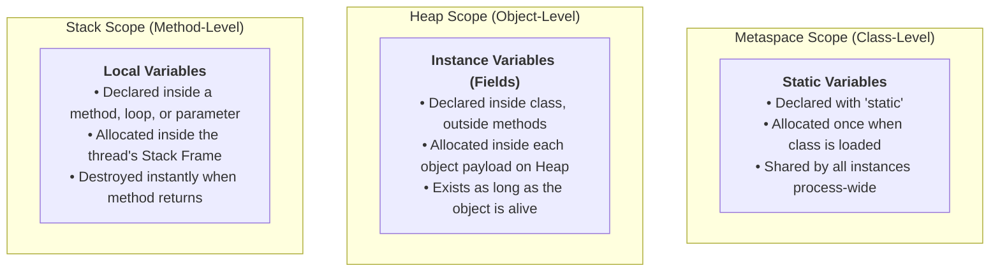
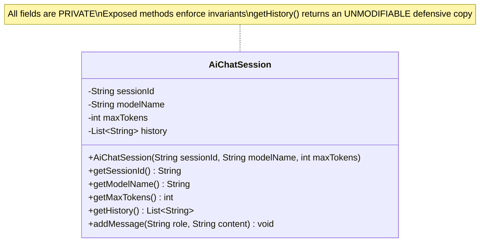
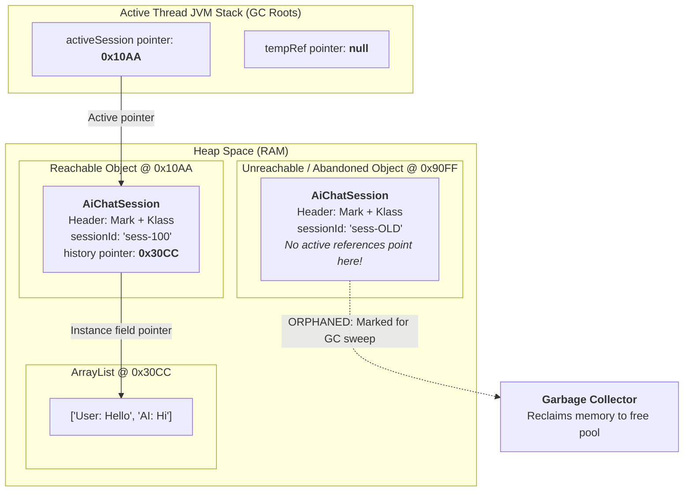

# Day_02 — OOP Classes, Objects, and Object Lifecycle in Memory

| ⬅️ Previous Day | 📚 Course Hub | ➡️ Next Day |
|:---|:---:|---:|
| [← Day 01: Java Ecosystem & Setup](../Day_01_Java_Ecosystem_and_Setup/Day_01_Java_Ecosystem_and_Setup.md) | [All 60 Days Overview](../../README.md) | [Day 03: Inheritance, Interfaces & Polymorphism →](../Day_03_Inheritance_Interfaces_Polymorphism/Day_03_Inheritance_Interfaces_Polymorphism.md) |

---

## 🎯 What You'll Understand By the End
- The physical distinction between **Class blueprints in Metaspace** and **Object instances in Heap Space**.
- The three scopes of Java variables: **local stack variables**, **heap instance fields**, and **metaspace static fields**.
- The exact 3-step runtime sequence when `new ClassName()` executes: **Memory Allocation**, **Default Zero-Initialization**, and **Constructor Execution**.
- What sits inside an **Object Header**: the **Mark Word** (hashcode, locking, GC age) and the **Klass Word** (pointer to Metaspace).
- How the `this` reference operates as an invisible, implicit pointer in slot `0` of method and constructor Stack Frames.
- Why **defensive copying** is mandatory to prevent accidental reference mutation and keep encapsulated memory secure.
- How the JVM Garbage Collector determines unreachability using **GC Roots**, how **Mark-and-Sweep** reclaims heap memory, and how static retention causes memory leaks.

---

## 🧠 The Problem This Solves

Imagine attempting to build a production GenAI chat service without structured objects and memory encapsulation:

1. **Disconnected Data Chaos**: You would have to track user IDs, conversation histories, prompt tokens, and model configurations in hundreds of loose, disconnected variables (`userId1`, `promptText1`, `temp1`, `userId2`, etc.). Passing conversation state between functions requires passing dozens of individual arguments.
2. **Accidental Memory Mutation**: Without encapsulation, any function can directly modify an internal token counter, alter an ongoing prompt, or inject a negative temperature value with zero validation:
   ```java
   // Unsafe, un-encapsulated code:
   session.tokenCount = -500; // Corrupts system billing!
   session.messages.clear();  // Wipes history from an unrelated thread!
   ```
3. **The Dangling Pointer and Memory Leak Dilemma**: In older languages without automatic memory management (like C/C++), developers must manually calculate byte sizes (`malloc`), track pointers, and free memory (`free`). If you forget to free an allocated block, your server runs out of RAM (**memory leak**); if you free memory while another thread is still reading it, your application crashes or corrupts live data (**dangling pointer**).

Object-Oriented Programming (OOP) solves data chaos by grouping related **state** (fields) and **behavior** (methods) into a secure, validated unit. Java's runtime memory model and **Garbage Collector** solve memory corruption by automating allocation, tracking object references, and cleaning up abandoned memory safely in the background.

---

# Section 1: The OOP Mental Model & Anatomy of a Class

## 📖 Core Concept: Class Blueprints vs. Heap Instances

To build an accurate mental model of Java, you must separate the **definition** of a structure from the **physical instance** living in RAM.

```
┌─────────────────────────────────────────────────────────────┐
│ METASPACE (Native Memory)                                   │
│  Class Blueprint: AiChatSession.class                       │
│   - Field descriptors: sessionId, modelName, maxTokens      │
│   - Method bytecodes: addMessage(), calculateRemaining()   │
│   - Static fields: DEFAULT_MODEL = "gpt-4o"                 │
└─────────────────────────────────────────────────────────────┘
                              │
               Instantiates via "new" keyword
                              ▼
┌─────────────────────────────────────────────────────────────┐
│ HEAP SPACE (RAM)                                            │
│  ┌────────────────────────────────┐  ┌────────────────────┐ │
│  │ Object Instance @ 0x4A10       │  │ Instance @ 0x8B20  │ │
│  │  - Object Header (Mark + Klass)│  │  - Header          │ │
│  │  - sessionId: "sess-001"       │  │  - sessionId: "002"│ │
│  │  - modelName: "gpt-4o"         │  │  - modelName: "o1" │ │
│  │  - maxTokens: 4096             │  │  - maxTokens: 8192 │ │
│  └────────────────────────────────┘  └────────────────────┘ │
└─────────────────────────────────────────────────────────────┘
```

### The Architectural Blueprint Analogy
- **The Class (Metaspace)**: The architectural blueprint drawn on paper. It defines the layout, wall placements, and electrical wiring. The blueprint itself occupies almost zero physical land.
- **The Object (Heap Space)**: The physical house constructed on a plot of land. Using one blueprint, you can build 50 houses. Each house occupies its own plot of ground (memory address), has its own interior paint color, and houses its own occupants (instance field state).

> 💡 **New Word Alert — "Class"**: A programmer-defined blueprint stored in Metaspace that defines the structure (fields) and behaviors (methods) that its objects will possess.

> 💡 **New Word Alert — "Object / Instance"**: A concrete, allocated block of physical RAM on the Heap created from a class blueprint using the `new` keyword.

---

## 🔬 Anatomy of a Class: The Three Variable Scopes (Rule 9: Memory-First Mandate)

Variables in Java live in three distinct physical memory regions depending on where they are declared:



*This diagram illustrates where data physically lives in memory based on its declaration scope. Static variables reside in Metaspace, instance fields reside inside object payloads on the Heap, and local variables reside inside temporary Stack Frames on the JVM Stack.*

| Scope | Declaration Syntax | Where It Lives in RAM | Lifecycle | Thread Safety |
|:---|:---|:---|:---|:---|
| **Local Variable** | Inside a method or block: `int count = 10;` | Inside the active **Stack Frame** (in the Local Variable Array). | Created when the method is entered; destroyed instantly when the method returns. | **Thread-safe by design** (confined to that thread's private stack). |
| **Instance Variable (Field)** | Inside a class, non-static: `private String userId;` | Inside the **Heap object payload** at a calculated byte offset. | Created when `new` executes; destroyed when the object is reclaimed by the Garbage Collector. | **Shared**: Any thread with a reference to the object can access it. |
| **Static Variable** | Inside a class, marked `static`: `public static int totalCalls;` | Inside **Metaspace** (linked to the `java.lang.Class` instance). | Created during class loading; destroyed only when the ClassLoader unloads. | **Shared globally**: Must be synchronized or made atomic under multi-threading. |

---

# Section 2: Object Creation Mechanics Under the Hood

## ⚙️ The Exact 3-Step Sequence of `new ClassName()`

When your program executes `AiChatSession session = new AiChatSession("user-99", 2048);`, the JVM executes a precise, low-level sequence:

```
Step 1: Heap Allocation ──► Step 2: Zero-Initialization ──► Step 3: Constructor Execution
(Carves out raw bytes)      (Sets all fields to 0/null)      (Runs user constructor code)
```

### Step 1: Memory Allocation on the Heap
- The JVM calculates the exact memory footprint required for the object:
  $$\text{Total Bytes} = \text{Object Header (12 or 16 bytes)} + \text{Sum of Instance Fields} + \text{Padding to multiple of 8 bytes}$$
- The JVM carves out this contiguous block of memory from the Heap (often from a **TLAB** — Thread Local Allocation Buffer, a thread-private chunk of Heap that avoids global synchronization locks).

### Step 2: Default Zero-Initialization
Before any line of your Java code runs, the JVM overwrites the newly allocated field memory with binary zeros:
- Numbers (`byte`, `short`, `int`, `long`, `float`, `double`) become `0` or `0.0`.
- Booleans become `false`.
- All object references (`String`, `List`, custom types) become `null`.
*Why this matters*: Unlike C/C++, Java guarantees you will **never** read dirty, uninitialized garbage memory left over from previous processes.

### Step 3: Constructor Execution & Chaining
1. The constructor Stack Frame is pushed onto the thread's JVM Stack.
2. The implicit `this` pointer (the memory address from Step 1) is stored in slot `0` of the Local Variable Array.
3. The constructor calls `super()` (the superclass constructor) to initialize inherited state.
4. Explicit field initializers run (e.g., `private int retryCount = 3;`).
5. The programmer's constructor body executes, assigning final values to fields.
6. The constructor finishes, and the memory address pointer is returned and assigned to the local variable on the Stack.

---

## 🏷️ The Object Header: Mark Word and Klass Word

Every object living on the Java Heap is prefixed by an internal JVM metadata structure called the **Object Header**:

```
┌────────────────────────────────────────────────────────────────────────┐
│ TOTAL OBJECT IN HEAP MEMORY                                            │
│                                                                        │
│ ┌────────────────────────────────────────────────────────────────────┐ │
│ │ OBJECT HEADER (12 to 16 bytes)                                     │ │
│ │  ┌───────────────────────────────────────────────────────────────┐ │ │
│ │  │ Mark Word (64 bits / 8 bytes)                                 │ │ │
│ │  │  - Identity HashCode (31 bits)                                │ │ │
│ │  │  - GC Age (4 bits: values 0 to 15 for generational promotion) │ │ │
│ │  │  - Biased Lock / Thread ID Pointer                            │ │ │
│ │  │  - Locking State Flags (unlocked, lightweight, heavyweight)  │ │ │
│ │  └───────────────────────────────────────────────────────────────┘ │ │
│ │  ┌───────────────────────────────────────────────────────────────┐ │ │
│ │  │ Klass Word / Pointer (32 bits with Compressed OOPs / 4 bytes) │ │ │
│ │  │  - Direct 64-bit/compressed pointer to the Class metadata in │ │ │
│ │  │    Metaspace (identifies what class this object belongs to)   │ │ │
│ │  └───────────────────────────────────────────────────────────────┘ │ │
│ └────────────────────────────────────────────────────────────────────┘ │
│                                                                        │
│ ┌────────────────────────────────────────────────────────────────────┐ │
│ │ INSTANCE FIELDS PAYLOAD                                            │ │
│ │  - Field 1: sessionId pointer (4 or 8 bytes)                       │ │
│ │  - Field 2: maxTokens primitive (4 bytes)                          │ │
│ └────────────────────────────────────────────────────────────────────┘ │
│ ┌────────────────────────────────────────────────────────────────────┐ │
│ │ ALIGNMENT PADDING (0 to 7 bytes to make total size a multiple of 8)│ │
│ └────────────────────────────────────────────────────────────────────┘ │
└────────────────────────────────────────────────────────────────────────┘
```

> 💡 **New Word Alert — "Mark Word"**: A 64-bit header word stored at the beginning of every Heap object that records runtime metadata: its hashcode, synchronization lock status, and Garbage Collection generation age.

> 💡 **New Word Alert — "Klass Word (Klass Pointer)"**: A memory pointer located in the object header that points directly to the class definition residing in **Metaspace**. This is how `obj.getClass()` works and how the JVM performs runtime method dispatch.

---

## 🎯 The `this` Reference as an Implicit Stack Parameter

When you write an instance method:
```java
public void recordTokens(int count) {
    this.totalTokens += count;
}
```

The Java compiler rewrites this under the hood into an operation that accepts an extra parameter:
```java
// How the bytecode actually treats the method:
public static void recordTokens(AiChatSession this, int count) {
    this.totalTokens += count;
}
```

When `session.recordTokens(45)` is invoked:
- Slot `0` of the `recordTokens` Stack Frame receives the memory pointer to `session` (the `this` pointer).
- Slot `1` receives the primitive integer `45`.
- Inside the method, `this.totalTokens` tells the CPU: *"Follow the memory address in Slot 0, navigate to the byte offset for `totalTokens` on the Heap, and add 45 to it."*

---

# Section 3: Encapsulation & Defensive Memory Design

## 🛡️ Public vs. Private: Guarding Object Invariants

Encapsulation is not just about writing getters and setters; it is about **defending the validity of internal memory state**.



*This class diagram illustrates encapsulation. Private internal fields are shielded from outside access. Mutators and accessors enforce boundary validation and defend against memory mutation.*

---

## ⚠️ The Defensive Copying Rule (Preventing Reference Leaks)

A devastating bug in Java occurs when a class makes its fields `private`, but accidentally exposes a **mutable reference** through a getter or constructor.

### The Attack on Encapsulated Memory:
```java
public class LeakySession {
    private final List<String> messages; // Mutable object reference!

    public LeakySession(List<String> incomingMessages) {
        this.messages = incomingMessages; // BUG 1: Direct pointer assignment!
    }

    public List<String> getMessages() {
        return this.messages; // BUG 2: Returns the direct Heap pointer!
    }
}
```

If an external caller writes:
```java
List<String> myMessages = new ArrayList<>();
myMessages.add("Hello AI");
LeakySession session = new LeakySession(myMessages);

// Malicious or accidental mutation outside the class:
myMessages.clear(); // Wipes internal memory of session!
session.getMessages().add("INJECTED MALICIOUS PROMPT"); // Corrupts internal state!
```

### The Defensive Memory Fix:
```java
public class SecureSession {
    private final List<String> messages;

    public SecureSession(List<String> incomingMessages) {
        // Defensive copy on ingestion: allocates a brand new list in Heap
        this.messages = new ArrayList<>(Objects.requireNonNull(incomingMessages));
    }

    public List<String> getMessages() {
        // Returns an unmodifiable view: external modifications throw UnsupportedOperationException
        return Collections.unmodifiableList(this.messages);
    }
}
```

---

# Section 4: Memory Lifecycle, Dereferencing & Garbage Collection

## 🗺️ Visual Overview: Stack References, Heap Objects, and GC Roots



*This diagram illustrates object reachability. `activeSession` on the Stack is a GC Root pointing to `0x10AA`, keeping both the session and its history list alive on the Heap. In contrast, object `0x90FF` has no incoming reference pointers from any active thread stack; it is unreachable and will be reclaimed during the next Garbage Collection sweep.*

---

## 🔬 Reaching Unreachability: GC Roots and Mark-and-Sweep

Java eliminates manual memory management through the **Garbage Collector (GC)**. The GC relies on the concept of **Reachability Graph Traversal**:

### 1. What Qualifies as a GC Root?
A **GC Root** is an anchor point in memory that is guaranteed to be alive:
1. **Thread Stack References**: Any local variable or parameter currently held inside an active Stack Frame on any running thread.
2. **Static Variables**: Any reference variable held in Metaspace by a loaded class.
3. **JNI References**: Native C/C++ pointers created during native platform calls.

### 2. The Mark-and-Sweep Algorithm
- **Phase 1: Marking**: The Garbage Collector pauses application threads briefly (Stop-the-World pause) and traverses memory starting at the **GC Roots**. It follows every memory pointer like links in a chain. Every object it encounters has a bit flipped in its Object Header Mark Word (**Marked as Reachable**).
- **Phase 2: Sweeping**: The Garbage Collector iterates through all allocated heap memory. Any memory block that lacks the "Reachable" mark is considered dead space. Its memory addresses are added to a free-memory list, available for future `new` allocations.
- **Phase 3: Compacting (in modern collectors like G1 and ZGC)**: Moves surviving objects together into contiguous memory blocks to eliminate heap fragmentation.

---

## 🕳️ Accidental Retention: How Java "Memory Leaks" Actually Happen

Java has automatic Garbage Collection, yet Java applications can still crash with `java.lang.OutOfMemoryError: Java heap space`. How?

A **memory leak in Java** is not an unreferenced block of memory. It is **unintentional reference retention**: an object that your business logic will never use again, but which remains tethered to a living GC Root!

```java
public class ModelRegistry {
    // GC ROOT: Static collection in Metaspace that lives for the ENTIRE lifetime of the JVM!
    private static final List<AiChatSession> CACHE = new ArrayList<>();

    public static void register(AiChatSession session) {
        CACHE.add(session); // Pointers are stored in CACHE...
        // BUG: If sessions are never removed from CACHE, they can NEVER be Garbage Collected!
        // Even if the user logged out 3 weeks ago, CACHE -> session keeps it alive forever!
    }
}
```

*The Fix*: Always clear collections when items are no longer needed, scope collections locally, or use weak references (`WeakHashMap`) for temporary caches.

---

## 💻 Concrete Code Walkthrough: Complete Memory Lifecycle Tracking

Let's trace an end-to-end encapsulated AI session class through allocation, defensive copying, pointer copying, dereferencing, and GC eligibility:

```java
package com.genai.foundations.day02;

import java.util.ArrayList;
import java.util.Collections;
import java.util.List;
import java.util.Objects;

public class AiSessionManager {

    public static void main(String[] args) {
        // Step 1: Primitive stack allocation
        int tokenLimit = 2048;

        // Step 2: Local list allocation on Heap
        List<String> initialPrompts = new ArrayList<>();
        initialPrompts.add("System: You are an AI assistant.");

        // Step 3: Instantiation of ChatSession (Memory allocation -> Zero-init -> Constructor)
        // 'session1' pointer on Stack points to Heap address 0x10AA
        ChatSession session1 = new ChatSession("session-abc", tokenLimit, initialPrompts);

        // Step 4: Pointer Copying (NOT Object duplication!)
        // 'session2' on Stack receives identical pointer 0x10AA
        ChatSession session2 = session1;

        // Step 5: Dereferencing session1
        session1 = null; 
        // Notice: The object at 0x10AA is STILL ALIVE because session2 still holds a pointer to it!

        // Step 6: Dereferencing session2
        session2 = null; 
        // NOW the object at 0x10AA has ZERO incoming pointers. It is officially ORPHANED for GC!

        System.out.println("Memory lifecycle demonstration completed.");
    }
}

class ChatSession {
    // Instance fields living on the Heap inside each ChatSession object payload
    private final String sessionId;
    private final int maxTokens;
    private final List<String> history;

    public ChatSession(String sessionId, int maxTokens, List<String> initialHistory) {
        // Validate invariants
        this.sessionId = Objects.requireNonNull(sessionId, "Session ID cannot be null");
        if (maxTokens <= 0) {
            throw new IllegalArgumentException("Token limit must be positive");
        }
        this.maxTokens = maxTokens;

        // DEFENSIVE COPY: Prevents external callers from mutating our internal Heap state!
        this.history = new ArrayList<>(Objects.requireNonNull(initialHistory));
    }

    public String getSessionId() {
        return sessionId; // Strings are immutable in Java, safe to return directly
    }

    public int getMaxTokens() {
        return maxTokens; // Primitives return raw values by copy
    }

    public List<String> getHistory() {
        // DEFENSIVE VIEW: Callers cannot alter internal history
        return Collections.unmodifiableList(this.history);
    }
}
```

### Memory Allocation & Lifecycle Trace Table

| Step / Code Line | Target Memory Area | Under-the-Hood Physical Memory Operation |
|:---|:---|:---|
| `int tokenLimit = 2048;` | **Stack (main frame)** | Slot `1` in `main`'s Local Variable Array is filled with raw integer bits `2048`. |
| `new ArrayList<>()` | **Heap Space** | Allocates an empty `ArrayList` object at address `0x05F0`. Pointer `0x05F0` stored in Slot `2` (`initialPrompts`). |
| `new ChatSession(...)` | **Heap Space** | 1. Carves out memory for `ChatSession` at `0x10AA` (Object Header + 3 fields).<br>2. Zeroes fields (`null`, `0`, `null`).<br>3. Runs constructor. Inside constructor frame, `this` holds `0x10AA`.<br>4. Defensive copy creates a second `ArrayList` at `0x30CC` containing the prompt. |
| `ChatSession session1 = ...` | **Stack (main frame)** | Slot `3` receives pointer `0x10AA`. |
| `ChatSession session2 = session1;` | **Stack (main frame)** | Slot `4` receives a copy of pointer `0x10AA`. Both slots point to the exact same Heap object. |
| `session1 = null;` | **Stack (main frame)** | Slot `3` is overwritten with address `0x00000000`. Object `0x10AA` is **not** eligible for GC because Slot `4` (`session2`) still holds `0x10AA`. |
| `session2 = null;` | **Stack (main frame)** | Slot `4` is overwritten with `null`. Object `0x10AA` now has **zero active GC Root paths**. It is marked as orphaned and will be reclaimed by the Garbage Collector. |

---

## 🔑 Key Terminology

| Term | Plain-English Meaning |
|:---|:---|
| **Class** | The structural blueprint stored in Metaspace defining fields and method bytecodes. |
| **Object (Instance)** | The concrete chunk of physical RAM allocated on the Heap containing real data. |
| **Object Header** | A 12-to-16-byte metadata prefix on every Heap object containing the **Mark Word** and **Klass Word**. |
| **Mark Word** | Part of the object header storing the identity hashcode, GC age bits, and thread locking status. |
| **Klass Word** | Part of the object header storing a pointer directly to the class definition in Metaspace. |
| **`this`** | An implicit reference pointer placed in slot `0` of method Stack Frames pointing to the current object on the Heap. |
| **Defensive Copying** | Creating an independent clone of an incoming or outgoing mutable object to prevent outside code from corrupting internal memory state. |
| **GC Root** | A living reference pointer (such as an active local variable on a thread stack) used by the Garbage Collector as a starting anchor for reachability analysis. |
| **Mark-and-Sweep** | The fundamental GC algorithm that marks all objects reachable from GC Roots and sweeps away unreachable memory. |
| **Memory Leak (Java)** | When an unused object cannot be garbage collected because it is unintentionally retained by a lingering GC Root (e.g., in a static collection). |

---

## ⚠️ Common Beginner Mistakes

### 1. The Pointer Copy Fallacy (`==` vs `.equals()`)
Beginners often use `==` to check if two distinct objects have the same data.

❌ **Wrong Way**:
```java
ChatSession s1 = new ChatSession("session-1", 1000, List.of());
ChatSession s2 = new ChatSession("session-1", 1000, List.of());

if (s1 == s2) { // ALWAYS evaluates to FALSE!
    System.out.println("Sessions match!");
}
```

✅ **Right Way**:
```java
if (s1.equals(s2)) { // Evaluates logical content equality!
    System.out.println("Sessions match!");
}
```
*Why it is wrong*: The `==` operator on reference variables compares the **numerical memory address pointers**. Because `s1` lives at (e.g.) `0x10AA` and `s2` lives at `0x20BB`, `s1 == s2` is false. To compare data contents, you must override and call `.equals()`.

---

### 2. Leaking Mutable Internal References via Getters
Returning internal mutable collections directly exposes private memory to outside tampering.

❌ **Wrong Way**:
```java
public class AgentMemory {
    private List<String> thoughts = new ArrayList<>();

    public List<String> getThoughts() {
        return this.thoughts; // DANGEROUS: Hands outside code the live Heap pointer!
    }
}
```

✅ **Right Way**:
```java
public class AgentMemory {
    private List<String> thoughts = new ArrayList<>();

    public List<String> getThoughts() {
        return Collections.unmodifiableList(this.thoughts); // Safe: Read-only view
    }
}
```
*Why it is wrong*: If you return the raw pointer, external code can call `getThoughts().clear()`, wiping internal memory without the owning class ever knowing.

---

### 3. Creating Lingering Static References (The Memory Leak Trap)
Adding objects to static collections without ever removing them.

❌ **Wrong Way**:
```java
public class PromptLogger {
    // Static collection lives in Metaspace forever!
    public static final List<ChatSession> ALL_SESSIONS = new ArrayList<>();

    public static void log(ChatSession s) {
        ALL_SESSIONS.add(s); // Never removed! Heap memory steadily expands until OOM crash!
    }
}
```

✅ **Right Way**:
```java
// Use bounded caches with eviction policies, WeakReferences, or store session IDs instead of full object graphs:
public class PromptLogger {
    public static void log(String sessionId, int tokenCount) {
        // Log lightweight metadata, not entire Heap object trees!
    }
}
```
*Why it is wrong*: Static variables are permanent GC Roots. Objects referenced by static fields will **never** be collected by the Garbage Collector, causing gradual memory exhaustion.

---

## ✅ Best Practices

1. **Enforce Immutability by Default**: Mark instance fields `final` wherever possible. Immutable objects cannot be corrupted after construction and are inherently thread-safe.
2. **Defend at the Perimeter**: Apply defensive copies in constructors for mutable inputs (`List`, `Map`, `Date`) and return unmodifiable wrappers (`Collections.unmodifiableList()`) in getters.
3. **Keep `this` Clean**: Use the `this` keyword to disambiguate field assignments in constructors (`this.name = name;`) to prevent shadowing errors.
4. **Never Retain Unnecessary Pointers**: When an object is done with its lifecycle, ensure references to it are cleared or allowed to fall out of scope so the Garbage Collector can reclaim heap memory immediately.

---

## 🔭 Looking Ahead
In **Day_03**, we will advance into **Inheritance, Interfaces, and Polymorphism**: discovering how subclasses extend parent memory layouts, how `super` constructor chaining works on the Stack, and how polymorphic interfaces allow dynamic swapping of AI model implementations at runtime.

---

## 📝 Quick Recap
- A **Class** is the blueprint in Metaspace; an **Object** is a physical allocation in Heap RAM.
- `new` executes in three atomic steps: **Memory Allocation** on Heap $\rightarrow$ **Default Zero-Initialization** $\rightarrow$ **Constructor Execution**.
- Every Heap object has an **Object Header** comprising the **Mark Word** (hashcode, locking, GC age) and the **Klass Word** (pointer to Metaspace blueprint).
- The `this` keyword represents an implicit reference pointer placed in slot `0` of method and constructor Stack Frames.
- **Defensive copying** protects encapsulated memory from outside reference mutation.
- An object becomes eligible for **Garbage Collection** the exact instant it can no longer be reached by traversing pointer chains from any living **GC Root**.

---

## 🧪 Try It Yourself

1. **Trace Reference Copying**: Write a class `ModelConfig` with a field `double temperature`. In `main()`, instantiate `configA` with temperature `0.7`. Assign `configB = configA`. Change `configB.temperature = 0.2`. Print `configA.temperature`. Explain why `configA` changed using pointer mechanics.
2. **Experiment with Defensive Copying**: Write a class `SecureRoster` that holds a `List<String> students`. Pass a list from `main()` into the constructor. Without modifying `SecureRoster` code, attempt to clear the roster from `main()`. Verify whether your defensive copying blocks the mutation.
3. **Simulate a Java Memory Leak**: Create a class with a `static List<byte[]> leaker = new ArrayList<>();`. Inside a loop, continuously allocate 1-megabyte arrays (`new byte[1024 * 1024]`) and add them to the list. Run the program with `-Xmx64m` and observe how quickly the JVM runs out of heap memory (`java.lang.OutOfMemoryError`).
