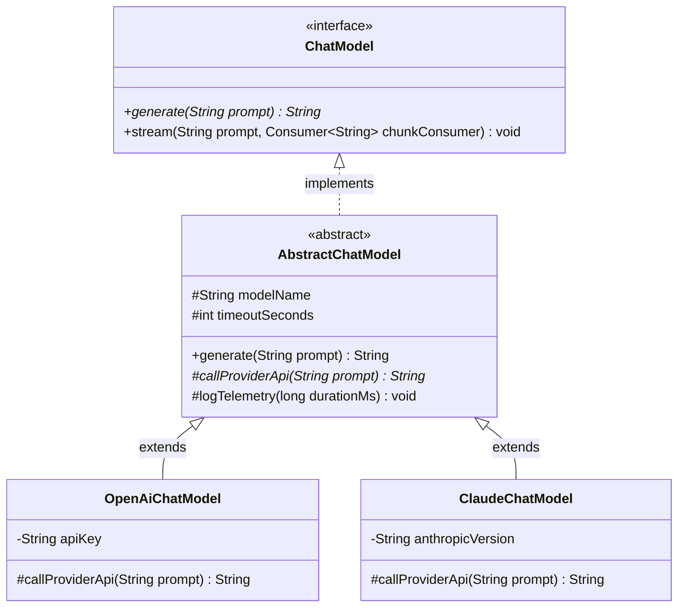

# Phase_01, Day_03 — Inheritance, Interfaces, Polymorphism, and Dynamic Dispatch in Memory

| ⬅️ Previous Day | 📚 Course Hub | ➡️ Next Day |
|:---|:---:|---:|
| [← Day 02: OOP — Classes, Objects & Memory](../Day_02_OOP_Classes_Objects_Memory/Day_02_OOP_Classes_Objects_Memory.md) | [Course Hub](../../README.md) | [Day 04: Generics, Collections & Data Structures →](../Day_04_Generics_Collections_DataStructures/Day_04_Generics_Collections_DataStructures.md) |

---

## 🎯 What You'll Understand By the End

- How **Inheritance (`extends`)** physically organizes memory by laying out parent and child fields contiguously inside a **single Heap object**.
- The exact execution order of **Constructor Chaining (`super()`)**: how Stack Frames push and pop while Heap memory initializes in strict hierarchical order from `java.lang.Object` down to the child class.
- The vital mechanical difference between **field hiding** (resolved at compile time by the reference type) and **method overriding** (resolved at runtime by the actual Heap object).
- How **Abstract Classes** (partial blueprints with instance state) contrast with **Interfaces** (pure behavioral contracts), and how modern interfaces utilize `default`, `static`, and `private` methods.
- The low-level mechanics of **Runtime Polymorphism & Dynamic Dispatch**: how the JVM uses **Virtual Method Tables (`vtable`)** and **Interface Method Tables (`itable`)** in Metaspace to execute polymorphic calls in instant $O(1)$ time.
- Why every class inherits from `java.lang.Object`, and how violating the strict contract between `equals()` and `hashCode()` silently corrupts HashMaps and HashSets.
- How to apply the **4-Pillar Evaluation Framework** (What is it? Why use it? What if we don't? Real-world use case) to make confident architectural design decisions in enterprise and GenAI systems.

---

## 🧠 The Problem This Solves / Why This Comes Up

Imagine you are building a production GenAI backend service that orchestrates multiple Large Language Model (LLM) providers (OpenAI GPT-4o, Anthropic Claude 3.5, Google Gemini, and local Ollama Llama 3).

### ❌ The Anti-Pattern: Procedural Branching Without Polymorphism

Without inheritance and interfaces, your code is forced into procedural spaghetti. Every model client is a disconnected, standalone class with completely different method names:

```java
// CATASTROPHIC ANTI-PATTERN: Procedural, tightly coupled, impossible to scale
public class AiChatService {
    private OpenAiClient openAi = new OpenAiClient("sk-openai-key");
    private ClaudeClient claude = new ClaudeClient("sk-ant-key");
    private OllamaClient ollama = new OllamaClient("http://localhost:11434");

    public String askAi(String provider, String prompt, int maxTokens, double temperature) {
        // Fragile branching duplicated across dozens of methods!
        if (provider.equalsIgnoreCase("OPENAI")) {
            OpenAiRequest req = new OpenAiRequest(prompt, maxTokens, temperature);
            return openAi.executeGptChat(req).getChoices().get(0).getText();
        } else if (provider.equalsIgnoreCase("CLAUDE")) {
            ClaudePayload payload = new ClaudePayload(prompt, "claude-3-5-sonnet", maxTokens);
            return claude.sendClaudeMessage(payload).getBody();
        } else if (provider.equalsIgnoreCase("OLLAMA")) {
            return ollama.queryLocalLlama(prompt);
        } else {
            throw new IllegalArgumentException("Unknown AI provider: " + provider);
        }
    }
}
```

Three disastrous consequences emerge in production:

1. **Violation of the Open-Closed Principle (OCP)**: Every time your team adds a new AI model (like DeepSeek or Mistral), you must open, edit, and re-test `AiChatService` and every other class containing this `if-else` cascade. Missing one file causes silent production bugs.
2. **Duplicated Cross-Cutting Logic**: Every model needs timeout enforcement, retry handling, rate-limiting, and telemetry logging. In procedural code, this identical logic is copy-pasted across every branch. Fixing a retry bug in OpenAI leaves Anthropic and Ollama vulnerable.
3. **Automated Unit Testing Is Impossible**: Because `AiChatService` directly instantiates concrete HTTP clients (`new OpenAiClient(...)`), running a unit test triggers real, billable HTTP calls to OpenAI! You cannot substitute a fast in-memory mock client.

### ✅ The Clean Architecture: Interface Contract + Polymorphic Dispatch

With proper OOP design:
- **`ChatModel` (Interface)**: Defines a universal, vendor-neutral contract (`generate(String prompt)`).
- **`AbstractChatModel` (Abstract Class)**: Implements shared cross-cutting logic once (timing, metrics, prompt validation).
- **`OpenAiChatModel`, `ClaudeChatModel`, `OllamaChatModel` (Concrete Classes)**: Implement only the provider-specific HTTP call.
- **`AiChatService` (Caller)**: Depends purely on the interface abstraction:

```java
public class AiChatService {
    private final ChatModel chatModel; // ZERO knowledge of concrete vendor!

    public AiChatService(ChatModel chatModel) {
        this.chatModel = chatModel; // Injected from outside (Dependency Injection)
    }

    public String askAi(String prompt) {
        return chatModel.generate(prompt); // Polymorphic dispatch via vtable!
    }
}
```

Now, adding a new model provider requires **zero modifications** to `AiChatService`. You simply implement the `ChatModel` interface in a new class and pass it in!

---

# Section 1: Inheritance (`extends`) & Physical Heap Memory Layout

---

## 📖 Core Concept, Explained Simply

In Java, **Inheritance** allows a child class (subclass) to inherit fields and methods from a parent class (superclass) using the `extends` keyword:

```java
public class BaseLanguageModel {
    protected String modelName;
    protected int maxTokens;
}

public class OpenAiChatModel extends BaseLanguageModel {
    private String apiKey;
}
```

### The Single-Object Reality in RAM
A common beginner misconception is that creating a child object creates two separate objects in memory (one for the parent, one for the child). **This is completely false.**

When you write `new OpenAiChatModel(...)`, the JVM allocates **one single, contiguous block of RAM** on the Heap. Inside that single block, the JVM arranges the memory layout in strict hierarchical order:

1. **The Object Header** (Mark Word + Klass Word) is placed at the front.
2. **Superclass fields** (`modelName`, `maxTokens`) are laid out immediately following the header.
3. **Subclass fields** (`apiKey`) are laid out next.

```
Physical Heap Memory Block for "new OpenAiChatModel()" @ 0x5B00
┌────────────────────────────────────────────────────────────────────────┐
│ [Object Header: Mark Word (8 bytes) + Klass Word (4/8 bytes)]          │
├────────────────────────────────────────────────────────────────────────┤
│ PARENT FIELDS (from BaseLanguageModel):                                │
│   • modelName (reference pointer)                                      │
│   • maxTokens (int, 4 bytes)                                           │
├────────────────────────────────────────────────────────────────────────┤
│ CHILD FIELDS (from OpenAiChatModel):                                   │
│   • apiKey (reference pointer)                                         │
└────────────────────────────────────────────────────────────────────────┘
```

The child instance *is* the parent instance, physically extended with additional fields.

---

## 🧭 The Field Hiding Trap vs. Method Overriding

What happens if a child class declares a field with the **exact same name** as a parent field?

```java
public class ParentModel {
    public int contextWindow = 4096;
}

public class ChildModel extends ParentModel {
    public int contextWindow = 128000; // ⚠️ FIELD HIDING! Does NOT override!
}
```

Now trace this in `main()`:
```java
ParentModel modelRef = new ChildModel();
System.out.println(modelRef.contextWindow); // PRINTS 4096, NOT 128000!
```

### Why Did It Print 4096?
- **Fields are NOT polymorphic in Java.** Fields do not participate in dynamic dispatch.
- Field access is resolved at **compile time** based purely on the **reference type** (`ParentModel`), not the runtime object on the Heap.
- In memory, the Heap object contains **two distinct fields** named `contextWindow` (one in the parent segment, one in the child segment). Because `modelRef` is of type `ParentModel`, the compiler points directly to the parent offset.

> 💡 **Golden Rule**: Never declare public or protected fields in child classes that share names with parent fields. Always encapsulate fields behind `private` and use polymorphic **getter methods**.

---

# Section 2: Constructor Chaining (`super()`) & Stack Mechanics

---

## 📖 How Constructors Execute Hierarchically

Before a child class can initialize its own fields, its parent class **must** be allowed to initialize its fields and enforce its invariants.

To guarantee this, Java enforces **Constructor Chaining**:
- Every constructor's very first line must be a call to either `super(...)` (calling a parent constructor) or `this(...)` (calling an overloaded constructor in the same class).
- If you do not explicitly type `super()`, the Java compiler **automatically inserts `super();`** as the first instruction.

### Tracing the Stack Frames During Construction
When you execute `new OpenAiChatModel("gpt-4o", 4096, "sk-test")`:

```
Step 1: main() calls OpenAiChatModel constructor
┌──────────────────────────────────────────────┐
│ Stack Frame: OpenAiChatModel(...)            │ ← Enters, pauses at line 1 (super)
└──────────────────────────────────────────────┘

Step 2: super() calls BaseLanguageModel constructor
┌──────────────────────────────────────────────┐
│ Stack Frame: BaseLanguageModel(...)          │ ← Enters, pauses at line 1 (super)
├──────────────────────────────────────────────┤
│ Stack Frame: OpenAiChatModel(...)            │
└──────────────────────────────────────────────┘

Step 3: super() calls java.lang.Object constructor
┌──────────────────────────────────────────────┐
│ Stack Frame: Object()                        │ ← Root constructor finishes! Pops!
├──────────────────────────────────────────────┤
│ Stack Frame: BaseLanguageModel(...)          │
├──────────────────────────────────────────────┤
│ Stack Frame: OpenAiChatModel(...)            │
└──────────────────────────────────────────────┘

Step 4: BaseLanguageModel initializes parent fields and pops
Step 5: OpenAiChatModel initializes child fields and pops
Step 6: Address of fully initialized object is returned to main()!
```

Throughout this entire sequence, every constructor's `this` pointer points to the **exact same memory address** on the Heap! The memory block is zero-initialized first, then parent fields are populated, and finally child fields are populated.

---

# Section 3: Abstract Classes vs. Interfaces

---

## 📖 The Structural Distinction: "IS-A" vs. "CAN-DO"

Java provides two distinct mechanisms for defining abstractions:

```
┌──────────────────────────────────────┬──────────────────────────────────────┐
│ ABSTRACT CLASS                       │ INTERFACE                            │
├──────────────────────────────────────┼──────────────────────────────────────┤
│ Represents an "IS-A" relationship    │ Represents a "CAN-DO" capability     │
│ Can hold INSTANCE STATE (fields)     │ Has ZERO instance state (no fields)  │
│ Can have CONSTRUCTORS                │ CANNOT have constructors             │
│ Single inheritance only (1 class)    │ Multiple implementation (unlimited)  │
│ Best for: Partial base templates     │ Best for: Public behavioral API      │
└──────────────────────────────────────┴──────────────────────────────────────┘
```

### 1. Abstract Classes (Template Method Pattern)
An abstract class cannot be instantiated directly with `new`. It is designed to be subclassed. It can contain:
- Concrete instance fields (`protected String modelName`).
- Constructors (invoked via `super()` from child classes).
- Concrete methods with default implementation logic.
- `abstract` methods (signatures without bodies that subclasses *must* implement).

**Use Case**: The **Template Method Pattern**. The abstract parent defines the invariant skeleton of an algorithm (e.g., logging, timing, error handling), while delegating individual steps to subclasses via abstract methods.

### 2. Interfaces (Pure Behavioral Contracts)
An interface defines a contract of capabilities that any class can implement regardless of its inheritance hierarchy.
A class can implement **multiple interfaces** (`class OpenAiModel implements ChatModel, Auditable, AutoCloseable`).

### Modern Interface Evolution (Java 8, 9+)
Interfaces in modern Java are far more capable than simple lists of abstract methods:

1. **`default` Methods (Java 8)**: Allows adding new methods to existing interfaces with a fallback implementation body without breaking existing classes that implement the interface!
   ```java
   public interface ChatModel {
       String generate(String prompt);

       // Fallback default method for streaming:
       default void stream(String prompt, Consumer<String> tokenConsumer) {
           // Default fallback: generate complete text, emit once
           tokenConsumer.accept(generate(prompt));
       }
   }
   ```
2. **`static` Methods (Java 8)**: Utility or factory methods associated directly with the interface namespace (e.g., `ChatModel.ofDefault()`).
3. **`private` Methods (Java 9)**: Encapsulated helper methods shared between multiple `default` methods inside the interface without exposing them to the public API.

---

# Section 4: Polymorphism & Dynamic Method Dispatch in Memory (`vtable` & `itable`)

---

## 📖 How Polymorphism Works Under the Hood

**Polymorphism** (from Greek: "many shapes") allows an object of a subclass to be treated as an instance of its superclass or interface:

```java
// Reference type is ChatModel, but actual Heap object is OpenAiChatModel
ChatModel model = new OpenAiChatModel("gpt-4o", 4096);
model.generate("What is Java?"); // Calls OpenAiChatModel.generate()!
```

How does the JVM know which method to execute when `model.generate(...)` is called, without checking slow `if-else` string comparisons at runtime?

### The Secret: Virtual Method Tables (`vtable`)
When the JVM loads a class into **Metaspace**, it constructs an internal array of function pointers called a **Virtual Method Table (`vtable`)**.

- Every method inherited from `java.lang.Object` occupies a fixed slot index in the table (e.g., Slot 0: `toString()`, Slot 1: `equals()`, Slot 2: `hashCode()`).
- Methods declared by parent classes occupy subsequent fixed slot indices (e.g., Slot 3: `generate()`).
- If a child class **overrides** `generate()`, the JVM replaces the function pointer in Slot 3 with the memory address of the child's compiled native code!

```
METASPACE MEMORY:
BaseLanguageModel vtable:
Slot 0 [toString]  ──► java.lang.Object.toString()
Slot 1 [equals]    ──► java.lang.Object.equals()
Slot 2 [generate]  ──► BaseLanguageModel.generate()

OpenAiChatModel vtable:
Slot 0 [toString]  ──► java.lang.Object.toString()
Slot 1 [equals]    ──► java.lang.Object.equals()
Slot 2 [generate]  ──► OpenAiChatModel.generate()  <-- OVERRIDDEN!
```

### The $O(1)$ Dispatch Sequence
When Java executes `model.generate("What is Java?")`:
1. The CPU looks at the reference variable on the Stack and fetches the Heap memory address (`0x5B00`).
2. At `0x5B00`, it reads the **Klass Word** from the Object Header. The Klass Word points to `OpenAiChatModel.class` in Metaspace.
3. It inspects the `vtable` of that class at the pre-calculated offset (Slot 2).
4. It immediately jumps execution to the function pointer stored at Slot 2.

This entire resolution happens in **constant time $O(1)$** with zero branching overhead!

---

# Section 5: `java.lang.Object` — The Universal Root & Hash Contracts

---

## 📖 The Common Ancestor of All Java Objects

In Java, every single class implicitly extends `java.lang.Object`. If you write `public class MyClass {}`, the compiler rewrites it as:
```java
public class MyClass extends java.lang.Object {}
```

This guarantees that every object on the Heap inherits foundational lifecycle methods:
- `toString()`: Returns a human-readable string representation (defaults to `ClassName@HexHashCode`).
- `equals(Object obj)`: Evaluates whether two references point to the same identity (`this == obj`) by default.
- `hashCode()`: Returns an integer hash code derived from the object's identity in the Object Header's Mark Word.
- `getClass()`: Returns the runtime `Class<?>` metadata pointer.

### The Sacred `equals()` and `hashCode()` Contract
If you override `.equals()` to check value equality (e.g., two chat sessions are equal if they have the same `sessionId`), **you MUST also override `.hashCode()`**:

> ⚠️ **The Golden Contract**: If `a.equals(b) == true`, then `a.hashCode() == b.hashCode()` MUST return the identical integer value!

If you violate this contract by overriding `equals()` but omitting `hashCode()`, **HashMaps and HashSets break completely**:

```java
public class ModelKey {
    private String name;
    public ModelKey(String name) { this.name = name; }

    @Override
    public boolean equals(Object o) {
        if (this == o) return true;
        if (!(o instanceof ModelKey other)) return false;
        return Objects.equals(name, other.name);
    }
    // BUG: hashCode() is NOT overridden! Inherits default identity hash from Object!
}

// In main():
Map<ModelKey, String> registry = new HashMap<>();
registry.put(new ModelKey("gpt-4o"), "Active");

// Returns NULL! Two equal objects get assigned completely different hash buckets!
String status = registry.get(new ModelKey("gpt-4o")); 
System.out.println(status); // Prints: null
```

---

## 🧭 Real-World Analogy

### 1. The USB-C Standard (Interfaces as Capabilities)
Think of a **USB-C Port**:
- The USB-C specification is an **interface**. It defines pin layouts, voltage tolerances, and data transfer protocols. It owns zero silicon, batteries, or memory.
- A MacBook, an external SSD, and an Android phone all implement the USB-C interface.
- A wall charger does not know or care what device is plugged in; it only speaks the USB-C protocol. That is **polymorphism**.

### 2. Automotive Chassis (Abstract Classes as Templates)
Think of an **Automotive Platform (Chassis)**:
- A car manufacturer builds a shared modular chassis with suspension, steering column, and engine mounts. You cannot drive a bare chassis down the highway — it is **abstract**.
- The chassis provides shared state and baseline mechanics (constructor, wheels, braking system).
- The engineering team creates concrete models on top of it: a family sedan, an electric SUV, a delivery van. Each inherits the chassis mechanics while adding custom body panels and interiors.

---

## 🗺️ Visual Overview



---

## 💻 Code Walkthrough: Production GenAI Model Abstraction

Let's implement a production-grade, extensible model provider architecture:

### 1. The Interface Contract
```java
package com.genai.foundations.model;

import java.util.function.Consumer;

/**
 * Universal contract for all GenAI model providers.
 */
public interface ChatModel {

    /** Core abstract method that all providers must implement */
    String generate(String prompt);

    /** Modern Java default method: streaming capability with fallback */
    default void stream(String prompt, Consumer<String> chunkConsumer) {
        // Fallback: generate complete response and emit as a single chunk
        String fullResponse = generate(prompt);
        chunkConsumer.accept(fullResponse);
    }

    /** Static factory helper */
    static String formatPrompt(String systemPrompt, String userPrompt) {
        return "SYSTEM: " + systemPrompt + "\nUSER: " + userPrompt;
    }
}
```

### 2. The Abstract Base Template
```java
package com.genai.foundations.model;

/**
 * Template Method Pattern: Implements shared metrics, timing, and validation.
 */
public abstract class AbstractChatModel implements ChatModel {

    protected final String modelName;
    protected final int timeoutSeconds;

    public AbstractChatModel(String modelName, int timeoutSeconds) {
        if (modelName == null || modelName.isBlank()) {
            throw new IllegalArgumentException("modelName must not be empty");
        }
        this.modelName = modelName;
        this.timeoutSeconds = timeoutSeconds;
    }

    /** Template Method: Defines invariant execution workflow */
    @Override
    public final String generate(String prompt) {
        if (prompt == null || prompt.isBlank()) {
            throw new IllegalArgumentException("Prompt must not be empty");
        }

        long startTime = System.currentTimeMillis();
        System.out.println("[" + modelName + "] Initiating call (timeout: " + timeoutSeconds + "s)...");

        // Delegate specific HTTP execution to concrete subclass
        String result = callProviderApi(prompt);

        long duration = System.currentTimeMillis() - startTime;
        System.out.println("[" + modelName + "] Completed in " + duration + " ms");
        return result;
    }

    /** Primitive operation: must be implemented by vendor subclasses */
    protected abstract String callProviderApi(String prompt);
}
```

### 3. Concrete Vendor Implementations
```java
package com.genai.foundations.model;

public class OpenAiChatModel extends AbstractChatModel {

    private final String apiKey;

    public OpenAiChatModel(String modelName, int timeoutSeconds, String apiKey) {
        super(modelName, timeoutSeconds); // Chained to parent constructor!
        this.apiKey = apiKey;
    }

    @Override
    protected String callProviderApi(String prompt) {
        // Simulated HTTP call to api.openai.com/v1/chat/completions
        return "OpenAI (" + modelName + ") response to: '" + prompt + "'";
    }
}
```

```java
package com.genai.foundations.model;

public class ClaudeChatModel extends AbstractChatModel {

    private final String anthropicVersion;

    public ClaudeChatModel(String modelName, int timeoutSeconds, String anthropicVersion) {
        super(modelName, timeoutSeconds);
        this.anthropicVersion = anthropicVersion;
    }

    @Override
    protected String callProviderApi(String prompt) {
        // Simulated HTTP call to api.anthropic.com/v1/messages
        return "Claude (" + modelName + " - " + anthropicVersion + ") response to: '" + prompt + "'";
    }
}
```

### 4. The Client Service (Polymorphic Consumer)
```java
package com.genai.foundations.model;

public class AiChatService {

    private final ChatModel model; // Clean dependency injection!

    public AiChatService(ChatModel model) {
        this.model = model;
    }

    public void runUserQuery(String userQuery) {
        String response = model.generate(userQuery); // Dispatched via vtable!
        System.out.println("Service Received: " + response);
    }

    public static void main(String[] args) {
        // We can swap providers without changing a single line in AiChatService!
        ChatModel gpt = new OpenAiChatModel("gpt-4o", 30, "sk-openai-key");
        ChatModel claude = new ClaudeChatModel("claude-3-5-sonnet", 45, "2023-06-01");

        System.out.println("--- Test 1: OpenAI ---");
        AiChatService service1 = new AiChatService(gpt);
        service1.runUserQuery("Explain Quantum Computing");

        System.out.println("\n--- Test 2: Anthropic Claude ---");
        AiChatService service2 = new AiChatService(claude);
        service2.runUserQuery("Explain Quantum Computing");
    }
}
```

---

## 🔬 Let's Trace Through It: Execution Trace & Memory Layout

Let's trace: `ChatModel gpt = new OpenAiChatModel("gpt-4o", 30, "sk-openai-key");`

| Step | Location | Action | Physical RAM Effect |
|:---:|:---|:---|:---|
| **1** | Heap | Memory allocation | JVM allocates a contiguous memory block at address `0x7A20` with zero-initialized fields. |
| **2** | Stack | Constructor Call | `main()` pushes Stack Frame for `OpenAiChatModel(...)` with `this = 0x7A20`. |
| **3** | Stack | Chaining to Parent | `OpenAiChatModel` calls `super("gpt-4o", 30)`. Pushes Stack Frame for `AbstractChatModel(...)`. |
| **4** | Stack | Chaining to Object | `AbstractChatModel` calls `super()`. Pushes Stack Frame for `java.lang.Object()`. |
| **5** | Heap | Field population | `AbstractChatModel` sets `modelName = "gpt-4o"` and `timeoutSeconds = 30` in the parent segment of `0x7A20`. |
| **6** | Heap | Field population | `OpenAiChatModel` sets `apiKey = "sk-openai-key"` in the child segment of `0x7A20`. |
| **7** | Stack | Reference Binding | `ChatModel gpt` local variable on the Stack receives pointer value `0x7A20`. |

Now when `gpt.generate("Hello")` executes:
- The JVM reads the **Klass Word** from the header at `0x7A20`, identifying it as `OpenAiChatModel`.
- It jumps to the `vtable` in Metaspace and finds `generate()` mapped to `AbstractChatModel.generate()` (which is inherited).
- Inside `generate()`, it calls `callProviderApi("Hello")`.
- It consults the `vtable` again for `callProviderApi()`, finds it points to `OpenAiChatModel.callProviderApi()`, and executes the child's native code!

---

## 🧩 Why It's Designed This Way

### Why does Java forbid Multiple Inheritance of Classes?
Languages like C++ allow a class to inherit from multiple classes simultaneously (`class C : public A, public B`). This causes the infamous **Deadly Diamond of Death**:
If Class A defines `void process()`, and both Class B and Class C override `process()`, which method should Class D inherit if it extends both B and C?
The compiler cannot resolve which field layout or method implementation to choose, introducing compiler ambiguity and memory layout complexity.

Java eliminates this entirely:
- **Classes**: Strict single inheritance (`extends OneClass`). Exactly one parent memory layout.
- **Interfaces**: Multiple implementation (`implements ContractA, ContractB`). Because interfaces own zero instance fields, there is never any conflict in memory layout. If two default methods conflict, Java forces the developer to override and disambiguate explicitly.

---

## ⚠️ Common Beginner Mistakes

### 1. The Field Hiding Trap
```java
// ❌ WRONG: Declaring child fields with parent names
class Parent { public int port = 8080; }
class Child extends Parent { public int port = 9090; }

Parent p = new Child();
System.out.println(p.port); // Prints 8080! Binds to reference type at compile time!
```
```java
// ✅ CORRECT: Use private fields with polymorphic getters
class Parent { 
    private int port = 8080;
    public int getPort() { return port; }
}
class Child extends Parent { 
    private int port = 9090;
    @Override
    public int getPort() { return port; }
}

Parent p = new Child();
System.out.println(p.getPort()); // Prints 9090 via vtable dynamic dispatch!
```

### 2. Calling an Overridable Method Inside a Constructor
```java
// ❌ DANGEROUS ANTI-PATTERN: Calling virtual methods in constructors
class SuperService {
    public SuperService() {
        init(); // ⚠️ If child overrides init(), it runs BEFORE child fields are initialized!
    }
    public void init() { System.out.println("Base init"); }
}

class SubService extends SuperService {
    private String token = "SECRET"; // Not yet initialized when super() runs!

    @Override
    public void init() {
        System.out.println("Sub init: " + token.toLowerCase()); // CRASH! NullPointerException!
    }
}
```
**Why it fails**: Parent constructors execute *before* child instance initializers. If the parent calls an overridden method, the child method executes against uninitialized child fields!

### 3. Unchecked Downcasting (`ClassCastException`)
```java
// ❌ WRONG: Blind casting
ChatModel model = new OpenAiChatModel("gpt-4o", 30, "key");
ClaudeChatModel claude = (ClaudeChatModel) model; // CRASH! ClassCastException!
```
```java
// ✅ CORRECT: Modern pattern matching for instanceof (Java 16+)
if (model instanceof ClaudeChatModel claude) {
    // Safely cast and bound to 'claude' variable in this scope
    System.out.println(claude.getAnthropicVersion());
}
```

---

## ✅ Best Practices

1. **Favor Composition Over Inheritance**: Use inheritance strictly for genuine, permanent **"IS-A"** relationships. If you only need to reuse code or delegate work, inject the object as a field ("HAS-A").
2. **Always Use `@Override`**: The `@Override` annotation instructs the compiler to verify that you are truly overriding a method. If you misspell the method name or change a parameter type, the compiler fails immediately instead of silently creating an accidental overload.
3. **Program to Interfaces, Not Concrete Classes**: Always declare reference variables, method parameters, and return types using the most general interface possible:
   ```java
   // ✅ Good:
   ChatModel model = new OpenAiChatModel(...);
   List<String> history = new ArrayList<>();

   // ❌ Avoid:
   OpenAiChatModel model = new OpenAiChatModel(...);
   ArrayList<String> history = new ArrayList<>();
   ```
4. **Mark Classes `final` When Extension Is Not Intended**: If a class is not explicitly designed for extension, declare it `public final class`. This prevents unintended subclassing and allows the JIT compiler to **devirtualize** calls, bypassing the `vtable` lookup entirely for maximum execution speed.

---

## 🔭 Looking Ahead

In **Day 04**, we build directly on type safety and inheritance to master **Generics, Collections, and Data Structures**.

You will learn:
- Why Generics were introduced to eliminate dangerous runtime `ClassCastException`s.
- How **Type Erasure** works inside bytecode and Metaspace.
- Covariance vs. Contravariance (`<? extends T>` vs. `<? super T>`) using the **PECS rule** (Producer Extends, Consumer Super).
- The internal array and hashing mechanics of `ArrayList`, `LinkedList`, `HashMap`, and `ConcurrentHashMap`.

---

## 📝 Quick Recap

- **Inheritance (`extends`)** allocates parent and child fields together in a **single contiguous block of Heap RAM**.
- **Constructor Chaining (`super()`)** ensures state is initialized hierarchically starting from `java.lang.Object` down to the child class.
- **Fields bind statically** at compile time based on the variable's reference type. **Methods dispatch dynamically** at runtime based on the actual Heap object.
- **Abstract Classes** model partial templates with instance state (Is-A); **Interfaces** define pure behavioral contracts with zero instance state (Can-Do).
- Modern interfaces support `default` methods (backward-compatible API evolution), `static` methods (utility helpers), and `private` methods (encapsulated shared logic).
- **Dynamic Dispatch** is achieved in constant $O(1)$ time via **`vtable`** arrays in Metaspace referenced by the Object Header Klass pointer.
- Overriding `equals()` strictly mandates overriding `hashCode()` to maintain hash bucket consistency in collections.

---

## 🧪 Try It Yourself

1. **Verify Constructor Order**:
   Create three classes: `Grandparent`, `Parent`, and `Child`. Add a print statement in each constructor. Instantiate `new Child()` in `main()` and observe the exact console output order to verify Stack Frame pushes and pops.
2. **Reproduce and Fix the Broken Map Key Bug**:
   Create a class `SessionKey` with a `String id` field. Override `.equals()` so two keys with matching IDs are equal, but **do not** override `.hashCode()`. Put `new SessionKey("sess-1")` into a `HashMap<SessionKey, String>`. Try to retrieve the value using `map.get(new SessionKey("sess-1"))`. Verify it returns `null`! Then override `.hashCode()` using `Objects.hash(id)` and verify it successfully retrieves the value.
3. **Inspect Bytecode for Dynamic Dispatch**:
   Compile `AiChatService.java`. In your terminal, run the disassembler:
   ```bash
   javap -c com.genai.foundations.model.AiChatService
   ```
   Inspect the bytecode for `runUserQuery()`. Verify that the JVM uses the instruction `invokeinterface` when calling `ChatModel.generate()`.

---

| ⬅️ Previous Day | 📚 Course Hub | ➡️ Next Day |
|:---|:---:|---:|
| [← Day 02: OOP — Classes, Objects & Memory](../Day_02_OOP_Classes_Objects_Memory/Day_02_OOP_Classes_Objects_Memory.md) | [Course Hub](../../README.md) | [Day 04: Generics, Collections & Data Structures →](../Day_04_Generics_Collections_DataStructures/Day_04_Generics_Collections_DataStructures.md) |
