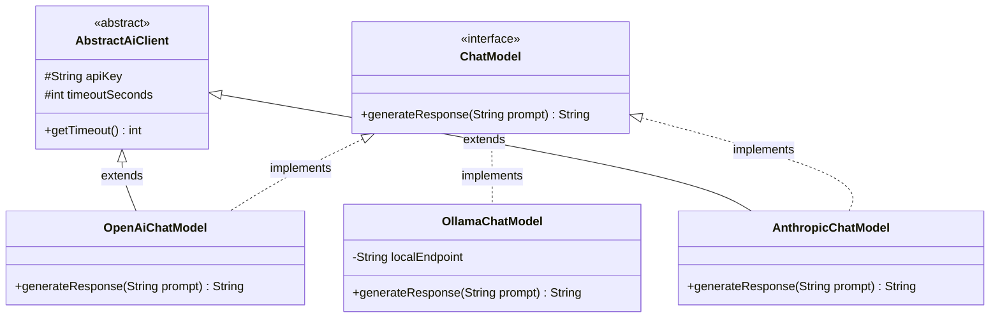

# Day_03 — Inheritance, Interfaces, Polymorphism

| ⬅️ Previous Day | 📚 Course Hub | ➡️ Next Day |
|:---|:---:|---:|
| [← Day 02: OOP — Classes, Objects & Memory](../Day_02_OOP_Classes_Objects_Memory/Day_02_OOP_Classes_Objects_Memory.md) | [All 60 Days Overview](../../README.md) | [Day 04: Generics, Collections & Data Structures →](../Day_04_Generics_Collections_DataStructures/Day_04_Generics_Collections_DataStructures.md) |

---

## 🎯 What You'll Understand By the End
- How **Inheritance** lets child classes inherit and extend fields and methods from a parent class.
- The vital difference between **Method Overloading** (same name, different arguments) and **Method Overriding** (subclass replaces parent behavior).
- How **Interfaces** define non-negotiable architectural contracts without dictating internal implementation.
- How **Polymorphism** allows you to swap AI model providers (like OpenAI, Anthropic, or local Ollama) using a single line of code without touching business logic.
- Why modern enterprise architecture follows the golden rule: *"Favor composition over inheritance."*

---

## 🧠 The Problem This Solves

Imagine writing an enterprise AI application that connects directly to OpenAI's API. Throughout your codebase, your controllers, services, and prompt evaluators directly instantiate `OpenAiClient`.

Months later, your company decides to run local open-weight models (like LLaMA via Ollama) to cut costs, or use Anthropic Claude for high-reasoning tasks:
- Without interfaces and polymorphism, you would have to write dozens of messy `if/else` checks everywhere:
  ```java
  if (provider.equals("OPENAI")) {
      openAiClient.sendPrompt(p);
  } else if (provider.equals("ANTHROPIC")) {
      anthropicClient.generateCompletion(p);
  } else if (provider.equals("OLLAMA")) {
      ollamaClient.invokeModel(p);
  }
  ```
- Every provider has different method names, different parameter structures, and different return types.
- Adding a fourth provider forces you to hunt down and edit every single file across your entire project.

**Interfaces and Polymorphism** solve this cleanly by establishing a universal contract (like `ChatModel`). Your application code interacts exclusively with that contract. Any specific AI provider can be plugged in seamlessly, just like plugging any USB-C device into a single port.

---

## 📖 Core Concept, Explained Simply

### 1. Inheritance (The "Is-A" Relationship)
Inheritance allows a subclass to acquire the fields and methods of a superclass using the `extends` keyword.
- For example, an `AiMessage` parent class might have a `timestamp` and a `role`.
- A `UserMessage` class **is-a** `AiMessage`, and a `SystemMessage` class **is-a** `AiMessage`. Both inherit `timestamp` and `role` without retyping the code.
- In Java, a class can `extend` only **one single parent class** (single inheritance).

### 2. Interfaces (The Universal USB-C Contract)
An **interface** defines *what* a class must do, but provides zero details on *how* to do it. It is an unbending contract.

Think of a **USB-C port**:
- The USB-C standard dictates exact pin dimensions and power signal rules (the interface).
- Whether you plug in a mouse, an external SSD, or an AI accelerator camera (the implementations), your computer doesn't care. As long as the device implements the USB-C standard, it works immediately.

### 3. Polymorphism ("Many Forms")
Polymorphism is the ability of an object to be treated as an instance of its parent type or interface.
- You can declare a variable of type `ChatModel` (the interface), but assign it an instance of `OpenAiChatModel` or `OllamaChatModel`.
- When your code calls `model.generate("Explain Docker")`, Java dynamically determines which specific provider's method to execute at runtime.

> 💡 **New Word Alert — "Polymorphism"**: From Greek meaning "many forms." In Java, it means treating different underlying objects through a single common interface or superclass reference.

> 💡 **New Word Alert — "Method Overriding"**: When a child class provides its own specialized implementation of a method that is already defined in its parent class or interface, marked with `@Override`.

---

## 🗺️ Visual Overview



*This diagram illustrates polymorphism in action. `ChatModel` defines the universal interface. Specific providers (`OpenAiChatModel`, `AnthropicChatModel`, and `OllamaChatModel`) all implement this contract. Your application code talks only to `ChatModel`, completely insulated from provider-specific implementation details.*

---

## 💻 Code Walkthrough

Here is a minimal, complete Java 17+ implementation showing an interface, an abstract base class, and polymorphic execution:

```java
// 1. The Interface Contract
interface ChatModel {
    String generateResponse(String prompt);
}

// 2. Concrete Implementation: OpenAI
class OpenAiChatModel implements ChatModel {
    private final String modelName;

    public OpenAiChatModel(String modelName) {
        this.modelName = modelName;
    }

    @Override
    public String generateResponse(String prompt) {
        return "[OpenAI " + modelName + "]: Analyzed '" + prompt + "' using cloud API.";
    }
}

// 3. Concrete Implementation: Local Ollama
class OllamaChatModel implements ChatModel {
    private final String localEndpoint;

    public OllamaChatModel(String localEndpoint) {
        this.localEndpoint = localEndpoint;
    }

    @Override
    public String generateResponse(String prompt) {
        return "[Ollama @ " + localEndpoint + "]: Processed '" + prompt + "' entirely on local GPU.";
    }
}

// 4. Client Code Using Polymorphism
public class AiRouterDemo {
    // This method accepts ANY object that implements ChatModel!
    public static void executePrompt(ChatModel model, String userQuery) {
        String answer = model.generateResponse(userQuery);
        System.out.println(answer);
    }

    public static void main(String[] args) {
        // We can swap providers without changing executePrompt logic!
        ChatModel cloudProvider = new OpenAiChatModel("gpt-4o");
        ChatModel localProvider = new OllamaChatModel("http://localhost:11434");

        executePrompt(cloudProvider, "What is semantic search?");
        executePrompt(localProvider, "What is semantic search?");
    }
}
```

### Line-by-Line Breakdown

| Code Line / Block | Plain-English Explanation |
|:---|:---|
| `interface ChatModel` | Declares the public contract. Every implementing class promises to provide a `generateResponse` method that takes a String and returns a String. |
| `class OpenAiChatModel implements ChatModel` | The `implements` keyword signals that this class fulfills the exact contract defined by `ChatModel`. |
| `@Override` | A compiler safety check. It verifies that this method accurately matches and overrides a method declared in the interface. |
| `executePrompt(ChatModel model, ...)` | **Polymorphic Parameter**: This method has no idea whether it is receiving OpenAI, Ollama, or Anthropic. It only cares that the object implements `ChatModel`. |
| `ChatModel cloudProvider = new OpenAiChatModel(...)` | **Programming to an Interface**: The reference type on the left is the interface (`ChatModel`), while the actual instance on the right is the concrete implementation. |

---

## 🔑 Key Terminology

| Term | Plain-English Meaning |
|:---|:---|
| **Inheritance (`extends`)** | A mechanism where a child class inherits fields and methods from a single parent class. |
| **Interface (`implements`)** | A blueprint contract that declares abstract method signatures without concrete bodies. |
| **Polymorphism** | The ability to treat different specific child objects through a common shared interface reference. |
| **`@Override`** | An annotation instructing the compiler to confirm that a method is correctly replacing a superclass or interface method. |
| **Method Overloading** | Defining multiple methods in the same class with the **same name but different parameter lists**. |
| **`super`** | A keyword used in a child class to call constructors or methods belonging to its parent class. |
| **Composition** | Designing classes by combining existing objects as helper fields ("has-a") rather than inheriting ("is-a"). |

---

## ⚠️ Common Beginner Mistakes

### 1. Forgetting the `@Override` Annotation
If you accidentally misspell the method name in a child class without `@Override`, the compiler treats it as a brand-new method rather than overriding the interface contract.

❌ **Wrong Way**:
```java
class OpenAiChatModel implements ChatModel {
    // Misspelled method name! The compiler will error on the class declaration,
    // or if the parent is a concrete class, it silently fails to override!
    public String generateResponce(String prompt) {
        return "Done";
    }
}
```

✅ **Right Way**:
```java
class OpenAiChatModel implements ChatModel {
    @Override // Compiler immediately alerts you if the name or parameters don't match!
    public String generateResponse(String prompt) {
        return "Done";
    }
}
```
*Why it is wrong*: Without `@Override`, simple typos result in silent runtime bugs that are difficult to locate.

---

### 2. Confusing Method Overloading with Method Overriding
These two concepts sound similar but operate entirely differently.

❌ **Confused Understanding**:
- *Overloading*: Same method name, **different parameter list**, in the same class (resolved at compile-time).
- *Overriding*: Exact same method name and **identical parameters**, across parent and child classes (resolved at runtime).

✅ **Clear Code Contrast**:
```java
class ModelService {
    // Overloading: Same name, different argument signatures
    public void query(String prompt) { ... }
    public void query(String prompt, int maxTokens) { ... }
}

class FastModelService extends ModelService {
    // Overriding: Exact same signature, replacing parent behavior
    @Override
    public void query(String prompt) { ... }
}
```

---

### 3. Creating Deep Inheritance Hierarchies ("Inheritance Tax")
Beginners often create rigid, fragile hierarchies (e.g., `Object` → `Component` → `Service` → `AiService` → `OpenAiService` → `StreamingOpenAiService`).

❌ **Fragile Inheritance**:
If you need to change a method in `AiService`, you risk silently breaking all downstream child services.

✅ **Right Way (Composition)**:
Prefer having a class **hold a reference** to another class ("has-a") rather than extending it ("is-a"):
```java
public class PromptExecutionService {
    private final ChatModel chatModel; // Composition! Holds an interface.

    public PromptExecutionService(ChatModel chatModel) {
        this.chatModel = chatModel;
    }
}
```

---

## ✅ Best Practices

1. **Always Program to an Interface**: Always write `ChatModel model = new OpenAiChatModel()` instead of `OpenAiChatModel model = new OpenAiChatModel()`. This decouples your code and allows painless provider swaps.
2. **Always Use the `@Override` Annotation**: Put `@Override` above every method that implements an interface or overrides a superclass method.
3. **Favor Composition Over Inheritance**: Use `extends` only when an undeniable, permanent "is-a" relationship exists. For almost all enterprise software, composition yields cleaner, more testable code.

---

## 🔭 Looking Ahead
In **Day_04**, we will learn about **Generics** and **Collections**, allowing our interfaces and classes to safely store and process lists of any data type without risky type casting.

---

## 📝 Quick Recap
- **Inheritance (`extends`)** enables code reuse across an "is-a" hierarchy; Java supports single class inheritance.
- **Interfaces (`implements`)** establish clean architectural contracts that classes must honor.
- **Polymorphism** allows treating different concrete objects uniformly through a shared interface reference.
- **Method Overloading** happens at compile-time (same name, different arguments); **Method Overriding** happens at runtime (same signature, replacing behavior).
- Always favor **composition** over deep inheritance trees.

---

## 🧪 Try It Yourself

1. **Create an Embedding Interface**: Write an interface named `EmbeddingModel` with a method `float[] embedText(String text)`.
2. **Build Two Implementations**: Create `OpenAiEmbeddingModel` and `LocalBertEmbeddingModel` that both implement `EmbeddingModel`.
3. **Polymorphic Execution**: Write a `DocumentIndexer` class that receives an `EmbeddingModel` in its constructor and processes a sample query string through whatever model is supplied.
