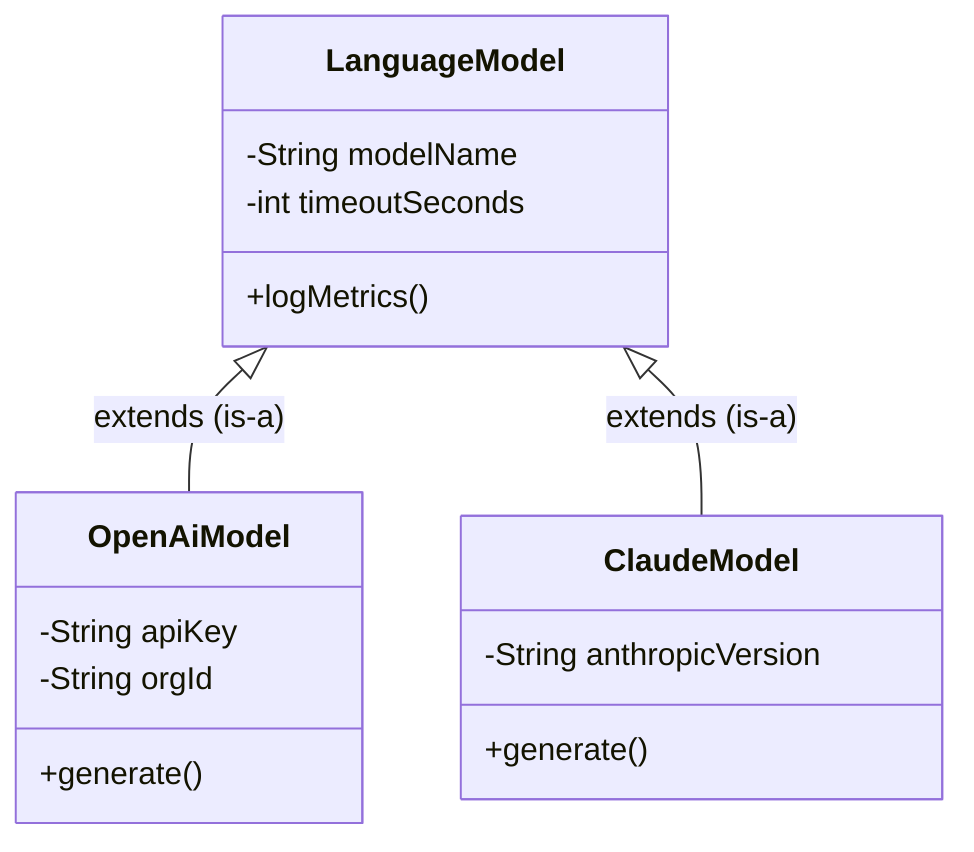
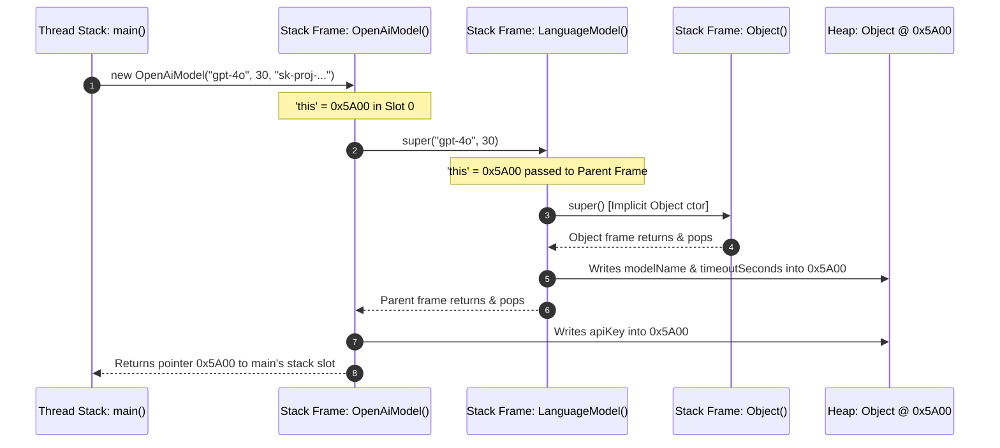
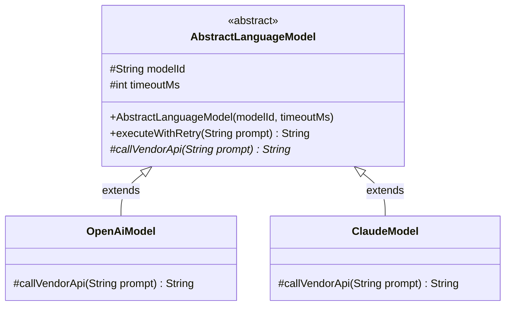
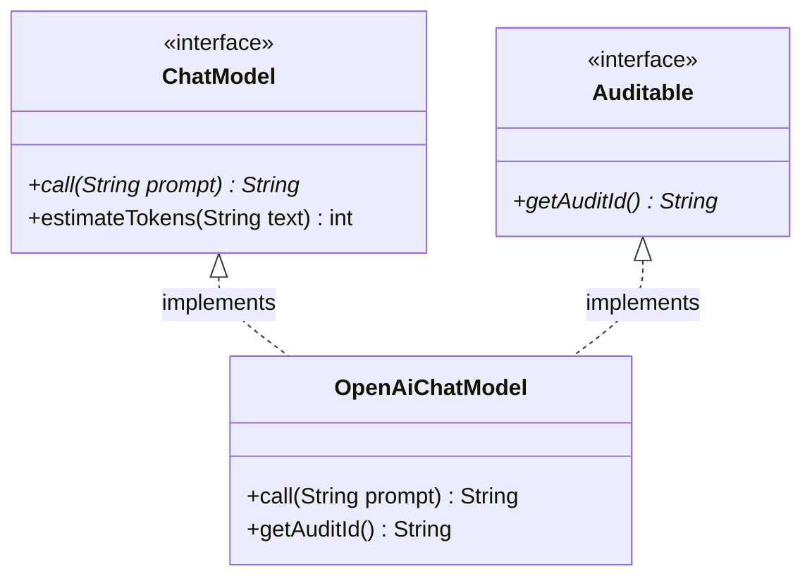
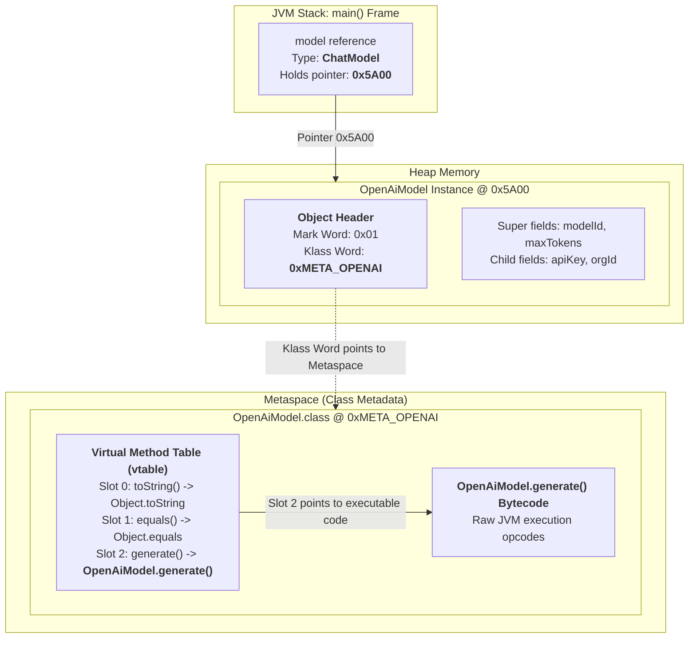
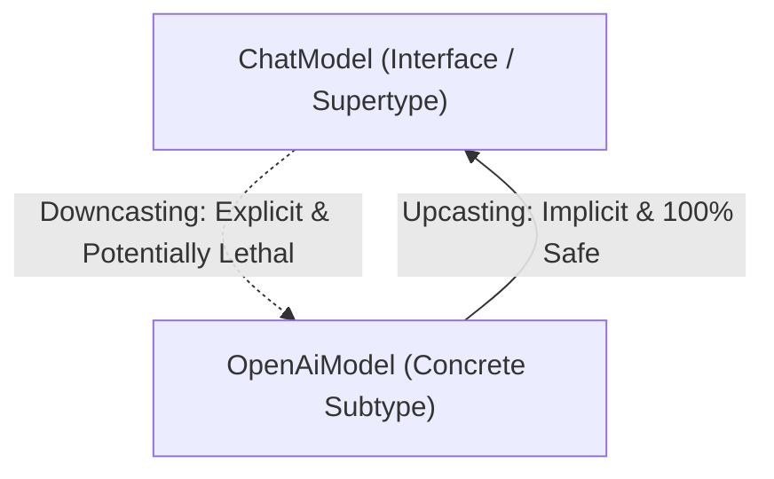

# Day_03 — Inheritance, Interfaces, Polymorphism, and Dynamic Dispatch in Memory

| ⬅️ Previous Day | 📚 Course Hub | ➡️ Next Day |
|:---|:---:|---:|
| [← Day 02: OOP — Classes, Objects & Memory](../Day_02_OOP_Classes_Objects_Memory/Day_02_OOP_Classes_Objects_Memory.md) | [All 60 Days Overview](../../README.md) | [Day 04: Generics, Collections & Data Structures →](../Day_04_Generics_Collections_DataStructures/Day_04_Generics_Collections_DataStructures.md) |

---

## 🎯 What You'll Understand By the End
- **The 4-Pillar Engineering Framework**: For every core OOP concept, you will know:
  1. **What is it?** (Precise definition & physical JVM memory mechanics)
  2. **Why do we use it?** (Architectural reasoning & design principles)
  3. **What happens if we DON'T use it?** (Concrete catastrophic anti-patterns, maintenance nightmares, and runtime bugs)
  4. **Primary Real-World Engineering Use Case** (Production patterns in Spring Boot, JDBC, Java Collections, and GenAI SDKs)
- How `extends` lays out parent and child fields contiguously in a single Heap object.
- The low-level mechanics of **constructor chaining (`super()`)**: how Stack Frames push and pop while Heap memory initializes in strict hierarchical order.
- The vital difference between **field hiding** (resolved at compile time via static binding) and **method overriding** (resolved at runtime via dynamic dispatch).
- How **Abstract Classes** (partial templates with instance state) contrast with **Interfaces** (pure capability contracts), and how modern interfaces use `default`, `static`, and `private` methods.
- The secret behind dynamic method dispatch: how the JVM uses **Virtual Method Tables (`vtable`)** and **Interface Method Tables (`itable`)** in Metaspace to achieve instant $O(1)$ polymorphic calls.
- How `java.lang.Object` anchors all classes in memory, including default identity hashing in the Object Header Mark Word, `equals()`, and `toString()`.

---

## 🧭 The Mid-Level Engineer's Mental Model

Beginner programmers memorize syntax: *"To inherit, type `extends`; to define a contract, type `interface`."*

Mid-level engineers analyze **trade-offs, failure modes, and physical memory layout**. When designing an enterprise system, you must continually ask four foundational engineering questions:

```
┌───────────────────────────────────────────────────────────────────────────────────┐
│                      THE 4-PILLAR ENGINEERING EVALUATION FRAMEWORK                │
├───────────────────────┬───────────────────────────────────────────────────────────┤
│ 1. What is it?        │ What is the mechanical reality in code and JVM memory?   │
├───────────────────────┼───────────────────────────────────────────────────────────┤
│ 2. Why do we use it?  │ What software design problem does it solve cleanly?       │
├───────────────────────┼───────────────────────────────────────────────────────────┤
│ 3. What if we DON'T?  │ What breaks? (Bugs, spaghetti code, memory leaks, etc.)  │
├───────────────────────┼───────────────────────────────────────────────────────────┤
│ 4. Primary Use Case   │ Where is this pattern used in enterprise production code? │
└───────────────────────┴───────────────────────────────────────────────────────────┘
```

This guide evaluates every single concept using this 4-pillar standard.

---

## 🧠 The Problem This Solves: A Tale of Two Codebases

Imagine writing a production GenAI backend service that orchestrates multiple Large Language Model (LLM) providers (OpenAI, Anthropic Claude, Google Gemini, local Ollama).

### ❌ The Nightmare Codebase: No Interfaces, No Inheritance, No Polymorphism

Without OOP abstractions, you write purely procedural code. Every client is a standalone, unrelated class:

```java
// CATASTROPHIC ANTI-PATTERN: Procedural, tightly coupled, impossible to maintain
public class AiChatService {
    private OpenAiClient openAi = new OpenAiClient("sk-openai-key");
    private ClaudeClient claude = new ClaudeClient("sk-ant-key");
    private OllamaClient ollama = new OllamaClient("http://localhost:11434");

    public String askAi(String provider, String prompt, int maxTokens, double temperature) {
        // Fragile branching duplicated in dozens of business services!
        if (provider.equalsIgnoreCase("OPENAI")) {
            // OpenAI requires custom request objects
            OpenAiRequest req = new OpenAiRequest(prompt, maxTokens, temperature);
            return openAi.executeGptChat(req).getChoices().get(0).getText();
        } else if (provider.equalsIgnoreCase("CLAUDE")) {
            // Anthropic uses completely different method names and parameters
            ClaudePayload payload = new ClaudePayload(prompt, "claude-3-5-sonnet", maxTokens);
            return claude.sendClaudeMessage(payload).getBody();
        } else if (provider.equalsIgnoreCase("OLLAMA")) {
            // Ollama takes raw strings
            return ollama.queryLocalLlama(prompt);
        } else {
            throw new IllegalArgumentException("Unknown AI provider: " + provider);
        }
    }
}
```

#### What goes wrong in production?
1. **Violation of Open-Closed Principle (OCP)**: Every time your team wants to add a new model (e.g., DeepSeek or Mistral), you must open and modify `AiChatService` and every other file with this `if-else` cascade. One missed file introduces a silent production outage.
2. **Duplicated Boilerplate State**: Every client needs retry policies, HTTP connection timeouts, request logging, and rate-limiting metrics. In procedural code, you copy-paste this logic across 4 separate classes. Fixing a timeout bug in OpenAI leaves Anthropic and Ollama vulnerable.
3. **Automated Unit Testing is Impossible**: Because `AiChatService` directly constructs concrete HTTP clients (`new OpenAiClient(...)`), running a unit test triggers real, paid HTTP calls to OpenAI! You cannot substitute a lightweight mock client.

---

### ✅ The Clean Architecture: Interface Contract + Abstract Template + Polymorphic Dispatch

With OOP design patterns:
- **`ChatModel` (Interface)**: Defines the universal contract (`generate(String prompt)`).
- **`AbstractLanguageModel` (Abstract Class)**: Implements shared boilerplate (metrics, retry logic, timeout state).
- **`OpenAiModel`, `ClaudeModel`, `OllamaModel` (Concrete Subclasses)**: Implement only provider-specific HTTP calls.
- **`AiChatService` (Caller)**: Depends solely on the `ChatModel` interface:

```java
public class AiChatService {
    private final ChatModel chatModel; // ZERO knowledge of concrete vendor!

    // Dependency Injection: Pass ANY provider at runtime!
    public AiChatService(ChatModel chatModel) {
        this.chatModel = chatModel;
    }

    public String askAi(String prompt) {
        return chatModel.generate(prompt); // ONE line. Zero if-else blocks!
    }
}
```

Now, adding DeepSeek requires writing **one new class** implementing `ChatModel`. Zero existing service classes are modified. Unit tests inject a 5-line `MockChatModel` that runs in 1 millisecond without network traffic or API bills.

---

# Section 1: Inheritance (`extends`) & Heap Memory Layout

## 1.1 The "Is-A" Relationship



### 1. What is it?
Inheritance is a language mechanism where a child class (subclass) derives fields (state) and methods (behavior) from a parent class (superclass) using the `extends` keyword. It establishes a strict **"is-a" relationship**: an `OpenAiModel` **is-a** `LanguageModel`.

In Java:
- A class can extend **only one** superclass (**Single Inheritance**). This prevents the dreaded C++ "Diamond Problem" where conflicting parent implementations create ambiguous execution paths.
- All classes implicitly inherit from `java.lang.Object` at the root of the hierarchy.

### 2. Why do we use it?
- **State and Logic Reuse (DRY - Don't Repeat Yourself)**: Shared attributes (`modelName`, `timeoutSeconds`, `retryCount`) and common algorithms (audit logging, latency timers) are written once in the superclass and inherited by all children.
- **Subtype Polymorphism**: Allows all subclasses to be referenced uniformly by their superclass type (`LanguageModel m = new OpenAiModel();`).

### 3. What happens if we DON'T use it?
```java
// WITHOUT INHERITANCE: Duplicating identical state across every vendor class
class OpenAiModel {
    private String modelName;       // Duplicated!
    private int timeoutSeconds;     // Duplicated!
    private int maxRetries;         // Duplicated!
    private String apiKey;          // Specific
    public void recordLatency() { /* identical 20 lines */ } // Duplicated!
}

class ClaudeModel {
    private String modelName;       // Duplicated!
    private int timeoutSeconds;     // Duplicated!
    private int maxRetries;         // Duplicated!
    private String apiKey;          // Specific
    public void recordLatency() { /* identical 20 lines */ } // Duplicated!
}
```
**The Failure**: When your engineering team updates the latency metrics formula from milliseconds to nanoseconds, you must remember to update `OpenAiModel`, `ClaudeModel`, `GeminiModel`, and `OllamaModel`. If an engineer forgets one, telemetry data across your microservices becomes inconsistent and corrupt.

### 4. Primary Real-World Engineering Use Case
- **Base Database Entities in JPA/Hibernate**: An enterprise database schema has 50 tables. Every table requires audit columns (`id`, `createdAt`, `updatedAt`, `version`, `createdBy`). Rather than declaring these 5 fields in all 50 `@Entity` classes, you declare an abstract `@MappedSuperclass BaseEntity` and have all 50 entities extend it.
- **Base HTTP/REST Clients**: Standardizing security header injection, TLS configuration, and circuit breakers across diverse internal microservice clients.

---

## 1.2 Subclass Memory Anatomy on the Heap

When you run `new OpenAiModel("gpt-4o", 30, "sk-proj-...")`, how does the JVM physically arrange memory on the Heap?

> ⚠️ **Critical Low-Level Insight**: The JVM does **not** allocate two separate objects for parent and child. It carves out **one single, contiguous block of RAM** on the Heap containing the Object Header, followed by all parent fields, followed by all child fields!

```
┌────────────────────────────────────────────────────────────────────────┐
│ SINGLE CHILD OBJECT INSTANCE ON HEAP (OpenAiModel @ 0x5A00)            │
│                                                                        │
│ ┌────────────────────────────────────────────────────────────────────┐ │
│ │ OBJECT HEADER (12 or 16 bytes)                                     │ │
│ │  - Mark Word (8 bytes: Identity HashCode, GC Age, Lock Bits)       │ │
│ │  - Klass Word (4 or 8 bytes: Pointer to OpenAiModel.class in Meta) │ │
│ └────────────────────────────────────────────────────────────────────┘ │
│                                                                        │
│ ┌────────────────────────────────────────────────────────────────────┐ │
│ │ SUPERCLASS FIELDS PAYLOAD (LanguageModel)                          │ │
│ │  - modelName reference pointer (4 or 8 bytes -> "gpt-4o")          │ │
│ │  - timeoutSeconds primitive int (4 bytes: 30)                      │ │
│ └────────────────────────────────────────────────────────────────────┘ │
│                                                                        │
│ ┌────────────────────────────────────────────────────────────────────┐ │
│ │ SUBCLASS FIELDS PAYLOAD (OpenAiModel)                              │ │
│ │  - apiKey reference pointer (4 or 8 bytes -> "sk-proj-...")        │ │
│ │  - organizationId reference pointer (4 or 8 bytes -> "org-abc")    │ │
│ └────────────────────────────────────────────────────────────────────┘ │
│ ┌────────────────────────────────────────────────────────────────────┐ │
│ │ 8-BYTE ALIGNMENT PADDING (0 to 7 bytes to round up to multiple of 8)│ │
│ └────────────────────────────────────────────────────────────────────┘ │
└────────────────────────────────────────────────────────────────────────┘
```

### Why does the JVM lay memory out this way?
1. **Predictable Byte Offsets**: Superclass fields always appear at the **exact same byte offset** from the start of the object, regardless of whether you access them through a `LanguageModel` reference or an `OpenAiModel` reference.
2. **CPU Cache Line Locality**: Because superclass and subclass fields sit contiguously in RAM, reading a parent field and a child field in sequence loads both into the CPU L1/L2 cache lines simultaneously, maximizing hardware execution speed.

---

## 1.3 Constructor Chaining (`super()`) Under the Hood

When an object is created, constructors execute in strict hierarchical order: from `java.lang.Object` down to the leaf subclass.



### 1. What is it?
Constructor chaining is the mandatory JVM process where every subclass constructor calls its superclass constructor via `super(...)` before executing its own constructor body.
- If you do not explicitly type `super(...)` or `this(...)` on the very first line of a constructor, the Java compiler automatically inserts an invisible `super()` call.

### 2. Why do we use it?
- **Invariant Protection & Safe Initialization**: A child object relies on parent fields being valid. Calling `super()` guarantees that all base fields and security checks are completed before the child logic touches them.

### 3. What happens if we DON'T have constructor chaining?
Suppose Java permitted a child constructor to run without initializing the superclass:
```java
// HYPOTHETICAL DISASTER: If constructor chaining did not exist
class LanguageModel {
    private final String modelName;
    public LanguageModel(String modelName) {
        if (modelName == null) throw new IllegalArgumentException("Model required");
        this.modelName = modelName;
    }
    public String getModelName() { return modelName.toUpperCase(); }
}

class OpenAiModel extends LanguageModel {
    public OpenAiModel(String apiKey) {
        // Assume super() was never called!
        // modelName in Heap memory remains zeroed out (null)!
    }
}

// In main():
OpenAiModel model = new OpenAiModel("sk-123");
model.getModelName(); // CRASH! NullPointerException because parent state was bypassed!
```
Without mandatory constructor chaining, invariants could be completely bypassed, and memory would contain corrupted, uninitialized nulls or zeroes.

### 4. Primary Real-World Engineering Use Case
- **Custom Application Exceptions**: In enterprise backends, you create custom domain exceptions extending `RuntimeException`. Constructor chaining passes root causes and error codes up to the JDK:
  ```java
  public class ModelRateLimitException extends RuntimeException {
      private final int retryAfterSeconds;
      public ModelRateLimitException(String message, Throwable cause, int retryAfter) {
          super(message, cause); // Initializes stack trace and message in JDK RuntimeException!
          this.retryAfterSeconds = retryAfter;
      }
  }
  ```

---

## 1.4 Field Hiding vs. Method Overriding

A notorious trap in Java is declaring a field in a child class with the same name as a field in its parent class.

```java
class ParentModel {
    public String modelType = "Base-LLM";
    public String getModelType() { return "Base-LLM"; }
}

class ChildModel extends ParentModel {
    public String modelType = "GPT-4o"; // HIDES ParentModel.modelType!
    @Override
    public String getModelType() { return "GPT-4o"; } // OVERRIDES ParentModel.getModelType()
}

// In main():
ParentModel ref = new ChildModel();
System.out.println(ref.modelType);      // PRINTS: "Base-LLM"  (Resolved at COMPILE-TIME by Stack Reference Type!)
System.out.println(ref.getModelType()); // PRINTS: "GPT-4o"   (Resolved at RUNTIME by Heap Object!)
```

### The Fundamental Rule
- **Fields are Statically Bound**: Resolved at **compile time** by `javac` based solely on the declared **reference type on the Stack**.
- **Methods are Dynamically Dispatched**: Resolved at **runtime** by the JVM based on the **actual object on the Heap**.

> 💡 **New Word Alert — "Field Hiding"**: When a subclass declares a field with the exact same identifier as an accessible field in its parent. Fields cannot be overridden in Java; they are only shadowed or hidden, creating lethal bugs.

### Primary Engineering Solution
Always make fields `private` and provide `public` accessor methods (getters). Never access instance fields directly through public variables.

---

# Section 2: Abstract Classes (`abstract class`)



### 1. What is it?
An `abstract class` is an incomplete blueprint.
- It is declared with the `abstract` keyword.
- It **cannot be directly instantiated** using `new` (`new AbstractLanguageModel()` causes a compile error).
- It can contain a hybrid mix of:
  - **Instance fields (state)** that live inside the child's Heap payload.
  - **Constructors** (invoked by subclasses via `super()`).
  - **Concrete methods** (complete algorithms shared by all children).
  - **Abstract methods** (method signatures with no body, marked `abstract`, which subclasses **must** override).

### 2. Why do we use it?
- **The Template Method Pattern**: It allows you to define the skeleton of an algorithm in the abstract superclass while letting subclasses override specific steps without changing the overall algorithm's structure.
  ```java
  public abstract class AbstractLanguageModel {
      // Concrete template method defining invariant lifecycle:
      public final String executeWithRetry(String prompt) {
          logPrompt(prompt);
          validateTokenLimit(prompt);
          long start = System.currentTimeMillis();
          try {
              return callVendorApi(prompt); // Abstract hook overridden by subclass!
          } finally {
              recordLatency(System.currentTimeMillis() - start);
          }
      }

      // Primitive abstract operation left to vendor subclass:
      protected abstract String callVendorApi(String prompt);
  }
  ```

### 3. What happens if we DON'T use it?
- **Failure Mode A: If you make the base class a normal concrete class:**
  A junior developer on your team can instantiate the half-baked class directly:
  ```java
  // Disaster: Creating an incomplete instance that lacks real vendor logic
  LanguageModel model = new LanguageModel("dummy-id", 30);
  model.generate("Hello"); // What does this do? Return null? Throw exception? A silent timebomb!
  ```
- **Failure Mode B: If you don't use an abstract base class at all:**
  Every vendor class must duplicate 40 lines of metrics recording, latency tracking, and retry backoff. When the retry backoff algorithm changes from linear to exponential, you must modify 15 different files.

### 4. Primary Real-World Engineering Use Case
- **Spring Framework's `AbstractBeanFactory` & `AbstractApplicationContext`**: Spring manages complex bean lifecycles using hundreds of abstract base classes that handle synchronization, caching, and lifecycle events while deferring specific XML, annotation, or Web loading logic to subclasses.
- **JDK's `AbstractList` & `AbstractMap`**: The Java Collections Framework provides `AbstractList` containing standard `addAll()`, `equals()`, and `hashCode()` implementations, so custom list authors only have to write `get(index)` and `size()`.

---

# Section 3: Interfaces (`interface`) & Architectural Decoupling



### 1. What is it?
An `interface` is a **100% pure capability contract**. It tells the world *what* a class can do, without revealing *how* it does it.
- Declared with the `interface` keyword.
- **Zero instance state**: An interface cannot declare instance variables on the Heap. It can only contain `public static final` constants in Metaspace.
- **No constructors**: Interfaces cannot be instantiated directly.
- **Multiple Implementation**: A single Java class can implement as many interfaces as needed (`class OpenAiModel implements ChatModel, Auditable, AutoCloseable`).

### 2. Why do we use it?
- **Decoupling (Dependency Inversion Principle - DIP)**: High-level business logic should depend on abstractions (interfaces), not on low-level concrete classes.
- **Hot-Swapping Implementations**: You can change your storage layer from PostgreSQL to MongoDB or your AI provider from OpenAI to Ollama by updating one configuration line, with zero modifications to application logic.
- **Mocking for Unit Tests**: You can create lightweight mock implementations in test code:
  ```java
  class MockChatModel implements ChatModel {
      @Override
      public String call(String prompt) { return "Mock Response"; } // Fast! 0 cost!
  }
  ```

### 3. What happens if we DON'T use it?
Without interfaces, components become **tightly coupled**:
```java
// TIGHTLY COUPLED DISASTER:
public class CheckoutService {
    private StripePaymentGateway stripe = new StripePaymentGateway(); // Direct coupling!

    public void processOrder(Order order) {
        stripe.chargeCreditCard(order.getTotal());
    }
}
```
**What happens when:**
1. Stripe increases transaction fees by 2% and leadership orders an immediate switch to PayPal? You must refactor and re-test hundreds of files across your company.
2. You run your CI/CD unit test pipeline? Every build attempts to charge a real credit card or fails if the external Stripe API experiences network downtime!

With an interface `PaymentGateway`, `CheckoutService` accepts any payment provider and automated unit tests pass in a mock gateway with 100% reliability.

### 4. Primary Real-World Engineering Use Case
- **JDBC (`java.sql.Connection`, `java.sql.Statement`, `java.sql.ResultSet`)**: The ultimate interface example in software history. The JDK provides only pure interfaces. Oracle, PostgreSQL, and MySQL engineers write the concrete implementations in their respective JAR drivers. Your Java enterprise application talks strictly to the JDBC interfaces, meaning you can swap databases without rewriting your SQL query execution code.
- **Spring AI / LangChain4j (`ChatModel`, `EmbeddingModel`)**: Standardized interfaces allowing applications to switch between 30+ AI models seamlessly.

---

# Section 4: Modern Interface Capabilities (Java 8, 9+)

Interfaces in modern Java are rich API surfaces supporting three distinct method types:

## 4.1 `default` Methods (Java 8+)

### 1. What is it?
A method declared inside an interface with the `default` keyword that provides a **concrete, default method body**. Implementing classes inherit this behavior automatically without being forced to override it.

```java
public interface ChatModel {
    String call(String prompt); // Abstract: every vendor must implement

    // Default method: Concrete fallback provided directly in the interface!
    default int estimateTokens(String text) {
        return (text == null) ? 0 : (int) Math.ceil(text.length() / 4.0);
    }
}
```

### 2. Why do we use it?
- **Backward-Compatible Interface Evolution**: It solves the historic **"Interface Brittleness Problem"**. In Java 1 through 7, if you published an interface used by thousands of developers and later added one new method signature to it, **every single implementing class in the world would break** with compile errors upon updating the library.
- Default methods let library authors add new capabilities without breaking legacy code.

### 3. What happens if we DON'T use it?
Suppose Java 8 added `default void forEach(Consumer<? super T> action)` to `java.lang.Iterable` as an ordinary abstract method.
**The Catastrophe**: Millions of existing Java classes across the globe implementing `Iterable` (custom collections, third-party libraries, Hibernate, Guava) would immediately fail to compile until their developers manually wrote a `forEach` method!

### 4. Primary Real-World Engineering Use Case
- **Java Streams & Collections (`Collection.stream()`, `Iterable.forEach()`)**: Added to existing 15-year-old interfaces in Java 8 without breaking a single enterprise application.
- **Optional Feature Hooks in SDKs**: Providing default no-op callbacks or default token counters in AI SDK interfaces.

---

## 4.2 `static` Methods in Interfaces (Java 8+)

### 1. What is it?
A utility method defined inside an interface with the `static` keyword. It is tied to the interface namespace and **cannot be overridden** by implementing classes.

```java
public interface ChatModel {
    String call(String prompt);

    // Static factory utility method
    static ChatModel ofDefaultLocal() {
        return new OllamaChatModel("http://localhost:11434");
    }
}
```

### 2. Why do we use it?
- **Co-Locating Factory and Helper Logic**: Eliminates the need for separate, disconnected companion utility classes (like `Collections` for `Collection`, or `Paths` for `Path`).

### 3. What happens if we DON'T use it?
Your codebase becomes littered with sprawling utility classes (`ChatModelUtils`, `ChatModelFactory`, `ChatModelHelpers`) that pollute packages and confuse developers seeking the standard way to create an instance.

### 4. Primary Real-World Engineering Use Case
- **`List.of("a", "b")`, `Set.of()`, `Map.of()` (Java 9+)**: Standard immutable collection factories attached directly to the core interfaces.
- **`Comparator.comparingInt(...)`**: Fluent comparison builders directly on `java.util.Comparator`.

---

## 4.3 `private` Helper Methods in Interfaces (Java 9+)

### 1. What is it?
A method inside an interface marked `private`. It can only be called by other `default` methods within the same interface.

```java
public interface ChatModel {
    String call(String prompt);

    default String callWithSystemPrompt(String system, String user) {
        String combined = buildPrompt(system, user); // Calls private helper
        return call(combined);
    }

    default String callWithJsonFormat(String system, String user) {
        String combined = buildPrompt(system, user) + "\nOutput strictly as JSON.";
        return call(combined);
    }

    // Encapsulated shared helper logic:
    private String buildPrompt(String sys, String usr) {
        return "[SYSTEM]: " + sys.trim() + "\n[USER]: " + usr.trim();
    }
}
```

### 2. Why do we use it?
- **DRY Principle Inside Interfaces**: When multiple `default` methods share repetitive code, `private` methods allow extracting that common logic without leaking it to public APIs or implementing classes.

### 3. What happens if we DON'T use it?
You must either:
1. Copy-paste duplicated code across multiple `default` methods, or
2. Make the helper method `default`, polluting the public API and allowing outside classes to call an internal helper they were never meant to access.

### 4. Primary Real-World Engineering Use Case
- **Complex Protocol & Stream Parsers**: Interfaces providing multiple default stream-handling methods that share internal buffer validation and security sanitization algorithms.

---

# Section 5: Abstract Class vs. Interface — The Decision Matrix

```
                          ┌────────────────────────────────┐
                          │   Architectural Decision:      │
                          │ Abstract Class vs. Interface?  │
                          └───────────────┬────────────────┘
                                          │
                  Do you need to store    │
                  INSTANCE STATE (fields) │
                  on the Heap?            │
                         /                \
                       YES                 NO
                       /                    \
         ┌─────────────────────────┐   ┌─────────────────────────────┐
         │  Use an ABSTRACT CLASS  │   │  Is this defining a PURE    │
         │  (Template pattern,     │   │  CAPABILITY or BEHAVIORAL   │
         │   shared fields/state)  │   │  CONTRACT across hierarchies│
         └─────────────────────────┘   └──────────────┬──────────────┘
                                                      │
                                                     YES
                                                      │
                                       ┌─────────────────────────────┐
                                       │       Use an INTERFACE      │
                                       │ (Can-do capability,         │
                                       │  multiple implementation)   │
                                       └─────────────────────────────┘
```

## ⚖️ Detailed Engineering Comparison

| Feature | Abstract Class (`abstract class`) | Interface (`interface`) |
|:---|:---|:---|
| **Primary Purpose** | **Partial implementation template**: Shares state and skeleton algorithms among closely related child classes. | **Contract specification**: Defines pure capabilities regardless of where a class sits in the hierarchy. |
| **Mental Relationship** | **"Is-A"** (`OpenAiModel` is-a `AbstractLanguageModel`). | **"Can-Do"** (`OpenAiModel` can act as `ChatModel`, `Auditable`). |
| **Instance Fields** | **Allowed**: Can hold `private int timeoutMs;` in Heap payload. | **Forbidden**: Only `public static final` constants in Metaspace. |
| **Constructors** | **Allowed**: Has constructors invoked via `super()`. | **Forbidden**: No constructors; cannot be instantiated. |
| **Multiple Inheritance** | **Single inheritance**: A class can `extends` only **one** class. | **Multiple implementation**: A class can `implements` **many** interfaces. |
| **Speed / Dispatch** | Dispatched via `vtable` (`invokevirtual`). Fast $O(1)$. | Dispatched via `itable` (`invokeinterface`). Fast $O(1)$ with secondary cache. |

### 🏆 The Enterprise Golden Pattern: Interface + Skeletal Abstract Class
In production systems, you don't choose between them—**you combine them**:
1. Define an **Interface** (`ChatModel`) for maximum external decoupling.
2. Provide an **Abstract Skeletal Class** (`AbstractLanguageModel implements ChatModel`) that implements common boilerplate and state.
3. Allow concrete classes (`OpenAiModel extends AbstractLanguageModel`) to write only vendor-specific code.

This is the exact pattern used by the Java JDK (`List` $\rightarrow$ `AbstractList` $\rightarrow$ `ArrayList`).

---

# Section 6: Polymorphism (Compile-Time vs. Runtime)

Polymorphism comes from the Greek meaning **"many forms."** In Java, it manifests in two distinct forms:

## 6.1 Compile-Time Polymorphism (Method Overloading)

### 1. What is it?
Defining multiple methods in the same class with the **same method name but different parameter lists** (different parameter count, order, or types).
- Resolved entirely at **compile time** by `javac`.
- The compiler inspects the static types of arguments passed in caller code and bakes the exact target method signature directly into the bytecode.

### 2. Why do we use it?
- **API Ergonomics & Sensible Defaults**: Allows callers to invoke the method with fewer arguments, supplying default configurations automatically:
  ```java
  public class ModelClient {
      public String generate(String prompt) {
          return generate(prompt, 2048, 0.7); // Delegates with sensible defaults!
      }
      public String generate(String prompt, int maxTokens, double temperature) {
          // Real execution logic
          return "...";
      }
  }
  ```

### 3. What happens if we DON'T use it?
Without method overloading (like in older C programs), you must invent separate, ugly method names for every parameter combination:
```java
// C-STYLE NAMING EXPLOSION:
generateWithPrompt(String prompt);
generateWithPromptAndTokens(String prompt, int tokens);
generateWithPromptTokensAndTemp(String prompt, int tokens, double temp);
```
Callers struggle to remember method names, and refactoring signatures is painful.

### 4. Primary Real-World Engineering Use Case
- **`Math.max(int, int)`, `Math.max(double, double)`, `Math.max(long, long)`**: Seamless mathematical calculations across primitive types.
- **Factory APIs**: `List.of()`, `List.of(e1)`, `List.of(e1, e2)`, ..., up to 10 overloaded variants for allocation efficiency.

---

## 6.2 Runtime Polymorphism (Method Overriding & Dynamic Dispatch)

### 1. What is it?
When a subclass provides its own custom implementation of a method already defined in its superclass or interface.
- Resolved at **runtime** by the JVM.
- Even if the reference variable on the Stack is typed as the supertype (`ChatModel`), the JVM inspects the **actual object on the Heap** to execute the subclass's version.

### 2. Why do we use it?
- **Enforces the Open-Closed Principle (OCP)**: You can introduce new classes and algorithms without altering existing consumer code.
- Eliminates procedural `if-else` branching throughout your entire application architecture.

### 3. What happens if we DON'T use it?
You fall straight into the Nightmare Codebase illustrated at the beginning of this lesson: massive `if (provider.equals("OPENAI"))` switches in every service class. Adding a 5th model requires modifying 30 files across your company.

### 4. Primary Real-World Engineering Use Case
- **Spring Boot Dependency Injection**: Services declare `@Autowired private ChatModel model;`. At runtime, Spring injects whatever implementation is configured (`OpenAiChatModel` in production, `MockChatModel` in test profiles). The service never changes.
- **The Strategy Design Pattern**: Swapping compression algorithms (`ZipCompressor`, `GzipCompressor`) or routing strategies on the fly.

---

# Section 7: Dynamic Dispatch & Low-Level JVM Mechanics (`vtable` & `itable`)

When code calls `model.generate("Hello")`, how does the JVM find the right bytecode in nanoseconds without scanning the inheritance tree?



### 1. What is it?
- **`vtable` (Virtual Method Table)**: An internal array of direct function pointers stored in **Metaspace** for every class. Each virtual method is assigned a fixed numerical index (slot).
- **Dynamic Dispatch (`invokevirtual`)**: The execution sequence where the JVM takes the object's pointer, reads its Klass Word in the Object Header, indexes into the `vtable`, and jumps directly to the target bytecode address.

### 2. Why do we use it / Why did JVM engineers build it?
- **Constant Time $O(1)$ Method Calls**: Instead of searching through parent classes at runtime to find which class implements `generate()`, the JVM indexes an array in memory:
  $$\text{Target Bytecode} = \text{vtable}[\text{slot\_index}]$$
  This operation completes in just a few CPU clock cycles.

### 3. What happens if the JVM didn't use `vtable`?
If the JVM resolved method overrides dynamically by searching up the inheritance tree (`Child` $\rightarrow$ `Parent` $\rightarrow$ `Grandparent` $\rightarrow$ `Object`):
- Deep inheritance hierarchies would experience severe performance degradation.
- Every method call would take $O(\text{hierarchy depth})$ time, making object-oriented Java code 10x to 50x slower than procedural code!

### 4. `invokevirtual` vs. `invokeinterface` (`itable`)
- **`invokevirtual` (Class Inheritance via `vtable`)**: Very simple. Because Java has single class inheritance, `LanguageModel` and all its subclasses share the **identical slot indices** for all inherited methods. Slot 2 is always `generate()`.
- **`invokeinterface` (Interface Calls via `itable`)**: More complex. Because a class can implement 10 different interfaces in any order, `generate()` might be at slot 2 in `OpenAiModel`, but at slot 5 in `AudioTranscriptionModel`. The JVM uses an **Interface Table (`itable`)** and an inline cache (monomorphic/polymorphic call-site caches) to retain sub-microsecond lookup speeds.

---

# Section 8: The Root of All Classes (`java.lang.Object`)

Every class in Java descends from `java.lang.Object`. This universal inheritance guarantees that every object on the Heap provides three critical methods:

## 8.1 `equals(Object obj)`: Reference Identity vs. Logical Equality

### 1. What is it?
- **Default `Object.equals()`**: Performs reference identity comparison (`this == obj`). Returns `true` if and only if both variables point to the **exact same memory address on the Heap**.
- **Overridden `equals()`**: Compares the **logical field values** contained inside two distinct Heap objects.

### 2. Why do we use it?
In enterprise applications, two distinct objects holding the same unique database ID or API key represent the **same real-world entity**, even if allocated at different memory addresses.

### 3. What happens if we DON'T override it?
```java
public class ModelConfig {
    private String modelId;
    public ModelConfig(String modelId) { this.modelId = modelId; }
    // equals() NOT overridden!
}

ModelConfig conf1 = new ModelConfig("gpt-4o"); // Heap address 0x1000
ModelConfig conf2 = new ModelConfig("gpt-4o"); // Heap address 0x2000

System.out.println(conf1.equals(conf2)); // PRINTS FALSE!
```
**The Failure**: If your service verifies whether a newly requested configuration matches an active cached configuration, `equals()` returns `false`. Your system re-initializes costly client connections repeatedly, creating massive memory bloat.

### 4. Primary Real-World Engineering Use Case
- Entity comparison in database persistence, DTO comparisons in testing assertions (`assertEquals(expected, actual)`), and caching.

---

## 8.2 `hashCode()` & The Object Header Connection

### 1. What is it?
A method returning a 32-bit signed integer used to route an object into a hash bucket inside hash-based data structures (`HashMap`, `HashSet`, `ConcurrentHashMap`).
- **Default `Object.hashCode()`**: An "Identity HashCode." The JVM derives an integer from the object's memory state and caches it inside the **Mark Word of the Object Header** on the Heap!
- **Overridden `hashCode()`**: Calculates a hash value using the identical fields used in your `.equals()` implementation.

### 2. Why do we use it?
It enables instant $O(1)$ lookups and insertions in Hash collections.

### 3. What happens if we violate the `equals()` / `hashCode()` Contract?
> 🚨 **The Inviolable Law of Java**: If two objects are equal according to `equals()`, they **MUST** produce the exact same `hashCode()`.

```java
public class ModelKey {
    private String name;
    public ModelKey(String name) { this.name = name; }
    @Override
    public boolean equals(Object o) {
        if (o instanceof ModelKey other) return Objects.equals(this.name, other.name);
        return false;
    }
    // DISASTER: Forgot to override hashCode()! Inherits Object.hashCode()!
}

Map<ModelKey, String> cache = new HashMap<>();
cache.put(new ModelKey("gpt-4o"), "Active Model Instance");

// Later, in another request:
String status = cache.get(new ModelKey("gpt-4o"));
System.out.println(status); // PRINTS: NULL!
```
#### Why did this happen under the hood?
1. When `put()` was called, `ModelKey @ 0x1000` computed an identity hash of `45231`, placing the entry into Bucket #7.
2. When `get()` was called, `ModelKey @ 0x2000` computed an identity hash of `98214`, searching in Bucket #2!
3. Even though `equals()` is `true`, `HashMap` never even compared them because it looked in the completely wrong bucket!
4. **Result**: Cache misses, memory leaks (un-retrievable entries accumulating in memory), and subtle production bugs.

### 4. Primary Real-World Engineering Use Case
- Deduplicating incoming webhook events in a `HashSet`.
- Caching prompt completions and database queries in high-performance `ConcurrentHashMap` caches.

---

## 8.3 `toString()`: Observability & Production Telemetry

### 1. What is it?
Returns a textual representation of the object.
- Default `Object.toString()` returns:
  $$\text{getClass().getName()} + "@" + \text{Integer.toHexString(hashCode())}$$
  Example: `com.genai.OpenAiModel@4f023edb`

### 2. Why do we use it?
- High-quality observability, debugging, and structured application logging.

### 3. What happens if we DON'T override it?
When a critical production incident occurs at 2:00 AM, your engineers check Datadog / CloudWatch logs and see:
```text
[ERROR] Payment failed for model: com.genai.OpenAiModel@4f023edb with request com.genai.AiPrompt@1a2c3b4d
```
You have zero visibility into which prompt failed, which tenant sent it, or which model ID was requested. Overriding `toString()` gives instant, readable telemetry:
```text
[ERROR] Payment failed for model: OpenAiModel[modelId='gpt-4o', org='org-prod-99']
```

### 4. Primary Real-World Engineering Use Case
- Structured JSON logging with SLF4J/Logback and monitoring dashboards.

---

# Section 9: Type Safety, Casting & Modern Pattern Matching



### 1. Upcasting vs. Downcasting
- **Upcasting (Safe & Automatic)**: Treating a subclass as its supertype (`ChatModel m = new OpenAiModel();`). Always safe because an `OpenAiModel` is guaranteed to satisfy all capabilities of `ChatModel`.
- **Downcasting (Explicit & Risky)**: Converting a supertype reference back to a concrete subclass (`OpenAiModel o = (OpenAiModel) m;`).

### 2. What happens if downcasting fails?
If the object on the Heap is NOT what you thought it was, the JVM throws `ClassCastException` and your application crashes at runtime:
```java
ChatModel m = new OllamaModel("http://localhost:11434");

// LETHAL CRASH: Attempting to cast Ollama instance to OpenAiModel
OpenAiModel openAi = (OpenAiModel) m; // java.lang.ClassCastException at runtime!
```

### 3. The Modern Solution: Pattern Matching for `instanceof` (Java 16+)
Before Java 16, developers were forced to write awkward, redundant checks and manual casts:
```java
// OLD PRE-JAVA 16 WAY:
if (model instanceof OpenAiModel) {
    OpenAiModel openAi = (OpenAiModel) model; // Redundant manual cast!
    openAi.configureOrganization("org-prod");
}
```

Modern Java introduces **Pattern Matching for `instanceof`**:
```java
// MODERN JAVA 16+ CLEAN PATTERN:
if (model instanceof OpenAiModel openAi) {
    // 'openAi' is automatically cast and in-scope here!
    openAi.configureOrganization("org-prod");
}
```

---

# Section 10: Complete Code Walkthrough: Tracing Polymorphic Execution

Below is a runnable, encapsulated Java program demonstrating all core concepts: interface contracts, default methods, abstract class templates with shared state, constructor chaining, dynamic dispatch, and the `Object` contract.

```java
package com.genai.foundations.day03;

import java.util.Objects;

// 1. PURE CAPABILITY CONTRACT (Interface)
interface ChatModel {
    // Abstract capability required from all implementers
    String generate(String prompt);

    // Default method: API evolution without breaking implementers
    default void logCall(String prompt) {
        System.out.println("[AUDIT LOG] Dispatching prompt: \"" + prompt + "\"");
    }

    // Static factory utility method
    static void printSpecification() {
        System.out.println("[SPEC] ChatModel Standard v1.0 -- Enterprise Compliant");
    }
}

// 2. SKELETAL BASE TEMPLATE (Abstract Class with State & Template Pattern)
abstract class AbstractLanguageModel implements ChatModel {
    // Superclass fields: Contiguously allocated FIRST in Heap memory payload
    private final String modelId;
    private final int maxTokens;

    public AbstractLanguageModel(String modelId, int maxTokens) {
        // Defensive Invariant Checks
        this.modelId = Objects.requireNonNull(modelId, "modelId cannot be null");
        if (maxTokens <= 0) throw new IllegalArgumentException("maxTokens must be > 0");
        this.maxTokens = maxTokens;
    }

    public String getModelId() { return modelId; }
    public int getMaxTokens() { return maxTokens; }

    // Logical Equality Contract
    @Override
    public boolean equals(Object o) {
        if (this == o) return true; // Pointer address equality!
        if (!(o instanceof AbstractLanguageModel that)) return false;
        return maxTokens == that.maxTokens && Objects.equals(modelId, that.modelId);
    }

    // HashCode Contract consistent with equals()
    @Override
    public int hashCode() {
        return Objects.hash(modelId, maxTokens);
    }

    @Override
    public String toString() {
        return getClass().getSimpleName() + "[modelId='" + modelId + "', maxTokens=" + maxTokens + "]";
    }
}

// 3. CONCRETE SUBCLASS (Extends State & Implements Specific Behavior)
class OpenAiModel extends AbstractLanguageModel {
    // Subclass field: Allocated immediately following superclass fields on Heap
    private final String apiKey;

    public OpenAiModel(String modelId, int maxTokens, String apiKey) {
        super(modelId, maxTokens); // Explicit constructor chaining!
        this.apiKey = Objects.requireNonNull(apiKey, "apiKey cannot be null");
    }

    @Override
    public String generate(String prompt) {
        logCall(prompt); // Calls inherited interface default method
        return "OpenAI (" + getModelId() + ") response for: \"" + prompt + "\"";
    }

    public String getApiKeyMasked() {
        return apiKey.substring(0, Math.min(apiKey.length(), 6)) + "...";
    }
}

// 4. MAIN RUNNER (Tracking Stack Frames, Heap Allocations, and vtable Dispatch)
public class PolymorphismRunner {
    public static void main(String[] args) {
        System.out.println("==================================================");
        System.out.println("    DAY 03: POLYMORPHISM & VTABLE DISPATCH DEMO    ");
        System.out.println("==================================================");

        // 1. Static utility call directly on interface
        ChatModel.printSpecification();

        // 2. Polymorphic Allocation:
        // Stack Reference Type : ChatModel
        // Actual Heap Instance : OpenAiModel @ 0x5A00 (Header + Super Fields + Child Fields)
        ChatModel model = new OpenAiModel("gpt-4o", 4096, "sk-proj-live-token-12345");

        // 3. Dynamic Dispatch via Metaspace vtable:
        // Reads Klass Word -> OpenAiModel.class in Metaspace -> invokes OpenAiModel.generate()
        String response = model.generate("Explain quantum computing in one sentence");
        System.out.println("Output: " + response);
        System.out.println();

        // 4. Verifying Object Contract (equals, hashCode, toString)
        ChatModel duplicateModel = new OpenAiModel("gpt-4o", 4096, "sk-proj-different-key");
        
        System.out.println("Model 1 toString() : " + model);
        System.out.println("Model 2 toString() : " + duplicateModel);
        System.out.println("Address (==) Equality      : " + (model == duplicateModel)); // false (different Heap pointers)
        System.out.println("Logical (.equals) Equality : " + model.equals(duplicateModel)); // true (same modelId & tokens)
        System.out.println("HashCode 1 : " + model.hashCode());
        System.out.println("HashCode 2 : " + duplicateModel.hashCode());
        System.out.println("HashCodes Match?           : " + (model.hashCode() == duplicateModel.hashCode())); // true!
        System.out.println();

        // 5. Pattern Matching for instanceof
        if (model instanceof OpenAiModel openAi) {
            System.out.println("Downcast Safe! Masked API Key: " + openAi.getApiKeyMasked());
        }

        System.out.println("==================================================");
    }
}
```

### Physical Memory Allocation & Dispatch Trace Table

| Line / Action | Physical RAM Location | Low-Level JVM Mechanics |
|:---|:---|:---|
| `new OpenAiModel(...)` | **Heap Space** | Carves out contiguous memory block at address `0x5A00`. Initializes Header (Mark Word + Klass Word), zeroes payload, runs `Object()` $\rightarrow$ `AbstractLanguageModel()` $\rightarrow$ `OpenAiModel()`. |
| `ChatModel model = ...` | **Stack (`main` frame)** | Slot `1` receives 64-bit reference pointer `0x5A00`. Declared static type is `ChatModel`. |
| `model.generate(...)` | **Stack $\rightarrow$ Heap $\rightarrow$ Metaspace** | 1. Dereferences `model` (`0x5A00`) on Heap.<br>2. Reads Klass Word pointing to `OpenAiModel.class` in Metaspace.<br>3. Inspects `vtable` at slot index for `generate()`.<br>4. Jumps directly to `OpenAiModel.generate()` bytecode. |
| `model.equals(duplicateModel)` | **Metaspace `vtable`** | Dynamic dispatch routes to `AbstractLanguageModel.equals()`. Compares `modelId` and `maxTokens` logical values; returns `true`. |

---

# Section 11: Mid-Level Engineering Cheat Sheet

Use this reference table to evaluate architectural designs and interview questions:

| Concept | What is it? | Why do we use it? | What happens if we DON'T use it? | Primary Real-World Use Case |
|:---|:---|:---|:---|:---|
| **Inheritance (`extends`)** | Subclass acquiring state and methods from superclass in a single contiguous Heap object. | Code reuse across closely related domain entities; DRY principle. | Copy-pasting 20 common fields across 50 classes; bug fixes require editing 50 files. | Base JPA database entities (`BaseEntity` with `id`, `createdAt`), Base HTTP clients. |
| **Constructor Chaining (`super()`)** | Mandatory hierarchical execution of constructors from `Object` down to child. | Ensures base state and invariants are fully initialized before child code runs. | Uninitialized parent fields causing null pointers, zero values, or memory invariant corruption. | Custom exception hierarchies (`CustomException extends RuntimeException`). |
| **Field Hiding** | Subclass declaring field with same name as parent field (resolved at compile time). | Understanding why fields cannot be overridden; enforcing private fields. | Silent bugs where `parentRef.field` reads parent default instead of child value on same object. | Enforcing private fields with public getter methods across all domain models. |
| **Abstract Class** | Incomplete class blueprint with state, constructors, and partial implementation. | **Template Method Pattern**: invariant algorithm in base, variant steps in subclasses. | If made concrete: accidental instantiation of broken objects. If omitted: massive algorithm duplication. | Spring's `AbstractBeanFactory`, JDK's `AbstractList`, Base AI client with retry/telemetry. |
| **Interface** | Pure capability contract with zero instance state; supports multiple implementation. | Complete architectural decoupling (Dependency Inversion); swappable implementations. | Tight coupling, vendor lock-in, impossible to mock components for unit testing without live APIs. | JDBC `Connection`/`Statement`, Spring AI `ChatModel`, Java `List`/`Map`. |
| **`default` Methods** | Concrete fallback method body inside an interface. | Backward-compatible interface evolution without breaking existing implementations. | **Interface Brittleness**: adding one method breaks thousands of third-party implementers on recompile. | `Iterable.forEach()`, `Collection.stream()`, optional SDK hooks. |
| **`static` Methods in Interface** | Utility or factory method namespaced under the interface. | Eliminates clutter of separate `*Utils` classes; co-locates factory logic with contract. | Proliferation of separate, confusing helper classes (`ChatModelUtils`, `ChatModelFactory`). | `List.of()`, `Set.of()`, `Comparator.comparingInt()`. |
| **`private` Methods in Interface** | Encapsulated helper method inside interface accessible only to default methods. | Code reuse (DRY) across default methods without exposing helpers publicly. | Duplicating code in default methods or accidentally exposing internal helpers in public API. | Shared stream parsing or argument sanitization across multiple default methods. |
| **Method Overloading** | Same method name with different parameters resolved at compile time. | API ergonomics; providing clean entry points with sensible defaults. | C-style naming explosion (`callWithPrompt()`, `callWithPromptAndTokens()`, etc.). | `Math.max()`, `List.of()`, overloaded service query methods. |
| **Method Overriding & Dispatch** | Subclass redefining inherited method, resolved at runtime via `vtable`. | Eliminates procedural branching; enforces Open-Closed Principle (OCP). | Sprawling procedural `if-else` cascades that require modifying 20 files for every new feature. | Strategy pattern, Spring Dependency Injection, swappable plugin architectures. |
| **`vtable` / `itable`** | Indexed array of function pointers in Metaspace for dynamic dispatch. | Enables constant-time $O(1)$ method dispatch instead of searching hierarchy tree. | Searching inheritance tree at runtime on every call, slowing down OOP execution by 10x–50x. | High-throughput enterprise backends processing millions of polymorphic calls per second. |
| **`equals()` & `hashCode()`** | Logical value equality and bucket indexing contract for hash structures. | Enables accurate entity comparison and correct storage in `HashMap`/`HashSet`. | Cache misses, lost objects, duplicate set entries, and silent memory leaks. | Entity deduplication, prompt response caching in `ConcurrentHashMap`. |

---

# Section 12: Common Beginner Mistakes & Production Anti-Patterns

### 1. The Field Hiding Trap
❌ **Wrong Way**:
```java
class BaseAgent { public int maxSteps = 10; }
class SmartAgent extends BaseAgent { public int maxSteps = 50; } // Field hiding!

BaseAgent agent = new SmartAgent();
System.out.println(agent.maxSteps); // PRINTS 10, NOT 50!
```
✅ **Right Way**:
```java
class BaseAgent { 
    public int getMaxSteps() { return 10; } 
}
class SmartAgent extends BaseAgent { 
    @Override 
    public int getMaxSteps() { return 50; } 
}

BaseAgent agent = new SmartAgent();
System.out.println(agent.getMaxSteps()); // PRINTS 50 (Dynamic dispatch via vtable!)
```
*Why it is wrong*: The compiler binds field accesses at compile time based on the reference type (`BaseAgent`), ignoring the runtime object on the Heap. Always use private fields with getter methods!

---

### 2. Breaking the `equals()` and `hashCode()` Contract
❌ **Wrong Way**: Overriding `.equals()` without overriding `.hashCode()`:
```java
public class ModelKey {
    private String name;
    @Override
    public boolean equals(Object o) { ... } // Overridden!
    // hashCode() is NOT overridden! Inherits default Object.hashCode()!
}

// In main():
Map<ModelKey, String> map = new HashMap<>();
map.put(new ModelKey("gpt-4o"), "Active");

// Returns NULL! Equal objects hash to completely different buckets!
String status = map.get(new ModelKey("gpt-4o")); 
```
✅ **Right Way**:
```java
@Override
public boolean equals(Object o) {
    if (this == o) return true;
    if (!(o instanceof ModelKey other)) return false;
    return Objects.equals(name, other.name);
}

@Override
public int hashCode() {
    return Objects.hash(name); // Equal objects produce identical hashcodes!
}
```

---

### 3. Unchecked Manual Downcasting (`ClassCastException`)
❌ **Wrong Way**:
```java
ChatModel model = new OpenAiModel("gpt-4o", 4096, "key");
AnthropicModel claude = (AnthropicModel) model; // CRASH! ClassCastException at runtime!
```
✅ **Right Way (Modern Pattern Matching for `instanceof`)**:
```java
if (model instanceof AnthropicModel claude) {
    // Safely cast and bound to 'claude' variable in this scope
    claude.someClaudeSpecificMethod();
}
```

---

### 4. The Fragile Base Class Problem (Deep Inheritance Trees)
❌ **Anti-Pattern**: Creating inheritance hierarchies 5 or 6 levels deep (`Object` $\rightarrow$ `Component` $\rightarrow$ `AbstractService` $\rightarrow$ `BaseHttpService` $\rightarrow$ `BaseAiService` $\rightarrow$ `OpenAiService`).
- A single change in `AbstractService` can silently break behavior in 15 subclasses.
- **Production Rule**: **Favor Composition Over Inheritance**. Use inheritance only for true, permanent **"is-a"** relationships. If you only need functionality, inject the dependency as a field. Standardize on **1 Interface $\rightarrow$ 1 Skeletal Abstract Class $\rightarrow$ Concrete Classes**.

---

# Section 13: Best Practices & Design Principles

1. **Always Annotate with `@Override`**: If you misspell the method name or alter parameter types, `@Override` forces the compiler to fail immediately, preventing accidental overloading.
2. **Design for Extension or Forbid It (`final`)**: If a class should not be extended, mark it `final` (`public final class OpenAiModel`). This informs other developers and enables the JIT compiler to **devirtualize** method calls, bypassing `vtable` lookups entirely for raw execution speed.
3. **Keep Inheritance Hierarchies Shallow**: Maximum 1 or 2 levels of inheritance.
4. **Never Return Null from Strategy/Factory Methods**: Return an `Optional<ChatModel>` or a `NullChatModel` (Null Object Pattern) to prevent `NullPointerException` downstream.

---

## 📝 Quick Recap
- **Heap Layout**: Subclass instances occupy a **single, contiguous block of RAM** on the Heap; superclass fields are allocated first, followed by subclass fields.
- **Constructor Chaining**: Constructors execute from `Object` down to the child via `super()`, all operating on the identical `this` pointer.
- **Static Binding vs. Dynamic Dispatch**: Fields bind statically at compile time to the reference type; methods dispatch dynamically at runtime based on the Heap object.
- **Abstract Classes vs. Interfaces**: Abstract classes share **state and template algorithms** (Is-A); interfaces define **pure behavioral contracts** with zero instance state (Can-Do).
- **Modern Interfaces**: Support `default` methods (backward-compatible API evolution), `static` methods (factories/utilities), and `private` methods (encapsulated DRY helpers).
- **Dynamic Dispatch**: The JVM uses **`vtable`** arrays in Metaspace for lightning-fast $O(1)$ method dispatch.
- **`java.lang.Object`**: The universal root; overriding `equals()` strictly mandates overriding `hashCode()` to avoid corrupting hash structures.

---

## 🧪 Try It Yourself: Hands-On Engineering Challenges

1. **Trace Constructor Execution Order**: Create three classes: `Grandparent`, `Parent`, and `Child`. Put print statements in the constructors. Run `new Child()` and observe the exact console output order to verify Stack Frame pushes and pops.
2. **Simulate the `HashMap` Broken Key Bug**: Write a small Java program with a `UserKey` class that overrides `.equals()` but intentionally omits `hashCode()`. Insert 5 entries into a `HashMap` and verify that calling `map.get(new UserKey("id-1"))` returns `null` despite the key existing in the map!
3. **Inspect Bytecode Dispatch**: Compile `PolymorphismRunner.java`. Run `javap -c com.genai.foundations.day03.PolymorphismRunner` in your terminal. Locate the call to `model.generate()` and verify that the JVM uses the instruction `invokeinterface` rather than `invokestatic`.
