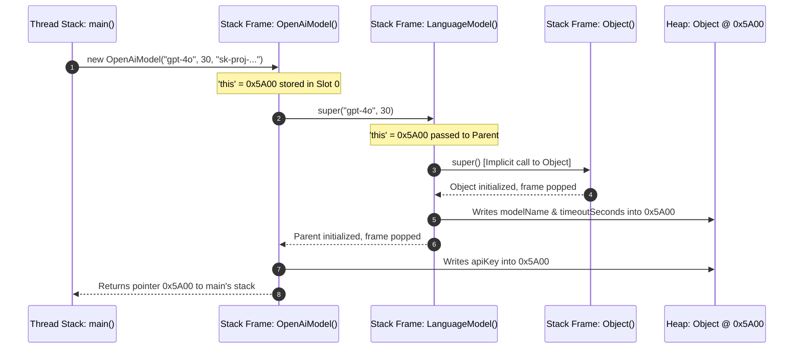
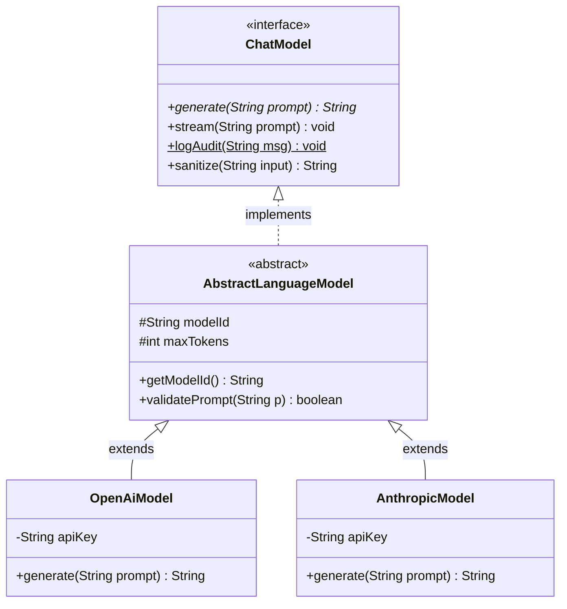
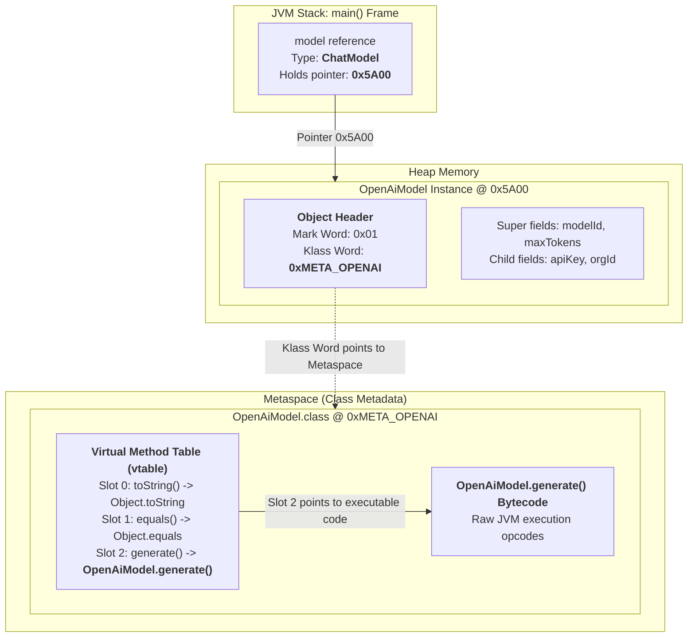

# Day_03 — Inheritance, Interfaces, Polymorphism, and Dynamic Dispatch in Memory

| ⬅️ Previous Day | 📚 Course Hub | ➡️ Next Day |
|:---|:---:|---:|
| [← Day 02: OOP — Classes, Objects & Memory](../Day_02_OOP_Classes_Objects_Memory/Day_02_OOP_Classes_Objects_Memory.md) | [All 60 Days Overview](../../README.md) | [Day 04: Generics, Collections & Data Structures →](../Day_04_Generics_Collections_DataStructures/Day_04_Generics_Collections_DataStructures.md) |

---

## 🎯 What You'll Understand By the End
- How the `extends` keyword establishes an **"is-a" relationship** and lays out parent and child fields contiguously in a single Heap object.
- The low-level mechanics of **constructor chaining (`super()`)**: how Stack Frames push and pop while Heap memory initializes in strict hierarchical order.
- The vital difference between **field hiding** (resolved at compile time via static binding) and **method overriding** (resolved at runtime via dynamic dispatch).
- How **Abstract Classes** (partial templates with instance state) contrast with **Interfaces** (pure capability contracts), and how modern interfaces use `default`, `static`, and `private` methods.
- The secret behind dynamic method dispatch: how the JVM uses **Virtual Method Tables (`vtable`)** and **Interface Method Tables (`itable`)** in Metaspace to achieve instant $O(1)$ polymorphic calls.
- How `java.lang.Object` anchors all classes in memory, including default identity hashing in the Object Header Mark Word, `equals()`, and `toString()`.

---

## 🧠 The Problem This Solves

Imagine writing an enterprise GenAI application that integrates multiple Large Language Model providers (OpenAI, Anthropic, local Ollama):

1. **Tight Coupling and Code Duplication**:
   Without polymorphism and shared interfaces, your business controllers and prompt services must know the exact concrete class of every provider:
   ```java
   // Catastrophic anti-pattern: Fragile branching logic everywhere
   if (providerType.equals("OPENAI")) {
       openAiClient.generateOpenAiCompletion(prompt);
   } else if (providerType.equals("ANTHROPIC")) {
       anthropicClient.createClaudeMessage(prompt);
   } else if (providerType.equals("OLLAMA")) {
       ollamaClient.invokeLocalLlama(prompt);
   }
   ```
   Every client has different method signatures, different configuration parameters, and different return types. Adding a fourth model (like Google Gemini) requires modifying and re-testing dozens of files across your entire codebase.

2. **Scattered Common Logic (Duplicated State)**:
   Every AI client requires a timeout duration, retry policies, temperature settings, and request logging. Copying and pasting these fields and logic across five separate classes creates maintenance nightmares: fixing a retry bug in one client leaves the other four broken.

3. **Inability to Test in Isolation**:
   Without interfaces, you cannot easily substitute a lightweight local mock client during unit testing. Your automated test suite would be forced to make real, billable HTTP calls to external AI APIs on every single run.

**Inheritance and Polymorphism** solve these problems:
- **Inheritance** allows subclasses to share common state and behavior from a base class without code duplication.
- **Interfaces** define strict architectural contracts (like `ChatModel`). Your application code interacts exclusively with that contract.
- **Polymorphism** allows swapping underlying implementations at runtime with zero changes to downstream business logic.

---

# Section 1: Inheritance & Heap Memory Layout

## 📖 Core Concept: The "Is-A" Relationship

Inheritance models an **"is-a" relationship** between classes using the `extends` keyword:
- An `OpenAiModel` **is-a** `LanguageModel`.
- A `ClaudeModel` **is-a** `LanguageModel`.

In Java, a class can extend **only one superclass** (single inheritance). This avoids the "Diamond Problem" of multiple inheritance found in C++, where a child inheriting from two parents with identical method names creates ambiguous execution paths.

---

## 🔬 Subclass Memory Anatomy (Rule 9: Memory-First Mandate)

When you instantiate a subclass using `new OpenAiModel(...)`, how does the JVM physically allocate memory on the Heap?

> ⚠️ **Key Realization**: The JVM does **not** create two separate objects for parent and child. It allocates **one single, contiguous block of memory** on the Heap that contains both the parent fields and the child fields!

```
┌────────────────────────────────────────────────────────────────────────┐
│ SINGLE CHILD OBJECT INSTANCE ON HEAP (OpenAiModel @ 0x5A00)            │
│                                                                        │
│ ┌────────────────────────────────────────────────────────────────────┐ │
│ │ OBJECT HEADER (12 to 16 bytes)                                     │ │
│ │  - Mark Word (hashcode, GC age, lock bits)                         │ │
│ │  - Klass Word (Pointer to OpenAiModel.class in Metaspace)          │ │
│ └────────────────────────────────────────────────────────────────────┘ │
│                                                                        │
│ ┌────────────────────────────────────────────────────────────────────┐ │
│ │ SUPERCLASS FIELDS PAYLOAD (LanguageModel)                          │ │
│ │  - modelName reference pointer (e.g. 0x1100 -> "gpt-4o")           │ │
│ │  - timeoutSeconds primitive int (4 bytes: 30)                      │ │
│ └────────────────────────────────────────────────────────────────────┘ │
│                                                                        │
│ ┌────────────────────────────────────────────────────────────────────┐ │
│ │ SUBCLASS FIELDS PAYLOAD (OpenAiModel)                              │ │
│ │  - apiKey reference pointer (e.g. 0x2200 -> "sk-...")              │ │
│ │  - organizationId reference pointer (e.g. 0x3300 -> "org-abc")     │ │
│ └────────────────────────────────────────────────────────────────────┘ │
│ ┌────────────────────────────────────────────────────────────────────┐ │
│ │ 8-BYTE ALIGNMENT PADDING (0 to 7 bytes to round up to multiple of 8)│ │
│ └────────────────────────────────────────────────────────────────────┘ │
└────────────────────────────────────────────────────────────────────────┘
```

The superclass fields appear **first** inside the object payload, followed immediately by the subclass's own specialized fields. This contiguous arrangement allows the JVM to access superclass fields at the exact same byte offsets, regardless of which subclass is instantiated!

---

## ⚙️ Constructor Chaining (`super()`) Under the Hood

When a subclass object is created, constructors must run in strict hierarchical order: from `java.lang.Object` down to the final child class.



*This sequence diagram shows constructor execution. Each constructor call pushes a new Stack Frame onto the thread stack. All constructors share the identical `this` pointer (`0x5A00`), systematically writing their fields into the contiguous Heap memory block from top to bottom.*

### The Construction Order Rules
1. Every Java constructor begins with an implicit call to `super()`, unless you explicitly write `super(...)` or `this(...)` on line 1.
2. The superclass constructor executes first, ensuring that base state is fully initialized and valid before the child constructor can access it.
3. Only after `super(...)` returns do the child's explicit field initializers and constructor body execute.

---

## ⚔️ Field Hiding vs. Method Overriding

A classic trap in Java is declaring a field in a child class with the same name as a field in its parent class.

- **Methods are Dynamically Dispatched**: Resolved at runtime based on the **actual object in Heap memory**.
- **Fields are Statically Bound**: Resolved at compile time based on the **declared reference type on the Stack**.

```java
class ParentModel {
    public String name = "Parent";
    public String getName() { return "Parent Method"; }
}

class ChildModel extends ParentModel {
    public String name = "Child"; // HIDES Parent.name! Never do this!
    @Override
    public String getName() { return "Child Method"; }
}

// In main():
ParentModel ref = new ChildModel();
System.out.println(ref.name);      // PRINTS: "Parent" (Static binding via reference type!)
System.out.println(ref.getName());   // PRINTS: "Child Method" (Dynamic dispatch via Heap object!)
```

> 💡 **New Word Alert — "Field Hiding"**: When a subclass declares a field with the exact same name as an inherited field in its parent. Unlike methods, fields cannot be overridden; the child field merely hides the parent field, causing confusion and bugs.

---

# Section 2: Interfaces & Abstract Classes

Java provides two architectural mechanisms for abstraction. Choosing between them depends on whether you are sharing **state** or defining a **pure behavioral contract**.



*This diagram illustrates a professional architecture. `ChatModel` defines the pure interface contract. `AbstractLanguageModel` provides a partial base template holding shared state (`modelId`, `maxTokens`), and concrete classes implement provider-specific logic.*

---

## ⚖️ Comparative Matrix: Abstract Classes vs. Interfaces

| Feature | Abstract Class (`abstract class`) | Interface (`interface`) |
|:---|:---|:---|
| **Primary Purpose** | **Partial implementation template**: Shares code, state, and identity among closely related subclasses. | **Contract specification**: Defines what a class can do, regardless of its position in the class hierarchy. |
| **Inheritance Limit** | Single inheritance (`extends` exactly one class). | Multiple implementation (`implements` unlimited interfaces). |
| **Instance Fields** | Can declare instance fields (`private String apiKey;`) that live on the Heap inside child objects. | Cannot have instance fields. Only `public static final` constants living in Metaspace. |
| **Constructors** | Has constructors (called via `super()`) to initialize its fields. | **No constructors**. Interfaces cannot be instantiated and hold no instance state. |
| **Relationship** | Strict **"is-a"** relationship (`OpenAiModel` is-a `AbstractLanguageModel`). | Flexible **"can-do"** capability contract (`OpenAiModel` can act as `Auditable`, `Closeable`). |

---

## 🛠️ Modern Interface Capabilities (Java 8, 9+)

Interfaces in modern Java are no longer restricted to empty method signatures. They support three advanced method types:

1. **`default` Methods (Java 8+)**:
   - Allows adding new methods to existing interfaces with a default implementation without breaking existing classes that implement the interface.
   - Example: Adding a fallback streaming method:
     ```java
     default void stream(String prompt) {
         // Default fallback: simulate streaming by printing whole response
         System.out.println(generate(prompt));
     }
     ```
2. **`static` Utility Methods (Java 8+)**:
   - Helper methods tied directly to the interface namespace. They cannot be overridden by implementing classes.
   - Example: `ChatModel.formatPrompt("User", "Hello AI");`
3. **`private` Helper Methods (Java 9+)**:
   - Internal helper methods used to share repetitive code between multiple `default` methods inside the interface itself, without exposing that logic to implementing classes or the outside world.

---

# Section 3: Polymorphism & Dynamic Dispatch Mechanics

Polymorphism means **"many forms."** It allows a single variable of a supertype to reference multiple different subtype implementations.

## 🔀 Compile-Time vs. Runtime Polymorphism

| Polymorphism Type | Mechanism | When It Is Resolved | How the JVM Resolves It |
|:---|:---|:---|:---|
| **Compile-Time** | **Method Overloading** (Same method name, different parameter lists). | **At Compile Time** by `javac`. | `javac` inspects parameter types and bakes the exact static method signature directly into bytecode (`generate(Ljava/lang/String;)V`). |
| **Runtime** | **Method Overriding** (Subclass provides custom implementation of inherited method). | **At Runtime** by the JVM. | The JVM inspects the object's `Klass Word` on the Heap and navigates its **Virtual Method Table (`vtable`)** in Metaspace. |

---

## 🗺️ Visual Overview: Stack Reference, Heap Object, and Metaspace `vtable`



*This diagram illustrates dynamic dispatch in physical memory. Even though the reference on the Stack is typed as `ChatModel`, the variable holds the pointer `0x5A00` on the Heap. When `model.generate(...)` executes, the JVM follows the object's Klass Word to `OpenAiModel.class` in Metaspace, looks up Slot 2 in its `vtable`, and executes `OpenAiModel.generate()` directly.*

---

## 🔬 The Memory Secret: Virtual Method Tables (`vtable`) in Metaspace

How does the JVM perform dynamic method dispatch in nanoseconds without slow `if/else` checks? It uses **Virtual Method Tables (`vtable`)**.

### 1. How the `vtable` is Constructed
When the ClassLoader loads a class into **Metaspace**, it constructs an indexed array of function pointers called the `vtable`:
- Subclasses inherit the exact same `vtable` index layout as their superclass.
- If `LanguageModel` assigns index `4` to `generate()`, every subclass will reserve index `4` for `generate()`.
- If `OpenAiModel` overrides `generate()`, the JVM replaces the function pointer at index `4` in `OpenAiModel`'s `vtable` with the address of `OpenAiModel.generate()` bytecode.

### 2. The Execution Step (`invokevirtual`)
When your code executes:
```java
ChatModel model = new OpenAiModel("gpt-4o");
model.generate("Explain quantum computing");
```
1. The JVM reads the reference in local variable `model` (`0x5A00`).
2. It fetches the object's **Klass Word** from the Object Header, which points to `OpenAiModel.class` in Metaspace.
3. It indexes directly to slot `4` in the `vtable` (an instant $O(1)$ array offset lookup).
4. It jumps straight to `OpenAiModel.generate()` bytecode and executes it.

> 💡 **New Word Alert — "vtable (Virtual Method Table)"**: An internal array of memory pointers stored in Metaspace for each class that maps method indices to their actual executable bytecode implementations, enabling rapid dynamic dispatch.

> 💡 **New Word Alert — "itable (Interface Method Table)"**: A specialized lookup structure in Metaspace used by `invokeinterface` when an object is called through an interface reference, allowing resolution even when different classes place the method at different `vtable` offsets.

---

# Section 4: The Root of All Classes (`java.lang.Object`)

In Java, every single class implicitly extends `java.lang.Object`. If a class does not declare an `extends` clause, the compiler automatically inserts `extends java.lang.Object`.

This guarantees that every object on the Java Heap possesses three fundamental methods:

### 1. `equals(Object obj)`: Identity vs. Logical Equality
- **Default `Object.equals()`**: Compares memory addresses (`this == obj`). It returns `true` if and only if both reference variables hold the exact same pointer to the identical Heap memory address.
- **Overridden `.equals()`**: Compares the logical field data contained inside the objects (e.g., checking if two models have the identical `modelId`).

### 2. `hashCode()`: The Object Header Connection
- **Default `Object.hashCode()`**: An "Identity HashCode." The JVM computes a 31-bit integer derived from the object's memory state and caches it inside the **Mark Word of the Object Header** on the Heap!
- **The Contract**: If two objects are equal according to `equals()`, they **must** return the identical `hashCode()`. Breaking this contract causes hash-based collections (`HashMap`, `HashSet`) to lose objects or fail lookups.

### 3. `toString()`: Default Memory Representation
- By default, `Object.toString()` returns:
  $$\text{getClass().getName()} + "@" + \text{Integer.toHexString(hashCode())}$$
  Example: `com.genai.OpenAiModel@4f023edb`
  The string following the `@` symbol is literally the hexadecimal representation of the identity hashcode stored in the object's Mark Word!

---

## 💻 Concrete Code Walkthrough: Tracing Polymorphic Execution

Let's trace a runnable, encapsulated Java 17+ program demonstrating inheritance, constructor chaining, dynamic dispatch, and the `Object` contract:

```java
package com.genai.foundations.day03;

import java.util.Objects;

// 1. Interface defining pure capability contract
interface ChatModel {
    String generate(String prompt);

    default void logCall(String prompt) {
        System.out.println("[AUDIT LOG] Prompt dispatched: " + prompt);
    }
}

// 2. Abstract base class providing shared state & template
abstract class AbstractLanguageModel implements ChatModel {
    // Superclass fields: Allocated first in Heap memory
    private final String modelId;
    private final int maxTokens;

    public AbstractLanguageModel(String modelId, int maxTokens) {
        this.modelId = Objects.requireNonNull(modelId, "modelId cannot be null");
        this.maxTokens = maxTokens;
    }

    public String getModelId() { return modelId; }
    public int getMaxTokens() { return maxTokens; }

    @Override
    public boolean equals(Object o) {
        if (this == o) return true; // Same memory pointer!
        if (!(o instanceof AbstractLanguageModel that)) return false;
        return maxTokens == that.maxTokens && Objects.equals(modelId, that.modelId);
    }

    @Override
    public int hashCode() {
        return Objects.hash(modelId, maxTokens);
    }
}

// 3. Concrete subclass extending state and overriding behavior
class OpenAiModel extends AbstractLanguageModel {
    // Subclass field: Allocated immediately following superclass fields in Heap
    private final String apiKey;

    public OpenAiModel(String modelId, int maxTokens, String apiKey) {
        super(modelId, maxTokens); // Explicit constructor chaining!
        this.apiKey = Objects.requireNonNull(apiKey, "apiKey cannot be null");
    }

    @Override
    public String generate(String prompt) {
        logCall(prompt); // Calls inherited default method
        return "OpenAI (" + getModelId() + ") response to: " + prompt;
    }
}

// 4. Main runner tracking stack and heap memory
public class PolymorphismRunner {
    public static void main(String[] args) {
        // Polymorphic reference:
        // Stack Reference Type: ChatModel
        // Actual Heap Instance: OpenAiModel @ 0x5A00
        ChatModel model = new OpenAiModel("gpt-4o", 4096, "sk-proj-live-token");

        // Dynamic dispatch via vtable: Calls OpenAiModel.generate()
        String result = model.generate("Explain quantum computing");
        System.out.println("Output: " + result);

        // Verifying Object contract
        ChatModel modelDuplicate = new OpenAiModel("gpt-4o", 4096, "sk-proj-another-key");
        System.out.println("Address equality (==)   : " + (model == modelDuplicate)); // false (different pointers)
        System.out.println("Logical equality (.equals): " + model.equals(modelDuplicate)); // true (same modelId & tokens)
    }
}
```

### Physical Memory Allocation & Dispatch Trace Table

| Line / Action | Memory Location | Physical Under-the-Hood Operation |
|:---|:---|:---|
| `new OpenAiModel(...)` | **Heap Space** | Allocates contiguous block at address `0x5A00` (Header + `modelId`, `maxTokens` + `apiKey`). Zeroes memory, runs `Object()` $\rightarrow$ runs `AbstractLanguageModel()` $\rightarrow$ runs `OpenAiModel()`. |
| `ChatModel model = ...` | **Stack (main frame)** | Slot `1` receives 64-bit pointer `0x5A00`. The declared type is `ChatModel`, but it points to an `OpenAiModel` on the Heap. |
| `model.generate(...)` | **Stack $\rightarrow$ Metaspace** | 1. JVM dereferences `model` (`0x5A00`).<br>2. Reads Klass Word pointing to `OpenAiModel.class` in Metaspace.<br>3. Inspects `vtable` at the `generate()` offset.<br>4. Resolves directly to `OpenAiModel.generate()`. |
| `model.equals(modelDuplicate)` | **Metaspace vtable** | Dynamic dispatch routes to `AbstractLanguageModel.equals()`. Compares `modelId` and `maxTokens` logical values; returns `true`. |

---

## 🔑 Key Terminology

| Term | Plain-English Meaning |
|:---|:---|
| **Inheritance** | A mechanism where a child class acquires fields and methods from a parent class using `extends`. |
| **Interface** | A pure architectural contract that specifies what methods a class must implement without defining instance state. |
| **Polymorphism** | The ability to treat different underlying objects through a common interface or superclass reference. |
| **Dynamic Dispatch** | The runtime mechanism where the JVM determines which overridden method implementation to execute based on the actual object on the Heap. |
| **`vtable`** | A virtual method table stored in Metaspace that maps method indices to executable bytecode pointers for rapid $O(1)$ dispatch. |
| **Constructor Chaining** | The mandatory sequence where every child constructor invokes its parent constructor (`super()`) before executing its own body. |
| **Field Hiding** | When a subclass declares a field with the same name as a superclass field, resulting in static binding rather than dynamic overriding. |
| **Defensive Invariant** | A validation check in a constructor (e.g. non-null, positive number) ensuring an object cannot be created in an invalid memory state. |

---

## ⚠️ Common Beginner Mistakes

### 1. Expecting Field Overriding (The Field Hiding Bug)
Beginners often assume that fields can be overridden polymorphically like methods.

❌ **Wrong Way**:
```java
class BaseAgent { public int maxSteps = 10; }
class SmartAgent extends BaseAgent { public int maxSteps = 50; }

BaseAgent agent = new SmartAgent();
System.out.println(agent.maxSteps); // PRINTS 10, NOT 50!
```

✅ **Right Way**:
```java
// Always keep fields private and expose them via overridden methods:
class BaseAgent { 
    public int getMaxSteps() { return 10; } 
}
class SmartAgent extends BaseAgent { 
    @Override 
    public int getMaxSteps() { return 50; } 
}

BaseAgent agent = new SmartAgent();
System.out.println(agent.getMaxSteps()); // PRINTS 50 (Dynamic dispatch via vtable!)
```
*Why it is wrong*: The JVM resolves field accesses at **compile time** using the declared reference type on the Stack (`BaseAgent`), ignoring the runtime object on the Heap.

---

### 2. Forgetting to Override `hashCode()` When Overriding `equals()`
Overriding `.equals()` without overriding `.hashCode()` breaks all hash-based collections (`HashMap`, `HashSet`).

❌ **Wrong Way**:
```java
public class ModelKey {
    private String name;
    @Override
    public boolean equals(Object o) { ... } // Overridden!
    // hashCode() is NOT overridden! Inherits default Object.hashCode()!
}

// In main():
Map<ModelKey, String> map = new HashMap<>();
map.put(new ModelKey("gpt-4"), "Active");

// Returns null! Even though the keys are equal according to equals(),
// their inherited identity hashcodes place them in completely different hash buckets!
String status = map.get(new ModelKey("gpt-4")); 
```

✅ **Right Way**:
```java
@Override
public boolean equals(Object o) { ... }

@Override
public int hashCode() {
    return Objects.hash(name); // Equal objects produce identical hashcodes!
}
```

---

### 3. Casting References Without Checking (`ClassCastException`)
Downcasting a superclass reference to an incompatible subclass type causes sudden runtime crashes.

❌ **Wrong Way**:
```java
ChatModel model = new OpenAiModel("gpt-4o", 4096, "key");
AnthropicModel claude = (AnthropicModel) model; // CRASH! ClassCastException at runtime!
```

✅ **Right Way (Modern Pattern Matching for `instanceof`)**:
```java
if (model instanceof AnthropicModel claude) {
    // Safely casted and bound to 'claude' variable inside this scope
    claude.someClaudeSpecificMethod();
}
```

---

## ✅ Best Practices

1. **Favor Composition Over Inheritance**: Use inheritance only when there is a genuine, permanent **"is-a"** relationship. If you only need functionality, inject the dependency as a field (composition).
2. **Always Annotate with `@Override`**: Always place `@Override` above overridden methods. If you accidentally misspell the method name or change a parameter type, the compiler alerts you immediately instead of silently treating it as an overload.
3. **Keep Inheritance Hierarchies Shallow**: Deep inheritance trees (e.g. 5+ levels) make memory footprints difficult to reason about and increase coupling. Standardize on 1 abstract base class implementing an interface.
4. **Mark Classes `final` if Not Designed for Extension**: If a class should not be subclassed, mark it `final` (e.g., `public final class OpenAiModel`). This allows the JIT compiler to aggressively inline methods and devirtualize method calls, bypassing `vtable` lookups entirely!

---

## 🔭 Looking Ahead
In **Day_04**, we will advance into **Generics, Collections, and Data Structures**: mastering how Java enforces compile-time type safety via `<T>`, how **Type Erasure** removes generic types from bytecode, and how memory is partitioned inside `ArrayList`, `LinkedList`, and `HashMap`.

---

## 📝 Quick Recap
- Subclass instances occupy a **single, contiguous block of memory** on the Heap; superclass fields are laid out first, followed by subclass fields.
- Constructors execute in strict hierarchy from `Object` down to the child; each constructor runs via **constructor chaining (`super()`)**.
- Fields do **not** participate in polymorphism; they are statically bound at compile time based on the reference type.
- **Interfaces** define capability contracts with zero instance state; modern interfaces support `default`, `static`, and `private` methods.
- The JVM achieves rapid runtime polymorphism via **Virtual Method Tables (`vtable`)** in Metaspace, mapping method indices to bytecode addresses in $O(1)$ time.
- Every class descends from `java.lang.Object`; identity hashcodes live in the Object Header Mark Word.

---

## 🧪 Try It Yourself

1. **Trace Constructor Chaining**: Create three classes: `Grandparent`, `Parent`, and `Child`. Add print statements inside each constructor. Instantiate `new Child()` and observe the exact order of console outputs to verify Stack Frame pushes and pops.
2. **Inspect Bytecode Dispatch**: Compile `PolymorphismRunner.java`. Run `javap -c com.genai.foundations.day03.PolymorphismRunner` in your terminal. Locate the call to `model.generate()` and notice that the bytecode uses the instruction `invokeinterface` rather than `invokestatic`.
3. **Verify the HashCode Contract**: Write a small program inserting objects into a `HashSet`. First test with a class that overrides `equals()` but NOT `hashCode()`. Then test with both overridden. Observe how the set fails to recognize duplicate objects in the first case.
