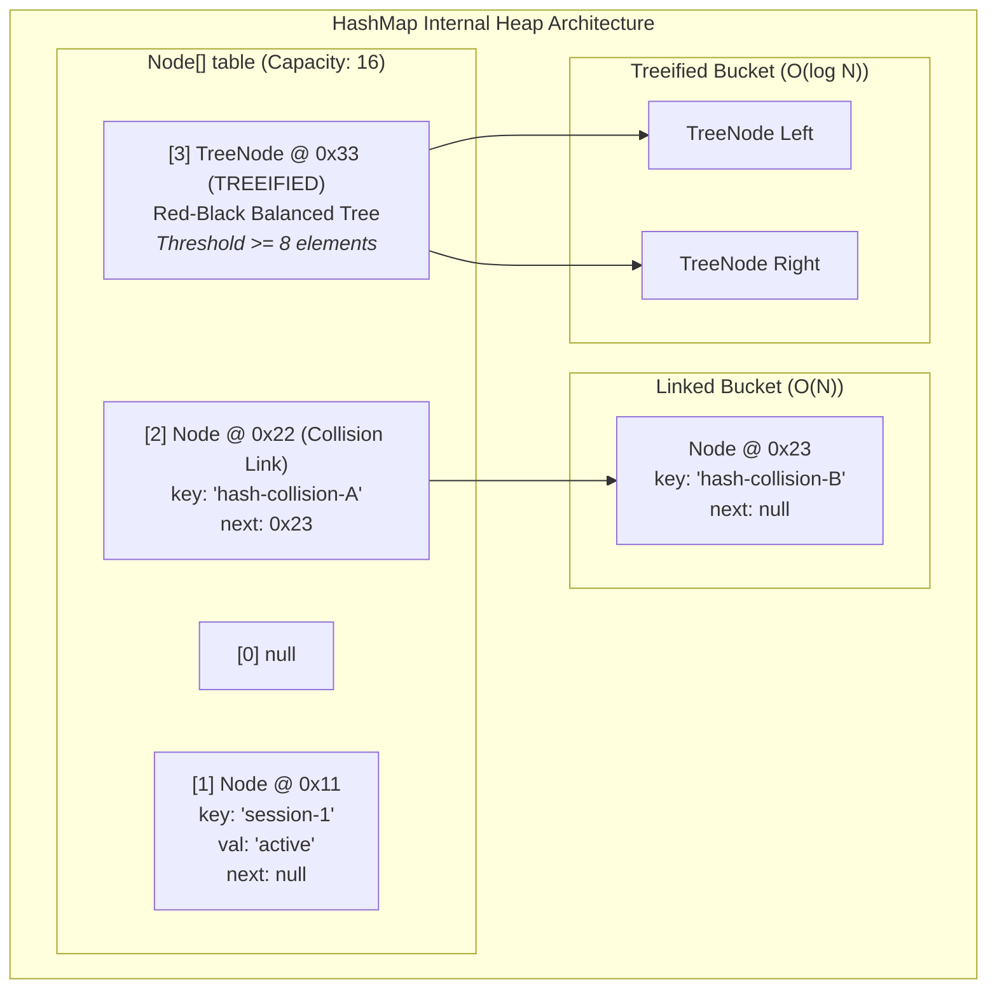

# Day_04 — Generics, Collections Framework, and Data Structures in Memory

| ⬅️ Previous Day | 📚 Course Hub | ➡️ Next Day |
|:---|:---:|---:|
| [← Day 03: Inheritance, Interfaces & Polymorphism](../Day_03_Inheritance_Interfaces_Polymorphism/Day_03_Inheritance_Interfaces_Polymorphism.md) | [All 60 Days Overview](../../README.md) | [Day 05: Modern Java: Records, Optional, Sealed →](../Day_05_Modern_Java_Records_Optional_Sealed/Day_05_Modern_Java_Records_Optional_Sealed.md) |

---

## 🎯 What You'll Understand By the End
- How **Generics** enforce compile-time type boundaries and how **Type Erasure** erases types to `Object` or bounds in bytecode.
- Why generic primitive types (`List<int>`) do not exist in Java, and the physical memory tax of **auto-boxing** (`int` vs. `Integer` on the Heap).
- The byte-level memory contrast between **`ArrayList`** (contiguous array, CPU cache locality) and **`LinkedList`** (scattered node allocations, pointer chasing).
- The mathematical and structural internals of **`HashMap`**: the bucket array `Node<K,V>[]`, the hashing formula `(n - 1) & hash`, collision chaining, and treeification into **Red-Black Trees**.
- How **`HashSet`** is secretly backed by a `HashMap` using a static dummy object, and how `modCount` triggers `ConcurrentModificationException` during iteration.

---

## 🧠 The Problem This Solves

Before Java 5 introduced Generics in 2004, collections stored raw, untyped `Object` references:

1. **The "Mystery Box" Dilemma & Runtime Crashes**:
   An `ArrayList` could hold any object simultaneously without complaint. Retrieving an item required dangerous manual type casting:
   ```java
   // Ancient Pre-Generics Java:
   List messages = new ArrayList();
   messages.add("User prompt");
   messages.add(404); // Accidental bug: Integer slipped in!

   // Runtime disaster:
   for (int i = 0; i < messages.size(); i++) {
       String msg = (String) messages.get(i); // CRASH on i=1! ClassCastException: Integer cannot be cast to String
   }
   ```
   Errors like this could not be detected at compile time; they hid silently until triggered by a live user in production.

2. **The "LinkedList is Faster for Insertions" Myth**:
   Many developers blindly choose `LinkedList` believing that inserting items is $O(1)$ without understanding physical hardware reality:
   - Each `LinkedList` node is a separate Heap object with a 16-byte header and three 8-byte reference pointers (40 bytes overhead per single item).
   - Nodes are scattered across random memory addresses on the Heap, causing CPU **cache misses** on every single traversal.
   - In real-world enterprise applications, `ArrayList` outperforms `LinkedList` by orders of magnitude because modern CPU architectures are optimized for contiguous memory.

3. **Hash Collision Denial of Service (HashDoS)**:
   In older Java versions, when thousands of keys collided into the same `HashMap` bucket, the bucket degraded into an $O(N)$ linear linked list. Attackers exploited this by sending specially crafted HTTP payloads with identical hash codes, causing web servers to freeze with 100% CPU usage. Java 8 solved this by converting collided buckets into balanced Red-Black trees ($O(\log N)$).

---

# Section 1: Generics & Type Erasure in Memory

## 📖 Core Concept: Type Parameters and Boundaries

Generics allow classes, interfaces, and methods to parameterize the types of data they operate upon:
- `<T>`: Type (general placeholder)
- `<E>`: Element (used extensively in Collections)
- `<K, V>`: Key and Value (used in Maps)

### 1. Bounded Type Parameters
You can restrict which types can be passed to a generic class using `extends`:
```java
// T must be Number or a subclass of Number (Integer, Double, etc.)
public class TokenBudget<T extends Number> {
    private T limit;
    public double toDouble() { return limit.doubleValue(); }
}
```

### 2. Wildcards and the PECS Principle
When passing generic collections into methods, Java enforces strict invariance: `List<Integer>` is **not** a `List<Number>`. To write flexible APIs, Java uses wildcards:
- **`? extends T` (Upper Bounded Wildcard)**: Accepts `T` or any subclass. Use when you only **READ** items from the collection (**Producer Extends**).
- **`? super T` (Lower Bounded Wildcard)**: Accepts `T` or any superclass. Use when you only **WRITE** items to the collection (**Consumer Super**).

---

## 🔬 Type Erasure Under the Hood (Rule 9: Memory-First Mandate)

Java added Generics in Java 5 without breaking compatibility with existing pre-2004 bytecode. It achieved this through **Type Erasure**:

```
Compile Time (javac) ────────────────────────────────► Runtime (JVM Execution)
List<String> list = new ArrayList<>();                List list = new ArrayList();
list.add("Prompt");                                   list.add((Object) "Prompt");
String s = list.get(0);                               String s = (String) list.get(0);
```

### The 3 Rules of Type Erasure:
1. **Type Stripping**: The compiler removes all generic type parameters `<T>` from class declarations.
2. **Replacement with Upper Bound**:
   - An unbounded type parameter `<T>` is replaced by `java.lang.Object` in bytecode.
   - A bounded parameter `<T extends Number>` is replaced by `java.lang.Number`.
3. **Synthetic Bridge Casts**: Wherever you read from a generic collection, the compiler automatically inserts an explicit `checkcast` instruction into the bytecode.

> ⚠️ **Key Realization**: In JVM memory at runtime, **all instances of `ArrayList` are identical raw lists storing `Object` pointers!** There is no separate `ArrayList<String>` class in Metaspace.

---

## 🛑 Why `List<int>` Cannot Exist: The Auto-Boxing Memory Tax

Why does Java force you to write `List<Integer>` instead of `List<int>`?

1. **Object Reference Requirement**: Java collections store **object memory pointers** (addresses pointing to the Heap).
2. **Primitives Have No Object Header**: A primitive `int` is 4 bytes of raw binary digits on the Stack. It has no Mark Word, no Klass Word, and cannot be cast to `java.lang.Object`.
3. **Auto-Boxing to the Rescue**: When you add an `int` to a `List<Integer>`, the compiler automatically boxes it using `Integer.valueOf(42)`, creating a full wrapper object on the Heap.

### The Staggering Memory Tax of Auto-Boxing

```
Primitive 'int' on Stack:
[ 4 bytes raw binary ]

Boxed 'Integer' on Heap:
┌────────────────────────────────────────────────────────┐
│ Mark Word (8 bytes)                                    │
│ Klass Pointer (4 or 8 bytes)                           │
│ int value field (4 bytes)                              │
│ Padding (4 bytes to round to multiple of 8)            │
└────────────────────────────────────────────────────────┘
Total: 24 bytes on Heap + 8 bytes reference pointer = 32 bytes!
```

> ⚠️ **Memory Impact**: Storing one million numbers as primitives (`int[]`) consumes **4 MB** of RAM. Storing one million numbers in a `List<Integer>` consumes **32 MB** of RAM—an **800% memory bloat**!

---

# Section 2: List Implementations & Memory Overhead

The Java Collections Framework provides two primary `List` implementations, with fundamentally different physical memory profiles.

```mermaid
flowchart TD
    subgraph ArrayListMem ["ArrayList in Heap Memory (Contiguous Array)"]
        AL_HDR["<b>ArrayList Object</b><br>size: 3<br>elementData pointer: 0xARR"]
        subgraph BackingArray ["Object[] @ 0xARR (Contiguous Slots)"]
            SLOT0["[0] -> 0xP1 ('Hello')"]
            SLOT1["[1] -> 0xP2 ('AI')"]
            SLOT2["[2] -> 0xP3 ('World')"]
            SLOT3["[3] -> null (Spare capacity)"]
        end
        AL_HDR --> BackingArray
    end

    subgraph LinkedListMem ["LinkedList in Heap Memory (Scattered Pointer Nodes)"]
        LL_HDR["<b>LinkedList Object</b><br>first: 0xN1<br>last: 0xN3"]
        N1["<b>Node 1 @ 0xN1</b><br>prev: null<br>next: 0xN2<br>item: 0xP1 ('Hello')"]
        N2["<b>Node 2 @ 0xN2</b><br>prev: 0xN1<br>next: 0xN3<br>item: 0xP2 ('AI')"]
        N3["<b>Node 3 @ 0xN3</b><br>prev: 0xN2<br>next: null<br>item: 0xP3 ('World')"]
        
        LL_HDR --> N1
        N1 <--> N2
        N2 <--> N3
    end
```



*This diagram illustrates memory layouts. `ArrayList` uses a single contiguous `Object[]` array on the Heap. In contrast, `LinkedList` allocates individual `Node` objects scattered across arbitrary Heap addresses, requiring two pointer references (`prev` and `next`) per element.*

---

## ⚡ `ArrayList`: Contiguous Memory & CPU Cache Locality

### 1. Internal Structure
`ArrayList` is backed by a standard, contiguous array: `transient Object[] elementData`.
- **Indexed Access ($O(1)$)**: Retrieving index $i$ requires a simple pointer arithmetic calculation:
  $$\text{Address}(i) = \text{Base Address} + (i \times \text{Pointer Size})$$
- **Growth Algorithm**: When the backing array fills up, `ArrayList` allocates a new array that is **1.5x larger**:
  $$\text{newCapacity} = \text{oldCapacity} + (\text{oldCapacity} \gg 1)$$
  It copies the existing elements to the new array via `System.arraycopy()` (a fast native memory block copy) and drops the old array for Garbage Collection.

### 2. The Hardware Advantage: CPU Cache-Line Locality
Modern processors do not read individual bytes from RAM; they fetch **64-byte chunks called Cache Lines** into high-speed L1/L2 CPU caches.
- Because `ArrayList`'s array pointers sit side-by-side in contiguous memory, loading element `[0]` automatically loads elements `[1]` through `[7]` into the CPU cache in a single memory fetch!
- Iterating through an `ArrayList` runs at lightning speed because almost every read hits the L1 CPU cache (**Cache Hit**).

---

## 🐌 `LinkedList`: Pointer Chasing & Memory Fragmentation

Each item added to a `LinkedList` requires allocating a brand-new `Node<E>` object on the Heap:
- 16-byte Object Header
- 8-byte pointer to previous `Node` (`prev`)
- 8-byte pointer to next `Node` (`next`)
- 8-byte pointer to data element (`item`)
- **Total Overhead: 40 bytes per node** (plus the element itself)!

### Why `LinkedList` is Slow on Modern Hardware: "Pointer Chasing"
Because each `Node` is allocated separately, they are scattered across random, non-contiguous Heap addresses.
- To reach index `500`, the CPU must read Node 0, follow its pointer to Node 1, follow its pointer to Node 2...
- Every pointer hop fetches a completely different address in RAM, causing a **CPU Cache Miss** and stalling the processor while waiting for slow main memory.
- In 99.9% of enterprise applications, **`ArrayList` is the strictly superior choice**.

---

# Section 3: Map Internals & Collision Mechanics (`HashMap`)

The `HashMap` is the workhorse of enterprise Java, providing average $O(1)$ key lookups.



*This diagram illustrates `HashMap` internals. An array of buckets holds `Node<K,V>` elements. Uncollided keys sit alone in bucket slots. Collisions form a singly linked list. When a bucket reaches 8 collided nodes, it treeifies into a balanced Red-Black Tree (`TreeNode`).*

---

## 🔬 The 3 Mathematical Steps of `map.put(key, value)`

### Step 1: Compute the Spread Hash Code
Java calls `key.hashCode()`, then applies a bit-shifting "hash spreading" function to distribute high bits into low bits:
```java
static final int hash(Object key) {
    int h;
    return (key == null) ? 0 : (h = key.hashCode()) ^ (h >>> 16);
}
```
*Why this matters*: Most hash tables start small (capacity 16). Without spreading, only the lowest 4 bits of the hashcode would be used, causing massive collision spikes.

### Step 2: Calculate the Bucket Index via Bitwise AND
Instead of a slow arithmetic modulo (`hash % capacity`), Java calculates the bucket index using a bitwise AND:
$$\text{Index} = (n - 1) \ \& \ \text{hash}$$
Because table capacity $n$ is **always a power of 2** (16, 32, 64...), $(n - 1)$ produces a bitmask of all `1`s (e.g., $16 - 1 = 15 = 00001111_2$). Bitwise AND runs in a single CPU clock cycle!

### Step 3: Handle Collisions (Chaining $\rightarrow$ Treeification)
- If the calculated bucket is empty (`null`), a new `Node<K,V>` is placed directly in the slot.
- If the bucket already contains a node with a different key (**Hash Collision**), Java appends the new node to a singly linked list at that bucket.
- **Treeification Threshold**: If a single bucket accumulates **8 nodes** (`TREEIFY_THRESHOLD = 8`) and total table capacity is at least 64, Java converts that linked list into a **Red-Black balanced Binary Search Tree** (`TreeNode<K,V>`). Lookup time drops from $O(N)$ to $O(\log N)$!

---

## 🔄 Rehashing and the Load Factor

- **Default Load Factor**: `0.75` (75% full).
- **Threshold Formula**: $\text{Threshold} = \text{Capacity} \times \text{Load Factor}$
  For a default map with capacity 16: $16 \times 0.75 = 12$.
- When the 13th key is inserted, the `HashMap` triggers a **resize**:
  1. A new array of double the size is allocated on the Heap ($16 \rightarrow 32$).
  2. Every existing node is re-indexed into the new array (**Rehashing**).

---

# Section 4: Sets & Secondary Structures

## 🪞 `HashSet`: The Secret `HashMap` Wrapper

A `HashSet` guarantees uniqueness and provides $O(1)$ lookups. How?

> ⚠️ **The Under-the-Hood Truth**: A `HashSet` has no unique memory architecture. It is literally an internal wrapper around a private `HashMap`!

```java
public class HashSet<E> {
    private transient HashMap<E, Object> map;

    // Dummy value paired with every element key in the backing Map
    private static final Object PRESENT = new Object();

    public boolean add(E e) {
        return map.put(e, PRESENT) == null;
    }

    public boolean contains(Object o) {
        return map.containsKey(o);
    }
}
```
When you call `set.add("Claude")`, the `HashSet` puts `"Claude"` as the **Key** in its internal `HashMap`, pairing it with a static dummy object named `PRESENT` as the Value!

---

## 🌳 `TreeSet` vs. `LinkedHashSet`

| Collection | Backing Architecture | Ordering Guarantee | Lookup Performance | Memory Footprint |
|:---|:---|:---|:---|:---|
| **`HashSet`** | Backed by `HashMap`. | No ordering guaranteed. | Average $O(1)$. | Moderate (array + `Node` objects). |
| **`LinkedHashSet`** | Backed by `LinkedHashMap` (Hash table + doubly-linked list through entries). | **Insertion Order** maintained. | Average $O(1)$. | Higher (each node holds additional `before` and `after` pointers). |
| **`TreeSet`** | Backed by `TreeMap` (Red-Black balanced Binary Search Tree). | **Sorted Order** (natural or `Comparator`). | Guaranteed $O(\log N)$. | Moderate (each node has parent, left, and right child pointers). |

---

## 💥 Iterators & `ConcurrentModificationException` (The `modCount` Check)

Have you ever seen code crash with `ConcurrentModificationException` when deleting an item inside a `for-each` loop?

```java
// BUG: Will crash at runtime!
for (String model : modelList) {
    if (model.startsWith("old-")) {
        modelList.remove(model); // CRASH! ConcurrentModificationException
    }
}
```

### Why It Happens Under the Hood:
1. Every collection has an internal counter: `protected transient int modCount = 0;`.
2. Every time you add or remove an element, the collection increments `modCount++`.
3. When you start a `for-each` loop, Java creates an `Iterator` on the Stack, copying the current counter: `expectedModCount = modCount;`.
4. On every iteration, `iterator.next()` checks:
   ```java
   if (modCount != expectedModCount) {
       throw new ConcurrentModificationException();
   }
   ```
5. Calling `modelList.remove(...)` directly increments `modCount`, but the iterator's `expectedModCount` is not updated. On the next loop step, the mismatch is detected and the program crashes!

### The Right Way to Mutate During Iteration:
```java
// Option 1: Use Iterator.remove() (updates both counters synchronously)
Iterator<String> it = modelList.iterator();
while (it.hasNext()) {
    if (it.next().startsWith("old-")) {
        it.remove(); // SAFE!
    }
}

// Option 2: Modern Java removeIf()
modelList.removeIf(model -> model.startsWith("old-")); // FAST & SAFE
```

---

## 💻 Concrete Code Walkthrough: Tracing Collections in Memory

```java
package com.genai.foundations.day04;

import java.util.*;

public class CollectionsMemoryDemo {

    public static void main(String[] args) {
        System.out.println("==================================================");
        System.out.println("   DAY 04: GENERICS & COLLECTIONS MEMORY TRACE    ");
        System.out.println("==================================================");

        // 1. Boxing Overhead Demonstration
        int primitiveTokens = 4096; // 4 bytes raw bits on Stack
        Integer boxedTokens = Integer.valueOf(4096); // 24 bytes on Heap + 8-byte pointer!

        // 2. ArrayList contiguous backing array allocation
        List<String> modelList = new ArrayList<>(4); // Allocates Object[4] on Heap
        modelList.add("gpt-4o");
        modelList.add("claude-3-5-sonnet");
        modelList.add("gemini-1-5-pro");

        System.out.println("1. ArrayList elements (contiguous memory): " + modelList);

        // 3. HashMap bucket hashing and insertion
        Map<String, Integer> tokenUsageMap = new HashMap<>(16);
        tokenUsageMap.put("gpt-4o", 1500);
        tokenUsageMap.put("claude-3-5-sonnet", 2200);

        System.out.println("2. HashMap size: " + tokenUsageMap.size());
        System.out.println("   Lookup 'gpt-4o': " + tokenUsageMap.get("gpt-4o"));

        // 4. Safe modification using removeIf
        modelList.removeIf(m -> m.contains("gemini"));
        System.out.println("3. ArrayList after safe removeIf: " + modelList);

        System.out.println("==================================================");
    }
}
```

### Physical Memory Allocation & Data Structure Trace Table

| Operation | Memory Area | What Physically Happens in RAM |
|:---|:---|:---|
| `int primitiveTokens = 4096;` | **Stack (main frame)** | Slot `1` holds 4 bytes of raw binary integer `4096`. Zero Heap overhead. |
| `Integer.valueOf(4096)` | **Heap Space** | Allocates 24-byte `Integer` object at address `0x09AA` (Mark Word + Klass Word + int payload + padding). Stack slot holds pointer `0x09AA`. |
| `new ArrayList<>(4)` | **Heap Space** | Allocates `ArrayList` header (24 bytes) pointing to an internal `Object[4]` array (32 bytes) at address `0x11FF`. |
| `modelList.add("gpt-4o")` | **Heap Space** | Array index `[0]` at address `0x11FF` receives 64-bit reference pointer pointing to string `"gpt-4o"` in the constant pool. |
| `new HashMap<>(16)` | **Heap Space** | Allocates `HashMap` instance pointing to a `Node<K,V>[16]` array. All 16 slots initialized to `null`. |
| `tokenUsageMap.put("gpt-4o", 1500)` | **Heap Space** | 1. Computes `hash("gpt-4o")`.<br>2. Calculates `index = (16 - 1) & hash`.<br>3. Allocates a 32-byte `Node<K,V>` object holding key pointer, boxed value pointer, and `next = null`. |

---

## 🔑 Key Terminology

| Term | Plain-English Meaning |
|:---|:---|
| **Generics** | Compile-time type parameters (e.g. `<T>`) that enforce type boundaries and eliminate manual casting. |
| **Type Erasure** | The compile-time process where `javac` strips generic type parameters and inserts synthetic casts into bytecode. |
| **Auto-Boxing** | The automatic conversion of primitive types (like `int`) into Heap wrapper objects (`Integer`), incurring an 8x memory overhead. |
| **Cache Line** | A 64-byte block of memory transferred from physical RAM into CPU caches in a single operation. |
| **Hash Collision** | When two different keys produce the exact same bucket index in a `HashMap`. |
| **Treeification** | The automatic transformation of a collided `HashMap` bucket from an $O(N)$ linked list into an $O(\log N)$ Red-Black tree when it reaches 8 elements. |
| **`modCount`** | An internal counter in collections that tracks structural modifications to detect illegal concurrent mutations during iteration. |

---

## ⚠️ Common Beginner Mistakes

### 1. Choosing `LinkedList` Over `ArrayList` for Performance
Beginners frequently choose `LinkedList` assuming it is faster because insertion is theoretically $O(1)$.

❌ **Wrong Way**:
```java
List<AiMessage> messages = new LinkedList<>(); // 40 bytes overhead per node + cache misses!
```

✅ **Right Way**:
```java
List<AiMessage> messages = new ArrayList<>(); // Contiguous array + CPU cache-line friendly!
```
*Why it is wrong*: `LinkedList` incurs 40 bytes of memory overhead per node and causes constant CPU cache misses due to scattered memory addresses. In real benchmarks, `ArrayList` is significantly faster for almost all workloads.

---

### 2. Mutating Collections Inside a For-Each Loop
Calling `list.remove(...)` inside an active enhanced `for` loop.

❌ **Wrong Way**:
```java
for (String token : promptTokens) {
    if (token.isBlank()) {
        promptTokens.remove(token); // CRASH! ConcurrentModificationException
    }
}
```

✅ **Right Way**:
```java
promptTokens.removeIf(String::isBlank); // Thread-safe, clean, and avoids modCount desync!
```

---

### 3. Using Mutable Objects as `HashMap` Keys
Using an object whose fields can change as a key in a `HashMap`.

❌ **Wrong Way**:
```java
public class UserSession { public String id; } // MUTABLE field!

Map<UserSession, String> map = new HashMap<>();
UserSession session = new UserSession();
session.id = "sess-1";
map.put(session, "Data");

session.id = "sess-2"; // MUTATION! Hash code changes!
map.get(session); // RETURNS NULL! The object is permanently lost in the wrong bucket!
```

✅ **Right Way**: Always use **immutable** objects as Map keys (e.g. `String`, `Integer`, or Java `record`).

---

## ✅ Best Practices

1. **Pre-Size Collections When Size is Known**: If you know you will store 1,000 items, initialize with `new ArrayList<>(1000)` or `new HashMap<>(1024)`. This eliminates expensive array reallocation and rehashing cycles.
2. **Favor `ArrayList` as the Default List**: Default to `ArrayList` unless you specifically need double-ended queue operations (`Deque` / `ArrayDeque`).
3. **Always Follow the PECS Rule**: Use `? extends T` when reading from generic collections; use `? super T` when adding items to generic collections.
4. **Use Primitive Collections for Massive Numeric Workloads**: If storing millions of numbers, avoid `List<Integer>`. Use primitive arrays (`int[]`) or specialized libraries (like Eclipse Collections or Trove) to save 80% of your RAM.

---

## 🔭 Looking Ahead
In **Day_05**, we will explore **Modern Java: Records, Optional, and Sealed Types**: discovering how `record` eliminates boilerplate data classes, how `Optional<T>` eradicates `NullPointerException`, and how `sealed` types define restricted type hierarchies.

---

## 📝 Quick Recap
- Generics enforce compile-time safety; **Type Erasure** removes generic information from bytecode at runtime.
- Primitive generics do not exist; auto-boxing an `int` into an `Integer` incurs an 8x memory footprint expansion on the Heap.
- **`ArrayList`** uses a contiguous array that maximizes CPU cache-line prefetching; **`LinkedList`** suffers from 40-byte node overhead and cache misses.
- **`HashMap`** uses `(n - 1) & hash` for $O(1)$ lookups and transforms collided buckets into **Red-Black balanced trees** when depth reaches 8.
- **`HashSet`** is backed by an internal `HashMap` using a static dummy object `PRESENT`.
- Modifying a collection directly during iteration desynchronizes `modCount`, throwing `ConcurrentModificationException`.

---

## 🧪 Try It Yourself

1. **Measure Boxing Memory**: Write a test comparing the memory of an `int[1_000_000]` array versus an `ArrayList<Integer>` with 1,000,000 items. Use `Runtime.getRuntime().totalMemory() - Runtime.getRuntime().freeMemory()` before and after to observe the 8x memory surge.
2. **Trigger Treeification**: Write a class with a custom `hashCode()` method that intentionally returns the same integer (`return 42;`) for all instances. Insert 10 instances into a `HashMap`. Using a debugger, inspect the `table` array to verify that the bucket transformed from a `Node` into a `TreeNode`.
3. **Simulate `ConcurrentModificationException`**: Write a small program that iterates over a list using a `for-each` loop and removes an item. Observe the stack trace and verify how `removeIf()` cleanly resolves the issue.
