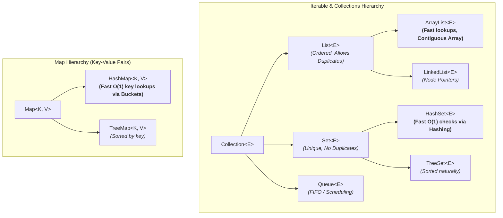

# Day_04 — Generics, Collections, Data Structures

| ⬅️ Previous Day | 📚 Course Hub | ➡️ Next Day |
|:---|:---:|---:|
| [← Day 03: Inheritance, Interfaces & Polymorphism](../Day_03_Inheritance_Interfaces_Polymorphism/Day_03_Inheritance_Interfaces_Polymorphism.md) | [All 60 Days Overview](../../README.md) | [Day 05: Modern Java: Records, Optional, Sealed →](../Day_05_Modern_Java_Records_Optional_Sealed/Day_05_Modern_Java_Records_Optional_Sealed.md) |

---

## 🎯 What You'll Understand By the End
- Why **Generics** (`<T>`) were invented to eliminate dangerous `ClassCastException` runtime crashes.
- How to choose the right data structure from the **Java Collections Framework** (`List`, `Set`, and `Map`) for every AI workload.
- When to use **`ArrayList` vs. `LinkedList`**, and why `ArrayList` is the undisputed default choice for modern CPUs.
- How **`HashMap`** achieves near-instant $O(1)$ lookups under the hood using hashing and buckets.
- What **Type Erasure** means in plain English, and how it protects backward compatibility.

---

## 🧠 The Problem This Solves

Before Java 5 introduced Generics in 2004, all collections stored generic `Object` references. 

This meant:
- An `ArrayList` could hold a String, an Integer, and an AI Model configuration simultaneously without complaint.
- To retrieve an item, you had to manually cast the object back to its expected type:
  ```java
  // Pre-Generics (Ancient Java):
  ArrayList messages = new ArrayList();
  messages.add("Hello AI");
  messages.add(404); // Compiler allows this mistake!

  // Runtime catastrophe:
  String text = (String) messages.get(1); // CRASH! ClassCastException: Integer cannot be cast to String
  ```
- Errors like this were impossible to detect at compile time. They hid quietly until a live user triggered that specific branch of code in production.

**Generics** solve this by enforcing strict compile-time type boundaries (`ArrayList<String>`). If you try to add an integer to a list of strings, the compiler immediately rejects the code before it ever reaches production.

---

## 📖 Core Concept, Explained Simply

### The Labeled Cargo Container Analogy

Imagine a global shipping company:

- **Pre-Generics (The Mystery Box)**: Unmarked wooden crates. Anything could be packed inside. A dock worker pulling an item out had to guess whether it was glassware or iron anvils. If they guessed wrong, the glassware smashed on the concrete (`ClassCastException`).
- **Generics (`Box<T>`)**: Transparent, labeled shipping containers. A container labeled `<PromptMessage>` accepts only `PromptMessage` objects. If someone tries to slide a raw database connection inside, the security guard (the Java compiler) stops them at the gate.

### The Big Three Collections

The Java Collections Framework organizes memory into three primary data structures:

1. **`List<T>` (Ordered Sequence)**:
   - Stores elements in the exact order they are inserted.
   - Allows duplicates.
   - *AI Engineering Use Case*: Maintaining an ordered conversation chat history (User message $\rightarrow$ Assistant response $\rightarrow$ User follow-up).
2. **`Set<T>` (Unique Bag)**:
   - Does NOT allow duplicates. Every element must be unique.
   - Does not guarantee index-based ordering (unless using `TreeSet`).
   - *AI Engineering Use Case*: Tracking unique Document IDs already processed during a document-chunking pipeline to avoid duplicate embeddings.
3. **`Map<K, V>` (Key-Value Dictionary)**:
   - Stores associations between unique Keys and their corresponding Values.
   - *AI Engineering Use Case*: An in-memory cache mapping a query's MD5 hash (Key) to its computed AI Vector Embedding (Value).

> 💡 **New Word Alert — "Generics"**: A Java language feature that allows classes, interfaces, and methods to take types as parameters (written inside angle brackets like `<String>`), enforcing compile-time type safety.

> 💡 **New Word Alert — "Type Erasure"**: The JVM process where generic type parameters (like `<String>`) are verified at compile-time and then stripped out of bytecode at runtime, ensuring complete compatibility with older Java versions.

---

## 🗺️ Visual Overview



*This diagram illustrates the core Java Collections Framework. Note that `Map<K, V>` sits on its own hierarchy branch because it manages Key-Value pairs rather than standalone individual elements (`Collection<E>`).*

---

## 💻 Code Walkthrough

Here is a minimal, complete Java 17+ program demonstrating `List`, `Set`, and `Map` in an AI context pipeline:

```java
import java.util.*;

public class AiPipelineDemo {
    public static void main(String[] args) {
        // 1. List: Ordered conversation history
        List<String> conversation = new ArrayList<>();
        conversation.add("User: What is RAG?");
        conversation.add("Assistant: Retrieval-Augmented Generation.");
        conversation.add("User: Give an example.");

        System.out.println("--- Conversation History (List) ---");
        for (String msg : conversation) {
            System.out.println(msg);
        }

        // 2. Set: Deduplicating document chunk IDs
        Set<String> processedChunkIds = new HashSet<>();
        processedChunkIds.add("chunk_001");
        processedChunkIds.add("chunk_002");
        processedChunkIds.add("chunk_001"); // Duplicate! Silently ignored.

        System.out.println("\n--- Unique Processed Chunks (Set) ---");
        System.out.println("Total unique chunks: " + processedChunkIds.size()); // Prints 2

        // 3. Map: Caching token counts by model name
        Map<String, Integer> modelContextWindows = new HashMap<>();
        modelContextWindows.put("gpt-4o", 128000);
        modelContextWindows.put("claude-3-5-sonnet", 200000);
        modelContextWindows.put("llama-3.2", 8192);

        System.out.println("\n--- Model Cache Lookups (Map) ---");
        String targetModel = "gpt-4o";
        Integer limit = modelContextWindows.get(targetModel);
        System.out.println(targetModel + " context limit: " + limit + " tokens");
    }
}
```

### Line-by-Line Breakdown

| Code Statement | Plain-English Explanation |
|:---|:---|
| `List<String> conversation = new ArrayList<>();` | Declares a list holding only `String` instances. `new ArrayList<>()` initializes a resizable array in memory. Diamond syntax `<>` infers the type automatically. |
| `conversation.add(...)` | Appends elements to the end of the array, preserving exact insertion order. |
| `Set<String> processedChunkIds = new HashSet<>();` | Creates a set backed by a hash table. Rejects duplicate values automatically. |
| `processedChunkIds.size()` | Returns the count of unique elements stored (returns 2 because the duplicate was discarded). |
| `Map<String, Integer> modelContextWindows = new HashMap<>();` | Creates a dictionary pairing a `String` key (model name) to an `Integer` value (token capacity). |
| `modelContextWindows.put(...)` | Stores an association. If the key already exists, its value is cleanly updated. |
| `modelContextWindows.get(...)` | Performs a near-instant $O(1)$ lookup to retrieve the value associated with the specified key. |

---

## 🔑 Key Terminology

| Term | Plain-English Meaning |
|:---|:---|
| **Generics (`<T>`)** | Parameterized types that provide compile-time safety and eliminate manual type casting. |
| **`List<E>`** | An ordered collection of elements that allows duplicates and provides indexed access. |
| **`ArrayList<E>`** | The default list implementation; uses a contiguous, dynamically resizing array in memory. |
| **`Set<E>`** | An unordered collection that enforces uniqueness; contains no duplicate elements. |
| **`HashSet<E>`** | A set backed by a hash table, providing lightning-fast $O(1)$ add and lookup speeds. |
| **`Map<K, V>`** | A key-value store where each unique key maps to exactly one value. |
| **`HashMap<K, V>`** | The standard map implementation; uses hash codes to distribute entries into array buckets. |
| **Diamond Operator (`<>`)** | Empty angle brackets on the right-hand side of an assignment, allowing the compiler to infer generic types. |

---

## ⚠️ Common Beginner Mistakes

### 1. Using Raw Types (Omitting the Generic Type Parameter)
Omitting `<T>` tells the compiler to treat the collection as raw `Object` references, destroying all compile-time safety checks.

❌ **Wrong Way**:
```java
List modelNames = new ArrayList(); // Raw type!
modelNames.add("gpt-4o");
modelNames.add(12345); // Unintended integer allowed without warning!

String name = (String) modelNames.get(1); // Crashes with ClassCastException at runtime!
```

✅ **Right Way**:
```java
List<String> modelNames = new ArrayList<>();
modelNames.add("gpt-4o");
// modelNames.add(12345); // Compiler rejects this line immediately!
```
*Why it is wrong*: Raw types sacrifice Java's greatest superpower — compile-time error detection.

---

### 2. Defaulting to `LinkedList` Instead of `ArrayList`
Many computer science tutorials teach that `LinkedList` is better for insertions. In modern hardware realities, this is almost always false.

❌ **Suboptimal Choice**:
```java
List<String> tokens = new LinkedList<>(); // Allocates a separate Node object for EVERY element!
```

✅ **Modern Production Choice**:
```java
List<String> tokens = new ArrayList<>(); // Contiguous array; memory is CPU cache-friendly!
```
*Why it matters*: Modern CPU hardware caches favor contiguous memory blocks (`ArrayList`). `LinkedList` scatters node objects across the Heap, causing constant CPU cache misses and higher memory overhead.

---

### 3. Mutating a List While Iterating Over It
Modifying a collection inside a standard `for-each` loop throws a sudden `ConcurrentModificationException`.

❌ **Wrong Way**:
```java
List<String> tags = new ArrayList<>(List.of("safe", "toxic", "spam"));
for (String tag : tags) {
    if (tag.equals("toxic")) {
        tags.remove(tag); // CRASH! ConcurrentModificationException
    }
}
```

✅ **Right Way**:
```java
List<String> tags = new ArrayList<>(List.of("safe", "toxic", "spam"));
tags.removeIf(tag -> tag.equals("toxic")); // Safe, modern Java idiom!
```

---

## ✅ Best Practices

1. **Declare the Interface Type on the Left**: Always write `List<String> list = new ArrayList<>()` instead of `ArrayList<String> list = new ArrayList<>()`. This decouples your code and lets you change implementations if needed.
2. **Always Use `ArrayList` by Default**: Unless you have a rare, benchmarked requirement for a queue or stack, `ArrayList` outperforms other list implementations on modern hardware.
3. **Use Immutable Factory Methods for Fixed Data**: Use `List.of(...)`, `Set.of(...)`, and `Map.of(...)` when creating unmodifiable reference collections (like a static list of supported AI models).

---

## 🔭 Looking Ahead
In **Day_05**, we will discover **Modern Java Features** — specifically how **Records** eliminate boilerplate class definitions and how **`Optional`** protects us from `NullPointerException`.

---

## 📝 Quick Recap
- **Generics (`<T>`)** catch type mismatches at compile time, eliminating runtime `ClassCastException` bugs.
- **`List`** preserves insertion order and allows duplicates; **`ArrayList`** is your go-to list.
- **`Set`** guarantees uniqueness; **`HashSet`** offers blazing-fast $O(1)$ membership checks.
- **`Map`** connects unique keys to values; **`HashMap`** is the standard tool for in-memory caching.
- Always program to the interface: use `List`, `Set`, and `Map` as your variable reference types.

---

## 🧪 Try It Yourself

1. **Build a Prompt Deduplicator**: Create a program that reads 5 user prompts (with some intentionally repeated) and prints only the unique prompts using a `HashSet`.
2. **Build an AI Cost Calculator**: Create a `Map<String, Double>` where keys are model names (`"gpt-4o"`, `"claude-3-5"`) and values are costs per million tokens. Write a method that calculates the dollar cost for a given model and token count.
3. **Generic Box**: Write your own generic class `PromptWrapper<T>` that holds a single piece of payload data of type `T` and prints the payload alongside its current timestamp.
