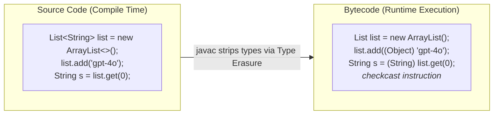
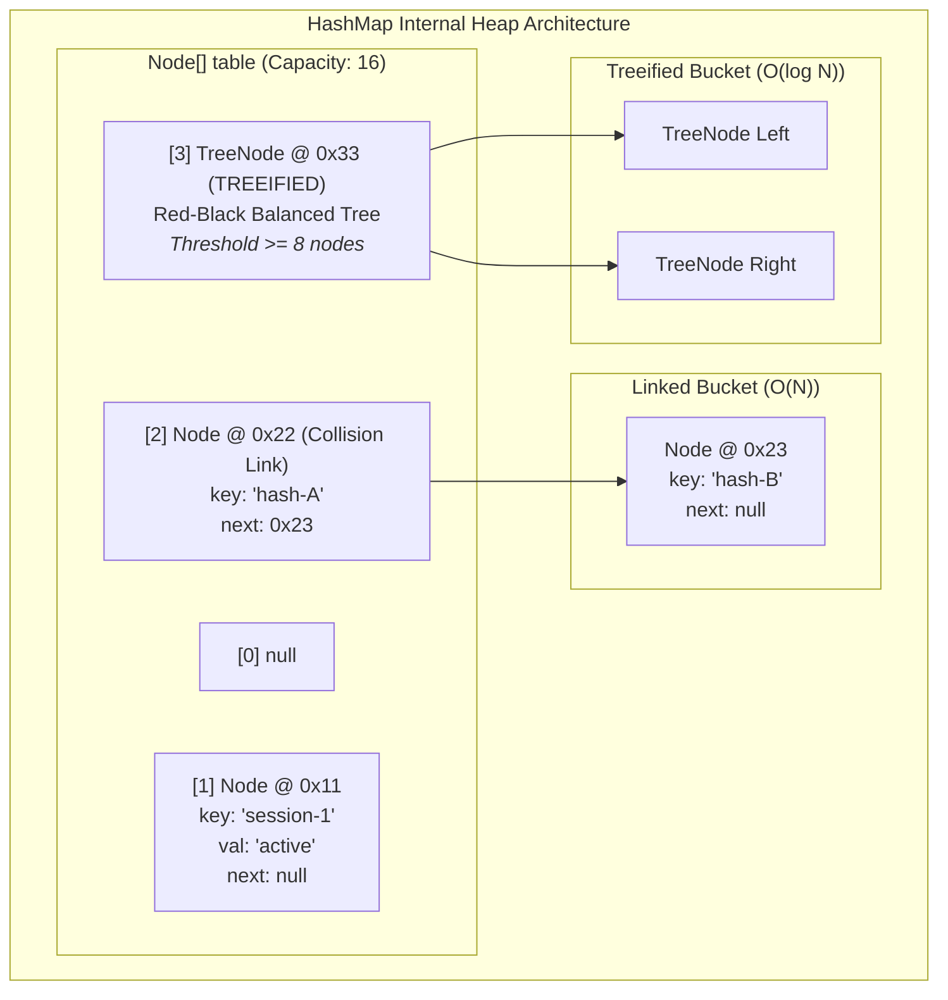
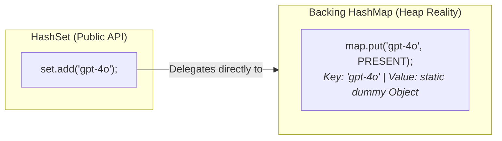

# Day_04 — Generics, Collections Framework, and Data Structures in Memory

| ⬅️ Previous Day | 📚 Course Hub | ➡️ Next Day |
|:---|:---:|---:|
| [← Day 03: Inheritance, Interfaces & Polymorphism](../Day_03_Inheritance_Interfaces_Polymorphism/Day_03_Inheritance_Interfaces_Polymorphism.md) | [All 60 Days Overview](../../README.md) | [Day 05: Modern Java: Records, Optional, Sealed →](../Day_05_Modern_Java_Records_Optional_Sealed/Day_05_Modern_Java_Records_Optional_Sealed.md) |

---

## 🎯 What You'll Understand By the End
- **The 4-Pillar Engineering Framework**: For every core data structure and generic concept, you will know:
  1. **What is it?** (Precise definition & physical JVM memory layout)
  2. **Why do we use it?** (Hardware realities, performance characteristics, and type safety)
  3. **What happens if we DON'T use it?** (Concrete anti-patterns, catastrophic runtime crashes, 800% memory bloat, and cache-miss stalls)
  4. **Primary Real-World Engineering Use Case** (Enterprise Spring Boot, RAG chunk deduplication, high-throughput caching, and Jackson serialization)
- How **Generics** enforce compile-time type boundaries and how **Type Erasure** erases types to `Object` or bounds in bytecode.
- Why generic primitive types (`List<int>`) do not exist in Java, and the physical memory tax of **auto-boxing** (`int` vs. `Integer` on the Heap).
- The byte-level memory contrast between **`ArrayList`** (contiguous array, CPU cache locality) and **`LinkedList`** (scattered node allocations, pointer chasing).
- The mathematical and structural internals of **`HashMap`**: the bucket array `Node<K,V>[]`, the hashing formula `(n - 1) & hash`, collision chaining, and treeification into **Red-Black Trees**.
- How **`HashSet`** is secretly backed by a `HashMap` using a static dummy object, and how `modCount` triggers `ConcurrentModificationException` during iteration.

---

## 🧭 The Mid-Level Engineer's Mental Model

Junior developers pick data structures by instinct: *"I need a list, so I'll write `new ArrayList<>()`; I need key-value pairs, so I'll write `new HashMap<>()`."*

Mid-level engineers evaluate **hardware interaction, allocation cost, and failure modes**:
- *"How does this layout affect the CPU's 64-byte L1 cache line?"*
- *"Will this structure trigger frequent Garbage Collector cycles due to pointer overhead?"*
- *"What is the mathematical cost of resizing and rehashing under heavy write load?"*

```
┌───────────────────────────────────────────────────────────────────────────────────┐
│                      THE 4-PILLAR DATA STRUCTURE EVALUATION FRAMEWORK             │
├───────────────────────┬───────────────────────────────────────────────────────────┤
│ 1. What is it?        │ Physical memory layout (Heap vs Stack, contiguous vs node)│
├───────────────────────┼───────────────────────────────────────────────────────────┤
│ 2. Why do we use it?  │ Asymptotic complexity ($O(1)$ vs $O(N)$) & cache locality │
├───────────────────────┼───────────────────────────────────────────────────────────┤
│ 3. What if we DON'T?  │ Catastrophic failure mode (OOM, ClassCastException, stalls)│
├───────────────────────┼───────────────────────────────────────────────────────────┤
│ 4. Primary Use Case   │ Real-world enterprise production pattern                  │
└───────────────────────┴───────────────────────────────────────────────────────────┘
```

---

## 🧠 The Problem This Solves: Pre-Generics Russian Roulette & Hardware Fallacies

Before Java 5 introduced Generics in 2004, collections stored raw, untyped `java.lang.Object` references:

### ❌ Problem 1: The "Mystery Box" Dilemma & Runtime Crashes
Without generic type boundaries, any object could be inserted into any collection without compiler complaints. Retrieving items required manual, fragile casting:

```java
// ANCIENT PRE-JAVA 5 CODE: Untyped raw collection
List messages = new ArrayList();
messages.add("User prompt: What is RAG?");
messages.add(404); // Accidental bug: Integer slipped in!

// Runtime disaster waiting to happen:
for (int i = 0; i < messages.size(); i++) {
    // Compiles with ZERO warnings!
    String msg = (String) messages.get(i); // CRASH on i=1! java.lang.ClassCastException
}
```
**Why this terrified enterprise teams**: This code compiles cleanly. The bug sits undetected in production until a specific user triggers the condition at 2:00 AM, crashing the service with a fatal `ClassCastException`.

### ❌ Problem 2: The "LinkedList is Faster for Insertions" Myth
Many university courses teach that `LinkedList` is superior to `ArrayList` because inserting into a linked list is theoretically $O(1)$, while `ArrayList` must shift elements ($O(N)$). 

In modern hardware reality:
- Each `LinkedList` element allocates a 24-byte `Node` object plus pointers, scattering memory across random Heap locations.
- Traversing a `LinkedList` causes the CPU to stall waiting for RAM on every single node (**CPU Cache Miss**).
- `ArrayList` uses contiguous memory. Reading index 0 automatically pre-fetches the next several elements into the ultra-fast L1 CPU cache line.
- In 99.9% of real-world enterprise benchmarks, `ArrayList` destroys `LinkedList` in throughput.

### ❌ Problem 3: Hash Collision Denial of Service (HashDoS)
In early Java versions, when multiple keys landed in the same `HashMap` bucket, they formed a linear linked list ($O(N)$ lookup). Malicious attackers exploited this by sending HTTP requests with thousands of query parameters engineered to have the exact same hash code. Web servers spent 100% of their CPU cycles traversing endless linked lists, crashing entirely. Java 8 solved this by introducing **Red-Black Treeification**.

---

# Section 1: Generics & Type Erasure in Memory

## 1.1 Compile-Time Type Boundaries (`<T>`, `<E>`, `<K,V>`)



### 1. What is it?
Generics allow types (classes and interfaces) to be parameterized over data types using angle brackets:
- `<T>`: Type (general placeholder)
- `<E>`: Element (used extensively in Collections)
- `<K, V>`: Key and Value (used in Maps)
- `<R>`: Return type (used in functions)

### 2. Why do we use it?
- **Compile-Time Type Safety**: Guarantees that only valid objects can enter a collection. If someone attempts to pass an `Integer` into a `List<String>`, `javac` fails the build immediately.
- **Elimination of Boilerplate Casting**: The compiler automatically handles casts, eliminating hundreds of manual `(String)` casts throughout your codebase.

### 3. What happens if we DON'T use it?
You are forced to use raw types (`List`, `Map`). You lose all compile-time safety and turn your application into a runtime Russian roulette where an incompatible object slipped into a list causes unpredictable `ClassCastException` failures in downstream microservices.

### 4. Primary Real-World Engineering Use Case
- **Universal API Response Containers**: Enterprise applications standardize responses using a generic wrapper:
  ```java
  public class ApiResponse<T> {
      private int statusCode;
      private String traceId;
      private T payload; // Can hold UserDto, OrderDto, or LlmCompletionDto!

      public ApiResponse(int statusCode, String traceId, T payload) {
          this.statusCode = statusCode;
          this.traceId = traceId;
          this.payload = payload;
      }
      public T getPayload() { return payload; }
  }
  ```
- Standard Spring types: `ResponseEntity<T>`, `Optional<T>`, `Page<T>`.

---

## 1.2 Bounded Type Parameters & The PECS Principle

### 1. What is it?
Restricting the allowed types that can fill a generic parameter using `extends` and `super`:
- **Upper Bound (`<T extends Number>`)**: `T` must be `Number` or a subclass of `Number` (e.g., `Integer`, `Double`).
- **PECS (Producer Extends, Consumer Super)**:
  - **Producer Extends (`? extends T`)**: Use when your method **reads** from the collection (the collection produces data for you).
  - **Consumer Super (`? super T`)**: Use when your method **writes** to the collection (the collection consumes data from you).

### 2. Why do we use it? (The Invariance Problem)
In Java, generic types are **invariant**: even though `Integer` is a subclass of `Number`, **`List<Integer>` is NOT a subclass of `List<Number>`!**

Why? If Java allowed `List<Number> numList = new ArrayList<Integer>();`, you could write `numList.add(3.14);` (adding a `Double` to what is physically an integer list), corrupting memory!

To make methods flexible enough to accept subtypes, Java uses wildcards:
```java
// Flexible method using Upper Bounded Wildcard (Producer Extends):
public static double calculateTotalTokens(List<? extends Number> tokenCounts) {
    double sum = 0.0;
    for (Number n : tokenCounts) { // Safe to READ as Number!
        sum += n.doubleValue();
    }
    // tokenCounts.add(100); // COMPILE ERROR! Cannot write, because we don't know the exact subtype!
    return sum;
}
```

### 3. What happens if we DON'T use PECS?
Your APIs become rigid and painful to use. A method declared as `processNumbers(List<Number> list)` will reject a `List<Integer>` or a `List<Double>`, forcing calling code to manually allocate a brand-new `List<Number>` and copy every element over just to satisfy the compiler.

### 4. Primary Real-World Engineering Use Case
- **`Collections.copy(List<? super T> dest, List<? extends T> src)`**: The classic JDK example. The source list is a **Producer** (we only read from it, so it uses `? extends T`). The destination list is a **Consumer** (we write into it, so it uses `? super T`).

---

## 1.3 Type Erasure Under the Hood

### 1. What is it?
Type Erasure is the compile-time mechanism where the Java compiler (`javac`) enforces all type checks and then **strips out all generic type parameters from the bytecode**:
- `<T>` is replaced by `java.lang.Object`.
- `<T extends Comparable<T>>` is replaced by `Comparable`.
- Wherever generic items are read, `javac` automatically inserts an explicit `checkcast` bytecode instruction.

```
Compile-Time Code:                             Bytecode Generated by javac:
List<String> list = new ArrayList<>();   ──►   List list = new ArrayList();
list.add("gpt-4o");                      ──►   list.add((Object) "gpt-4o");
String s = list.get(0);                  ──►   String s = (String) list.get(0);
```

### 2. Why did Java designers build it this way?
**100% Binary Backward Compatibility**. When Generics launched in 2004 (Java 5), billions of lines of pre-2004 Java bytecode were running in production worldwide. If Java had modified the JVM runtime to create distinct types (`ArrayList<String>.class` vs `ArrayList<Integer>.class`), all existing compiled libraries and JARs would have broken overnight. Type Erasure allowed new generic code to run seamlessly on the existing JVM.

### 3. What are the practical consequences / limitations of Type Erasure?
Because generic types do not exist at runtime:
1. **Cannot instantiate generic types**: `new T()` is illegal (the JVM doesn't know what class `T` is).
2. **Cannot check generic types at runtime**: `if (list instanceof List<String>)` is illegal. You can only check `if (list instanceof List<?>)`.
3. **Cannot create generic arrays**: `new T[10]` or `new List<String>[10]` is illegal.
4. **Static fields are shared**: A generic class `Box<T>` has only one static field variable shared across all `Box<String>` and `Box<Integer>` instances.

### 4. Primary Real-World Engineering Use Case
- **Jackson & Spring `TypeReference<T>` / `ParameterizedTypeReference<T>`**: When deserializing JSON (`{"model": "gpt-4o", "tokens": 1500}`) into a generic type like `List<AIResponse<String>>`, Jackson cannot use `List.class` because Type Erasure erased the inner type! Jackson uses an anonymous inner class (`new TypeReference<List<AIResponse<String>>>() {}`) to capture the generic signature from class metadata via reflection.

---

## 1.4 Why `List<int>` Cannot Exist: The Auto-Boxing Memory Tax

### 1. What is it?
Java collections store **Heap object reference pointers**. A primitive `int` is 4 bytes of raw binary data living on the Stack. It has no Object Header (no Mark Word, no Klass Word) and cannot be referenced by a 64-bit pointer.

To store primitives in collections, Java uses **Auto-Boxing**: the compiler automatically converts `int` into an `Integer` object on the Heap via `Integer.valueOf(val)`.

### 2. Why does this matter to an engineer? (The Memory Tax)

```
Primitive 'int' on Stack:
[ 4 bytes raw bits ]

Boxed 'Integer' Instance on Heap:
┌────────────────────────────────────────────────────────┐
│ OBJECT HEADER                                          │
│  - Mark Word (8 bytes: GC age, hashcode, locks)        │
│  - Klass Word (4 or 8 bytes: Pointer to Integer.class) │
├────────────────────────────────────────────────────────┤
│ PAYLOAD                                                │
│  - int value (4 bytes)                                 │
├────────────────────────────────────────────────────────┤
│ PADDING (4 bytes to round to multiple of 8)            │
└────────────────────────────────────────────────────────┘
Total: 24 bytes on Heap + 8 bytes reference pointer on Stack = 32 bytes!
```

### 3. What happens if we ignore it?
Storing numbers in boxed collections incurs an **800% memory overhead** (32 bytes per number instead of 4 bytes):
- **1,000,000 primitives in `int[]`**: Consumes **4 MB** of RAM.
- **1,000,000 numbers in `List<Integer>`**: Consumes **32 MB** of RAM!
- In high-throughput AI services or data pipelines, boxing millions of numbers floods the Young Generation Heap, triggering constant Garbage Collection pauses that cause massive latency spikes.

### 4. Primary Real-World Engineering Use Case
- **Vector Embeddings in GenAI**: LLM embeddings are floating-point vectors with 1536 dimensions (e.g. `text-embedding-3-small`). Storing 100,000 embeddings in `List<Float>` consumes hundreds of megabytes of garbage-collected Heap. Production vector databases and AI libraries use primitive arrays (`float[]` or direct off-heap native memory buffers) to store embeddings.

---

# Section 2: List Implementations & Hardware Memory Realities

```mermaid
flowchart TD
    subgraph ArrayListMem ["ArrayList in Heap Memory (Contiguous Array)"]
        AL_HDR["<b>ArrayList Object</b><br>size: 3<br>elementData: 0xARR"]
        subgraph BackingArray ["Object[] @ 0xARR (Contiguous Slots)"]
            SLOT0["[0] -> 0xP1 ('Hello')"]
            SLOT1["[1] -> 0xP2 ('AI')"]
            SLOT2["[2] -> 0xP3 ('World')"]
            SLOT3["[3] -> null (Spare capacity)"]
        end
        AL_HDR --> BackingArray
    end

    subgraph LinkedListMem ["LinkedList in Heap Memory (Scattered Pointer Nodes)"]
        LL_HDR["<b>LinkedList Object</b><br>first: 0xN1<br>last: 0xN3"]
        N1["<b>Node 1 @ 0xN1</b><br>prev: null<br>next: 0xN2<br>item: 0xP1 ('Hello')"]
        N2["<b>Node 2 @ 0xN2</b><br>prev: 0xN1<br>next: 0xN3<br>item: 0xP2 ('AI')"]
        N3["<b>Node 3 @ 0xN3</b><br>prev: 0xN2<br>next: null<br>item: 0xP3 ('World')"]
        
        LL_HDR --> N1
        N1 <--> N2
        N2 <--> N3
    end
```



## 2.1 `ArrayList`: Contiguous Memory & CPU Cache Locality

### 1. What is it?
`ArrayList` is a dynamically resizing list backed by a standard contiguous array: `transient Object[] elementData`.

### 2. Why do we use it?
1. **Instant $O(1)$ Random Access**: Retrieving an element by index requires simple memory math:
   $$\text{Address}(i) = \text{Base Address} + (i \times \text{Pointer Size})$$
2. **The Hardware Secret: CPU Cache Line Locality**:
   Modern CPUs do not fetch individual bytes from RAM; they fetch **64-byte chunks called Cache Lines** into ultra-fast L1/L2 caches.
   Because `ArrayList` pointers sit side-by-side in contiguous RAM, loading element `[0]` pulls elements `[1]` through `[7]` into the L1 CPU cache simultaneously. Iterating through an `ArrayList` runs at hardware speed because almost every read is an instant **Cache Hit**.

### 3. How does `ArrayList` grow?
When the internal array fills up:
$$\text{newCapacity} = \text{oldCapacity} + (\text{oldCapacity} \gg 1) \quad (\approx 1.5\times \text{ growth})$$
It allocates the new array and copies elements using `System.arraycopy()` (a blazing-fast native assembly block copy), discarding the old array for GC.

### 4. Primary Real-World Engineering Use Case
The absolute default list implementation for 99.9% of enterprise applications: REST DTO lists, database query results, and internal pipeline buffers.

---

## 2.2 `LinkedList`: Pointer Chasing & Memory Fragmentation

### 1. What is it?
A doubly-linked list where every single element is wrapped in a standalone `Node<E>` Heap object holding:
- 16-byte Object Header
- 8-byte `item` pointer
- 8-byte `next` pointer
- 8-byte `prev` pointer
- **Total Overhead: 40 bytes per single element!**

### 2. Why is `LinkedList` slow in practice? ("Pointer Chasing")
Because each `Node` is allocated individually over time, they are scattered randomly across Heap memory.
To reach element 500, the CPU must read Node 0, follow its pointer to Node 1, follow its pointer to Node 2...
Every pointer traversal jumps to an arbitrary RAM address, triggering a **CPU Cache Miss** and forcing the processor to stall for tens of nanoseconds while fetching data from slow main memory.

| Feature | `ArrayList` | `LinkedList` |
|:---|:---|:---|
| **Backing Structure** | Contiguous `Object[]` array. | Doubly-linked `Node` objects. |
| **Get by Index** | **$O(1)$** instant pointer arithmetic. | **$O(N)$** linear pointer traversal. |
| **Iteration Speed** | **Blazing fast** (64-byte CPU cache hits). | **Slow** (constant CPU cache misses). |
| **Memory Overhead** | Minimal (a few unused array slots). | **Massive** (40 bytes per node). |
| **Recommended Use** | **Default for 99.9% of applications.** | Almost never. Use `ArrayDeque` for queues! |

---

# Section 3: Map Internals & Collision Mechanics (`HashMap`)



## 3.1 The 3 Mathematical Steps of `map.put(key, value)`

### Step 1: Compute the Spread Hash Code
Java takes `key.hashCode()` and applies an XOR bit-shift function:
```java
static final int hash(Object key) {
    int h;
    return (key == null) ? 0 : (h = key.hashCode()) ^ (h >>> 16);
}
```
*Why this exists*: Table capacity is initially small (16). Without spreading, only the lowest 4 bits of the hash code would be used to choose the bucket, ignoring all high-order entropy and causing massive collision spikes.

### Step 2: Calculate the Bucket Index via Bitwise AND
Instead of an expensive arithmetic modulo (`hash % capacity`), Java computes the bucket index using a bitwise AND:
$$\text{Index} = (n - 1) \ \& \ \text{hash}$$
- Table capacity $n$ is **always a power of 2** (16, 32, 64, 128...).
- Subtracting 1 from a power of 2 turns all lower bits into `1`s (e.g., $16 - 1 = 15 = 00001111_2$).
- The bitwise `&` acts as an instantaneous modulo mask, executing in a single CPU cycle!

### Step 3: Collision Handling (Chaining $\rightarrow$ Red-Black Treeification)
- If the bucket is empty (`null`), a new `Node<K,V>` is placed in the slot.
- If an existing node is present (**Hash Collision**), Java links the new node into a singly linked list at that bucket.
- **Treeification**: If a single bucket accumulates **8 nodes** (`TREEIFY_THRESHOLD = 8`) and total capacity is at least 64, Java converts that linked list into a **Red-Black balanced Binary Search Tree** (`TreeNode<K,V>`).
  - Worst-case lookup drops from $O(N)$ to $O(\log N)$!
  - Protects servers against **HashDoS attacks**.

---

## 3.2 Load Factor, Capacity & The Cost of Rehashing

### 1. What is it?
- **Default Initial Capacity**: 16.
- **Default Load Factor**: `0.75`.
- **Threshold Formula**: $\text{Threshold} = \text{Capacity} \times \text{Load Factor}$
  For a default map: $16 \times 0.75 = 12$.

### 2. What is Rehashing?
When the 13th key is inserted:
1. `HashMap` allocates a new backing array on the Heap that is **double the size** ($16 \rightarrow 32$).
2. It iterates through every existing node and recalculates its bucket index in the new array (**Rehashing**).
3. The old array is abandoned for Garbage Collection.

### 3. What happens if we DON'T pre-size when inserting 100,000 items?
If you insert 100,000 items into a default `new HashMap<>()`:
- The map will resize and rehash **14 consecutive times** ($16 \rightarrow 32 \rightarrow 64 \rightarrow \dots \rightarrow 131,072$).
- Each resize freezes the thread, re-indexes thousands of nodes, and allocates huge temporary arrays, generating massive Garbage Collection churn.

### 4. The Engineering Solution: Pre-Sizing Formula
When you know you will store $N$ elements, size the map to prevent resizing:
$$\text{Initial Capacity} = \left\lceil \frac{N}{0.75} \right\rceil + 1$$
To store 1,000 items without a single resize: `new HashMap<>(1334)`.

---

# Section 4: Sets & Secondary Structures

## 4.1 `HashSet`: The Secret `HashMap` Wrapper



### 1. What is it?
A collection that guarantees element uniqueness.
> ⚠️ **The Under-the-Hood Reality**: `HashSet` has no unique storage engine. It is literally a thin wrapper around a private `HashMap`!

```java
public class HashSet<E> {
    private transient HashMap<E, Object> map;
    // Dummy value paired with every key:
    private static final Object PRESENT = new Object();

    public boolean add(E e) {
        return map.put(e, PRESENT) == null;
    }
    public boolean contains(Object o) {
        return map.containsKey(o);
    }
}
```

### 2. Why do we use it?
- Instant $O(1)$ uniqueness checks and deduplication without writing custom search logic.

### 3. Primary Real-World Engineering Use Case
- **Deduplicating Chunks in RAG Pipelines**: When retrieving relevant document passages across multiple vector indices, duplicates often appear. Wrapping raw passages in `new LinkedHashSet<>(chunks)` removes duplicates while preserving retrieval order.

---

## 4.2 Set Comparison: `HashSet` vs. `LinkedHashSet` vs. `TreeSet`

| Set Implementation | Backing Data Structure | Ordering Guarantee | Lookup Performance | Memory Footprint |
|:---|:---|:---|:---|:---|
| **`HashSet`** | Backed by `HashMap`. | **None** (unpredictable). | Average **$O(1)$**. | Moderate. |
| **`LinkedHashSet`** | Backed by `LinkedHashMap` (hash table + doubly-linked list through nodes). | **Insertion Order** preserved. | Average **$O(1)$**. | Higher (2 extra pointers per entry). |
| **`TreeSet`** | Backed by `TreeMap` (Red-Black balanced Binary Search Tree). | **Sorted Order** (natural or `Comparator`). | Guaranteed **$O(\log N)$**. | Moderate (tree node pointers). |

---

## 4.3 Iterators, `modCount` & `ConcurrentModificationException`

### 1. What is it?
An internal counter inside collections (`protected transient int modCount = 0;`) that increments on every structural modification (`add()`, `remove()`, `clear()`).

### 2. Why does it exist?
**Fail-Fast Safety**: If a collection is modified while an iterator is actively traversing it, continuing the loop could lead to data corruption, skipped elements, or infinite loops. The iterator compares its local `expectedModCount` against the collection's `modCount` on every step.

### 3. What happens if you mutate during a `for-each` loop?
```java
// LETHAL BUG: Crashes at runtime!
for (String model : activeModels) {
    if (model.startsWith("deprecated-")) {
        activeModels.remove(model); // CRASH! ConcurrentModificationException
    }
}
```

### 4. How to fix it in production:
```java
// Modern Java Clean Solution:
activeModels.removeIf(model -> model.startsWith("deprecated-")); // SAFE & FAST
```

---

# Section 5: Mutable Keys in Maps (The Silent Memory Leak)

What happens if you use a mutable object as a `HashMap` key and alter its fields after insertion?

```java
public class UserSession {
    public String sessionId;
    public UserSession(String id) { this.sessionId = id; }
    
    @Override
    public boolean equals(Object o) {
        return (o instanceof UserSession u) && Objects.equals(sessionId, u.sessionId);
    }
    @Override
    public int hashCode() { return Objects.hash(sessionId); }
}

// In main():
Map<UserSession, String> sessionMap = new HashMap<>();
UserSession user = new UserSession("sess-100");

sessionMap.put(user, "Active Data"); // Calculated hash -> placed in Bucket #4

// CATASTROPHIC MUTATION:
user.sessionId = "sess-200"; // Hashcode changes!

// Now try to retrieve it:
String data = sessionMap.get(user);
System.out.println(data); // PRINTS NULL!
```

### Why this is a Silent Memory Leak:
1. `sessionMap.put()` used the hash of `"sess-100"` to place the entry into **Bucket #4**.
2. When `user.sessionId` was mutated to `"sess-200"`, its hashcode changed.
3. `sessionMap.get(user)` computes the new hashcode and looks in **Bucket #11**.
4. It finds nothing in Bucket #11 and returns `null`!
5. **The object is permanently trapped in Bucket #4**. You cannot retrieve it, and you cannot remove it. Over time, millions of orphaned entries accumulate in memory, causing an eventual **`OutOfMemoryError`**!

> 🚨 **Mandatory Engineering Law**: **Never use mutable objects as Map keys.** Always use immutable types like `java.lang.String`, `java.util.UUID`, or Java 16+ `record`.

---

# Section 6: Specialized Data Structures for Modern AI Engineering

## 6.1 `PriorityQueue` (Min-Heap / Max-Heap for Top-K Selection)
In Generative AI and Retrieval-Augmented Generation (RAG), search queries return hundreds of potential document chunks with similarity scores between `0.0` and `1.0`. You only want the **Top-K most relevant chunks** (e.g. Top 3).

Instead of sorting the entire list of 10,000 candidates ($O(N \log N)$), maintain a **Min-Heap `PriorityQueue` of size K** ($O(N \log K)$):

```java
// Top-K Selection: Keeps memory and execution bounded!
int k = 3;
PriorityQueue<ScoredChunk> minHeap = new PriorityQueue<>(k, Comparator.comparingDouble(ScoredChunk::similarityScore));

for (ScoredChunk candidate : allCandidates) {
    if (minHeap.size() < k) {
        minHeap.offer(candidate);
    } else if (candidate.similarityScore() > minHeap.peek().similarityScore()) {
        minHeap.poll(); // Evicts the lowest score in the top K
        minHeap.offer(candidate);
    }
}
```

---

## 6.2 `ArrayDeque`: The Modern Replacement for `Stack` and `LinkedList`
- `java.util.Stack` is an obsolete class from Java 1.0 that synchronizes every method, creating massive thread contention.
- `LinkedList` wastes 40 bytes per node.
- **`ArrayDeque`** is a high-performance, double-ended queue backed by a circular array. It has zero synchronization locks, zero node allocations, and runs circles around `Stack` and `LinkedList`.

---

# Section 7: Complete Code Walkthrough: Tracing Collections in Memory

Below is the verified code from [`CollectionsMemoryDemo.java`](file:///c:/Users/sriva/OneDrive/Desktop/GEN%20AI%20COURSE/JAVA/Phase_01_Java_Foundations/Day_04_Generics_Collections_DataStructures/code/CollectionsMemoryDemo.java) tracing boxing tax, contiguous allocation, and safe mutations:

```java
package com.genai.foundations.day04;

import java.util.*;

public class CollectionsMemoryDemo {

    public static void main(String[] args) {
        System.out.println("==================================================");
        System.out.println("   DAY 04: GENERICS & COLLECTIONS MEMORY TRACE    ");
        System.out.println("==================================================");

        // 1. Boxing Overhead Demonstration
        int primitiveTokens = 4096; // 4 bytes raw bits on Stack
        Integer boxedTokens = Integer.valueOf(4096); // 24 bytes on Heap + 8-byte pointer!
        System.out.println("1. Boxing Demonstration:");
        System.out.println("   Primitive on Stack: " + primitiveTokens + " (4 bytes)");
        System.out.println("   Boxed on Heap     : " + boxedTokens + " (24 bytes + 8-byte pointer)");
        System.out.println();

        // 2. ArrayList contiguous backing array allocation
        List<String> modelList = new ArrayList<>(4); // Allocates Object[4] on Heap
        modelList.add("gpt-4o");
        modelList.add("claude-3-5-sonnet");
        modelList.add("gemini-1-5-pro");

        System.out.println("2. ArrayList (Contiguous Memory):");
        System.out.println("   Elements: " + modelList);
        System.out.println("   Size    : " + modelList.size());
        System.out.println();

        // 3. HashMap bucket hashing and insertion
        Map<String, Integer> tokenUsageMap = new HashMap<>(16);
        tokenUsageMap.put("gpt-4o", 1500);
        tokenUsageMap.put("claude-3-5-sonnet", 2200);

        System.out.println("3. HashMap (Bucket Table Allocation):");
        System.out.println("   Size                  : " + tokenUsageMap.size());
        System.out.println("   Lookup 'gpt-4o'       : " + tokenUsageMap.get("gpt-4o") + " tokens");
        System.out.println("   Contains 'claude-...' : " + tokenUsageMap.containsKey("claude-3-5-sonnet"));
        System.out.println();

        // 4. Safe modification using removeIf (modCount safe)
        modelList.removeIf(m -> m.contains("gemini"));
        System.out.println("4. ArrayList After Safe removeIf:");
        System.out.println("   Updated List: " + modelList);
        System.out.println("==================================================");
    }
}
```

### Physical Memory Allocation Trace Table

| Operation | Memory Area | What Physically Happens in RAM |
|:---|:---|:---|
| `int primitiveTokens = 4096;` | **Stack (`main` frame)** | Slot `1` holds 4 bytes of raw binary integer `4096`. Zero Heap overhead. |
| `Integer.valueOf(4096)` | **Heap Space** | Allocates 24-byte `Integer` object at address `0x09AA` (Mark Word + Klass Word + int payload + padding). Stack slot holds pointer `0x09AA`. |
| `new ArrayList<>(4)` | **Heap Space** | Allocates `ArrayList` header (24 bytes) pointing to an internal `Object[4]` array (32 bytes) at address `0x11FF`. |
| `modelList.add("gpt-4o")` | **Heap Space** | Array index `[0]` at address `0x11FF` receives 64-bit reference pointer pointing to string `"gpt-4o"` in the constant pool. |
| `new HashMap<>(16)` | **Heap Space** | Allocates `HashMap` instance pointing to a `Node<K,V>[16]` array. All 16 slots initialized to `null`. |
| `tokenUsageMap.put("gpt-4o", 1500)` | **Heap Space** | 1. Computes `hash("gpt-4o")`.<br>2. Calculates `index = (16 - 1) & hash`.<br>3. Allocates a 32-byte `Node<K,V>` object holding key pointer, boxed value pointer, and `next = null`. |

---

# Section 8: Mid-Level Engineering Master Cheat Sheet

| Concept | What is it? | Why do we use it? | What happens if we DON'T use it? | Primary Real-World Use Case |
|:---|:---|:---|:---|:---|
| **Generics (`<T>`)** | Compile-time parameterized type boundaries. | Eliminates manual casting; guarantees compile-time safety. | Raw type `ClassCastException` runtime crashes in production. | `ResponseEntity<T>`, `Optional<T>`, `Page<T>`. |
| **PECS Rule** | Producer Extends, Consumer Super wildcard bounds. | Overcomes type invariance (`List<Integer>` is not `List<Number>`). | Inflexible APIs rejecting compatible subtypes, forcing useless object copying. | `Collections.copy()`, streaming reductions. |
| **Type Erasure** | Stripping `<T>` from bytecode during compilation. | 100% backward compatibility with pre-Java 5 legacy bytecode. | Limitations: Cannot do `new T()`, cannot do `instanceof List<String>`. | Jackson `TypeReference<T>` to capture generic type tokens via reflection. |
| **Auto-Boxing** | Converting primitive `int` to Heap `Integer`. | Required because collections store object reference pointers. | 800% memory overhead (32 bytes vs 4 bytes), triggering GC latency spikes. | Using primitive arrays (`float[]`) for vector embeddings in GenAI. |
| **`ArrayList`** | Contiguous `Object[]` array list. | $O(1)$ random access + CPU 64-byte Cache Line prefetching. | Using linked structures stalls CPU waiting on RAM cache misses. | Default list for 99.9% of enterprise microservice code. |
| **`LinkedList`** | Doubly-linked `Node` chain scattered on Heap. | Theoretical $O(1)$ head/tail pointer mutations. | 40 bytes overhead per node + constant CPU cache miss stalls. | Avoid in modern Java; use `ArrayDeque` instead. |
| **`HashMap`** | Array of buckets with bitwise indexing `(n-1) & hash`. | Instant $O(1)$ average key-value lookups. | Linear searches ($O(N)$) destroying backend performance. | Spring Bean Registry, database query caches. |
| **Treeification** | Converting collided bucket to Red-Black Tree at 8 nodes. | Drops worst-case lookup from $O(N)$ down to $O(\log N)$. | Vulnerability to HashDoS attacks where collided keys freeze server CPU. | Enterprise server protection against maliciously crafted payloads. |
| **Pre-Sizing Maps** | Allocating capacity $\lceil N / 0.75 \rceil + 1$ upfront. | Prevents repetitive array allocations and full-table rehashing. | Inserting 100K items triggers 14 resizes, causing GC pressure and latency spikes. | High-throughput batch ingestion and ETL pipelines. |
| **`HashSet`** | Set backed internally by a `HashMap` + dummy `PRESENT`. | Provides instant $O(1)$ uniqueness checks. | Writing manual nested loops to deduplicate elements ($O(N^2)$). | Deduplicating retrieved passages in RAG pipelines. |
| **`modCount`** | Internal structural mutation counter in collections. | Detects concurrent modifications to prevent memory corruption. | Mutating during `for-each` crashes with `ConcurrentModificationException`. | Safe deletion using `collection.removeIf()`. |
| **Immutable Map Keys** | Keys whose fields cannot change after insertion. | Ensures hashcode and bucket index remain identical over time. | Key mutation traps object in wrong bucket forever (silent memory leak). | Using `String`, `UUID`, or Java 16+ `record` as map keys. |

---

# Section 9: Common Beginner Mistakes & Production Anti-Patterns

### 1. Choosing `LinkedList` for "Faster Insertions"
❌ **Wrong Way**:
```java
List<AiMessage> messages = new LinkedList<>(); // 40 bytes overhead per node + cache misses!
```
✅ **Right Way**:
```java
List<AiMessage> messages = new ArrayList<>(); // Contiguous memory + hardware cache friendly!
```
*Why it is wrong*: Modern hardware is optimized for contiguous cache-line memory. `LinkedList` causes pointer chasing and cache misses, losing to `ArrayList` in almost all real benchmarks.

---

### 2. Modifying Collections Inside a For-Each Loop
❌ **Wrong Way**:
```java
for (String token : promptTokens) {
    if (token.isBlank()) {
        promptTokens.remove(token); // CRASH! ConcurrentModificationException
    }
}
```
✅ **Right Way**:
```java
promptTokens.removeIf(String::isBlank); // Safe, clean, and avoids modCount desync!
```

---

### 3. Using Mutable Objects as Map Keys
❌ **Wrong Way**:
```java
public class UserSession { public String id; } // MUTABLE field!
Map<UserSession, String> map = new HashMap<>();
UserSession s = new UserSession();
s.id = "1";
map.put(s, "data");
s.id = "2"; // MUTATION! Hashcode changes!
map.get(s); // RETURNS NULL! Object permanently lost in wrong bucket!
```
✅ **Right Way**: Always use immutable keys (e.g. `String`, `UUID`, or Java 16+ `record`).

---

### 4. Un-Sized Collection Bloat in Large Batches
❌ **Wrong Way**:
```java
Map<String, UserData> map = new HashMap<>(); // Default capacity: 16!
for (int i = 0; i < 100_000; i++) {
    map.put(fetchKey(i), fetchData(i)); // Triggers 14 expensive rehashes!
}
```
✅ **Right Way**:
```java
Map<String, UserData> map = new HashMap<>(133_334); // Sized upfront! ZERO rehashes!
```

---

# Section 10: Best Practices & Design Principles

1. **Default to `ArrayList` and `HashMap`**: Unless you have proven mathematical constraints, these two structures satisfy 95% of software needs with optimal CPU cache performance.
2. **Pre-Size When Size is Known**: If reading a dataset of known count, initialize your list or map with that capacity.
3. **Always Follow the PECS Rule**: Use `? extends T` when reading; use `? super T` when writing.
4. **Use Primitive Arrays for Massive Numbers**: If handling millions of floats or ints (e.g., AI embeddings), bypass `List<Float>` and use primitive `float[]` to avoid 800% memory bloat.

---

## 📝 Quick Recap
- **Generics**: Enforce compile-time type boundaries; **Type Erasure** removes types at runtime for backward compatibility.
- **Auto-Boxing**: `List<int>` cannot exist; boxing `int` into `Integer` expands memory by 8x on the Heap.
- **`ArrayList`**: Backed by a contiguous array, maximizing CPU 64-byte cache-line prefetching.
- **`HashMap`**: Uses bitwise AND `(n - 1) & hash` for $O(1)$ indexing; converts collided buckets to Red-Black trees at 8 nodes to prevent HashDoS.
- **`HashSet`**: A thin wrapper around a private `HashMap` pairing elements with a dummy object `PRESENT`.
- **Iteration**: Direct mutations desynchronize `modCount`, throwing `ConcurrentModificationException`. Use `removeIf()`.
- **Map Keys**: Must be immutable to prevent permanent bucket desynchronization and silent memory leaks.

---

## 🧪 Try It Yourself: Hands-On Engineering Challenges

1. **Measure Boxing Memory Expansion**: Write a test comparing the memory footprint of an `int[1_000_000]` array versus an `ArrayList<Integer>` with 1,000,000 elements. Use `Runtime.getRuntime().totalMemory() - Runtime.getRuntime().freeMemory()` before and after to observe the 8x memory surge.
2. **Trigger Treeification**: Create a class `CollidingKey` whose `hashCode()` always returns `42`. Insert 10 instances into a `HashMap`. Using a debugger, inspect the `table` bucket array and watch the bucket convert from a `Node` into a `TreeNode`.
3. **Simulate the Mutable Key Leak**: Run the mutable key code sample in Section 5. Observe how mutating the field causes `map.get()` to return `null`, while `map.size()` remains `1`!
