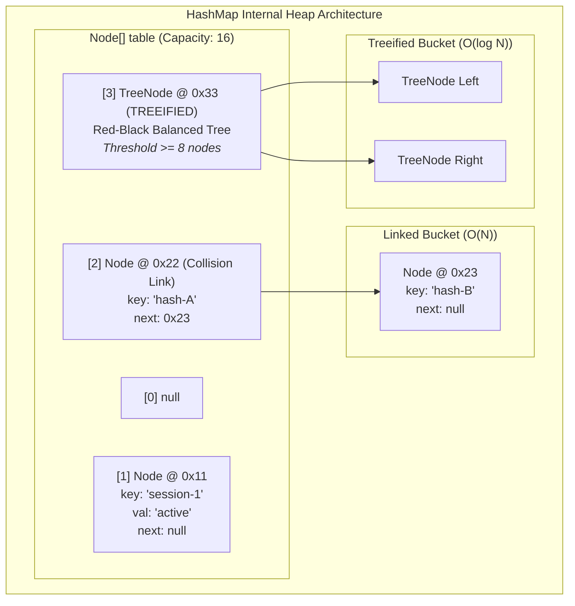
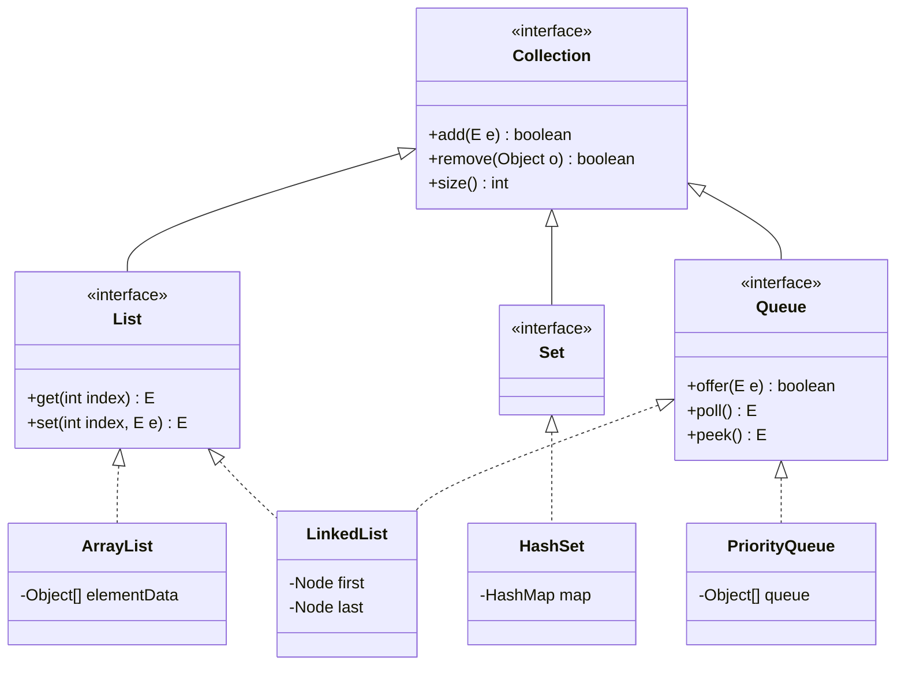

```mermaid
flowchart TD
    subgraph ArrayListMem ["ArrayList in Heap Memory (Contiguous Array)"]
        AL_HDR["<b>ArrayList Object</b><br>size: 3<br>elementData: 0xARR"]
        subgraph BackingArray ["Object[] @ 0xARR (Contiguous Slots)"]
            SLOT0["[0] -> 0xP1 ('Hello')"]
            SLOT1["[1] -> 0xP2 ('AI')"]
            SLOT2["[2] -> 0xP3 ('World')"]
            SLOT3["[3] -> null (Spare capacity)"]
        end
        AL_HDR --> BackingArray
    end

    subgraph LinkedListMem ["LinkedList in Heap Memory (Scattered Pointer Nodes)"]
        LL_HDR["<b>LinkedList Object</b><br>first: 0xN1<br>last: 0xN3"]
        N1["<b>Node 1 @ 0xN1</b><br>prev: null<br>next: 0xN2<br>item: 0xP1 ('Hello')"]
        N2["<b>Node 2 @ 0xN2</b><br>prev: 0xN1<br>next: 0xN3<br>item: 0xP2 ('AI')"]
        N3["<b>Node 3 @ 0xN3</b><br>prev: 0xN2<br>next: null<br>item: 0xP3 ('World')"]
        
        LL_HDR --> N1
        N1 <--> N2
        N2 <--> N3
    end
```

# Phase_01, Day_04 — Generics, Collections Framework, and Data Structures in Memory

| ⬅️ Previous Day | 📚 Course Hub | ➡️ Next Day |
|:---|:---:|---:|
| [← Day 03: Inheritance, Interfaces & Polymorphism](../Day_03_Inheritance_Interfaces_Polymorphism/Day_03_Inheritance_Interfaces_Polymorphism.md) | [Course Hub](../../README.md) | [Day 05: Modern Java: Records, Optional, Sealed →](../Day_05_Modern_Java_Records_Optional_Sealed/Day_05_Modern_Java_Records_Optional_Sealed.md) |

---

## 🎯 What You'll Understand By the End

- How **Generics (`<T>`)** enforce compile-time type boundaries, and how **Type Erasure** removes generic types during compilation to preserve backward compatibility.
- Why generic types are **invariant** by default, and how the **PECS Rule (Producer Extends, Consumer Super)** solves variance when reading from or writing to collections.
- Why primitive collections like `List<int>` cannot exist in Java, and the physical memory tax of **auto-boxing** (`int` vs. `Integer` on the Heap—an 800% memory penalty).
- The hardware-level memory contrast between **`ArrayList`** (contiguous memory, 64-byte CPU cache line prefetching) and **`LinkedList`** (scattered Heap nodes, CPU cache-miss stalls).
- The mathematical mechanics of **`HashMap`**: the bitwise index formula `(n - 1) & hash`, load factors, the severe cost of resizing/rehashing, and how to pre-size maps upfront.
- How `HashMap` handles collisions via linked chaining and automatically treeifies buckets into **Red-Black balanced trees** at 8 elements to defend against HashDoS attacks.
- How **`HashSet`** is secretly implemented as a thin wrapper around a `HashMap` using a shared dummy object, and how `modCount` detects concurrent mutations during iteration.
- Why using **mutable objects as Map keys** creates catastrophic, silent memory leaks in production.
- How to apply specialized structures like **`PriorityQueue` (Min-Heap)** for bounded Top-K similarity search in Generative AI / RAG pipelines.

---

## 🧠 The Problem This Solves / Why This Comes Up

Before Java 5 introduced Generics in 2004, collections stored raw, untyped `java.lang.Object` references. This caused three chronic software engineering failures:

### 1. The Pre-Generics "Mystery Box" & Runtime Crashes
In legacy Java, any object could be put into any collection. The compiler was completely blind to what was inside:

```java
// PRE-JAVA 5 CODE: Untyped raw collection
List messages = new ArrayList();
messages.add("User prompt: What is RAG?");
messages.add(404); // Accidental bug: An Integer slipped in!

// Runtime disaster waiting to happen:
for (int i = 0; i < messages.size(); i++) {
    // Compiles with ZERO warnings!
    String msg = (String) messages.get(i); // CRASH on i=1! java.lang.ClassCastException
}
```

This code compiled cleanly. The bug lay dormant until a specific user triggered it at 2:00 AM, crashing the production service with a fatal `ClassCastException`.

### 2. The "LinkedList is Faster" Fallacy
For decades, textbooks taught that `LinkedList` is superior to `ArrayList` because inserting elements is $O(1)$ compared to shifting array slots.
In modern CPU hardware reality, this is flatly wrong:
- Each `LinkedList` element allocates a separate 24-byte `Node` object scattered across random locations in RAM.
- Traversing a `LinkedList` forces the CPU to stall waiting for RAM on every single node jump (**CPU Cache Miss**).
- `ArrayList` stores elements contiguously. Loading one element automatically pulls the next several elements into the ultra-fast L1 CPU cache line.
- In 99% of real-world benchmarks, `ArrayList` destroys `LinkedList` in both speed and memory efficiency.

### 3. Hash Collision Denial of Service (HashDoS)
In early Java versions, when multiple keys hashed to the same bucket, they formed a linear linked list ($O(N)$ lookup). Attackers exploited this by sending HTTP requests with thousands of query parameters crafted to have the exact same hash code. Web servers spent 100% of their CPU cycles traversing endless linked lists, freezing the entire application. Java 8 solved this through **Treeification**.

---

# Section 1: Generics & Type Erasure in Memory

---

## 📖 Compile-Time Type Boundaries & Type Erasure

Generics allow classes, interfaces, and methods to operate on typed parameters specified in angle brackets:
- `<T>`: Type (general placeholder)
- `<E>`: Element (used across Collections)
- `<K, V>`: Key and Value (used in Maps)

```java
List<String> promptList = new ArrayList<>();
promptList.add("Summarize this document");
// promptList.add(100); // COMPILE ERROR! javac prevents invalid data from entering!
```

### How Type Erasure Works in Bytecode
Java did not redesign the JVM runtime when Generics were introduced in Java 5. To ensure **100% backward compatibility** with billions of lines of existing legacy bytecode, Java uses **Type Erasure**:
1. During compilation, `javac` inspects all generic types to guarantee strict type safety.
2. Once validated, the compiler **erases** all generic type parameters from the bytecode:
   - `<T>` is erased to `java.lang.Object`.
   - `<T extends Number>` is erased to `Number`.
3. Wherever data is retrieved from a generic collection, `javac` automatically inserts an explicit `checkcast` bytecode instruction:

```
Source Code (What You Write):                   Bytecode Emitted by javac:
List<String> list = new ArrayList<>();   ──►   List list = new ArrayList();
list.add("gpt-4o");                      ──►   list.add((Object) "gpt-4o");
String s = list.get(0);                  ──►   String s = (String) list.get(0);
```

### Practical Limitations Caused by Type Erasure
Because generic type information is erased at runtime:
1. **Cannot instantiate generic types**: `new T()` is illegal (the runtime does not know what concrete class `T` is).
2. **Cannot check generic types with `instanceof`**: `if (list instanceof List<String>)` is illegal. You can only check raw or wildcard types: `if (list instanceof List<?>)`.
3. **Cannot create generic arrays**: `new T[10]` or `new List<String>[10]` is illegal.
4. **Static variables are shared**: In `class Storage<T> { static int count; }`, `Storage<String>.count` and `Storage<Integer>.count` share the exact same static memory variable in Metaspace.

---

## 📖 Bounded Wildcards & The PECS Rule

In Java, generic types are **invariant**: even though `Integer` extends `Number`, **`List<Integer>` is NOT a subtype of `List<Number>`!**

Why? If Java allowed `List<Number> nums = new ArrayList<Integer>();`, you could write `nums.add(3.14);` (inserting a `Double` into what is physically an integer list), corrupting memory!

To build flexible APIs that accept subtypes safely, Java provides wildcards (`?`) guided by the **PECS Rule**:

> 💡 **The PECS Rule**: **Producer Extends, Consumer Super**
> - **Producer Extends (`? extends T`)**: Use when your method **reads** from the collection (the collection *produces* data for you).
> - **Consumer Super (`? super T`)**: Use when your method **writes** to the collection (the collection *consumes* data from you).

```java
// Producer Extends: We only READ from the list as Number
public static double calculateTokenSum(List<? extends Number> tokens) {
    double total = 0.0;
    for (Number n : tokens) { // Safe to read!
        total += n.doubleValue();
    }
    // tokens.add(10); // COMPILE ERROR! Cannot write, because we don't know the exact subtype!
    return total;
}

// Consumer Super: We WRITE elements into the destination list
public static void addDefaultTokens(List<? super Integer> destination) {
    destination.add(4096); // Safe to write an Integer!
    // Integer val = destination.get(0); // COMPILE ERROR! Can only read as Object!
}
```

---

# Section 2: The Auto-Boxing Memory Tax

---

## 🔬 Why `List<int>` Cannot Exist in Java

Java collections can only store **object reference pointers** on the Heap. A primitive `int` is 4 bytes of raw binary data living on the Stack. It has no Object Header (no Mark Word, no Klass Word) and cannot be referenced by a memory pointer.

To store primitives in collections, Java uses **Auto-Boxing**: the compiler automatically converts `int` into an `Integer` object on the Heap via `Integer.valueOf(val)`.

### The 800% Memory Penalty
Look at the physical RAM footprint of storing numbers:

```
Primitive 'int' on Stack:
[ 4 bytes raw bits ]

Boxed 'Integer' Instance on Heap:
┌────────────────────────────────────────────────────────┐
│ OBJECT HEADER                                          │
│  - Mark Word (8 bytes: GC age, hashcode, locks)        │
│  - Klass Word (4 or 8 bytes: Pointer to Integer.class) │
├────────────────────────────────────────────────────────┤
│ PAYLOAD                                                │
│  - int value (4 bytes)                                 │
├────────────────────────────────────────────────────────┤
│ PADDING (4 bytes to round to multiple of 8)            │
└────────────────────────────────────────────────────────┘
Total: 24 bytes on Heap + 8 bytes reference pointer on Stack = 32 bytes!
```

- **1,000,000 primitive ints in an array (`int[]`)**: Consumes **~4 MB** of RAM.
- **1,000,000 boxed Integers in a `List<Integer>`**: Consumes **~32 MB** of RAM!

> 🧠 **The GenAI Vector Angle**: Vector embeddings in AI (like OpenAI's `text-embedding-3-small`) consist of 1,536 floating-point numbers. Storing 100,000 embeddings in `List<Float>` wastes gigabytes of Heap memory and triggers constant Garbage Collector pauses. Production AI libraries always store embeddings in **primitive arrays (`float[]`)** or off-heap native memory buffers.

---

# Section 3: List Internals: `ArrayList` vs. `LinkedList`

---

## 🔬 Hardware Reality: Contiguous Memory & CPU Cache Locality



### 1. `ArrayList` (The Default Choice)
- Backed by an internal array: `transient Object[] elementData`.
- **Instant $O(1)$ Random Access**: Calculating the memory address of index $i$ is simple pointer math:
  $$\text{Address}(i) = \text{Base Address} + (i \times \text{Pointer Size})$$
- **64-Byte CPU Cache Line Prefetching**: Modern CPUs do not fetch individual bytes from RAM; they fetch **64-byte Cache Lines** into ultra-fast L1/L2 caches. Because array elements sit side-by-side in memory, reading element `[0]` automatically loads elements `[1]` through `[7]` into the L1 cache simultaneously!
- **Growth Formula**: When the internal array fills up, it expands by 50%:
  $$\text{newCapacity} = \text{oldCapacity} + (\text{oldCapacity} \gg 1) \quad (\approx 1.5\times)$$
  It allocates the new array and executes a blazing-fast native assembly block copy (`System.arraycopy()`).

### 2. `LinkedList` (The Performance Trap)
- A doubly-linked list where every element is wrapped in a standalone `Node<E>` Heap object.
- **Node Overhead**: 16-byte Object Header + 8-byte item pointer + 8-byte next pointer + 8-byte prev pointer = **40 bytes of memory overhead per element!**
- **Pointer Chasing & Cache Misses**: Because nodes are allocated individually over time, they are scattered randomly across the Heap. To reach index 500, the CPU must follow 500 pointer hops. Every hop jumps to an arbitrary RAM address, triggering a **CPU Cache Miss** and forcing the CPU to stall for tens of nanoseconds.

| Feature | `ArrayList` | `LinkedList` |
|:---|:---|:---|
| **Backing Structure** | Contiguous `Object[]` array | Doubly-linked `Node` objects on Heap |
| **Get by Index** | **$O(1)$** instant pointer arithmetic | **$O(N)$** linear pointer traversal |
| **Iteration Speed** | **Blazing fast** (CPU cache hits) | **Slow** (constant CPU cache misses) |
| **Memory Overhead** | Minimal (a few unused trailing array slots) | **Massive** (40 bytes per node) |
| **Production Advice** | **Default for 99.9% of application code** | **Avoid.** Use `ArrayDeque` for queues! |

---

# Section 4: Map Internals & Collision Mechanics (`HashMap`)

---

## 📖 The 3 Internal Steps of `map.put(key, value)`

`HashMap` is a hash table backed by an array of bucket nodes: `transient Node<K,V>[] table`.



### Step 1: Compute the Spread Hash Code
Java takes `key.hashCode()` and applies an XOR bit-shift operation:
```java
static final int hash(Object key) {
    int h;
    return (key == null) ? 0 : (h = key.hashCode()) ^ (h >>> 16);
}
```
*Why this exists*: Initial table capacity is 16. Without this spread step, only the lowest 4 bits of the hash code would be used to pick a bucket, ignoring the higher bits and causing massive collision spikes.

### Step 2: Calculate the Bucket Index via Bitwise AND
Instead of an expensive arithmetic modulo division (`hash % capacity`), Java calculates the bucket index using a single-cycle bitwise AND:
$$\text{Index} = (n - 1) \ \& \ \text{hash}$$
- Table capacity $n$ is **always a power of 2** (16, 32, 64, 128...).
- Subtracting 1 from a power of 2 turns all lower bits into `1`s (e.g., $16 - 1 = 15 = 00001111_2$).
- The bitwise `&` acts as an instantaneous modulo mask executing in a single CPU cycle!

### Step 3: Collision Handling (Chaining $\rightarrow$ Red-Black Treeification)
- If the bucket is empty (`null`), a new `Node<K,V>` is placed in the slot.
- If a node already occupies the bucket (**Hash Collision**), Java links the new node into a singly linked list at that bucket.
- **Treeification (Java 8+)**: If any single bucket accumulates **8 nodes** (`TREEIFY_THRESHOLD = 8`) and total capacity is at least 64, Java converts that linked list into a **Red-Black balanced Binary Search Tree** (`TreeNode<K,V>`).
  - Worst-case lookup drops from $O(N)$ down to $O(\log N)$!
  - This protects servers against HashDoS attacks.

---

## ⚡ Load Factor, Capacity & The Cost of Rehashing

- **Default Initial Capacity**: 16 buckets.
- **Default Load Factor**: `0.75`.
- **Resize Threshold**: $\text{Threshold} = \text{Capacity} \times \text{Load Factor} \quad (16 \times 0.75 = 12)$.

### What is Rehashing?
When the 13th entry is added to a default map:
1. `HashMap` allocates a new backing array on the Heap that is **double the size** ($16 \rightarrow 32$).
2. It iterates through every existing node and recalculates its bucket index in the new array (**Rehashing**).
3. The old array is abandoned for Garbage Collection.

### The Pre-Sizing Formula
If you insert 100,000 items into a default `new HashMap<>()`, it will resize and rehash **14 consecutive times** ($16 \rightarrow 32 \rightarrow 64 \rightarrow \dots \rightarrow 131,072$), causing severe CPU freezes and GC churn.

To prevent resizes, pre-size the map upfront using this formula:
$$\text{Initial Capacity} = \left\lceil \frac{N}{0.75} \right\rceil + 1$$
For 1,000 items: `new HashMap<>(1334)`.

---

# Section 5: Sets, Iterators, and Memory Traps

---

## 📖 `HashSet`: The Secret `HashMap` Wrapper

A `HashSet` guarantees element uniqueness. Under the hood, **`HashSet` has no unique storage engine of its own**. It is literally a thin wrapper around an internal `HashMap`!

```java
public class HashSet<E> {
    private transient HashMap<E, Object> map;
    // Dummy value paired with every key in the map:
    private static final Object PRESENT = new Object();

    public boolean add(E e) {
        return map.put(e, PRESENT) == null;
    }
    public boolean contains(Object o) {
        return map.containsKey(o);
    }
}
```
Every time you call `set.add("item")`, the set calls `map.put("item", PRESENT)`. Uniqueness is guaranteed by `HashMap`'s key collision rules.

---

## ⚠️ The Mutable Map Key Trap: Silent Memory Leaks

What happens if you use a mutable object as a `HashMap` key and modify its fields after insertion?

```java
public class SessionKey {
    public String sessionId;
    public SessionKey(String id) { this.sessionId = id; }
    
    @Override
    public boolean equals(Object o) {
        return (o instanceof SessionKey k) && Objects.equals(sessionId, k.sessionId);
    }
    @Override
    public int hashCode() { return Objects.hash(sessionId); }
}

// In main():
Map<SessionKey, String> map = new HashMap<>();
SessionKey key = new SessionKey("sess-100");

map.put(key, "Active Session Data"); // Hashed -> placed in Bucket #4

// CATASTROPHIC MUTATION:
key.sessionId = "sess-200"; // Hash code changes!

// Now try to retrieve it:
String data = map.get(key);
System.out.println(data); // PRINTS NULL!
System.out.println(map.size()); // PRINTS 1!
```

### Why This Causes a Permanent Memory Leak:
1. `map.put()` used the hash of `"sess-100"` to place the entry into **Bucket #4**.
2. Mutating `sessionId` to `"sess-200"` changes its hash code.
3. `map.get(key)` calculates the new hash code and searches in **Bucket #11**.
4. Bucket #11 is empty, returning `null`.
5. **The object is permanently trapped in Bucket #4**. You cannot find it, and you cannot remove it. Over time, orphaned entries accumulate, leading to an eventual **`OutOfMemoryError`**!

> 🚨 **Mandatory Rule**: **Never use mutable objects as Map keys.** Always use immutable types like `String`, `UUID`, or Java 16+ `record`.

---

## 🚫 `ConcurrentModificationException` & `modCount`

Every Java collection maintains an internal counter: `protected transient int modCount = 0;`.
Every structural modification (`add()`, `remove()`, `clear()`) increments `modCount`.

When an iterator is created, it records `expectedModCount = modCount`. If you mutate the collection directly during iteration, `modCount` changes. The iterator detects the mismatch and throws **`ConcurrentModificationException`** to prevent memory corruption:

```java
// ❌ CRASHES AT RUNTIME:
for (String token : promptTokens) {
    if (token.isBlank()) {
        promptTokens.remove(token); // Throws ConcurrentModificationException!
    }
}

// ✅ SAFE & IDIOMATIC:
promptTokens.removeIf(String::isBlank); // Modifies safely in-place!
```

---

# Section 6: Specialized Data Structures for Modern AI Engineering

---

## 🎯 `PriorityQueue` (Min-Heap for Top-K Selection in RAG)

In Retrieval-Augmented Generation (RAG), vector searches evaluate thousands of candidate document passages against a user query. You only need the **Top-K most relevant passages** (e.g., Top 3).

Sorting a full list of 10,000 candidates takes $O(N \log N)$ time. By maintaining a **Min-Heap `PriorityQueue` bounded to size K**, you find the Top-K elements in **$O(N \log K)$** time while keeping Heap memory bounded:

```java
record ScoredChunk(String text, double score) {}

public static List<ScoredChunk> findTopK(List<ScoredChunk> candidates, int k) {
    // Min-Heap ordered by lowest score at the top (peek):
    PriorityQueue<ScoredChunk> minHeap = new PriorityQueue<>(k, Comparator.comparingDouble(ScoredChunk::score));

    for (ScoredChunk chunk : candidates) {
        if (minHeap.size() < k) {
            minHeap.offer(chunk);
        } else if (chunk.score() > minHeap.peek().score()) {
            minHeap.poll(); // Evict the lowest score currently in the Top-K
            minHeap.offer(chunk);
        }
    }
    return new ArrayList<>(minHeap);
}
```

---

## 🧭 Real-World Analogy

### 1. `ArrayList` vs. `LinkedList`: Bookshelf vs. Scavenger Hunt
- **`ArrayList` is an indexed library bookshelf**: Every book sits side-by-side in contiguous slots. If you want book #42, you walk straight to shelf #42 in a single step ($O(1)$). Browsing book #42 lets you see books #43 and #44 without moving (CPU Cache Hit).
- **`LinkedList` is a scavenger hunt**: To find clue #5, you must visit clue #1, which holds a slip of paper pointing to an address across town for clue #2, which points to another house for clue #3. You spend 99% of your time traveling between addresses (CPU Cache Misses).

### 2. `HashMap`: Mail Sorting Cubbies
- An office mailroom has 16 numbered mail cubbies.
- Incoming letters are stamped with a hash code. We apply `(16 - 1) & hash` to drop the letter directly into Cubby #5. Retrieval takes 1 second.

---

## 🗺️ Visual Overview



---

## 💻 Code Walkthrough: Collections Memory Trace

```java
package com.genai.foundations.collections;

import java.util.*;

public class CollectionsMemoryDemo {

    public static void main(String[] args) {
        System.out.println("==================================================");
        System.out.println("   DAY 04: GENERICS & COLLECTIONS MEMORY TRACE    ");
        System.out.println("==================================================");

        // 1. Auto-Boxing Memory Demonstration
        int primitiveTokens = 4096; // 4 bytes raw bits on Stack
        Integer boxedTokens = Integer.valueOf(4096); // 24 bytes on Heap + 8-byte pointer!

        System.out.println("1. Boxing Overhead:");
        System.out.println("   Primitive on Stack: " + primitiveTokens + " (4 bytes)");
        System.out.println("   Boxed on Heap     : " + boxedTokens + " (24 bytes + 8-byte pointer)");
        System.out.println();

        // 2. Pre-sized ArrayList (Contiguous allocation)
        List<String> modelList = new ArrayList<>(4); // Pre-allocates Object[4] on Heap
        modelList.add("gpt-4o");
        modelList.add("claude-3-5-sonnet");
        modelList.add("gemini-1-5-pro");

        System.out.println("2. ArrayList (Contiguous Memory):");
        System.out.println("   Models: " + modelList);
        System.out.println("   Size  : " + modelList.size());
        System.out.println();

        // 3. Pre-sized HashMap (Bucket hashing)
        Map<String, Integer> usageMap = new HashMap<>(16);
        usageMap.put("gpt-4o", 1500);
        usageMap.put("claude-3-5-sonnet", 2200);

        System.out.println("3. HashMap (Bitwise Bucket Indexing):");
        System.out.println("   Size            : " + usageMap.size());
        System.out.println("   Lookup 'gpt-4o' : " + usageMap.get("gpt-4o") + " tokens");
        System.out.println();

        // 4. Safe removal avoiding ConcurrentModificationException
        modelList.removeIf(m -> m.contains("gemini"));
        System.out.println("4. ArrayList After Safe removeIf():");
        System.out.println("   Remaining Models: " + modelList);
        System.out.println("==================================================");
    }
}
```

---

## 🔬 Let's Trace Through It: Memory Allocation & Hashing Step-by-Step

| Operation | Target Area | What Physically Happens in RAM |
|:---|:---|:---|
| `int primitiveTokens = 4096;` | **Stack (`main` frame)** | Slot 1 receives raw 32-bit binary integer `4096`. Consumes 0 bytes of Heap memory. |
| `Integer boxedTokens = 4096;` | **Heap Space** | Allocates 24-byte `Integer` object (Mark Word + Klass Word + int payload + padding). Stack slot holds reference pointer. |
| `new ArrayList<>(4)` | **Heap Space** | Allocates `ArrayList` header (24 bytes) pointing to an internal `Object[4]` array (32 bytes) at address `0x11FF`. |
| `modelList.add("gpt-4o")` | **Heap Space** | Array index `[0]` at `0x11FF` receives a 64-bit reference pointer to `"gpt-4o"` in the String Constant Pool. |
| `new HashMap<>(16)` | **Heap Space** | Allocates `HashMap` instance pointing to a `Node<K,V>[16]` bucket array. All 16 slots initialized to `null`. |
| `usageMap.put("gpt-4o", 1500)` | **Heap Space** | 1. Computes `hash("gpt-4o")`.<br>2. Evaluates `index = (16 - 1) & hash`.<br>3. Allocates 32-byte `Node<K,V>` object holding key pointer, boxed value pointer, and `next = null`. |

---

## 🧩 Why It's Designed This Way

### Why is HashMap table capacity always a power of 2?
Because computing the bucket index via arithmetic modulo (`hash % capacity`) requires a hardware division instruction that takes 15 to 40 CPU clock cycles. By constraining capacity to a power of 2, Java replaces division with a **bitwise AND mask `(n - 1) & hash`**, which executes in **exactly 1 CPU cycle**!

---

## ⚠️ Common Beginner Mistakes

### 1. Choosing `LinkedList` for "Faster Insertions"
```java
// ❌ BAD: 40 bytes overhead per node + CPU cache misses
List<String> messages = new LinkedList<>();

// ✅ GOOD: Contiguous memory + CPU cache prefetching
List<String> messages = new ArrayList<>();
```

### 2. Mutating Collections Inside a `for-each` Loop
```java
// ❌ WRONG: Throws ConcurrentModificationException!
for (String token : tokens) {
    if (token.isBlank()) tokens.remove(token);
}

// ✅ CORRECT: Safe in-place modification via removeIf
tokens.removeIf(String::isBlank);
```

### 3. Forgetting to Pre-Size Maps for Large Batches
```java
// ❌ BAD: Inserting 100,000 items triggers 14 expensive rehashes!
Map<String, String> map = new HashMap<>();

// ✅ GOOD: Sized upfront with load factor: (100000 / 0.75) + 1
Map<String, String> map = new HashMap<>(133334);
```

---

## ✅ Best Practices

1. **Default to `ArrayList` and `HashMap`**: These two structures handle 95% of software needs with optimal hardware CPU cache performance.
2. **Pre-Size When the Count Is Known**: When reading known datasets (from databases or files), initialize collections with exact capacities to prevent resizing churn.
3. **Always Follow the PECS Rule**: Use `? extends T` when reading data from a collection; use `? super T` when writing data into a collection.
4. **Use Primitive Arrays for Massive Number Datasets**: For AI embeddings or telemetry streams, use primitive `float[]` or `int[]` to bypass the 800% auto-boxing memory penalty.

---

## 🔭 Looking Ahead

In **Day 05**, we enter **Modern Java: Records, Optional, and Sealed Types**.

You will learn:
- How **Records (`record`)** eliminate POJO boilerplate while enforcing shallow immutability on the Heap.
- The physical memory cost of **`Optional<T>`** and where it must **never** be used (fields, parameters).
- How **Sealed Classes and Interfaces (`sealed`, `permits`)** model closed algebraic domain types enforced in Metaspace.
- How **Pattern Matching** eliminates redundant casting in `switch` expressions.

---

## 📝 Quick Recap

- **Generics** provide compile-time safety; **Type Erasure** removes generic types from bytecode to maintain backward compatibility.
- **Auto-Boxing** primitive `int` into `Integer` expands memory consumption by 8x on the Heap.
- **`ArrayList`** leverages contiguous arrays and CPU 64-byte Cache Lines for instant $O(1)$ access.
- **`HashMap`** uses bitwise `(n - 1) & hash` indexing and automatically treeifies collided buckets at 8 nodes to prevent HashDoS.
- **`HashSet`** is a thin wrapper around a private `HashMap` pairing elements with a dummy object `PRESENT`.
- Direct mutations during iteration desynchronize `modCount`, throwing `ConcurrentModificationException`. Use `removeIf()`.
- Map keys must be immutable to avoid permanent bucket desynchronization and memory leaks.

---

## 🧪 Try It Yourself

1. **Measure Boxing Overhead**: Write a small test comparing the memory footprint of an `int[1_000_000]` array versus an `ArrayList<Integer>` with 1,000,000 elements. Use `Runtime.getRuntime().totalMemory() - Runtime.getRuntime().freeMemory()` to observe the 8x memory surge.
2. **Reproduce the Mutable Key Leak**: Run the mutable key code sample from Section 5. Observe how mutating the field causes `map.get()` to return `null`, while `map.size()` remains `1`!
3. **Implement Top-K Selection**: Implement the `findTopK()` method using `PriorityQueue` with a list of 100 scored document chunks. Verify that it correctly extracts the 3 highest-scoring chunks.

---

| ⬅️ Previous Day | 📚 Course Hub | ➡️ Next Day |
|:---|:---:|---:|
| [← Day 03: Inheritance, Interfaces & Polymorphism](../Day_03_Inheritance_Interfaces_Polymorphism/Day_03_Inheritance_Interfaces_Polymorphism.md) | [Course Hub](../../README.md) | [Day 05: Modern Java: Records, Optional, Sealed →](../Day_05_Modern_Java_Records_Optional_Sealed/Day_05_Modern_Java_Records_Optional_Sealed.md) |
