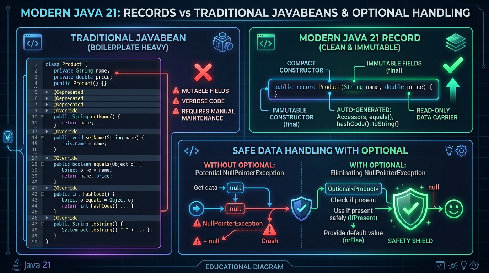

# 🚀 Day 05: Modern Java — Records, Optional & Text Blocks
## Java 21 Superpowers That Make Generative AI Code Clean, Safe, and NPE-Proof

| ⬅️ Previous Day | 📚 Course Hub | ➡️ Next Day |
|:---|:---:|---:|
| [← Day 04: Generics, Collections & Data Structures](../Day_04_Generics_Collections_DataStructures/Day_04_Generics_Collections_DataStructures.md) | [All 60 Days Overview](../../README.md) | [Day 06: Functional Programming & Stream API →](../Day_06_Functional_Programming_Streams/Day_06_Functional_Programming_Streams.md) |

[](../../README.md)
[](../../README.md)
[](../../README.md)
[](../../README.md)

---

## 📌 What Will You Learn Today?

Hey there, friend! Welcome to Day 05. If you've ever seen older Java code from 10 years ago with 100 lines of boilerplate getters, setters, and confusing null checks just to store two variables, you might have thought: *"Why not just use Python?"*

Well, here is the great news: **Modern Java (Java 21) has completely modernized the language!**
- **Java Records** destroy 95% of boilerplate, creating clean, immutable data carriers in a single line.
- **`Optional<T>`** tames programming's "Billion-Dollar Mistake" (`NullPointerException`).
- **Text Blocks (`"""`)** let you write multi-line AI system prompts cleanly without messy string concatenation or ugly `\n` characters.
- **Pattern Matching `switch`** turns clunky `if-else` cascades into elegant expressions.

In this lesson, we will see the exact modern Java features that Spring AI uses to parse AI responses, build system prompts, and construct bulletproof AI pipelines.

By the end of today, you will clearly understand:
- ✅ **Java Records**: Why records are the ultimate data containers for AI responses.
- ✅ **Compact Constructors**: Validating AI prompts and JSON fields inside records without repetitive code.
- ✅ **`Optional<T>` Mastery**: How to safely handle missing metadata without ugly `null` checks.
- ✅ **Functional Optional Methods**: Using `map()`, `filter()`, `orElse()`, and `orElseGet()` like a senior developer.
- ✅ **Text Blocks (`"""`)**: Crafting multi-line system prompts with zero escaping headaches.
- ✅ **Modern `switch` Expressions**: Elegant pattern matching on different AI response events.
- ✅ **Sequenced Collections (Java 21)**: Grabbing the first and last messages in chat history with total ease.

---

## 🗺️ Table of Contents

- [1. Real-World Analogy: The Sealed Passport vs. The Editable Notebook](#1-real-world-analogy-the-sealed-passport-vs-the-editable-notebook)
- [2. Java Records: Immutable Data Carriers](#2-java-records-immutable-data-carriers)
  - [2.1 The Death of Boilerplate](#21-the-death-of-boilerplate)
  - [2.2 Compact Constructors & Validation](#22-compact-constructors--validation)
  - [2.3 Spring AI's Secret Weapon: Structured Outputs](#23-spring-ais-secret-weapon-structured-outputs)
- [3. `Optional<T>`: Taming the Billion-Dollar Mistake](#3-optionalt-taming-the-billion-dollar-mistake)
  - [3.1 The Problem with `null`](#31-the-problem-with-null)
  - [3.2 The Right Way to Use `Optional`](#32-the-right-way-to-use-optional)
  - [3.3 Transforming Optionals with `map` and `filter`](#33-transforming-optionals-with-map-and-filter)
- [4. Text Blocks (`"""`): Clean AI Prompt Engineering](#4-text-blocks--clean-ai-prompt-engineering)
- [5. Java 21 Pattern Matching with `switch`](#5-java-21-pattern-matching-with-switch)
- [6. Sequenced Collections (Java 21)](#6-sequenced-collections-java-21)
- [7. Key Takeaways & Summary](#7-key-takeaways--summary)
- [8. Practice Exercises & Full Solutions](#8-practice-exercises--full-solutions)
- [9. Self-Check Quiz](#9-self-check-quiz)
- [10. 🔥 Java 8 Optional & Records Interview Masterclass](#10--java-8-optional--records-interview-masterclass)
  - [10.1 Top 7 Interview Questions & In-Depth Answers](#101-top-7-interview-questions--in-depth-answers)

---

# 1. Real-World Analogy: The Sealed Passport vs. The Editable Notebook



> [!TIP]
> ### 💡 New Word Alert: Modern Java Terms
> - **Record**: A super-compact, read-only Java class created in just one line (`record User(String name, int age) {}`). Java automatically generates all the getters, constructor, `equals()`, `hashCode()`, and `toString()` for you!
> - **DTO (Data Transfer Object)**: A simple object whose only job is to carry data from one place to another (like an AI model returning an answer to your web app).
> - **Text Block (`"""`)**: A way to write multi-line strings directly using triple double-quotes, preserving formatting and newlines without needing `\n` everywhere.
> - **NullPointerException (NPE)**: The most infamous crash in programming! It happens when you try to access data on a variable that points to nothing (`null`). `Optional` protects you from this.

```
        THE TRADITIONAL CLASS (Editable Notebook)
        ┌─────────────────────────────────────────────────────────────┐
        │ Anyone with a pen can cross out the name, change the photo, │
        │ or erase the birthdate at any time. It is mutable.         │
        └─────────────────────────────────────────────────────────────┘
                                      vs.
        THE JAVA RECORD (Government Sealed Passport)
        ┌─────────────────────────────────────────────────────────────┐
        │ Printed and laminated at birth. Unalterable. Guaranteed by   │
        │ the state to contain genuine, tamper-proof identity data.   │
        └─────────────────────────────────────────────────────────────┘
```

When an LLM extracts an invoice, calculates an embedding vector, or processes a payment, you do **not** want other parts of your code mutating that data accidentally. You want a **tamper-proof, immutable record**.

---

## 🧭 The Plain English Bridge: JavaBeans vs. Modern Records

Here is how modern Java compares to the old days:

| Concept | Traditional Core Java (Old Way) | Modern Java 21 (New Way) | Plain English Meaning |
| :--- | :--- | :--- | :--- |
| **Data Carrier** | Class with 50 lines of getters/setters/equals/hashCode | `public record Product(String name, double price) {}` | A single line that auto-generates constructor, accessors, `equals()`, and `hashCode()`. |
| **Field Access** | `product.getName()` | `product.name()` | In records, getter methods drop the `get` prefix and just use the field name directly. |
| **Immutability** | Must remember to make all fields `private final` and remove setters | Built-in! All record fields are `final` by default. | Cannot be modified after creation — completely thread-safe and tamper-proof. |
| **Missing Values** | Return `null`, then write 10 nested `if (x != null)` checks | Return `Optional<Product>` | A gift box that is either full or empty, forcing the caller to handle absence safely. |
| **Multi-line Strings** | `"line1\n" + "line2\n" + "line3"` | `"""` Text Block `"""` | Write multi-line prompts and JSON exactly as they look without `\n` or `\"`. |

---

# 2. Java Records: Immutable Data Carriers

### 2.1 The Death of Boilerplate

Look at how you had to write a simple `TokenUsage` object in legacy Java:

```java
// LEGACY JAVA (Over 50 lines of boilerplate!)
public final class TokenUsage {
    private final int promptTokens;
    private final int completionTokens;

    public TokenUsage(int promptTokens, int completionTokens) {
        this.promptTokens = promptTokens;
        this.completionTokens = completionTokens;
    }

    public int getPromptTokens() { return promptTokens; }
    public int getCompletionTokens() { return completionTokens; }

    @Override
    public boolean equals(Object o) { ... 10 lines ... }

    @Override
    public int hashCode() { ... 5 lines ... }

    @Override
    public String toString() { ... 5 lines ... }
}
```

Now look at **Modern Java 21**:

```java
// MODERN JAVA 21: Exactly ONE line!
public record TokenUsage(int promptTokens, int completionTokens) {
    public int totalTokens() {
        return promptTokens + completionTokens;
    }
}
```

What did the Java compiler generate behind the scenes for this single line?
1. `private final` fields for `promptTokens` and `completionTokens`.
2. A canonical constructor: `public TokenUsage(int promptTokens, int completionTokens)`.
3. Clean getter accessors: `promptTokens()` and `completionTokens()` (no clumsy `get` prefix!).
4. A bulletproof `equals()` checking both fields.
5. A deterministic `hashCode()` matching `equals()`.
6. A beautiful `toString()`: `TokenUsage[promptTokens=150, completionTokens=35]`.
7. Made the class `final` so it cannot be maliciously subclassed.

---

### 2.2 Compact Constructors & Validation

What if an incoming LLM payload needs validation? For example, tokens cannot be negative!

Records provide **Compact Constructors** where parameters are validated *before* being assigned to fields:

```java
package com.javagenai.day05;

public record PromptConfig(String model, double temperature, int maxTokens) {

    // Compact constructor (no parameter list needed!)
    public PromptConfig {
        if (model == null || model.isBlank()) {
            throw new IllegalArgumentException("Model name cannot be empty");
        }
        if (temperature < 0.0 || temperature > 2.0) {
            throw new IllegalArgumentException("Temperature must be between 0.0 and 2.0. Got: " + temperature);
        }
        if (maxTokens <= 0) {
            throw new IllegalArgumentException("maxTokens must be > 0. Got: " + maxTokens);
        }
        // model, temperature, maxTokens are assigned automatically!
    }
}
```

---

### 2.3 Spring AI's Secret Weapon: Structured Outputs

When prompting an LLM like GPT-4o or Claude, you don't just want conversational text. You often want **structured JSON data** extracted into a Java object:

```
LLM Output (JSON) ──► Spring AI (BeanOutputConverter) ──► Java Record
```

In Spring AI (Phase 6), you will define your output schemas using simple Records:

```java
public record MovieRecommendation(
    String title,
    int releaseYear,
    String director,
    double imdbRating,
    List<String> genres,
    String rationale
) {}
```
Spring AI inspects the record's components using reflection, generates the exact JSON Schema for the LLM prompt, and maps the returned JSON into this record with zero manual parsing!

---

# 3. `Optional<T>`: Taming the Billion-Dollar Mistake

Sir Tony Hoare, who invented the `null` reference in 1965, called it his **"Billion-Dollar Mistake"** because it has caused countless crashes and security vulnerabilities.

### 3.1 The Problem with `null`

```java
// DANGEROUS: Returns null if document has no author metadata
String author = document.getMetadata().get("author");
System.out.println(author.toUpperCase()); // NullPointerException if author is null!
```

In a production microservice, a single `NullPointerException` can kill the request, return an HTTP 500 to the user, and trigger alerts.

---

### 3.2 The Right Way to Use `Optional`

An **`Optional<T>`** is a single-element container that either:
1. Holds a non-null value: `Optional.of(value)`
2. Is completely empty: `Optional.empty()`

```
                ┌───────────────────────────────────┐
                │          Optional<String>         │
                ├─────────────────┬─────────────────┤
                │  Present (Some) │  Empty (None)   │
                │  ┌───────────┐  │                 │
                │  │ "OpenAI"  │  │    [ EMPTY ]    │
                │  └───────────┘  │                 │
                └─────────────────┴─────────────────┘
```

By returning `Optional<String>`, your API explicitly warns the caller:
> *"This value might not exist. The compiler forces you to consider the empty case before using it."*

---

### 3.3 Transforming Optionals with `map` and `filter`

Never call `optional.get()` without checking `optional.isPresent()` (that defeats the entire purpose!). Instead, use modern functional methods:

```java
package com.javagenai.day05;

import java.util.Optional;

public class OptionalDemo {

    public static Optional<String> findApiKey() {
        String envKey = System.getenv("OPENAI_API_KEY");
        return Optional.ofNullable(envKey); // Safe: returns Optional.empty() if null!
    }

    public static void main(String[] args) {
        // 1. orElse: Fallback value if empty
        String key = findApiKey().orElse("default-local-mock-key");
        System.out.println("Active Key: " + key);

        // 2. map: Transform value safely if present
        Optional<String> maskedKey = findApiKey()
            .filter(k -> k.startsWith("sk-")) // Must match standard prefix
            .map(k -> k.substring(0, 7) + "..." + k.substring(k.length() - 4)); // Mask secret

        System.out.println("Masked Key: " + maskedKey.orElse("[NO VALID KEY FOUND]"));

        // 3. ifPresentOrElse: React based on presence
        findApiKey().ifPresentOrElse(
            k -> System.out.println("API key is configured and ready!"),
            () -> System.err.println("WARNING: No API key found. Falling back to local Ollama.")
        );
    }
}
```

---

# 4. Text Blocks (`"""`): Clean AI Prompt Engineering

Before Java 15, writing a multi-line system prompt in Java was painful:

```java
// OLD JAVA: Horrendous escaping and concatenation
String oldPrompt = "You are an expert Java assistant.\n" +
                   "Follow these rules:\n" +
                   "1. Only return valid JSON.\n" +
                   "2. Do not include markdown ticks like \"```json\".\n" +
                   "3. Keep temperature at 0.2.";
```

In **Modern Java (Text Blocks)**, you use three double-quotes `"""`:

```java
String systemPrompt = """
    You are an expert enterprise Java AI architect.
    Follow these strict formatting guidelines:
      1. Always respond in valid JSON matching the requested schema.
      2. Never include conversational filler like "Here is your output:".
      3. For code generation, target Java 21 LTS syntax (Records, Streams).
    """;
```

### String Interpolation with `formatted()`
Text blocks pair seamlessly with `.formatted(...)`:

```java
String promptTemplate = """
    Translate the following text into %s.
    Context: %s
    Text to translate:
    "%s"
    """;

String finalPrompt = promptTemplate.formatted("Spanish", "Medical Diagnosis", "Patient has mild fever.");
System.out.println(finalPrompt);
```

---

# 5. Java 21 Pattern Matching with `switch`

In Java 21, `switch` is no longer just for integers and enums. It can inspect complex object types and extract their components directly:

```java
package com.javagenai.day05;

public class PromptDispatcher {

    public sealed interface AIRequest permits TextPrompt, ImagePrompt, ToolResponsePrompt {}
    public record TextPrompt(String userText) implements AIRequest {}
    public record ImagePrompt(String caption, byte[] imageData) implements AIRequest {}
    public record ToolResponsePrompt(String toolName, String resultJson) implements AIRequest {}

    public static String routeRequest(AIRequest request) {
        // Java 21 switch expression returning a value!
        return switch (request) {
            case TextPrompt t -> 
                "Dispatching text prompt to LLM: " + t.userText();
            case ImagePrompt img when img.imageData().length > 1_000_000 -> 
                "Compressing large image (" + img.caption() + ") before sending to Vision model";
            case ImagePrompt img -> 
                "Sending standard image (" + img.caption() + ") to GPT-4o Vision";
            case ToolResponsePrompt tool -> 
                "Feeding tool result from [" + tool.toolName() + "] back into conversation";
        };
    }
}
```

Notice the **Guarded Pattern** (`when img.imageData().length > 1_000_000`): Java allows conditional logic directly inside the pattern matching branch!

---

# 6. Sequenced Collections (Java 21)

Prior to Java 21, getting the first or last element of a collection was inconsistent (`list.get(list.size() - 1)`, `iterator().next()`, `navigableSet.last()`).

Java 21 introduced **Sequenced Collections** with unified methods:
- `getFirst()` / `getLast()`
- `addFirst()` / `addLast()`
- `reversed()`

```java
List<String> conversationTurns = new ArrayList<>(List.of("User: Hi", "Bot: Hello!", "User: Help me."));

System.out.println("First Turn: " + conversationTurns.getFirst()); // "User: Hi"
System.out.println("Last Turn : " + conversationTurns.getLast());  // "User: Help me."

// Reverse chronological order
List<String> newestFirst = conversationTurns.reversed();
```

---

# 7. Key Takeaways & Summary

```
                  ┌─────────────────────────────────┐
                  │       DAY 05 CHEAT SHEET        │
                  └────────────────┬────────────────┘
                                   │
         ┌─────────────────────────┼─────────────────────────┐
         ▼                         ▼                         ▼
  [ Java Records ]          [ Optional<T> ]           [ Modern Syntax ]
  • Immutable data carrier  • Wraps potentially       • Text Blocks (""") for
  • Zero boilerplate          absent return values      multi-line prompts
  • Compact constructor     • Use map(), filter(),    • String.formatted()
    for domain validation     orElse() instead of get • Switch pattern matching
  • Native DTOs for         • Never pass Optional       with guarded 'when'
    Spring AI structured      as method parameters    • Sequenced collections:
    output extraction       • Eliminates NPEs           getFirst() / getLast()
```

---

# 8. Practice Exercises & Full Solutions

### 🏋️ Exercise 1: Structured AI Invoice Extraction Record
**Objective**: Create a nested Record structure representing an invoice extracted by an LLM:
1. `LineItem(String description, int quantity, double unitPrice)` with a helper `total()`.
2. `ExtractedInvoice(String invoiceId, String vendorName, List<LineItem> items)` with a helper `grandTotal()`.
3. Compact constructors to prevent negative quantities or prices.

#### Solution:
```java
package com.javagenai.day05;

import java.util.List;

public record LineItem(String description, int quantity, double unitPrice) {
    public LineItem {
        if (description == null || description.isBlank()) throw new IllegalArgumentException("Description required");
        if (quantity <= 0) throw new IllegalArgumentException("Quantity must be > 0");
        if (unitPrice < 0) throw new IllegalArgumentException("Price cannot be negative");
    }

    public double total() {
        return quantity * unitPrice;
    }
}
```

```java
package com.javagenai.day05;

import java.util.List;

public record ExtractedInvoice(String invoiceId, String vendorName, List<LineItem> items) {
    public ExtractedInvoice {
        if (invoiceId == null || invoiceId.isBlank()) throw new IllegalArgumentException("invoiceId required");
        if (vendorName == null || vendorName.isBlank()) throw new IllegalArgumentException("vendorName required");
        items = (items != null) ? List.copyOf(items) : List.of(); // Defensive unmodifiable copy!
    }

    public double grandTotal() {
        double sum = 0.0;
        for (LineItem item : items) {
            sum += item.total();
        }
        return sum;
    }
}
```

---

### 🏋️ Exercise 2: Safe Document Metadata Extraction with `Optional`
**Objective**: Write a utility class `DocumentMetadataExtractor` that extracts the author's email domain (e.g., `"openai.com"`) from a metadata map safely without any risk of `NullPointerException`.

#### Solution:
```java
package com.javagenai.day05;

import java.util.Map;
import java.util.Optional;

public class DocumentMetadataExtractor {

    public static Optional<String> extractAuthorDomain(Map<String, String> metadata) {
        return Optional.ofNullable(metadata)
            .map(m -> m.get("author_email"))
            .filter(email -> email.contains("@"))
            .map(email -> email.substring(email.indexOf("@") + 1).toLowerCase().trim());
    }
}
```

---

## 9. Self-Check Quiz

1. **What is a Java Record and why is it preferred over a traditional class for DTOs?**
   - *Answer*: A Record is an immutable, final data carrier where the compiler automatically provides fields, canonical constructor, accessors, `equals()`, `hashCode()`, and `toString()`, eliminating boilerplate and guaranteeing data integrity.
2. **Why is calling `optional.get()` directly considered an anti-pattern?**
   - *Answer*: If the `Optional` is empty, `optional.get()` throws a `NoSuchElementException`, recreating the exact same crash risk as a `NullPointerException`. Prefer `orElse()`, `orElseGet()`, `map()`, or `ifPresent()`.
3. **How do Text Blocks (`"""`) improve prompt engineering in Java?**
   - *Answer*: They allow multi-line strings with natural indentation and embedded double quotes without escaping (`\"`) or string concatenation (`+`).
4. **Can you add custom methods to a Java Record?**
   - *Answer*: Yes! Records can contain custom instance methods (e.g., `total()`), static methods, static fields, and can implement interfaces.
5. **What new methods did Java 21 introduce for ordered collections?**
   - *Answer*: `getFirst()`, `getLast()`, `addFirst()`, `addLast()`, and `reversed()`.

---

# 10. 🔥 Java 8 Optional & Records Interview Masterclass

Interviewers test `Optional<T>` relentlessly to separate developers who write defensive, modern Java from those who still spray `if (x != null)` and cause NPEs.

Here are the **Top 7 Optional & Records Interview Questions**:

---

### 10.1 Top 7 Interview Questions & In-Depth Answers

#### 💡 Q1: What was the primary motivation for introducing `Optional<T>` in Java 8?
**Answer**:
According to Java Language Architect Brian Goetz:
> *"Optional is intended to provide a limited mechanism for library method return types where there needed to be a clear way to represent 'no result', and using `null` for which was overwhelmingly likely to cause errors."*

`Optional` was **NOT** created to replace every single reference in Java, nor to replace null checks everywhere. It was created specifically as a **method return type** to force callers to explicitly handle absent return values at compile time.

---

#### 💡 Q2: What is the difference between `Optional.of(value)` and `Optional.ofNullable(value)`?
**Answer**:
- **`Optional.of(value)`**: Requires that `value` is strictly non-null. If you pass `null`, it immediately throws `NullPointerException` (fail-fast behavior).
- **`Optional.ofNullable(value)`**: Safe factory. If `value` is non-null, it returns `Optional.of(value)`. If `value` is `null`, it safely returns `Optional.empty()`.

```java
String name = null;
Optional.of(name);         // 💥 Throws NullPointerException immediately!
Optional.ofNullable(name); // ✅ Returns Optional.empty() safely.
```

---

#### 💡 Q3: Why should `Optional` NEVER be used as a Class Field or Method Parameter?
**Answer**:
This is a standard senior interview question with three major technical reasons:
1. **Not Serializable**: `Optional` does NOT implement `java.io.Serializable`. If you place an `Optional` field inside a class, serialization frameworks (Jackson, JPA entities, RMI, Redis caches) will fail or throw exceptions.
2. **Memory Overhead**: An `Optional` is an extra object allocation on the Heap containing a reference to the actual object. Using it for fields doubles pointer chasing and GC overhead.
3. **Clumsy API Design**: Forcing callers to pass `Optional.ofNullable(arg)` as method arguments pollutes calling code:
   ```java
   // ❌ BAD:
   public void process(String id, Optional<Integer> maxRetries);
   // Forces caller to write: process("123", Optional.of(3)) or process("123", Optional.empty());
   
   // ✅ GOOD: Use Method Overloading instead!
   public void process(String id, int maxRetries);
   public void process(String id) { process(id, 3); }
   ```

---

#### 💡 Q4: What is the difference between `Optional.map()` and `Optional.flatMap()`?
**Answer**:
- **`map()`**: Used when the mapping function returns a plain object ($U$). `map()` automatically wraps the returned value in an `Optional<U>`.
- **`flatMap()`**: Used when the mapping function **itself returns an `Optional<U>`**. If you used `map()`, you would end up with a nested `Optional<Optional<U>>`. `flatMap()` flattens the nested optional into a single `Optional<U>`.

```java
record User(String name, Optional<Address> address) {}
record Address(String city) {}

Optional<User> user = Optional.of(new User("Alice", Optional.of(new Address("Seattle"))));

// 1. Using map(): Result is Optional<Optional<Address>> (Nested! Messy!)
Optional<Optional<Address>> nested = user.map(User::address);

// 2. Using flatMap(): Result is Optional<Address> (Cleanly flattened!)
Optional<Address> flattened = user.flatMap(User::address);
String city = flattened.map(Address::city).orElse("Unknown City");
```

---

#### 💡 Q5: Why is `optional.get()` considered a dangerous anti-pattern?
**Answer**:
Calling `optional.get()` directly without checking `optional.isPresent()` throws `NoSuchElementException` if the value is missing. This completely defeats the purpose of using `Optional`, replacing a `NullPointerException` with a `NoSuchElementException`!

**Idiomatic Replacements**:
- Use `.orElse(defaultValue)` for constant defaults.
- Use `.orElseGet(() -> computeDefault())` for lazy expensive fallbacks.
- Use `.orElseThrow(() -> new EntityNotFoundException("..."))` for failing fast with custom exceptions.
- Use `.ifPresent(val -> ...)` or `.ifPresentOrElse(...)` to execute side effects.

---

#### 💡 Q6: What is the difference between `Optional.ifPresent()` (Java 8) and `Optional.ifPresentOrElse()` (Java 9)?
**Answer**:
- **`ifPresent(Consumer)` (Java 8)**: Executes the consumer ONLY if the value is present; does nothing if empty.
- **`ifPresentOrElse(Consumer, Runnable)` (Java 9)**: Provides an `if-else` branching mechanism: executes the `Consumer` if present, OR executes the `Runnable` if empty!

```java
Optional<String> token = getToken();

// Java 9+ idiomatic branch:
token.ifPresentOrElse(
    t -> System.out.println("Processing with token: " + t),
    () -> System.out.println("No token available. Using guest access.")
);
```

---

#### 💡 Q7: How do Java Records (Java 16/21) complement Java 8 `Optional`?
**Answer**:
Records provide **immutable, pure data containers** with zero boilerplate. In enterprise architectures (especially Spring AI):
- A Record represents the state contract (e.g., `AiResponse(String text, int tokens)`).
- Getter methods in records are direct accessors without the `get` prefix (`response.text()`).
- Optional return types on record accessors or domain helpers (e.g., `public Optional<String> firstChoice()`) communicate potential absence cleanly while keeping the record itself 100% compact and immutable.

---

<p align="center">
  <b>Awesome job finishing Day 05! 🎉</b><br>
  You now know how to write clean, modern, boilerplate-free Java with Records, safely handle missing data with <code>Optional</code>, and format clean AI prompts with Text Blocks.<br>
  Tomorrow on <b>Day 06</b>, we unlock <b>Functional Programming & Stream API</b>: Lambdas, Method References, and Data Pipelines that transform lists of text and tokens with elegant one-liners! Keep up the great work!
</p>

