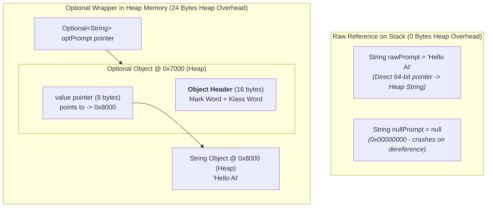
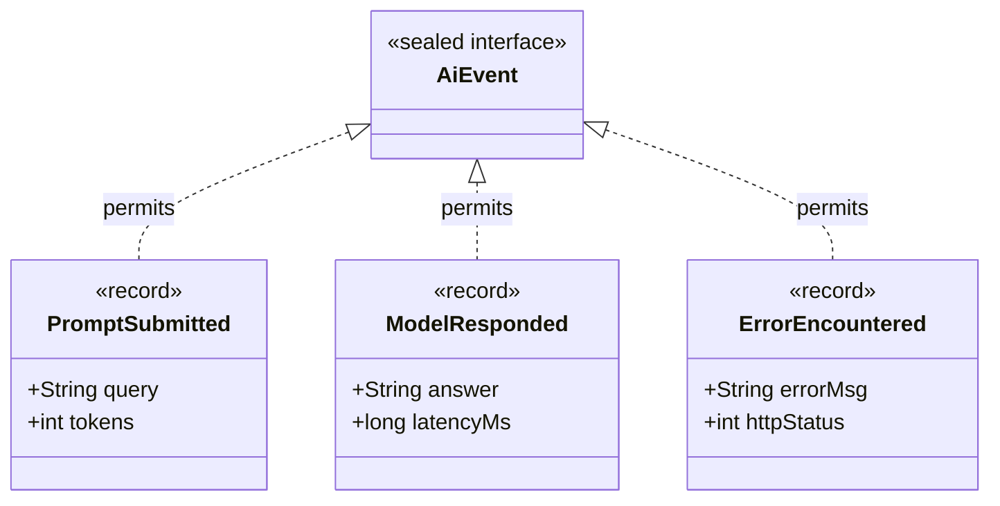

# Day_05 — Modern Java: Records, Optional, and Sealed Types in Memory

| ⬅️ Previous Day | 📚 Course Hub | ➡️ Next Day |
|:---|:---:|---:|
| [← Day 04: Generics, Collections & Data Structures](../Day_04_Generics_Collections_DataStructures/Day_04_Generics_Collections_DataStructures.md) | [All 60 Days Overview](../../README.md) | [Day 06: Functional Programming & Streams →](../Day_06_Functional_Programming_Streams/Day_06_Functional_Programming_Streams.md) |

---

## 🎯 What You'll Understand By the End
- How Java **Records (`record`)** eliminate verbose boilerplate while enforcing shallow immutability and compact memory layouts on the Heap.
- How to implement **compact constructors** to validate data invariants and perform defensive copies of mutable reference fields.
- The physical memory cost of **`Optional<T>`**: why it is an allocation container on the Heap, when to use it (method returns), and where it must be avoided (fields, parameters, collections).
- The difference between eager evaluation in `orElse()` and lazy evaluation in `orElseGet()`.
- How **Sealed Classes and Interfaces (`sealed`, `permits`, `final`)** model closed algebraic domain types, and how the JVM enforces this in Metaspace via the `PermittedSubclasses` attribute.
- How **Pattern Matching for `instanceof`** and **`switch` expressions** eliminate redundant casting bytecode and enable exhaustive compile-time validation.
- How **Text Blocks (`"""`)** and **Local Variable Type Inference (`var`)** work at compile time with zero runtime memory overhead.

---

## 🧠 The Problem This Solves

For years, Java had a reputation for requiring excessive ceremony, verbose boilerplate, and defensive null-checking:

1. **Boilerplate Explosion (The POJO Tax)**:
   In traditional Java, if you needed a simple data holder representing an AI model completion (with `promptId`, `responseText`, and `tokenCost`), you had to write:
   - 3 private fields
   - A verbose constructor
   - 3 getter methods
   - A 15-line `equals()` method
   - A 5-line `hashCode()` method
   - A 10-line `toString()` method
   Over 50 lines of boilerplate code just to hold 3 pieces of data! Developers often used third-party bytecode-manipulation libraries (like Lombok) just to avoid typing boilerplate.

2. **The "Billion-Dollar Mistake" (`NullPointerException`)**:
   Returning `null` when an AI service failed to generate a response led to sudden `NullPointerException` (NPE) crashes at runtime. When code attempts to dereference `null`, the CPU attempts to read a memory address offset from `0x00000000`, causing an operating system trap and crashing the thread.

3. **Unbounded Inheritance & Cast Vulnerabilities**:
   In traditional Java, any class could extend your domain classes unless they were marked `final`. If you needed to process different AI message types, you had to write clumsy `if/else` ladders with manual casting (`(UserMessage) msg`), and there was zero compiler guarantee that you handled every possible message type.

Modern Java (Java 16+) introduced **Records**, **`Optional`**, **Sealed Hierarchies**, and **Pattern Matching** to solve these architectural problems natively.

---

# Section 1: Records (`record`) & Immutability in Memory

## 📖 Core Concept: Declarative Data Carriers

A **Record** is a transparent, immutable data carrier. When you declare a record:

```java
public record ModelCompletion(String promptId, String responseText, int tokenCost) {}
```

The Java compiler (`javac`) automatically generates:
- Private `final` fields for each component.
- A public canonical constructor matching the header components.
- Public read accessors (e.g., `promptId()`, `responseText()`, `tokenCost()`—without the legacy `get` prefix).
- A component-based `equals()` and `hashCode()` contract.
- A clean `toString()` output (`ModelCompletion[promptId=..., responseText=..., tokenCost=...]`).
- Implicit inheritance from `java.lang.Record` in Metaspace (meaning records **cannot** extend any other class, but can implement interfaces).

---

## 🔬 Heap Representation & Shallow Immutability (Rule 9: Memory-First Mandate)

Records are stored on the Heap just like standard objects, but their fields are strictly `final`:

```
┌────────────────────────────────────────────────────────────────────────┐
│ HEAP OBJECT: ModelCompletion @ 0x4B20                                  │
│                                                                        │
│ ┌────────────────────────────────────────────────────────────────────┐ │
│ │ OBJECT HEADER (12 to 16 bytes)                                     │ │
│ │  - Mark Word (identity hash, GC age, lock state)                   │ │
│ │  - Klass Word (Pointer to ModelCompletion.class in Metaspace)      │ │
│ └────────────────────────────────────────────────────────────────────┘ │
│ ┌────────────────────────────────────────────────────────────────────┐ │
│ │ IMMUTABLE INSTANCE FIELDS (Contiguous byte offsets)                │ │
│ │  - promptId: 64-bit reference pointer -> 0x88AA ("p-101")          │ │
│ │  - responseText: 64-bit reference pointer -> 0x99BB ("AI Output")  │ │
│ │  - tokenCost: 32-bit primitive integer (42)                        │ │
│ └────────────────────────────────────────────────────────────────────┘ │
│ ┌────────────────────────────────────────────────────────────────────┐ │
│ │ ALIGNMENT PADDING (4 bytes to round to multiple of 8)              │ │
│ └────────────────────────────────────────────────────────────────────┘ │
└────────────────────────────────────────────────────────────────────────┘
```

### The "Shallow Immutability" Trap
> ⚠️ **Critical Rule**: A record is only **shallowly immutable**. Its field pointers cannot be reassigned to point to different objects. However, if a field points to a **mutable object** (such as an `ArrayList`), external code can still modify the contents of that object!

```java
// VULNERABLE RECORD: Shallow immutability leaves internal list exposed!
public record ChatContext(String systemPrompt, List<String> history) {}
```

### The Fix: Compact Constructors with Defensive Copying
Records provide a special syntax called a **compact constructor** (a constructor with no parameter list) designed specifically for validation and normalization before fields are assigned:

```java
public record ChatContext(String systemPrompt, List<String> history) {
    // Compact constructor: runs before fields are written to memory!
    public ChatContext {
        Objects.requireNonNull(systemPrompt, "systemPrompt cannot be null");
        // DEFENSIVE COPY: Creates an unmodifiable copy in Heap memory!
        history = List.copyOf(history);
    }
}
```

---

# Section 2: Null Safety & The `Optional<T>` Memory Footprint

## 🔬 The Physical Memory Cost of `Optional<T>`

`Optional<T>` is a container object that either holds a non-null reference to a value, or holds an empty state.



*This diagram illustrates memory overhead. A raw nullable reference is simply an 8-byte pointer on the Stack. In contrast, `Optional<T>` is a full object allocation on the Heap: a 16-byte Object Header plus an 8-byte `value` field (24 bytes total) pointing to the target object.*

---

## 🚫 The 3 Deadly Sins of `Optional` (Where NOT to Use It)

Because `Optional` is an allocated Heap object, using it in the wrong places causes massive memory bloat and performance degradation:

| Anti-Pattern | Why It Is Dangerous | Correct Alternative |
|:---|:---|:---|
| **1. `Optional` as an Instance Field** | Adds 24 bytes of Heap overhead to **every single object instance**; `Optional` does **not** implement `Serializable`. | Use a raw nullable field. Provide an `Optional`-returning getter if desired. |
| **2. `Optional` as a Method Parameter** | Forces the caller to wrap their argument in `Optional.of(...)`, cluttering code and allocating temporary heap objects. | Pass raw references. Check for `null` with `Objects.requireNonNull()`. |
| **3. `Optional<List<T>>`** | Wrapping a collection creates a double-wrapper. | **Never return an Optional collection**. Always return an empty list (`Collections.emptyList()` or `List.of()`). |

> ✅ **Golden Rule of `Optional`**: Use `Optional<T>` **exclusively as a method return type** when a method may legitimately fail to find a result (e.g., `findUserById()`, `extractApiKey()`).

---

## ⚡ Unwrapping Mechanics: `orElse()` vs. `orElseGet()`

A common performance pitfall is misunderstanding when default values are evaluated:

```java
// MISTAKE: orElse() evaluates the argument EAGERLY!
String model = findCachedModel(promptId)
    .orElse(expensiveNetworkCallToFetchDefault()); 
// WARNING: expensiveNetworkCallToFetchDefault() runs EVERY SINGLE TIME,
// even when findCachedModel() successfully found the model!

// CORRECT: orElseGet() evaluates LAZILY via a Supplier lambda!
String model = findCachedModel(promptId)
    .orElseGet(() -> expensiveNetworkCallToFetchDefault());
// FAST: The lambda executes ONLY if the Optional is empty!
```

---

# Section 3: Sealed Classes & Interfaces

In traditional Java, inheritance is open by default. **Sealed types (Java 17+)** allow you to restrict which classes or records can extend or implement a type.



*This diagram illustrates a sealed domain model. `AiEvent` is a sealed interface that permits exactly three implementations. No other class anywhere in the universe can implement `AiEvent`, creating a closed Algebraic Data Type.*

---

## 🔒 The Three Permitted Subclass Modifiers

Every class or interface that extends or implements a `sealed` type must explicitly declare one of three modifiers:
1. **`final`**: The subclass is completely closed; no further subclassing is allowed (all `record` types are implicitly `final`).
2. **`sealed`**: The subclass continues the restriction, specifying its own list of permitted children.
3. **`non-sealed`**: The subclass opens inheritance back up to any arbitrary subclass.

### How the JVM Enforces Sealed Types in Metaspace
When `javac` compiles a sealed class, it writes a dedicated metadata attribute into the `.class` file: **`PermittedSubclasses`**.
- When the JVM ClassLoader loads a class claiming to implement a sealed interface, it checks whether that class is listed in the `PermittedSubclasses` attribute in Metaspace.
- If an unauthorized class attempts to implement the sealed interface, the ClassLoader rejects it immediately with a fatal **`IncompatibleClassChangeError`**!

---

# Section 4: Pattern Matching & Modern Control Flow

## 🎯 Pattern Matching for `instanceof`

Before Java 16, testing and casting required repetitive, error-prone boilerplate:

```java
// The Old Way: Requires manual casting bytecode (checkcast)
if (event instanceof ModelResponded) {
    ModelResponded res = (ModelResponded) event; // Redundant Stack frame casting!
    System.out.println("Latency: " + res.latencyMs());
}

// Modern Java 16+: Pattern Matching
if (event instanceof ModelResponded res) {
    // Variable 'res' is automatically cast and in scope here!
    System.out.println("Latency: " + res.latencyMs());
}
```

---

## 🔀 Pattern Matching in `switch` Expressions

When paired with sealed hierarchies, modern `switch` expressions eliminate `break` statements, return values directly, and guarantee **exhaustive compile-time coverage**:

```java
// Exhaustive pattern matching switch: NO default branch required!
public static String formatEvent(AiEvent event) {
    return switch (event) {
        case PromptSubmitted p -> "Prompt [" + p.tokens() + " tokens]: " + p.query();
        case ModelResponded r   -> "Completed in " + r.latencyMs() + "ms: " + r.answer();
        case ErrorEncountered e -> "Failed (" + e.httpStatus() + "): " + e.errorMsg();
    };
}
```

> 💡 **The Architectural Superpower**: If another developer adds a fourth permitted record (`case StreamInterrupted s`) to `AiEvent` months later, the Java compiler will **refuse to compile** this `switch` expression until the new case is handled! This completely eliminates runtime unhandled-state bugs.

---

## 📝 Text Blocks (`"""`) and `var`

### 1. Text Blocks (Java 15+)
Multi-line string literals that preserve formatting without ugly `\n` concatenations:
```java
String systemPrompt = """
    You are an enterprise AI coding assistant.
    Strictly enforce the following rules:
      1. Always use Java 21 LTS features.
      2. Ground memory explanations in physical RAM layout.
    """;
```
*Memory Reality*: Text Blocks are resolved at compile time and stored as standard, interned `String` instances in the Metaspace Runtime Constant Pool. Zero runtime overhead!

### 2. Local Variable Type Inference (`var`, Java 10+)
Allows the compiler to infer the static type of a local variable from its initializer:
```java
var client = new OpenAiChatClient("key-123"); // Inferred as OpenAiChatClient
```
*Memory Reality*: `var` is **not** dynamic typing (like Python or JavaScript). The compiler infers the exact concrete type and bakes it into bytecode. At runtime, the memory layout and bytecode are 100% identical to writing `OpenAiChatClient client = ...`.

---

## 💻 Concrete Code Walkthrough: Modern Java in Action

```java
package com.genai.foundations.day05;

import java.util.List;
import java.util.Objects;
import java.util.Optional;

// 1. Sealed Interface modeling AI domain events
sealed interface AiEvent permits PromptEvent, ResponseEvent, FailureEvent {}

// 2. Immutable Records implementing the sealed hierarchy
record PromptEvent(String query, int tokenBudget) implements AiEvent {
    // Compact constructor validating memory invariants
    public PromptEvent {
        Objects.requireNonNull(query, "query cannot be null");
        if (tokenBudget <= 0) throw new IllegalArgumentException("Tokens must be positive");
    }
}

record ResponseEvent(String answer, long durationMs) implements AiEvent {
    public ResponseEvent {
        Objects.requireNonNull(answer, "answer cannot be null");
    }
}

record FailureEvent(String reason, int statusCode) implements AiEvent {}

// 3. Service demonstrating Optional handling and pattern matching
public class ModernJavaDemo {

    // Proper Optional usage: return type only!
    public static Optional<AiEvent> processInput(String rawInput) {
        if (rawInput == null || rawInput.isBlank()) {
            return Optional.empty(); // Clean null safety without returning null!
        }
        return Optional.of(new PromptEvent(rawInput.trim(), 2048));
    }

    // Pattern matching in switch expression
    public static String evaluateEvent(AiEvent event) {
        return switch (event) {
            case PromptEvent p   -> "Processing prompt (" + p.tokenBudget() + " max tokens): " + p.query();
            case ResponseEvent r -> "Generated in " + r.durationMs() + "ms: " + r.answer();
            case FailureEvent f  -> "Error (" + f.statusCode() + "): " + f.reason();
        };
    }

    public static void main(String[] args) {
        System.out.println("==================================================");
        System.out.println("   DAY 05: MODERN JAVA MEMORY & SYNTAX DEMO       ");
        System.out.println("==================================================");

        // Optional unwrap with lazy evaluation
        AiEvent event = processInput("Explain quantum entanglement")
            .orElseGet(() -> new FailureEvent("Default fallback event", 400));

        // Exhaustive pattern matching evaluation
        String summary = evaluateEvent(event);
        System.out.println("1. Event Summary:");
        System.out.println("   " + summary);

        // Text Block demonstration
        String configJson = """
            {
              "model": "claude-3-5-sonnet",
              "temperature": 0.2
            }
            """;
        System.out.println("2. Raw Text Block Config:\n" + configJson.trim());
        System.out.println("==================================================");
    }
}
```

### Physical Memory Allocation Trace Table

| Step / Code Line | Target Memory Area | Physical Under-the-Hood Operation |
|:---|:---|:---|
| `processInput("Explain...")` | **Heap Space** | 1. String `"Explain..."` passed to `processInput`.<br>2. `new PromptEvent(...)` allocates 24 bytes on Heap (Header + 8-byte string pointer + 4-byte int + padding).<br>3. `Optional.of(...)` allocates a 24-byte `Optional` wrapper on Heap pointing to `PromptEvent`. |
| `.orElseGet(...)` | **Stack (main frame)** | Unwraps the `PromptEvent` pointer from the `Optional` wrapper. The supplier lambda is **never executed** because the optional is non-empty! |
| `evaluateEvent(event)` | **Stack $\rightarrow$ Metaspace** | The `switch` checks the `Klass Word` of `event`. It matches `PromptEvent.class`, extracts components `query` and `tokenBudget`, and concatenates the summary string without `checkcast` overhead. |
| Text Block `"""` | **Metaspace Constant Pool** | The formatted JSON text is stored as a single interned `String` object in Metaspace. Variable `configJson` holds a direct pointer to it. |

---

## 🔑 Key Terminology

| Term | Plain-English Meaning |
|:---|:---|
| **Record (`record`)** | An immutable, transparent data carrier class where the compiler generates private final fields, constructors, getters, and equality methods. |
| **Compact Constructor** | A record constructor syntax without parameter parentheses used for validation and defensive copying before field assignment. |
| **`Optional<T>`** | A 24-byte Heap wrapper object indicating that a method return value may either contain an instance of `T` or be empty. |
| **Sealed Type (`sealed`)** | A class or interface that explicitly restricts which subclasses or records are permitted to extend or implement it. |
| **`permits`** | The keyword used by sealed classes to specify the exact whitelist of permitted subclasses. |
| **Pattern Matching** | A language feature that combines a type test with conditional extraction and binding in a single step (e.g. `instanceof` and `switch`). |
| **Text Block (`"""`)** | A multi-line string literal that eliminates escape sequences and manages indentation at compile time. |

---

## ⚠️ Common Beginner Mistakes

### 1. Using `Optional` in Fields or Method Parameters
Storing `Optional` as a class field or passing it as a method parameter.

❌ **Wrong Way**:
```java
public class UserProfile {
    private Optional<String> bio; // 24 bytes extra heap overhead per user! Not serializable!
    public void updateBio(Optional<String> newBio) { ... } // Forces caller to wrap values!
}
```

✅ **Right Way**:
```java
public class UserProfile {
    private String bio; // Standard nullable field!

    // Optional is used ONLY as a return type to communicate absence:
    public Optional<String> getBio() {
        return Optional.ofNullable(this.bio);
    }
}
```

---

### 2. Using `orElse()` Instead of `orElseGet()` for Computed Values
Passing expensive function calls to `orElse()`.

❌ **Wrong Way**:
```java
// fetchDefaultFromDatabase() RUNS ON EVERY CALL, even when apiKey is already present!
String key = findApiKey().orElse(fetchDefaultFromDatabase());
```

✅ **Right Way**:
```java
// fetchDefaultFromDatabase() runs LAZILY only when findApiKey() is empty!
String key = findApiKey().orElseGet(() -> fetchDefaultFromDatabase());
```

---

### 3. Assuming Records Prevent Mutation of Nested Objects
Assuming records automatically make internal lists or maps immutable.

❌ **Wrong Way**:
```java
public record Team(List<String> members) {} // Shallow immutability! Outside code can mutate the list!
```

✅ **Right Way**:
```java
public record Team(List<String> members) {
    public Team {
        members = List.copyOf(members); // Deeply immutable view!
    }
}
```

---

## ✅ Best Practices

1. **Default to Records for DTOs and AI Payloads**: Use records for all API request bodies, responses, configurations, and internal events.
2. **Defensively Copy Mutable Record Fields**: If your record must accept a `List`, `Set`, or `Map`, always apply `List.copyOf()`, `Set.copyOf()`, or `Map.copyOf()` in a compact constructor.
3. **Use Sealed Hierarchies for Domain State Machines**: Model domain states (e.g. `Pending`, `Running`, `Completed`, `Failed`) as a `sealed interface` with `record` implementations.
4. **Use Text Blocks for Prompts and JSON**: Write clean, readable system prompts and JSON schemas using Text Blocks (`"""`) instead of ugly concatenated strings with `\n`.

---

## 🔭 Looking Ahead
In **Day_06**, we will master **Functional Programming & Streams**: discovering how lambda expressions compile to `invokedynamic` in bytecode, how functional interfaces (`Predicate`, `Function`, `Consumer`, `Supplier`) operate, and how the Stream API optimizes data pipelines.

---

## 📝 Quick Recap
- **Records** are shallowly immutable data carriers; compact constructors enforce data validation and defensive copies.
- **`Optional<T>`** carries a 24-byte Heap allocation overhead; use it **only as a return type** to communicate potential absence.
- `orElseGet()` evaluates lazily via a supplier, avoiding the eager evaluation overhead of `orElse()`.
- **Sealed Types (`sealed`, `permits`)** restrict inheritance to a closed set of permitted subclasses enforced in Metaspace.
- **Pattern Matching** eliminates redundant `checkcast` bytecode in `instanceof` and guarantees exhaustive handling in `switch` expressions.
- Text Blocks (`"""`) and `var` are resolved strictly at compile time with zero runtime memory overhead.

---

## 🧪 Try It Yourself

1. **Test Shallow Immutability**: Create a record `User(String name, List<String> roles)`. Instantiate a `User` passing an `ArrayList`. Call `user.roles().add("ADMIN")`. Notice that the record allowed the modification! Then add a compact constructor with `List.copyOf()` and verify that calling `.add()` now throws `UnsupportedOperationException`.
2. **Exhaustive Sealed Switch**: Create a sealed interface `PaymentStatus` permitting `Success`, `Pending`, and `Failed`. Write a method with a `switch` expression evaluating all three cases without a `default` branch. Add a fourth permitted record `Refunded` and observe how the compiler prevents building until you handle `Refunded`.
3. **Compare `orElse` vs `orElseGet`**: Write a test where an `Optional` contains a string. In one line, call `.orElse(printAndReturn())`. In the next, call `.orElseGet(() -> printAndReturn())`. Observe console outputs to witness eager vs. lazy evaluation in action.
