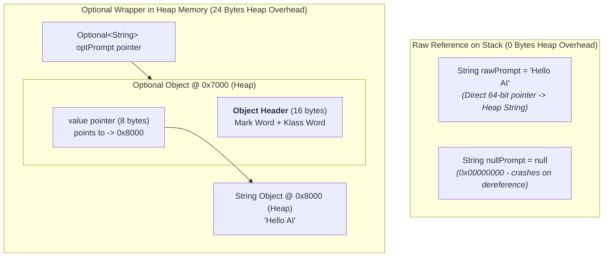
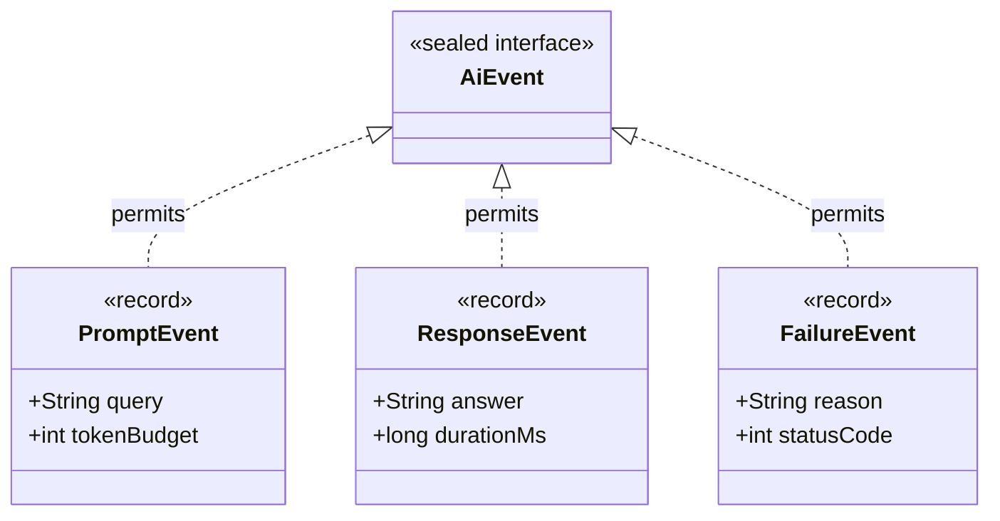

# Phase_01, Day_05 — Modern Java: Records, Optional, and Sealed Types in Memory

| ⬅️ Previous Day | 📚 Course Hub | ➡️ Next Day |
|:---|:---:|---:|
| [← Day 04: Generics, Collections & Data Structures](../Day_04_Generics_Collections_DataStructures/Day_04_Generics_Collections_DataStructures.md) | [Course Hub](../../README.md) | [Day 06: Functional Programming & Streams →](../Day_06_Functional_Programming_Streams/Day_06_Functional_Programming_Streams.md) |

---

## 🎯 What You'll Understand By the End

- How Java **Records (`record`)** eliminate verbose boilerplate while enforcing shallow immutability and compact memory layouts on the Heap.
- How to implement **compact constructors** in records to enforce data invariants and perform defensive copies of mutable references.
- The physical memory cost of **`Optional<T>`**: why it is an allocated 24-byte wrapper on the Heap, when to use it (method return types), and the 3 places where it must **never** be used (fields, parameters, collections).
- The critical performance difference between eager evaluation in `orElse()` and lazy evaluation in `orElseGet()`.
- How **Sealed Classes and Interfaces (`sealed`, `permits`)** model closed algebraic domain types, and how the JVM enforces this in Metaspace via the `PermittedSubclasses` attribute.
- How **Pattern Matching for `instanceof`** and **`switch` expressions** eliminate redundant casting bytecode and enable exhaustive compile-time validation without `default` branches.
- How **Text Blocks (`"""`)** and **Local Variable Type Inference (`var`)** operate strictly at compile time with zero runtime memory overhead.

---

## 🧠 The Problem This Solves / Why This Comes Up

For years, legacy Java had a reputation for requiring excessive ceremony, boilerplate code, and defensive null-checking:

### 1. Boilerplate Explosion (The POJO Tax)
In traditional Java, creating a simple data holder representing an AI model completion (with `promptId`, `responseText`, and `tokenCost`) required writing over 50 lines of code:
- 3 private fields
- A 10-line constructor
- 3 getter methods
- A 15-line `equals()` method
- A 5-line `hashCode()` method
- A 10-line `toString()` method

Developers often resorted to third-party bytecode-manipulation tools (like Lombok) just to avoid writing boilerplate.

### 2. The "Billion-Dollar Mistake" (`NullPointerException`)
Returning `null` when a service legitimately failed to find a result caused sudden `NullPointerException` (NPE) crashes at runtime. When code attempts to dereference `null`, the CPU tries to read memory address `0x00000000`, triggering an operating system memory trap and crashing the thread.

### 3. Unbounded Inheritance & Cast Fragility
In traditional Java, any class could extend your domain classes unless marked `final`. If you needed to process different AI message types, you were forced to write clumsy `if-else` ladders with manual casts (`(UserMessage) msg`), with zero compiler guarantee that you handled every possible message type.

Modern Java (Java 16+) introduced **Records**, **`Optional`**, **Sealed Hierarchies**, and **Pattern Matching** to solve these architectural problems natively.

---

# Section 1: Records (`record`) & Immutability in Memory

---

## 📖 Declarative Data Carriers

A **Record** is a transparent, immutable data carrier. When you declare:

```java
public record ModelCompletion(String promptId, String responseText, int tokenCost) {}
```

The Java compiler (`javac`) automatically generates:
- Private `final` fields for each component.
- A public canonical constructor initializing all components.
- Public read accessors matching component names (`promptId()`, `responseText()`, `tokenCost()`, without the legacy `get` prefix).
- A component-based `equals()` and `hashCode()` contract.
- A clean `toString()` representation (`ModelCompletion[promptId=..., responseText=..., tokenCost=...]`).
- Implicit inheritance from `java.lang.Record` in Metaspace (records cannot extend any class, but can implement interfaces).

---

## 🔬 Heap Representation & The Shallow Immutability Trap

Records live on the Heap as compact objects with `final` fields:

```
Heap Object: ModelCompletion @ 0x4B20
┌────────────────────────────────────────────────────────────────────────┐
│ [Object Header: Mark Word (8 bytes) + Klass Word (4/8 bytes)]          │
├────────────────────────────────────────────────────────────────────────┤
│ IMMUTABLE INSTANCE FIELDS:                                             │
│   • promptId (reference pointer -> 0x88AA "p-101")                     │
│   • responseText (reference pointer -> 0x99BB "AI Output")             │
│   • tokenCost (int, 4 bytes primitive: 42)                             │
├────────────────────────────────────────────────────────────────────────┤
│ ALIGNMENT PADDING (4 bytes to round to multiple of 8)                  │
└────────────────────────────────────────────────────────────────────────┘
```

### The "Shallow Immutability" Vulnerability
> ⚠️ **Critical Rule**: A record is only **shallowly immutable**. Its field pointers cannot be reassigned. However, if a record field points to a **mutable object** (such as an `ArrayList`), external code can still modify the contents of that list!

```java
// VULNERABLE RECORD: Shallow immutability leaves internal list exposed!
public record ChatContext(String systemPrompt, List<String> history) {}

// In main():
List<String> list = new ArrayList<>();
list.add("Hello");
ChatContext ctx = new ChatContext("Be helpful", list);

// OUTSIDE CODE WIPES THE RECORD'S DATA:
list.clear(); // Wiped! ctx.history() is now empty!
```

### The Fix: Compact Constructors with Defensive Copying
Records provide a **compact constructor** syntax (a constructor with no parameter list) designed specifically for validation and defensive copying before fields are assigned:

```java
public record ChatContext(String systemPrompt, List<String> history) {
    // Compact constructor: runs before fields are assigned to memory!
    public ChatContext {
        Objects.requireNonNull(systemPrompt, "systemPrompt cannot be null");
        // DEFENSIVE COPY: Creates an unmodifiable copy in Heap memory!
        history = List.copyOf(history);
    }
}
```

---

# Section 2: Null Safety & The `Optional<T>` Memory Footprint

---

## 🔬 The Physical Memory Cost of `Optional<T>`

`Optional<T>` is an allocated container on the Heap that either holds a non-null reference to a value, or is empty (`Optional.empty()`).



A raw nullable reference is simply an 8-byte pointer on the Stack. In contrast, `Optional<T>` is a full object allocation on the Heap: a 16-byte Object Header plus an 8-byte value pointer = **24 bytes of Heap overhead per instance!**

---

## 🚫 The 3 Deadly Sins of `Optional` (Where NOT to Use It)

| Anti-Pattern | Why It Is Dangerous | Correct Alternative |
|:---|:---|:---|
| **1. `Optional` as an Instance Field** | Adds 24 bytes of Heap overhead to **every single object** in memory; `Optional` does **not** implement `Serializable`. | Use a raw nullable field. Provide an `Optional`-returning getter if desired. |
| **2. `Optional` as a Method Parameter** | Forces callers to wrap arguments in `Optional.of(...)`, cluttering code and allocating temporary objects. | Pass raw references. Check for `null` via `Objects.requireNonNull()`. |
| **3. `Optional<List<T>>`** | Wrapping a collection creates a useless double-wrapper. | **Never return an Optional collection**. Always return an empty list (`List.of()` or `Collections.emptyList()`). |

> ✅ **Golden Rule of `Optional`**: Use `Optional<T>` **exclusively as a method return type** when a method may legitimately fail to find a result (e.g., `findModelById()`, `extractApiKey()`).

---

## ⚡ Unwrapping Mechanics: `orElse()` vs. `orElseGet()`

A common performance bug in production is confusing eager evaluation with lazy evaluation:

```java
// ❌ DANGEROUS: orElse() evaluates its argument EAGERLY!
String model = findCachedModel(promptId)
    .orElse(expensiveDatabaseQueryForDefault()); 
// WARNING: expensiveDatabaseQueryForDefault() runs EVERY SINGLE TIME,
// even when findCachedModel() successfully found the model in cache!

// ✅ OPTIMAL: orElseGet() evaluates LAZILY via a Supplier lambda!
String model = findCachedModel(promptId)
    .orElseGet(() -> expensiveDatabaseQueryForDefault());
// FAST: The lambda executes ONLY if the Optional is actually empty!
```

---

# Section 3: Sealed Classes and Interfaces

---

## 🔒 Closed Algebraic Domain Models

In traditional Java, inheritance was open to any class unless marked `final`. **Sealed types (Java 17+)** allow you to explicitly restrict which classes or records can extend or implement a type using `sealed` and `permits`:



```java
public sealed interface AiEvent permits PromptEvent, ResponseEvent, FailureEvent {}

public record PromptEvent(String query, int tokenBudget) implements AiEvent {}
public record ResponseEvent(String answer, long durationMs) implements AiEvent {}
public record FailureEvent(String reason, int statusCode) implements AiEvent {}
```

### The 3 Permitted Subclass Modifiers
Every class extending or implementing a `sealed` type must explicitly declare one of three modifiers:
1. **`final`**: The subclass is completely closed (all `record` types are implicitly `final`).
2. **`sealed`**: The subclass continues the restriction, defining its own `permits` list.
3. **`non-sealed`**: The subclass opens inheritance back up to arbitrary subclasses.

### How the JVM Enforces Sealed Types in Metaspace
When `javac` compiles a sealed type, it writes a dedicated metadata attribute into the `.class` file: **`PermittedSubclasses`**. When the ClassLoader loads a class claiming to implement `AiEvent`, it verifies that the class is listed in this Metaspace attribute. If an unauthorized class attempts to implement it, the ClassLoader throws **`IncompatibleClassChangeError`**!

---

# Section 4: Pattern Matching & Modern Control Flow

---

## 🎯 Pattern Matching for `instanceof`

Before Java 16, testing and casting required repetitive boilerplate and redundant bytecode instructions:

```java
// ❌ The Old Way: Requires redundant checkcast bytecode
if (event instanceof ResponseEvent) {
    ResponseEvent res = (ResponseEvent) event; // Redundant cast!
    System.out.println("Latency: " + res.durationMs());
}

// ✅ Modern Java 16+: Pattern Matching
if (event instanceof ResponseEvent res) {
    // Variable 'res' is automatically cast and in scope here!
    System.out.println("Latency: " + res.durationMs());
}
```

---

## 🔀 Exhaustive Pattern Matching in `switch` Expressions

When combined with sealed hierarchies, modern `switch` expressions eliminate `break` statements, return values directly, and guarantee **exhaustive compile-time validation**:

```java
public static String formatEvent(AiEvent event) {
    // Exhaustive switch: NO default branch required!
    return switch (event) {
        case PromptEvent p   -> "Prompt [" + p.tokenBudget() + " tokens]: " + p.query();
        case ResponseEvent r -> "Completed in " + r.durationMs() + "ms: " + r.answer();
        case FailureEvent f  -> "Failed (" + f.statusCode() + "): " + f.reason();
    };
}
```

> 💡 **The Architectural Superpower**: If another developer adds a fourth permitted record (`case StreamInterruptedEvent s`) to `AiEvent` months later, the Java compiler will **refuse to compile** this `switch` expression until the new case is handled! This completely eliminates runtime unhandled-state bugs.

---

## 📝 Text Blocks (`"""`) and `var`

### 1. Text Blocks (Java 15+)
Multi-line string literals that preserve formatting without ugly `\n` concatenations:
```java
String systemPrompt = """
    You are an enterprise AI assistant.
    Enforce the following rules:
      1. Always return valid JSON.
      2. Ground facts strictly in provided context.
    """;
```
*Memory Reality*: Text Blocks are resolved at compile time and stored as standard interned `String` objects in the Metaspace Runtime Constant Pool. Zero runtime overhead!

### 2. Local Variable Type Inference (`var`, Java 10+)
Allows the compiler to infer the static type from the variable's initializer:
```java
var client = new OpenAiChatModel("gpt-4o", 30, "sk-key"); // Inferred as OpenAiChatModel
```
*Memory Reality*: `var` is **not** dynamic typing. The compiler infers the exact concrete type and writes it into bytecode. At runtime, memory layout is 100% identical to explicit type declaration.

---

## 🧭 Real-World Analogy

### 1. Records: Official Passport vs. Blank Notebook
- A standard mutable class is like a **blank notebook**: anyone can tear out pages, cross out words, or add bogus entries at any time.
- A **Record** is a **tamper-evident official passport**: your photo, name, and birthdate are permanently laminated into the card at the moment of issue. It cannot be altered in transit.

### 2. Sealed Types: Airport Security Gate Whitelist
- Standard inheritance is an **open border**: anyone can walk in.
- A **Sealed Type** is an **airport gate whitelist**: security holds a strict list of permitted passengers (`permits PromptEvent, ResponseEvent, FailureEvent`). No one else is allowed through the gate.

---

## 💻 Code Walkthrough: Modern Java in Action

```java
package com.genai.foundations.modern;

import java.util.List;
import java.util.Objects;
import java.util.Optional;

// 1. Sealed Interface modeling AI domain events
sealed interface AiEvent permits PromptEvent, ResponseEvent, FailureEvent {}

// 2. Immutable Records implementing the sealed hierarchy
record PromptEvent(String query, int tokenBudget) implements AiEvent {
    // Compact constructor validating memory invariants
    public PromptEvent {
        Objects.requireNonNull(query, "query cannot be null");
        if (tokenBudget <= 0) throw new IllegalArgumentException("tokenBudget must be positive");
    }
}

record ResponseEvent(String answer, long durationMs) implements AiEvent {
    public ResponseEvent {
        Objects.requireNonNull(answer, "answer cannot be null");
    }
}

record FailureEvent(String reason, int statusCode) implements AiEvent {}

// 3. Service demonstrating Optional handling and pattern matching
public class ModernJavaDemo {

    // Proper Optional usage: return type only!
    public static Optional<AiEvent> parseInput(String rawInput) {
        if (rawInput == null || rawInput.isBlank()) {
            return Optional.empty(); // Clean null safety without returning null!
        }
        return Optional.of(new PromptEvent(rawInput.trim(), 2048));
    }

    // Pattern matching in switch expression
    public static String evaluateEvent(AiEvent event) {
        return switch (event) {
            case PromptEvent p   -> "Processing prompt (" + p.tokenBudget() + " max tokens): " + p.query();
            case ResponseEvent r -> "Generated in " + r.durationMs() + "ms: " + r.answer();
            case FailureEvent f  -> "Error (" + f.statusCode() + "): " + f.reason();
        };
    }

    public static void main(String[] args) {
        System.out.println("==================================================");
        System.out.println("   DAY 05: MODERN JAVA MEMORY & SYNTAX DEMO       ");
        System.out.println("==================================================");

        // Optional unwrap with lazy evaluation
        AiEvent event = parseInput("Explain quantum computing")
            .orElseGet(() -> new FailureEvent("Default fallback event", 400));

        // Exhaustive pattern matching evaluation
        String summary = evaluateEvent(event);
        System.out.println("1. Event Summary:");
        System.out.println("   " + summary);
        System.out.println();

        // Text Block demonstration
        String configJson = """
            {
              "model": "gpt-4o",
              "temperature": 0.7
            }
            """;
        System.out.println("2. Raw Text Block Config:\n" + configJson.trim());
        System.out.println("==================================================");
    }
}
```

---

## 🔬 Let's Trace Through It: Memory Allocation & Pattern Matching

| Step | Target Area | What Physically Happens in RAM |
|:---|:---|:---|
| `parseInput("Explain...")` | **Heap Space** | 1. `new PromptEvent(...)` allocates 24 bytes on the Heap.<br>2. `Optional.of(...)` allocates a 24-byte `Optional` wrapper on the Heap pointing to `PromptEvent`. |
| `.orElseGet(...)` | **Stack (`main` frame)** | Unwraps the `PromptEvent` pointer from the `Optional`. The supplier lambda is **never executed** because the optional is non-empty! |
| `evaluateEvent(event)` | **Stack $\rightarrow$ Metaspace** | The `switch` checks the `Klass Word` of `event`. It matches `PromptEvent.class`, extracts components `query` and `tokenBudget`, and evaluates the string without `checkcast` overhead. |
| Text Block `"""` | **Metaspace Constant Pool** | The formatted JSON text is stored as a single interned `String` object in Metaspace. Variable `configJson` holds a direct pointer to it. |

---

## 🧩 Why It's Designed This Way

### Why does a sealed switch expression not require a `default` case?
Because the compiler knows every permitted subclass from the `PermittedSubclasses` metadata attribute. If all permitted cases are explicitly enumerated, the compiler has mathematical proof that no other case can exist at runtime, making a `default` case redundant.

---

## ⚠️ Common Beginner Mistakes

### 1. Using `Optional` as an Instance Field
```java
// ❌ WRONG: 24 bytes extra Heap overhead per instance! Not serializable!
public class UserAccount {
    private Optional<String> middleName;
}

// ✅ CORRECT: Standard nullable field with Optional getter
public class UserAccount {
    private String middleName;
    public Optional<String> getMiddleName() {
        return Optional.ofNullable(middleName);
    }
}
```

### 2. Passing Expensive Computations to `orElse()`
```java
// ❌ WRONG: Executes on EVERY call even when value is present!
String key = findCachedKey().orElse(fetchKeyFromRemoteServer());

// ✅ CORRECT: Executes lazily only if empty
String key = findCachedKey().orElseGet(() -> fetchKeyFromRemoteServer());
```

### 3. Exposing Mutable Collections in Records
```java
// ❌ WRONG: Shallow immutability allows outside callers to mutate the list!
public record Team(List<String> members) {}

// ✅ CORRECT: Defensive copy in compact constructor
public record Team(List<String> members) {
    public Team {
        members = List.copyOf(members);
    }
}
```

---

## ✅ Best Practices

1. **Default to Records for DTOs and Data Carriers**: Use records for API request bodies, responses, configurations, and internal event payloads.
2. **Defensively Copy Mutable Record Fields**: If your record accepts a `List`, `Set`, or `Map`, always apply `List.copyOf()`, `Set.copyOf()`, or `Map.copyOf()` in a compact constructor.
3. **Use Sealed Hierarchies for State Machines**: Model domain states (e.g., `Pending`, `Processing`, `Completed`, `Failed`) as a `sealed interface` with `record` implementations.
4. **Use Text Blocks for Prompts and JSON**: Write readable system prompts and JSON schemas using Text Blocks (`"""`) instead of concatenated strings with `\n`.

---

## 🔭 Looking Ahead

In **Day 06**, we dive into **Functional Programming & Stream API**:
- How lambda expressions compile to **`invokedynamic`** without anonymous inner class overhead.
- Capturing vs. Non-Capturing lambdas in Heap memory.
- How the Stream API uses **lazy evaluation** and **loop fusion** to eliminate intermediate collections.
- How **Primitive Streams (`IntStream`)** bypass auto-boxing.

---

## 📝 Quick Recap

- **Records** provide shallowly immutable data carriers with compiler-generated fields, accessors, and equality methods.
- Compact constructors enable validation and defensive copying before fields are assigned in memory.
- **`Optional<T>`** carries a 24-byte Heap allocation overhead; use it **exclusively as a method return type**.
- `orElseGet()` evaluates lazily via a supplier, avoiding the eager evaluation overhead of `orElse()`.
- **Sealed Types (`sealed`, `permits`)** restrict inheritance to a closed set of permitted subclasses enforced in Metaspace.
- **Pattern Matching** eliminates redundant `checkcast` bytecode in `instanceof` and enables exhaustive `switch` expressions.
- Text Blocks (`"""`) and `var` operate strictly at compile time with zero runtime memory penalty.

---

## 🧪 Try It Yourself

1. **Test Shallow Immutability**: Create a record `User(String name, List<String> roles)`. Instantiate a `User` passing an `ArrayList`. Call `user.roles().add("ADMIN")`. Notice that the record allowed the modification! Then add a compact constructor with `List.copyOf()` and verify that calling `.add()` now throws `UnsupportedOperationException`.
2. **Exhaustive Sealed Switch**: Create a sealed interface `PaymentStatus` permitting `Success`, `Pending`, and `Failed`. Write a method with a `switch` expression evaluating all three cases without a `default` branch. Add a fourth permitted record `Refunded` and observe how the compiler prevents building until you handle `Refunded`.
3. **Compare `orElse` vs `orElseGet`**: Write a test where an `Optional` contains a string. In one line, call `.orElse(printAndReturn())`. In the next, call `.orElseGet(() -> printAndReturn())`. Observe console outputs to witness eager vs. lazy evaluation in action.

---

| ⬅️ Previous Day | 📚 Course Hub | ➡️ Next Day |
|:---|:---:|---:|
| [← Day 04: Generics, Collections & Data Structures](../Day_04_Generics_Collections_DataStructures/Day_04_Generics_Collections_DataStructures.md) | [Course Hub](../../README.md) | [Day 06: Functional Programming & Streams →](../Day_06_Functional_Programming_Streams/Day_06_Functional_Programming_Streams.md) |
