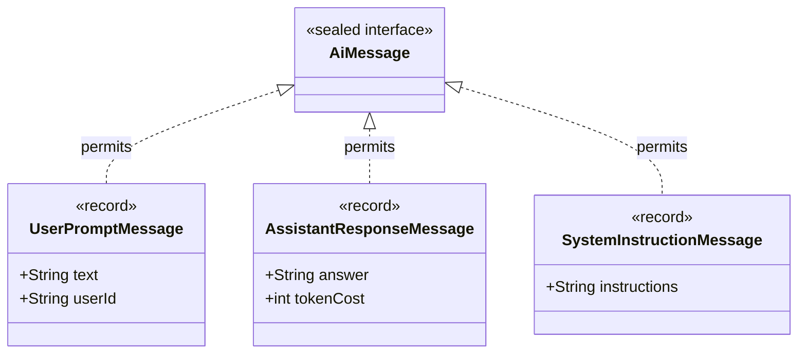

# Day_05 — Modern Java: Records, Optional, Sealed

| ⬅️ Previous Day | 📚 Course Hub | ➡️ Next Day |
|:---|:---:|---:|
| [← Day 04: Generics, Collections & Data Structures](../Day_04_Generics_Collections_DataStructures/Day_04_Generics_Collections_DataStructures.md) | [All 60 Days Overview](../../README.md) | [Day 06: Functional Programming & Streams →](../Day_06_Functional_Programming_Streams/Day_06_Functional_Programming_Streams.md) |

---

## 🎯 What You'll Understand By the End
- How Java **Records** replace 60+ lines of repetitive boilerplate code (constructors, getters, `equals()`, `hashCode()`, `toString()`) with a single clean line.
- How **`Optional<T>`** eliminates the "billion-dollar mistake" of unexpected `NullPointerException` crashes.
- How **Sealed Classes and Interfaces** create closed, mathematically exhaustive type hierarchies.
- How Modern Java pairs sealed types with **Pattern Matching for `switch`** to write clean, compiler-verified AI message evaluators.

---

## 🧠 The Problem This Solves

For years, Java had a reputation for requiring excessive "ceremony" and verbose boilerplate:

1. **Boilerplate Explosion**: In traditional Java, if you needed a simple data holder representing an AI model response (with `content`, `tokenCount`, and `finishReason`), you had to write:
   - 3 private fields
   - A full constructor
   - 3 getter methods
   - A 15-line `equals()` method
   - A 5-line `hashCode()` method
   - A 10-line `toString()` method
   Over 50 lines of code just to hold 3 pieces of data!
2. **The "Billion-Dollar Mistake" (`null`)**: Returning `null` when an AI model fails to find an answer causes sudden `NullPointerException` (NPE) crashes in downstream code unless you scatter defensive `if (response != null)` checks across every single layer of your application.
3. **Uncontrolled Inheritance Trees**: Anyone could extend your core classes anywhere in the codebase, making it impossible to guarantee that all possible message types were accounted for in your business logic.

Modern Java (Java 16+) introduced **Records**, **`Optional`**, and **Sealed Types** to solve these exact frustrations.

---

## 📖 Core Concept, Explained Simply

### 1. Records: The Notarized Data Carrier
A **Record** is a transparent, immutable data carrier. 
- You declare the fields once in the record header, and the Java compiler automatically generates the private final fields, the constructor, getters, `equals()`, `hashCode()`, and `toString()`.
- Records are **immutable**: once created, their fields cannot be changed. This makes them thread-safe and ideal for API Data Transfer Objects (DTOs) and AI responses.

### 2. `Optional<T>`: The Gift Box Analogy
Think of `Optional<T>` like a wrapped gift box:
- Instead of handing someone a raw item (which might turn out to be nothing / `null`), you hand them a box.
- The box is either **present** (contains the expected item) or **empty**.
- The recipient can inspect the box safely without risking an explosion (`NullPointerException`). It forces developers to consciously handle both the "item found" and "item missing" outcomes.

### 3. Sealed Classes: The VIP Guest List
Normally, any class can extend another class. 
- A **`sealed`** class or interface explicitly restricts which specific subclasses are allowed to extend or implement it using the `permits` keyword.
- Think of it like a VIP guest list at an exclusive door: only the names explicitly permitted on the list are allowed in.
- This gives the Java compiler complete awareness of all possible subclasses. When you evaluate them in a `switch` expression, the compiler knows whether you have covered every single case.

> 💡 **New Word Alert — "Immutability"**: An object whose internal state cannot be modified after it is created in memory.

> 💡 **New Word Alert — "Boilerplate"**: Sections of code that must be included in many places with little or no alteration, adding noise without adding business value.

---

## 🗺️ Visual Overview



*This diagram illustrates a domain modeled with a `sealed interface` and `record` implementations. `AiMessage` permits only three specific message types. No other class anywhere in the project can implement `AiMessage`, guaranteeing an exhaustive, safe hierarchy.*

---

## 💻 Code Walkthrough

Here is a complete Java 17+ program demonstrating Records, Optional handling, and pattern matching over a sealed hierarchy:

```java
import java.util.Optional;

// 1. Sealed Interface with Permitted Record Implementations
sealed interface AiMessage permits UserMessage, AssistantMessage {}

record UserMessage(String content) implements AiMessage {}
record AssistantMessage(String content, int tokensUsed) implements AiMessage {}

// 2. An AI Response Record holding an Optional
record ModelResult(String modelName, Optional<String> reasoningOutput) {}

public class ModernJavaDemo {
    // 3. Pattern Matching over Sealed Hierarchy
    public static String inspectMessage(AiMessage message) {
        return switch (message) {
            case UserMessage u -> "User said: " + u.content();
            case AssistantMessage a -> "AI replied: " + a.content() + " (" + a.tokensUsed() + " tokens)";
            // Notice: No 'default' branch needed! The compiler proves all cases are handled.
        };
    }

    public static void main(String[] args) {
        // Testing Records
        AiMessage msg1 = new UserMessage("Tell me a joke about Java.");
        AiMessage msg2 = new AssistantMessage("Why do Java developers wear glasses? Because they don't C#!", 28);

        System.out.println(inspectMessage(msg1));
        System.out.println(inspectMessage(msg2));

        // Testing Optional
        ModelResult withReasoning = new ModelResult("o1-preview", Optional.of("Step 1: Check punchline."));
        ModelResult withoutReasoning = new ModelResult("gpt-4o", Optional.empty());

        printReasoning(withReasoning);
        printReasoning(withoutReasoning);
    }

    private static void printReasoning(ModelResult result) {
        // Safe unwrapping using orElse
        String thought = result.reasoningOutput().orElse("No chain-of-thought provided.");
        System.out.println(result.modelName() + " reasoning: " + thought);
    }
}
```

### Line-by-Line Breakdown

| Code Statement | Plain-English Explanation |
|:---|:---|
| `record UserMessage(String content) ...` | A one-line record! Automatically creates a private final field, constructor, getter method `content()`, `equals()`, `hashCode()`, and `toString()`. |
| `sealed interface AiMessage permits ...` | Defines an interface that strictly permits only `UserMessage` and `AssistantMessage` as implementations. |
| `switch (message)` | Modern pattern-matching `switch`. Automatically checks the runtime type and casts the variable (`case UserMessage u`). |
| No `default:` in `switch` | Because `AiMessage` is `sealed`, the compiler knows that only two types exist. If you cover both, the switch is **exhaustive**. |
| `Optional<String> reasoningOutput` | Explicitly declares that this field may or may not contain a string value. |
| `Optional.of(...)` / `Optional.empty()` | Creates an Optional containing a value or an empty Optional, respectively. |
| `result.reasoningOutput().orElse(...)` | Safely retrieves the value if present, or returns a fallback string if empty — with zero risk of a `NullPointerException`. |

---

## 🔑 Key Terminology

| Term | Plain-English Meaning |
|:---|:---|
| **Record** | A concise, immutable class introduced in Java 16 designed purely to hold data fields. |
| **`Optional<T>`** | A container object that may or may not contain a non-null value, replacing dangerous `null` returns. |
| **`sealed`** | A keyword restricting which classes or interfaces may inherit or implement a given type. |
| **`permits`** | The clause following a `sealed` declaration that explicitly lists the allowed subclasses. |
| **Pattern Matching** | A language feature that combines testing an object's type and extracting it into a typed variable in one step. |
| **Exhaustive Switch** | A switch statement over a sealed type where the compiler verifies that every possible subclass is handled. |

---

## ⚠️ Common Beginner Mistakes

### 1. Calling `.get()` on an `Optional` Without Checking
Calling `.get()` on an empty `Optional` throws a `NoSuchElementException`, re-creating the exact crash that `Optional` was designed to prevent.

❌ **Wrong Way**:
```java
Optional<String> outcome = Optional.empty();
String text = outcome.get(); // CRASH! NoSuchElementException: No value present
```

✅ **Right Way**:
```java
Optional<String> outcome = Optional.empty();
// Safe fallback with orElse:
String text = outcome.orElse("Default response");

// Or conditional action with ifPresent:
outcome.ifPresent(val -> System.out.println("Result: " + val));
```
*Why it is wrong*: `.get()` defeats the entire safety purpose of using `Optional`. Always prefer `.orElse()`, `.orElseGet()`, or `.orElseThrow()`.

---

### 2. Expecting Records to Have `getFieldName()` Getters
Traditional Java classes use JavaBean conventions like `getName()` and `getTokens()`. Records use clean, direct accessor methods matching the field name (`name()` and `tokens()`).

❌ **Wrong Way**:
```java
UserMessage msg = new UserMessage("Hello");
String text = msg.getContent(); // Fails to compile! No method named getContent()
```

✅ **Right Way**:
```java
UserMessage msg = new UserMessage("Hello");
String text = msg.content(); // Correct! Records use fieldName() directly.
```

---

### 3. Using `Optional` as a Method Parameter or Class Field
`Optional` is designed specifically as a **return type** for methods that might not find a result. Using it as a method parameter makes callers write clunky code.

❌ **Clunky API Design**:
```java
public void generate(String prompt, Optional<Integer> maxTokens) { ... }
// Callers have to write: generate("Hi", Optional.of(100)) or generate("Hi", Optional.empty());
```

✅ **Clean API Design**:
```java
public void generate(String prompt, Integer maxTokens) { ... }
// Or use method overloading:
public void generate(String prompt) { generate(prompt, null); }
```

---

## ✅ Best Practices

1. **Use Records for All Data Transfer Objects (DTOs)**: Any class whose sole purpose is to bundle data (like API request payloads, prompt templates, or database projections) should be a `record`.
2. **Never Return `null` When You Can Return `Optional`**: If a query or lookup method might return nothing (e.g., `findModelByName`), always return `Optional<T>`.
3. **Combine Sealed Interfaces with Records for Domain Modeling**: Model complex AI pipelines as a `sealed interface` implemented by a cluster of clean `record` components.

---

## 🔭 Looking Ahead
In **Day_06**, we will dive into **Functional Programming & Streams**, using lambda expressions to filter, map, and aggregate large collections of AI records effortlessly.

---

## 📝 Quick Recap
- **Records** eliminate boilerplate and provide built-in immutability, constructors, accessors, `equals`, `hashCode`, and `toString`.
- **`Optional<T>`** forces safe handling of missing values, banishing `NullPointerException` bugs.
- **Sealed Types** restrict inheritance to an approved list of subclasses.
- Pairing sealed types with **Pattern Matching** allows compiler-verified, exhaustive `switch` expressions without needing default fallback branches.

---

## 🧪 Try It Yourself

1. **Create an AI Token Usage Record**: Create a record named `TokenUsage` with `promptTokens`, `completionTokens`, and a custom compact constructor that validates neither number is negative. Add a helper method `totalTokens()` that returns their sum.
2. **Safe Optional Lookup**: Write a method `Optional<String> findApiKey(String provider)` that returns an API key for `"openai"`, but returns `Optional.empty()` for unknown providers. Call the method and print the result using `.orElse("Key Missing")`.
3. **Model a Sealed Pipeline Step**: Create a sealed interface `PipelineStep` that permits `EmbedDocument`, `PerformVectorSearch`, and `FormatPromptResponse`. Write a method with a pattern-matching `switch` that logs what each step is doing.
