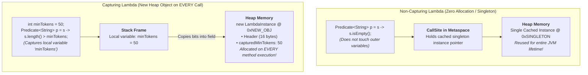

# Phase_01, Day_06 — Functional Programming, Lambdas, and Streams in Memory

| ⬅️ Previous Day | 📚 Course Hub | ➡️ Next Day |
|:---|:---:|---:|
| [← Day 05: Modern Java: Records, Optional, Sealed](../Day_05_Modern_Java_Records_Optional_Sealed/Day_05_Modern_Java_Records_Optional_Sealed.md) | [Course Hub](../../README.md) | [Day 07: Concurrency & Virtual Threads →](../Day_07_Concurrency_Virtual_Threads/Day_07_Concurrency_Virtual_Threads.md) |

---

## 🎯 What You'll Understand By the End

- The core built-in **Functional Interfaces** (`Predicate`, `Function`, `Consumer`, `Supplier`) and method reference (`::`) mechanics.
- The low-level memory secret of lambdas: why they are **not** anonymous inner classes, how **`invokedynamic`** works, and how `LambdaMetafactory` generates lightweight call-site linkage.
- The physical memory contrast between **non-capturing lambdas** (cached singletons, 0 bytes Heap allocation on execution) and **capturing lambdas** (brand-new Heap object allocated on every single call).
- Why captured local stack variables must be **`final` or effectively final** (avoiding Stack-vs-Heap memory desynchronization).
- How the **Stream API** uses **lazy evaluation** and **loop fusion** to pull elements one-by-one through pipeline `Sink` stages, completely eliminating intermediate collection allocations.
- How **Primitive Streams (`IntStream`)** manipulate numbers directly in CPU registers, eliminating the 24-byte auto-boxing memory tax.
- The hidden memory traps of **Parallel Streams**: common pool starvation, task splitting overhead, and CPU cache-line thrashing.

---

## 🧠 The Problem This Solves / Why This Comes Up

Before Java 8 introduced functional programming and the Stream API, collection processing suffered from two massive architectural inefficiencies:

### 1. Anonymous Inner Class Memory Bloat
In older Java, passing behavior (like sorting or filtering) required writing an anonymous inner class:

```java
// The Ancient Way (Pre-Java 8):
Collections.sort(documents, new Comparator<Document>() {
    @Override
    public int compare(Document d1, Document d2) {
        return Double.compare(d2.score(), d1.score());
    }
});
```

- **Metaspace Pollution**: The compiler created a separate `.class` file on disk (`EnclosingClass$1.class`) and loaded an entire class blueprint into Metaspace.
- **Heap Overhead**: Every invocation executed `new EnclosingClass$1()`, allocating a 24-byte object on the Heap with an implicit pointer back to the enclosing instance (`this$0`), frequently causing accidental memory leaks.

### 2. The Intermediate Collection Allocation Disaster
In traditional imperative code, transforming data in multiple steps required allocating temporary intermediate lists on the Heap for every step:

```java
// Step 1: Allocate intermediate list 1 on Heap
List<Document> filtered = new ArrayList<>();
for (Document d : allDocs) if (d.score() > 0.8) filtered.add(d);

// Step 2: Allocate intermediate list 2 on Heap
List<String> cleaned = new ArrayList<>();
for (Document d : filtered) cleaned.add(d.text().trim());

// Step 3: Allocate intermediate list 3 on Heap
List<String> deduplicated = new ArrayList<>();
for (String s : cleaned) if (!deduplicated.contains(s)) deduplicated.add(s);
```

If `allDocs` holds 500,000 items, your application allocates **three massive temporary Heap lists**, triggering heavy Garbage Collection pauses that stall the CPU.

Java solved this with **Lambdas** (powered by zero-overhead `invokedynamic` call-site linkage) and **Streams** (which fuse operations together and process elements lazily one-by-one without intermediate collections).

---

# Section 1: Functional Interfaces & Method References

---

## 📖 The Core Built-In Functional Interfaces

A **Functional Interface** is an interface with **exactly one abstract method** (Single Abstract Method or SAM). It can contain any number of `default` or `static` methods.

Java provides four primary functional interfaces in `java.util.function`:

| Interface | Method Signature | Conceptual Role | GenAI Use Case |
|:---|:---|:---|:---|
| **`Predicate<T>`** | `boolean test(T t)` | Evaluates a boolean condition | Filtering prompts exceeding a safety toxicity threshold. |
| **`Function<T, R>`** | `R apply(T t)` | Transforms an input of type `T` into `R` | Converting a raw prompt string into a vector embedding array. |
| **`Consumer<T>`** | `void accept(T t)` | Consumes a value, returns `void` | Streaming generated tokens directly to an HTTP response socket. |
| **`Supplier<T>`** | `T get()` | Generates a value with no input | Lazy generation of session UUIDs or API client fallbacks. |

> 💡 **Primitive Specializations**: Standard generics incur auto-boxing. Java provides primitive functional interfaces—such as `IntPredicate`, `LongFunction<R>`, and `ToDoubleFunction<T>`—to pass raw primitives on the Stack with **zero Heap boxing overhead**!

---

## 🎯 Method References (`::`)

A **Method Reference** is a high-performance shorthand for a lambda that calls an existing method:

| Category | Lambda Syntax | Method Reference Syntax |
|:---|:---|:---|
| **Static Method** | `(s) -> Integer.parseInt(s)` | `Integer::parseInt` |
| **Bound Instance Method** | `(s) -> System.out.println(s)` | `System.out::println` |
| **Unbound Instance Method** | `(s) -> s.toLowerCase()` | `String::toLowerCase` |
| **Constructor Reference** | `() -> new ArrayList<>()` | `ArrayList::new` |

---

# Section 2: Lambdas Under the Hood (The Memory Secret)

---

## 🔬 Why Lambdas are NOT Anonymous Inner Classes

When you compile a lambda expression:
```java
Predicate<String> filter = s -> s.isBlank();
```
The compiler does **not** create a new `.class` file on disk. Instead:
1. `javac` compiles the lambda body into a private static method inside the enclosing class (`private static boolean lambda$main$0(String s)`).
2. It emits the specialized bytecode instruction: **`invokedynamic` (Indy)**.
3. When the JVM first reaches this instruction, it calls **`LambdaMetafactory.metafactory()`**, which generates a lightweight call-site linkage in memory.
4. On all subsequent runs, the JVM jumps directly to the linked method without any reflection or class loading overhead!

---

## 🧭 Capturing vs. Non-Capturing Lambdas



| Lambda Type | Definition | Memory Behavior |
|:---|:---|:---|
| **Non-Capturing** | References only its parameters: `s -> s.trim()` | Instantiated **once** and cached as a **singleton**. Subsequent executions allocate **0 bytes on the Heap**. |
| **Capturing** | References an outer local variable or `this`: `s -> s.length() > minTokens` | The JVM **must instantiate a new object on the Heap** on every single execution to store the captured variable inside a field! |

---

## 🔒 The Variable Capture Rule: Why `final` or Effectively Final?

Why does Java mandate that captured local variables must be `final` or effectively final?

```java
int threshold = 10;
Predicate<Integer> p = x -> x > threshold;
// threshold = 20; // COMPILE ERROR! Local variable threshold must be final or effectively final!
```

### The Physical Memory Reality:
1. Local variable `threshold` lives inside a **Stack Frame**.
2. When the enclosing method returns, its Stack Frame is popped and destroyed.
3. If the lambda is passed to another thread or stored for later execution, the Stack Frame no longer exists!
4. To survive, the lambda captures a **copied value** of `threshold` into a private instance field on the Heap.
5. If Java allowed `threshold` to change on the Stack, the Stack value and the Heap copy would desynchronize (**split-brain state**). To prevent memory corruption, Java enforces immutability on captured variables.

---

# Section 3: The Stream Pipeline & Lazy Evaluation

---

## 🔬 Lazy Execution & Loop Fusion

A **Stream** is not a data structure. It does not store elements. It is a **demand-driven computational pipeline**.

```mermaid
flowchart LR
    SRC["<b>Source</b><br>List&lt;Chunk&gt; @ 0x1000"] -->|stream()| SINK1["<b>Stage 1: filter</b><br>Sink: score &gt; 0.8"]
    SINK1 --> SINK2["<b>Stage 2: map</b><br>Sink: extract text"]
    SINK2 --> SINK3["<b>Stage 3: limit(2)</b><br>Sink: short-circuit"]
    SINK3 -->|Pulls element-by-element| TERM["<b>Terminal: toList()</b><br>Allocates Final List"]
```

When you write:
```java
List<String> topPrompts = allPrompts.stream()
    .filter(p -> p.score() > 0.85)
    .map(Prompt::text)
    .limit(2)
    .toList();
```

### What Physically Happens in Memory:
1. **Pipeline Construction**: Calling `.filter()`, `.map()`, and `.limit()` executes **zero data processing**. They simply construct a linked list of `Sink` handler structs on the Stack.
2. **Terminal Trigger**: Calling `.toList()` triggers the pipeline.
3. **Loop Fusion (Element-by-Element)**:
   - Item 0 is pulled from the source. It passes `filter`, passes `map`, and enters the final list (`count = 1`).
   - Item 1 is pulled. It fails `filter` and is dropped immediately.
   - Item 2 is pulled. It passes `filter`, passes `map`, and enters the final list (`count = 2`).
4. **Short-Circuiting**: `.limit(2)` hits its threshold. It signals the source to **stop iterating immediately**!
5. The remaining 999,997 items in `allPrompts` are never touched!

---

# Section 4: Collectors & Primitive Streams

---

## 📦 Common Collectors and Heap Memory

| Collector | Internal Accumulator | Memory Characteristics |
|:---|:---|:---|
| **`toList()` (Java 16+)** | Backed by internal unmodifiable list | Lightweight, compact, avoids overhead of mutable `ArrayList` resizing. |
| **`Collectors.toSet()`** | Backed by internal `HashSet` | Incurs `HashMap` bucket array + `Node` wrapper overhead per item. |
| **`Collectors.groupingBy(classifier)`** | Backed by `HashMap<K, List<V>>` | High memory footprint: allocates a Map plus an individual `ArrayList` for every group key. |
| **`Collectors.partitioningBy(pred)`** | Backed by 2-bucket array | Efficient boolean partitioning into `Map<Boolean, List<T>>`. |

---

## ⚡ Primitive Streams (`IntStream`, `LongStream`, `DoubleStream`)

When performing numeric operations (e.g. summing token counts, computing average latency), standard streams force heavy auto-boxing:

```java
// ❌ TERRIBLE MEMORY EFFICIENCY: Boxes every integer into an Integer object on the Heap!
int totalTokens = promptList.stream()
    .map(Prompt::tokenCount) // Returns Stream<Integer> -> BOXING TAX!
    .reduce(0, Integer::sum);

// ✅ OPTIMAL MEMORY EFFICIENCY: Uses raw primitive IntStream!
int totalTokens = promptList.stream()
    .mapToInt(Prompt::tokenCount) // Returns IntStream -> 0 Heap Allocations!
    .sum();
```
`mapToInt()` transitions the pipeline into an **`IntStream`**, where data flows through CPU registers and Stack slots as raw 32-bit primitive integers with **zero Heap allocations**.

---

# Section 5: Parallel Streams & Memory Contention

---

## ⚠️ When Parallel Streams Degrade Performance

Calling `.parallelStream()` splits workload across the shared **`ForkJoinPool.commonPool()`**:

1. **Small Datasets ($N < 10,000$)**: The overhead of task splitting, thread scheduling, and combining sub-results exceeds any multi-core speedup.
2. **Blocking I/O Operations**: If you make HTTP calls (e.g. calling an AI model API) inside a parallel stream, you tie up threads in the shared `commonPool`, starving other background services across your entire application!
3. **CPU Cache-Line Thrashing (False Sharing)**: If multiple CPU cores attempt to write intermediate results into adjacent memory slots in the same 64-byte Cache Line, hardware cache invalidation causes extreme CPU stalls.

---

## 🧭 Real-World Analogy

### Factory Assembly Line vs. Intermediate Warehouse Piles
- **Imperative Multi-Step Loops**: You produce 10,000 car parts. You pile them all into a giant warehouse (intermediate list 1). Then a second crew paints them all and piles them into a second warehouse (intermediate list 2). Then a third crew packs them into a third warehouse. You need 3 massive warehouses (Heap memory bloat).
- **The Stream Pipeline (Loop Fusion)**: Parts move on a single continuous conveyor belt. Each part is inspected, painted, and boxed one-by-one as it passes through the stations. As soon as you have boxed 2 parts (`limit(2)`), you turn off the conveyor belt. You need zero intermediate warehouses!

---

## 💻 Code Walkthrough: Stream Pipeline in Memory

```java
package com.genai.foundations.functional;

import java.util.List;
import java.util.function.Predicate;

record DocumentChunk(String id, String text, double relevanceScore, int tokens) {}

public class StreamMemoryDemo {

    public static void main(String[] args) {
        System.out.println("==================================================");
        System.out.println("   DAY 06: LAMBDAS & STREAM PIPELINE MEMORY TRACE ");
        System.out.println("==================================================");

        List<DocumentChunk> corpus = List.of(
            new DocumentChunk("c1", "Introduction to Generative AI in Java", 0.95, 120),
            new DocumentChunk("c2", "Ancient legacy COBOL architectures", 0.40, 85),
            new DocumentChunk("c3", "Vector database embeddings with pgvector", 0.91, 150),
            new DocumentChunk("c4", "Neural network quantization techniques", 0.88, 200)
        );

        // 1. Non-Capturing Lambda (Singleton in CallSite - 0 bytes Heap allocation)
        Predicate<DocumentChunk> nonCapturingFilter = chunk -> chunk.relevanceScore() >= 0.85;

        // 2. Capturing Lambda (Captures local stack variable 'minTokenLimit')
        int minTokenLimit = 100; // Local stack variable
        Predicate<DocumentChunk> capturingFilter = chunk -> chunk.tokens() >= minTokenLimit;

        // 3. Fused Stream Pipeline: Filter -> Map -> Limit -> toList
        List<String> topChunkTexts = corpus.stream()
            .filter(nonCapturingFilter) // Stage 1
            .filter(capturingFilter)    // Stage 2
            .map(DocumentChunk::text)   // Stage 3 (Method Reference)
            .limit(2)                   // Short-circuiting!
            .toList();                  // Terminal operation

        System.out.println("1. Top Selected Chunks (Fused Execution):");
        topChunkTexts.forEach(t -> System.out.println("   -> " + t));
        System.out.println();

        // 4. Primitive Stream (Zero Boxing Overhead)
        int totalTokens = corpus.stream()
            .mapToInt(DocumentChunk::tokens) // IntStream bypasses Integer auto-boxing!
            .sum();

        System.out.println("2. Total Corpus Tokens (Calculated via IntStream): " + totalTokens);
        System.out.println("==================================================");
    }
}
```

---

## 🔬 Let's Trace Through It: Memory Allocation Table

| Stage | Memory Location | What Physically Happens in RAM |
|:---|:---|:---|
| `nonCapturingFilter` | **Metaspace CallSite** | The lambda references no outer variables. Cached as a **singleton** in the `CallSite`. Zero new Heap objects allocated. |
| `capturingFilter` | **Heap Space** | Captures `minTokenLimit` (100). The JVM instantiates a new synthetic object on the **Heap** storing `100` in an instance field. |
| `.filter(...).map(...)` | **Stack (`main` frame)** | Constructs linked `Sink` handler structs on the Stack. **Zero data processing occurs yet.** |
| `.limit(2)` | **Stack (Sink chain)** | Tracks a counter initialized to 0. Short-circuits the pipeline when count reaches 2. |
| `.toList()` | **Heap Space** | Initiates pull processing. Elements c1 and c3 pass filters and enter the final unmodifiable list. Iteration terminates without ever inspecting c4! |
| `.mapToInt(...)` | **CPU Registers & Stack** | Transforms pipeline into `IntStream`. The `.sum()` operation executes in raw CPU registers without creating boxed `Integer` heap objects. |

---

## 🧩 Why It's Designed This Way

### Why did Java introduce `invokedynamic` instead of anonymous classes for lambdas?
Anonymous inner classes create separate `.class` files on disk, consume permanent Metaspace memory, and instantiate a new object every time. `invokedynamic` lets the JVM optimize lambdas dynamically at runtime: non-capturing lambdas are cached as singletons, and simple lambdas can even be completely inlined into native machine code by the HotSpot JIT compiler!

---

## ⚠️ Common Beginner Mistakes

### 1. Reusing an Already Consumed Stream
```java
// ❌ WRONG: Stream is already consumed by count()!
Stream<String> stream = list.stream().filter(s -> !s.isBlank());
long count = stream.count();
List<String> result = stream.toList(); // CRASH! IllegalStateException!

// ✅ CORRECT: Collect once, inspect the result
List<String> result = list.stream().filter(s -> !s.isBlank()).toList();
long count = result.size();
```

### 2. Blocking I/O Inside Parallel Streams
```java
// ❌ DANGEROUS: Starves ForkJoinPool.commonPool() for the entire application!
prompts.parallelStream().forEach(prompt -> callRemoteLlmApi(prompt));

// ✅ CORRECT: Use Virtual Threads or dedicated ExecutorService for concurrent I/O
```

### 3. Mutating Shared State Inside `forEach()`
```java
// ❌ WRONG: Mutating external collection inside stream
List<String> result = new ArrayList<>();
corpus.stream().filter(c -> c.score() > 0.8).forEach(c -> result.add(c.text()));

// ✅ CORRECT: Collect cleanly using terminal collectors
List<String> result = corpus.stream()
    .filter(c -> c.score() > 0.8)
    .map(DocumentChunk::text)
    .toList();
```

---

## ✅ Best Practices

1. **Keep Lambdas Pure and Free of Side Effects**: A lambda should transform data, not mutate external variables.
2. **Prefer Method References Over Verbose Lambdas**: Write `String::trim` instead of `s -> s.trim()`, and `Document::score` instead of `d -> d.score()`.
3. **Use Primitive Streams for Numbers**: Always prefer `mapToInt()`, `mapToLong()`, or `mapToDouble()` when computing sums, statistics, or averages to bypass heap boxing.
4. **Default to Sequential Streams**: Only reach for `.parallelStream()` after profiling proves CPU-bound bottlenecks on large datasets ($N > 10,000$).

---

## 🔭 Looking Ahead

In **Day 07**, we dive into **Concurrency & Virtual Threads (Project Loom)**:
- How traditional Platform Threads consume a fixed 1 MB native OS stack.
- The Java Memory Model: `volatile`, `synchronized`, and hardware CAS atomics.
- How Java 21 **Virtual Threads** store continuation call stacks on the Heap, enabling **1,000,000+ concurrent tasks** on standard RAM!

---

## 📝 Quick Recap

- Lambdas are powered by **`invokedynamic`** and **`LambdaMetafactory`**, avoiding anonymous inner class overhead.
- **Non-capturing lambdas** are cached singletons; **capturing lambdas** allocate a new object on the Heap on every call.
- Captured local variables must be **effectively final** to prevent Stack-versus-Heap desynchronization.
- Streams use **lazy evaluation** and **loop fusion** to pull elements one-by-one, avoiding intermediate collection allocations.
- **Short-circuiting operations** (`limit`, `findFirst`) abort execution early, saving CPU cycles and memory.
- **`IntStream`** manipulates raw primitive numbers in CPU registers without the 24-byte `Integer` heap wrapper.

---

## 🧪 Try It Yourself

1. **Verify Capturing vs. Non-Capturing Identity**: Create a non-capturing lambda inside a loop and print `System.identityHashCode(lambda)`. Then create a capturing lambda (capturing loop index `i`) and print its hash code. Observe that the non-capturing lambda prints the exact same memory address every time, while the capturing lambda prints a new address on every iteration!
2. **Observe Lazy Evaluation**: Write a stream with `.filter(x -> { System.out.println("Filtering " + x); return true; })` without a terminal operation. Run the program. Notice that nothing prints! Then add `.findFirst()` and observe that only the first element is processed.
3. **Compare Boxing Benchmark**: Create a stream of 10,000,000 numbers. Sum them using `Stream<Integer>` with `.reduce(0, Integer::sum)`. Then sum them using `IntStream.range(0, 10_000_000).sum()`. Time both runs and observe the massive speedup from avoiding auto-boxing.

---

| ⬅️ Previous Day | 📚 Course Hub | ➡️ Next Day |
|:---|:---:|---:|
| [← Day 05: Modern Java: Records, Optional, Sealed](../Day_05_Modern_Java_Records_Optional_Sealed/Day_05_Modern_Java_Records_Optional_Sealed.md) | [Course Hub](../../README.md) | [Day 07: Concurrency & Virtual Threads →](../Day_07_Concurrency_Virtual_Threads/Day_07_Concurrency_Virtual_Threads.md) |
