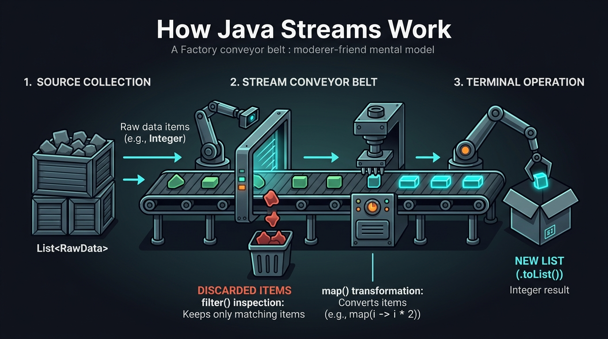

# ⚡ Day 06: Functional Programming & Stream API
## Lambdas, Method References & High-Throughput AI Data Pipelines

| ⬅️ Previous Day | 📚 Course Hub | ➡️ Next Day |
|:---|:---:|---:|
| [← Day 05: Modern Java — Records, Optional & Sealed Types](../Day_05_Modern_Java_Records_Optional_Sealed/Day_05_Modern_Java_Records_Optional_Sealed.md) | [All 60 Days Overview](../../README.md) | [Day 07: Concurrency & Virtual Threads →](../Day_07_Concurrency_Virtual_Threads/Day_07_Concurrency_Virtual_Threads.md) |

[](../../README.md)
[](../../README.md)
[](../../README.md)
[](../../README.md)

---

## 📌 What Will You Learn Today?

In Generative AI engineering, data preprocessing is 80% of the battle. Before passing text to an LLM or Vector Store, you must:
1. Load 10,000 raw documents.
2. Filter out corrupt, empty, or duplicate files.
3. Clean and normalize whitespace and special characters.
4. Split documents into semantic paragraph chunks.
5. Batch-calculate embeddings across all CPU cores.

In imperative code (traditional loops with nested `for` and `if`), this requires 150 lines of mutable lists and error-prone index tracking.

In **Functional Java**, this entire pipeline is expressed in **one clean, declarative, readable Stream pipeline**.

By the end of today, you will master:
- ✅ **The Functional Mindset**: Declarative ("WHAT") vs Imperative ("HOW").
- ✅ **Lambda Expressions (`->`)**: Treating code as data that can be passed to methods.
- ✅ **Core Functional Interfaces**: `Predicate<T>`, `Function<T,R>`, `Consumer<T>`, `Supplier<T>`.
- ✅ **Method References (`::`)**: Clean shorthand for invoking existing methods.
- ✅ **Stream Anatomy**: Source $\rightarrow$ Intermediate Operations (lazy) $\rightarrow$ Terminal Operation (eager).
- ✅ **Essential Stream Operations**: `filter`, `map`, `flatMap`, `distinct`, `sorted`, `limit`.
- ✅ **Power Collectors**: `toList()`, `groupingBy()`, `joining()`, `summarizingDouble()`.
- ✅ **Parallel Streams (`.parallelStream()`)**: Utilizing all CPU cores for AI batch processing with zero thread boilerplate.

---

## 🗺️ Table of Contents

- [1. Real-World Analogy: The Factory Assembly Line](#1-real-world-analogy-the-factory-assembly-line)
- [2. Lambda Expressions & Functional Interfaces](#2-lambda-expressions--functional-interfaces)
  - [2.1 Syntax of a Lambda (`->`)](#21-syntax-of-a-lambda--)
  - [2.2 The Big 4 Functional Interfaces](#22-the-big-4-functional-interfaces)
  - [2.3 Method References (`::`)](#23-method-references-)
- [3. The Stream API: Architecture & Laziness](#3-the-stream-api-architecture--laziness)
  - [3.1 The 3 Stages of a Stream](#31-the-3-stages-of-a-stream)
  - [3.2 Lazy Evaluation: Why Streams Are Fast](#32-lazy-evaluation-why-streams-are-fast)
- [4. Intermediate Operations: Transforming AI Data](#4-intermediate-operations-transforming-ai-data)
  - [4.1 `filter`: Removing Low-Quality Documents](#41-filter-removing-low-quality-documents)
  - [4.2 `map`: Extracting & Transforming Fields](#42-map-extracting--transforming-fields)
  - [4.3 `flatMap`: Flattening Chunks into a Single Stream](#43-flatmap-flattening-chunks-into-a-single-stream)
- [5. Terminal Operations & Advanced Collectors](#5-terminal-operations--advanced-collectors)
  - [5.1 `collect(Collectors.toList())`](#51-collectcollectorstolist)
  - [5.2 `groupingBy`: Partitioning AI Requests by Model](#52-groupingby-partitioning-ai-requests-by-model)
  - [5.3 `joining`: Building Multi-Chunk LLM Prompts](#53-joining-building-multi-chunk-llm-prompts)
- [6. Parallel Streams: 16-Core Multi-Threaded Ingestion](#6-parallel-streams-16-core-multi-threaded-ingestion)
- [7. Key Takeaways & Summary](#7-key-takeaways--summary)
- [8. Practice Exercises & Full Solutions](#8-practice-exercises--full-solutions)
- [9. Self-Check Quiz](#9-self-check-quiz)
- [10. 🔥 Java 8 Masterclass: Top 15 Technical Interview Questions & Answers](#10--java-8-masterclass-top-15-technical-interview-questions--answers)
  - [10.1 All Java 8 Features Summary](#101-all-java-8-features-summary)
  - [10.2 Top 15 Interview Questions & In-Depth Answers](#102-top-15-interview-questions--in-depth-answers)

---

# 1. Real-World Analogy: The Factory Assembly Line

If you come from core Java and have always written traditional `for` loops, **Streams might initially feel mysterious or intimidating**. 

Let's demystify them completely with a simple physical picture:



Imagine a modern manufacturing plant:
1. **The Source (The Crate of Raw Materials)**:
   You have a warehouse crate holding raw objects (in Java: an `ArrayList`, a `Set`, or database records).
2. **The Stream (The Factory Conveyor Belt)**:
   When you call `.stream()`, you push that crate onto a moving conveyor belt. The items begin rolling down the line one by one.
3. **Intermediate Operations (Robotic Workstations on the Belt)**:
   As items move along the belt, specialized robotic arms inspect and transform them:
   - **Station 1: `.filter(...)`** — A quality inspection camera. If an item fails the check, an arm kicks it into the discard bin. Only valid items continue down the belt.
   - **Station 2: `.map(...)`** — A machine tool. It takes each item, cleans or transforms it (e.g. extracts its text or doubles its value), and puts the transformed item back onto the belt.
4. **The Terminal Operation (The Packaging Station)**:
   At the very end of the conveyor belt sits a packaging robot (like `.toList()`, `.count()`, or `.collect()`). It collects all the processed items coming off the belt and seals them into a brand new box!

> [!IMPORTANT]
> **The Golden Rule of Streams: They are LAZY!**
> The conveyor belt does not turn on and not a single item moves until the packaging robot at the end (`.toList()` or terminal operation) is turned on! If you only write `list.stream().filter(...)` without a terminal operation, **zero work is done**.

---

# 2. The Mid-Level Java Developer Bridge: From `for` Loops to Streams

Let's look at the code you probably write every day in core Java, and see how Streams make it 5x cleaner and bug-free.

### The Problem: Filtering and Cleaning AI Document Chunks

Suppose you have a list of raw text documents. You want to:
1. Keep only documents that are longer than 20 characters (discard empty junk).
2. Convert all text to clean lowercase.
3. Save the results into a new clean list.

#### The Old Core Java Way (Traditional Imperative Loop):
```java
// How you do it today in Core Java:
List<String> rawDocuments = List.of("Short", "Enterprise Spring AI Architecture Guide", "", "Deep Learning Vector Search Manual");

List<String> cleanDocuments = new ArrayList<>();
for (String doc : rawDocuments) {
    if (doc.length() > 20) {                     // Manual check
        String cleaned = doc.toLowerCase();      // Manual transformation
        cleanDocuments.add(cleaned);              // Manual list mutation
    }
}
System.out.println(cleanDocuments);
```
*What's wrong with this?*
- You had to manually create an empty mutable `ArrayList`.
- You had to write boilerplate loop syntax (`for (String doc : rawDocuments)`).
- If multiple threads touch `cleanDocuments`, your program can throw `ConcurrentModificationException` or corrupt memory.

#### The Modern Java Stream Way (Declarative Pipeline):
```java
// How you write it with Streams:
List<String> cleanDocuments = rawDocuments.stream()
    .filter(doc -> doc.length() > 20)      // Step 1: Keep only docs > 20 chars
    .map(doc -> doc.toLowerCase())         // Step 2: Convert to lowercase
    .toList();                             // Step 3: Collect into an unmodifiable List!

System.out.println(cleanDocuments);
```

Notice the difference:
- **Zero temporary lists created by hand.**
- **Zero manual loop index counters.**
- **You tell Java *WHAT* you want, not *HOW* to manually increment a loop.**

---

# 3. Demystifying Lambdas (`->`) and Method References (`::`)

The biggest reason Java developers avoid Streams is the confusing syntax: `->` and `::`. Let's translate both into plain English.

### 3.1 What is a Lambda (`->`) in Plain English?

In traditional Java, if you wanted to pass a custom calculation into a method, you had to create an entire `new Class()` or anonymous inner class:

```java
// THE UGLY OLD WAY (Anonymous Inner Class - 7 lines of boilerplate!)
Collections.sort(documents, new Comparator<String>() {
    @Override
    public int compare(String a, String b) {
        return Integer.compare(a.length(), b.length());
    }
});
```

A **Lambda** is simply a **miniature function with no name** that can be passed directly as a variable.
Think of the arrow `->` as saying: *"Take this input on the left, and do this action on the right"*:

```java
// THE CLEAN MODERN WAY (Lambda Expression - 1 readable line!)
Collections.sort(documents, (a, b) -> Integer.compare(a.length(), b.length()));
```

```
 ( input parameters )   ──►   { what to do with them }
      (doc)              ->    doc.length() > 20
```

### 3.2 The 4 Functional Interfaces You Actually Need to Know

Java provides 4 standard "shapes" of lambdas in `java.util.function`. You don't need to memorize dozens—just these four:

| Interface Name | Plain English Translation | What It Takes | What It Returns | Real-World AI Example |
| :--- | :--- | :--- | :--- | :--- |
| **`Predicate<T>`** | **"The Bouncer / Checker"** | Takes 1 item | Returns `boolean` (`true`/`false`) | `chunk -> chunk.hasValidEmbedding()` (used in `.filter()`) |
| **`Function<T, R>`** | **"The Transformer"** | Takes 1 item | Returns a converted item | `doc -> doc.getContent()` (used in `.map()`) |
| **`Consumer<T>`** | **"The Worker / Consumer"** | Takes 1 item | Returns `void` (does side effect) | `prompt -> System.out.println(prompt)` (used in `.forEach()`) |
| **`Supplier<T>`** | **"The Factory / Provider"** | Takes nothing | Returns a new item | `() -> new OpenAiClient()` |

---

### 3.3 What is a Method Reference (`::`)?

Whenever your lambda does **nothing except call one existing method on its parameter**, Java lets you shorten it with double colons `::`:

```java
// Instead of writing this lambda:
.map(doc -> doc.toLowerCase())

// You can write this exact equivalent method reference:
.map(String::toLowerCase)
```

Think of `::` as saying: *"Hey Java, just apply the `toLowerCase` method of the `String` class to every item that passes through."*

| Verbose Lambda Syntax | Clean Method Reference Equivalent | What It Does |
| :--- | :--- | :--- |
| `s -> s.toUpperCase()` | `String::toUpperCase` | Calls method on each string |
| `item -> System.out.println(item)` | `System.out::println` | Prints each item to terminal |
| `doc -> doc.getId()` | `Document::getId` | Extracts the ID getter |
| `() -> new ArrayList<>()` | `ArrayList::new` | Calls the constructor |

---

# 4. The 3 Stages of Every Stream Pipeline

Every stream in Java strictly follows 3 phases:

```
  1. THE SOURCE              2. INTERMEDIATE OPERATIONS              3. TERMINAL OPERATION
┌──────────────────┐       ┌─────────────────────────────────┐     ┌─────────────────────┐
│ rawList.stream() │  ──►  │ .filter(...)                    │ ──► │ .toList()           │
│ Set.stream()     │       │ .map(...)                       │     │ .count()            │
│ Files.lines(path)│       │ .sorted(...)                    │     │ .collect(...)       │
└──────────────────┘       └─────────────────────────────────┘     └─────────────────────┘
                               (Lazy: Sets up conveyor belt)         (Eager: Flips the switch on!)
```

Intermediate operations are **lazy**. They do not execute when you call `.map()` or `.filter()`. They only execute when a **terminal operation** (like `.collect()` or `.findFirst()`) is triggered.

```java
List<String> rawPrompts = List.of("Short", "A very long detailed prompt for LLM", "Hi");

// This pipeline does NOT execute yet!
Stream<String> stream = rawPrompts.stream()
    .filter(p -> {
        System.out.println("Filtering: " + p);
        return p.length() > 10;
    });

System.out.println("Stream defined. Triggering terminal operation now...");
String firstMatch = stream.findFirst().orElse("None");
System.out.println("Result: " + firstMatch);
```

**Console Output:**
```text
Stream defined. Triggering terminal operation now...
Filtering: Short
Filtering: A very long detailed prompt for LLM
Result: A very long detailed prompt for LLM
```
Notice: The stream stopped processing immediately after finding the first match! It **never even inspected `"Hi"`**. That is the efficiency of lazy evaluation.

---

# 4. Intermediate Operations: Transforming AI Data

### 4.1 `filter`: Removing Low-Quality Documents

```java
List<Document> cleanDocs = rawDocuments.stream()
    .filter(d -> d.content() != null && !d.content().isBlank())
    .filter(d -> d.tokenCount() >= 50) // Discard tiny fragments
    .toList();
```

---

### 4.2 `map`: Extracting & Transforming Fields

`map` transforms each element $T$ into an element $R$:

```java
// Extracting only text strings from documents
List<String> promptTexts = cleanDocs.stream()
    .map(Document::content)
    .map(String::trim)
    .toList();
```

---

### 4.3 `flatMap`: Flattening Chunks into a Single Stream

Suppose each `Document` has a method `List<Chunk> getChunks()`.
- Using `.map(Document::getChunks)` would return `Stream<List<Chunk>>` (a stream of lists).
- Using **`.flatMap(d -> d.getChunks().stream())`** unpacks each list and flattens everything into a single `Stream<Chunk>`!

```
 Document 1 ──► [ Chunk 1A, Chunk 1B ]
                                         ──► flatMap ──► Stream of [ 1A, 1B, 2A, 2B ]
 Document 2 ──► [ Chunk 2A, Chunk 2B ]
```

---

# 5. Terminal Operations & Advanced Collectors

### 5.1 `collect(Collectors.toList())`

In Java 16+, you can write `.toList()` directly!

---

### 5.2 `groupingBy`: Partitioning AI Requests by Model

Imagine your backend processed 10,000 LLM calls today. You want to group them by model name to analyze usage:

```java
public record LLMCallLog(String model, int tokensUsed, double latencyMs) {}

List<LLMCallLog> logs = fetchLogs();

// Grouping by model: Map<String, List<LLMCallLog>>
Map<String, List<LLMCallLog>> logsByModel = logs.stream()
    .collect(Collectors.groupingBy(LLMCallLog::model));

// Calculating total tokens per model: Map<String, Integer>
Map<String, Integer> tokensPerModel = logs.stream()
    .collect(Collectors.groupingBy(
        LLMCallLog::model,
        Collectors.summingInt(LLMCallLog::tokensUsed)
    ));
```

---

### 5.3 `joining`: Building Multi-Chunk LLM Prompts

In RAG, you retrieve 3 document chunks and need to merge them into a single context string separated by dividers:

```java
List<String> retrievedChunks = List.of(
    "Chunk 1: Virtual threads run on carrier threads.",
    "Chunk 2: Spring AI 1.0 supports pgvector.",
    "Chunk 3: PostgreSQL HNSW indexes accelerate vector search."
);

String combinedContext = retrievedChunks.stream()
    .collect(Collectors.joining("\n---\n", "[BEGIN CONTEXT]\n", "\n[END CONTEXT]"));

System.out.println(combinedContext);
```

**Output:**
```text
[BEGIN CONTEXT]
Chunk 1: Virtual threads run on carrier threads.
---
Chunk 2: Spring AI 1.0 supports pgvector.
---
Chunk 3: PostgreSQL HNSW indexes accelerate vector search.
[END CONTEXT]
```

---

# 6. Parallel Streams: 16-Core Multi-Threaded Ingestion

When generating embeddings or normalizing 50,000 document paragraphs, a single CPU core is slow.

By changing `.stream()` to **`.parallelStream()`**, Java automatically splits your collection across all CPU cores using the **ForkJoinPool**:

```java
// Sequential: Uses 1 CPU Core
List<double[]> embeddingsSeq = documents.stream()
    .map(this::heavyVectorComputation)
    .toList();

// Parallel: Uses ALL available CPU cores automatically!
List<double[]> embeddingsPar = documents.parallelStream()
    .map(this::heavyVectorComputation)
    .toList();
```

> [!WARNING]
> Only use `parallelStream()` for **CPU-intensive math or in-memory batch operations**. Do not use `parallelStream()` for blocking network I/O calls to external APIs—we will learn how **Virtual Threads** handle high-concurrency network calls in Day 07!

---

# 7. Key Takeaways & Summary

```
                  ┌─────────────────────────────────┐
                  │       DAY 06 CHEAT SHEET        │
                  └────────────────┬────────────────┘
                                   │
         ┌─────────────────────────┼─────────────────────────┐
         ▼                         ▼                         ▼
  [ Functional Core ]      [ Stream Pipeline ]       [ Collectors & Parallel ]
  • Predicate: test -> bool• Source -> Intermediates • .toList() for immutable
  • Function: apply -> R     -> Terminal               result lists
  • Consumer: accept(v)    • filter: conditional drop• groupingBy: SQL-like
  • Supplier: get() -> V   • map: transform elements   groupings in memory
  • Method Reference (::)  • flatMap: flatten lists  • parallelStream(): 
    for clean readability  • Lazy until terminal       instant multi-core math
```

---

# 8. Practice Exercises & Full Solutions

### 🏋️ Exercise 1: Build an AI Document Preprocessing Pipeline
**Objective**: Given a list of raw document texts, build a single fluent Stream pipeline that:
1. Filters out null or blank strings.
2. Strips leading/trailing whitespace.
3. Removes strings with $< 20$ characters.
4. Converts all text to uppercase.
5. Limits the result to the first 3 documents.
6. Collects into a list.

#### Solution:
```java
package com.javagenai.day06;

import java.util.List;

public class DocumentPipeline {

    public static List<String> processDocuments(List<String> rawTexts) {
        return rawTexts.stream()
            .filter(text -> text != null && !text.isBlank())
            .map(String::trim)
            .filter(text -> text.length() >= 20)
            .map(String::toUpperCase)
            .limit(3)
            .toList();
    }
}
```

---

### 🏋️ Exercise 2: LLM Cost & Usage Analytics with `Collectors`
**Objective**: Given a list of `LLMRecord(String model, int promptTokens, int completionTokens)`, compute a `Map<String, Double>` calculating the total USD cost per model.
(Assume: `gpt-4o`: \$2.50 / 1M tokens, `llama-3.2`: \$0.00 / 1M tokens).

#### Solution:
```java
package com.javagenai.day06;

import java.util.*;
import java.util.stream.Collectors;

public record LLMRecord(String model, int promptTokens, int completionTokens) {
    public int totalTokens() { return promptTokens + completionTokens; }
}

public class UsageAnalytics {

    public static Map<String, Double> calculateCostPerModel(List<LLMRecord> records) {
        return records.stream()
            .collect(Collectors.groupingBy(
                LLMRecord::model,
                Collectors.summingDouble(record -> {
                    double ratePerMillion = "gpt-4o".equalsIgnoreCase(record.model()) ? 2.50 : 0.0;
                    return (record.totalTokens() / 1_000_000.0) * ratePerMillion;
                })
            ));
    }
}
```

---

## 9. Self-Check Quiz

1. **What is the difference between an intermediate operation and a terminal operation in a Stream?**
   - *Answer*: Intermediate operations (like `filter`, `map`) are lazy and return a new `Stream` without processing data immediately. Terminal operations (like `toList`, `count`, `forEach`) are eager, trigger the traversal, and produce a result or side effect.
2. **When should you use `flatMap()` instead of `map()`?**
   - *Answer*: Use `map()` for one-to-one transformations ($T \rightarrow R$). Use `flatMap()` for one-to-many transformations where each element maps to a collection or stream ($T \rightarrow \text{Stream}<R>$), flattening the nested streams into a single stream.
3. **What is a Method Reference (`::`)?**
   - *Answer*: A concise syntactic shorthand for a lambda expression that calls an existing named method without executing it immediately (e.g., `String::toLowerCase` instead of `s -> s.toLowerCase()`).
4. **Why is `parallelStream()` not recommended for blocking HTTP API calls?**
   - *Answer*: `parallelStream()` uses the shared common `ForkJoinPool`, which has a small fixed number of threads equal to your CPU core count. Blocking them with slow HTTP I/O starves the entire JVM of worker threads.
5. **How does `Collectors.joining()` assist in Prompt Engineering?**
   - *Answer*: It concatenates multiple retrieved text chunks into a single formatted context prompt string with custom delimiters, prefixes, and suffixes.

---

# 10. 🔥 Java 8 Masterclass: Top 15 Technical Interview Questions & Answers

If you are interviewing for any Java role (Junior, Mid-Level, or Senior), **Java 8 features are tested in 95%+ of all technical interviews**. Interviewers use these questions to gauge whether you understand modern functional paradigms or are still stuck writing procedural Java 7 code.

Here is the definitive Senior Architect breakdown of the **Top 15 Java 8 Interview Questions**:

---

### 10.1 All Java 8 Features Summary (The 60-Second Interview Elevator Pitch)

> **Interview Question 1**: *"Can you list the major features introduced in Java 8?"*

**Best Answer**:
*"Java 8 (released in March 2014) was the most revolutionary update in Java history because it shifted Java from a purely object-oriented language to a hybrid functional-OOP language. The major features include:*
1. * **Lambda Expressions (`->`)**: Enables passing anonymous functions as first-class citizens.*
2. * **Functional Interfaces & `@FunctionalInterface`**: Single Abstract Method (SAM) interfaces (`Predicate`, `Function`, `Consumer`, `Supplier`).*
3. * **Stream API (`java.util.stream`)**: Declarative pipeline processing for collections with lazy evaluation and internal iteration.*
4. * **Method References (`::`)**: Shorthand syntax for lambda expressions calling existing methods.*
5. * **`Optional<T>`**: Container object to eliminate `NullPointerException` and represent nullable return values explicitly.*
6. * **Default & Static Methods in Interfaces**: Allows adding new methods to interfaces without breaking existing implementing classes (backward compatibility).*
7. * **New Date & Time API (`java.time`)**: Immutable, thread-safe date/time models (`LocalDate`, `LocalDateTime`, `Instant`) replacing broken `java.util.Date` and `Calendar`.*
8. * **`CompletableFuture`**: Asynchronous, non-blocking reactive programming.*
9. * **Base64 Encoding/Decoding**: Built-in `java.util.Base64` utility class.*
10. * **Nashorn JavaScript Engine**: Embedded JS runtime (later deprecated in Java 11).*

---

### 10.2 Top 15 Interview Questions & In-Depth Answers

---

#### 💡 Q2: What is a Functional Interface? What are the "Big Four" standard interfaces?

**Answer**:
A **Functional Interface** is an interface that contains **exactly ONE abstract method** (known as the Single Abstract Method or SAM). It can have any number of `default` or `static` methods.

The `@FunctionalInterface` annotation is optional, but best practice because it forces the compiler to throw an error if a second abstract method is added.

The **Big Four** built-in functional interfaces in `java.util.function` are:

| Interface | Method Signature | Purpose | Real-World Example |
| :--- | :--- | :--- | :--- |
| **`Predicate<T>`** | `boolean test(T t)` | Evaluates a condition; returns `true` or `false`. | `s -> s.length() > 5` (Used in `.filter()`) |
| **`Function<T, R>`** | `R apply(T t)` | Transforms an input of type $T$ to an output of type $R$. | `doc -> doc.getText()` (Used in `.map()`) |
| **`Consumer<T>`** | `void accept(T t)` | Consumes an input and performs an action (side-effect); returns nothing. | `s -> System.out.println(s)` (Used in `.forEach()`) |
| **`Supplier<T>`** | `T get()` | Takes no input; produces/supplies a value of type $T$. | `() -> new ArrayList<>()` (Used in `.orElseGet()`) |

> [!TIP]
> **Two-Argument Variants**: Java 8 also provides `BiPredicate<T, U>`, `BiFunction<T, U, R>`, and `BiConsumer<T, U>` for operations requiring two inputs.
> **Primitive Variants**: To avoid auto-boxing overhead, Java 8 provides `IntPredicate`, `LongFunction<R>`, `DoubleConsumer`, etc.

---

#### 💡 Q3: What is the difference between `Collection` and `Stream`?

**Answer**:

| Dimension | Collection (e.g., `List`, `Set`) | Stream (`java.util.stream.Stream`) |
| :--- | :--- | :--- |
| **Storage** | An in-memory data structure that **holds** elements. | A computational pipeline that **transports** and transforms data; stores zero elements! |
| **Iteration** | **External iteration**: Developer writes explicit loops (`for (T item : list)`). | **Internal iteration**: The library manages traversal internally (`stream.forEach(...)`). |
| **Reusability** | Can be traversed and iterated infinite times. | **Single-use only!** Once a terminal operation completes, the stream is consumed and closed. |
| **Evaluation** | **Eager**: Elements are created, calculated, and stored immediately. | **Lazy**: Intermediate operations are not evaluated until a terminal operation is called. |
| **Modification** | Can add or remove elements (`list.add()`). | Cannot modify the underlying source collection. |

---

#### 💡 Q4: What is the difference between Intermediate and Terminal Operations?

**Answer**:
- **Intermediate Operations** (e.g., `filter()`, `map()`, `sorted()`, `distinct()`):
  - **Return type**: Always returns a new `Stream<T>`.
  - **Execution**: **Lazy**. They do not execute immediately; they merely register an operation on the pipeline.
- **Terminal Operations** (e.g., `collect()`, `forEach()`, `count()`, `reduce()`, `findFirst()`):
  - **Return type**: A concrete result (e.g., `List`, `long`, `Optional`) or `void`.
  - **Execution**: **Eager**. Triggers the actual processing of data through the entire pipeline. After execution, the stream is closed.

```java
// NOTHING happens here! No loop runs because there is no terminal operation:
Stream<String> s = names.stream().filter(n -> {
    System.out.println("Checking: " + n);
    return n.startsWith("A");
});

// NOW the loop runs because .count() is a terminal operation:
long total = s.count();
```

---

#### 💡 Q5: What is the difference between `map()` and `flatMap()`? (The #1 Most Asked Stream Question!)

**Answer**:
- **`map()`**: Performs a **1-to-1** transformation. It takes each element $T$ and transforms it into a single output $R$. Output is `Stream<R>`.
- **`flatMap()`**: Performs a **1-to-Many** transformation and **flattens** the nested structure. It maps each element $T$ into a `Stream<R>`, and then flattens all those individual streams into a single composite `Stream<R>`.

```java
// SCENARIO: A list of sentences, where each sentence contains words
List<String> sentences = List.of("hello world", "java eight streams");

// 1. Using map(): Results in Stream<String[]> (A stream of arrays - nested!)
List<String[]> nested = sentences.stream()
    .map(s -> s.split(" "))
    .toList(); // List containing 2 String[] arrays!

// 2. Using flatMap(): Results in Stream<String> (Flattened into individual words!)
List<String> flattened = sentences.stream()
    .flatMap(s -> Arrays.stream(s.split(" ")))
    .toList(); // ["hello", "world", "java", "eight", "streams"]!
```

---

#### 💡 Q6: Can a Stream be reused once operated upon? What happens if you try?

**Answer**:
**NO.** A stream can be operated upon only **once**. Once a terminal operation is called, the stream is considered consumed and closed.

If you attempt to call another operation on a closed stream, the JVM throws:
`java.lang.IllegalStateException: stream has already been operated upon or closed`.

```java
Stream<String> stream = List.of("a", "b", "c").stream();
stream.forEach(System.out::println); // Terminal operation executed!

// CRASH! Throws IllegalStateException:
stream.forEach(System.out::println);
```
*To re-process, you must obtain a fresh stream by calling `list.stream()` again.*

---

#### 💡 Q7: What is the difference between `findFirst()` and `findAny()`?

**Answer**:
- **`findFirst()`**: Deterministic. Always returns the **first element** in the stream according to encounter order.
- **`findAny()`**: Non-deterministic in parallel pipelines. Returns **any element** found that satisfies the condition, allowing parallel worker threads to return as fast as possible without coordinating which one came first.

> [!NOTE]
> In a **sequential stream**, `findFirst()` and `findAny()` will typically return the exact same element. The difference appears in **`parallelStream()`**, where `findAny()` is significantly faster because it returns whichever thread completes first!

---

#### 💡 Q8: What is the difference between `Optional.orElse()` and `Optional.orElseGet()`? (The Classic Eager Trap!)

**Answer**:
This is a favorite interview trap question:
- **`orElse(defaultVal)`**: Evaluates the argument **EAGERLY**. Even if the `Optional` contains a value, the method inside `orElse(...)` is **ALWAYS executed**!
- **`orElseGet(Supplier)`**: Evaluates the argument **LAZILY**. The `Supplier` lambda is executed **ONLY IF** the `Optional` is empty!

```java
// DANGEROUS TRAP:
String cachedName = Optional.of("Alice")
    .orElse(callExpensiveDatabaseQuery()); 
// ⚠️ callExpensiveDatabaseQuery() RUNS EVEN THOUGH "Alice" IS PRESENT!

// SAFE & FAST:
String cachedName = Optional.of("Alice")
    .orElseGet(() -> callExpensiveDatabaseQuery()); 
// ✅ Database query NEVER runs because "Alice" is already present!
```

---

#### 💡 Q9: Why did Java 8 introduce Default and Static Methods in Interfaces?

**Answer**:
The primary reason was **Backward Compatibility**.

Before Java 8, if you added a new method to an interface (e.g., adding `.stream()` to `java.util.Collection`), **every single class in the entire world implementing `Collection` would fail to compile** until someone wrote an implementation for that new method!

By adding **`default` methods** (methods with a concrete code body inside the interface), Java 8 was able to add `.stream()`, `.parallelStream()`, and `.forEach()` to `java.util.Collection` without breaking thousands of legacy libraries like Hibernate, Spring, or Google Guava!

---

#### 💡 Q10: What is the "Diamond Problem" with Default Methods, and how does Java 8 resolve it?

**Answer**:
If a class implements two interfaces that both declare a `default` method with the **identical signature**:

```java
interface InterfaceA {
    default void log() { System.out.println("A"); }
}
interface InterfaceB {
    default void log() { System.out.println("B"); }
}

// COMPILER ERROR! "Duplicate default methods named log..."
class Service implements InterfaceA, InterfaceB {
    // Java forces the developer to explicitly override and resolve the conflict:
    @Override
    public void log() {
        InterfaceA.super.log(); // Explicitly choose A (or write custom code)
    }
}
```
**Rule**: If there is a conflict, the class **must** override the method and explicitly choose which interface's method to invoke using `InterfaceName.super.method()`.

---

#### 💡 Q11: What does "Effectively Final" mean in the context of Lambdas?

**Answer**:
A local variable defined outside a lambda and accessed *inside* the lambda must be either declared `final` or be **effectively final**.

"Effectively final" means the variable's value is **never modified after initialization**, even if the `final` keyword is omitted.

```java
int count = 10; // Not marked final, but never reassigned -> Effectively Final!
Runnable r = () -> System.out.println(count); // Compiles fine!

int badCount = 10;
badCount = 20; // Reassigned!
// COMPILER ERROR: "Local variable badCount defined in an enclosing scope must be final or effectively final"
Runnable r2 = () -> System.out.println(badCount);
```
**Why?** Lambdas capture a copy of local variables on the Stack. If local variables could be mutated concurrently, it would create unpredictable race conditions and stack synchronization bugs.

---

#### 💡 Q12: How does `Collectors.groupingBy()` work? How do you count items per group?

**Answer**:
`Collectors.groupingBy()` is the SQL `GROUP BY` equivalent for Java Streams.

```java
List<String> words = List.of("apple", "banana", "apple", "cherry", "banana", "apple");

// 1. Grouping into Map<String, List<String>>:
Map<String, List<String>> grouped = words.stream()
    .collect(Collectors.groupingBy(Function.identity()));

// 2. Grouping with Downstream Collector: Map<String, Long> (Word Frequency Count!)
Map<String, Long> wordCounts = words.stream()
    .collect(Collectors.groupingBy(
        Function.identity(), 
        Collectors.counting() // Downstream collector!
    ));
// Result: {apple=3, banana=2, cherry=1}
```

---

#### 💡 Q13: What are Short-Circuiting Operations in Streams?

**Answer**:
A **short-circuiting operation** is an operation that does not need to examine all elements of a stream to produce a result:
- **Short-circuiting Terminal Operations**:
  - `anyMatch(Predicate)`: Returns `true` as soon as the first matching element is found.
  - `allMatch(Predicate)`: Returns `false` as soon as the first non-matching element is found.
  - `noneMatch(Predicate)`: Returns `false` as soon as the first matching element is found.
  - `findFirst()` / `findAny()`: Stops traversal as soon as an element is located.
- **Short-circuiting Intermediate Operations**:
  - `limit(n)`: Truncates the stream after $n$ elements, ignoring all remaining elements.

> [!TIP]
> Short-circuiting allows streams to safely process **infinite streams** (`Stream.iterate(1, n -> n + 1).limit(10)`).

---

#### 💡 Q14: Why was the new Java 8 Date and Time API (`java.time`) introduced?

**Answer**:
Legacy `java.util.Date` and `java.util.Calendar` had catastrophic architectural design flaws:
1. **Mutability**: `Date` objects were mutable. If a service returned a `Date`, another thread could mutate it (`date.setTime(...)`), creating multi-threaded corruption.
2. **Not Thread-Safe**: `SimpleDateFormat` was notorious for throwing concurrency exceptions when shared across threads.
3. **Bizarre Indexing**: Months were 0-indexed (`0 = January`, `11 = December`), while days were 1-indexed, causing endless off-by-one bugs!
4. **Poor Separation of Concerns**: A `Date` represented both a date, a time, and a timezone simultaneously.

**Java 8 Solution (`java.time` based on Joda-Time)**:
- **Immutable & Thread-Safe**: All classes (`LocalDate`, `LocalTime`, `LocalDateTime`, `Instant`) are `final` and unmodifiable.
- **Clean Separation**: `LocalDate` (2026-09-10), `LocalTime` (14:30), `Instant` (machine epoch timestamp UTC).
- **Sensible Indexing**: Months are 1-12 (`Month.JANUARY = 1`).

---

#### 💡 Q15: Live Coding Challenge: How do you find the 2nd Highest Number in a List?

**Answer**:
This is a standard coding screen test in senior interviews:

```java
List<Integer> numbers = List.of(5, 9, 11, 2, 9, 21, 21, 14);

int secondHighest = numbers.stream()
    .distinct()                          // 1. Remove duplicate 21s!
    .sorted(Comparator.reverseOrder())   // 2. Sort descending: [21, 14, 11, 9, 5, 2]
    .skip(1)                             // 3. Skip the highest (21)
    .findFirst()                         // 4. Grab the next element (14)
    .orElseThrow(() -> new IllegalArgumentException("List does not have at least 2 unique numbers"));

System.out.println("Second highest: " + secondHighest); // Prints: 14
```

---

<p align="center">
  <b>Congratulations on completing Day 06! 🎉</b><br>
  You have now mastered both the functional mechanics of the <b>Stream API</b> and the top <b>Java 8 Technical Interview questions</b>!<br>
  Tomorrow on <b>Day 07</b>, we conquer <b>Concurrency & Virtual Threads (Project Loom)</b>: The Java 21 superpower that allows a single server to handle 10,000 concurrent LLM streaming connections!
</p>
