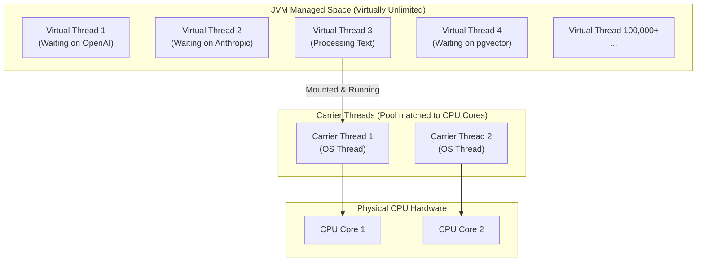

# Day_07 — Concurrency, Virtual Threads

| ⬅️ Previous Day | 📚 Course Hub | ➡️ Next Day |
|:---|:---:|---:|
| [← Day 06: Functional Programming & Streams](../Day_06_Functional_Programming_Streams/Day_06_Functional_Programming_Streams.md) | [All 60 Days Overview](../../README.md) | [Day 08: I/O, HTTP Client, JSON & Testing →](../Day_08_IO_HTTP_JSON_Testing/Day_08_IO_HTTP_JSON_Testing.md) |

---

## 🎯 What You'll Understand By the End
- Why traditional **Platform Threads** break when an enterprise AI app handles thousands of concurrent LLM API calls.
- How **Virtual Threads** (Java 21 / Project Loom) let you spin up 100,000+ concurrent tasks with virtually zero memory overhead.
- How to write simple, sequential, blocking code that performs like complex asynchronous reactive code.
- What **Race Conditions** are, and how to protect shared counters using `AtomicInteger`.
- The "Thread Pinning" trap and why modern Java prefers `ReentrantLock` over `synchronized`.

---

## 🧠 The Problem This Solves

When an application calls an LLM (like OpenAI or Anthropic), the response does not return in milliseconds. Generating tokens over a network takes **1 to 10 full seconds** of waiting for I/O (Input/Output).

In traditional Java:
- Every thread is a **Platform Thread**, mapped 1-to-1 to an Operating System (OS) kernel thread.
- Each platform thread consumes roughly **1 MB of reserved memory** on the Stack.
- If 5,000 users send prompts at the same time, your server needs 5,000 OS threads. 5,000 threads $\times$ 1 MB $\approx$ 5 GB of memory just sitting completely idle, frozen while waiting for network packets to return!
- If load spikes to 10,000 concurrent requests, your server crashes with `java.lang.OutOfMemoryError: unable to create native thread`.

To survive, developers previously had to rewrite entire systems using complex "reactive" frameworks (like WebFlux/RxJava), which turned simple code into difficult-to-debug callback mazes.

**Virtual Threads** (introduced as a core feature in Java 21) completely solve this problem.

---

## 📖 Core Concept, Explained Simply

### The Freight Train vs. Digital Phone Calls Analogy

Imagine managing package delivery:

- **Traditional Platform Threads (The Freight Truck)**:
  - An OS thread is like assigning an entire 18-wheeler truck and driver to deliver a single letter.
  - While waiting at a customer's gate for 10 minutes (network waiting), the massive truck sits parked in the street, blocking traffic and burning resources.
  - Your company can afford only 200 trucks before the entire city street grid gridlocks.
- **Virtual Threads (The Digital Phone Call)**:
  - A Virtual Thread is like a digital phone line managed entirely inside the JVM's software.
  - A handful of physical trucks (called **Carrier Threads**, matched to your CPU core count) do the actual work.
  - When your virtual thread calls an AI endpoint and waits for network response data, the JVM instantly parks the virtual thread on the Heap and assigns the carrier truck to other work!
  - When the AI data arrives, the JVM wakes your virtual thread and resumes execution seamlessly.
  - You can run **millions** of virtual threads without exhausting your operating system.

### Concurrency Safety: Race Conditions

When multiple threads access and update a shared variable (like a counter tracking total tokens used) at the same exact time:
- Thread A reads `count = 5`.
- Thread B reads `count = 5`.
- Thread A writes `5 + 1 = 6`.
- Thread B writes `5 + 1 = 6`.
- Two prompts were processed, but the counter only went up by 1! This data corruption bug is a **Race Condition**.

To prevent this, Java provides atomic variables like **`AtomicInteger`**, which use hardware-level CPU instructions to ensure increments are indivisible and thread-safe.

> 💡 **New Word Alert — "Thread"**: The smallest sequence of programmed instructions that can be managed independently by a scheduler.

> 💡 **New Word Alert — "Virtual Thread"**: A lightweight thread managed by the JVM rather than the OS kernel, enabling high-throughput concurrent I/O applications.

---

## 🗺️ Visual Overview



*This diagram contrasts Virtual Threads with hardware threads. The JVM schedules thousands of lightweight Virtual Threads onto a tiny pool of Carrier Threads. When a Virtual Thread waits for an AI network response, it is unmounted so the Carrier Thread can execute other tasks.*

---

## 💻 Code Walkthrough

Here is a complete Java 21 program launching 1,000 simulated concurrent AI API calls using a Virtual Thread Executor:

```java
import java.time.Duration;
import java.time.Instant;
import java.util.concurrent.Executors;
import java.util.concurrent.atomic.AtomicInteger;

public class VirtualThreadAiDemo {
    public static void main(String[] args) {
        int totalRequests = 1_000;
        AtomicInteger successfulCalls = new AtomicInteger(0);
        Instant start = Instant.now();

        // 1. Create a modern Java 21 Virtual Thread Executor
        try (var executor = Executors.newVirtualThreadPerTaskExecutor()) {
            for (int i = 1; i <= totalRequests; i++) {
                final int requestId = i;
                
                // Submit a blocking task to a virtual thread
                executor.submit(() -> {
                    simulateAiCall(requestId);
                    successfulCalls.incrementAndGet(); // Thread-safe atomic increment
                });
            }
        } // 2. The try-with-resources block automatically waits for ALL 1,000 threads to finish!

        Duration timeTaken = Duration.between(start, Instant.now());
        System.out.println("Completed " + successfulCalls.get() + " AI requests in: " 
                           + timeTaken.toMillis() + " ms");
    }

    // Simulates a 1-second blocking network call to an LLM
    private static void simulateAiCall(int id) {
        try {
            Thread.sleep(1000); // Blocks virtual thread, but NOT the OS carrier thread!
        } catch (InterruptedException e) {
            Thread.currentThread().interrupt();
        }
    }
}
```

### Line-by-Line Breakdown

| Code Statement | Plain-English Explanation |
|:---|:---|
| `AtomicInteger successfulCalls = new AtomicInteger(0);` | A thread-safe integer. Guarantees that concurrent updates from 1,000 threads will never drop an increment. |
| `Executors.newVirtualThreadPerTaskExecutor()` | Creates an executor that spawns a brand-new lightweight **Virtual Thread** for every single submitted task. |
| `try (var executor = ...)` | Java's `try-with-resources` construct. Closing the executor blocks until all submitted virtual threads complete their execution. |
| `executor.submit(() -> ...)` | Dispatches the task to run concurrently on its own virtual thread. |
| `Thread.sleep(1000);` | Simulates waiting for an AI model's HTTP response. Crucially, the JVM unmounts the virtual thread, freeing the underlying carrier thread! |
| `successfulCalls.incrementAndGet();` | Atomically adds 1 to the counter without needing bulky lock blocks. |

*Result*: 1,000 blocking 1-second network calls complete in approximately **1.1 seconds total**, rather than 1,000 seconds sequentially!

---

## 🔑 Key Terminology

| Term | Plain-English Meaning |
|:---|:---|
| **Platform Thread** | A traditional Java thread mapped directly to an operating system kernel thread; resource-heavy (~1MB stack). |
| **Virtual Thread** | A lightweight thread managed by the JVM; consumes only a few hundred bytes of heap memory. |
| **Carrier Thread** | The underlying OS platform thread that actually executes the bytecode of a virtual thread. |
| **Race Condition** | A concurrency bug where the output depends on the uncontrolled order of thread execution. |
| **`AtomicInteger`** | A utility class providing lock-free, atomic operations on an underlying integer value. |
| **Thread Pinning** | A situation where a virtual thread is blocked inside native code or a `synchronized` block and cannot be unmounted from its carrier thread. |

---

## ⚠️ Common Beginner Mistakes

### 1. Pooling Virtual Threads
In older Java, developers pooled platform threads (`Executors.newFixedThreadPool(50)`) because OS threads are expensive to create. **Never pool virtual threads!**

❌ **Wrong Way**:
```java
// Anti-pattern: Pooling virtual threads!
ExecutorService pool = Executors.newFixedThreadPool(100, Thread.ofVirtual().factory());
```

✅ **Right Way**:
```java
// Correct: Create a new virtual thread for every single task!
ExecutorService executor = Executors.newVirtualThreadPerTaskExecutor();
```
*Why it is wrong*: Virtual threads are practically free to create and destroy. Pooling them adds useless overhead and limits concurrency.

---

### 2. Using `count++` Across Multiple Threads
Standard primitive increments (`count++`) are **not atomic**. They consist of 3 separate CPU steps: read, modify, and write.

❌ **Wrong Way**:
```java
int sharedTokenCount = 0;
// In multiple threads:
sharedTokenCount++; // Data loss! Threads overwrite each other's increments.
```

✅ **Right Way**:
```java
AtomicInteger sharedTokenCount = new AtomicInteger(0);
// In multiple threads:
sharedTokenCount.incrementAndGet(); // Thread-safe and fast!
```

---

### 3. Pinning Carrier Threads with `synchronized` Blocks
In Java 21, if a virtual thread enters a `synchronized` block and performs a blocking network I/O call, it "pins" its carrier thread, preventing other virtual threads from using that CPU core.

❌ **Risk of Pinning**:
```java
synchronized (lock) {
    callOpenAiApiOverNetwork(); // Pins carrier thread during network wait!
}
```

✅ **Right Way**:
```java
import java.util.concurrent.locks.ReentrantLock;

private final ReentrantLock lock = new ReentrantLock();

lock.lock();
try {
    callOpenAiApiOverNetwork(); // Does NOT pin the carrier thread!
} finally {
    lock.unlock();
}
```

---

## ✅ Best Practices

1. **Use Virtual Threads for I/O Bound Tasks**: Virtual threads are ideal for waiting on HTTP APIs, databases, vector stores, and files. For pure CPU math (like video rendering or matrix multiplication), standard platform thread pools remain appropriate.
2. **Write Simple, Straightforward Blocking Code**: Do not write complex reactive callback chains. With virtual threads, simple sequential code (`response = client.send(...)`) executes with maximum concurrency.
3. **Use Structured Concurrency via `try-with-resources`**: Always wrap `Executors.newVirtualThreadPerTaskExecutor()` in a `try-with-resources` block to ensure all spawned tasks are cleaned up cleanly.

---

## 🔭 Looking Ahead
In **Day_08**, we will use our concurrency knowledge to build an industrial-grade **HTTP Client**, parse **JSON** payloads from live AI endpoints, and write automated **Unit Tests**.

---

## 📝 Quick Recap
- **Platform Threads** are heavy (~1MB) OS threads that exhaust memory when scaled to thousands of concurrent users.
- **Virtual Threads** are lightweight JVM entities that unmount during I/O waits, letting a tiny pool of carrier threads handle hundreds of thousands of tasks.
- Never pool virtual threads — create one per task using `Executors.newVirtualThreadPerTaskExecutor()`.
- Use **`AtomicInteger`** or **`AtomicLong`** to prevent race conditions on shared counters.
- Prefer **`ReentrantLock`** over `synchronized` to avoid thread pinning during network calls.

---

## 🧪 Try It Yourself

1. **Simulate Concurrent Embeddings**: Write a program that submits 500 tasks to a virtual thread executor. Each task sleeps for 500ms (simulating an embedding calculation) and records its completion. Measure the total execution time.
2. **Break and Fix a Race Condition**: Create an integer `int counter = 0;` and increment it 10,000 times across 10 virtual threads. Print the result (observe it is less than 10,000!). Then fix it using `AtomicInteger`.
3. **Thread Inspector**: Print `Thread.currentThread()` inside a virtual thread to inspect its name and observe which carrier thread (`ForkJoinPool-1-worker-...`) is hosting it.
