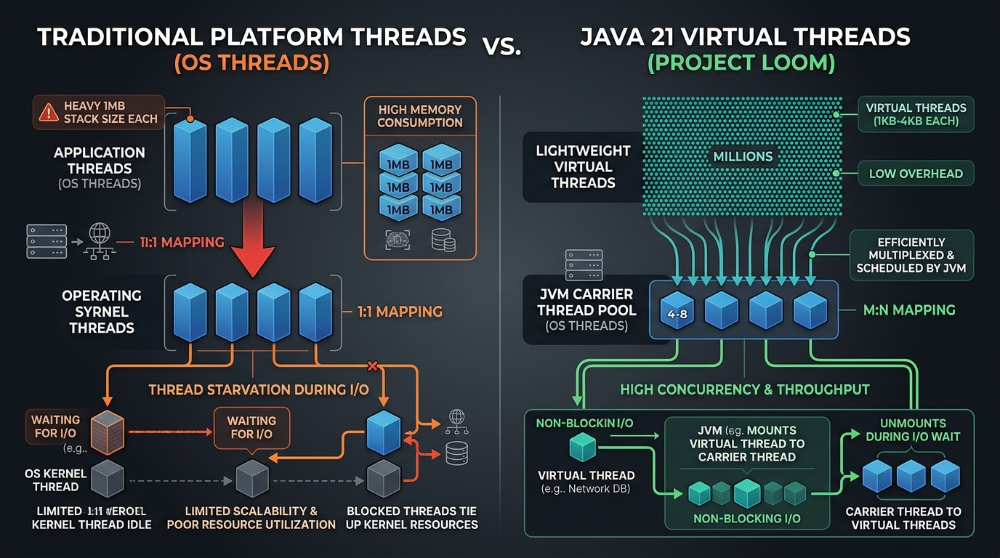

# 🧵 Day 07: Concurrency & Virtual Threads
## Project Loom — 10,000 Concurrent LLM Calls on a Single Server

| ⬅️ Previous Day | 📚 Course Hub | ➡️ Next Day |
|:---|:---:|---:|
| [← Day 06: Functional Programming & Stream API](../Day_06_Functional_Programming_Streams/Day_06_Functional_Programming_Streams.md) | [All 60 Days Overview](../../README.md) | [Day 08: I/O, HTTP Client, JSON & Testing →](../Day_08_IO_HTTP_JSON_Testing/Day_08_IO_HTTP_JSON_Testing.md) |

[](../../README.md)
[](../../README.md)
[](../../README.md)
[-purple.svg?style=for-the-badge)](../../README.md)

---

## 📌 What Will You Learn Today?

Generative AI applications have a unique workload profile: **They are overwhelmingly I/O-bound**.

When your backend sends a prompt to an LLM (e.g., OpenAI, Claude, or a local Ollama instance), your code does **almost zero CPU computation** while waiting. It simply waits over a network socket for 1 to 5 seconds while the model generates tokens.

In traditional programming languages and older Java:
- If 5,000 users ask a question at the same time, you need 5,000 operating system threads.
- 5,000 OS threads consume **5 to 10 Gigabytes of RAM** just for thread stack memory!
- The operating system spends more CPU time **context switching** between threads than doing actual work. Your server crashes with `OutOfMemoryError: unable to create native thread`.

**Java 21 solved this forever with Virtual Threads (Project Loom).**

By the end of today, you will master:
- ✅ **The Threading Problem in AI**: Why blocking I/O crushes traditional architectures.
- ✅ **Platform Threads vs. Virtual Threads**: 1MB OS stack vs. 200-byte JVM user-space thread.
- ✅ **The Carrier Thread Model**: How the JVM unmounts waiting threads from physical CPU cores.
- ✅ **`Executors.newVirtualThreadPerTaskExecutor()`**: Writing simple synchronous-looking code that scales to 100,000 concurrent requests.
- ✅ **Async Pipelines with `CompletableFuture`**: Querying multiple LLMs in parallel (Fan-Out/Fan-In).
- ✅ **Thread Safety & Race Conditions**: `AtomicLong` and thread confinement for token rate-limiters.
- ✅ **Why Virtual Threads Make Java King of Enterprise AI**: Comparing Java's throughput against Python's single-core GIL bottleneck.

---

## 🗺️ Table of Contents

- [1. Real-World Analogy: The Restaurant Waiter vs. The Dedicated Butler](#1-real-world-analogy-the-restaurant-waiter-vs-the-dedicated-butler)
- [2. The Concurrency Crisis in Generative AI](#2-the-concurrency-crisis-in-generative-ai)
  - [2.1 Why LLM Calls Are Different from Normal Database Calls](#21-why-llm-calls-are-different-from-normal-database-calls)
  - [2.2 The OS Platform Thread Limit](#22-the-os-platform-thread-limit)
- [3. Virtual Threads (Project Loom) Explained](#3-virtual-threads-project-loom-explained)
  - [3.1 How Virtual Threads Work Under the Hood](#31-how-virtual-threads-work-under-the-hood)
  - [3.2 Mounting and Unmounting on Carrier Threads](#32-mounting-and-unmounting-on-carrier-threads)
  - [3.3 Spawning 10,000 Virtual Threads in 3 Lines](#33-spawning-10000-virtual-threads-in-3-lines)
- [4. Asynchronous Composition with `CompletableFuture`](#4-asynchronous-composition-with-completablefuture)
  - [4.1 Parallel LLM Queries (Fan-Out / Fan-In)](#41-parallel-llm-queries-fan-out--fan-in)
  - [4.2 Chaining Async Steps: `thenApply`, `thenCompose`](#42-chaining-async-steps-thenapply-thencompose)
- [5. Thread Safety in Multi-User AI Backends](#5-thread-safety-in-multi-user-ai-backends)
  - [5.1 The Race Condition Threat](#51-the-race-condition-threat)
  - [5.2 Atomic Operations (`AtomicLong`, `AtomicInteger`)](#52-atomic-operations-atomiclong-atomicinteger)
- [6. Python GIL vs. Java Virtual Threads: The Production Truth](#6-python-gil-vs-java-virtual-threads-the-production-truth)
- [7. Key Takeaways & Summary](#7-key-takeaways--summary)
- [8. Practice Exercises & Full Solutions](#8-practice-exercises--full-solutions)
- [9. Self-Check Quiz](#9-self-check-quiz)
- [10. 🔥 Java 8 CompletableFuture vs. Java 21 Virtual Threads Interview Masterclass](#10--java-8-completablefuture-vs-java-21-virtual-threads-interview-masterclass)
  - [10.1 Top 7 Concurrency Interview Questions & In-Depth Answers](#101-top-7-concurrency-interview-questions--in-depth-answers)

---

# 1. Real-World Analogy: The Restaurant Waiter vs. The Dedicated Butler

```
                     PLATFORM THREADS (The Dedicated Butler)
┌─────────────────────────────────────────────────────────────────────────────┐
│ You hire 1 personal butler for each customer. When a customer orders steak, │
│ the butler walks to the kitchen and STANDS IDLE for 30 minutes staring at   │
│ the oven. You need 1,000 butlers for 1,000 customers! Payroll goes bankrupt.│
└─────────────────────────────────────────────────────────────────────────────┘
                                      vs.
                     VIRTUAL THREADS (The Master Waiter)
┌─────────────────────────────────────────────────────────────────────────────┐
│ You hire 8 master waiters (Carrier Threads). When Table 1 orders steak, the │
│ waiter submits the ticket to the kitchen, immediately walks to Table 2 to   │
│ take their order, delivers water to Table 3, and returns to Table 1 only    │
│ when the bell rings that the steak is ready!                                │
└─────────────────────────────────────────────────────────────────────────────┘
```

In Java 21:
- The **Customers** are your incoming HTTP requests from users.
- The **Kitchen** is OpenAI / Ollama generating tokens over the network.
- The **Waiters** are your 8 physical CPU cores.
- **Virtual Threads** allow millions of customer orders to be handled without needing a million physical waiters!

---

# 2. The Concurrency Crisis in Generative AI

### 2.1 Why LLM Calls Are Different from Normal Database Calls

| Request Type | Typical Latency | What Thread Does During Latency |
| :--- | :---: | :--- |
| **PostgreSQL DB Query** | 2 ms – 10 ms | Waits briefly for indexed query |
| **Redis Cache Lookup** | 0.5 ms – 1 ms | Near instantaneous |
| **LLM Generation (GPT-4o)** | **2,000 ms – 10,000 ms** | **Sits completely frozen doing zero CPU work!** |

Because LLM generation takes seconds instead of milliseconds, threads pile up. If 1,000 users connect, 1,000 threads are stuck waiting simultaneously.

---

### 2.2 The OS Platform Thread Limit

A traditional Java thread (`new Thread()`) is a direct wrapper around an **Operating System kernel thread**.
- **Memory footprint**: Each OS thread allocates **1 MB to 2 MB of stack space** off-heap.
  - 1,000 threads $\approx$ 1 GB RAM.
  - 10,000 threads $\approx$ 10 GB to 20 GB RAM!
- **Context-Switching Overhead**: The Linux or Windows kernel must save CPU registers, switch page tables, and restore state thousands of times per second.

---

# 3. Virtual Threads (Project Loom) Explained

Let's look at how Java 21 changes concurrency forever:



### 💡 The Mid-Level Java Developer Bridge: How Your Concurrency Code Changes

In Core Java, you were taught to be terrified of creating threads:
> *"Never do `new Thread()`! Always use an `ExecutorService` with a fixed pool of 50 or 100 threads, or your server will crash with `OutOfMemoryError: unable to create native thread`!"*

Here is the exact code change in Java 21:

#### The Old Core Java Way (Heavy OS Pool):
```java
// OLD WAY: You must limit to 50 threads because each thread costs 1MB of RAM!
// If 51 requests arrive, request #51 sits in a queue waiting.
ExecutorService executor = Executors.newFixedThreadPool(50);
```

#### The Modern Java 21 Way (Virtual Threads):
```java
// MODERN WAY: Each virtual thread costs ~1KB of RAM!
// You can spawn 100,000 virtual threads without breaking a sweat!
ExecutorService executor = Executors.newVirtualThreadPerTaskExecutor();
```

---

### 💡 Plain-English Glossary: Virtual Threads Demystified

| Term | Plain-English Translation | Real-World Analogy |
| :--- | :--- | :--- |
| **Platform Thread (OS Thread)** | A heavy thread allocated directly by Windows/Linux. Costs 1MB to 2MB RAM. | A massive semi-truck. Great for hauling, but takes up an entire highway lane. |
| **Virtual Thread** | A featherweight thread created in Java heap memory. Costs ~1KB RAM. | A person on a bicycle. You can fit 1,000 bicycles in the space of one semi-truck. |
| **Carrier Thread** | The underlying OS thread (usually equal to your CPU cores, e.g. 8 or 16) that physically runs virtual threads. | The highway lane that bicycles ride on. |
| **Mounting & Unmounting** | When your code makes an LLM network call or `Thread.sleep()`, the JVM immediately parks the virtual thread and assigns the carrier thread to work on another user! | Stepping off the bicycle while waiting at a red light so someone else can use the lane. |

---

### 3.1 How Virtual Threads Work Under the Hood

Virtual threads are **user-space threads** managed entirely by the **Java Virtual Machine (JVM)**, completely detached from the operating system kernel.

```
┌────────────────────────────────────────────────────────────────────────┐
│                        JVM USER-SPACE MEMORY                           │
│                                                                        │
│   [VT 1]   [VT 2]   [VT 3]   [VT 4]   ...   [VT 100,000]               │
│   (Tiny: ~250 bytes stack per virtual thread, stored in Java Heap)     │
└───────────────────────────────────┬────────────────────────────────────┘
                                    │
                         Mounts & Unmounts dynamically
                                    │
                                    ▼
┌────────────────────────────────────────────────────────────────────────┐
│                   CARRIER THREADS (ForkJoinPool)                       │
│                   Pool size = Number of CPU Cores (e.g. 16 cores)      │
│   [Core 1]  [Core 2]  [Core 3]  ...  [Core 16]                         │
└───────────────────────────────────┬────────────────────────────────────┘
                                    │
                                    ▼
┌────────────────────────────────────────────────────────────────────────┐
│                    OS KERNEL & PHYSICAL HARDWARE                       │
└────────────────────────────────────────────────────────────────────────┘
```

1. **Stack Memory**: Starts at just **~250 to 300 bytes** (grows dynamically on the Heap only when needed).
2. **Mounting**: When a virtual thread has CPU code to run, the JVM mounts it onto an available OS **Carrier Thread**.
3. **Unmounting (The Secret Sauce)**: When the virtual thread makes a blocking call (e.g., `socket.read()`, `HttpClient.send()`, `Thread.sleep()`), the JVM **unmounts** the virtual thread, preserves its stack frame on the Heap, and frees the Carrier Thread immediately to run other tasks!
4. When network data arrives from OpenAI, the JVM wakes up the virtual thread and mounts it onto any available carrier thread to resume execution.

---

### 3.2 Spawning 10,000 Virtual Threads in 3 Lines

Look at how simple it is in modern Java 21:

```java
package com.javagenai.day07;

import java.time.Duration;
import java.time.Instant;
import java.util.concurrent.Executors;

public class VirtualThreadScaleDemo {

    public static void main(String[] args) {
        Instant start = Instant.now();

        // 1. Create a virtual thread executor
        try (var executor = Executors.newVirtualThreadPerTaskExecutor()) {
            for (int i = 1; i <= 10_000; i++) {
                final int taskId = i;
                executor.submit(() -> {
                    // Simulating 1 second of blocking network I/O from an LLM call
                    Thread.sleep(Duration.ofSeconds(1));
                    if (taskId % 2000 == 0) {
                        System.out.printf("Completed simulated LLM call #%,d on %s%n", 
                                          taskId, Thread.currentThread());
                    }
                    return taskId;
                });
            }
        } // try-with-resources automatically waits for ALL 10,000 tasks to finish!

        Duration elapsed = Duration.between(start, Instant.now());
        System.out.printf("Finished 10,000 concurrent LLM calls in: %d ms!%n", elapsed.toMillis());
    }
}
```

**Output on a standard laptop:**
```text
Completed simulated LLM call #2,000 on VirtualThread[#2047]/runnable@ForkJoinPool-1-worker-3
Completed simulated LLM call #4,000 on VirtualThread[#4051]/runnable@ForkJoinPool-1-worker-7
Completed simulated LLM call #6,000 on VirtualThread[#6055]/runnable@ForkJoinPool-1-worker-1
Completed simulated LLM call #8,000 on VirtualThread[#8059]/runnable@ForkJoinPool-1-worker-5
Completed simulated LLM call #10,000 on VirtualThread[#10063]/runnable@ForkJoinPool-1-worker-2
Finished 10,000 concurrent LLM calls in: 1420 ms!
```

> **10,000 simulated LLM requests completed in ~1.4 seconds with negligible RAM usage.** If you attempted this with platform threads, your operating system would freeze or crash.

---

# 4. Asynchronous Composition with `CompletableFuture`

Sometimes you need to coordinate multiple AI tasks simultaneously:
- Query **OpenAI** AND **Claude** at the exact same time.
- Retrieve the **fastest response**, or combine both outputs for consensus verification.

### 4.1 Parallel LLM Queries (Fan-Out / Fan-In)

```java
package com.javagenai.day07;

import java.util.concurrent.CompletableFuture;

public class AsyncModelEnsemble {

    public static CompletableFuture<String> callOpenAI(String prompt) {
        return CompletableFuture.supplyAsync(() -> {
            simulateNetworkDelay(500); // 500ms
            return "[OpenAI Result: 42]";
        });
    }

    public static CompletableFuture<String> callClaude(String prompt) {
        return CompletableFuture.supplyAsync(() -> {
            simulateNetworkDelay(800); // 800ms
            return "[Claude Result: 42]";
        });
    }

    public static void main(String[] args) {
        String prompt = "Calculate the optimal batch size.";

        // Fan-Out: Launch both simultaneously
        CompletableFuture<String> openAiFuture = callOpenAI(prompt);
        CompletableFuture<String> claudeFuture = callClaude(prompt);

        // Fan-In: Combine results when BOTH complete!
        CompletableFuture<String> consensus = openAiFuture.thenCombine(
            claudeFuture, 
            (res1, res2) -> "Consensus Verified: " + res1 + " == " + res2
        );

        System.out.println(consensus.join()); // Blocks only until both are done!
    }

    private static void simulateNetworkDelay(int ms) {
        try { Thread.sleep(ms); } catch (InterruptedException ignored) {}
    }
}
```

---

### 4.2 Chaining Async Steps: `thenApply`, `thenCompose`

In RAG pipelines, you often chain sequential async steps:
`Fetch User Query` $\rightarrow$ `Generate Embeddings` $\rightarrow$ `Search Vector DB` $\rightarrow$ `Synthesize Answer`.

```java
CompletableFuture<String> answerPipeline = CompletableFuture
    .supplyAsync(() -> fetchUserPrompt())
    .thenApply(prompt -> cleanText(prompt))
    .thenCompose(cleaned -> queryVectorStoreAsync(cleaned))
    .thenApply(context -> generateLLMResponse(context));
```

---

# 5. Thread Safety in Multi-User AI Backends

### 5.1 The Race Condition Threat

Imagine a shared counter tracking the number of tokens used today across 10,000 concurrent web requests:

```java
// BROKEN: Not thread-safe!
public class BadTokenTracker {
    private long totalTokens = 0;

    public void recordUsage(long tokens) {
        totalTokens += tokens; // READ -> MODIFY -> WRITE race condition!
    }
}
```
Two threads reading `totalTokens` at the same time will overwrite each other's increments, undercounting your token bill by 30%!

---

### 5.2 Atomic Operations (`AtomicLong`, `AtomicInteger`)

Instead of heavy locks (`synchronized`), modern Java provides **lock-free atomic variables** backed by CPU-level **Compare-And-Swap (CAS)** machine instructions:

```java
package com.javagenai.day07;

import java.util.concurrent.atomic.AtomicLong;

public class AtomicTokenBudget {
    private final AtomicLong tokensConsumed = new AtomicLong(0);
    private final long maxBudgetTokens;

    public AtomicTokenBudget(long maxBudgetTokens) {
        this.maxBudgetTokens = maxBudgetTokens;
    }

    public boolean tryConsume(long tokens) {
        while (true) {
            long current = tokensConsumed.get();
            if (current + tokens > maxBudgetTokens) {
                return false; // Budget exceeded!
            }
            // Atomically update only if another thread hasn't changed it in between
            if (tokensConsumed.compareAndSet(current, current + tokens)) {
                return true;
            }
        }
    }

    public long getTokensConsumed() {
        return tokensConsumed.get();
    }
}
```

---

# 6. Python GIL vs. Java Virtual Threads: The Production Truth

Why are enterprise backend teams choosing Java over Python for production AI microservices?

| Feature | Python (FastAPI / asyncio) | Java 21 (Spring Boot + Virtual Threads) |
| :--- | :--- | :--- |
| **Concurrency Model** | Single-threaded Event Loop + GIL | Multi-Core Virtual Threads (Zero GIL) |
| **Syntax Style** | Async/Await coloring (`async def`, `await`) | **Plain synchronous code** (`chatModel.call()`) that scales automatically! |
| **Thread Debugging** | Stack traces across `asyncio` are fragmented | Clean, standard Java stack traces |
| **CPU Utilization** | Limited to 1 core unless multi-process | Automatically spreads across all 16–128 CPU cores |
| **Throughput** | ~5,000 concurrent connections before degradation | **100,000+ concurrent connections on a single JVM** |

> In Java 21, you **never** have to color your functions with `async` and `await`. You write plain, straightforward, readable blocking code—and the JVM makes it non-blocking under the hood!

---

# 7. Key Takeaways & Summary

```
                  ┌─────────────────────────────────┐
                  │       DAY 07 CHEAT SHEET        │
                  └────────────────┬────────────────┘
                                   │
         ┌─────────────────────────┼─────────────────────────┐
         ▼                         ▼                         ▼
  [ Virtual Threads ]       [ CompletableFuture ]     [ Thread Safety ]
  • Lightweight user-space  • Fan-Out / Fan-In for    • AtomicLong / AtomicInt
    threads (~250 bytes)      multi-model consensus     for lock-free counters
  • Unmounts on blocking    • supplyAsync: non-block  • ConcurrentHashMap for
    network I/O sockets       execution                 thread-safe caches
  • Scale to 100,000+       • thenCombine: merge two  • No async/await syntax
    concurrent LLM streams    independent async tasks   coloring needed
```

---

# 8. Practice Exercises & Full Solutions

### 🏋️ Exercise 1: Build a Multi-Model Race Controller
**Objective**: Query two simulated LLM endpoints (`FastDraftModel` and `SlowDeepModel`) simultaneously. Return whichever result finishes first using `CompletableFuture.anyOf()`.

#### Solution:
```java
package com.javagenai.day07;

import java.util.concurrent.CompletableFuture;

public class ModelRaceController {

    public static CompletableFuture<String> queryModel(String modelName, int delayMs, String response) {
        return CompletableFuture.supplyAsync(() -> {
            try { Thread.sleep(delayMs); } catch (InterruptedException ignored) {}
            return String.format("[%s]: %s (latency: %dms)", modelName, response, delayMs);
        });
    }

    public static String getFastestResponse(String prompt) {
        CompletableFuture<String> fastModel = queryModel("Llama-3.2-1B", 150, "Quick summary");
        CompletableFuture<String> slowModel = queryModel("GPT-4o-Heavy", 600, "In-depth treatise");

        // anyOf returns when the FIRST one finishes
        Object winner = CompletableFuture.anyOf(fastModel, slowModel).join();
        return (String) winner;
    }
}
```

---

### 🏋️ Exercise 2: Virtual Thread Batch Document Embedding Simulator
**Objective**: Write a method that simulates embedding 500 documents concurrently with a 200ms network delay each, measuring total time taken with `Executors.newVirtualThreadPerTaskExecutor()`.

#### Solution:
```java
package com.javagenai.day07;

import java.time.Duration;
import java.time.Instant;
import java.util.List;
import java.util.concurrent.Executors;

public class BatchEmbeddingSimulator {

    public static Duration simulateBatchEmbedding(int documentCount, int delayMs) {
        Instant start = Instant.now();

        try (var executor = Executors.newVirtualThreadPerTaskExecutor()) {
            for (int i = 0; i < documentCount; i++) {
                final int id = i;
                executor.submit(() -> {
                    try {
                        Thread.sleep(delayMs);
                    } catch (InterruptedException ignored) {}
                    return "embedding_vector_" + id;
                });
            }
        }

        return Duration.between(start, Instant.now());
    }
}
```

---

## 9. Self-Check Quiz

1. **Why do Virtual Threads solve the memory problem of platform threads?**
   - *Answer*: Platform threads allocate 1MB–2MB of fixed OS stack memory. Virtual threads start at only ~250 bytes of heap memory, growing dynamically, allowing millions of threads to coexist without memory exhaustion.
2. **What happens when a Virtual Thread makes a blocking call like `socket.read()`?**
   - *Answer*: The JVM unmounts the virtual thread from its underlying OS carrier thread, parking its state on the heap, allowing the carrier thread to immediately execute other virtual threads.
3. **What is the purpose of `CompletableFuture.thenCombine()`?**
   - *Answer*: It runs two independent asynchronous operations in parallel and combines their results with a BiFunction when both complete.
4. **Why is `totalTokens++` not thread-safe in a multi-threaded web application?**
   - *Answer*: Because `++` is not an atomic operation. It consists of three distinct steps: read current value, increment, write back. Multiple threads will read the same initial value and overwrite each other.
5. **How do Java Virtual Threads compare to Python's `asyncio`?**
   - *Answer*: Java Virtual Threads require zero syntax changes (`async`/`await` coloring) and run on multiple CPU cores without a Global Interpreter Lock (GIL), while Python's `asyncio` is confined to a single core and requires colored functions.

---

---

# 10. 🔥 Java 8 CompletableFuture vs. Java 21 Virtual Threads Interview Masterclass

Concurrency is one of the highest-weight topics in technical interviews. Interviewers will test your depth on Java 8's asynchronous `CompletableFuture` API and how Java 21's Virtual Threads revolutionize modern concurrency.

Here are the **Top 7 Concurrency Interview Questions**:

---

### 10.1 Top 7 Concurrency Interview Questions & In-Depth Answers

#### 💡 Q1: Why was `CompletableFuture` introduced in Java 8 to replace Java 5's `Future<T>`?
**Answer**:
Java 5's standard `Future<T>` had severe architectural limitations:
1. **Blocking by Nature**: The only way to retrieve a value was `future.get()`, which blocks the calling thread until completion.
2. **No Chaining or Pipelining**: You could not trigger an action automatically when the future finished without manually polling or blocking.
3. **Cannot Combine Multiple Futures**: There was no native way to say: *"When Future A and Future B both complete, combine them and run Future C."*
4. **No Exception Handling Pipeline**: No functional way to catch exceptions (`.exceptionally()`, `.handle()`).

**Java 8 Solution**: `CompletableFuture<T>` introduced non-blocking callback chaining, reactive composition (`thenApply`, `thenCompose`, `thenCombine`), and explicit manual completion (`future.complete(val)`).

---

#### 💡 Q2: What is the difference between `supplyAsync()` and `runAsync()`?
**Answer**:
- **`CompletableFuture.supplyAsync(Supplier<U>)`**: Takes a `Supplier<U>` (which returns a value) and runs it asynchronously. Returns `CompletableFuture<U>`.
- **`CompletableFuture.runAsync(Runnable)`**: Takes a `Runnable` (which returns `void`) and runs it asynchronously. Returns `CompletableFuture<Void>`.

```java
// Produces a result:
CompletableFuture<String> dataFuture = CompletableFuture.supplyAsync(() -> fetchVectorFromDb());

// Performs a background fire-and-forget task (logging, metrics):
CompletableFuture<Void> logFuture = CompletableFuture.runAsync(() -> sendMetricsToDatadog());
```

---

#### 💡 Q3: What is the difference between `thenApply()`, `thenCompose()`, and `thenCombine()`? (The Big Three!)
**Answer**:
This is tested in almost every senior Java interview:

| Method | Analogy | Input Function | Purpose | Return Type |
| :--- | :--- | :--- | :--- | :--- |
| **`thenApply()`** | Like Stream `map()` | `Function<T, U>` | Synchronous transformation of the completed result. | `CompletableFuture<U>` |
| **`thenCompose()`** | Like Stream `flatMap()` | `Function<T, CompletableFuture<U>>` | Chains dependent async operations where step 2 depends on step 1 and returns another Future. Prevents nested `CompletableFuture<CompletableFuture<U>>`. | `CompletableFuture<U>` |
| **`thenCombine()`** | Parallel Fork-Join | `BiFunction<T, U, V>` | Executes two independent futures concurrently and combines their outputs when both finish. | `CompletableFuture<V>` |

```java
// 1. thenApply: Map String to Integer
CompletableFuture<Integer> length = CompletableFuture.supplyAsync(() -> "hello")
    .thenApply(String::length);

// 2. thenCompose: Chain another async task (avoid nesting!)
CompletableFuture<String> summary = CompletableFuture.supplyAsync(() -> fetchArticle(id))
    .thenCompose(article -> callLlmSummaryAsync(article));

// 3. thenCombine: Run two LLM calls in parallel and merge results
CompletableFuture<String> fast = CompletableFuture.supplyAsync(() -> callLlama());
CompletableFuture<String> deep = CompletableFuture.supplyAsync(() -> callGpt4o());
CompletableFuture<String> merged = fast.thenCombine(deep, (r1, r2) -> "Fast: " + r1 + " | Deep: " + r2);
```

---

#### 💡 Q4: What is the difference between `future.get()` and `future.join()`?
**Answer**:
- **`get()`**: Throws **checked exceptions** (`InterruptedException`, `ExecutionException`). Requires clumsy `try-catch` blocks. Supports a timeout: `get(5, TimeUnit.SECONDS)`.
- **`join()`**: Throws an **unchecked exception** (`CompletionException`). Specifically designed for functional pipelines and Stream operations where checked exceptions cannot be thrown:
  ```java
  List<String> results = futures.stream()
      .map(CompletableFuture::join) // Clean! No checked exception handling required!
      .toList();
  ```

---

#### 💡 Q5: What thread pool does `CompletableFuture` use by default? What is the production danger?
**Answer**:
By default, `CompletableFuture.supplyAsync(...)` runs on **`ForkJoinPool.commonPool()`**.

**The Production Danger**:
The common pool is shared across the **entire JVM** and has a fixed thread pool size equal to `Runtime.getRuntime().availableProcessors() - 1` (e.g., 7 threads on an 8-core CPU).
If a developer runs **blocking I/O operations** (like slow LLM REST API calls or JDBC database queries) on the default pool, all common pool threads become blocked. **This starves the entire JVM**, causing other unrelated parts of your application (parallel streams, background tasks) to completely freeze!

**Best Practice**: Always supply a custom `Executor` (or Java 21's Virtual Thread executor):
```java
ExecutorService aiExecutor = Executors.newVirtualThreadPerTaskExecutor();
CompletableFuture.supplyAsync(() -> callOpenAI(prompt), aiExecutor);
```

---

#### 💡 Q6: What is the difference between `CompletableFuture.allOf()` and `CompletableFuture.anyOf()`?
**Answer**:
- **`allOf(Future<?>... cfs)`**: Waits for **ALL** futures to complete. Returns `CompletableFuture<Void>`. To collect results, you map over the original futures and call `.join()`.
- **`anyOf(Future<?>... cfs)`**: Waits for the **FIRST** future to finish (speculative execution / race condition). Returns `CompletableFuture<Object>` containing the fastest result.

---

#### 💡 Q7: If Java 21 has Virtual Threads, is `CompletableFuture` obsolete?
**Answer**:
**NO, but its primary role has changed:**
- **What Virtual Threads Replaced**: Virtual threads make traditional synchronous, blocking code ultra-efficient without thread starvation. You no longer need reactive programming (WebFlux, RxJava) or complex callback chains just to handle thousands of concurrent requests.
- **Where `CompletableFuture` Remains Essential**:
  1. **Async Fan-Out / Fan-In**: Firing 5 parallel LLM queries and combining them (`allOf`, `anyOf`, `thenCombine`).
  2. **Event-Driven Architectures**: Passing a future between decoupled services to be completed asynchronously when a Kafka or WebSocket event arrives (`future.complete(event)`).

---

<p align="center">
  <b>Congratulations on completing Day 07! 🎉</b><br>
  Tomorrow on <b>Day 08</b>, we complete Phase 1 with <b>I/O, Modern HTTP Client, Jackson JSON & Testing (JUnit 5 + Mockito)</b>: The ultimate toolkit for calling real LLM REST APIs!
</p>

