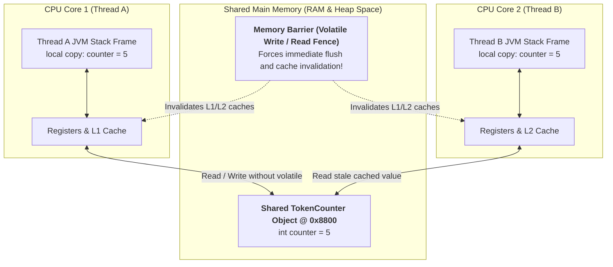
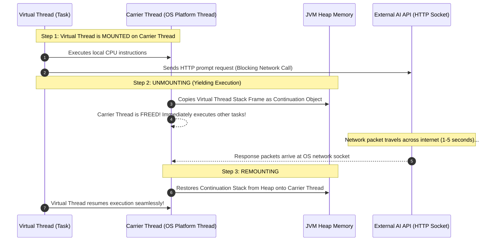

# Phase_01, Day_07 — Concurrency, Multithreading, and Virtual Threads in Memory

| ⬅️ Previous Day | 📚 Course Hub | ➡️ Next Day |
|:---|:---:|---:|
| [← Day 06: Functional Programming & Streams](../Day_06_Functional_Programming_Streams/Day_06_Functional_Programming_Streams.md) | [Course Hub](../../README.md) | [Day 08: I/O, HTTP Client, JSON & Testing Basics →](../Day_08_IO_HTTP_JSON_Testing/Day_08_IO_HTTP_JSON_Testing.md) |

---

## 🎯 What You'll Understand By the End

- The physical memory anatomy of a **Platform Thread**: why each thread consumes a fixed 1 MB OS stack, and why this causes server crashes under heavy concurrent I/O.
- The **Java Memory Model (JMM)**: how thread-local working memory (CPU registers, L1/L2 caches, Stack Frames) interacts with Main Memory (Heap/RAM).
- How the **`volatile`** keyword forces memory barriers and cache invalidation, and why `volatile` guarantees visibility but **not** atomicity.
- How **`synchronized`** operates under the hood via object monitor locks and Object Header Mark Word inflation (thin lock $\rightarrow$ fat OS mutex).
- How atomic variables (`AtomicInteger`) achieve thread safety without locks using hardware **Compare-And-Swap (CAS)** CPU instructions.
- The revolution of **Virtual Threads (Java 21 / Project Loom)**: how continuation call stacks live as lightweight objects on the **Heap** (bytes instead of megabytes), and how mounting/unmounting solves the I/O blocking dilemma.
- The **Thread Pinning** trap and why modern Java architecture replaces `synchronized` with `ReentrantLock`.

---

## 🧠 The Problem This Solves / Why This Comes Up

Building high-scale GenAI systems exposes a fundamental flaw in traditional operating system threading:

### 1. The 1-to-1 Thread Memory Trap
In traditional Java, every Java thread is a **Platform Thread**, mapped 1-to-1 to an Operating System (OS) kernel thread:
- Each platform thread pre-allocates a fixed **1 MB of reserved memory** on the native operating system stack (`-Xss1m`).
- If your AI backend handles 5,000 concurrent user sessions, your server consumes **5 GB of RAM** just to keep the thread stacks alive in memory!
- When traffic spikes to 10,000 concurrent connections, the operating system kernel refuses to allocate more threads, crashing your application with:
  `java.lang.OutOfMemoryError: unable to create native thread`.

### 2. The Blocking I/O Bottleneck in GenAI
Calling a Large Language Model (like OpenAI, Anthropic, or local Ollama) is not a millisecond database query. It takes **1 to 10 full seconds** of waiting for streaming network I/O.
- Under the platform thread model, an expensive 1 MB OS thread sits completely frozen, idle, and blocked on a network socket, burning CPU scheduling cycles and memory.
- Historically, developers had to rewrite applications using complex "reactive" asynchronous frameworks (like WebFlux, Project Reactor) to release threads during I/O. This turned readable, sequential code into unmaintainable callback mazes.

### 3. Silent Data Corruption (Race Conditions)
When multiple threads read and write shared variables on the Heap simultaneously without memory synchronization, CPU hardware caches cause threads to read stale data, leading to corrupted token counts and billing discrepancies.

**Virtual Threads** (Java 21) eliminate the 1-to-1 OS thread limitation, allowing you to write simple, synchronous, blocking code while spinning up **millions** of concurrent lightweight tasks.

---

# Section 1: Concurrency Mental Model & Thread Anatomy in Memory

---

## 🔬 Platform Threads vs. OS Kernel Threads

A **Platform Thread** is a Java wrapper around a native operating system kernel thread (created via `pthread_create` on Linux/macOS or `CreateThread` on Windows).

```
Physical Hardware & OS Reality:
Operating System Kernel
  ├── Native OS Thread 1 ──► Pre-allocates 1 MB Native Stack (Registers, Call Frames)
  ├── Native OS Thread 2 ──► Pre-allocates 1 MB Native Stack
  └── Native OS Thread N ──► Memory limit reached! (Cannot scale beyond ~5,000 threads)
```

- **Thread-Private Memory**: Each platform thread owns an isolated **JVM Stack**. This stack holds method Stack Frames, local primitive variables, and reference pointers. No thread can inspect another thread's stack.
- **Shared Memory**: All threads share the same **Heap Space** and **Metaspace**. Any thread holding a reference pointer can read and write objects on the Heap.
- **Context Switching Cost**: When the OS switches CPU cores between platform threads, it must save CPU registers, switch kernel memory pages, and flush CPU caches, incurring significant latency.

---

## 🗺️ Visual Overview: The Java Memory Model (JMM)

Modern multi-core processors do not read directly from RAM; each CPU core caches data in ultra-fast L1, L2, and L3 hardware caches:



---

# Section 2: Thread Safety & Memory Synchronization

---

## ⚔️ Race Conditions: Why `count++` is Dangerous

Many developers assume a simple increment like `totalTokens++` is atomic. In physical memory, it is actually **three separate bytecode instructions**:

```
1. getfield   # Read value from Heap object into local CPU register (e.g. 5)
2. iadd       # Add 1 in CPU ALU register (5 + 1 = 6)
3. putfield   # Write updated value from register back to Heap memory
```

### The Interleaving Catastrophe:
- **Time 1**: Thread A reads `totalTokens` (5).
- **Time 2**: Thread B reads `totalTokens` (5).
- **Time 3**: Thread A calculates $5 + 1 = 6$ and writes `6` to Heap.
- **Time 4**: Thread B calculates $5 + 1 = 6$ and writes `6` to Heap.
- **Result**: Two AI requests were processed, but the counter increased by only 1! This data loss is a **Race Condition**.

---

## ⚡ The `volatile` Keyword: Visibility vs. Atomicity

Declaring a field `private volatile boolean isRunning = true;` instructs the Java compiler and CPU:

1. **Bypasses CPU Hardware Caches**: Every read of a `volatile` variable reads directly from **Main Memory (RAM)**. Every write flushes immediately through the CPU cache to Main Memory.
2. **Memory Barriers (Hardware Fences)**: Prevents the CPU and JIT compiler from reordering instructions across the barrier.
3. **The Happens-Before Guarantee**: A write to a `volatile` field *happens-before* every subsequent read of that field by any other thread.

> ⚠️ **The Critical Caveat**: `volatile` guarantees **visibility** (no stale cache reads), but it does **NOT guarantee atomicity**! Declaring `private volatile int count;` will **still suffer race conditions** on `count++` because `count++` requires three distinct operations!

---

## 🔒 Synchronized Blocks & Object Monitor Locks

Java provides mutual exclusion using the `synchronized` keyword. Every object on the Java Heap possesses an **intrinsic lock (Monitor)**.

### Lock Inflation in the Object Header Mark Word:
When a thread enters `synchronized(lockObj)`:
1. **Lightweight Locking (Thin Lock)**: The JVM attempts to acquire the lock using a fast CPU Compare-And-Swap (CAS) instruction, recording a lock record on the thread's Stack Frame. No operating system kernel calls are made.
2. **Heavyweight Inflation (Fat Lock)**: If multiple threads contend for the lock simultaneously, the JVM inflates the lock. It alters the **Mark Word** in the Object Header to point to an operating system **Mutex / Monitor**. Contending threads are suspended by the OS kernel and placed in a wait queue, incurring heavy context switching overhead.

---

## ⚛️ Atomic Variables: Lock-Free Hardware Synchronization

Instead of heavy OS locks, Java provides atomic classes (`AtomicInteger`, `AtomicLong`, `AtomicReference<T>`).

### How Compare-And-Swap (CAS) Works in Hardware:
Atomic variables rely on a native CPU instruction (e.g., `LOCK CMPXCHG` on x86-64):
```
CPU instruction: CompareAndSwap(MemoryAddress, ExpectedValue, NewValue)
```
1. The thread reads the current value (e.g., `10`).
2. It calculates the new value (`10 + 1 = 11`).
3. It issues the atomic hardware CAS instruction: *"If the value at this memory address is still 10, write 11. If another thread changed it, do not write and return false."*
4. If CAS returns `false`, the thread loops and retries instantly (**lock-free spin**).

```java
// Thread-safe, lock-free, zero OS kernel overhead!
private final AtomicInteger totalTokens = new AtomicInteger(0);
totalTokens.incrementAndGet(); // Atomic CPU hardware operation
```

---

# Section 3: Modern Concurrency: Virtual Threads (Java 21+)

---

## 🚀 The Virtual Thread Architecture

**Virtual Threads** (Java 21 / Project Loom) decouple the Java thread abstraction from physical operating system kernel threads:



---

## 🔬 Virtual Thread Memory Architecture: Heap Continuations vs. 1 MB Stacks

| Architectural Dimension | Platform Thread (Classic) | Virtual Thread (Java 21+) |
|:---|:---|:---|
| **OS Mapping** | **1-to-1**: Mapped directly to an OS kernel thread. | **M-to-N**: Millions of virtual threads multiplexed onto a few Carrier Threads. |
| **Stack Memory Footprint** | **Fixed 1 MB pre-allocation** on native OS stack (`-Xss1m`). | **Dynamic Continuation on the Heap**: Starts at only **a few hundred bytes**! Expands and contracts as needed. |
| **Maximum Concurrency** | ~2,000 to 5,000 threads before OS memory exhaustion. | **1,000,000+ concurrent threads** running comfortably in standard RAM. |
| **Blocking I/O Cost** | High: OS thread freezes, wasting 1 MB of RAM and scheduling cycles. | Near Zero: Unmounts from carrier thread; stack parked on Heap. |
| **Creation Cost** | Expensive: Requires OS kernel system call (`pthread_create`). | Ultra-fast: Simple Java object allocation on the Heap. |

---

## 🚫 The Thread Pinning Trap: `synchronized` vs. `ReentrantLock`

> ⚠️ **Critical Modern Java Rule**: When a Virtual Thread enters a `synchronized` block/method or calls native C code (JNI), the JVM **pins** the virtual thread to its underlying Carrier Thread!

- **What Happens**: While pinned, the Virtual Thread **cannot unmount** during blocking I/O operations.
- **The Consequence**: If 10 virtual threads execute blocking HTTP calls inside `synchronized` blocks, all 10 underlying Carrier Threads freeze, causing total application throughput starvation!

### The Modern Fix: Replace `synchronized` with `ReentrantLock`
```java
// ❌ ANTI-PATTERN in Virtual Threads: Causes Thread Pinning!
public synchronized String callAiModel(String prompt) {
    return httpSocket.read(prompt); // Carrier thread is pinned and frozen!
}

// ✅ MODERN IDIOM: ReentrantLock allows Virtual Threads to unmount freely!
private final ReentrantLock lock = new ReentrantLock();

public String callAiModel(String prompt) {
    lock.lock();
    try {
        return httpSocket.read(prompt); // Safe! Virtual thread unmounts cleanly!
    } finally {
        lock.unlock();
    }
}
```

---

## 💡 Guidelines for AI Workloads

1. **Never Pool Virtual Threads**: Virtual threads are not expensive resources. Do not use `newFixedThreadPool()` for virtual threads. Create them on demand and let them be garbage collected using **`Executors.newVirtualThreadPerTaskExecutor()`**.
2. **Ideal for High-Throughput I/O**: Perfect for calling OpenAI/Anthropic REST APIs, executing vector searches against pgvector, streaming server-sent events (SSE), or reading documents from disk.
3. **Not for CPU-Bound Crunching**: If tasks are doing heavy local matrix math, video encoding, or cryptographic hashing without I/O, Virtual Threads provide no speedup over platform threads.

---

## 🧭 Real-World Analogy

### Traditional Threading vs. Virtual Threads: Dedicated Waiter vs. Smart Kitchen
- **Platform Threads (1-to-1)**: Every restaurant customer is assigned their own dedicated waiter (1 MB OS thread). When the customer is thinking about their order or waiting for food to cook (blocking network I/O), the waiter stands frozen at the table doing nothing. A restaurant with 50 customers needs 50 waiters. With 5,000 customers, the building collapses from crowd congestion.
- **Virtual Threads (M-to-N)**: A few agile waiters (Carrier Threads) serve thousands of customers. A customer gives their order, and while the kitchen is cooking (unmounting during I/O), the waiter immediately moves to serve another table. When the dish is ready, any free waiter delivers it (remounting).

---

## 💻 Code Walkthrough: Virtual Threads & Atomic Memory

```java
package com.genai.foundations.concurrency;

import java.util.concurrent.Executors;
import java.util.concurrent.atomic.AtomicInteger;
import java.util.concurrent.locks.ReentrantLock;

public class VirtualThreadMemoryDemo {

    // 1. Shared atomic counter: Thread-safe via hardware CPU CAS
    private static final AtomicInteger TOTAL_PROMPTS_PROCESSED = new AtomicInteger(0);

    // 2. Modern lock avoiding virtual thread pinning
    private static final ReentrantLock AUDIT_LOCK = new ReentrantLock();

    public static void main(String[] args) throws Exception {
        System.out.println("==================================================");
        System.out.println("   DAY 07: VIRTUAL THREADS & CONCURRENCY MEMORY   ");
        System.out.println("==================================================");

        int taskCount = 1000;
        System.out.println("Launching " + taskCount + " Virtual Threads on standard RAM...");

        // Creates a lightweight user-space thread per task
        try (var executor = Executors.newVirtualThreadPerTaskExecutor()) {
            for (int i = 1; i <= taskCount; i++) {
                final int taskId = i;
                executor.submit(() -> {
                    simulateAiApiCall(taskId);
                });
            }
        } // Executor close() waits for all 1,000 virtual threads to finish!

        System.out.println("All tasks completed successfully!");
        System.out.println("Total Prompts Processed (Atomic CAS): " + TOTAL_PROMPTS_PROCESSED.get());
        System.out.println("==================================================");
    }

    private static void simulateAiApiCall(int taskId) {
        try {
            // Simulates blocking I/O (e.g. 100ms network delay calling an LLM)
            // Under Virtual Threads, this UNMOUNTS the continuation stack onto the Heap!
            Thread.sleep(100);

            // Atomic CAS increment without locks
            TOTAL_PROMPTS_PROCESSED.incrementAndGet();

            // Safe locking without thread pinning
            AUDIT_LOCK.lock();
            try {
                if (taskId == 1 || taskId == 500 || taskId == 1000) {
                    System.out.println("   [Sample Audit] Task #" + taskId + " executed on: " + Thread.currentThread());
                }
            } finally {
                AUDIT_LOCK.unlock();
            }
        } catch (InterruptedException e) {
            Thread.currentThread().interrupt();
        }
    }
}
```

---

## 🔬 Let's Trace Through It: Memory Allocation Table

| Operation | Target Area | Physical Under-the-Hood Operation |
|:---|:---|:---|
| `newVirtualThreadPerTaskExecutor()` | **Heap Space** | Allocates executor using the default `ForkJoinPool` carrier pool (matching CPU core count, e.g. 8 or 16 carrier threads). |
| `executor.submit(...)` | **Heap Space** | Allocates a lightweight `VirtualThread` object on the Heap (~hundreds of bytes). **Zero native 1 MB OS stacks allocated.** |
| `Thread.sleep(100)` | **Heap Space (Continuation)** | Intercepted by JVM. The Virtual Thread stack is frozen into a **Continuation** object on the Heap and unmounted. The underlying Carrier Thread immediately runs other tasks. |
| `TOTAL_PROMPTS_PROCESSED.incrementAndGet()` | **CPU Registers & Heap** | Executes atomic hardware `LOCK CMPXCHG` instruction. Guarantees race-free increment across cores with zero OS thread sleeping. |
| `AUDIT_LOCK.lock()` | **Stack Frame & Heap** | Uses `ReentrantLock` (AQS wait queue). If unmounted during blocking, does **not** pin the Carrier Thread. |

---

## 🧩 Why It's Designed This Way

### Why do Virtual Threads store continuation stacks on the Heap instead of the OS Stack?
The native OS stack must be allocated with a fixed size upfront (1 MB) because native C code and hardware registers require contiguous memory. The JVM, however, has complete control over its own bytecode interpreter! By managing stacks as dynamic, relocatable Java objects on the Heap, the JVM can start a thread with just a few hundred bytes of memory and expand it dynamically on demand.

---

## ⚠️ Common Beginner Mistakes

### 1. Pooling Virtual Threads with `FixedThreadPool`
```java
// ❌ TERRIBLE: Limits virtual threads to 50! Defeats the entire purpose of Project Loom!
ExecutorService executor = Executors.newFixedThreadPool(50, Thread.ofVirtual().factory());

// ✅ CORRECT: Virtual-thread-per-task executor. Create on demand, let GC reclaim!
ExecutorService executor = Executors.newVirtualThreadPerTaskExecutor();
```

### 2. Using `synchronized` Around Blocking Network Calls (The Pinning Trap)
```java
// ❌ WRONG: Pins the underlying OS Carrier Thread during network I/O!
public synchronized String fetchEmbedding(String text) {
    return restClient.post(text);
}

// ✅ CORRECT: Use ReentrantLock to allow clean unmounting
private final ReentrantLock lock = new ReentrantLock();
public String fetchEmbedding(String text) {
    lock.lock();
    try {
        return restClient.post(text);
    } finally {
        lock.unlock();
    }
}
```

### 3. Assuming `volatile` Makes Compound Operations Thread-Safe
```java
// ❌ WRONG: Compound operation (read-modify-write) is NOT atomic!
private volatile int tokenCounter = 0;
public void addTokens(int n) { tokenCounter += n; }

// ✅ CORRECT: Use Atomic classes
private final AtomicInteger tokenCounter = new AtomicInteger(0);
public void addTokens(int n) { tokenCounter.addAndGet(n); }
```

---

## ✅ Best Practices

1. **Standardize on Virtual Threads for I/O-Bound GenAI Applications**: In Java 21+, use Virtual Threads for all HTTP client requests, vector database queries, and streaming response pipelines.
2. **Replace `synchronized` with `ReentrantLock` in Modern Codebases**: Avoid thread pinning by adopting `java.util.concurrent.locks.ReentrantLock`.
3. **Keep `ThreadLocal` Usage Minimal in Virtual Threads**: Because you can have 1,000,000 virtual threads, heavy `ThreadLocal` objects can exhaust Heap memory. Prefer passing context explicitly or using Java 21 Scoped Values.
4. **Use Atomic Classes for Shared Counters**: Never synchronize simple counters; use `AtomicInteger` or `LongAdder` for high-throughput concurrency.

---

## 🔭 Looking Ahead

In **Day 08**, we conquer **I/O, Modern HTTP Client, JSON Processing, and Testing Basics**:
- Heap Buffers vs. Direct Off-Heap Buffers and Zero-Copy I/O.
- Memory-Mapped files (`MappedByteBuffer`) for multi-gigabyte vector datasets.
- Modern `java.net.http.HttpClient` (sync vs async streaming).
- Jackson JSON parsing memory trade-offs (`JsonNode` vs. Records).
- Writing isolated, hermetic unit tests with **JUnit 5** and **Mockito**.

---

## 📝 Quick Recap

- Traditional **Platform Threads** are mapped 1-to-1 to OS threads, pre-allocating a fixed 1 MB native stack that crashes under high concurrency.
- The **Java Memory Model** dictates how local CPU caches synchronize with shared Heap Main Memory; **`volatile`** prevents stale cache reads.
- **Race conditions** occur because operations like `count++` require separate read, modify, and write cycles; **Atomic variables** solve this via hardware **Compare-And-Swap (CAS)**.
- **Virtual Threads** store continuation call stacks as lightweight objects on the **Heap** (bytes instead of megabytes).
- During blocking I/O calls, Virtual Threads **unmount** from their Carrier Threads, allowing millions of concurrent network requests on standard RAM.
- **Thread Pinning** occurs inside `synchronized` blocks; modern Java resolves this using **`ReentrantLock`**.

---

## 🧪 Try It Yourself

1. **Launch 10,000 Virtual Threads**: Write a program that spins up 10,000 virtual threads, each executing `Thread.sleep(1000)`. Observe your task manager's RAM usage (notice it stays under a few hundred megabytes). Then try launching 10,000 platform threads (`new Thread(...)`) and observe the operating system crash or freeze!
2. **Observe Race Conditions**: Create a simple class with an `int count = 0;`. Launch 100 threads, each incrementing `count` 1,000 times without synchronization. Print the final count (it will be far below 100,000). Then replace it with `AtomicInteger` and verify that the final count is exactly 100,000.
3. **Detect Thread Pinning**: Run your application with the JVM diagnostic flag: `-Djdk.tracePinnedThreads=full`. Intentionally place a `Thread.sleep()` inside a `synchronized` block and inspect the console output to observe the JVM's pinned thread warning.

---

| ⬅️ Previous Day | 📚 Course Hub | ➡️ Next Day |
|:---|:---:|---:|
| [← Day 06: Functional Programming & Streams](../Day_06_Functional_Programming_Streams/Day_06_Functional_Programming_Streams.md) | [Course Hub](../../README.md) | [Day 08: I/O, HTTP Client, JSON & Testing Basics →](../Day_08_IO_HTTP_JSON_Testing/Day_08_IO_HTTP_JSON_Testing.md) |
