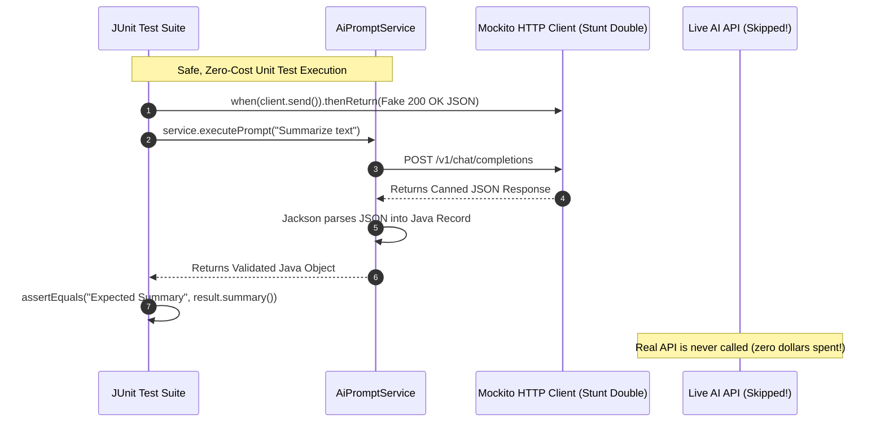

# Day_08 — IO, HTTP, JSON, Testing

| ⬅️ Previous Day | 📚 Course Hub | ➡️ Next Day |
|:---|:---:|---:|
| [← Day 07: Concurrency & Virtual Threads](../Day_07_Concurrency_Virtual_Threads/Day_07_Concurrency_Virtual_Threads.md) | [All 60 Days Overview](../../README.md) | [Day 09: The Problem Spring Solves — Dependency Hell →](../../Phase_02_Spring_Core_and_DI/Day_09_Problem_Spring_Solves_Dependency_Hell/Day_09_Problem_Spring_Solves_Dependency_Hell.md) |

---

## 🎯 What You'll Understand By the End
- How to read and write document files cleanly using modern Java NIO (`Files.readString` and `Files.writeString`).
- How to make real HTTP API calls to external AI services using Java's built-in `HttpClient`.
- How to convert raw JSON strings into strongly-typed Java Records using the industry-standard **Jackson** library (`ObjectMapper`).
- How to write professional, automated unit tests using **JUnit 5** to verify business logic.
- How to mock external AI network calls using **Mockito** so your tests run instantly without spending real API credits.

---

## 🧠 The Problem This Solves

Building production AI systems requires connecting to external services across networks and file systems:

1. **Ancient File I/O**: Older Java required 15 lines of nested `FileReader`, `BufferedReader`, and manual stream-closing loops just to read a text file. If an exception occurred, streams leaked, locking files on the operating system.
2. **Third-Party HTTP Dependencies**: For years, Java developers had to rely on heavy third-party HTTP libraries (like Apache HttpClient).
3. **Fragile JSON Parsing**: AI models communicate exclusively in JSON. Manually parsing JSON strings using string splitting or regex is brittle and dangerous.
4. **Testing Against Live AI APIs**: If your automated tests call real OpenAI or Anthropic endpoints on every git commit:
   - Your tests will run painfully slow (taking minutes instead of milliseconds).
   - Your team burns real money on API billing.
   - If the external API goes down or you lose Wi-Fi, your entire build pipeline fails.

Modern Java provides built-in **`java.nio.file.Files`** and **`java.net.http.HttpClient`**, paired with **Jackson** for JSON and **JUnit 5 + Mockito** for hermetic, zero-cost unit testing.

---

## 📖 Core Concept, Explained Simply

### 1. Modern File I/O (`java.nio.file.Files`)
Forget ancient buffer loops. In modern Java, reading or writing an entire document chunk takes a single method call:
- `Files.readString(Path.of("prompt.txt"))` reads an entire text file into memory as a `String`.
- `Files.writeString(Path.of("output.txt"), content)` saves text to disk cleanly and safely closes the file.

### 2. The Diplomatic Courier (`java.net.http.HttpClient`)
Introduced in Java 11, the built-in HTTP client follows a clean three-part architecture:
- **`HttpClient`**: The courier engine. Configures timeouts, connection pooling, and redirects.
- **`HttpRequest`**: The sealed envelope. Defines the destination URL, HTTP method (GET, POST), headers (API keys), and body data.
- **`HttpResponse`**: The returned parcel. Contains the HTTP status code (e.g., 200 OK) and the response body.

### 3. The Universal Translator (Jackson `ObjectMapper`)
An AI model returns a raw text string like `{"model": "gpt-4o", "tokens": 150}`. 
- Jackson's **`ObjectMapper`** acts as a universal translator.
- It parses that JSON text and maps each key directly to the fields of a Java **Record** (`record ModelResponse(String model, int tokens) {}`), giving you full type safety.

### 4. Mocking with Mockito (The Stunt Double)
In a movie, an expensive actor doesn't jump off a bridge; a stunt double does.
- When unit-testing your AI service, you don't call the live, billable AI network endpoint.
- You create a **Mock** (a stunt double) using Mockito.
- You tell the mock: *"When your `sendPrompt` method is called, do not touch the network. Immediately return this pre-recorded canned response."* Your test runs in 2 milliseconds, costs $0.00, and verifies your parsing logic perfectly.

> 💡 **New Word Alert — "Serialization / Deserialization"**: Serialization converts a live Java object in memory into a text format (like JSON) to send over a network. Deserialization reverses the process, turning JSON text back into a live Java object.

> 💡 **New Word Alert — "Mocking"**: Creating a simulated fake object in tests that mimics the behavior of a real dependency (like an external API) in a controlled way.

---

## 🗺️ Visual Overview



*This sequence diagram shows how an automated unit test uses Mockito to intercept network calls. The test supplies a canned JSON response to verify application parsing logic instantly without spending money on external AI API credits.*

---

## 💻 Code Walkthrough

Here is a complete, runnable example showing how to parse JSON into a Java Record using Jackson and test it with JUnit 5:

```java
import com.fasterxml.jackson.databind.ObjectMapper;
import org.junit.jupiter.api.Test;
import static org.junit.jupiter.api.Assertions.*;

// 1. Domain Record representing the AI JSON payload
record AiChatCompletion(String id, String model, int totalTokens) {}

// 2. Service that processes the JSON response
class AiResponseParser {
    private final ObjectMapper objectMapper = new ObjectMapper();

    public AiChatCompletion parseResponse(String jsonString) throws Exception {
        if (jsonString == null || jsonString.isBlank()) {
            throw new IllegalArgumentException("JSON response cannot be empty");
        }
        // Deserializes JSON string directly into our Record!
        return objectMapper.readValue(jsonString, AiChatCompletion.class);
    }
}

// 3. Automated Unit Test with JUnit 5
public class AiResponseParserTest {

    @Test
    void shouldCorrectlyParseValidAiJson() throws Exception {
        AiResponseParser parser = new AiResponseParser();
        String fakeApiResponse = """
            {
                "id": "chatcmpl-12345",
                "model": "gpt-4o",
                "totalTokens": 85
            }
            """;

        AiChatCompletion result = parser.parseResponse(fakeApiResponse);

        assertNotNull(result);
        assertEquals("chatcmpl-12345", result.id());
        assertEquals("gpt-4o", result.model());
        assertEquals(85, result.totalTokens());
    }

    @Test
    void shouldThrowExceptionWhenJsonIsEmpty() {
        AiResponseParser parser = new AiResponseParser();

        assertThrows(IllegalArgumentException.class, () -> {
            parser.parseResponse("");
        });
    }
}
```

### Line-by-Line Breakdown

| Code Statement | Plain-English Explanation |
|:---|:---|
| `record AiChatCompletion(...)` | The target data carrier. Jackson automatically matches JSON keys (`"model"`, `"totalTokens"`) to the record component names. |
| `objectMapper.readValue(json, Class)` | Core Jackson method. Scans the JSON text and constructs a typed `AiChatCompletion` object. |
| `""" ... """` | **Java Text Block**: A multi-line string literal introduced in modern Java, making embedded JSON payloads clean and readable without ugly `\n` or `\"` escapes. |
| `@Test` | JUnit 5 annotation marking the method as an executable automated test case. |
| `assertEquals(expected, actual)` | Verifies that the parsed record value matches our expected value. If it does not match, the test fails with a clear diff. |
| `assertThrows(...)` | Verifies that the method properly rejects invalid input by throwing the expected exception type. |

---

## 🔑 Key Terminology

| Term | Plain-English Meaning |
|:---|:---|
| **`Files.readString()`** | A modern Java NIO method that reads an entire text file into a String in a single line. |
| **`HttpClient`** | Modern Java's built-in, thread-safe client for sending HTTP requests and receiving responses. |
| **`ObjectMapper`** | The primary class in the Jackson library used to serialize Java objects to JSON and deserialize JSON into objects. |
| **JUnit 5** | The industry-standard testing framework used to write and execute automated test assertions in Java. |
| **Mockito** | A Java library used to create mock objects and stub method returns for isolated testing. |
| **Stubbing (`when...thenReturn`)** | Defining canned return values on a mock object during a test run. |

---

## ⚠️ Common Beginner Mistakes

### 1. Hardcoding API Keys Directly in Source Code
Never commit live OpenAI or Anthropic API keys into your Java files or Git repositories.

❌ **Wrong Way**:
```java
String apiKey = "sk-proj-abc123456789SecretKeyDoNotShare"; // Security breach!
```

✅ **Right Way**:
```java
// Read from environment variables securely:
String apiKey = System.getenv("OPENAI_API_KEY");
if (apiKey == null) {
    throw new IllegalStateException("OPENAI_API_KEY environment variable is not set!");
}
```

---

### 2. Creating a New `ObjectMapper` on Every Request
The Jackson `ObjectMapper` is heavy to initialize, but it is completely **thread-safe**. Creating a new instance on every HTTP request creates massive garbage collection pressure.

❌ **Wrong Way**:
```java
public void handleResponse(String json) throws Exception {
    ObjectMapper mapper = new ObjectMapper(); // Costly allocation on every single call!
    ...
}
```

✅ **Right Way**:
```java
// Reuse a single, shared, thread-safe instance:
private static final ObjectMapper MAPPER = new ObjectMapper();
```

---

### 3. Calling Live APIs in Unit Tests
Connecting to real external servers inside unit tests makes your test suite slow, fragile, and expensive.

❌ **Wrong Way**:
Writing a test that connects to `https://api.openai.com` over the internet during `mvn test`.

✅ **Right Way**:
Use **Mockito** to mock your HTTP client or service interface so the test runs in 5 milliseconds on any machine with zero network access.

---

## ✅ Best Practices

1. **Use Modern `Files` Methods for File Operations**: Prefer `Files.readString(path)` and `Files.writeString(path, text)` over legacy `FileInputStream` or `BufferedReader` for simple document operations.
2. **Always Use Text Blocks (`"""`) for JSON Fixtures**: When writing test JSON payloads, modern Java text blocks eliminate backslash escape noise completely.
3. **Write Unit Tests for Every Parser and Validator**: Always test both the "happy path" (valid JSON) and the "error path" (malformed JSON, missing fields) using `assertThrows`.

---

## 🔭 Looking Ahead
Congratulations! You have completed **Phase 1: Java Foundations**. In **Day_09** of **Phase 2**, we will discover **Spring Core & Dependency Injection** — understanding why enterprise frameworks exist to solve "Dependency Hell" and wire all these components together automatically.

---

## 📝 Quick Recap
- Modern Java NIO (`Files.readString` / `Files.writeString`) handles text file I/O safely in a single line.
- Java's built-in **`HttpClient`** provides clean, asynchronous-ready HTTP communication without external libraries.
- **Jackson (`ObjectMapper`)** seamlessly serializes and deserializes JSON text directly to and from Java **Records**.
- **JUnit 5** provides `@Test`, `assertEquals`, and `assertThrows` to guarantee your code behaves as expected.
- **Mockito** lets you stub external network responses, creating fast, zero-cost, reliable unit test suites.

---

## 🧪 Try It Yourself

1. **Write a File I/O Routine**: Write a short Java program that writes an AI prompt to `prompt.txt` using `Files.writeString`, reads it back with `Files.readString`, and prints the text in uppercase.
2. **JSON Record Mapping**: Create a Java record `ModelConfig(String provider, int maxTokens, boolean streaming)`. Create a JSON string with matching fields and deserialize it using Jackson's `ObjectMapper`.
3. **Write a Negative Unit Test**: Write a unit test using JUnit 5's `assertThrows` that verifies your `AiResponseParser` properly throws an exception when fed corrupted JSON (e.g., `{"model": ` missing its closing bracket).
