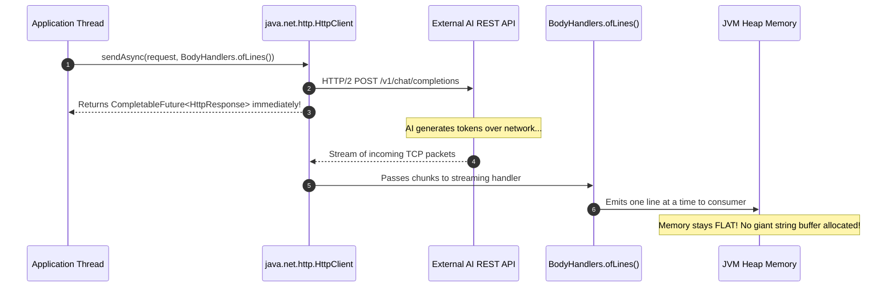

# Day_08 — I/O, Modern HTTP, JSON Serialization, and Testing in Memory

| ⬅️ Previous Day | 📚 Course Hub | ➡️ Next Day |
|:---|:---:|---:|
| [← Day 07: Concurrency & Virtual Threads](../Day_07_Concurrency_Virtual_Threads/Day_07_Concurrency_Virtual_Threads.md) | [All 60 Days Overview](../../README.md) | [Day 09: The Problem Spring Solves — Dependency Hell →](../../Phase_02_Spring_Core_and_DI/Day_09_Problem_Spring_Solves_Dependency_Hell/Day_09_Problem_Spring_Solves_Dependency_Hell.md) |

---

## 🎯 What You'll Understand By the End
- The physical memory difference between **Heap Buffers** (`ByteBuffer.allocate()`) and **Direct Off-Heap Buffers** (`ByteBuffer.allocateDirect()`), and how **Zero-Copy** I/O avoids CPU memory duplication.
- How memory-mapped files (**`MappedByteBuffer`**) map gigabyte-scale AI vector datasets and model weights directly into virtual memory without exhausting JVM Heap RAM.
- How **`try-with-resources`** interacts with the `AutoCloseable` contract to prevent native OS file descriptor and socket leaks.
- The internal architecture of **`java.net.http.HttpClient`**: synchronous vs. asynchronous (`CompletableFuture`) network calls, and streaming response handlers to prevent OutOfMemory errors on large LLM responses.
- The physical memory hierarchy of JSON representations: raw textual bytes vs. in-memory DOM trees (**`JsonNode`**) vs. strongly-typed **Java Records** vs. low-overhead streaming parsers (**`JsonParser`**).
- The memory lifecycle of **JUnit 5**: why test runners allocate a new test class instance per `@Test` method to enforce state isolation.
- How **Mockito** intercepts dynamic dispatch (`vtable`) calls using runtime **ByteBuddy proxy generation** to mock external AI APIs without network or dollar costs.

---

## 🧠 The Problem This Solves

Connecting AI applications to the outside world introduces severe I/O, memory, and testing challenges:

1. **The Double-Copy Memory Penalty**:
   In traditional stream-based I/O (`FileInputStream`), reading a 1 GB file into memory forces the operating system to copy data from disk into the OS kernel buffer, copy it again into an intermediate native buffer, and finally copy it a third time into a JVM Heap `byte[]`. This triple-buffering burns CPU cycles and doubles RAM usage.
2. **OutOfMemory Crashes from Buffering Streaming LLM Responses**:
   When an LLM streams thousands of tokens, reading the entire response into a single in-memory `String` before parsing causes massive Heap spikes. If 500 concurrent users stream responses, servers run out of Heap memory.
3. **Fragile, Heavy JSON Object Trees**:
   Parsing JSON using generic tree nodes (`JsonNode`) creates dozens of wrapper objects on the Heap for every JSON bracket and key. Deserializing large AI context payloads into tree models burns megabytes of RAM compared to compact, strongly-typed Records.
4. **Slow, Billable, Flaky Unit Tests**:
   If automated tests make real HTTP calls to OpenAI or Anthropic on every git commit:
   - Test suites take minutes instead of milliseconds.
   - Your team burns real money on API billing.
   - If the external API experiences downtime or network lag, your entire CI/CD build pipeline fails.

Modern Java provides high-performance **Java NIO.2 zero-copy channels**, built-in non-blocking **`HttpClient`**, streaming **Jackson** serialization, and **JUnit 5 + Mockito** to build lightning-fast, zero-cost, hermetic test suites.

---

# Section 1: File I/O & Memory Footprint (Java NIO.2)

## 🔬 Heap Buffers vs. Direct Off-Heap Native Buffers (Rule 9: Memory-First Mandate)

Java NIO (New I/O) replaces stream-based byte loops with **Channels** and **Buffers**. How a buffer is allocated determines whether it lives in JVM-managed Heap RAM or in native operating system memory:

```mermaid
flowchart LR
    subgraph Storage ["Hardware Disk / Network Socket"]
        DISK["Physical Disk / Socket"]
    end

    subgraph OSKernel ["Operating System Kernel Space"]
        KBUF["OS Page Cache / Kernel Buffer"]
    end

    subgraph DirectPath ["Zero-Copy / Direct Buffer Path"]
        DBUF["<b>Direct ByteBuffer</b><br><i>(Off-Heap Native Memory via malloc)</i><br>Direct Memory Access (DMA)!"]
    end

    subgraph HeapPath ["Traditional Heap Buffer Path (Double Copy)"]
        NBUF["Intermediate Native C Buffer"]
        HBUF["<b>Heap ByteBuffer</b><br><i>(byte[] on JVM Heap)</i><br>Subject to GC pauses!"]
    end

    DISK -->|DMA transfer| KBUF
    KBUF -->|Direct pointer mapping (Zero-Copy)| DBUF
    KBUF -->|Kernel-to-User copy| NBUF
    NBUF -->|Native-to-Heap copy| HBUF
```

*This diagram contrasts Heap Buffers with Direct Off-Heap Buffers. Heap buffers require copying bytes from the OS kernel into native memory, and then into the JVM Heap array. Direct buffers allow the OS kernel to transfer data directly into off-heap memory via DMA, eliminating intermediate memory copies.*

| Buffer Type | Allocation Syntax | Where It Lives in Memory | Garbage Collector Impact | I/O Performance |
|:---|:---|:---|:---|:---|
| **Heap Buffer** | `ByteBuffer.allocate(8192)` | On the **JVM Heap** as a standard `byte[]`. | Managed by GC; object relocations require pinning memory during I/O. | Slower: Requires copying data across the native/Heap memory boundary. |
| **Direct Buffer** | `ByteBuffer.allocateDirect(8192)` | In **Native OS Memory** outside the JVM Heap (via C `malloc`). | Outside JVM Heap; freed via native cleanups (avoids GC pauses). | **Fastest**: Supports **Direct Memory Access (DMA)** directly between the OS kernel and RAM. |

---

## ⚡ Zero-Copy Transfer and Memory-Mapped Files (`MappedByteBuffer`)

When reading gigabyte-scale vector database indexes or LLM model weights, loading the entire file into Heap memory is impossible. **Memory-Mapped Files (`MappedByteBuffer`)** solve this:

```java
try (FileChannel channel = FileChannel.open(Path.of("embeddings.bin"), StandardOpenOption.READ)) {
    // Maps 2 GB of disk directly into virtual memory!
    MappedByteBuffer buffer = channel.map(FileChannel.MapMode.READ_ONLY, 0, channel.size());
    
    // Reads directly from OS Page Cache without allocating Heap memory:
    byte firstByte = buffer.get(0);
}
```

### How Memory-Mapping Works Under the Hood:
1. The JVM invokes the OS kernel system call `mmap()`.
2. The operating system assigns a region of the application's **virtual address space** to map directly to the physical file blocks on disk.
3. **Zero Heap Allocation**: Reading from the buffer reads directly from the OS page cache. File pages are loaded into physical RAM on demand (paging) without ever allocating a giant `byte[]` inside the JVM Heap!

---

## 🛡️ Resource Management: `try-with-resources` (`AutoCloseable`)

Every open file, channel, and network socket consumes an operating system resource called a **File Descriptor** (a table entry in the OS kernel tracking open I/O handles).

```java
// SAFE: Guaranteed to close file descriptor even if an exception is thrown!
try (var channel = FileChannel.open(path, StandardOpenOption.READ)) {
    // Process channel...
} // Compiler inserts implicit finally { channel.close(); }
```
*Why this matters*: If you do not close resources, file descriptors remain locked in the OS kernel until the process dies, eventually causing `java.io.IOException: Too many open files`.

---

# Section 2: Modern HTTP Client (`java.net.http.HttpClient`)

Introduced in Java 11, the modern HTTP Client is built for high-throughput, non-blocking network I/O:



*This diagram illustrates asynchronous, streaming HTTP execution. The application thread remains unblocked while the network transfer proceeds. Responses are consumed line-by-line via streaming handlers, keeping Heap memory usage minimal.*

---

## 🚀 Synchronous vs. Asynchronous HTTP Execution

### 1. Synchronous Send (Blocks Calling Thread)
```java
HttpClient client = HttpClient.newHttpClient();
HttpRequest request = HttpRequest.newBuilder()
    .uri(URI.create("https://api.openai.com/v1/models"))
    .header("Authorization", "Bearer " + apiKey)
    .GET()
    .build();

// Blocks the thread until the entire response is returned:
HttpResponse<String> response = client.send(request, HttpResponse.BodyHandlers.ofString());
System.out.println("Status: " + response.statusCode());
```

### 2. Asynchronous Send (Non-Blocking via `CompletableFuture`)
```java
// Returns immediately; executes over NIO non-blocking selectors:
CompletableFuture<HttpResponse<String>> future = client.sendAsync(
    request, 
    HttpResponse.BodyHandlers.ofString()
);

future.thenAccept(res -> System.out.println("Async Body: " + res.body()))
      .exceptionally(ex -> { System.err.println("Failed: " + ex); return null; });
```

---

# Section 3: JSON Serialization & Deserialization in Memory

AI APIs communicate exclusively using JSON. How you parse that JSON directly impacts Heap memory consumption:

```
┌────────────────────────────────────────────────────────────────────────┐
│ 3 LEVELS OF JSON PARSING IN MEMORY                                     │
│                                                                        │
│ 1. Raw Text String (Payload)                                           │
│    {"id": "chat-1", "tokens": 150}                                     │
│                                                                        │
│ 2. In-Memory DOM Tree (JsonNode) ──► HEAVY MEMORY OVERHEAD             │
│    ObjectNode @ 0x1000                                                 │
│     ├── TextNode("chat-1") @ 0x1020 (Header + pointer)                 │
│     └── IntNode(150) @ 0x1040 (Header + primitive int)                 │
│                                                                        │
│ 3. Strongly-Typed Java Record ──► COMPACT & OPTIMAL                    │
│    record CompletionResponse(String id, int tokens) {}                 │
│    CompletionResponse @ 0x2000 (One single compact Heap object!)       │
└────────────────────────────────────────────────────────────────────────┘
```

## 🔬 Jackson Mapping: `JsonNode` vs. Strongly-Typed Records

1. **`ObjectMapper.readTree(json)` (DOM Model)**:
   - Parses JSON into a mutable tree of `JsonNode` objects.
   - **Memory Cost**: Every bracket, string key, and numeric value is wrapped inside its own `JsonNode` object on the Heap. Allocating thousands of node objects creates heavy memory bloat and GC pressure.
2. **`ObjectMapper.readValue(json, CompletionRecord.class)` (Data Binding)**:
   - Uses reflection and bytecode accessors to bind JSON keys directly to record components.
   - **Memory Cost**: Allocates **one single, compact Record instance** on the Heap with fields matching the JSON payload.
3. **Streaming JSON Parser (`JsonParser`)**:
   - Reads tokens sequentially (`START_OBJECT`, `FIELD_NAME`, `VALUE_STRING`) from an `InputStream` using a tiny fixed 8 KB buffer.
   - Ideal for processing multi-gigabyte JSON datasets or streaming LLM events without buffering the entire payload into Heap RAM.

---

# Section 4: Unit Testing & Mocking Mechanics (JUnit 5 & Mockito)

## 🧪 The JUnit 5 Test Class Memory Lifecycle

Many developers mistakenly assume all `@Test` methods share the same test class instance in memory.

> ⚠️ **The Memory Truth**: By default, JUnit 5 uses `@TestInstance(Lifecycle.PER_METHOD)`. It allocates a **brand-new instance of the test class on the Heap for every single `@Test` method**!

```java
class AiServiceTest {
    private int counter = 0; // Instance field on Heap

    @Test
    void testA() {
        counter++;
        assertEquals(1, counter); // PASSES!
    }

    @Test
    void testB() {
        // Runs on a BRAND NEW test class instance! counter is 0, NOT 1!
        assertEquals(0, counter); // PASSES!
    }
}
```
*Why JUnit does this*: Total test isolation. A test method cannot accidentally mutate shared instance variables and corrupt the outcome of a subsequent test.

---

## 🎭 Mockito Under the Hood: Dynamic ByteBuddy Proxy Generation

How does `Mockito.mock(ChatClient.class)` simulate an entire interface or class without network calls?

```mermaid
flowchart TD
    subgraph TestExecution ["JUnit Test Thread Stack"]
        T1["service.generatePrompt('Hello')"]
    end

    subgraph MockProxy ["Mockito ByteBuddy Generated Proxy on Heap"]
        P1["<b>ChatClient$$EnhancerByMockito</b><br>Header: Mark Word + Klass Word<br>Interceptor: InvocationHandler"]
    end

    subgraph StubRegistry ["Mockito Metaspace Stub Table"]
        S1["<b>when(client.generate('Hello'))</b><br>Mapped to: 'Canned AI Response'"]
    end

    T1 -->|Calls generate() via vtable| P1
    P1 -->|Intercepts call before execution| S1
    S1 -->>|Returns stubbed string immediately| T1
```

*This diagram illustrates Mockito proxy interception. Mockito generates a dynamic subclass using ByteBuddy. When the method is invoked, Mockito intercepts the dynamic dispatch (`vtable`) call, looks up the stubbed return value in its registry, and returns it immediately without ever invoking real business logic or making network calls.*

---

## 💻 Concrete Code Walkthrough: Full I/O, JSON & Hermetic Test Suite

Here is a complete, runnable modern Java architecture modeling an AI summarizer service, Jackson record serialization, and isolated unit testing:

```java
package com.genai.foundations.day08;

import java.io.IOException;
import java.nio.file.Files;
import java.nio.file.Path;
import java.util.Objects;

// 1. Immutable Domain Record for JSON payload mapping
record AiCompletionResponse(String id, String summary, int tokensUsed) {}

// 2. Service interface for abstraction
interface AiGatewayClient {
    String sendPrompt(String prompt);
}

// 3. Application service consuming files and AI clients
class DocumentSummarizer {
    private final AiGatewayClient client;

    public DocumentSummarizer(AiGatewayClient client) {
        this.client = Objects.requireNonNull(client, "client cannot be null");
    }

    public String summarizeDocument(Path filePath) throws IOException {
        // High-performance Java NIO file read:
        String content = Files.readString(filePath);
        return client.sendPrompt("Summarize: " + content);
    }
}

// 4. Standalone Runner demonstrating execution and file I/O
public class IoTestingDemo {

    public static void main(String[] args) throws Exception {
        System.out.println("==================================================");
        System.out.println("   DAY 08: I/O, STREAMING & TESTING MEMORY TRACE  ");
        System.out.println("==================================================");

        // Create temporary document using Java NIO
        Path tempFile = Files.createTempFile("ai_doc_", ".txt");
        Files.writeString(tempFile, "Java 21 Virtual Threads and NIO zero-copy channels.");
        System.out.println("1. Temporary file created at: " + tempFile.toAbsolutePath());

        // Hermetic mock implementation (stunt double)
        AiGatewayClient mockClient = prompt -> {
            System.out.println("   [Mock Gateway] Intercepted prompt without network calls!");
            return "Summary: High-performance Java I/O and Concurrency.";
        };

        // Service execution
        DocumentSummarizer summarizer = new DocumentSummarizer(mockClient);
        String summary = summarizer.summarizeDocument(tempFile);

        System.out.println("2. Summary Result: " + summary);

        // Clean up native file descriptors
        Files.deleteIfExists(tempFile);
        System.out.println("3. Temporary file cleanly deleted (OS descriptor released).");
        System.out.println("==================================================");
    }
}
```

### Physical Memory Allocation & I/O Trace Table

| Step / Code Line | Target Memory Area | Physical Under-the-Hood Operation |
|:---|:---|:---|
| `Files.createTempFile(...)` | **OS Kernel & Heap** | OS kernel allocates a file descriptor on disk; JVM creates a `Path` object on the Heap pointing to the file path. |
| `Files.writeString(...)` | **Native OS Buffer** | Encodes string to UTF-8 bytes and writes directly through OS kernel page caches. Automatically closes the channel via `try-with-resources`. |
| `Files.readString(...)` | **JVM Heap Space** | Reads file bytes into a temporary buffer and decodes them into an immutable `String` object on the Heap. |
| `mockClient.sendPrompt(...)` | **Stack Frame** | Invokes the lambda method handle. Dynamic dispatch executes the local mock stub, avoiding all TCP socket creation and network latency. |
| `Files.deleteIfExists(...)` | **OS File System** | System call releases the disk blocks and closes the OS kernel file descriptor entry. |

---

## 🔑 Key Terminology

| Term | Plain-English Meaning |
|:---|:---|
| **Java NIO.2** | Non-blocking, channel-based I/O framework that uses buffers and memory-mapping for high-throughput disk and network operations. |
| **Heap Buffer** | A byte buffer allocated directly on the JVM Heap as a `byte[]`, subject to Garbage Collector pauses. |
| **Direct Buffer** | A byte buffer allocated in native operating system memory (off-heap) that supports Direct Memory Access (DMA) without JVM Heap copies. |
| **Zero-Copy** | An I/O technique where data transfers between disk and network directly in OS kernel space without being copied into application Heap memory. |
| **`AutoCloseable`** | An interface whose `close()` method is automatically triggered at the end of a `try-with-resources` block, releasing OS file descriptors and sockets. |
| **`CompletableFuture`** | A promise object representing an asynchronous computation that completes in the future, used by `HttpClient.sendAsync()`. |
| **`JsonNode`** | Jackson's in-memory DOM representation of JSON that parses entire payloads into linked Heap node objects. |
| **ByteBuddy Proxy** | A dynamic bytecode subclass generated at runtime by Mockito to intercept method calls and return stubbed values. |

---

## ⚠️ Common Beginner Mistakes

### 1. Leaking OS File Descriptors by Skipping `try-with-resources`
Manually opening streams and forgetting to close them inside a `finally` block.

❌ **Wrong Way**:
```java
FileInputStream in = new FileInputStream("large_embeddings.bin");
byte[] data = in.readAllBytes(); // If an exception occurs here, the stream leaks!
in.close();
```

✅ **Right Way**:
```java
try (InputStream in = Files.newInputStream(path)) {
    byte[] data = in.readAllBytes(); // Automatically closed under all circumstances!
}
```

---

### 2. Buffering Gigabyte-Scale Responses into Heap Strings
Reading massive streaming network responses into a single monolithic `String`.

❌ **Wrong Way**:
```java
// CRASH: If payload is 2 GB, allocating a 2 GB string causes OutOfMemoryError!
HttpResponse<String> res = client.send(req, HttpResponse.BodyHandlers.ofString());
```

✅ **Right Way**:
```java
// Streaming response: processes data chunk-by-chunk without massive Heap allocations!
HttpResponse<InputStream> res = client.send(req, HttpResponse.BodyHandlers.ofInputStream());
try (InputStream stream = res.body()) {
    processStreamTokens(stream);
}
```

---

### 3. Testing Against Live External AI APIs in CI/CD
Running unit tests that send live network requests to OpenAI or Anthropic.

❌ **Wrong Way**:
```java
@Test
void testPrompt() {
    OpenAiClient client = new OpenAiClient("live-secret-key");
    String res = client.generate("Hello"); // Costs money, takes 3 seconds, fails if Wi-Fi drops!
    assertNotNull(res);
}
```

✅ **Right Way**: Use **Mockito** to mock the client interface and return canned responses in 2 milliseconds with zero API costs.

---

## ✅ Best Practices

1. **Use `Files.readString()` and `Files.writeString()` for Text Files**: Use modern Java NIO static utility methods instead of legacy `BufferedReader` or `FileWriter` streams.
2. **Prefer Strongly-Typed Records over `JsonNode` for JSON**: Map API payloads directly to Java records for compile-time type safety and reduced Heap memory overhead.
3. **Always Use `HttpClient.sendAsync()` for High-Throughput Microservices**: Pair non-blocking HTTP requests with `CompletableFuture` or Virtual Threads to maximize concurrency.
4. **Enforce Hermetic Unit Tests**: Ensure unit tests run completely offline without relying on external network endpoints, filesystems, or databases.

---

## 🔭 Looking Ahead
🎉 **Congratulations! You have completed Phase 1: Java Foundations (Days 01–08)!**

In **Phase 2: Spring Core and Dependency Injection (Days 09–14)**, we will enter enterprise framework architecture: exploring how Spring eliminates "Dependency Hell," how the **IoC Container** manages singleton Bean lifecycles in memory, and how **Spring Boot Auto-Configuration** works under the hood!

---

## 📝 Quick Recap
- **Heap Buffers** live on the JVM Heap; **Direct Buffers** live in native off-heap memory, enabling Direct Memory Access (DMA) zero-copy transfers.
- **`try-with-resources`** guarantees closing `AutoCloseable` resources, preventing native file descriptor leaks.
- **`java.net.http.HttpClient`** provides built-in HTTP/2, synchronous, and asynchronous streaming communication.
- Deserializing JSON directly into **Java Records** minimizes Heap allocation compared to heavy in-memory DOM trees (`JsonNode`).
- **JUnit 5** allocates a brand-new test class instance per test method to guarantee total memory isolation.
- **Mockito** intercepts dynamic dispatch (`vtable`) calls using dynamic **ByteBuddy proxies**, allowing zero-cost, hermetic unit testing.

---

## 🧪 Try It Yourself

1. **Test Memory-Mapped I/O**: Create a 100 MB binary file using `FileChannel`. Map it into memory using `channel.map(FileChannel.MapMode.READ_ONLY, 0, channel.size())`. Inspect the JVM Heap memory usage before and after to verify that mapping the file consumed almost zero JVM Heap RAM.
2. **Asynchronous HTTP Call**: Write a small program using `HttpClient.sendAsync()` that calls a public API (such as `https://httpbin.org/get`) and attaches `.thenAccept(res -> System.out.println(res.body()))`. Call `.join()` on the future to wait for completion.
3. **Build a Mockito Test**: Create an interface `TokenCounter` with a method `int count(String text)`. Write a service that depends on `TokenCounter`. Write a JUnit 5 test using Mockito to mock `TokenCounter` and verify that calling `when(mock.count(any())).thenReturn(42)` correctly stubs the response.
