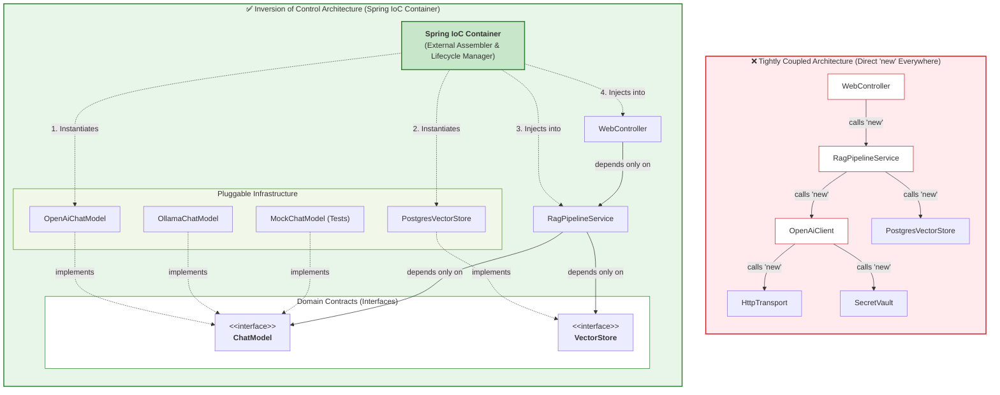
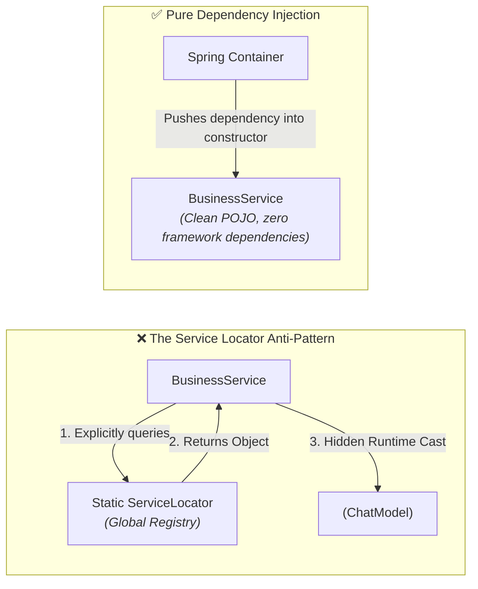
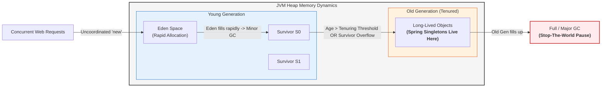
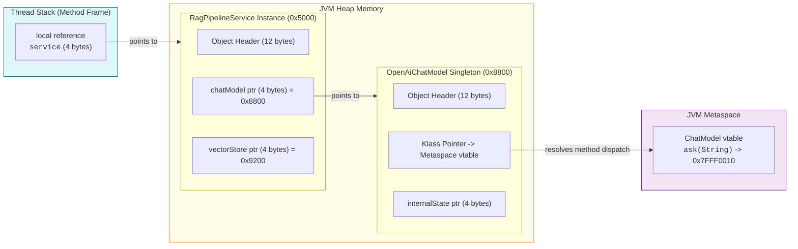

# Day_09 — The Problem Spring Solves: Dependency Hell, Tight Coupling & Inversion of Control

| ⬅️ Previous Day | 📚 Course Hub | ➡️ Next Day |
|:---|:---:|---:|
| [← Day 08: I/O, HTTP Client, JSON & Testing](../../Phase_01_Java_Foundations/Day_08_IO_HTTP_JSON_Testing/Day_08_IO_HTTP_JSON_Testing.md) | [All 60 Days Overview](../../README.md) | [Day 10: Spring IoC Container & Bean Lifecycle →](../Day_10_Spring_IoC_Container_Bean_Lifecycle/Day_10_Spring_IoC_Container_Bean_Lifecycle.md) |

---

## 🎯 What You'll Understand By the End
- The root architectural mechanisms behind **tight coupling** and why hardcoding `new` causes cascading constructor ripple effects ("shotgun surgery").
- What **Inversion of Control (IoC)** and **Dependency Injection (DI)** actually represent at an architectural level, stripped of framework jargon.
- Why the historic **Service Locator pattern** failed and how modern IoC containers solved its fatal flaws.
- The **Memory-First perspective (Rule 9)**: How uncoordinated `new` allocations cause massive Heap bloat, Eden space exhaustion, premature object promotion, and Garbage Collection (GC) thrashing.
- How **decoupled reference pointers** (Ordinary Object Pointers / OOPs) on the Heap allow dynamic method dispatch via Metaspace vtables while completely isolating components from concrete class layouts.
- Why hardcoded dependencies make automated testing nearly impossible without fragile bytecode manipulation (e.g., PowerMock), and how constructor injection provides **zero-friction mocking** using clean POJOs.

---

## 🧠 The Problem This Solves

Imagine you are engineering an enterprise-grade Generative AI platform that retrieves documents, computes vector embeddings, queries a vector database, and generates contextual answers using a Large Language Model (LLM).

In standard Java without a dependency management container, your classes instantiate their own collaborators directly using the `new` keyword:

```java
// Layer 4: Infrastructure - Secret Vault
public class SecretVault {
    private final String vaultPath;
    public SecretVault(String vaultPath) {
        this.vaultPath = vaultPath;
    }
    public String getSecret(String key) { /* reads from disk */ return "sk-secret-123"; }
}

// Layer 3: Infrastructure - HTTP Transport
public class HttpTransport {
    private final int timeoutSeconds;
    public HttpTransport(int timeoutSeconds) {
        this.timeoutSeconds = timeoutSeconds;
    }
}

// Layer 2: External API Client
public class OpenAiClient {
    private final HttpTransport transport;
    private final String apiKey;

    public OpenAiClient() {
        // Hardcoded dependency construction!
        this.transport = new HttpTransport(30);
        SecretVault vault = new SecretVault("/etc/app/secrets.json");
        this.apiKey = vault.getSecret("OPENAI_KEY");
    }
}

// Layer 1: Core Domain Service
public class RagPipelineService {
    private final OpenAiClient aiClient;
    private final PostgresVectorStore vectorStore;

    public RagPipelineService() {
        // Hardcoding dependencies inside the domain logic!
        this.aiClient = new OpenAiClient();
        this.vectorStore = new PostgresVectorStore("jdbc:postgresql://localhost:5432/vectors");
    }
}
```

This traditional pattern looks intuitive to beginners, but in production it creates four fatal architectural disasters:

### 1. The Constructor Ripple Effect ("Shotgun Surgery")
Suppose your networking team discovers that `HttpTransport` needs a connection pool limit parameter: `public HttpTransport(int timeoutSeconds, int maxPoolSize)`.
Because every class instantiated its dependencies directly with `new`:
- `OpenAiClient` must be modified to pass `maxPoolSize`.
- If `OpenAiClient` expects callers to configure it, its constructor changes: `public OpenAiClient(int maxPoolSize)`.
- `RagPipelineService` breaks because its call `new OpenAiClient()` no longer compiles!
- Every web controller or scheduled task that creates `RagPipelineService` breaks!

A one-line configuration change at the bottom of your infrastructure stack ripples up through dozens of unrelated classes. This anti-pattern is known as **Shotgun Surgery**: making a single logical change forces you to make dozens of tiny edits across the entire codebase.

### 2. Concrete Vendor Lock-in
Your company signs an enterprise deal with Anthropic, or decides to run an open-weight model locally using Ollama to eliminate cloud API costs.
In the tightly coupled design above, `RagPipelineService` is welded directly to `OpenAiClient`. You cannot switch providers without opening `RagPipelineService.java`, rewriting its source code, re-testing, and redeploying.

### 3. Destruction of Automated Testability
How do you write a unit test for `RagPipelineService`?
When you call `new RagPipelineService()`, it immediately attempts to read `/etc/app/secrets.json`, opens an HTTP connection to OpenAI, and connects to a PostgreSQL database on `localhost:5432`.
- If the database is offline, your unit test fails.
- If your laptop has no internet connection, your unit test fails.
- Every test run burns real money on paid LLM tokens!
- Because the dependencies are buried inside private constructors, you cannot swap them for lightweight in-memory test doubles without altering production code or resorting to runtime bytecode manipulation.

### 4. Severe Heap Bloat & GC Thrashing
Every time your application handles an HTTP request, if a new service instance or helper object is constructed via `new`, it allocates duplicate instances of HTTP clients, connection pools, and internal byte buffers. As we will trace in Section 4, this uncoordinated allocation floods the JVM Heap, triggers frequent Stop-The-World (STW) Garbage Collection pauses, and degrades throughput.

**Inversion of Control (IoC)** and **Dependency Injection (DI)** eliminate all four problems by separating **object creation** from **object business logic**.

---

## 🗺️ Visual Overview: Coupling vs. Inversion of Control

The following diagram contrasts the rigid, fragile topology of direct `new` instantiation against the flexible, decoupled topology of an IoC container:



### Architectural Contrast

| Dimension | Direct `new` (Tightly Coupled) | Inversion of Control (Spring IoC) |
|:---|:---|:---|
| **Control of Creation** | The dependent class decides *when* and *how* to instantiate its collaborators. | The external framework container instantiates and wires all collaborators. |
| **Dependency Binding** | Hardcoded to concrete implementation classes (`OpenAiClient`). | Bound to polymorphic abstractions/interfaces (`ChatModel`). |
| **Impact of Parameter Changes** | Ripples through all ancestor constructors across the entire call tree. | Localized strictly to the specific bean definition; consumer classes remain untouched. |
| **Vendor Swapping** | Requires editing, recompiling, and redeploying core business logic. | Change one configuration line or active profile (e.g., `@Profile("ollama")`). |
| **Testability** | Requires live databases, real API keys, or complex bytecode instrumentation. | Pass a plain Java mock/stub directly into the constructor (`new Service(new MockModel())`). |
| **Heap Memory Management** | Proliferation of duplicate objects, auxiliary pools, and GC thrashing. | Single long-lived instances (Singletons) shared safely across all consumer threads. |

---

## 📖 Inversion of Control & The Service Locator Failure

### The Principle: Hollywood Principle
In traditional programming:
$$\text{Your Code} \longrightarrow \text{Calls Runtime Libraries / Constructs Dependencies}$$

In Inversion of Control:
$$\text{Framework Container} \longrightarrow \text{Calls Your Code ("Don't call us, we'll call you")}$$

You do not call Spring to ask for an object inside your business logic; Spring inspects your class dependencies, constructs them in the correct dependency graph order, and hands them to your class.

---

### The Historic Attempt: The Service Locator Pattern
Before modern Dependency Injection became widespread, enterprise Java (J2EE / early 2000s) attempted to solve tight coupling using the **Service Locator** pattern.

In a Service Locator architecture, an application maintains a central registry (such as a JNDI registry or a static service map). Instead of calling `new`, classes query the registry:

```java
// The Service Locator Anti-Pattern
public class RagPipelineService {
    private final ChatModel chatModel;
    private final VectorStore vectorStore;

    public RagPipelineService() {
        // Querying a central locator
        this.chatModel = (ChatModel) ServiceLocator.getService("chatModel");
        this.vectorStore = (VectorStore) ServiceLocator.getService("vectorStore");
    }

    public String generateResponse(String query) {
        return chatModel.generate(query);
    }
}
```

While Service Locator removed direct calls to `new ConcreteClass()`, it introduced profound design flaws that led to its widespread abandonment.

### Why the Service Locator Pattern Failed



#### 1. Hidden Dependencies ("Black Box" Classes)
Look at the constructor of `RagPipelineService()` in the Service Locator snippet:
`public RagPipelineService() { ... }`

From the public API signature, it appears this service requires **nothing** to be constructed. It looks like an independent, self-contained object. 
However, when you call `new RagPipelineService()` in a test or another module, it immediately explodes with a runtime `NullPointerException` or `ServiceNotFoundException` because `ServiceLocator` was not pre-populated.

With **Constructor Injection (IoC)**, dependencies are completely explicit:
```java
public RagPipelineService(ChatModel chatModel, VectorStore vectorStore) { ... }
```
The compiler prevents anyone from creating `RagPipelineService` without providing its required dependencies. The class contract is 100% transparent.

#### 2. Invasive Framework Coupling
Under Service Locator, every single business class must import and reference `com.enterprise.ServiceLocator`. Your business logic is now tightly coupled to the locator infrastructure itself. You cannot reuse that class in a different application, microservice, or CLI tool without bringing the entire Service Locator framework along.

Under true IoC, your business service is a **POJO (Plain Old Java Object)**. It contains zero imports from Spring, zero annotations required for basic instantiation, and no knowledge that a framework even exists.

#### 3. Concurrency Bottlenecks & Global Mutable State
Service Locators typically rely on global static registries (e.g., `ConcurrentHashMap<String, Object>`). In high-concurrency multi-threaded environments, reading, updating, and synchronizing global lookup maps causes thread contention and cache-line bouncing across CPU cores.

#### 4. Testing Friction & Test Polluting
To unit test a class that uses a Service Locator, your test harness must initialize the global static locator, register mock objects with specific magic string keys, run the test, and then meticulously reset the global locator so that subsequent tests are not contaminated. If tests run in parallel across multiple threads, concurrent modification of the global locator causes intermittent, flaky test failures.

---

## 💾 Memory Perspective & Heap Management (Rule 9 Mandate)

Why does hardcoding `new` matter to physical system memory? Many developers assume `new` is harmless because modern JVMs can allocate objects in Eden space in a few nanoseconds. 
However, in high-throughput enterprise systems, sprawling uncoordinated `new` invocations cause severe **Heap Bloat**, **Premature Object Promotion**, and **GC Thrashing**.

### 1. The Anatomy of an Auxiliary Object on the Heap
When a service calls `new OpenAiClient()`, it does not merely allocate a single 16-byte object. It instantiates an entire **dependency subtree**:
- `OpenAiClient` instance: 16 bytes base object header + reference fields.
- `java.net.http.HttpClient` instance: internal state, SSL context, selector thread references (~400 bytes).
- Internal byte buffers and thread pools: socket buffers (8 KB to 64 KB), queue arrays, and worker threads.
- `ObjectMapper` (Jackson) instance: Metaspace serializers, cache maps, reflection caches (~50 KB to 200 KB).

If a web application serving 5,000 requests per second instantiates its service or client components using `new` per request or per operation:
$$\text{Heap Churn} = 5,000\text{ req/sec} \times 250\text{ KB of auxiliary graphs} \approx 1.25\text{ GB / second!}$$

### 2. GC Thrashing & Premature Promotion
The JVM divides the Heap into the **Young Generation** (Eden + Survivor spaces S0/S1) and the **Old Generation** (Tenured):



#### What Happens With Uncoordinated `new`:
1. **Eden Exhaustion**: The Eden space fills in seconds due to massive allocations of short-lived client instances, serializers, and buffers.
2. **Minor GC Spikes**: The JVM triggers frequent Minor Garbage Collections to clean Eden.
3. **Survivor Overflow & Premature Promotion**: If a Minor GC occurs while a long-running AI request (e.g., an LLM streaming call lasting 4 seconds) is in flight, all its auxiliary objects are still referenced on thread stacks. They survive the Minor GC.
4. If the Survivor space exceeds its capacity (Tenuring Overflow), these auxiliary objects are **prematurely promoted into the Old Generation**.
5. Once the request finishes, those objects die inside the Old Generation!
6. Young GC cannot collect the Old Generation. The Old Generation quickly fragments and fills up with dead objects, triggering an expensive **Major / Full GC Stop-The-World (STW) pause**, freezing application threads.

#### What Happens With Managed Spring Singletons:
1. When the Spring IoC container starts up, it instantiates `OpenAiClient`, `PostgresVectorStore`, and `RagPipelineService` **exactly once**.
2. During application warm-up, these beans quickly survive early Minor GCs and are promoted to the **Old Generation**, where they remain static and stable.
3. During request handling, **zero** service or client objects are allocated on the Heap. The only allocations are lightweight, short-lived request/response DTOs.
4. Eden allocation rate drops by 80–95%, Minor GCs become infrequent, and Full GCs are virtually eliminated.

---

### 3. Decoupled Reference Pointers in Heap Memory
How does Inversion of Control isolate components in physical RAM?

In the JVM, an object reference (e.g., `private final ChatModel chatModel;`) is physically an **Ordinary Object Pointer (OOP)** stored inside the host object's Heap memory:
- **Compressed OOPs enabled (default for heaps < 32 GB)**: A 32-bit (4-byte) integer representing an offset in Heap memory.
- **Compressed OOPs disabled**: A 64-bit (8-byte) absolute native memory address.



Notice what happens:
1. `RagPipelineService` at address `0x5000` does not embed the concrete fields of `OpenAiChatModel` inside its own memory layout. It holds only a **4-byte pointer** (`0x8800`).
2. When `RagPipelineService` calls `chatModel.ask(prompt)`, the JVM performs **Virtual Method Dispatch**: it reads the Klass pointer in the object header at `0x8800`, looks up the method offset in the Metaspace virtual method table (`vtable`), and jumps to the compiled machine code.
3. If tomorrow you swap `OpenAiChatModel` (`0x8800`) for `OllamaChatModel` (`0x9900`), the physical memory layout of `RagPipelineService` remains completely identical: a 4-byte pointer.
4. **Physical component isolation is achieved via pointer indirection on the Heap.**

---

## 🧪 Design for Testability: Zero-Friction Mocking

The ultimate engineering benchmark of clean architecture is testability. Let us contrast how testing works with hardcoded `new` versus Constructor-Injected IoC.

### The Horror of Testing with Hardcoded `new`
```java
public class FinancialAdvisorService {
    private final OpenAiClient client;
    private final PostgresDatabase database;

    public FinancialAdvisorService() {
        this.client = new OpenAiClient();             // Calls real API!
        this.database = new PostgresDatabase("prod");  // Connects to real DB!
    }

    public boolean shouldApproveLoan(String applicantId) {
        String profile = database.findApplicant(applicantId);
        String recommendation = client.evaluateCredit(profile);
        return recommendation.contains("APPROVED");
    }
}
```

If you try to write a unit test:
```java
@Test
void testLoanApproval() {
    FinancialAdvisorService service = new FinancialAdvisorService();
    // FAILS: Crashes because it tries to connect to production PostgreSQL and OpenAI!
}
```

#### How Developers Used to Hack Around This: Bytecode Monkey-Patching
To test code like this without changing it, legacy frameworks like **PowerMock** were invented. 
PowerMock used custom Java ClassLoaders and bytecode instrumentation libraries (like Javassist or ByteBuddy) to rewrite class bytecode as it loaded into the JVM. It intercepted the Java bytecode instruction `INVOKESPECIAL ClassName.<init>` and forced it to return a mock object instead of executing the constructor.

**Why Bytecode Monkey-Patching is an Anti-Pattern:**
1. **JVM Incompatibility**: Modern Java (Java 9 through Java 21 LTS) introduced strong encapsulation in the module system (`Jigsaw`). Rewriting private constructors across modules requires passing dangerous JVM flags (`--add-opens`, `--illegal-access=permit`).
2. **Extreme Test Slowness**: Initializing custom classloaders for every test class adds hundreds of milliseconds to test startup, turning a 5-second test suite into a 5-minute ordeal.
3. **Metaspace Leaks**: Constantly generating and redefining classes in custom classloaders causes native memory fragmentation and `java.lang.OutOfMemoryError: Metaspace`.
4. **Masks Terrible Design**: Using bytecode manipulation hides the architectural smell rather than fixing the underlying coupling flaw.

---

### The Clean Solution: Zero-Friction Mocking with Constructor Injection
When you use Inversion of Control with constructor injection, testing requires **zero bytecode manipulation**, zero JVM flags, and not even a mocking library if you choose:

```java
// Production Service: 100% Pure Java POJO
public class FinancialAdvisorService {
    private final ChatModel client;
    private final ApplicantRepository repository;

    // Constructor Injection: Dependencies are explicitly requested
    public FinancialAdvisorService(ChatModel client, ApplicantRepository repository) {
        this.client = Objects.requireNonNull(client);
        this.repository = Objects.requireNonNull(repository);
    }

    public boolean shouldApproveLoan(String applicantId) {
        String profile = repository.findApplicant(applicantId);
        String recommendation = client.evaluateCredit(profile);
        return recommendation.contains("APPROVED");
    }
}
```

Now look at the unit test. It is pure, lightning-fast Java:

```java
public class FinancialAdvisorServiceTest {

    @Test
    void shouldApproveLoanWhenCreditIsAcceptable() {
        // 1. Arrange: Create instantaneous, free, deterministic test doubles
        ApplicantRepository mockRepo = id -> "Income: $120,000, Debt: $5,000";
        ChatModel stubModel = prompt -> "APPROVED: Risk is exceptionally low.";

        // 2. Act: Plain Java instantiation - no Spring, no PowerMock, no network!
        FinancialAdvisorService service = new FinancialAdvisorService(stubModel, mockRepo);
        boolean result = service.shouldApproveLoan("user-42");

        // 3. Assert: Verify business logic deterministically
        assertTrue(result);
    }
}
```
- **Execution Time**: Less than 1 millisecond.
- **Cost**: $0.00.
- **External Dependencies**: Zero.
- **JVM Flags Needed**: None.

---

## 💻 Code Walkthrough: Runnable Verification

The companion project contains two complete, runnable demonstrations:
1. [DependencyHellMemoryDemo.java](file:///c:/Users/sriva/OneDrive/Desktop/GEN%20AI%20COURSE/JAVA/Phase_02_Spring_Core_and_DI/Day_09_Problem_Spring_Solves_Dependency_Hell/code/DependencyHellMemoryDemo.java): Verifies the Heap object identity proliferation of uncoordinated `new` versus shared singletons, and executes zero-friction unit testing.
2. [MiniIoCDemo.java](file:///c:/Users/sriva/OneDrive/Desktop/GEN%20AI%20COURSE/JAVA/Phase_02_Spring_Core_and_DI/Day_09_Problem_Spring_Solves_Dependency_Hell/code/MiniIoCDemo.java) & [MiniApplicationContext.java](file:///c:/Users/sriva/OneDrive/Desktop/GEN%20AI%20COURSE/JAVA/Phase_02_Spring_Core_and_DI/Day_09_Problem_Spring_Solves_Dependency_Hell/code/MiniApplicationContext.java): Demonstrates how an IoC container boots, discovers components via reflection, builds a bean registry, and injects dependencies automatically.

### Code Snippet: Memory Identity Verification in `DependencyHellMemoryDemo.java`

```java
// EXPERIMENT 1: Proliferation of Duplicate Heap Objects with 'new'
TightlyCoupledRagService coupled1 = new TightlyCoupledRagService();
TightlyCoupledRagService coupled2 = new TightlyCoupledRagService();
TightlyCoupledRagService coupled3 = new TightlyCoupledRagService();

System.out.printf("coupled1 -> EmbeddingClient Heap ID: 0x%08X%n", coupled1.getEmbeddingClientIdentity());
System.out.printf("coupled2 -> EmbeddingClient Heap ID: 0x%08X%n", coupled2.getEmbeddingClientIdentity());
System.out.printf("coupled3 -> EmbeddingClient Heap ID: 0x%08X%n", coupled3.getEmbeddingClientIdentity());

// EXPERIMENT 2: Shared Singletons via Inversion of Control
EmbeddingClient sharedClient = new OpenAiEmbeddingClient();
VectorRepository sharedRepo = new PostgresVectorRepository("jdbc:postgresql://prod:5432/db");

DecoupledRagService decoupled1 = new DecoupledRagService(sharedClient, sharedRepo);
DecoupledRagService decoupled2 = new DecoupledRagService(sharedClient, sharedRepo);
DecoupledRagService decoupled3 = new DecoupledRagService(sharedClient, sharedRepo);

System.out.printf("decoupled1 -> EmbeddingClient Heap ID: 0x%08X%n", decoupled1.getEmbeddingClientIdentity());
System.out.printf("decoupled2 -> EmbeddingClient Heap ID: 0x%08X%n", decoupled2.getEmbeddingClientIdentity());
System.out.printf("decoupled3 -> EmbeddingClient Heap ID: 0x%08X%n", decoupled3.getEmbeddingClientIdentity());
```

### Actual Execution Console Output

```text
================================================================================
 DAY 09: DEPENDENCY HELL, HEAP ALLOCATIONS & INVERSION OF CONTROL EXPERIMENT   
================================================================================

--- [EXPERIMENT 1] Tightly Coupled Services with 'new' ---
Creating 3 TightlyCoupledRagService instances (e.g., across 3 web requests)...
  coupled1 -> EmbeddingClient Heap ID: 0x1F32E575 | Repository Heap ID: 0x279F2327
  coupled2 -> EmbeddingClient Heap ID: 0x19469EA2 | Repository Heap ID: 0x13221655
  coupled3 -> EmbeddingClient Heap ID: 0x2F2C9B19 | Repository Heap ID: 0x31BEFD9F
  => OBSERVATION: Every service instance created redundant duplicate objects on the Heap!
     In a high-throughput server (e.g., 10,000 req/sec), this causes rapid Eden space fill
     and severe GC thrashing (premature promotion and Stop-The-World minor GC pauses).

--- [EXPERIMENT 2] Decoupled Services with Shared Managed Singletons ---
Simulating an IoC Container creating Singletons ONCE and injecting shared references...
  decoupled1 -> EmbeddingClient Heap ID: 0x1FB3EBEB | Repository Heap ID: 0x548C4F57
  decoupled2 -> EmbeddingClient Heap ID: 0x1FB3EBEB | Repository Heap ID: 0x548C4F57
  decoupled3 -> EmbeddingClient Heap ID: 0x1FB3EBEB | Repository Heap ID: 0x548C4F57
  => OBSERVATION: Shared heap pointer verified? true
     All services point to the SAME long-lived singleton instances on the Heap.
     Memory consumption per service is reduced to a tiny 8-byte reference pointer!

--- [EXPERIMENT 3] Zero-Friction Unit Testing ---
Testing DecoupledRagService with in-memory test doubles (no network, no database):
  Document indexed successfully in test environment!
  Persisted vectors in test repository: 1
  => Unit test passed with 0ms network latency and $0.00 API cost.
================================================================================
```

---

### Step-by-Step Physical Memory Trace Table

The following trace table breaks down the exact physical RAM events occurring across the JVM Stack, Heap, and Metaspace during the transition from `new` to IoC:

| Step | Code Statement | Thread Stack Action | JVM Heap Memory State | Metaspace & GC Implications |
|:---:|:---|:---|:---|:---|
| **1** | `TightlyCoupledRagService c1 = new TightlyCoupledRagService();` | Pushes constructor frame for `TightlyCoupledRagService`. Pushes inner frame for `OpenAiEmbeddingClient`. | Allocates `TightlyCoupledRagService` instance at `0x1000`. Allocates `OpenAiEmbeddingClient` at `0x1F32E575`. Allocates `PostgresVectorRepository` at `0x279F2327`. | Eden space expands by ~1.2 KB. Multiple objects allocated in rapid succession. |
| **2** | `TightlyCoupledRagService c2 = new TightlyCoupledRagService();` | Pushes fresh constructor frame for `c2`. | Allocates `c2` at `0x2000`. Allocates a **second** `OpenAiEmbeddingClient` at `0x19469EA2`. | **Duplicate object proliferation**. Identical code graphs duplicated on the Heap. |
| **3** | `EmbeddingClient shared = new OpenAiEmbeddingClient();` | Pushes frame for `shared`. Stores 4-byte OOP reference in local variable table. | Allocates single `OpenAiEmbeddingClient` at `0x1FB3EBEB` once. | Single allocation in Eden. |
| **4** | `DecoupledRagService d1 = new DecoupledRagService(shared, repo);` | Pushes constructor frame. Copies 4-byte reference `0x1FB3EBEB` into constructor parameter stack slot. | Allocates `DecoupledRagService` at `0x3000`. Writes 4-byte pointer `0x1FB3EBEB` into field `this.embeddingClient`. | Zero auxiliary client objects allocated. Minimal Eden impact (only the 24-byte wrapper). |
| **5** | `DecoupledRagService d2 = new DecoupledRagService(shared, repo);` | Pushes constructor frame. Copies same 4-byte reference `0x1FB3EBEB`. | Allocates `DecoupledRagService` at `0x3500`. Field `this.embeddingClient` receives the **exact same pointer** `0x1FB3EBEB`. | No duplicate clients. Single long-lived instance promoted to Old Gen; zero GC churn. |

---

## 🔑 Key Terminology

| Term | Technical Meaning | Plain-English Analogy |
|:---|:---|:---|
| **Tight Coupling** | When Class A directly instantiates or relies on concrete internal details of Class B. | A lamp having its electrical cord soldered directly into the city power generator. |
| **Loose Coupling** | When Class A interacts with Class B strictly through an abstract interface contract. | A lamp with a standard wall plug that can plug into any compatible electrical outlet. |
| **Inversion of Control (IoC)** | Delegating the control of object creation, configuration, and lifecycle assembly to an external framework. | The Hollywood Principle: "Don't call us; we'll call you." |
| **Dependency Injection (DI)** | The design pattern where an object's collaborators are passed into it from the outside. | Having ingredients handed to a chef on a tray rather than forcing the chef to leave the kitchen to buy them. |
| **Spring Bean** | Any Java object instantiated, assembled, and managed inside the Spring IoC container. | A certified actor cast and managed by the theater director. |
| **Service Locator** | An architectural pattern where objects actively query a central static registry to find dependencies. | Searching a phone book every time you want to make a call, instead of having speed dial. |
| **Constructor Injection** | Passing required dependencies through the public constructor; enforces immutability and testability. | Requiring a passport and ticket before being allowed to board an airplane. |
| **Field Injection (`@Autowired`)**| Injecting dependencies directly into private fields using reflection; discouraged anti-pattern. | Sneaking luggage onto a plane through a cargo door without going through security check-in. |
| **GC Thrashing** | High CPU overhead caused by the JVM running frequent Garbage Collections to clean short-lived objects. | Constantly stopping a factory production line every 30 seconds to empty the trash bin. |
| **Premature Promotion** | When short-lived objects survive initial Minor GCs and get pushed into Old Gen, causing Full GCs. | Promoting an intern to Senior Executive on day 2 just because their desk was temporarily full. |

---

## ⚠️ Common Beginner Mistakes

### 1. The "Hidden `new`" Inside a Spring Service
Beginners often annotate a class with `@Service` or `@Component`, but still instantiate auxiliary helper objects or HTTP clients inside methods using `new`.

❌ **Wrong (Breaks IoC & Reintroduces Heap Churn)**:
```java
@Service
public class DocumentSummarizerService {

    public String summarize(String document) {
        // DISASTER: Instantiating a new client on every single user request!
        // Causes duplicate socket creation, buffer allocations, and prevents mocking.
        OpenAiChatClient client = new OpenAiChatClient("sk-prod-key");
        return client.call(document);
    }
}
```

✅ **Right (Managed Singleton Injected Once)**:
```java
@Service
public class DocumentSummarizerService {
    private final ChatClient chatClient;

    // Injected once at application startup! Reused across millions of requests.
    public DocumentSummarizerService(ChatClient chatClient) {
        this.chatClient = chatClient;
    }

    public String summarize(String document) {
        return chatClient.call(document);
    }
}
```

---

### 2. Field Injection (`@Autowired` on Private Fields)
Placing `@Autowired` directly on private fields is convenient to type, but it hides class dependencies and makes unit testing painful.

❌ **Wrong (Field Injection Anti-Pattern)**:
```java
@Service
public class PromptOptimizerService {

    @Autowired
    private EmbeddingClient embeddingClient; // Invisible to callers!

    // Default no-arg constructor generated.
    // Calling 'new PromptOptimizerService()' in a unit test yields NullPointerException!
}
```

✅ **Right (Constructor Injection with `final` Fields)**:
```java
@Service
public class PromptOptimizerService {

    private final EmbeddingClient embeddingClient; // Immutable and thread-safe!

    // Explicit contract: the class CANNOT be instantiated without its dependency.
    public PromptOptimizerService(EmbeddingClient embeddingClient) {
        this.embeddingClient = Objects.requireNonNull(embeddingClient, "embeddingClient required");
    }
}
```

---

### 3. Reinventing the Service Locator using `ApplicationContextAware`
Some developers import Spring's `ApplicationContext` directly into business services and call `context.getBean(...)` dynamically. This reintroduces all the fatal flaws of the Service Locator anti-pattern.

❌ **Wrong (Service Locator Disguised as Spring)**:
```java
@Service
public class SearchService implements ApplicationContextAware {
    private ApplicationContext context;

    @Override
    public void setApplicationContext(ApplicationContext context) {
        this.context = context;
    }

    public void search(String query) {
        // ANTI-PATTERN: Pulling beans manually from the context
        VectorStore store = context.getBean(VectorStore.class);
        store.query(query);
    }
}
```

✅ **Right (Pure Dependency Injection)**:
```java
@Service
public class SearchService {
    private final VectorStore vectorStore;

    // Pure DI: Spring pushes the bean in; SearchService has no idea ApplicationContext exists!
    public SearchService(VectorStore vectorStore) {
        this.vectorStore = vectorStore;
    }

    public void search(String query) {
        vectorStore.query(query);
    }
}
```

---

## ✅ Enterprise Best Practices

1. **Mandate Constructor Injection Everywhere**: Always make dependency fields `private final` and inject them via the constructor. In modern Spring (Spring 4.3+ and Spring Boot 3+), you do not even need the `@Autowired` annotation on a single constructor.
2. **Depend on Abstractions (Interfaces), Not Concrete Classes**:
   Declare `private final VectorStore vectorStore;`, never `private final PgVectorStore pgVectorStore;`. This guarantees that swapping database engines or injecting test doubles requires zero changes to your business logic.
3. **Keep Managed Services Completely Stateless**:
   Spring Beans are singletons by default. Multiple HTTP requests execute concurrently on different threads through the same singleton instance. Never store mutable per-request state in instance fields of a Spring Bean; pass state through method parameters or return values.
4. **Zero Framework Imports in Core Domain Logic**:
   Architect your domain services (e.g., scoring logic, evaluation algorithms) as pure POJOs that rely purely on standard Java language features. Keep Spring annotations (`@Service`, `@Configuration`) at the architectural boundary.

---

## 🔭 Looking Ahead

In **Day_10 — Spring IoC Container & Bean Lifecycle**, we will look under the hood of Spring's core container:
- How `BeanFactory` and `ApplicationContext` differ in memory and startup strategy.
- The step-by-step lifecycle of a Spring Bean: Instantiation $\rightarrow$ Populating Properties $\rightarrow$ `BeanPostProcessor` pre-initialization $\rightarrow$ `@PostConstruct` $\rightarrow$ `BeanPostProcessor` post-initialization $\rightarrow$ Ready for use $\rightarrow$ Destruction.
- How Spring resolves circular dependencies using its famous **Three-Level Cache** architecture.

---

## 📝 Quick Recap

- Hardcoding `new` inside your business classes creates tight coupling, triggers cascading constructor ripple effects across your codebase, and locks you into concrete vendors.
- **Inversion of Control (IoC)** shifts the responsibility of creating, assembling, and managing objects from the business classes to an external container.
- The **Service Locator** pattern failed because it created "black box" classes with hidden dependencies, introduced global mutable state, and complicated unit testing.
- **Memory Impact (Rule 9)**: Uncoordinated `new` invocations generate sprawling duplicate objects, causing rapid Eden space exhaustion, premature object promotion, and GC thrashing. Spring-managed Singletons live stably in the Old Generation with zero allocation churn during request execution.
- **Reference Indirection**: An injected dependency is physically a 4-byte or 8-byte pointer (OOP) on the Heap pointing to an interface vtable in Metaspace, isolating callers from concrete implementation memory layouts.
- **Constructor Injection** enables zero-friction unit testing using plain Java test stubs without needing slow, fragile bytecode manipulation frameworks.

---

## 🧪 Try It Yourself

1. **Heap Identity Verification**: Run `DependencyHellMemoryDemo.java` locally:
   ```bash
   javac -d . (Get-ChildItem -Filter *.java | ForEach-Object { $_.FullName })
   java -cp . com.javagenai.day09.coupling_and_memory.DependencyHellMemoryDemo
   ```
   Observe the distinct hex identity hash codes for `TightlyCoupledRagService` and the identical hex codes for `DecoupledRagService`.
2. **Refactor a Tightly Coupled Pipeline**:
   Create a class `SqlAgent` that internally instantiates `new LocalLlamaClient()` and `new SqlQueryExecutor()`. Refactor `SqlAgent` to depend on interfaces `LlmClient` and `QueryExecutor` using constructor injection.
3. **Write a Zero-Spring Unit Test**:
   Write a standalone test class for your refactored `SqlAgent`. Pass a mock `LlmClient` that returns `"SELECT * FROM users;"` and verify that the agent behaves correctly without importing or starting any Spring container.
