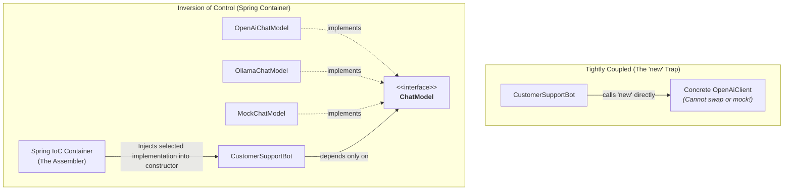

# Day_09 — The Problem Spring Solves: Dependency Hell

| ⬅️ Previous Day | 📚 Course Hub | ➡️ Next Day |
|:---|:---:|---:|
| [← Day 08: I/O, HTTP Client, JSON & Testing](../../Phase_01_Java_Foundations/Day_08_IO_HTTP_JSON_Testing/Day_08_IO_HTTP_JSON_Testing.md) | [All 60 Days Overview](../../README.md) | [Day 10: Spring IoC Container & Bean Lifecycle →](../Day_10_Spring_IoC_Container_Bean_Lifecycle/Day_10_Spring_IoC_Container_Bean_Lifecycle.md) |

---

## 🎯 What You'll Understand By the End
- What **Dependency Injection (DI)** and **Inversion of Control (IoC)** actually mean without framework jargon.
- Why hardcoding `new` inside your classes creates an architectural nightmare called **Dependency Hell**.
- How DI makes your AI services 100% testable and vendor-agnostic (effortlessly swapping OpenAI for Ollama).
- Why **Constructor Injection** with `final` fields is the enterprise gold standard over `@Autowired` field injection.
- How an IoC container works under the hood by looking at a mini reflection-based container.

---

## 🧠 The Problem This Solves

Imagine you are building an AI-powered customer support bot. In pure Java without a framework, you write code using the `new` operator:

```java
public class CustomerSupportBot {
    private OpenAiChatClient chatClient;
    private PostgresVectorStore vectorStore;

    public CustomerSupportBot() {
        // Hardcoding dependencies directly inside the constructor!
        HttpClient httpClient = new HttpClient(10);
        ApiKeyVault vault = new ApiKeyVault("/secrets/keys.json");
        
        this.chatClient = new OpenAiChatClient(httpClient, vault.get("OPENAI_KEY"));
        this.vectorStore = new PostgresVectorStore("jdbc:postgresql://localhost:5432/ai_db");
    }
}
```

This traditional approach leads straight into three fatal architectural traps:
1. **The Concrete Vendor Lock-In**: If OpenAI goes down and your team must switch to Anthropic Claude or local Ollama, you must open `CustomerSupportBot.java`, rewrite its constructor, recompile, and redeploy.
2. **Transitive Construction Explosions**: To instantiate `CustomerSupportBot`, you had to know how to create an `HttpClient`, an `ApiKeyVault`, and a `PostgresVectorStore`. If `HttpClient` adds a new timeout parameter tomorrow, `CustomerSupportBot` breaks even though its conversational logic never changed!
3. **Unit Testing Becomes Impossible**: You cannot run a unit test on `CustomerSupportBot` without connecting to a live PostgreSQL database on port 5432 and spending real money on OpenAI API credits on every test run.

**Inversion of Control (IoC)** and **Dependency Injection (DI)** solve this by taking the responsibility of creating objects away from your classes and giving it to an external assembler: the **Spring IoC Container**.

---

## 📖 Core Concept, Explained Simply

### The Restaurant Chef Analogy

- **Without Inversion of Control (Manual `new`)**:
  - The restaurant chef must wake up at 4:00 AM, drive to a farm to harvest potatoes, slaughter livestock, repair the kitchen plumbing, and install electrical sockets.
  - *Result*: The chef is exhausted, stressed, and has zero time to actually cook meals. If a potato variety changes, the entire restaurant shuts down.
- **With Inversion of Control (Spring IoC)**:
  - The restaurant employs an expert General Manager (the **Spring Container**).
  - The Manager hires suppliers, negotiates bulk ingredient delivery, maintains the building, and stocks the refrigerator.
  - The chef simply declares requirements: *"I need fresh potatoes and a sharp knife delivered to my station."*
  - The Manager places the ingredients directly on the cutting board (**Dependency Injection**). The chef focuses 100% on crafting gourmet dishes!

### The Hollywood Principle: "Don't Call Us, We'll Call You"

- In traditional programming, **your code is in control**: your code decides when to call `new OpenAiChatClient()`.
- In Inversion of Control, **the framework is in control**: Spring inspects your classes, instantiates them in the correct dependency order, and passes (injects) them into your constructors.

### The Three Styles of Injection

1. **Constructor Injection (The Gold Standard)**: Dependencies are supplied as constructor parameters. Allows fields to be `final` (immutable) and guarantees the object cannot be created in an incomplete, broken state.
2. **Setter Injection**: Dependencies are set via setter methods (`setChatModel(...)`). Useful only for optional dependencies or breaking circular dependency cycles.
3. **Field Injection (`@Autowired` on private fields)**: Injects dependencies directly into private fields using reflection. Widely considered an anti-pattern today because it hides dependencies and makes testing outside Spring cumbersome.

> 💡 **New Word Alert — "Dependency"**: Any helper object or service that another class needs in order to perform its work (e.g., a `ChatService` depends on a `ChatModel`).

> 💡 **New Word Alert — "Inversion of Control (IoC)"**: A design principle where the control of object lifecycle and assembly is inverted from the application code to an external framework container.

> 💡 **New Word Alert — "Spring Bean"**: Any regular Java object that is instantiated, assembled, and managed inside the Spring IoC container.

---

## 🗺️ Visual Overview



*This diagram contrasts manual coupling with Inversion of Control. Instead of `CustomerSupportBot` hardcoding a specific provider with `new`, it depends on an abstract `ChatModel` interface. The Spring IoC Container instantiates the chosen implementation and injects it into the bot.*

---

## 💻 Code Walkthrough

Here is a minimal, complete Java example contrasting tightly coupled code with clean constructor-injected code:

```java
// 1. The Interface Abstraction
interface ChatModel {
    String ask(String prompt);
}

// 2. Concrete Provider: OpenAI
class OpenAiChatModel implements ChatModel {
    @Override
    public String ask(String prompt) {
        return "[OpenAI] Answer to: " + prompt;
    }
}

// 3. Test Stunt Double: Mock
class MockChatModel implements ChatModel {
    @Override
    public String ask(String prompt) {
        return "[Mock Test] Canned deterministic answer";
    }
}

// 4. Loosely Coupled Business Service
class CustomerSupportService {
    private final ChatModel chatModel; // Immutable and loosely coupled!

    // Constructor Injection: Spring passes the dependency here automatically
    public CustomerSupportService(ChatModel chatModel) {
        if (chatModel == null) {
            throw new IllegalArgumentException("ChatModel must not be null");
        }
        this.chatModel = chatModel;
    }

    public String handleUserQuery(String query) {
        return chatModel.ask(query);
    }
}

// 5. Demonstrating Swappability
public class DependencyInjectionDemo {
    public static void main(String[] args) {
        // In Production: Inject the real OpenAI model
        CustomerSupportService prodService = new CustomerSupportService(new OpenAiChatModel());
        System.out.println("Production: " + prodService.handleUserQuery("How do I reset my password?"));

        // In Unit Tests: Inject the free, instant Mock model!
        CustomerSupportService testService = new CustomerSupportService(new MockChatModel());
        System.out.println("Testing:    " + testService.handleUserQuery("How do I reset my password?"));
    }
}
```

### Line-by-Line Breakdown

| Code Statement | Plain-English Explanation |
|:---|:---|
| `private final ChatModel chatModel;` | Declares the dependency as an interface rather than a concrete class. Marked `final` to ensure thread-safe immutability. |
| `public CustomerSupportService(ChatModel chatModel)` | The constructor explicitly demands its dependency. The service refuses to exist unless a valid `ChatModel` is provided. |
| `this.chatModel = chatModel;` | Stores the injected reference. The class never calls `new OpenAiChatModel()`. |
| `new CustomerSupportService(new OpenAiChatModel())` | Simulates what the Spring container does in production: creates the dependency and passes it into the dependent object. |
| `new CustomerSupportService(new MockChatModel())` | Demonstrates testability: in tests, we pass a mock without touching a single line of `CustomerSupportService`. |

---

## 🔑 Key Terminology

| Term | Plain-English Meaning |
|:---|:---|
| **Dependency** | An external object or service that a class requires to execute its tasks. |
| **Dependency Injection (DI)** | The technique of supplying dependencies to an object from the outside rather than having the object construct them. |
| **Inversion of Control (IoC)** | Delegating the control of object creation, configuration, and lifecycle to an external framework. |
| **Spring IoC Container** | The core runtime engine in Spring that creates, configures, and manages Spring Beans. |
| **Constructor Injection** | Passing required dependencies as arguments into a class constructor; the recommended best practice. |
| **Field Injection (`@Autowired`)** | Injecting dependencies directly into private fields via reflection; discouraged in modern architecture. |

---

## ⚠️ Common Beginner Mistakes

### 1. Falling Back to `new` Inside a Service
Beginners often create helper objects using `new` inside a class that is already managed by Spring, breaking the dependency chain.

❌ **Wrong Way**:
```java
public class FinancialAiService {
    // Breaks IoC! You cannot mock this in tests or swap configurations.
    private OpenAiClient client = new OpenAiClient(); 
}
```

✅ **Right Way**:
```java
public class FinancialAiService {
    private final ChatModel chatModel;

    // Delegate creation to Spring!
    public FinancialAiService(ChatModel chatModel) {
        this.chatModel = chatModel;
    }
}
```

---

### 2. Overusing Field Injection with `@Autowired`
Placing `@Autowired` directly on private fields makes it impossible to instantiate the class in a pure unit test without spinning up the heavy Spring test context or using reflection.

❌ **Wrong Way (Field Injection)**:
```java
public class PromptService {
    @Autowired
    private ChatModel chatModel; // Cannot instantiate 'new PromptService()' in a plain JUnit test!
}
```

✅ **Right Way (Constructor Injection)**:
```java
public class PromptService {
    private final ChatModel chatModel;

    public PromptService(ChatModel chatModel) {
        this.chatModel = chatModel; // In plain JUnit tests: new PromptService(mockModel)!
    }
}
```

---

### 3. Creating Circular Dependencies
Class A requires Class B in its constructor, and Class B requires Class A in its constructor. Spring fails to start with a `BeanCurrentlyInCreationException`.

❌ **Circular Trap**:
`PromptService` $\rightarrow$ requires `AnalyticsService` $\rightarrow$ requires `PromptService`.

✅ **The Fix**:
Extract the shared logic into a third independent service (`MetricsCollector`), or refactor the workflow so dependencies flow strictly in one direction.

---

## ✅ Best Practices

1. **Always Use Constructor Injection**: It guarantees immutability (`final` fields), prevents `NullPointerException` bugs from missing dependencies, and makes unit tests blazingly fast.
2. **Depend on Interfaces, Not Concrete Classes**: Inject `ChatModel` or `VectorStore`, not `OpenAiChatClient` or `PostgresVectorStore`.
3. **Omit `@Autowired` on Single Constructors**: In modern Spring (Spring 4.3+), if a class has a single constructor, Spring automatically injects dependencies without needing an explicit `@Autowired` annotation.

---

## 🔭 Looking Ahead
In **Day_10**, we will explore the inner mechanics of the **Spring IoC Container** and trace the exact **Bean Lifecycle** from instantiation to destruction.

---

## 📝 Quick Recap
- Hardcoding `new` inside your classes creates rigid coupling, prevents mock testing, and leads to Dependency Hell.
- **Inversion of Control (IoC)** shifts the responsibility of creating and wiring objects to the framework.
- **Dependency Injection (DI)** delivers required objects into a class from the outside.
- **Constructor Injection** with `final` fields is the undisputed enterprise standard for safety and testability.
- Always inject **interfaces** so you can swap AI providers or test mocks with zero code changes.

---

## 🧪 Try It Yourself

1. **Refactor Hardcoded Dependencies**: Take a simple class that creates a `new Random()` internally to generate AI simulation scores. Refactor it to accept a `Random` instance via constructor injection.
2. **Write a Mock Test**: Write a unit test for `CustomerSupportService` using pure Java `new` and verify that passing `new MockChatModel()` returns the expected test message.
3. **Design a Swappable Vector Pipeline**: Create an interface `VectorDatabase` with a method `saveVector(float[] embedding)`. Create two classes `PineconeDb` and `PgVectorDb` implementing it. Write a service that receives the interface and verify how easily the database engine can be swapped.
