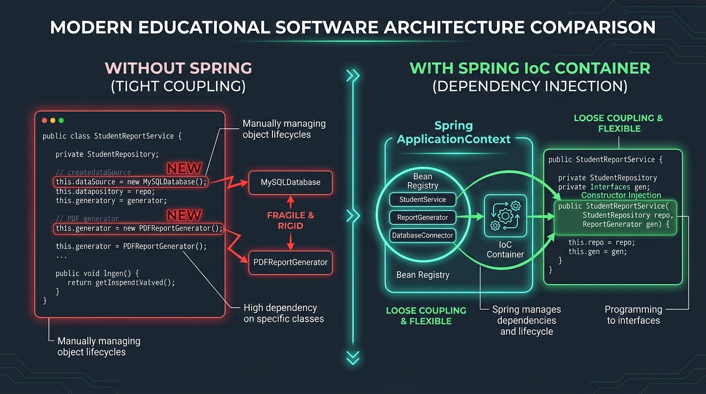

# ⚡ Day 09: The Problem Spring Solves — Dependency Hell
## Why Manual Object Creation Breaks Everything & Building a Mini-DI Container from Scratch

| ⬅️ Previous Day | 📚 Course Hub | ➡️ Next Day |
|:---|:---:|---:|
| [← Day 08: I/O, HTTP Client, JSON & Testing](../../Phase_01_Java_Foundations/Day_08_IO_HTTP_JSON_Testing/Day_08_IO_HTTP_JSON_Testing.md) | [All 60 Days Overview](../../README.md) | [Day 10: Spring IoC Container & Bean Lifecycle →](../Day_10_Spring_IoC_Container_Bean_Lifecycle/Day_10_Spring_IoC_Container_Bean_Lifecycle.md) |

[](../../README.md)
[](../../README.md)
[](../../README.md)
[](../../README.md)

---

## 📌 What Will You Learn Today?

Hey there, my friend! Welcome to **Phase 2: Spring Core & Dependency Injection**! 🚀

Most developers learn Spring backwards: they memorize 20 confusing annotations (`@Autowired`, `@Component`, `@Service`, `@Bean`, `@Configuration`) without understanding **why Spring was created in the first place**. When something goes wrong in their code, they feel completely lost because Spring feels like mysterious black magic.

**Today, we will destroy the magic together.**

We will see the real-world architectural mess called **Dependency Hell** that happens when you manually create objects using `new`. Then, to prove to you how straightforward Dependency Injection actually is, **we will build our own working Mini-Spring Dependency Injection Container from scratch in just 60 lines of pure Java!**

By the end of today, you will clearly understand:
- ✅ **The Root Problem**: Why hardcoding `new` inside your business classes creates tight coupling and makes testing painful.
- ✅ **The Dependency Inversion Principle (DIP)**: The "D" in SOLID design made super simple.
- ✅ **Inversion of Control (IoC)**: The "Hollywood Principle" (*Don't call us, we'll call you*).
- ✅ **Building Our Own Mini-Spring**: Writing custom annotations (`@MyInject`) and wiring objects with Java Reflection.
- ✅ **Decoupling AI Services**: Refactoring a tightly coupled OpenAI service into a swappable, mockable architecture.
- ✅ **The True Definition of a Spring Bean**: Why a "Bean" is just an ordinary Java object living inside Spring's memory map.

---

## 🗺️ Table of Contents

- [1. Real-World Analogy: The Overwhelmed Master Chef](#1-real-world-analogy-the-overwhelmed-master-chef)
- [2. The Problem: Tight Coupling & Manual Instantiation](#2-the-problem-tight-coupling--manual-instantiation)
  - [2.1 The Concrete Dependency Trap in AI Systems](#21-the-concrete-dependency-trap-in-ai-systems)
  - [2.2 Why Testing Becomes Impossible](#22-why-testing-becomes-impossible)
- [3. The Architectural Solution: Inversion of Control (IoC)](#3-the-architectural-solution-inversion-of-control-ioc)
  - [3.1 The Dependency Inversion Principle (DIP)](#31-the-dependency-inversion-principle-dip)
  - [3.2 The Hollywood Principle: Don't Call Us, We'll Call You](#32-the-hollywood-principle-dont-call-us-well-call-you)
- [4. Building a Mini-IoC Container from Scratch (60 Lines of Pure Java)](#4-building-a-mini-ioc-container-from-scratch-60-lines-of-pure-java)
  - [4.1 Defining Custom Annotations (`@MyComponent`, `@MyInject`)](#41-defining-custom-annotations-mycomponent-myinject)
  - [4.2 The Reflection Engine: `MiniApplicationContext`](#42-the-reflection-engine-miniapplicationcontext)
  - [4.3 Testing Our Homemade Container](#43-testing-our-homemade-container)
- [5. How Spring Does This at Enterprise Scale](#5-how-spring-does-this-at-enterprise-scale)
- [6. Key Takeaways & Summary](#6-key-takeaways--summary)
- [7. Practice Exercises & Full Solutions](#7-practice-exercises--full-solutions)
- [8. Self-Check Quiz](#8-self-check-quiz)

---

# 1. Real-World Analogy: The Overwhelmed Master Chef

If you have a solid understanding of core Java (classes, methods, constructors, `new`), Spring Boot can sometimes feel confusing because of all the annotations. 

Let's start by answering the one big question every core Java developer has:
> *"Why do I need a framework to create objects? What is wrong with `new CustomerService()`?"*

Let's look at this architectural comparison:



### 💡 The Restaurant Analogy

Imagine you hire a world-renowned Master Chef to run a Michelin-starred restaurant.

```
                  THE RESTAURANT WITHOUT INVERSION OF CONTROL (MANUAL 'NEW')
┌─────────────────────────────────────────────────────────────────────────────┐
│ 1. The Chef must wake up at 4:00 AM and drive to the farm to harvest wheat. │
│ 2. The Chef must personally butcher a cow for the steaks.                   │
│ 3. The Chef must unclog the kitchen drain and repair the electrical wiring. │
│ 4. The Chef must wait tables and wash dishes.                               │
│                                                                             │
│ Result: The Chef has zero time to actually COOK! The restaurant collapses.  │
└─────────────────────────────────────────────────────────────────────────────┘
                                      vs.
                     THE RESTAURANT WITH INVERSION OF CONTROL (SPRING IOC)
┌─────────────────────────────────────────────────────────────────────────────┐
│ 1. The General Manager (The Spring IoC Container) manages everything.       │
│ 2. The General Manager hires suppliers, delivers clean vegetables, fixes    │
│    plumbing, and hires waitstaff.                                           │
│ 3. The Chef simply says: "I need fresh tomatoes and a sharp knife."         │
│ 4. The General Manager places them directly on the counter (Dependency      │
│    Injection). The Chef focuses 100% on cooking gourmet meals!              │
└─────────────────────────────────────────────────────────────────────────────┘
```

In software:
- **The Chef** is your **Business Service** (e.g., `CustomerSupportAgent`).
- **The Ingredients & Tools** are your **Dependencies** (e.g., `ChatModel`, `VectorStore`, `DatabaseConnection`).
- **The General Manager** is **The Spring Framework**.

---

### 💡 The Plain-English Spring Glossary (No Jargon!)

| Spring Jargon | What It ACTUALLY Means in Plain English |
| :--- | :--- |
| **Bean** | Just an ordinary Java object created and held in memory by Spring. If Spring creates `new UserService()`, that instance is called a "Bean". |
| **IoC (Inversion of Control)** | Flipping control: instead of you typing `new Database()`, you let the framework create it and give it to you. |
| **DI (Dependency Injection)** | Handing an object what it needs through its constructor, rather than letting it build its own tools. |
| **ApplicationContext** | Spring's central brain/container. It's essentially a `Map<String, Object>` where Spring stores all initialized Beans. |
| **`@Component` / `@Service`** | A post-it note on your class telling Spring: *"Hey Spring, please create an instance of this class and manage it in your registry."* |

---

# 2. The Problem: Tight Coupling & Manual Instantiation

### 2.1 The Concrete Dependency Trap in AI Systems

Look at how a junior developer typically builds an AI customer support bot:

```java
package com.javagenai.day09.bad;

public class CustomerSupportBot {

    // HARDCODED TIGHT COUPLING!
    private OpenAiChatClient chatClient;
    private PostgresVectorStore vectorStore;
    private SlackNotifier notifier;

    public CustomerSupportBot() {
        // The bot is manually creating every single one of its own dependencies!
        HttpClient httpClient = new HttpClient(10);
        ApiKeyVault vault = new ApiKeyVault("/secrets/keys.json");
        
        this.chatClient = new OpenAiChatClient(httpClient, vault.get("OPENAI_KEY"));
        this.vectorStore = new PostgresVectorStore("jdbc:postgresql://localhost:5432/ai_db");
        this.notifier = new SlackNotifier("https://hooks.slack.com/services/...");
    }

    public String handleInquiry(String userQuestion) {
        String context = vectorStore.searchSimilar(userQuestion);
        String answer = chatClient.generate(context + "\n" + userQuestion);
        notifier.sendAlert("Handled inquiry: " + userQuestion);
        return answer;
    }
}
```

### Why is this code an architectural disaster?

1. **Rigid Fragility**: `CustomerSupportBot` is tightly glued to `OpenAiChatClient` and `PostgresVectorStore`. If management says: *"OpenAI is down, switch to local Ollama immediately"*, you must modify `CustomerSupportBot`, recompile, and redeploy!
2. **Hidden Transitive Explosions**: To instantiate `CustomerSupportBot`, you must also know how to instantiate `HttpClient`, `ApiKeyVault`, `PostgresVectorStore`, and `SlackNotifier`. If `HttpClient` adds a new parameter tomorrow, `CustomerSupportBot` breaks!
3. **Violates the Single Responsibility Principle**: The bot's job is to handle customer questions—why is it managing database connection strings and secret file paths?

---

### 2.2 Why Testing Becomes Impossible

How do you write a unit test for `handleInquiry()`?
- You **cannot** test it without a live PostgreSQL database running on `localhost:5432`!
- You **cannot** test it without spending real money on OpenAI API keys!
- You **cannot** test it without spamming your company's live Slack channel!

Because the objects are created with `new` inside the constructor, you have no way to inject mock objects.

---

# 3. The Architectural Solution: Inversion of Control (IoC)

### 3.1 The Dependency Inversion Principle (DIP)

The 5th SOLID principle states:
> 1. High-level modules should not depend on low-level modules. Both should depend on **abstractions (interfaces)**.
> 2. Abstractions should not depend on details. Details should depend on abstractions.

Instead of depending on concrete `OpenAiChatClient`, our bot should depend on the interface: **`ChatModel`**.

```
  TRADITIONAL TIGHT COUPLING:
  [ CustomerSupportBot ] ──(directly calls new)──► [ OpenAiChatClient ]

  DEPENDENCY INVERSION:
  [ CustomerSupportBot ] ──► [ <<interface>> ChatModel ] ◄── [ OpenAiChatClient ]
                                                         ◄── [ OllamaChatModel ]
                                                         ◄── [ MockChatModel ]
```

---

### 3.2 The Hollywood Principle: Don't Call Us, We'll Call You

In traditional programming, **your code is in control**: your code calls library methods and creates objects with `new`.

In **Inversion of Control (IoC)**, **the framework is in control**:
- You don't create objects; the container creates them.
- You don't call the container; the container calls your code when needed.
- You don't fetch dependencies; the container **injects** them into your constructor or fields.

```java
// CLEAN & DECOUPLED: Dependency Injection!
public class CustomerSupportBot {
    private final ChatModel chatModel;
    private final VectorStore vectorStore;

    // Dependencies are INJECTED from the outside!
    public CustomerSupportBot(ChatModel chatModel, VectorStore vectorStore) {
        this.chatModel = chatModel;
        this.vectorStore = vectorStore;
    }

    public String handleInquiry(String question) {
        String context = vectorStore.search(question);
        return chatModel.generate(context + "\n" + question);
    }
}
```
Now:
- In Production: Pass `new OpenAiChatModel(...)` and `new PgVectorStore(...)`.
- In Local Dev: Pass `new OllamaChatModel(...)` and `new InMemoryVectorStore(...)`.
- In Unit Tests: Pass `mock(ChatModel.class)` with zero network calls!

---

# 4. Building a Mini-IoC Container from Scratch (60 Lines of Pure Java)

To truly understand Spring, let's write our own miniature dependency injection container. No third-party libraries—just pure Java Reflection!

### 4.1 Defining Custom Annotations

We need two annotations:
1. `@MyComponent`: Tells our container to create and manage an instance of this class (a Bean).
2. `@MyInject`: Tells our container to inject a managed bean into this field.

```java
package com.javagenai.day09.mini_ioc;

import java.lang.annotation.Retention;
import java.lang.annotation.RetentionPolicy;
import java.lang.annotation.Target;
import java.lang.annotation.ElementType;

@Retention(RetentionPolicy.RUNTIME) // Kept in bytecode so reflection can read it at runtime
@Target(ElementType.TYPE)           // Can only be placed on Classes
public @interface MyComponent {}
```

```java
package com.javagenai.day09.mini_ioc;

import java.lang.annotation.Retention;
import java.lang.annotation.RetentionPolicy;
import java.lang.annotation.Target;
import java.lang.annotation.ElementType;

@Retention(RetentionPolicy.RUNTIME)
@Target(ElementType.FIELD)          // Can only be placed on Fields
public @interface MyInject {}
```

---

### 4.2 The Reflection Engine: `MiniApplicationContext`

Here is the entire container in **60 lines of Java**:

```java
package com.javagenai.day09.mini_ioc;

import java.lang.reflect.Field;
import java.util.HashMap;
import java.util.Map;

public class MiniApplicationContext {

    // The Bean Registry (Stores singleton instances by their Class type)
    private final Map<Class<?>, Object> beanRegistry = new HashMap<>();

    public MiniApplicationContext(Class<?>... componentClasses) {
        try {
            // STEP 1: Instantiation Phase (Create an instance of every @MyComponent)
            for (Class<?> clazz : componentClasses) {
                if (clazz.isAnnotationPresent(MyComponent.class)) {
                    Object instance = clazz.getDeclaredConstructor().newInstance();
                    beanRegistry.put(clazz, instance);
                    System.out.println("[Mini-IoC] Registered Bean: " + clazz.getSimpleName());
                }
            }

            // STEP 2: Injection Phase (Wire dependencies into @MyInject fields)
            for (Object bean : beanRegistry.values()) {
                for (Field field : bean.getClass().getDeclaredFields()) {
                    if (field.isAnnotationPresent(MyInject.class)) {
                        Class<?> fieldType = field.getType();
                        Object dependencyToInject = beanRegistry.get(fieldType);

                        if (dependencyToInject != null) {
                            field.setAccessible(true); // Bypass private access modifier!
                            field.set(bean, dependencyToInject); // INJECTION OCCURS HERE!
                            System.out.println("[Mini-IoC] Injected " + fieldType.getSimpleName() 
                                               + " into " + bean.getClass().getSimpleName() + "." + field.getName());
                        } else {
                            throw new RuntimeException("No bean found of type: " + fieldType.getName());
                        }
                    }
                }
            }
        } catch (Exception e) {
            throw new RuntimeException("IoC Container Initialization Failed", e);
        }
    }

    // Retrieve a managed bean
    @SuppressWarnings("unchecked")
    public <T> T getBean(Class<T> requiredType) {
        T bean = (T) beanRegistry.get(requiredType);
        if (bean == null) {
            throw new IllegalArgumentException("No bean found for: " + requiredType.getName());
        }
        return bean;
    }
}
```

---

### 4.3 Testing Our Homemade Container

Let's define two components:
1. `ChatEngine`: An AI service component.
2. `CustomerBot`: A consumer that needs `ChatEngine`.

```java
package com.javagenai.day09.mini_ioc;

@MyComponent
public class ChatEngine {
    public String askLLM(String prompt) {
        return "[Simulated LLM Response to: '" + prompt + "']";
    }
}
```

```java
package com.javagenai.day09.mini_ioc;

@MyComponent
public class CustomerBot {

    @MyInject // The container will automatically populate this field!
    private ChatEngine chatEngine;

    public String answer(String question) {
        return chatEngine.askLLM(question);
    }
}
```

Now let's launch the container in `main`:

```java
package com.javagenai.day09.mini_ioc;

public class MiniIoCDemo {

    public static void main(String[] args) {
        System.out.println("=== Booting Mini-IoC Container ===");

        // Boot the container with our component classes
        MiniApplicationContext context = new MiniApplicationContext(ChatEngine.class, CustomerBot.class);

        System.out.println("\n=== Application Running ===");
        // Retrieve the fully-wired CustomerBot!
        CustomerBot bot = context.getBean(CustomerBot.class);

        String answer = bot.answer("How does Dependency Injection work?");
        System.out.println("Result: " + answer);
    }
}
```

**Output:**
```text
=== Booting Mini-IoC Container ===
[Mini-IoC] Registered Bean: ChatEngine
[Mini-IoC] Registered Bean: CustomerBot
[Mini-IoC] Injected ChatEngine into CustomerBot.chatEngine

=== Application Running ===
Result: [Simulated LLM Response to: 'How does Dependency Injection work?']
```

> **Notice: We never called `new CustomerBot()` or `new ChatEngine()` in our business logic.**
> The container discovered the annotations, instantiated the objects, wired the private fields via reflection, and handed us a fully functioning application graph!

---

# 5. How Spring Does This at Enterprise Scale

What we just wrote in 60 lines is the foundational concept behind the entire multi-billion-dollar Spring Framework:

| Our Mini-IoC Container | Spring Boot Framework |
| :--- | :--- |
| `@MyComponent` | `@Component`, `@Service`, `@Repository`, `@Controller` |
| `@MyInject` | `@Autowired` / Constructor Injection |
| `MiniApplicationContext` | `org.springframework.context.ApplicationContext` |
| Manual class list `(ChatEngine.class, ...)` | **Classpath Scanning (`@ComponentScan`)** — automatically scans your whole project! |
| Basic reflection instantiation | Advanced lifecycle hooks (`@PostConstruct`, proxying, AOP, transaction boundaries) |

Now that you have seen and built the mechanism yourself, Spring is no longer a scary mystery. It is simply an intelligent, battle-tested registry that instantiates your objects and connects their pointers together!

---

# 6. Key Takeaways & Summary

```
                  ┌─────────────────────────────────┐
                  │       DAY 09 CHEAT SHEET        │
                  └────────────────┬────────────────┘
                                   │
         ┌─────────────────────────┼─────────────────────────┐
         ▼                         ▼                         ▼
  [ The Core Problem ]     [ Inversion of Control ]  [ The Bean Secret ]
  • Hardcoding 'new' binds • Container creates and   • A Bean is just a plain
    classes to concrete      wires dependencies        Java object (POJO)
    implementations        • Code depends on         • Spring calls the
  • Makes mocking and        interfaces, not           constructor and stores
    unit testing near        concrete classes          the instance in its
    impossible             • Easy to swap OpenAI       ApplicationContext
  • Fragile to change        for Ollama or Mocks       registry
```

---

# 7. Practice Exercises & Full Solutions

### 🏋️ Exercise 1: Constructor Injection vs Field Injection
**Question**: Why does modern Spring strongly recommend **Constructor Injection** over **Field Injection** (`@Autowired` directly on private fields)?

#### Solution / Analysis:
1. **Immutability (`final`)**: With constructor injection, fields can be marked `final`, ensuring the dependency cannot be altered after creation. Field injection forces fields to be non-final.
2. **Easy Unit Testing Without Spring**: With constructor injection, you can instantiate the class in a pure JUnit test using `new MyService(mockDependency)` without booting the Spring container or using reflection hacks.
3. **Fail-Fast Safety**: If a required dependency is missing, constructor injection fails immediately at compile-time or JVM startup, rather than throwing a `NullPointerException` later at runtime.

---

### 🏋️ Exercise 2: Refactoring a Vector Pipeline with DIP
**Objective**: Take a tightly-coupled `VectorSearchPipeline` and refactor it to accept an interface `EmbeddingService` and an interface `VectorDatabase` via constructor injection.

#### Solution:
```java
package com.javagenai.day09;

import java.util.List;

// 1. Abstraction 1
public interface EmbeddingService {
    double[] generateEmbedding(String text);
}

// 2. Abstraction 2
public interface VectorDatabase {
    List<String> findNearest(double[] vector, int topK);
}

// 3. Fully Decoupled Service!
public class VectorSearchPipeline {
    private final EmbeddingService embeddingService;
    private final VectorDatabase vectorDatabase;

    public VectorSearchPipeline(EmbeddingService embeddingService, VectorDatabase vectorDatabase) {
        this.embeddingService = embeddingService;
        this.vectorDatabase = vectorDatabase;
    }

    public List<String> search(String userQuery, int limit) {
        double[] queryVector = embeddingService.generateEmbedding(userQuery);
        return vectorDatabase.findNearest(queryVector, limit);
    }
}
```

---

## 8. Self-Check Quiz

1. **What is "Dependency Hell"?**
   - *Answer*: An architectural anti-pattern where classes manually instantiate their own concrete dependencies using `new`, resulting in tight coupling, fragile code, and an inability to unit test without real infrastructure.
2. **What is the "Hollywood Principle"?**
   - *Answer*: "Don't call us, we'll call you." In Inversion of Control, the framework dictates the flow of execution and injects dependencies, rather than the developer's code manually constructing the runtime graph.
3. **What is a "Spring Bean"?**
   - *Answer*: An ordinary Java object that is instantiated, configured, assembled, and managed by the Spring IoC container.
4. **How does our `MiniApplicationContext` inject private fields?**
   - *Answer*: By using Java Reflection (`field.setAccessible(true)` and `field.set(bean, dependency)`), which allows the container to bypass normal Java access control checks during startup.
5. **How does Dependency Injection benefit Spring AI?**
   - *Answer*: It allows your business services to depend on the `ChatModel` interface, letting you swap OpenAI for Ollama or test mocks by changing a single configuration line without modifying your application code.

---

<p align="center">
  <b>Awesome start to Phase 2! 🎉</b><br>
  You now understand what Spring actually does under the hood: it's a smart manager that creates and wires your Java objects so you don't have to write messy <code>new</code> statements everywhere.<br>
  Tomorrow on <b>Day 10</b>, we enter official Spring territory with the <b>Spring IoC Container & Bean Lifecycle</b>: <code>@Component</code>, <code>@Service</code>, <code>@Repository</code>, Bean Scopes, and <code>@PostConstruct</code>! Keep up the fantastic energy!
</p>
