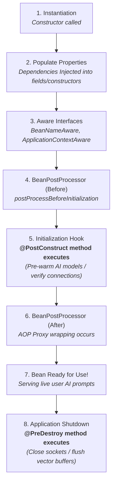

# Day_10 — Spring IoC Container & Bean Lifecycle

| ⬅️ Previous Day | 📚 Course Hub | ➡️ Next Day |
|:---|:---:|---:|
| [← Day 09: The Problem Spring Solves — Dependency Hell](../Day_09_Problem_Spring_Solves_Dependency_Hell/Day_09_Problem_Spring_Solves_Dependency_Hell.md) | [All 60 Days Overview](../../README.md) | [Day 11: Dependency Injection In-Depth →](../Day_11_Dependency_Injection_In_Depth/Day_11_Dependency_Injection_In_Depth.md) |

---

## 🎯 What You'll Understand By the End
- The core role of the **`ApplicationContext`** as the master registry for your application's objects.
- How **Stereotype Annotations** (`@Component`, `@Service`, `@Repository`) tell Spring which classes to manage and what roles they play.
- The vital difference between **Singleton Scope** (one shared instance) and **Prototype Scope** (a fresh instance every time).
- The exact **Bean Lifecycle Pipeline** from raw constructor allocation to graceful `@PreDestroy` shutdown.
- How to pre-warm local AI models and vector index connections using **`@PostConstruct`** so your users never face cold-start lag.

---

## 🧠 The Problem This Solves

When an application starts up, creating objects in the wrong order leads to immediate runtime crashes:

1. **The Startup Initialization Race**: If your AI service attempts to execute a vector search in its constructor before its database connection dependency has been configured and established, it throws an immediate `NullPointerException`.
2. **Cold-Start User Latency**: If an AI embedding model takes 4 seconds to download neural network weights into memory, the very first user who submits a prompt has to wait 4 seconds. Without lifecycle management, you cannot easily instruct the app to warm up the model before opening the web server ports.
3. **Data Contamination Between Users**: In web applications, if you mistakenly store a user's private chat history inside an instance variable of a shared **Singleton** service, User B will accidentally see User A's private AI conversation!

The **Spring IoC Container** and its **Bean Lifecycle** solve this by orchestrating the precise order of instantiation, dependency wiring, initialization callbacks, and scope boundaries.

---

## 📖 Core Concept, Explained Simply

### The 5-Star Luxury Hotel Analogy

Think of the Spring `ApplicationContext` as a world-class luxury hotel:

- **The Hotel Amenities (Singleton Scope - Default)**:
  - The swimming pool, fitness gym, and dining hall are built once when the hotel opens.
  - All 500 guests share the exact same pool at the same time.
  - *Rule*: Because it is shared, the pool must be clean and stateless. Nobody leaves their private luggage floating in the pool!
  - *In AI*: Your `OpenAiClient` or `PgVectorStore` is a singleton — thread-safe and shared by all incoming requests.
- **The Room Key & Slippers (Prototype Scope)**:
  - Issued fresh and new whenever an individual guest checks in. It is private to that guest and never shared.
  - *In AI*: A `ChatConversationState` holding a user's active multi-turn dialogue history.
- **The Welcome Fruit Basket (`@PostConstruct`)**:
  - Placed inside the room *after* the bed and furniture are assembled, right before the guest steps inside. This is where you perform setup tasks once dependencies are wired.
- **Housekeeping Check-Out (`@PreDestroy`)**:
  - When the guest leaves, housekeeping cleans the room, turns off the air conditioning, and safely closes the door.

### Stereotype Annotations

Spring uses specialized annotations called **stereotypes** to categorize beans:
- **`@Component`**: The generic parent annotation for any Spring-managed Java class.
- **`@Service`**: Marks business logic components (e.g., prompt crafting, model orchestration, response filtering).
- **`@Repository`**: Marks data access classes (e.g., talking to PostgreSQL, MongoDB, or Pinecone); Spring automatically translates database SQL errors into consistent exceptions.
- **`@RestController`**: Marks API web endpoints that receive incoming HTTP requests and return JSON responses.

> 💡 **New Word Alert — "ApplicationContext"**: The primary enterprise Spring container interface that loads bean definitions, wires dependencies together, and manages object lifecycles.

> 💡 **New Word Alert — "Bean Scope"**: The lifecycle rule that determines how many instances of a bean Spring creates and how those instances are shared across the application.

> 💡 **New Word Alert — "@PostConstruct"**: A method annotation instructing Spring to run that specific initialization method immediately after the constructor finishes and all dependencies are injected.

---

## 🗺️ Visual Overview



*This diagram illustrates the lifecycle of a Spring Bean. The constructor runs first, followed by dependency injection. Once dependencies are in place, Spring triggers `@PostConstruct` for startup logic. When the application stops, `@PreDestroy` runs to release system resources.*

---

## 💻 Code Walkthrough

Here is a minimal, complete Java example showing how to use `@Service`, `@PostConstruct`, and `@PreDestroy` to pre-warm an AI model:

```java
import jakarta.annotation.PostConstruct;
import jakarta.annotation.PreDestroy;
import org.springframework.stereotype.Service;

@Service // 1. Registered as a Singleton bean in the ApplicationContext
public class EmbeddingModelService {
    private boolean modelLoaded = false;

    // Phase 1: Constructor (Instantiation)
    public EmbeddingModelService() {
        System.out.println("[Step 1] Constructor: Bean memory allocated on the Heap.");
        System.out.println("         Model status: " + modelLoaded);
    }

    // Phase 2: Post-Initialization Hook
    @PostConstruct
    public void init() {
        System.out.println("[Step 2] @PostConstruct: Dependencies ready. Pre-warming neural weights...");
        // Simulate loading heavy model weights into memory
        this.modelLoaded = true;
        System.out.println("         Model weights loaded successfully into memory cache!");
    }

    // Phase 3: Ready for Business
    public float[] generateEmbedding(String text) {
        if (!modelLoaded) {
            throw new IllegalStateException("Cannot embed text: Model is not loaded!");
        }
        System.out.println("[Step 3] Processing embedding for text: '" + text + "'");
        return new float[]{0.12f, -0.45f, 0.88f}; // Simulated vector embedding
    }

    // Phase 4: Teardown Hook
    @PreDestroy
    public void cleanup() {
        System.out.println("[Step 4] @PreDestroy: Application shutting down.");
        System.out.println("         Flushing cache and unloading model weights from RAM.");
        this.modelLoaded = false;
    }
}
```

### Line-by-Line Breakdown

| Code Statement | Plain-English Explanation |
|:---|:---|
| `@Service` | Instructs Spring's classpath scanner to register this class as a managed business bean. By default, it is a **Singleton**. |
| `public EmbeddingModelService()` | Spring calls the constructor first to allocate the object on the Heap. |
| `@PostConstruct public void init()` | Runs automatically *after* all dependencies are injected. Perfect for expensive warm-up routines (loading model files, verifying vector database connectivity). |
| `generateEmbedding(...)` | The active business method used during the application's runtime. Because the model was pre-warmed in `@PostConstruct`, the first user experiences zero cold-start delay. |
| `@PreDestroy public void cleanup()` | Runs automatically when the application receives a shutdown signal (e.g., stopping the server), releasing resources cleanly. |

---

## 🔑 Key Terminology

| Term | Plain-English Meaning |
|:---|:---|
| **`ApplicationContext`** | The central Spring engine that manages the creation, wiring, and lifecycle of all beans. |
| **`@Component`** | The base annotation indicating that a Java class is a Spring-managed component. |
| **`@Service`** | A specialization of `@Component` used to designate classes holding business logic. |
| **`@Repository`** | A specialization of `@Component` used for database and vector store access classes. |
| **Singleton Scope** | Default bean scope: Spring creates exactly one shared instance for the entire application. |
| **Prototype Scope** | Bean scope where Spring creates a brand-new instance every time the bean is requested. |
| **`@PostConstruct`** | Lifecycle callback executed once after the bean has been instantiated and all dependencies injected. |
| **`@PreDestroy`** | Lifecycle callback executed right before the bean is destroyed when the application shuts down. |

---

## ⚠️ Common Beginner Mistakes

### 1. Storing User-Specific State in a Singleton Bean
By default, all Spring beans are Singletons shared across all concurrent users. Storing mutable user state in instance fields causes cross-user data leaks.

❌ **Dangerous Bug (Data Contamination)**:
```java
@Service
public class ChatService {
    private String currentUserPrompt; // BUG! Shared across ALL users simultaneously!

    public String handlePrompt(String prompt) {
        this.currentUserPrompt = prompt; // User B's prompt overwrites User A's prompt!
        return callModel(this.currentUserPrompt);
    }
}
```

✅ **Right Way (Stateless Singleton)**:
```java
@Service
public class ChatService {
    // No mutable user state in fields!
    public String handlePrompt(String prompt) {
        // Prompt is passed as a local parameter on the thread stack:
        return callModel(prompt);
    }
}
```
*Why it is wrong*: Singletons must be strictly stateless or thread-safe. Keep user-specific data inside method parameters or prototype-scoped objects.

---

### 2. Performing Heavy Work Inside the Constructor
Constructors should only allocate fields. Calling remote APIs or loading heavy files in a constructor happens before Spring has finished wiring dependencies or configuring security proxies.

❌ **Wrong Way**:
```java
@Service
public class VectorService {
    public VectorService() {
        connectToRemoteDatabase(); // Too early! Injected configs may still be null.
    }
}
```

✅ **Right Way**:
```java
@Service
public class VectorService {
    @PostConstruct
    public void init() {
        connectToRemoteDatabase(); // Safe! All dependencies and properties are fully injected.
    }
}
```

---

### 3. Using `@PreDestroy` with Prototype Beans
Spring creates prototype beans on demand, but it **does not manage their complete lifecycle**. Spring will never call `@PreDestroy` on a prototype-scoped bean!

❌ **Misconception**:
Expecting `@PreDestroy` to automatically close sockets on a `@Scope("prototype")` bean.

✅ **Right Understanding**:
The client code that requests a prototype bean is responsible for cleaning it up when finished.

---

## ✅ Best Practices

1. **Keep Singletons Strictly Stateless**: Design your `@Service` and `@Repository` classes to operate only on method arguments and immutable helper dependencies.
2. **Use `@PostConstruct` for Readiness Verification**: Validate that mandatory environment variables (like `OPENAI_API_KEY`) exist during `@PostConstruct` so the application fails fast at startup if configuration is missing.
3. **Always Clean Up in `@PreDestroy`**: Close file handles, disconnect database connection pools, and cancel active streaming threads inside `@PreDestroy` to prevent server resource leaks.

---

## 🔭 Looking Ahead
In **Day_11**, we will dive into **Dependency Injection In-Depth**, exploring `@Qualifier`, `@Primary`, and `@Configuration`/`@Bean` methods to manage third-party AI libraries.

---

## 📝 Quick Recap
- The **`ApplicationContext`** manages all Spring beans and coordinates their lifecycles.
- Use **`@Service`** for business logic, **`@Repository`** for databases, and **`@Component`** for general utilities.
- **Singleton** (default) creates one shared instance; **Prototype** creates a fresh instance per request.
- Singletons must always remain **stateless** to avoid threading and security bugs.
- **`@PostConstruct`** runs after dependencies are wired (ideal for model pre-warming); **`@PreDestroy`** runs on application shutdown.

---

## 🧪 Try It Yourself

1. **Inspect Lifecycle Order**: Create a `@Component` named `LifecycleLogger` that prints messages inside its constructor, a `@PostConstruct` method, and a `@PreDestroy` method. Observe the exact order of execution in the console logs.
2. **Fail-Fast API Key Check**: In a `@PostConstruct` method, read `System.getenv("AI_API_KEY")`. If null or blank, throw an `IllegalStateException("AI_API_KEY must be provided")` and observe how Spring cleanly halts application startup before receiving any bad requests.
3. **Singleton vs Prototype Test**: Create a `@Component` with `@Scope("prototype")` that holds an integer counter. In your main method, request the bean twice from the context and verify that the two instances have distinct memory addresses.
