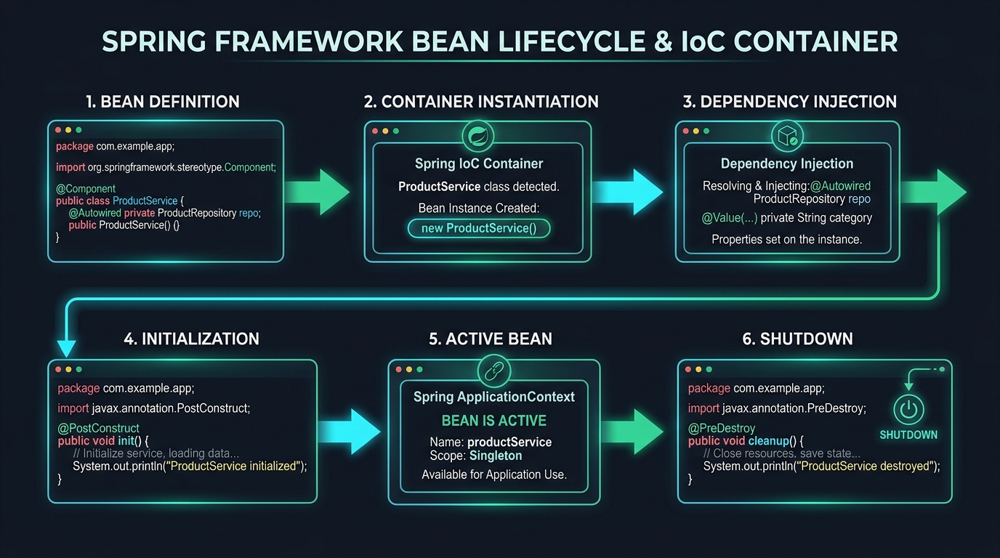

# 🏛️ Day 10: Spring IoC Container & Bean Lifecycle
## Component, Service, Repository, Bean Scopes, and the Lifecycle Pipeline

| ⬅️ Previous Day | 📚 Course Hub | ➡️ Next Day |
|:---|:---:|---:|
| [← Day 09: The Problem Spring Solves — Dependency Hell](../Day_09_Problem_Spring_Solves_Dependency_Hell/Day_09_Problem_Spring_Solves_Dependency_Hell.md) | [All 60 Days Overview](../../README.md) | [Day 11: Dependency Injection In-Depth →](../Day_11_Dependency_Injection_In_Depth/Day_11_Dependency_Injection_In_Depth.md) |

[](../../README.md)
[](../../README.md)
[](../../README.md)
[](../../README.md)

---

## 📌 What Will You Learn Today?

Yesterday, we built our own 60-line Dependency Injection container and demystified how reflection discovers and wires objects. Today, we step into the official **Spring Framework IoC Container** (`ApplicationContext`) and master how enterprise applications manage the complete lifecycle of AI components.

You will learn why Spring has different annotations (`@Component`, `@Service`, `@Repository`), how Spring automatically scans your packages, how **Bean Scopes** prevent race conditions in AI chatbots, and how lifecycle hooks (`@PostConstruct` and `@PreDestroy`) allow you to pre-load embedding models into memory and cleanly disconnect database sockets.

By the end of today, you will master:
- ✅ **The `ApplicationContext`**: Spring's enterprise bean registry and engine.
- ✅ **Stereotype Annotations**: The semantic difference between `@Component`, `@Service`, and `@Repository`.
- ✅ **Component Scanning (`@ComponentScan`)**: How Spring reads the classpath and discovers beans.
- ✅ **Bean Scopes**: `singleton` vs. `prototype` (and web scopes `request` / `session`).
- ✅ **The 7-Step Bean Lifecycle Pipeline**: From constructor invocation to `@PreDestroy` cleanup.
- ✅ **Lifecycle Hooks in Action**: Using `@PostConstruct` to warm up local LLM weights or initialize vector indexes.
- ✅ **Circular Dependencies**: What causes them and how modern Spring Boot prevents them.

---

## 🗺️ Table of Contents

- [1. Real-World Analogy: The 5-Star Luxury Hotel](#1-real-world-analogy-the-5-star-luxury-hotel)
- [2. The Spring IoC Container: `BeanFactory` vs `ApplicationContext`](#2-the-spring-ioc-container-beanfactory-vs-applicationcontext)
- [3. Stereotype Annotations: Giving Beans an Identity](#3-stereotype-annotations-giving-beans-an-identity)
  - [3.1 `@Component`: The Generic Blueprint](#31-component-the-generic-blueprint)
  - [3.2 `@Service`: The AI Business Orchestrator](#32-service-the-ai-business-orchestrator)
  - [3.3 `@Repository`: The Vector Database Gateway](#33-repository-the-vector-database-gateway)
- [4. Bean Scopes: Who Shares What?](#4-bean-scopes-who-shares-what)
  - [4.1 Singleton Scope (The Default)](#41-singleton-scope-the-default)
  - [4.2 Prototype Scope: Multi-Turn Conversation Memory](#42-prototype-scope-multi-turn-conversation-memory)
  - [4.3 Web Scopes (`@RequestScope`, `@SessionScope`)](#43-web-scopes-requestscope-sessionscope)
- [5. The 7-Step Bean Lifecycle Pipeline](#5-the-7-step-bean-lifecycle-pipeline)
  - [5.1 Visualizing the Lifecycle Stages](#51-visualizing-the-lifecycle-stages)
  - [5.2 `@PostConstruct`: Pre-Warming AI Models](#52-postconstruct-pre-warming-ai-models)
  - [5.3 `@PreDestroy`: Graceful Resource Cleanup](#53-predestroy-graceful-resource-cleanup)
- [6. Circular Dependencies: The Infinite Chicken-and-Egg Loop](#6-circular-dependencies-the-infinite-chicken-and-egg-loop)
- [7. Key Takeaways & Summary](#7-key-takeaways--summary)
- [8. Practice Exercises & Full Solutions](#8-practice-exercises--full-solutions)
- [9. Self-Check Quiz](#9-self-check-quiz)

---

# 1. Real-World Analogy: The 5-Star Luxury Hotel



Imagine checking into the Burj Al Arab or the Ritz-Carlton.

```
                           THE LUXURY HOTEL (Spring Container)
┌─────────────────────────────────────────────────────────────────────────────┐
│ 1. The Swimming Pool & Gym (Singleton Scope):                               │
│    Built once when the hotel opens. Shared simultaneously by all 500 guests.│
│                                                                             │
│ 2. The Keycard & Fresh Towels (Prototype Scope):                            │
│    Minted fresh on demand whenever a new guest checks in. Never shared.     │
│                                                                             │
│ 3. The Welcome Fruit Basket (@PostConstruct):                               │
│    Placed in your room AFTER the furniture is arranged, right before you    │
│    walk through the door.                                                   │
│                                                                             │
│ 4. Housekeeping Room Clean-up (@PreDestroy):                                │
│    Cleans the room and shuts off the AC after you check out.                │
└─────────────────────────────────────────────────────────────────────────────┘
```

In your Spring AI application:
- **`ChatClient`** is the swimming pool (Singleton: shared by all users).
- **`ConversationState`** is the private room key (Prototype / Session: private per user).
- **`@PostConstruct`** warms up local Ollama models before users start sending prompts!

---

## 🧭 The Mid-Level Java Developer Bridge: Stereotypes & Lifecycle Demystified

If you've only written core Java, Spring's annotations might look like black magic. Here is the exact translation into concepts you already know:

| Spring Term / Annotation | What You Did in Core Java | What Spring Does For You | Plain English Meaning |
| :--- | :--- | :--- | :--- |
| **`@Component`** | `MyClass obj = new MyClass();` | Scans classpath, finds this class, creates an instance, keeps it in memory. | *"Hey Spring, manage this class for me."* |
| **`@Service`** | Same as `@Component`, but holds business logic. | Identical to `@Component`, but marks business logic (makes code clear to teammates and tools). | *"This bean does calculations, orchestrates AI, and applies business rules."* |
| **`@Repository`** | DAO class with JDBC/SQL queries. | Identical to `@Component`, but also catches SQL exceptions and wraps them in Spring's clean `DataAccessException`. | *"This bean talks to databases or vector stores."* |
| **Singleton Scope (Default)** | You wrote a static variable `private static MyClass instance;` | Spring makes **exactly one** instance when the app boots and shares it across all threads. | 1 object reused everywhere. Memory efficient! |
| **Prototype Scope** | `new MyClass()` called every time | Spring creates a brand-new object each time a class asks for it. | Fresh instance per request. |
| **`@PostConstruct`** | Code placed right after `new MyClass()` inside your `main` method. | Runs automatically **immediately after** Spring creates the bean and injects all dependencies. | Perfect place to load AI model files or check database connection. |
| **`@PreDestroy`** | A shutdown hook or `Runtime.getRuntime().addShutdownHook(...)`. | Runs automatically right before the application stops or the bean is garbage collected. | Close database sockets, flush cached chat history to disk. |

---

# 2. The Spring IoC Container: `BeanFactory` vs `ApplicationContext`

In Spring, the container exists as two primary interfaces:

```
┌─────────────────────────────────────────────────────────────────────────┐
│                        BeanFactory (Legacy Core)                        │
│  - Basic dependency injection                                           │
│  - Lazy bean loading (creates beans only when requested)                │
└────────────────────────────────────┬────────────────────────────────────┘
                                     │
                                     ▼
┌─────────────────────────────────────────────────────────────────────────┐
│                     ApplicationContext (Enterprise)                     │
│  - Extends BeanFactory                                                  │
│  - Eager pre-instantiation of all Singletons at startup                 │
│  - Internationalization (i18n)                                          │
│  - Application event publishing                                         │
│  - Complete Spring Boot integration                                     │
└─────────────────────────────────────────────────────────────────────────┘
```

> [!NOTE]
> In 100% of modern enterprise applications and Spring Boot projects, you will use **`ApplicationContext`**.

---

# 3. Stereotype Annotations: Giving Beans an Identity

In Day 09, we used `@MyComponent`. In official Spring, `@Component` has specialized architectural children called **Stereotypes**:

```
                              ┌────────────────┐
                              │  @Component    │  (Generic Spring-managed Bean)
                              └───────┬────────┘
                                      │
              ┌───────────────────────┼───────────────────────┐
              ▼                       ▼                       ▼
     ┌────────────────┐      ┌────────────────┐      ┌────────────────┐
     │    @Service    │      │  @Repository   │      │  @Controller   │
     │(Business Logic)│      │(Data Access/DB)│      │  (Web Layer)   │
     └────────────────┘      └────────────────┘      └────────────────┘
```

### 3.1 `@Component`: The Generic Blueprint
Use `@Component` when a class is a utility, helper, or external client wrapper that does not fit neatly into the business or persistence layers (e.g., `TokenCostEstimator`, `PromptSanitizer`).

---

### 3.2 `@Service`: The AI Business Orchestrator
Use `@Service` for your core AI workflows. This is where you coordinate RAG retrieval, construct prompts, enforce business rules, and call the LLM:

```java
package com.javagenai.day10;

import org.springframework.stereotype.Service;

@Service
public class DocumentSummarizerService {
    private final VectorRepository vectorRepository;
    private final LLMGateway llmGateway;

    // Constructor Injection
    public DocumentSummarizerService(VectorRepository vectorRepository, LLMGateway llmGateway) {
        this.vectorRepository = vectorRepository;
        this.llmGateway = llmGateway;
    }

    public String summarizeTopic(String topic) {
        String relevantPassages = vectorRepository.findContext(topic);
        return llmGateway.generateSummary(relevantPassages);
    }
}
```

---

### 3.3 `@Repository`: The Vector Database Gateway
Use `@Repository` on classes that interact with databases (PostgreSQL, Redis, pgvector).
- **Special Power**: Spring automatically translates low-level database SQL exceptions (`SQLException`) into Spring's unified, unchecked `DataAccessException` hierarchy!

---

# 4. Bean Scopes: Who Shares What?

The scope of a bean defines **how many instances of the bean Spring creates** and **how long they live**.

### 4.1 Singleton Scope (The Default)

If you do not specify a scope, **every Spring Bean is a Singleton**:
- Exactly **ONE instance** exists in the entire `ApplicationContext`.
- Every class that injects this bean receives a reference to the **same identical heap object**.

```java
@Service // Default scope: Singleton!
public class OpenAiClient {
    // MUST BE STATELESS!
    // If you store user-specific state in fields here, 10,000 users will overwrite each other!
}
```

> [!WARNING]
> **Golden Rule of Spring Singletons**: Singletons MUST BE STATELESS or THREAD-SAFE. Never store user session tokens or prompt histories in singleton instance fields!

---

### 4.2 Prototype Scope: Multi-Turn Conversation Memory

What if a bean needs to hold state specific to a single conversation? Use **`@Scope("prototype")`**:
- Spring creates a **brand new instance** every single time this bean is requested or injected.

```java
package com.javagenai.day10;

import org.springframework.context.annotation.Scope;
import org.springframework.stereotype.Component;
import java.util.ArrayList;
import java.util.List;

@Component
@Scope("prototype")
public class ChatConversationSession {
    private final List<String> messageHistory = new ArrayList<>();

    public void addMessage(String msg) {
        messageHistory.add(msg);
    }

    public List<String> getHistory() {
        return List.copyOf(messageHistory);
    }
}
```

---

### 4.3 Web Scopes (`@RequestScope`, `@SessionScope`)

In web applications, Spring provides HTTP-aware scopes:
- **`@RequestScope`**: A new bean is created for each HTTP request and destroyed when the HTTP response is sent. Perfect for request correlation IDs and API token usage meters.
- **`@SessionScope`**: Lives for the duration of an HTTP user session.

---

# 5. The 7-Step Bean Lifecycle Pipeline

Spring does not simply call `new MyBean()`. It executes a sophisticated, deterministic lifecycle:

### 5.1 Visualizing the Lifecycle Stages

```
 1. Instantiation          ──►  new MyService() called
         │
 2. Populate Properties    ──►  Dependencies injected into fields / constructor
         │
 3. Aware Interfaces       ──►  BeanNameAware, ApplicationContextAware notified
         │
 4. BeanPostProcessor      ──►  postProcessBeforeInitialization()
         │
 5. Initialization         ──►  @PostConstruct method executed! (Warmup logic)
         │
 6. BeanPostProcessor      ──►  postProcessAfterInitialization() (AOP Proxy wrapped)
         │
 ══════════════════════════════════════════════════════════════════════════
    READY FOR SERVICE      ──►  Bean serves live application requests!
 ══════════════════════════════════════════════════════════════════════════
         │
 7. Destruction            ──►  @PreDestroy executed on app shutdown!
```

---

### 5.2 `@PostConstruct`: Pre-Warming AI Models

Suppose your application connects to a local Ollama instance or loads an ONNX embedding model into RAM. You do not want the very first user to experience a 10-second cold-start delay!

You annotate an initialization method with **`@PostConstruct`**:
- Runs **after** all dependencies are injected.
- Guarantees everything is wired before initialization code runs.

```java
package com.javagenai.day10;

import jakarta.annotation.PostConstruct;
import org.springframework.stereotype.Component;

@Component
public class LocalEmbeddingEngine {

    @PostConstruct
    public void warmUpEngine() {
        System.out.println("[LocalEmbeddingEngine] Starting up...");
        System.out.println("[LocalEmbeddingEngine] Pre-loading 384-dimensional vector weights into RAM...");
        // Warmup inference
        System.out.println("[LocalEmbeddingEngine] ✅ Engine warmed up! Latency ready for sub-5ms queries.");
    }
}
```

---

### 5.3 `@PreDestroy`: Graceful Resource Cleanup

When your application shuts down (e.g., during a Docker rolling restart or `SIGTERM`), you must close database connections, release GPU memory, and flush pending log queues:

```java
package com.javagenai.day10;

import jakarta.annotation.PreDestroy;
import org.springframework.stereotype.Component;

@Component
public class VectorDatabaseConnector {

    @PreDestroy
    public void disconnect() {
        System.out.println("[VectorDatabaseConnector] Application shutting down.");
        System.out.println("[VectorDatabaseConnector] Flushing in-memory vector buffers to disk...");
        System.out.println("[VectorDatabaseConnector] ✅ Closed PostgreSQL connection pool cleanly.");
    }
}
```

---

# 6. Circular Dependencies: The Infinite Chicken-and-Egg Loop

What happens if Service A needs Service B, but Service B needs Service A?

```
      ┌────────────┐                ┌────────────┐
      │  Service A │ ─────────────► │  Service B │
      └────────────┘                └────────────┘
            ▲                             │
            └─────────────────────────────┘
```

If both use **Constructor Injection**:
- Spring tries to create `ServiceA`, but needs `ServiceB`.
- Spring tries to create `ServiceB`, but needs `ServiceA`.
- **Result**: `BeanCurrentlyInCreationException`! The app refuses to boot.

### The Professional Fix:
1. **Redesign the Architecture**: Circular dependencies almost always indicate that a third service is hiding inside! Extract the shared functionality into a `SharedService C` that both A and B depend on.
2. **Never use `@Lazy` hacks** as a permanent solution. Clean design is the hallmark of a senior engineer.

---

# 7. Key Takeaways & Summary

```
                  ┌─────────────────────────────────┐
                  │       DAY 10 CHEAT SHEET        │
                  └────────────────┬────────────────┘
                                   │
         ┌─────────────────────────┼─────────────────────────┐
         ▼                         ▼                         ▼
  [ Stereotypes ]          [ Scopes ]                [ Lifecycle Hooks ]
  • @Component: Generic    • singleton (default):    • @PostConstruct: runs
  • @Service: Business AI    1 shared instance         after injection to
  • @Repository: Database  • prototype: new instance   pre-warm models
    exception translation    on every request        • @PreDestroy: runs on
  • @RestController: HTTP  • Singletons must be        shutdown to flush
    endpoints                strictly stateless        buffers cleanly
```

---

# 8. Practice Exercises & Full Solutions

### 🏋️ Exercise 1: Building a Stateful Chat Session Factory
**Objective**: Build a `@Service` named `ChatSessionManager` that creates and tracks prototype-scoped `ChatConversationSession` instances keyed by a `UUID sessionId`.

#### Solution:
```java
package com.javagenai.day10;

import org.springframework.beans.factory.ObjectProvider;
import org.springframework.stereotype.Service;
import java.util.*;

@Service
public class ChatSessionManager {
    // ObjectProvider allows requesting new prototype beans on demand!
    private final ObjectProvider<ChatConversationSession> sessionProvider;
    private final Map<UUID, ChatConversationSession> activeSessions = new HashMap<>();

    public ChatSessionManager(ObjectProvider<ChatConversationSession> sessionProvider) {
        this.sessionProvider = sessionProvider;
    }

    public UUID startNewSession() {
        UUID id = UUID.randomUUID();
        ChatConversationSession freshSession = sessionProvider.getObject(); // Mints new prototype instance!
        activeSessions.put(id, freshSession);
        return id;
    }

    public Optional<ChatConversationSession> getSession(UUID id) {
        return Optional.ofNullable(activeSessions.get(id));
    }
}
```

---

### 🏋️ Exercise 2: Self-Testing Vector Store with `@PostConstruct`
**Objective**: Write a `@Component` named `SelfTestingVectorStore` that automatically runs a test vector insertion during startup inside `@PostConstruct`, logging a warning if the health check fails.

#### Solution:
```java
package com.javagenai.day10;

import jakarta.annotation.PostConstruct;
import org.springframework.stereotype.Component;

@Component
public class SelfTestingVectorStore {

    @PostConstruct
    public void runStartupHealthCheck() {
        System.out.println("[Startup] Running Vector Store connectivity self-check...");
        boolean pingSuccess = executePing();
        if (pingSuccess) {
            System.out.println("[Startup] ✅ Vector Store connectivity VERIFIED.");
        } else {
            System.err.println("[Startup] ⚠️ Vector Store ping FAILED. Verify Docker pgvector is running!");
        }
    }

    private boolean executePing() {
        // Simulated network ping
        return true;
    }
}
```

---

## 9. Self-Check Quiz

1. **What is the difference between `@Component` and `@Service`?**
   - *Answer*: Technically, `@Service` is a specialized `@Component` with the same behavior. Semantically, `@Service` signifies that the class holds business logic, making the architectural intent clear to developers and enabling service-layer tooling (like transaction management).
2. **What is the default scope of a Spring Bean?**
   - *Answer*: `singleton` (one instance per `ApplicationContext`).
3. **Why must singleton beans be stateless in a web application?**
   - *Answer*: Because in a multi-threaded web application, multiple user requests access the same singleton instance concurrently. Mutable instance fields would cause race conditions and data leaks across users.
4. **When does a method annotated with `@PostConstruct` execute?**
   - *Answer*: Immediately after the bean has been instantiated and all its dependencies have been injected, but before the bean is made available to the rest of the application.
5. **How can you obtain a new instance of a `prototype` bean from inside a `singleton` service?**
   - *Answer*: By injecting an `ObjectProvider<MyPrototypeBean>` and calling `provider.getObject()`, or by using a factory method.

---

<p align="center">
  <b>Congratulations on completing Day 10! 🎉</b><br>
  Tomorrow on <b>Day 11</b>, we master <b>Dependency Injection In-Depth</b>: Constructor vs Field Injection, <code>@Qualifier</code>, <code>@Primary</code>, and externalizing AI configurations with <code>@ConfigurationProperties</code>!
</p>
