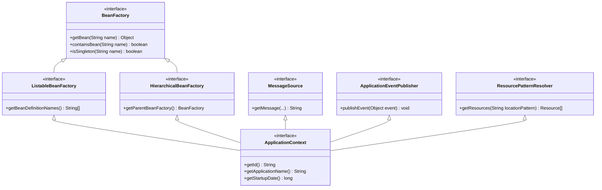
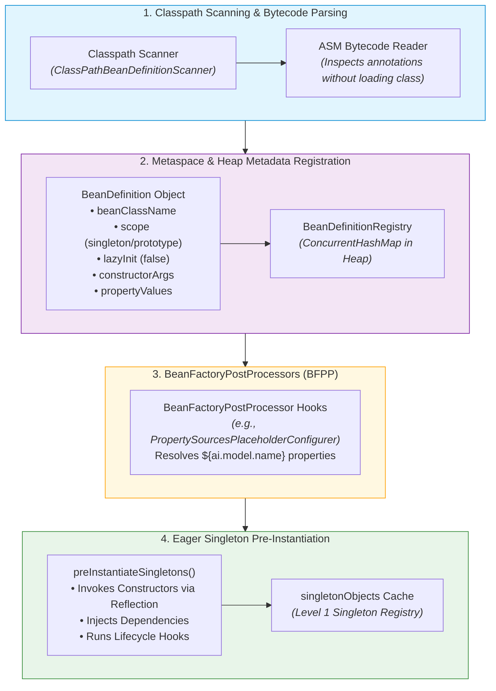
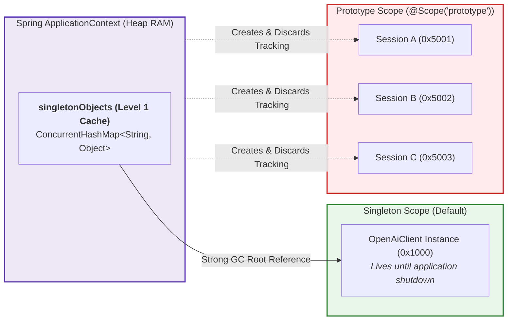
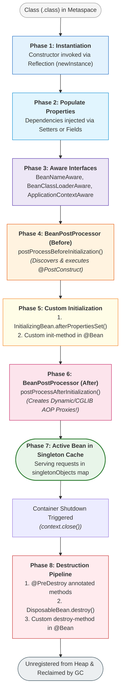
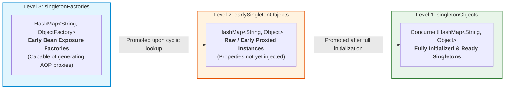
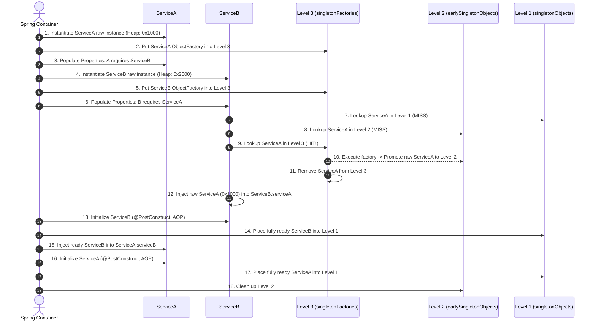

# Day_10 — Spring IoC Container & Bean Lifecycle in Memory

| ⬅️ Previous Day | 📚 Course Hub | ➡️ Next Day |
|:---|:---:|---:|
| [← Day 09: The Problem Spring Solves — Dependency Hell](../Day_09_Problem_Spring_Solves_Dependency_Hell/Day_09_Problem_Spring_Solves_Dependency_Hell.md) | [All 60 Days Overview](../../README.md) | [Day 11: Dependency Injection In-Depth →](../Day_11_Dependency_Injection_In_Depth/Day_11_Dependency_Injection_In_Depth.md) |

---

## 🎯 What You'll Understand By the End
- The structural and memory differences between **`BeanFactory`** (lazy, lightweight) and **`ApplicationContext`** (eager, enterprise-grade).
- How the Spring container reads classes from the classpath, creates **`BeanDefinition`** metadata in Metaspace, and schedules singleton allocations on the Heap.
- The **Heap Topology** of bean scopes: why **Singleton** beans reside permanently in `ConcurrentHashMap` caches in Old Generation memory, why **Prototype** beans create unmanaged heap churn, and why Spring **never** calls `@PreDestroy` on prototype beans.
- The exact **Step-by-Step Bean Lifecycle Pipeline**: from raw constructor instantiation $\rightarrow$ dependency wiring $\rightarrow$ Aware interfaces $\rightarrow$ `BeanPostProcessor` pre-initialization $\rightarrow$ `@PostConstruct` $\rightarrow$ AOP proxy generation $\rightarrow$ runtime execution $\rightarrow$ `@PreDestroy` $\rightarrow$ GC unregistration.
- How Spring's internal **Three-Level Cache (`DefaultSingletonBeanRegistry`)** resolves circular dependencies in Heap RAM, and the architectural limits where circular wiring triggers `BeanCurrentlyInCreationException`.

---

## 🧠 Inside the IoC Container: BeanFactory vs. ApplicationContext

At the heart of the Spring Framework sits the **Inversion of Control (IoC) Container**. But what is the container physically inside the JVM?

The container is not a mysterious daemon process or OS service. It is a family of pure Java objects residing on your JVM Heap that parse class metadata, manage dependency graphs, and store instantiated bean references.

### 1. The Core Hierarchy: `BeanFactory` vs. `ApplicationContext`



### Architectural Feature Matrix

| Feature | `BeanFactory` (`org.springframework.beans.factory`) | `ApplicationContext` (`org.springframework.context`) |
|:---|:---|:---|
| **Instantiation Strategy** | **Lazy Loading**: Beans are instantiated only when explicitly requested via `getBean()`. | **Eager Pre-Instantiation**: All non-lazy singletons are instantiated during container startup (`refresh()`). |
| **Startup Footprint** | Extremely low initial RAM usage; fast cold startup. | Higher initial RAM usage; catches configuration and wiring errors immediately on boot. |
| **Enterprise Services** | Basic dependency injection and bean lifecycle management only. | Integrated AOP proxies, event multicasting (`ApplicationEvent`), i18n (`MessageSource`), resource loading (`ResourceLoader`). |
| **Ideal Use Case** | Severely resource-constrained environments (e.g., embedded devices, edge micro-agents). | Enterprise web applications, microservices, and Spring Boot production deployments. |

---

### 2. How `ApplicationContext` Loads Definitions into Metaspace & Heap

When you boot a Spring Boot application (`SpringApplication.run(Application.class)`), the `ApplicationContext` performs a precise four-stage startup sequence:



1. **Bytecode Inspection (Metaspace)**: The scanner uses ASM (a low-level Java bytecode analysis library) to scan `.class` files on disk *without* forcing the ClassLoader to load them into Metaspace prematurely. It searches for stereotype annotations (`@Component`, `@Service`, `@Repository`, `@Configuration`).
2. **`BeanDefinition` Creation**: For every candidate class found, Spring builds a **`BeanDefinition`** object. This is a lightweight metadata blueprint storing:
   - Target class type (`com.javagenai.service.RagService`).
   - Declared scope (`singleton`, `prototype`, `request`).
   - Autowiring mode and constructor parameter types.
   - Lifecycle callback names (`initMethod`, `destroyMethod`).
   These definitions are stored in the **`BeanDefinitionRegistry`** inside the container.
3. **BeanFactoryPostProcessor (BFPP) Execution**: Before any bean instances are allocated on the Heap, Spring executes `BeanFactoryPostProcessor` extensions. This allows tools like `PropertySourcesPlaceholderConfigurer` to replace `${openai.api.key}` placeholders inside the `BeanDefinition` metadata with concrete property values from `application.yml`.
4. **Eager Pre-Instantiation (`preInstantiateSingletons()`)**: The container iterates through all registered `BeanDefinition` names. If a bean is marked as a **singleton** and is not marked `@Lazy`, Spring calls `getBean(beanName)`, triggering constructor reflection, dependency wiring, and initialization.

---

## 🏗️ Bean Scopes & Heap Topology

Spring supports six core bean scopes. Understanding their memory topology on the JVM Heap is critical to preventing concurrency bugs and memory leaks.



### 1. Singleton Scope (The Enterprise Default)
- **Behavior**: Exactly **one shared instance** exists per Spring IoC container.
- **Heap Topology**: Held inside `DefaultSingletonBeanRegistry.singletonObjects` (`ConcurrentHashMap<String, Object>`).
- **GC Life Expectancy**: Because the `ApplicationContext` holds a permanent strong reference to the map, a singleton bean acts as a **GC Root**. It will **never be collected by the Garbage Collector** during the lifetime of the application.
- **Concurrency Rule**: All incoming HTTP requests and worker threads execute through the same object instance simultaneously. **Singleton beans must be strictly stateless or read-only immutable.** Storing mutable client state in a field causes immediate cross-thread data corruption!

### 2. Prototype Scope (`@Scope("prototype")`)
- **Behavior**: A **brand-new instance** is allocated on the Heap every single time the bean is requested via `context.getBean()` or injected into another bean.
- **Heap Topology**: Spring instantiates the object, runs all dependency injections, executes `@PostConstruct`, and then **hands the reference to the caller and completely drops it**.
- **The Prototype Garbage Collection Surprise**:
  > [!IMPORTANT]
  > **Spring DOES NOT manage the destruction lifecycle of Prototype beans.**
  > Spring will **never** call `@PreDestroy` or `DisposableBean.destroy()` on a prototype bean! Once Spring hands a prototype bean to your code, your application code is 100% responsible for releasing native resources, database sockets, or file handles. If your calling code retains references in static collections, you will trigger a catastrophic Heap `OutOfMemoryError`.

### 3. Web-Aware Scopes (Spring MVC & WebFlux)
- **`request`**: One instance per HTTP request lifecycle. The instance is bound to the `ThreadLocal` request attributes and collected when the HTTP request finishes.
- **`session`**: One instance per HTTP Session (`HttpSession`). Stored in the servlet session attributes; lives until session invalidation or cookie timeout.
- **`application`**: One instance per `ServletContext` (shared across multiple Spring application contexts within the same servlet container).

### The Scoped Proxy Mystery: Injecting Request Scopes into Singletons
What happens if you inject a `@RequestScope` bean (`UserSecurityContext`) into a `@Singleton` bean (`AiOrchestrationService`)?
Because the singleton is created **once at boot time**, it would capture and freeze the very first dummy HTTP request, never updating for subsequent users!

To solve this, Spring uses **Scoped Proxies**:
```java
@Component
@Scope(value = WebApplicationContext.SCOPE_REQUEST, proxyMode = ScopedProxyMode.TARGET_CLASS)
public class UserSecurityContext {
    private String tenantId;
    // ...
}
```
Spring injects a **CGLIB dynamic proxy** into the singleton. When the singleton calls `context.getTenantId()`, the proxy intercepts the invocation, dynamically looks up the active HTTP request from the current thread's `RequestContextHolder`, and forwards the call to that specific user's request-scoped instance on the Heap!

---

## 🔄 The Complete Bean Lifecycle Step-by-Step

The lifecycle of a Spring bean is one of the most rigorously engineered state machines in computer science. It spans 8 sequential phases:



### Deep-Dive Phase Analysis

#### Phase 1: Instantiation (Heap Memory Allocation)
The JVM allocates raw memory for the object on the Heap. All instance fields are set to their primitive zero defaults (`0`, `false`, `null`). Spring selects the appropriate constructor and invokes it via Java Reflection (`Constructor.newInstance(args)`).

#### Phase 2: Populating Properties (Dependency Injection)
Spring traverses the bean's fields and setter methods. For `@Autowired` fields, Spring uses reflection (`Field.set(instance, dependency)`) or executes setter methods to wire references to collaborating beans.

#### Phase 3: Aware Interfaces (Container Awareness)
If the bean implements special `Aware` marker interfaces, Spring hands it references to container internal infrastructure:
- `BeanNameAware`: Hands the bean its own registered String ID (`setBeanName(String)`).
- `BeanClassLoaderAware`: Hands the classloader used to load the bean.
- `ApplicationContextAware`: Hands the full `ApplicationContext` reference.

#### Phase 4: BeanPostProcessor (Before Initialization)
Spring iterates through all registered `BeanPostProcessor` implementations in the container.
- `postProcessBeforeInitialization(Object bean, String beanName)` is executed.
- **The Secret of `@PostConstruct`**: Spring does not have hardcoded compiler magic for `@PostConstruct`. It is executed by a built-in `BeanPostProcessor` called `InitDestroyAnnotationBeanPostProcessor`!

#### Phase 5: Initialization Hooks
The bean executes custom startup logic in the following strict order:
1. Method annotated with **`@PostConstruct`**.
2. **`InitializingBean.afterPropertiesSet()`** (if implemented).
3. Custom **`initMethod`** attribute configured on `@Bean(initMethod = "start")`.

#### Phase 6: BeanPostProcessor (After Initialization & The AOP Proxy Miracle)
Spring runs `postProcessAfterInitialization(Object bean, String beanName)`.
> [!NOTE]
> This is where **Spring AOP (Aspect-Oriented Programming)** takes place! If the bean has `@Transactional`, `@Async`, or custom aspect annotations, `AbstractAutoProxyCreator` wraps the raw bean inside a **CGLIB or JDK Dynamic Proxy** and returns the proxy to be stored in the singleton registry.

#### Phase 7: Active Service (Serving Live Traffic)
The fully initialized (and possibly proxied) bean is placed into `DefaultSingletonBeanRegistry.singletonObjects`. It serves concurrent requests throughout the life of the JVM.

#### Phase 8: Destruction Pipeline
When `ApplicationContext.close()` or a JVM shutdown hook (`SIGTERM`) is triggered:
1. Methods annotated with **`@PreDestroy`** are executed.
2. **`DisposableBean.destroy()`** is executed.
3. Custom **`destroyMethod`** configured on `@Bean(destroyMethod = "close")` is executed.
4. The bean reference is removed from `singletonObjects`, making it eligible for JVM Garbage Collection.

---

## 🪢 Circular Dependencies & The 3-Level Cache

### What is a Circular Dependency?
A circular dependency occurs when Bean A requires Bean B, and Bean B directly or indirectly requires Bean A:
$$\text{ServiceA} \xrightarrow{\text{needs}} \text{ServiceB} \xrightarrow{\text{needs}} \text{ServiceA}$$

If both classes use **Constructor Injection**:
```java
@Service
public class ServiceA {
    public ServiceA(ServiceB b) { ... }
}
@Service
public class ServiceB {
    public ServiceB(ServiceA a) { ... }
}
```
To instantiate `ServiceA`, Spring needs `ServiceB`. But to instantiate `ServiceB`, Spring needs `ServiceA`. Neither constructor can complete! Spring detects this cycle and immediately aborts with:
`BeanCurrentlyInCreationException: Error creating bean with name 'serviceA': Requested bean is currently in creation: Is there an unresolvable circular reference?`

### How Spring Resolves Field/Setter Circular Dependencies: The 3-Level Cache
When dependencies are injected via **fields (`@Autowired`) or setter methods**, Spring can resolve the cycle using its famous **Three-Level Cache** inside `DefaultSingletonBeanRegistry`:



### Cache Definitions

1. **`singletonObjects` (Level 1 Cache)**:
   Holds fully initialized, dependency-wired, and AOP-proxied beans ready for production traffic.
2. **`earlySingletonObjects` (Level 2 Cache)**:
   Holds raw bean instances (or early AOP proxies) that have been instantiated on the Heap, but whose dependencies have not yet been injected and whose `@PostConstruct` methods have not yet run.
3. **`singletonFactories` (Level 3 Cache)**:
   Holds `ObjectFactory<?>` lambdas. If a bean is involved in a circular reference, this factory is executed to create an early reference (or early AOP proxy) without waiting for the full initialization pipeline.

---

### Step-by-Step Memory Trace of Circular Resolution



### Where Does the 3-Level Cache Fail?
1. **Constructor Injection**: Both beans require the collaborator during `Constructor.newInstance()`. The object cannot even be allocated to be placed into Level 3!
2. **`@Async` Beans with Circular References**: Spring's `@Async` annotation generates an AOP proxy in `postProcessAfterInitialization` using `AsyncAnnotationBeanPostProcessor`. If Bean A is involved in a cycle, B receives the raw instance from Level 2, but A later creates a different proxy instance in Phase 6, leading to a fatal memory mismatch:
   `BeanCurrentlyInCreationException: Bean with name 'serviceA' has been injected into other beans in its raw form, but has eventually been wrapped!`
3. **Spring Boot 2.6+ Default Behavior**: Starting with Spring Boot 2.6, circular references are **disabled by default** (`spring.main.allow-circular-references=false`). Spring team considers circular dependencies an architectural design flaw that should be refactored via events or mediator services.

---

## 💻 Code Walkthrough: Runnable Verification

The companion project contains [SpringBeanLifecycleMemoryDemo.java](file:///c:/Users/sriva/OneDrive/Desktop/GEN%20AI%20COURSE/JAVA/Phase_02_Spring_Core_and_DI/Day_10_Spring_IoC_Container_Bean_Lifecycle/code/SpringBeanLifecycleMemoryDemo.java). It implements a working mini-container that executes the complete lifecycle and verifies the 3-level cache.

### Code Highlights: The 3-Level Cache Resolution Routine

```java
protected Object getSingleton(String beanName, boolean allowEarlyReference) {
    // Level 1: Check fully initialized singletons
    Object singleton = singletonObjects.get(beanName);
    
    if (singleton == null && singletonsCurrentlyInCreation.contains(beanName)) {
        // Level 2: Check early partially-created objects
        singleton = earlySingletonObjects.get(beanName);
        
        if (singleton == null && allowEarlyReference) {
            // Level 3: Check early factory suppliers
            ObjectFactory<?> factory = singletonFactories.get(beanName);
            if (factory != null) {
                singleton = factory.getObject();
                // Promote from Level 3 to Level 2
                earlySingletonObjects.put(beanName, singleton);
                singletonFactories.remove(beanName);
                System.out.println("       [3-Level Cache] PROMOTED '" + beanName 
                        + "' from Level 3 to Level 2");
            }
        }
    }
    return singleton;
}
```

### Real Execution Console Output

```text
================================================================================
 DAY 10: SPRING BEAN LIFECYCLE & 3-LEVEL CACHE HEAP SIMULATION                 
================================================================================

>>> [EXPERIMENT 1] Tracing Complete Bean Lifecycle Stages in RAM <<<
  [Lifecycle Stage 1] Constructor: Allocated raw object on Heap. Hash: 0x27716f4
       [3-Level Cache] ADDED 'ragPipelineEngine' to Level 3 (singletonFactories)
  [Lifecycle Stage 2] BeanNameAware invoked: Registered bean name = 'ragPipelineEngine'
  [Lifecycle Stage 3] @PostConstruct Hook: Pre-warming ONNX neural weights...
                      Weights loaded into memory buffer (2048 bytes).
       [3-Level Cache] REGISTERED 'ragPipelineEngine' into Level 1 (singletonObjects) [FULLY READY]
  [Active Execution] Calling business method: [Response to 'What is Inversion of Control?' from ragPipelineEngine]

>>> [EXPERIMENT 2] Resolving Circular Dependency (ServiceA <-> ServiceB) <<<
Requesting ServiceA from container...
       [Instantiation] ServiceA raw instance allocated on Heap (0x179d3b25)
       [3-Level Cache] ADDED 'serviceA' to Level 3 (singletonFactories)
       [Wiring] Resolving dependency: ServiceA.serviceB -> serviceB
       [Instantiation] ServiceB raw instance allocated on Heap (0x238e0d81)
       [3-Level Cache] ADDED 'serviceB' to Level 3 (singletonFactories)
       [Wiring] Resolving dependency: ServiceB.serviceA -> serviceA
       [3-Level Cache] PROMOTED 'serviceA' from Level 3 (singletonFactories) to Level 2 (earlySingletonObjects)
       [3-Level Cache] REGISTERED 'serviceB' into Level 1 (singletonObjects) [FULLY READY]
       [3-Level Cache] REGISTERED 'serviceA' into Level 1 (singletonObjects) [FULLY READY]

  [Verification of Wiring Integrity]:
  -> Is A's serviceB wired? true
  -> Is B's serviceA wired back to A? true
  -> Are pointers identical in Heap RAM? true
     serviceA Heap ID: 0x179D3B25 | serviceB.serviceA Heap ID: 0x179D3B25

>>> [EXPERIMENT 3] Container Destruction & Heap Unregistration <<<

--- Initiating Container Shutdown ---
  [Lifecycle Stage 4] @PreDestroy Hook: Flushing caches and releasing memory buffer...
                      Bean memory marked ready for JVM Garbage Collection.
Container shutdown complete: singletonObjects registry cleared from Heap.
================================================================================
```

---

### Step-by-Step Physical Memory Trace Table

| Step | Action Executed | Thread Stack Activity | JVM Heap State & Cache Contents | Metaspace & GC Status |
|:---:|:---|:---|:---|:---|
| **1** | Instantiate `ServiceA` | Constructor frame pushed; returns raw reference `0x179D3B25`. | Raw object allocated in Eden space. Fields (`serviceB`) are currently `null`. | Class metadata verified in Metaspace. |
| **2** | Expose to Level 3 | Pushes `singletonFactories.put()` frame. | Level 3 contains `ObjectFactory -> 0x179D3B25`. `singletonsCurrentlyInCreation` contains `"serviceA"`. | `ServiceA` marked active in creation tracker. |
| **3** | Populate `ServiceA.serviceB` | Pushes `getBean("serviceB")`. | `ServiceA` population pauses on thread stack waiting for `ServiceB`. | Execution frame blocked on child dependency. |
| **4** | Instantiate `ServiceB` | Constructor frame pushed; returns raw reference `0x238E0D81`. | Raw `ServiceB` allocated in Eden. Level 3 receives `ServiceB` factory. | Eden space grows by size of `ServiceB`. |
| **5** | Populate `ServiceB.serviceA` | Looks up `serviceA`: Misses L1, Misses L2, **Hits L3**. | Level 3 factory executes. `ServiceA` promoted to **Level 2** (`earlySingletonObjects`). Removed from L3. Pointer `0x179D3B25` written to `ServiceB.serviceA`. | Circular reference resolved via early Heap pointer! |
| **6** | Finish `ServiceB` & `ServiceA` | Runs `@PostConstruct` hooks. | `ServiceB` stored in **Level 1** (`singletonObjects`). `ServiceA` finishes injection, stored in **Level 1**. Levels 2 & 3 cleared. | Both singletons promoted toward Old Gen. Stable memory state. |

---

## 🔑 Key Terminology

| Term | Technical Definition | Real-World Analogy |
|:---|:---|:---|
| **`BeanFactory`** | Root Spring interface for accessing bean definitions; creates beans lazily on demand. | A warehouse catalog where items are assembled only after an order is placed. |
| **`ApplicationContext`** | Enterprise container extending `BeanFactory`; pre-instantiates singletons and publishes events. | A luxury turnkey hotel where all rooms, restaurants, and amenities are fully ready on opening day. |
| **`BeanDefinition`** | Metadata object holding class name, scope, constructor arguments, and lifecycle properties. | An architect's architectural blueprint for a house. |
| **Singleton Scope** | Exactly one shared bean instance per Spring container held indefinitely in Heap RAM. | The central hotel elevator shared by all guests. |
| **Prototype Scope** | A fresh bean instance created upon every request; unmanaged by Spring after delivery. | A disposable single-use hotel room key card. |
| **`BeanPostProcessor`** | Callback interface allowing custom modification or proxy wrapping of new bean instances. | A vehicle safety inspector adding bulletproof armor before the car leaves the factory. |
| **`@PostConstruct`** | JSR-250 annotation marking a method to run after dependency injection is complete. | The ribbon-cutting ceremony after a building is fully furnished. |
| **`@PreDestroy`** | JSR-250 annotation marking a cleanup method to run before container shutdown. | Turning off gas valves and locking the security gates when a building closes. |
| **Three-Level Cache** | The tri-tier map structure in Spring that breaks circular dependency deadlocks in RAM. | A temporary holding bay where partially assembled products wait for reciprocal components. |

---

## ⚠️ Common Beginner Mistakes

### 1. The Prototype Memory Leak Trap
Beginners often create prototype beans believing Spring will clean them up when no longer needed.

❌ **Dangerous Mistake**:
```java
@Component
@Scope("prototype")
public class HeavyAiSession implements DisposableBean {
    private final byte[] memoryCache = new byte[10 * 1024 * 1024]; // 10MB per session

    @Override
    public void destroy() {
        // BUG: Spring will NEVER invoke this method on a prototype bean!
        System.out.println("Cleaning memory cache");
    }
}
```

✅ **The Fix**:
If you must use prototype beans with native resources or heavy buffers, implement `AutoCloseable` and clean them explicitly in a `try-with-resources` block:
```java
public class AiWorker {
    @Autowired
    private ObjectProvider<HeavyAiSession> sessionProvider;

    public void process() {
        try (HeavyAiSession session = sessionProvider.getObject()) {
            session.executeTask();
        } // Automatically closed here!
    }
}
```

---

### 2. Calling `@PostConstruct` Methods Manually
Calling an `@PostConstruct` method manually from another method defeats the purpose of the lifecycle container and triggers double-initialization bugs.

❌ **Wrong**:
```java
@Service
public class ModelManager {
    @PostConstruct
    public void init() { loadWeights(); }

    public void reload() {
        init(); // Anti-pattern: Manually re-triggering container lifecycle hooks!
    }
}
```

✅ **Right**:
Extract the business logic into a separate domain method (`loadWeights()`) and invoke that cleanly.

---

### 3. Creating Circular Dependencies in Constructors
Attempting to resolve circular dependencies using constructor injection guarantees application boot failure.

❌ **Fatal Boot Failure**:
```java
@Service
public class OrderService {
    public OrderService(PaymentService paymentService) { ... }
}

@Service
public class PaymentService {
    public PaymentService(OrderService orderService) { ... }
}
```
`BeanCurrentlyInCreationException` on startup!

✅ **The Fix**:
1. **Refactor Design**: Introduce a mediator class (`OrderPaymentOrchestrator`) or use domain events (`ApplicationEventPublisher`).
2. **Lazy Injection (Temporary Workaround)**: Mark one dependency with `@Lazy`:
   ```java
   public OrderService(@Lazy PaymentService paymentService) { ... }
   ```
   Spring injects a synthetic CGLIB proxy for `PaymentService`, breaking the constructor deadlock!

---

## ✅ Enterprise Best Practices

1. **Leverage `@PostConstruct` for Fail-Fast Validation**:
   Validate API keys, directory write permissions, and database connectivity in `@PostConstruct`. If credentials or external services are invalid, throw an exception immediately so the application fails to deploy rather than silently failing during live customer traffic.
2. **Keep Singletons Strictly Stateless**:
   Never store user IDs, conversation history, or request tokens in instance variables of `@Service` or `@Component` beans. Singletons must be 100% thread-safe.
3. **Avoid Circular References Completely**:
   Do not enable `spring.main.allow-circular-references=true`. Treat circular dependencies as an architectural code smell demanding package refactoring or event-driven decoupling.
4. **Prefer Standard Lifecycle Annotations**:
   Use `@PostConstruct` and `@PreDestroy` from `jakarta.annotation` rather than implementing Spring-specific interfaces `InitializingBean` or `DisposableBean`. This keeps your business domain clean and framework-agnostic.

---

## 🔭 Looking Ahead

In **Day_11 — Dependency Injection In-Depth**, we will explore:
- Resolving injection ambiguities when multiple beans match an interface using **`@Qualifier`** and **`@Primary`**.
- Programmatic bean definitions using **`@Configuration`** and **`@Bean`** to integrate third-party libraries.
- Conditional bean registration with **`@ConditionalOnProperty`** and custom Condition evaluators.

---

## 📝 Quick Recap

- **`ApplicationContext`** eagerly instantiates singletons on boot, catching configuration bugs immediately; **`BeanFactory`** instantiates beans lazily.
- **Singleton scope** stores one shared instance in `DefaultSingletonBeanRegistry.singletonObjects` on the Heap. Singletons act as GC roots and live until container shutdown.
- **Prototype scope** creates a fresh instance per request; **Spring does not manage prototype destruction (`@PreDestroy` is never called)**.
- **The Lifecycle Sequence**: Instantiation $\rightarrow$ Property Population $\rightarrow$ Aware Setters $\rightarrow$ `BeanPostProcessor.postProcessBeforeInitialization` $\rightarrow$ `@PostConstruct` $\rightarrow$ `BeanPostProcessor.postProcessAfterInitialization` (AOP proxying) $\rightarrow$ Active $\rightarrow$ `@PreDestroy` $\rightarrow$ GC release.
- **The Three-Level Cache**:
  - Level 1 (`singletonObjects`): Ready singletons.
  - Level 2 (`earlySingletonObjects`): Partially created early beans.
  - Level 3 (`singletonFactories`): Early exposure factories that break field/setter circular dependencies in Heap memory.

---

## 🧪 Try It Yourself

1. **Verify Lifecycle Ordering**:
   Execute `SpringBeanLifecycleMemoryDemo.java` locally:
   ```bash
   javac -d . (Get-ChildItem -Filter *.java | ForEach-Object { $_.FullName })
   java -cp . com.javagenai.day10.SpringBeanLifecycleMemoryDemo
   ```
   Confirm that `ragPipelineEngine` executes Constructor $\rightarrow$ Aware $\rightarrow$ `@PostConstruct` $\rightarrow$ Business Method $\rightarrow$ `@PreDestroy`.
2. **Simulate a Prototype Leak**:
   Create a small simulation where a loop requests 10,000 `@Scope("prototype")` beans that allocate 1 MB byte arrays, storing them in a static `List`. Observe how quickly the JVM triggers `java.lang.OutOfMemoryError: Java heap space`.
3. **Break a Circular Dependency with `@Lazy`**:
   Take `ServiceA` and `ServiceB` with constructor injection. Verify that it throws `BeanCurrentlyInCreationException`. Then add a simulated dynamic proxy or lazy reference and verify how the cycle is unlocked.
