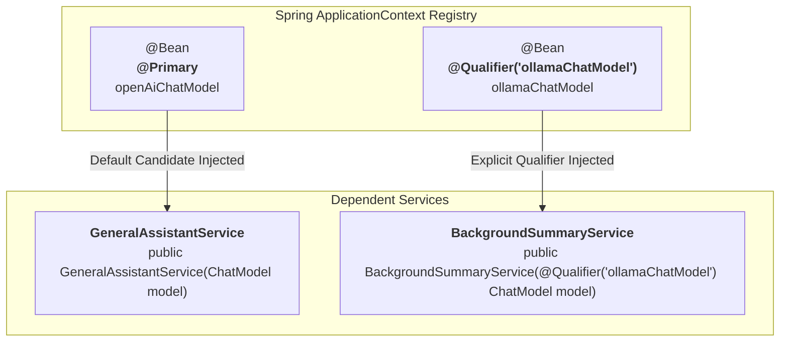

# Day_11 — Dependency Injection In-Depth

| ⬅️ Previous Day | 📚 Course Hub | ➡️ Next Day |
|:---|:---:|---:|
| [← Day 10: Spring IoC Container & Bean Lifecycle](../Day_10_Spring_IoC_Container_Bean_Lifecycle/Day_10_Spring_IoC_Container_Bean_Lifecycle.md) | [All 60 Days Overview](../../README.md) | [Day 12: Spring Boot Auto-Configuration Magic →](../Day_12_Spring_Boot_Auto_Configuration/Day_12_Spring_Boot_Auto_Configuration.md) |

---

## 🎯 What You'll Understand By the End
- Why **Constructor Injection** is the industry standard over Field and Setter injection.
- How to resolve **Bean Ambiguity** when multiple AI models implement the same interface using **`@Primary`** and **`@Qualifier`**.
- How to manage third-party classes (like official OpenAI or Pinecone SDK clients) using **`@Configuration`** and **`@Bean`** methods.
- How to bind YAML configuration settings safely to modern Java Records using **`@ConfigurationProperties`**.
- How to switch seamlessly between free local development (Ollama) and cloud production (GPT-4o) using Spring **`@Profile`**.

---

## 🧠 The Problem This Solves

As an AI engineering system grows, you quickly run into real-world injection challenges:

1. **The Multiple Implementations Conflict (Ambiguity)**: If your project defines two beans that implement `ChatModel` (`OpenAiChatModel` and `OllamaChatModel`), and a service asks for `ChatModel`, Spring crashes on startup with `NoUniqueBeanDefinitionException: expected single matching bean but found 2`.
2. **Third-Party Classes Cannot Be Annotated**: You cannot open an official external library (like OpenAI's Java SDK or AWS Bedrock SDK) and type `@Component` above their classes because the code lives in compiled JARs.
3. **Configuration Drift Between Environments**: Running unit tests or local development against expensive cloud LLMs burns team budgets. You need an automated way to say: *"Use local Ollama when running on my laptop (`dev`), but use OpenAI when deployed to AWS (`prod`)."*

Spring provides **`@Primary`**, **`@Qualifier`**, **`@Bean`**, and **`@Profile`** to solve these configuration challenges cleanly.

---

## 📖 Core Concept, Explained Simply

### The Universal Power Adapter Analogy

Think of Dependency Injection like a hotel room electrical system:

- **The Standard Wall Socket (`@Primary`)**:
  - Most everyday appliances (like your phone charger) plug into the default standard wall socket. They don't specify anything special.
  - Marking a bean `@Primary` tells Spring: *"Whenever a class asks for a `ChatModel` without being specific, provide this default bean."*
- **The High-Voltage Industrial Plug (`@Qualifier`)**:
  - If a guest brings a specialized high-power device (like an AI GPU accelerator), they plug it into the explicitly labeled 240V socket.
  - `@Qualifier("ollamaChatModel")` tells Spring: *"Ignore the default. Give me the exact bean registered under this specific name."*
- **The Travel Voltage Switch (`@Profile`)**:
  - When traveling from the United States (110V) to Europe (220V), you flip the voltage toggle on your power brick.
  - With `@Profile("dev")` vs. `@Profile("prod")`, you toggle your application's active profile, and Spring automatically wires local or cloud services without changing a single line of Java code.

### The `@Configuration` and `@Bean` Factory Method

When you use classes from an external library, you cannot add `@Component` to their source files. 

Instead, you create a configuration class marked **`@Configuration`**, and write methods marked **`@Bean`**:
- The `@Bean` annotation tells Spring: *"Execute this method once, take whatever object it returns, and register it inside the `ApplicationContext` as a managed bean."*

> 💡 **New Word Alert — "@Primary"**: An annotation indicating that a particular bean should be given preference when multiple candidates qualify for an autowired dependency.

> 💡 **New Word Alert — "@Qualifier"**: An annotation used alongside an injection point to specify the exact name of the candidate bean to inject, overriding `@Primary`.

> 💡 **New Word Alert — "@ConfigurationProperties"**: A Spring annotation used to map entire groups of hierarchical configuration properties from `application.yml` directly into a strongly typed Java Record or class.

---

## 🗺️ Visual Overview



*This diagram illustrates bean disambiguation. When `GeneralAssistantService` requests a `ChatModel`, Spring automatically injects the `@Primary` bean (`openAiChatModel`). When `BackgroundSummaryService` specifies `@Qualifier("ollamaChatModel")`, Spring injects the Ollama bean instead.*

---

## 💻 Code Walkthrough

Here is a complete Java example showing how to configure multiple third-party AI models and selectively inject them:

```java
import org.springframework.beans.factory.annotation.Qualifier;
import org.springframework.context.annotation.Bean;
import org.springframework.context.annotation.Configuration;
import org.springframework.context.annotation.Primary;
import org.springframework.stereotype.Service;

// 1. Shared Interface
interface ChatModel {
    String generate(String prompt);
}

// 2. Concrete Classes (simulating third-party libraries)
class OpenAiModel implements ChatModel {
    @Override public String generate(String prompt) { return "[Cloud GPT-4o] " + prompt; }
}

class OllamaModel implements ChatModel {
    @Override public String generate(String prompt) { return "[Local LLaMA] " + prompt; }
}

// 3. Central Configuration Class
@Configuration
public class AiModelConfig {

    @Bean
    @Primary // Default choice for any unqualified ChatModel injection
    public ChatModel openAiModel() {
        return new OpenAiModel();
    }

    @Bean
    public ChatModel ollamaModel() {
        return new OllamaModel();
    }
}

// 4. Consumer A: Uses the @Primary default bean
@Service
class CustomerChatService {
    private final ChatModel chatModel;

    // Receives openAiModel automatically because it is marked @Primary
    public CustomerChatService(ChatModel chatModel) {
        this.chatModel = chatModel;
    }

    public String reply(String userText) {
        return chatModel.generate(userText);
    }
}

// 5. Consumer B: Explicitly requests Ollama via @Qualifier
@Service
class OfflineBatchService {
    private final ChatModel localModel;

    // Explicitly targets the ollamaModel bean
    public OfflineBatchService(@Qualifier("ollamaModel") ChatModel localModel) {
        this.localModel = localModel;
    }

    public String runBatch(String task) {
        return localModel.generate(task);
    }
}
```

### Line-by-Line Breakdown

| Code Statement | Plain-English Explanation |
|:---|:---|
| `@Configuration` | Marks the class as a factory definition file for Spring beans. |
| `@Bean @Primary public ChatModel openAiModel()` | Registers `OpenAiModel` in the container and marks it as the default choice when a `ChatModel` is requested without qualifications. |
| `@Bean public ChatModel ollamaModel()` | Registers `OllamaModel` as an alternative bean named `"ollamaModel"` in the container. |
| `CustomerChatService(ChatModel chatModel)` | Requests a `ChatModel`. Because two beans exist, Spring checks for `@Primary` and injects `openAiModel`. |
| `@Qualifier("ollamaModel") ChatModel localModel` | Tells Spring to bypass `@Primary` and specifically inject the bean whose method name is `"ollamaModel"`. |

---

## 🔑 Key Terminology

| Term | Plain-English Meaning |
|:---|:---|
| **`@Configuration`** | A class-level annotation indicating that the class contains `@Bean` factory definitions. |
| **`@Bean`** | A method-level annotation instructing Spring to register the returned object as a managed bean. |
| **`@Primary`** | Designates a default bean candidate when multiple beans of the same type exist. |
| **`@Qualifier`** | Specifies by name the exact bean that should be wired into an injection point. |
| **`@Profile`** | Restricts a bean or configuration class to be loaded only when a matching environment profile is active. |
| **`@Value`** | Injects individual property values from configuration files or environment variables into fields or parameters. |

---

## ⚠️ Common Beginner Mistakes

### 1. Ambiguity Crash (`NoUniqueBeanDefinitionException`)
Defining two beans of the same interface without designating a `@Primary` bean or using `@Qualifier` causes Spring to abort startup.

❌ **Wrong Way**:
```java
// Two beans of type VectorStore in the context, but no @Primary or @Qualifier:
@Service
public class SearchService {
    public SearchService(VectorStore store) { ... } // CRASH! Spring cannot choose between store A and store B.
}
```

✅ **Right Way**:
Add `@Primary` to the default store, or add `@Qualifier("pineconeStore")` to the constructor parameter.

---

### 2. Misspelling Qualifier Bean Names
`@Qualifier("ollamaChatModel")` is matched by string. If you make a typo (e.g., `@Qualifier("olamaModel")`), Spring fails with `NoSuchBeanDefinitionException`.

❌ **Wrong Way**:
```java
public DocumentService(@Qualifier("pineConeStore") VectorStore store) { ... } // Typo: 'Cone' instead of 'cone'
```

✅ **Right Way**:
Ensure the string inside `@Qualifier` matches the bean method name or component name exactly.

---

### 3. Calling `@Bean` Methods Directly as Normal Java Methods
If you invoke a `@Bean` method directly from another method inside a `@Configuration` class, Spring's CGLIB proxy intercepts the call and ensures you always get the **exact same singleton instance**, not a duplicate object. Calling it outside a configuration class creates unmanaged duplicate objects.

---

## ✅ Best Practices

1. **Always Use Constructor Injection with `@Qualifier`**: Put `@Qualifier` directly on the constructor parameter: `public Service(@Qualifier("myBean") Model m)`.
2. **Use `@Primary` for the Production Standard**: Designate your main production provider as `@Primary`, and use `@Qualifier` only for specialized use cases (like background batch processing).
3. **Use Environment Profiles for Switching Implementations**: Instead of littering code with `if (isDev)` checks, annotate development beans with `@Profile("dev")` and production beans with `@Profile("prod")`.

---

## 🔭 Looking Ahead
In **Day_12**, we will discover **Spring Boot Auto-Configuration Magic** — understanding how Spring automatically configures database connection pools, JSON parsers, and web servers by scanning your classpath dependencies.

---

## 📝 Quick Recap
- When multiple beans share an interface, use **`@Primary`** to declare a default, and **`@Qualifier`** to specify an exact bean by name.
- Use **`@Configuration`** and **`@Bean`** to instantiate and register third-party library classes that you cannot modify with `@Component`.
- Spring **Profiles (`@Profile`)** allow you to activate different beans depending on the runtime environment (`dev`, `test`, `prod`).
- Constructor injection remains the safest, cleanest mechanism to inject qualified dependencies.

---

## 🧪 Try It Yourself

1. **Configure Two Model Beans**: Create a `@Configuration` class that provides two `ChatModel` beans: `"fastModel"` and `"reasoningModel"`. Mark `"fastModel"` as `@Primary`.
2. **Inject by Qualifier**: Create a service `ComplexAnalysisService` that uses `@Qualifier("reasoningModel")` in its constructor. Verify that it receives the reasoning model while another unqualified service receives the fast model.
3. **Profile Toggling**: Annotate a `MockAiModel` bean with `@Profile("dev")` and a `LiveAiModel` bean with `@Profile("prod")`. Test running your application with `-Dspring.profiles.active=dev` and observe which model bean Spring boots up!
