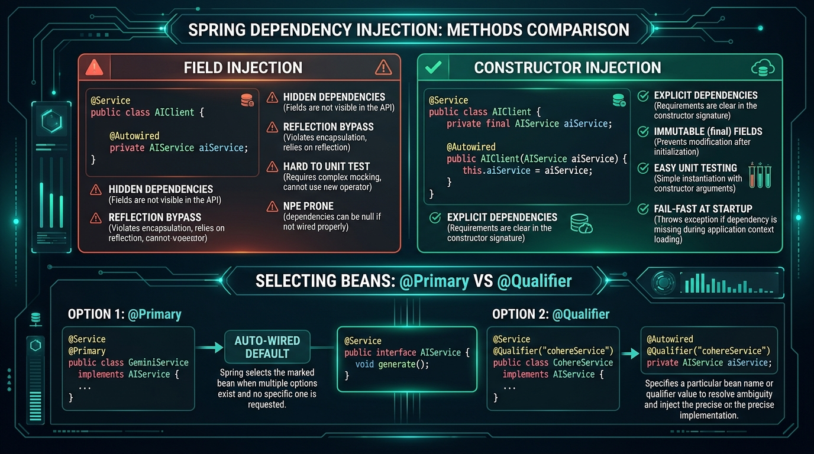

# 💉 Day 11: Dependency Injection In-Depth
## Constructor vs Field Injection, @Qualifier, @Primary, and Multi-Environment Profiles

| ⬅️ Previous Day | 📚 Course Hub | ➡️ Next Day |
|:---|:---:|---:|
| [← Day 10: Spring IoC Container & Bean Lifecycle](../Day_10_Spring_IoC_Container_Bean_Lifecycle/Day_10_Spring_IoC_Container_Bean_Lifecycle.md) | [All 60 Days Overview](../../README.md) | [Day 12: Spring Boot Auto-Configuration Magic →](../Day_12_Spring_Boot_Auto_Configuration/Day_12_Spring_Boot_Auto_Configuration.md) |

[](../../README.md)
[](../../README.md)
[](../../README.md)
[](../../README.md)

---

## 📌 What Will You Learn Today?

In Day 09 and Day 10, you learned *why* Dependency Injection exists and how the `ApplicationContext` manages bean lifecycles. But in real-world Generative AI applications, you will quickly face complex architectural questions:

- What if your app has **two different beans** that implement `ChatModel` (e.g., `OpenAiChatModel` for customer-facing chats and `OllamaChatModel` for internal summarization)? How does Spring know which one to inject without throwing `NoUniqueBeanDefinitionException`?
- Where should API keys and temperatures be stored? Hardcoded in Java? In `application.yml`? Environment variables?
- How do you switch between **local free testing** on your laptop and **cloud deployment on AWS** with zero code changes?

Today, we master the exact tools senior architects use to answer these questions cleanly.

By the end of today, you will master:
- ✅ **The 3 DI Methods**: Constructor vs. Setter vs. Field Injection (and why field `@Autowired` is an anti-pattern).
- ✅ **Resolving Ambiguity**: `@Primary` vs. `@Qualifier("beanName")`.
- ✅ **Injecting Configuration**: `@Value("${property}")` for quick scalar properties.
- ✅ **Type-Safe Configuration**: `@ConfigurationProperties` paired with modern **Java Records**.
- ✅ **Spring Profiles (`@Profile`)**: Seamlessly switching between `dev` (Ollama) and `prod` (OpenAI).
- ✅ **Multi-Model Routing Architecture**: Designing an intelligent AI router that switches models based on task complexity.

---

## 🗺️ Table of Contents

- [1. Real-World Analogy: The Universal Power Strip & Voltage Selectors](#1-real-world-analogy-the-universal-power-strip--voltage-selectors)
- [2. The Three Flavors of Dependency Injection](#2-the-three-flavors-of-dependency-injection)
  - [2.1 Field Injection (Why Senior Engineers Avoid It)](#21-field-injection-why-senior-engineers-avoid-it)
  - [2.2 Setter Injection (For Optional Dependencies)](#22-setter-injection-for-optional-dependencies)
  - [2.3 Constructor Injection (The Enterprise Gold Standard)](#23-constructor-injection-the-enterprise-gold-standard)
- [3. Resolving Multiple Beans: `@Primary` vs `@Qualifier`](#3-resolving-multiple-beans-primary-vs-qualifier)
  - [3.1 The Multi-Model Dilemma in AI](#31-the-multi-model-dilemma-in-ai)
  - [3.2 Setting Defaults with `@Primary`](#32-setting-defaults-with-primary)
  - [3.3 Explicit Selection with `@Qualifier`](#33-explicit-selection-with-qualifier)
- [4. Externalizing AI Configuration](#4-externalizing-ai-configuration)
  - [4.1 The `@Value` Annotation](#41-the-value-annotation)
  - [4.2 Type-Safe `@ConfigurationProperties` with Java Records](#42-type-safe-configurationproperties-with-java-records)
- [5. Spring Profiles: Dev vs. Prod Environments](#5-spring-profiles-dev-vs-prod-environments)
  - [5.1 `@Profile("dev")`: Free Local Ollama](#51-profiledev-free-local-ollama)
  - [5.2 `@Profile("prod")`: High-Performance Cloud OpenAI](#52-profileprod-high-performance-cloud-openai)
- [6. Key Takeaways & Summary](#6-key-takeaways--summary)
- [7. Practice Exercises & Full Solutions](#7-practice-exercises--full-solutions)
- [8. Self-Check Quiz](#8-self-check-quiz)

---

# 1. Real-World Analogy: The Universal Power Strip & Voltage Selectors



Imagine traveling international hotels with a high-end laptop.

```
                  ┌──────────────────────────────────────────────┐
                  │          UNIVERSAL WALL OUTLET (DI)          │
                  └──────────────────────┬───────────────────────┘
                                         │
                 ┌───────────────────────┴───────────────────────┐
                 ▼                                               ▼
         [ 110V Outlet: USA ]                           [ 220V Outlet: Europe ]
         (@Qualifier("usGrid"))                         (@Qualifier("euGrid"))
```

- If you don't care about special voltage, the room automatically routes power through the **default socket** (`@Primary`).
- If your device specifically requires high voltage for high-speed charging, you plug into the explicitly labeled socket (`@Qualifier("euGrid")`).
- If you travel between countries, you don't buy a brand new laptop—you just toggle the **country profile switch** (`@Profile("us")` vs `@Profile("eu")`)!

---

## 🧭 The Mid-Level Java Developer Bridge: Why Stop Using `@Autowired` on Fields?

As a mid-level Java developer, the easiest thing to do in Spring was always:
```java
@Autowired
private MyService myService;
```
It feels short and convenient! So why do senior tech leads and audit officers reject it in code reviews?

| Dependency Injection Style | How It Looks | Why It's Good or Bad | Plain English Meaning |
| :--- | :--- | :--- | :--- |
| **Field Injection** (`@Autowired` on field) | `private @Autowired AiService ai;` | ❌ **Dangerous**: Can't make field `final`. If you write a unit test (`new MyClass()`), `ai` is `null` and crashes with `NullPointerException`. | Secretly sneaking dependencies in through the back window using reflection. |
| **Constructor Injection** (The Standard) | `public MyClass(AiService ai) { this.ai = ai; }` | ✅ **Best Practice**: Fields are `final`. Clean unit tests without Spring container (`new MyClass(mockAi)`). App fails fast at startup if missing. | Walking through the front door: you cannot create the object without giving it what it needs. |
| **`@Primary`** | `@Primary @Service class OpenAiService` | Tells Spring: *"If someone asks for `AiService` without specifying a name, give them this default."* | The default HDMI cable plugged into TV. |
| **`@Qualifier("name")`** | `@Qualifier("ollamaService")` | Tells Spring: *"Give me specifically the bean named 'ollamaService'."* | Specifying HDMI Port 2 explicitly. |
| **`@Value("${my.prop}")`** | `@Value("${openai.api-key}")` | Injects a string or number directly from `application.yml` or OS environment variable. | Reading an environment config setting without writing file I/O. |

---

# 2. The Three Flavors of Dependency Injection

### 2.1 Field Injection (Why Senior Engineers Avoid It)

In legacy code, developers often placed `@Autowired` directly on private fields:

```java
// DISCOURAGED: Field Injection
@Service
public class ChatbotService {

    @Autowired
    private ChatModel chatModel; // Injected via reflection behind the scenes
}
```

#### Why modern Java architects reject Field Injection:
1. **Impossible to Unit Test Cleanly**: In a pure JUnit test, you cannot pass a mock `ChatModel` without booting the whole Spring Framework or using cumbersome reflection utilities.
2. **Hidden Dependencies**: Looking at the constructor `new ChatbotService()`, you cannot see that it secretly requires a `ChatModel` to function!
3. **Cannot Use `final`**: Fields must remain mutable, violating immutability principles.

---

### 2.2 Setter Injection (For Optional Dependencies)

Use Setter Injection **only for optional dependencies** that have sensible defaults:

```java
@Service
public class AuditLogger {
    private LogExporter exporter = new ConsoleLogExporter(); // Default fallback

    @Autowired(required = false) // Optional injection!
    public void setExporter(LogExporter exporter) {
        this.exporter = exporter;
    }
}
```

---

### 2.3 Constructor Injection (The Enterprise Gold Standard)

> [!TIP]
> Since Spring 4.3, **if a class has a single constructor, the `@Autowired` annotation is 100% optional!** Spring automatically detects the constructor and injects all parameters.

```java
package com.javagenai.day11;

import org.springframework.stereotype.Service;

@Service
public class EnterpriseAIService {

    // 1. Immutable fields!
    private final ChatModel chatModel;
    private final VectorStore vectorStore;

    // 2. Clear, explicit dependencies in constructor (No @Autowired needed!)
    public EnterpriseAIService(ChatModel chatModel, VectorStore vectorStore) {
        this.chatModel = chatModel;
        this.vectorStore = vectorStore;
    }

    public String generate(String query) {
        return chatModel.call(query);
    }
}
```

---

# 3. Resolving Multiple Beans: `@Primary` vs `@Qualifier`

### 3.1 The Multi-Model Dilemma in AI

Suppose your AI platform configures two distinct `ChatModel` beans in a configuration class:

```java
@Configuration
public class AIModelConfig {

    @Bean
    public ChatModel openAiChatModel() {
        return new OpenAiChatModel("sk-prod-key");
    }

    @Bean
    public ChatModel ollamaChatModel() {
        return new OllamaChatModel("http://localhost:11434");
    }
}
```

If another service asks for `ChatModel`:
```java
@Service
public class ReportGenerator {
    public ReportGenerator(ChatModel chatModel) { ... }
}
```
Spring crashes during startup with:
`NoUniqueBeanDefinitionException: expected single matching bean but found 2: openAiChatModel, ollamaChatModel`!

---

### 3.2 Setting Defaults with `@Primary`

Annotating a bean with **`@Primary`** tells Spring: *"Whenever someone asks for `ChatModel` without being specific, give them THIS one."*

```java
@Bean
@Primary // The default choice!
public ChatModel openAiChatModel() {
    return new OpenAiChatModel("sk-prod-key");
}
```

---

### 3.3 Explicit Selection with `@Qualifier`

What if a specific background worker wants the free local `ollamaChatModel` instead of paying for OpenAI? Use **`@Qualifier("beanName")`**:

```java
@Service
public class BackgroundBatchSummarizer {
    private final ChatModel localModel;

    // Explicitly target the Ollama bean!
    public BackgroundBatchSummarizer(@Qualifier("ollamaChatModel") ChatModel localModel) {
        this.localModel = localModel;
    }

    public void summarizeNightlyDocuments() {
        // Runs on 100% free local hardware
        localModel.call("Summarize batch 42");
    }
}
```

---

# 4. Externalizing AI Configuration

Hardcoding API keys or model parameters in code is a critical security and operational violation.

### 4.1 The `@Value` Annotation

For simple scalar properties from `application.yml` or environment variables:

```yaml
# application.yml
ai:
  openai:
    api-key: ${OPENAI_API_KEY:default-dev-key}
    temperature: 0.7
```

```java
@Component
public class OpenAiGateway {

    @Value("${ai.openai.api-key}")
    private String apiKey;

    @Value("${ai.openai.temperature:0.2}") // 0.2 is default if missing
    private double temperature;
}
```

---

### 4.2 Type-Safe `@ConfigurationProperties` with Java Records

For complex AI configurations, `@Value` becomes messy. Modern Spring Boot allows binding entire hierarchical configuration blocks directly into **Java Records**!

```yaml
# application.yml
app:
  ai:
    model-name: gpt-4o
    max-tokens: 4096
    temperature: 0.5
    streaming-enabled: true
```

```java
package com.javagenai.day11;

import org.springframework.boot.context.properties.ConfigurationProperties;

@ConfigurationProperties(prefix = "app.ai")
public record AIModelProperties(
    String modelName,
    int maxTokens,
    double temperature,
    boolean streamingEnabled
) {
    // Compact constructor validation!
    public AIModelProperties {
        if (temperature < 0.0 || temperature > 2.0) {
            throw new IllegalArgumentException("Invalid temperature: " + temperature);
        }
    }
}
```

To enable this record in Spring, annotate any configuration class with:
`@EnableConfigurationProperties(AIModelProperties.class)`.

---

# 5. Spring Profiles: Dev vs. Prod Environments

In professional software development, you run in multiple environments:
- `dev`: Your local laptop.
- `staging`: Pre-production testing.
- `prod`: Live cloud servers.

### 5.1 `@Profile("dev")`: Free Local Ollama

```java
@Configuration
@Profile("dev")
public class DevAIConfig {

    @Bean
    public ChatModel chatModel() {
        System.out.println("[CONFIG] Booting in DEV mode: Connecting to local Ollama (100% Free)...");
        return new OllamaChatModel("http://localhost:11434");
    }
}
```

---

### 5.2 `@Profile("prod")`: High-Performance Cloud OpenAI

```java
@Configuration
@Profile("prod")
public class ProdAIConfig {

    @Bean
    public ChatModel chatModel(@Value("${ai.openai.api-key}") String apiKey) {
        System.out.println("[CONFIG] Booting in PROD mode: Connecting to OpenAI Enterprise Gateway...");
        return new OpenAiChatModel(apiKey);
    }
}
```

### Activating Profiles:
In `application.yml`:
```yaml
spring:
  profiles:
    active: dev # Switch to prod on deployment!
```
Or via command line on production servers:
`java -jar my-ai-app.jar --spring.profiles.active=prod`

---

# 6. Key Takeaways & Summary

```
                  ┌─────────────────────────────────┐
                  │       DAY 11 CHEAT SHEET        │
                  └────────────────┬────────────────┘
                                   │
         ┌─────────────────────────┼─────────────────────────┐
         ▼                         ▼                         ▼
  [ Injection Style ]      [ Ambiguity Control ]     [ Config Management ]
  • Use Constructor        • @Primary sets default   • @Value for scalars
    Injection always         choice for interface    • @ConfigurationProperties
  • Avoid field @Autowired • @Qualifier("beanName")    with Records for
  • Omit @Autowired on       for explicit targeting    type-safe structures
    single constructor     • @Profile("dev/prod")    • Externalize secrets
                             switches whole engines    via environment vars
```

---

# 7. Practice Exercises & Full Solutions

### 🏋️ Exercise 1: Build an Intelligent AI Model Router
**Objective**: Build an `AIModelRouter` service that accepts both a `@Qualifier("fastModel")` and a `@Qualifier("deepModel")`. Route simple tasks ($< 100$ characters) to `fastModel`, and complex tasks ($\ge 100$ characters) to `deepModel`.

#### Solution:
```java
package com.javagenai.day11;

import org.springframework.beans.factory.annotation.Qualifier;
import org.springframework.stereotype.Service;

@Service
public class AIModelRouter {
    private final ChatModel fastModel;
    private final ChatModel deepModel;

    public AIModelRouter(
        @Qualifier("fastModel") ChatModel fastModel,
        @Qualifier("deepModel") ChatModel deepModel
    ) {
        this.fastModel = fastModel;
        this.deepModel = deepModel;
    }

    public String routeAndExecute(String prompt) {
        if (prompt.length() < 100) {
            System.out.println("[ROUTER]: Prompt is short. Routing to fast lightweight model.");
            return fastModel.call(prompt);
        } else {
            System.out.println("[ROUTER]: Prompt is long/complex. Routing to deep reasoning model.");
            return deepModel.call(prompt);
        }
    }
}
```

---

### 🏋️ Exercise 2: Type-Safe Vector Store Configuration Record
**Objective**: Create a record `VectorStoreProperties` bound to prefix `app.vectorstore` containing: `String host`, `int port`, `String indexName`, `int vectorDimensions`. Validate that `vectorDimensions` is positive.

#### Solution:
```java
package com.javagenai.day11;

import org.springframework.boot.context.properties.ConfigurationProperties;

@ConfigurationProperties(prefix = "app.vectorstore")
public record VectorStoreProperties(
    String host,
    int port,
    String indexName,
    int vectorDimensions
) {
    public VectorStoreProperties {
        if (vectorDimensions <= 0) {
            throw new IllegalArgumentException("Vector dimensions must be > 0. Received: " + vectorDimensions);
        }
        if (host == null || host.isBlank()) {
            host = "localhost";
        }
    }
}
```

---

## 8. Self-Check Quiz

1. **Why is Constructor Injection superior to Field Injection?**
   - *Answer*: It enables field immutability (`final`), makes dependencies explicit, prevents incomplete object construction, and allows straightforward unit testing without Spring or reflection.
2. **What exception does Spring throw if two beans match a dependency type and neither is marked `@Primary`?**
   - *Answer*: `NoUniqueBeanDefinitionException`.
3. **What is the difference between `@Primary` and `@Qualifier`?**
   - *Answer*: `@Primary` is placed on a bean definition to establish it as the default choice when no qualifier is specified. `@Qualifier("name")` is placed at the injection point to explicitly select a specific named bean, overriding `@Primary`.
4. **How do you bind configuration properties to a Java Record?**
   - *Answer*: Place `@ConfigurationProperties(prefix = "...")` on the record declaration and enable it via `@EnableConfigurationProperties(MyRecord.class)` or `@ConfigurationPropertiesScan`.
5. **How does `@Profile("prod")` protect company costs in development?**
   - *Answer*: It prevents expensive cloud API beans (like paid OpenAI/Anthropic models) from being instantiated during local development or CI/CD pipelines, substituting free local mocks or Ollama instances instead.

---

<p align="center">
  <b>Congratulations on completing Day 11! 🎉</b><br>
  Tomorrow on <b>Day 12</b>, we demystify <b>Spring Boot Auto-Configuration Magic</b>: How Spring Boot reads your mind via Classpath Scanning, Conditionals, and Starter Dependencies!
</p>
