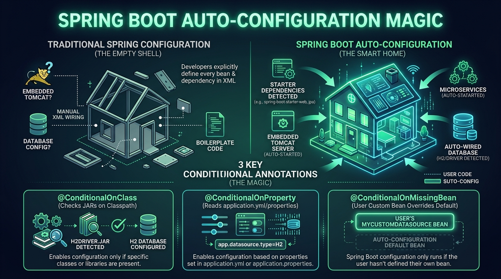

# 🪄 Day 12: Spring Boot Auto-Configuration Magic
## How Spring Boot Reads Your Mind via Starters, Classpath Scanning & Conditionals

| ⬅️ Previous Day | 📚 Course Hub | ➡️ Next Day |
|:---|:---:|---:|
| [← Day 11: Dependency Injection In-Depth](../Day_11_Dependency_Injection_In_Depth/Day_11_Dependency_Injection_In_Depth.md) | [All 60 Days Overview](../../README.md) | [Day 13: AOP — Cross-Cutting Concerns →](../Day_13_AOP_Cross_Cutting_Concerns/Day_13_AOP_Cross_Cutting_Concerns.md) |

[](../../README.md)
[](../../README.md)
[](../../README.md)
[](../../README.md)

---

## 📌 What Will You Learn Today?

Hey there, friend! Welcome to Day 12. Before Spring Boot was created in 2014, setting up a Java enterprise project required days of frustration: writing 500 lines of XML configuration, setting up web servers manually, and configuring database pools by hand.

When you add `spring-ai-openai-spring-boot-starter` to your `pom.xml` today:
1. You write **zero** XML.
2. You write **zero** manual setup code.
3. You simply write `@Autowired private ChatModel chatModel;` and **it just works**.

How? Is Spring Boot reading your mind?

Today, we will pull back the curtain on **Spring Boot Auto-Configuration**. You will understand the exact mechanism of **Conditional Annotations** (`@ConditionalOnClass`, `@ConditionalOnProperty`, `@ConditionalOnMissingBean`) that makes Spring Boot feel like magic — and how to easily override it whenever you want your own custom behavior.

By the end of today, you will clearly understand:
- ✅ **Spring vs. Spring Boot**: The difference between the core framework and the opinionated bootstrapper.
- ✅ **Unpacking `@SpringBootApplication`**: The 3 critical annotations hidden inside.
- ✅ **What are "Starters"?**: Pre-packaged combo meals of dependencies in Maven.
- ✅ **The `@Conditional` Family**: The simple `if` statements that decide whether a bean is created.
- ✅ **`@ConditionalOnMissingBean`**: Spring's smart "use this default unless the developer provides their own" pattern.
- ✅ **Debugging Auto-Configuration**: Using `--debug` to see exactly which beans were activated and why.
- ✅ **Building Your Own Auto-Configuration**: Writing a custom AI fallback auto-configurer from scratch!

---

> 💡 **New Word Alert! Plain English Definitions for Today's Concepts**
>
> - **Auto-Configuration**: Spring Boot's ability to inspect the libraries you added to Maven and automatically wire up sensible, working beans without you writing a single line of setup code.
> - **Starter (`spring-boot-starter-*`)**: A curated "combo meal" dependency. Instead of hunting down 15 separate jar libraries for web or AI, you add one starter, and Maven pulls in everything needed.
> - **`@ConditionalOnClass`**: An internal `if` statement: *"Create this AI client bean ONLY IF the OpenAI SDK library is present on the classpath!"*
> - **`@ConditionalOnProperty`**: An internal `if` statement: *"Create this bean ONLY IF the user turned it on in `application.yml` (e.g. `ai.enabled=true`)!"*
> - **`@ConditionalOnMissingBean`**: Spring's polite default rule: *"Create this standard default bean ONLY IF the developer hasn't created their own custom version."* It makes overriding Spring defaults effortless!
> - **Conditions Evaluation Report**: A diagnostic report you get by running with `--debug` that reveals exactly which auto-configured beans passed or failed their conditional checks during startup.

---

## 🗺️ Table of Contents

- [1. Real-World Analogy: The Luxury Apartment with Smart Furnishing](#1-real-world-analogy-the-luxury-apartment-with-smart-furnishing)
- [2. Spring vs. Spring Boot: The Evolution](#2-spring-vs-spring-boot-the-evolution)
- [3. Unpacking `@SpringBootApplication`](#3-unpacking-springbootapplication)
  - [3.1 `@SpringBootConfiguration`](#31-springbootconfiguration)
  - [3.2 `@EnableAutoConfiguration`](#32-enableautoconfiguration)
  - [3.3 `@ComponentScan`](#33-componentscan)
- [4. The Secret Engine: Conditional Annotations](#4-the-secret-engine-conditional-annotations)
  - [4.1 `@ConditionalOnClass`: Detecting Classpath Libraries](#41-conditionalonclass-detecting-classpath-libraries)
  - [4.2 `@ConditionalOnProperty`: Reacting to `application.yml`](#42-conditionalonproperty-reacting-to-applicationyml)
  - [4.3 `@ConditionalOnMissingBean`: The Overridable Default](#43-conditionalonmissingbean-the-overridable-default)
- [5. How Spring AI Auto-Configures `ChatModel`](#5-how-spring-ai-auto-configures-chatmodel)
- [6. Inspecting the Auto-Configuration Report with `--debug`](#6-inspecting-the-auto-configuration-report-with---debug)
- [7. Key Takeaways & Summary](#7-key-takeaways--summary)
- [8. Practice Exercises & Full Solutions](#8-practice-exercises--full-solutions)
- [9. Self-Check Quiz](#9-self-check-quiz)

---

# 1. Real-World Analogy: The Luxury Apartment with Smart Furnishing



```
                       TRADITIONAL SPRING (Unfurnished Bare Concrete)
┌─────────────────────────────────────────────────────────────────────────────┐
│ You buy an empty concrete shell. You must personally run electrical cables, │
│ install plumbing, buy a stove, assemble IKEA beds, and hook up water filters│
│ before you can even take a shower.                                          │
└─────────────────────────────────────────────────────────────────────────────┘
                                      vs.
                       SPRING BOOT (Fully Furnished Smart Home)
┌─────────────────────────────────────────────────────────────────────────────┐
│ You open the door: the lights turn on, the refrigerator is stocked, high-   │
│ speed Wi-Fi is connected, and the air conditioning is at 72°F.              │
│                                                                             │
│ BUT: If you bring your own Italian designer couch (@Bean), the smart home   │
│ quietly moves the default couch out to make room for yours!                 │
│ (@ConditionalOnMissingBean).                                                │
└─────────────────────────────────────────────────────────────────────────────┘
```

Spring Boot provides sensible, opinionated defaults for everything. But it never locks you in: **as soon as you define your own custom bean, Spring Boot gracefully yields to your choice.**

---

## 🧭 The Plain English Bridge: Why Spring Boot Feels Like "Magic"

If you've ever felt that Spring Boot does "too much magic" behind your back, here is the secret: **it's not magic, it's just a set of `if` statements run at startup.**

| Spring Boot "Magic" | What's Actually Happening Under the Hood | Plain English Translation |
| :--- | :--- | :--- |
| **`@SpringBootApplication`** | A bundle combining `@Configuration` + `@EnableAutoConfiguration` + `@ComponentScan`. | *"Start scanning this package for classes with `@Component` and configure defaults."* |
| **Starters (`pom.xml`)** | A single Maven dependency that brings in 20 pre-tested JARs that work together. | Like a "Combo Meal" at McDonald's instead of ordering a bun, patty, lettuce, and sauce separately. |
| **Embedded Tomcat** | Spring Boot starts a web server as a regular Java process (`java -jar app.jar`). | No more installing external Tomcat or deploying `.war` files! Your JAR is self-contained. |
| **`@ConditionalOnClass`** | `if (Class.forName("org.postgresql.Driver") != null)` | *"If the Postgres JDBC driver is on the classpath, auto-configure a Postgres database connection."* |
| **`@ConditionalOnMissingBean`** | `if (!context.containsBean("myChatClient"))` | *"If the user didn't write their own custom bean, use our sensible default bean."* |

---

# 2. Spring vs. Spring Boot: The Evolution

Many beginners believe Spring Boot is a replacement for Spring. **It is not.**

- **Spring Framework**: The foundational runtime containing the IoC container, Dependency Injection, AOP, transaction management, and web abstractions.
- **Spring Boot**: An opinionated layer on top of Spring that **pre-configures** Spring automatically using conventions, embedded servers (Tomcat), and starter POMs.

```
┌─────────────────────────────────────────────────────────────┐
│                       SPRING BOOT                           │
│  - Opinionated Auto-Configuration                           │
│  - Embedded Web Server (Tomcat / Netty)                     │
│  - Starter Dependencies (BOM version management)            │
│  - Production Actuator Metrics & Health Checks              │
├─────────────────────────────────────────────────────────────┤
│                     SPRING FRAMEWORK                        │
│  - IoC Container & Bean Lifecycle (ApplicationContext)      │
│  - Dependency Injection (@Component, @Autowired)            │
│  - Aspect-Oriented Programming (AOP)                        │
└─────────────────────────────────────────────────────────────┘
```

---

# 3. Unpacking `@SpringBootApplication`

When you create a Spring Boot project, the main class looks like this:

```java
package com.javagenai;

import org.springframework.boot.SpringApplication;
import org.springframework.boot.autoconfigure.SpringBootApplication;

@SpringBootApplication
public class GenAiApplication {

    public static void main(String[] args) {
        SpringApplication.run(GenAiApplication.class, args);
    }
}
```

If you hover over `@SpringBootApplication` in IntelliJ, you will discover it is a **meta-annotation** combining three annotations:

```
                  ┌─────────────────────────────────────────┐
                  │        @SpringBootApplication           │
                  └────────────────────┬────────────────────┘
                                       │
         ┌─────────────────────────────┼─────────────────────────────┐
         ▼                             ▼                             ▼
┌─────────────────────────┐   ┌─────────────────────────┐   ┌─────────────────────────┐
│ @SpringBootConfiguration│   │ @EnableAutoConfiguration│   │      @ComponentScan     │
│ Identifies this class   │   │ Activates Spring Boot's │   │ Automatically scans for │
│ as a configuration bean │   │ auto-configuration      │   │ @Service, @Component in │
│ source.                 │   │ conditional engine.     │   │ current & sub-packages. │
└─────────────────────────┘   └─────────────────────────┘   └─────────────────────────┘
```

---

# 4. The Secret Engine: Conditional Annotations

How does Spring Boot know *which* beans to create? Through the **`@Conditional`** annotation family.

### 4.1 `@ConditionalOnClass`: Detecting Classpath Libraries

Spring Boot inspects your classpath. If it finds a specific class file inside your Maven `.jar` dependencies, it activates the configuration:

```java
@Configuration
@ConditionalOnClass(name = "org.postgresql.Driver")
public class PostgresAutoConfiguration {
    // Only created if the PostgreSQL JDBC Driver jar is in your pom.xml!
}
```

---

### 4.2 `@ConditionalOnProperty`: Reacting to `application.yml`

In AI systems, you only want to create an `OpenAiChatModel` if the user actually configured an API key:

```java
@Bean
@ConditionalOnProperty(
    prefix = "spring.ai.openai",
    name = "api-key"
)
public ChatModel openAiChatModel(OpenAiProperties properties) {
    System.out.println("[AUTO-CONFIG] OpenAI API Key detected! Activating OpenAiChatModel.");
    return new OpenAiChatModel(properties.getApiKey());
}
```
If the property `spring.ai.openai.api-key` is missing in `application.yml`, Spring simply skips this bean without throwing an error!

---

### 4.3 `@ConditionalOnMissingBean`: The Overridable Default

This is the crown jewel of Spring Boot's design. It tells Spring:
> *"Create this default bean ONLY IF the developer has not provided their own bean of this type."*

```java
@Configuration
public class DefaultChatModelAutoConfiguration {

    @Bean
    @ConditionalOnMissingBean(ChatModel.class)
    public ChatModel defaultLocalChatModel() {
        System.out.println("[AUTO-CONFIG] No custom ChatModel found. Falling back to local Ollama default.");
        return new OllamaChatModel("http://localhost:11434");
    }
}
```

If the developer writes their own `@Bean public ChatModel myEnterpriseModel()`, Spring sees it first, and **automatically disables the default fallback!**

---

# 5. How Spring AI Auto-Configures `ChatModel`

Let's trace how Spring AI uses this exact architecture:

```
1. Developer adds to pom.xml:
   <artifactId>spring-ai-openai-spring-boot-starter</artifactId>

2. Developer adds to application.yml:
   spring.ai.openai.api-key: sk-proj-12345

3. Spring Boot boots up:
   ├── Checks @ConditionalOnClass(OpenAiApi.class) ──► MATCH! (Jar is present)
   ├── Checks @ConditionalOnProperty("api-key")    ──► MATCH! (Key configured)
   └── Checks @ConditionalOnMissingBean(ChatModel) ──► MATCH! (No custom bean)
                                                                 │
                                                                 ▼
                                      Auto-configures OpenAiChatModel bean!
```

---

# 6. Inspecting the Auto-Configuration Report with `--debug`

Have you ever wondered what beans Spring Boot created or skipped? Run your application with the `--debug` flag:

`java -jar my-ai-app.jar --debug`

Spring prints the **Conditions Evaluation Report**:

```text
============================
CONDITIONS EVALUATION REPORT
============================

Positive matches:
-----------------
   OpenAiAutoConfiguration matched:
      - @ConditionalOnClass found required class 'org.springframework.ai.openai.OpenAiApi'
      - @ConditionalOnProperty (spring.ai.openai.api-key) matched

Negative matches:
-----------------
   OllamaAutoConfiguration:
      Did not match:
      - @ConditionalOnProperty (spring.ai.ollama.base-url) did not find property
```

This report is your superpower when debugging why a bean was or was not created.

---

# 7. Key Takeaways & Summary

```
                  ┌─────────────────────────────────┐
                  │       DAY 12 CHEAT SHEET        │
                  └────────────────┬────────────────┘
                                   │
         ┌─────────────────────────┼─────────────────────────┐
         ▼                         ▼                         ▼
  [ The Big 3 Annotations ] [ Conditional Magic ]     [ Developer Control ]
  • @SpringBootApplication: • @ConditionalOnClass:   • @ConditionalOnMissing-
    Configuration + Auto-     activates if jar present  Bean lets you override
    Configuration + Component • @ConditionalOnProperty: any default with your
    Scan                      activates if config set   own custom @Bean
  • Starters bundle curated • Run with '--debug' to   • Zero XML, pure
    libraries with zero XML   view evaluation report    convention over config
```

---

# 8. Practice Exercises & Full Solutions

### 🏋️ Exercise 1: Build a Custom Smart AI Auto-Configuration Class
**Objective**: Write a simulated configuration class `SmartAIAutoConfiguration` that:
1. Only activates if property `ai.enabled` is `true`.
2. Provides a default `MockFallbackModel` if no `ChatModel` bean exists.

#### Solution:
```java
package com.javagenai.day12;

import org.springframework.boot.autoconfigure.condition.ConditionalOnMissingBean;
import org.springframework.boot.autoconfigure.condition.ConditionalOnProperty;
import org.springframework.context.annotation.Bean;
import org.springframework.context.annotation.Configuration;

@Configuration
@ConditionalOnProperty(name = "ai.enabled", havingValue = "true", matchIfMissing = true)
public class SmartAIAutoConfiguration {

    @Bean
    @ConditionalOnMissingBean(ChatModel.class)
    public ChatModel defaultMockModel() {
        System.out.println("[SmartAIAutoConfig] Activating default MockFallbackModel...");
        return prompt -> "[Auto-Configured Mock Response]: " + prompt;
    }
}
```

---

## 9. Self-Check Quiz

1. **What three annotations make up `@SpringBootApplication`?**
   - *Answer*: `@SpringBootConfiguration`, `@EnableAutoConfiguration`, and `@ComponentScan`.
2. **What does `@ConditionalOnMissingBean` do?**
   - *Answer*: It instructs Spring to register the bean only if no other bean of that type has already been registered in the `ApplicationContext`, providing a sensible default that users can easily override.
3. **What is the difference between `@ConditionalOnClass` and `@ConditionalOnProperty`?**
   - *Answer*: `@ConditionalOnClass` tests whether a specific class exists on the application's runtime classpath (typically from a Maven dependency). `@ConditionalOnProperty` tests whether a specific configuration key exists with a specific value in `application.yml` or environment variables.
4. **Why are Maven Starters (like `spring-boot-starter-web`) so popular?**
   - *Answer*: They bundle all required transitive dependencies and version alignments into a single dependency, eliminating manual version management and dependency conflicts.
5. **How can you see why a Spring Boot auto-configuration class was activated or rejected?**
   - *Answer*: By running the application with the `--debug` flag or setting `debug=true` in `application.properties`, which outputs the Conditions Evaluation Report.

---

<p align="center">
  <b>Awesome job finishing Day 12! 🎉</b><br>
  You now know that Spring Boot's "magic" is just a set of clever conditional checks that save you hours of setup time.<br>
  Tomorrow on <b>Day 13</b>, we conquer <b>Aspect-Oriented Programming (AOP) — Cross-Cutting Concerns</b>: Automatically logging AI requests, tracking response latency, and retrying failed calls without changing your core logic! Let's keep going!
</p>
