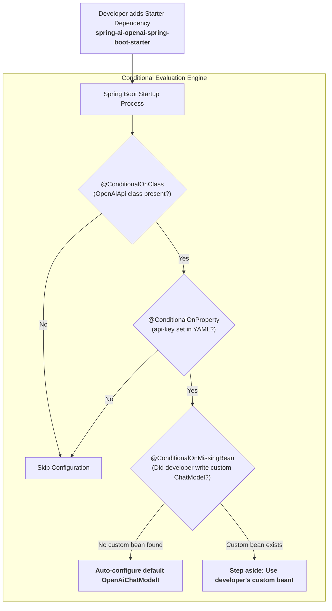

# Day_12 — Spring Boot Auto-Configuration Magic

| ⬅️ Previous Day | 📚 Course Hub | ➡️ Next Day |
|:---|:---:|---:|
| [← Day 11: Dependency Injection In-Depth](../Day_11_Dependency_Injection_In_Depth/Day_11_Dependency_Injection_In_Depth.md) | [All 60 Days Overview](../../README.md) | [Day 13: AOP — Cross-Cutting Concerns →](../Day_13_AOP_Cross_Cutting_Concerns/Day_13_AOP_Cross_Cutting_Concerns.md) |

---

## 🎯 What You'll Understand By the End
- How Spring Boot reads your project classpath and automatically wires production-ready beans without manual setup code.
- What happens under the hood when you add a **Starter Dependency** (like `spring-ai-openai-spring-boot-starter`).
- The 3 essential pieces that make up the **`@SpringBootApplication`** annotation.
- How the **`@Conditional`** annotation family (`@ConditionalOnClass`, `@ConditionalOnProperty`, `@ConditionalOnMissingBean`) acts as intelligent decision gates.
- How to override any auto-configured default bean simply by declaring your own `@Bean`.

---

## 🧠 The Problem This Solves

Before Spring Boot was released in 2014, configuring a Spring application was notoriously painful:

- To build a simple web service that connects to a database, you had to write 100+ lines of XML or Java `@Configuration` code.
- You had to manually configure the embedded web server (Tomcat), manually set up JSON serializers (Jackson), manually configure database connection pools (HikariCP), and manually configure transaction managers.
- If you made a minor typo in an XML file or misconfigured a bean method name, the application crashed with incomprehensible stack traces.
- Developers spent days just getting a project to start before writing a single line of business logic.

**Spring Boot Auto-Configuration** eliminates this setup friction completely. By inspecting the libraries on your classpath and the properties in your `application.yml`, Spring Boot automatically creates standard, sensible, production-ready beans.

---

## 📖 Core Concept, Explained Simply

### The Furnished Apartment Analogy

Think of setting up an application like moving into a new apartment:

- **Traditional Spring (The Unfurnished Concrete Shell)**:
  - You lease a bare concrete room. You must personally run electrical wiring, solder copper plumbing pipes, assemble IKEA bed frames, and install water pumps before you can brew a single cup of coffee.
- **Spring Boot (The Smart Furnished Luxury Suite)**:
  - You unlock the door: the lights turn on automatically, the refrigerator is stocked, Wi-Fi connects immediately, and climate control warms the room.
  - **The Overriding Rule**: If you bring your own custom Italian leather sofa into the apartment (defining your own `@Bean`), the smart apartment politely moves its default sofa out to the hallway (**`@ConditionalOnMissingBean`**) to give yours center stage!

### The Three Pillars of `@SpringBootApplication`

When you annotate your main class with `@SpringBootApplication`, it bundles three critical annotations into one:
1. **`@SpringBootConfiguration`**: Marks the class as a configuration source that can declare `@Bean` factory methods.
2. **`@ComponentScan`**: Automatically scans the current package and all sub-packages for `@Component`, `@Service`, and `@Repository` classes.
3. **`@EnableAutoConfiguration`**: The master switch that activates Spring Boot's automatic configuration engine.

### The Conditional Gatekeepers (`@Conditional...`)

Spring Boot isn't guessing blindly; it evaluates explicit conditions before creating beans:
- **`@ConditionalOnClass`**: *"Is this library present on the classpath?"* (e.g., if PostgreSQL driver is in `pom.xml`, configure a database connection pool).
- **`@ConditionalOnProperty`**: *"Is this property defined in `application.yml`?"* (e.g., if `spring.ai.openai.api-key` is set, activate the OpenAI client).
- **`@ConditionalOnMissingBean`**: *"Did the developer define their own custom bean?"* If not, create the standard default bean; if yes, step aside.

> 💡 **New Word Alert — "Auto-Configuration"**: The Spring Boot mechanism that automatically creates and configures beans based on detected classpath libraries and configuration properties.

> 💡 **New Word Alert — "Starter Dependency"**: A curated Maven or Gradle package (e.g., `spring-boot-starter-web`) that bundles all necessary dependencies and compatible versions into a single coordinate.

> 💡 **New Word Alert — "@ConditionalOnMissingBean"**: A condition that tells Spring Boot to create a default bean only if the user hasn't declared their own bean of that type.

---

## 🗺️ Visual Overview



*This diagram illustrates how Spring Boot evaluates auto-configuration conditions. It verifies that the required class is on the classpath, checks if the configuration property is set, and confirms that no custom bean was provided before instantiating the default `ChatModel`.*

---

## 💻 Code Walkthrough

Here is a minimal, complete example showing how an auto-configuration class uses conditions to provide an overridable default AI model:

```java
import org.springframework.boot.autoconfigure.condition.ConditionalOnMissingBean;
import org.springframework.boot.autoconfigure.condition.ConditionalOnProperty;
import org.springframework.context.annotation.Bean;
import org.springframework.context.annotation.Configuration;

// 1. Common Interface
interface ChatModel {
    String generate(String prompt);
}

// 2. Default Local Implementation
class DefaultLocalModel implements ChatModel {
    @Override
    public String generate(String prompt) {
        return "[Default Local Ollama] " + prompt;
    }
}

// 3. Custom Enterprise Implementation
class CustomOpenAiModel implements ChatModel {
    @Override
    public String generate(String prompt) {
        return "[Custom Enterprise OpenAI] " + prompt;
    }
}

// 4. Auto-Configuration Class (simulating Spring Boot Starter)
@Configuration
public class AiAutoConfiguration {

    @Bean
    // Only creates this bean if the developer did NOT define their own ChatModel!
    @ConditionalOnMissingBean(ChatModel.class)
    public ChatModel defaultChatModel() {
        System.out.println("[AutoConfig] No custom ChatModel found. Registering DefaultLocalModel.");
        return new DefaultLocalModel();
    }
}

// 5. User Configuration (Optional Override)
@Configuration
class UserAppConfig {

    // If you uncomment this @Bean, Spring Boot's defaultChatModel automatically steps aside!
    /*
    @Bean
    public ChatModel myCustomModel() {
        System.out.println("[UserConfig] Developer provided custom model!");
        return new CustomOpenAiModel();
    }
    */
}
```

### Line-by-Line Breakdown

| Code Statement | Plain-English Explanation |
|:---|:---|
| `@Configuration` | Declares that this class defines Spring beans. |
| `@ConditionalOnMissingBean(ChatModel.class)` | The gatekeeper condition. Tells Spring to evaluate whether any bean implementing `ChatModel` already exists in the container. |
| `public ChatModel defaultChatModel()` | If no bean exists, this method executes, providing a sensible fallback (`DefaultLocalModel`). |
| `myCustomModel()` (commented out) | If the developer defines this bean, Spring discovers it first, causing `@ConditionalOnMissingBean` to evaluate to `false`. The default is gracefully bypassed. |

---

## 🔑 Key Terminology

| Term | Plain-English Meaning |
|:---|:---|
| **Auto-Configuration** | Spring Boot's system for automatically registering beans based on the libraries it finds on your classpath. |
| **Starter Dependency** | A pre-packaged bundle of Maven/Gradle dependencies (e.g., `spring-boot-starter-web`) providing everything needed for a specific capability. |
| **`@SpringBootApplication`** | Meta-annotation that combines configuration, auto-configuration, and package component scanning. |
| **`@ConditionalOnClass`** | Activates a bean or configuration only if the specified class file is present on the classpath. |
| **`@ConditionalOnProperty`** | Activates a bean or configuration only if a specific configuration key is set in `application.yml`. |
| **`@ConditionalOnMissingBean`** | Activates a fallback default bean only if no matching bean has been explicitly defined by the developer. |

---

## ⚠️ Common Beginner Mistakes

### 1. Placing the Main Class in the Wrong Package
`@SpringBootApplication` enables `@ComponentScan`, which scans the package of the main class and all its **sub-packages**. If you place components in a sibling or parent package, Spring will never discover them.

❌ **Wrong Package Structure**:
```
com.example.app.Application.java (Main class)
com.example.service.ChatService.java (Sibling package: NEVER SCANNED!)
```

✅ **Right Package Structure**:
```
com.example.Application.java (Root package for app)
com.example.service.ChatService.java (Sub-package: scanned automatically!)
```
*Why it is wrong*: Spring scans downwards from the location of `@SpringBootApplication`. Always place your main class in the root package.

---

### 2. Thinking Spring Boot is "Magic" You Cannot Control
Beginners sometimes feel that Spring Boot does things unpredictably. In reality, every auto-configured bean can be inspected, overridden, or completely disabled.

❌ **Misconception**:
"Spring Boot forced an in-memory database on me and I can't change it."

✅ **Right Way**:
Simply declare your own `@Bean DataSource dataSource()`, and Spring Boot's auto-configured database gracefully steps aside.

---

### 3. Missing Mandatory Starter Configuration Properties
Many starters require at least one property (such as an API key or database URL) to activate. Forgetting the property causes the starter's `@ConditionalOnProperty` to fail silently, resulting in `NoSuchBeanDefinitionException`.

---

## ✅ Best Practices

1. **Keep Your Main Class at the Root Package**: Always place your `@SpringBootApplication` main class at the root package (e.g., `com.company.project`) so component scanning covers all services, controllers, and repositories automatically.
2. **Run with `--debug` to Troubleshoot**: If you are unsure why a bean was or wasn't auto-configured, run your application with `--debug`. Spring Boot will print a detailed **Conditions Evaluation Report** showing every positive and negative match.
3. **Rely on Starters for Version Management**: Avoid specifying explicit version numbers on individual dependencies in `pom.xml`. Let Spring Boot's parent BOM (Bill of Materials) manage version compatibility across all libraries.

---

## 🔭 Looking Ahead
In **Day_13**, we will explore **Aspect-Oriented Programming (AOP)** — learning how to automatically log prompt latencies, count tokens, and handle retries across all AI methods using reusable aspects.

---

## 📝 Quick Recap
- **Auto-Configuration** automatically creates sensible, production-ready beans based on classpath JARs and YAML properties.
- **Starters** group compatible library versions and dependencies into a single, clean coordinate.
- **`@SpringBootApplication`** enables configuration, package component scanning, and auto-configuration.
- **`@Conditional` annotations** ensure beans are created only when appropriate conditions are met.
- **`@ConditionalOnMissingBean`** lets you override any default bean simply by providing your own `@Bean`.

---

## 🧪 Try It Yourself

1. **Explore the Conditions Report**: Run any Spring Boot application with the command-line argument `--debug`. Scan the console output for the "CONDITIONS EVALUATION REPORT" and find one positive match and one negative match.
2. **Build a Conditional Greeter**: Create a `@Bean` annotated with `@ConditionalOnProperty(name = "ai.features.enabled", havingValue = "true")`. Add `ai.features.enabled: true` in your `application.yml` and verify that the bean loads; then change it to `false` and observe that the bean is skipped.
3. **Override an Auto-Configured Default**: Create a custom `ChatModel` bean in your application and verify that your custom model replaces the starter's default fallback bean.
