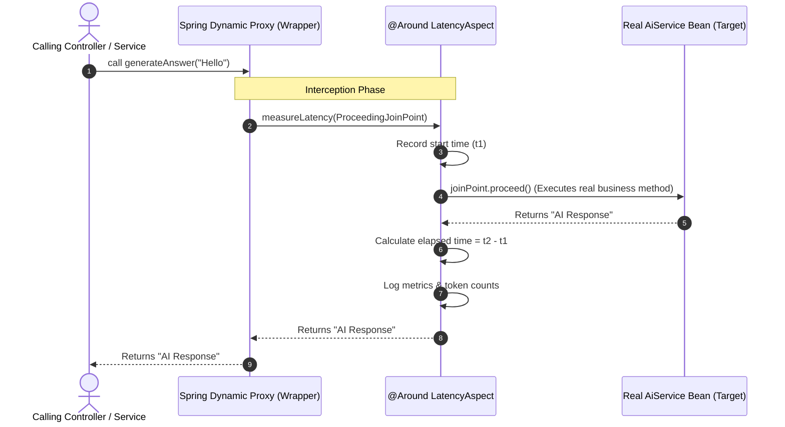

# Day_13 — AOP: Cross-Cutting Concerns

| ⬅️ Previous Day | 📚 Course Hub | ➡️ Next Day |
|:---|:---:|---:|
| [← Day 12: Spring Boot Auto-Configuration Magic](../Day_12_Spring_Boot_Auto_Configuration/Day_12_Spring_Boot_Auto_Configuration.md) | [All 60 Days Overview](../../README.md) | [Day 14: Spring Boot Actuator & Production Readiness →](../Day_14_Actuator_Production_Readiness/Day_14_Actuator_Production_Readiness.md) |

---

## 🎯 What You'll Understand By the End
- What **Cross-Cutting Concerns** are and why burying logging, metrics, and retry code inside business methods creates unmaintainable spaghetti code.
- The 5 core concepts of **Aspect-Oriented Programming (AOP)**: Aspect, Join Point, Pointcut, Advice, and Target Object.
- The 5 types of **Advice** (`@Before`, `@AfterReturning`, `@AfterThrowing`, `@After`, and `@Around`).
- How Spring uses **Dynamic Proxies** to invisibly intercept method calls at runtime.
- How to implement latency monitoring and prompt safety audits for AI calls using custom annotations and `@Around` advice.

---

## 🧠 The Problem This Solves

Imagine you are building a production AI chat system. Beyond answering questions, your engineering team requires:
1. **Latency Logging**: Measuring how many milliseconds each LLM call takes.
2. **Audit & Safety Checks**: Checking prompts for sensitive personal data (PII) before sending them across the internet.
3. **Automatic Retries**: Retrying network calls if OpenAI returns a temporary 503 error.
4. **Token Cost Tracking**: Recording token consumption for billing.

Without AOP, your business service becomes drowned in repetitive plumbing code:

```java
// ❌ Spagetti Code: Business logic buried inside 30 lines of plumbing
public String answerQuestion(String prompt) {
    long start = System.currentTimeMillis();
    logger.info("Audit: Incoming prompt -> {}", prompt);

    if (containsPii(prompt)) {
        throw new SecurityException("PII detected!");
    }

    String response;
    int retries = 0;
    while (true) {
        try {
            // THE ONLY ACTUAL BUSINESS LOGIC IN THE ENTIRE METHOD:
            response = chatModel.generate(prompt);
            break;
        } catch (Exception e) {
            if (++retries >= 3) throw e;
        }
    }

    long elapsed = System.currentTimeMillis() - start;
    metrics.record("llm.latency", elapsed);
    return response;
}
```

If you have 40 different AI methods, you have to copy-paste this 30-line boilerplate into all 40 methods!

**Aspect-Oriented Programming (AOP)** solves this by extracting cross-cutting concerns into a separate, reusable **Aspect** class. Your business methods stay clean, elegant, and focused 100% on domain logic.

---

## 📖 Core Concept, Explained Simply

### The Airport Security Checkpoint Analogy

Think of method calls in an enterprise system like passengers taking a flight:

- **Without AOP (Spaghetti Security)**:
  - Every individual airline boarding gate must buy its own metal detector, hire X-Ray baggage screeners, install ticket scanners, and verify passports.
  - The pilots and gate agents spend 90% of their day conducting security screenings instead of flying airplanes!
- **With AOP (Centralized Interception)**:
  - Passengers walk through a single central **Security Checkpoint (The Aspect)** before reaching their gates.
  - At the checkpoint, bags are scanned (`@Before`), passports are stamped, and suspicious luggage is rejected.
  - Once cleared, passengers proceed directly to their gate. The flight crew focuses 100% on **FLYING THE PLANE** (the pure business logic)!

### The AOP Vocabulary Decoded

Spring AOP introduces a few formal terms, but the concepts are straightforward:

- **Aspect (`@Aspect`)**: The dedicated class containing the cross-cutting code (e.g., `AiMonitoringAspect`).
- **Join Point**: Any point in your program where advice could run (in Spring AOP, this is always a method execution).
- **Pointcut (`@Pointcut`)**: The filter or query that defines *which* methods should be intercepted (e.g., *"Intercept any method annotated with `@TrackLatency`"*).
- **Advice**: What action to take and when to take it (`@Before`, `@After`, or `@Around`).
- **Dynamic Proxy**: An invisible wrapper that Spring places around your bean. When another class calls your service, it actually calls the proxy wrapper first, which executes the aspect and then forwards the call to your real method.

> 💡 **New Word Alert — "Cross-Cutting Concern"**: Functionality that applies across multiple application layers (like security, logging, metrics, or transactions) rather than belonging to a single business class.

> 💡 **New Word Alert — "Dynamic Proxy"**: A generated wrapper object created at runtime by Spring that intercepts incoming method invocations to execute aspect advice before delegating to the target bean.

> 💡 **New Word Alert — "ProceedingJoinPoint"**: An object passed into `@Around` advice that allows the aspect to control when (or if) the target method executes via `.proceed()`.

---

## 🗺️ Visual Overview



*This sequence diagram shows Spring AOP in action. The caller interacts with a Dynamic Proxy wrapper. The proxy delegates to the `@Around` aspect, which records start time, invokes the real business method via `joinPoint.proceed()`, measures elapsed duration, and returns the result.*

---

## 💻 Code Walkthrough

Here is a complete, minimal implementation of a custom `@TrackLatency` annotation powered by an `@Around` aspect:

```java
import org.aspectj.lang.ProceedingJoinPoint;
import org.aspectj.lang.annotation.Around;
import org.aspectj.lang.annotation.Aspect;
import org.springframework.stereotype.Component;
import org.springframework.stereotype.Service;

import java.lang.annotation.ElementType;
import java.lang.annotation.Retention;
import java.lang.annotation.RetentionPolicy;
import java.lang.annotation.Target;

// 1. Custom Marker Annotation
@Target(ElementType.METHOD)
@Retention(RetentionPolicy.RUNTIME)
@interface TrackLatency {}

// 2. The Intercepting Aspect
@Aspect
@Component
public class AiLatencyAspect {

    // Intercepts any method annotated with @TrackLatency
    @Around("@annotation(TrackLatency)")
    public Object measureExecutionTime(ProceedingJoinPoint joinPoint) throws Throwable {
        String methodName = joinPoint.getSignature().getName();
        long startTime = System.currentTimeMillis();

        System.out.println("[AOP Before] Intercepted: " + methodName + ". Starting timer...");

        try {
            // PROCEED to execute the real business method!
            Object result = joinPoint.proceed();

            long elapsed = System.currentTimeMillis() - startTime;
            System.out.println("[AOP After] " + methodName + " completed successfully in " + elapsed + " ms");

            return result;
        } catch (Throwable ex) {
            long elapsed = System.currentTimeMillis() - startTime;
            System.err.println("[AOP Error] " + methodName + " failed after " + elapsed + " ms: " + ex.getMessage());
            throw ex; // Re-throw so the caller knows the error occurred!
        }
    }
}

// 3. Clean Business Service
@Service
class SmartAiService {

    @TrackLatency // Pure, declarative monitoring!
    public String generateSummary(String documentText) throws InterruptedException {
        // Pure business logic: Zero timing or logging code here!
        Thread.sleep(250); // Simulating an external AI API call
        return "Summary of " + documentText.length() + " characters.";
    }
}
```

### Line-by-Line Breakdown

| Code Statement | Plain-English Explanation |
|:---|:---|
| `@Target(ElementType.METHOD)` | Specifies that `@TrackLatency` can be attached to methods. |
| `@Retention(RetentionPolicy.RUNTIME)` | Ensures the annotation is preserved in compiled bytecode so Spring can inspect it at runtime. |
| `@Aspect @Component` | Registers the class as both an AOP Aspect and a Spring-managed Bean in the `ApplicationContext`. |
| `@Around("@annotation(TrackLatency)")` | Declares an `@Around` advice that intercepts any method annotated with `@TrackLatency`. |
| `joinPoint.proceed()` | Crucial step! Hands control over to the actual business method (`generateSummary`). Without this line, the target method never runs! |
| `@TrackLatency` on `generateSummary` | The business method stays 100% clean. It has no idea that timing or monitoring is taking place around it. |

---

## 🔑 Key Terminology

| Term | Plain-English Meaning |
|:---|:---|
| **Aspect** | A class holding modularized cross-cutting code (annotated with `@Aspect`). |
| **Join Point** | The point during program execution where an aspect can be applied (method execution in Spring). |
| **Pointcut** | An expression defining which specific methods the aspect should intercept. |
| **Advice** | The action taken by an aspect at a join point (`@Before`, `@After`, `@Around`). |
| **`@Around`** | The most powerful advice type; surrounds the method call, running code both before and after execution. |
| **Dynamic Proxy** | The runtime wrapper object created by Spring that intercepts method calls and triggers aspects. |

---

## ⚠️ Common Beginner Mistakes

### 1. Forgetting to Call `joinPoint.proceed()` in `@Around` Advice
In an `@Around` advice, if you forget to invoke `joinPoint.proceed()`, the underlying business method will **never execute**, and the caller will receive `null`!

❌ **Wrong Way**:
```java
@Around("@annotation(TrackLatency)")
public Object logTime(ProceedingJoinPoint jp) {
    long start = System.currentTimeMillis();
    // OOPS! Forgot jp.proceed();
    return null; // The real AI model was never called!
}
```

✅ **Right Way**:
Always call `Object result = jp.proceed();` and return `result`.

---

### 2. The Self-Invocation Trap (`this.method()`)
Spring AOP works via **Dynamic Proxies**. When Class A calls a method on Class B, it goes through the proxy. But when a method in Class A calls another method in the **same class** (`this.helper()`), the call bypasses the proxy completely!

❌ **Fails to Intercept**:
```java
@Service
public class ChatService {
    public void process() {
        this.askModel(); // Self-invocation: Bypasses the proxy! @TrackLatency on askModel will NOT fire!
    }

    @TrackLatency
    public void askModel() { ... }
}
```

✅ **Right Way**:
Invoke the annotated method from an external calling class (such as a Controller), or extract the annotated method into a separate dedicated service bean.

---

### 3. Swallowing Exceptions Inside Advice
If an exception occurs during the target method execution, catching it without re-throwing hides critical application errors from the caller.

❌ **Wrong Way**:
```java
try {
    return jp.proceed();
} catch (Throwable t) {
    System.out.println("Error happened");
    return "Error"; // Swallows exception! Caller thinks the call succeeded!
}
```

✅ **Right Way**:
Log the error in the aspect, and always re-throw `throw ex;`.

---

## ✅ Best Practices

1. **Use Custom Annotations for Pointcuts**: Avoid complex regex execution strings like `execution(* com.company..*(..))`. Use clean marker annotations like `@AuditPrompt` or `@TrackTokens`.
2. **Keep Aspects Fast and Lightweight**: Code in an aspect runs on every intercepted method call. Avoid performing heavy database operations or synchronous remote calls inside advice.
3. **Use AOP Strictly for Operational Concerns**: Never put core business domain rules inside an aspect. Keep business logic in services and use AOP only for logging, metrics, caching, and transactions.

---

## 🔭 Looking Ahead
In **Day_14**, we will conclude Phase 2 by mastering **Spring Boot Actuator & Production Readiness**, learning how to expose health checks, metrics, and Prometheus endpoints for production monitoring.

---

## 📝 Quick Recap
- **AOP** extracts repetitive operational plumbing (cross-cutting concerns) out of business logic.
- An **Aspect** contains **Pointcuts** (which methods to intercept) and **Advice** (what action to execute).
- **`@Around` advice** surrounds a method call, providing full control over execution timing and results via `joinPoint.proceed()`.
- Spring uses **Dynamic Proxies** to intercept method calls invisibly.
- Calling an annotated method from within the same class (`this.method()`) bypasses the Spring proxy and will not trigger the aspect.

---

## 🧪 Try It Yourself

1. **Build an Audit Aspect**: Create an `@AuditPrompt` annotation and an aspect that prints the incoming string argument before executing the method.
2. **Build a Retry Aspect**: Write an `@Around` advice that catches network exceptions and retries calling `joinPoint.proceed()` up to 3 times before giving up.
3. **Inspect the Proxy**: In your main application, print `chatService.getClass().getName()`. Notice that instead of `ChatService`, Spring outputs something like `ChatService$$SpringCGLIB$$0` — you are looking at the dynamic proxy wrapper!
