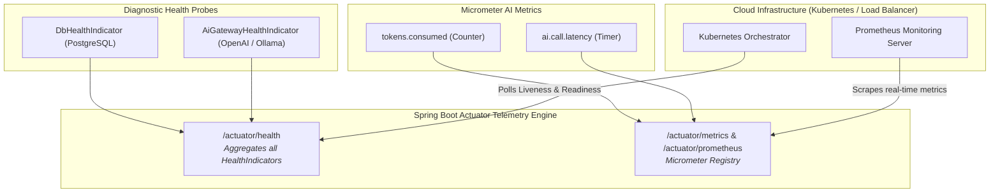

# Day_14 — Spring Boot Actuator & Production Readiness

| ⬅️ Previous Day | 📚 Course Hub | ➡️ Next Day |
|:---|:---:|---:|
| [← Day 13: AOP — Cross-Cutting Concerns](../Day_13_AOP_Cross_Cutting_Concerns/Day_13_AOP_Cross_Cutting_Concerns.md) | [All 60 Days Overview](../../README.md) | [Day 15: HTTP Deep Dive & First REST Controller →](../../Phase_03_Spring_Web_REST_APIs/Day_15_HTTP_Deep_Dive_First_REST_Controller/Day_15_HTTP_Deep_Dive_First_REST_Controller.md) |

---

## 🎯 What You'll Understand By the End
- How **Spring Boot Actuator** exposes built-in production telemetry (`/actuator/health`, `/actuator/metrics`) with zero boilerplate.
- How to write a custom **`HealthIndicator`** that tests external AI model connectivity and vector database availability.
- The vital difference between a **Liveness Probe** (is the app deadlocked?) and a **Readiness Probe** (is the app warmed up and ready for traffic?).
- How to track custom AI metrics (token usage, prompt error rates) using **Micrometer** (`MeterRegistry`).
- How to properly secure actuator endpoints so sensitive credentials and heap dumps are never exposed to the public internet.

---

## 🧠 The Problem This Solves

Deploying an application to production without monitoring is like flying a supersonic jet in heavy fog with no instrument panel:

- If an upstream AI provider (like OpenAI or your local Ollama instance) crashes or runs out of credits, your users experience 30-second timeouts and HTTP 500 errors.
- You have no idea how many tokens your application consumes each hour until the end-of-month invoice arrives.
- In modern cloud environments (like Kubernetes or AWS ECS), the container orchestrator needs to know: *"Should I send incoming user traffic to this pod? Or is it still downloading heavy embedding weights into memory?"*
- Without standardized health endpoints, load balancers cannot tell if a container is frozen, causing user requests to be routed into a dead server.

**Spring Boot Actuator** and **Micrometer** solve this by providing automated, industry-standard health probes and metrics dashboards out of the box.

---

## 📖 Core Concept, Explained Simply

### The Fighter Jet Heads-Up Display Analogy

Think of running an application in production:

- **Without Actuator (Flying Blind)**:
  - You have no fuel gauge, no altimeter, and no oil pressure sensors.
  - You only discover that an engine has failed when the plane suddenly falls out of the sky.
- **With Actuator (The Digital Cockpit HUD)**:
  - **Health Indicator (`/actuator/health`)**: The master warning panel. A green light signals that databases, caches, and AI gateways are healthy (`UP`). If a service fails, it switches to red (`DOWN`) and reports the exact diagnostic error.
  - **Metrics Engine (`/actuator/metrics`)**: The digital dials and fuel flow meters. Shows real-time request counts, memory pressure, and token burn rates.
  - **Telemetry Transponder (`/actuator/prometheus`)**: Automatically broadcasts diagnostic data to your monitoring control tower (Prometheus & Grafana).

### Liveness vs. Readiness Probes

Modern cloud orchestrators (like Kubernetes) rely on two distinct probes:
1. **Liveness Probe**: *"Is the JVM alive and breathing?"*
   - If the process is deadlocked or out of memory, the liveness probe fails, and Kubernetes restarts the container.
2. **Readiness Probe**: *"Is the application ready to accept traffic?"*
   - If your application is currently running `@PostConstruct` to pre-warm 2 GB of vector embeddings, it is alive, but **not ready**. The readiness probe reports `DOWN`, telling the load balancer: *"Wait! Do not send user queries here yet."* Once warming completes, it flips to `UP`.

### The Three Micrometer Metric Types

1. **`Counter`**: A metric that only goes up (e.g., total tokens spent, total AI prompts served).
2. **`Timer`**: Measures both duration and event frequency (e.g., latency distribution of LLM API calls).
3. **`Gauge`**: A fluctuating snapshot value (e.g., number of active chat sessions, current size of an in-memory vector cache).

> 💡 **New Word Alert — "Spring Boot Actuator"**: A production-readiness module that provides HTTP and JMX endpoints to monitor, audit, and interact with a running Spring Boot application.

> 💡 **New Word Alert — "HealthIndicator"**: A Spring interface you implement to contribute custom diagnostic health checks (e.g., pinging an LLM endpoint).

> 💡 **New Word Alert — "Micrometer"**: A vendor-neutral application metrics facade (like SLF4J for metrics) that exports telemetry to systems like Prometheus, Datadog, or New Relic.

---

## 🗺️ Visual Overview



*This diagram illustrates Spring Boot Actuator's operational role. Custom health indicators feed into `/actuator/health` so Kubernetes can route traffic safely, while Micrometer counters and timers feed into `/actuator/prometheus` for real-time telemetry.*

---

## 💻 Code Walkthrough

Here is a complete Java example showing a custom AI Health Indicator and a service tracking token consumption with Micrometer:

```java
import io.micrometer.core.instrument.Counter;
import io.micrometer.core.instrument.MeterRegistry;
import org.springframework.boot.actuate.health.Health;
import org.springframework.boot.actuate.health.HealthIndicator;
import org.springframework.stereotype.Component;
import org.springframework.stereotype.Service;

// 1. Custom Health Indicator for External AI Gateway
@Component
class AiGatewayHealthIndicator implements HealthIndicator {

    @Override
    public Health health() {
        boolean apiReachable = checkAiProviderHealth();

        if (apiReachable) {
            return Health.up()
                .withDetail("provider", "OpenAI")
                .withDetail("latency_ms", 45)
                .build();
        } else {
            return Health.down()
                .withDetail("provider", "OpenAI")
                .withDetail("error", "Gateway unreachable or API quota exceeded")
                .build();
        }
    }

    private boolean checkAiProviderHealth() {
        // Simulates an ultra-fast heartbeat ping to the AI provider
        return true; 
    }
}

// 2. Production Service with Micrometer Metrics
@Service
public class ProductionAiService {
    private final Counter tokenUsageCounter;

    // MeterRegistry is auto-configured by Spring Boot Actuator!
    public ProductionAiService(MeterRegistry meterRegistry) {
        this.tokenUsageCounter = Counter.builder("ai.tokens.consumed")
            .description("Total number of tokens consumed across all AI calls")
            .tag("model", "gpt-4o")
            .register(meterRegistry);
    }

    public String processPrompt(String userPrompt) {
        // Business logic execution
        String response = "Simulated response to: " + userPrompt;
        
        // Record token metrics:
        int estimatedTokens = userPrompt.length() / 4 + 20;
        tokenUsageCounter.increment(estimatedTokens);

        return response;
    }
}
```

### Line-by-Line Breakdown

| Code Statement | Plain-English Explanation |
|:---|:---|
| `implements HealthIndicator` | Marks the class as an active contributor to Spring Boot's `/actuator/health` endpoint. |
| `Health.up().withDetail(...)` | Constructs a healthy status payload with custom metadata (e.g., ping latency in milliseconds). |
| `Health.down().withDetail(...)` | Constructs an unhealthy status with diagnostic details when a connection drops. |
| `MeterRegistry meterRegistry` | Spring Boot automatically provides this master metrics registry via constructor injection. |
| `Counter.builder("ai.tokens.consumed")` | Creates a typed Micrometer counter tagged by model name (`gpt-4o`). |
| `tokenUsageCounter.increment(...)` | Atomically adds the consumed tokens to the metric; immediately visible in `/actuator/metrics/ai.tokens.consumed`. |

---

## 🔑 Key Terminology

| Term | Plain-English Meaning |
|:---|:---|
| **Spring Boot Actuator** | The framework module exposing production-ready monitoring, auditing, and health endpoints. |
| **`/actuator/health`** | The endpoint providing application health status (`UP`, `DOWN`, `OUT_OF_SERVICE`). |
| **Liveness Probe** | A health check asking if the application container is alive or deadlocked. |
| **Readiness Probe** | A health check asking if the application is ready to accept user requests. |
| **Micrometer** | The metrics collection library embedded in Spring Boot that exports telemetry to Prometheus or Datadog. |
| **Counter** | A Micrometer metric that only increases, tracking occurrences of an event. |
| **Timer** | A Micrometer metric measuring short durations and event frequencies (e.g., method latency). |

---

## ⚠️ Common Beginner Mistakes

### 1. Exposing All Actuator Endpoints Publicly
Setting `management.endpoints.web.exposure.include: "*"` in production exposes dangerous diagnostic endpoints like `/actuator/env` (which might display database passwords) or `/actuator/heapdump` (which dumps entire server memory to a downloadable file!).

❌ **Dangerous Configuration**:
```yaml
management:
  endpoints:
    web:
      exposure:
        include: "*" # NEVER do this in production! Exposes credentials and heap dumps!
```

✅ **Secure Production Configuration**:
```yaml
management:
  endpoints:
    web:
      exposure:
        include: "health,metrics,prometheus" # Expose ONLY safe monitoring endpoints
```

---

### 2. Putting Slow or Heavy Calls Inside `HealthIndicator`
`/actuator/health` is polled by Kubernetes every 5–10 seconds. If your health indicator makes an expensive, full 5-second LLM query, it will saturate your network and lock your threads.

❌ **Wrong Way**:
```java
@Override
public Health health() {
    chatModel.generate("Write a 500-word essay"); // Far too heavy! Blocks the health checker.
}
```

✅ **Right Way**:
Make a lightweight, cached, or shallow HTTP HEAD/GET request with a short 500ms timeout to verify server reachability.

---

### 3. Forgetting Actuator Dependencies in `pom.xml`
Actuator is not part of core Spring Boot web by default. You must include `spring-boot-starter-actuator` in your `pom.xml`, or none of the `/actuator` endpoints will exist.

---

## ✅ Best Practices

1. **Enable Detailed Health for Internal Monitoring**: Set `management.endpoint.health.show-details: when_authorized` so authorized admins see full diagnostic details while public visitors see only `{"status": "UP"}`.
2. **Use Tags with Micrometer**: Always tag your metrics with dimensions like `model="gpt-4o"` or `environment="prod"`. This allows Grafana dashboards to filter and break down costs by model or environment.
3. **Separate Management Port**: In production, configure `management.server.port: 9090` so internal health checks run on an isolated network port that is unreachable from the public internet.

---

## 🔭 Looking Ahead
Congratulations on completing **Phase 2: Spring Core & Dependency Injection**! In **Phase 3 (Days 15–20)**, we will enter **Spring Web & REST APIs** — mastering how to handle HTTP requests, validate DTO payloads, manage global exceptions, and stream real-time tokens using Server-Sent Events (SSE).

---

## 📝 Quick Recap
- **Spring Boot Actuator** exposes out-of-the-box telemetry, health sensors, and diagnostic endpoints.
- **`HealthIndicator`** lets you contribute custom health checks for external AI providers and vector stores.
- **Liveness** verifies the JVM is alive; **Readiness** verifies the app is done pre-warming and ready for user traffic.
- **Micrometer** provides `Counter`, `Timer`, and `Gauge` to track token costs and API latencies.
- In production, expose only necessary endpoints (`health`, `metrics`, `prometheus`) and keep management ports secured.

---

## 🧪 Try It Yourself

1. **Inspect Your Health**: Add `spring-boot-starter-actuator` to a project. Start the application and visit `http://localhost:8080/actuator/health` in your browser. Verify you receive `{"status":"UP"}`.
2. **Build an AI Rate-Limit Counter**: Create a custom `Counter` named `ai.rate_limits.hit`. Increment it whenever a simulated rate-limit exception occurs, and verify the counter via `/actuator/metrics/ai.rate_limits.hit`.
3. **Simulate a Component Failure**: In your custom `AiGatewayHealthIndicator`, add a boolean flag `boolean simFailure = true`. When true, return `Health.down()`. Visit `/actuator/health` and observe how Spring automatically updates the overall HTTP response code to `503 Service Unavailable`!
