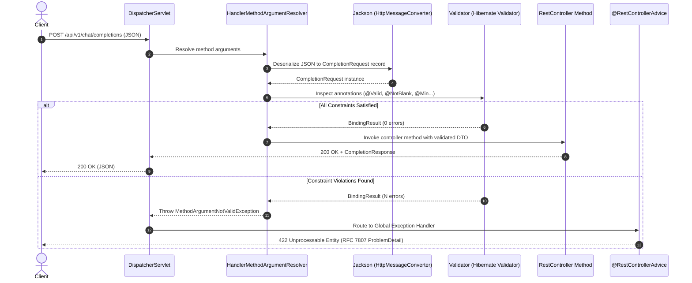

# 🛡️ Day 16: Request Validation, DTOs & Response Design
## Protecting Enterprise AI Gateways with Java 21 Records, Jakarta Validation & RFC 7807

| ⬅️ Previous Day | 📚 Course Hub | ➡️ Next Day |
|:---|:---:|---:|
| [← Day 15: HTTP Deep Dive & First REST Controller](../Day_15_HTTP_Deep_Dive_First_REST_Controller/Day_15_HTTP_Deep_Dive_First_REST_Controller.md) | [All 60 Days Overview](../../README.md) | [Day 17: Exception Handling & Global Error Strategy →](../Day_17_Exception_Handling_Global_Strategy/Day_17_Exception_Handling_Global_Strategy.md) |

[](../../README.md)
[](../../README.md)
[](../../README.md)
[](../../README.md)

---

## 1. Topic Overview

Request validation, Data Transfer Objects (DTOs), and standardized response design establish an impenetrable perimeter defense line for enterprise web applications. In Generative AI systems, strict request validation prevents Financial Denial-of-Service (FDoS) attacks from unbounded prompts, guards against infinite loops in sliding-window document chunkers, and shields internal database credentials from accidental leakage by decoupling domain models from public API contracts using RFC 7807 Problem Details.

---

## 2. Basic Foundations (True Zero)

### Plain English Definitions
- **DTO (Data Transfer Object)**: A lightweight, immutable Java carrier (such as a Java 21 Record) designed exclusively to transport data across HTTP network boundaries without containing database mappings or domain logic.
- **Jakarta Bean Validation (Hibernate Validator)**: A declarative specification using annotations like `@NotBlank`, `@Size`, `@Min`, and `@Max` to enforce integrity constraints before business logic runs.
- **`@Valid`**: The parameter annotation that instructs Spring's `DispatcherServlet` to inspect all validation rules on the incoming request body before executing the controller method.
- **RFC 7807 Problem Details (`application/problem+json`)**: An international IETF standard specifying a structured, predictable JSON format (`type`, `title`, `status`, `detail`, `instance`) for reporting errors to HTTP clients.
- **Mass Assignment Vulnerability**: A severe security risk where external clients send unintended JSON keys (such as `role: "ADMIN"` or `apiKey: "..."`) that bind directly to database entities if DTOs are omitted.

### Relatable Physical Analogy: Airport Security Baggage Scanner
```
[ Incoming Passenger (Raw JSON) ]
              │
              ▼
    [ Passport Control ] ─────────► Missing passport? (Null/Blank payload) ──► REJECT (400)
              │
              ▼
    [ Baggage X-Ray Scanner ] ─────► Prohibited items? (temp < 0, tokens > 4k) ─► REJECT (422)
              │
              ▼
 [ Customs Clearance Inspection ] ─► Overlap >= Chunk Size? (Cross-field error) ─► REJECT (422)
              │
              ▼
   [ Boarding Gate: LLM Runway ] ──► Validated, safe DTO accepted for takeoff!
```

Just as airport baggage screeners intercept oversized luggage and hazardous items before boarding, Spring validation stops malformed prompts, negative temperatures, and malicious payloads at the controller door before they consume GPU inference cycles or corrupt storage.

### Minimal Beginner-Friendly Working Code Example

Let us examine a minimal validated AI prompt endpoint using a Java 21 Record DTO:

```java
package com.javagenai.day16;

import jakarta.validation.Valid;
import jakarta.validation.constraints.NotBlank;
import jakarta.validation.constraints.Size;
import org.springframework.boot.SpringApplication;
import org.springframework.boot.autoconfigure.SpringBootApplication;
import org.springframework.web.bind.annotation.PostMapping;
import org.springframework.web.bind.annotation.RequestBody;
import org.springframework.web.bind.annotation.RequestMapping;
import org.springframework.web.bind.annotation.RestController;

import java.util.Map;

public record PromptRequest(
    @NotBlank(message = "Prompt cannot be blank")
    @Size(max = 500, message = "Prompt cannot exceed 500 characters")
    String prompt
) {}

@SpringBootApplication
@RestController
@RequestMapping("/api/v1/validation-demo")
public class MinimalValidationApp {

    public static void main(String[] args) {
        SpringApplication.run(MinimalValidationApp.class, args);
    }

    @PostMapping("/ask")
    public Map<String, String> askQuestion(@Valid @RequestBody PromptRequest request) {
        return Map.of("status", "ACCEPTED", "prompt", request.prompt());
    }
}
```

#### Line-by-Line Walkthrough
1. `public record PromptRequest(...)`: Declares an immutable Java 21 Record serving as the API boundary DTO.
2. `@NotBlank`: Rejects `null`, empty strings (`""`), or whitespace-only inputs (`"   "`).
3. `@Size(max = 500)`: Restricts prompt length to 500 characters, preventing memory exhaustion and token budget overruns.
4. `@Valid @RequestBody`: Triggers Spring's argument resolver to deserialize JSON into the record and immediately evaluate Jakarta annotations. If violations exist, Spring halts execution and returns an error response.

---

## 3. Core Concept Walkthrough (Basic → Intermediate)

### 3.1 Why Domain Entities Must Never Be Exposed
Exposing JPA `@Entity` classes directly over REST APIs introduces severe architectural flaws:

```
┌─────────────────────────────────────────────────────────────┐
│                        HTTP CLIENT                          │
└──────────────┬──────────────────────────────▲───────────────┘
               │ JSON Request                 │ JSON Response
               │ { "username": "alice",       │ { "id": 1, "username": "alice",
               │   "role": "ADMIN" }          │   "passwordHash": "$2a$12$...",
               │ (Mass Assignment Attack!)    │   "openaiApiKey": "sk-proj-..." }
               ▼                              │ (Information Leakage!)
┌─────────────────────────────────────────────┴───────────────┐
│                  CONTROLLER / SERVICE                       │
│                                                             │
│   JPA Entity: UserAccount                                   │
│   - Long id                                                 │
│   - String username                                         │
│   - String passwordHash                                     │
│   - String openaiApiKey                                     │
│   - String role                                             │
└─────────────────────────────────────────────────────────────┘
```

| Threat | Entity Directly in Controller | DTO Pattern (Java 21 Record) |
| :--- | :--- | :--- |
| **Mass Assignment** | Callers inject `"role": "ADMIN"` directly into entity state | DTO only exposes fields allowed for client input |
| **Information Leakage** | Database columns like `passwordHash` or `apiKey` serialize to JSON | DTO explicitly limits response fields to safe contracts |
| **Schema Coupling** | Renaming a database column instantly breaks mobile and web clients | Database schema evolves independently from public API |
| **Circular Jackson Loops** | Bidirectional relationships trigger `StackOverflowError` | DTOs form flat, clean acyclic trees |

### 3.2 Java 21 Records as High-Performance DTOs
Java 21 Records provide shallow immutability, compact syntax, and defensive initialization without third-party annotation processors like Lombok:

```java
package com.javagenai.day16.dto;

import jakarta.validation.constraints.*;
import java.util.List;

public record CompletionRequest(
    @NotBlank(message = "Prompt must not be empty")
    @Size(max = 4000, message = "Prompt exceeds 4000 character limit")
    String prompt,

    @NotBlank(message = "Model name is required")
    String model,

    @DecimalMin(value = "0.0", message = "Temperature must be >= 0.0")
    @DecimalMax(value = "2.0", message = "Temperature must be <= 2.0")
    double temperature,

    @Min(value = 1, message = "maxTokens must be at least 1")
    @Max(value = 4096, message = "maxTokens must not exceed 4096")
    int maxTokens,

    List<String> stopSequences
) {
    // Compact constructor for defensive copies and normalization
    public CompletionRequest {
        stopSequences = (stopSequences == null) ? List.of() : List.copyOf(stopSequences);
    }
}
```

### 3.3 Spring MVC Validation Pipeline Under the Hood



### 3.4 Custom Constraints: Corporate Approved AI Model Whitelist
When built-in annotations are insufficient, create custom constraint validators:

#### 1. Define the Annotation
```java
package com.javagenai.day16.validation;

import jakarta.validation.Constraint;
import jakarta.validation.Payload;
import java.lang.annotation.*;

@Documented
@Constraint(validatedBy = ApprovedModelValidator.class)
@Target({ ElementType.FIELD, ElementType.RECORD_COMPONENT, ElementType.PARAMETER })
@Retention(RetentionPolicy.RUNTIME)
public @interface ApprovedModel {
    String message() default "Model is not approved for corporate use";
    Class<?>[] groups() default {};
    Class<? extends Payload>[] payload() default {};
}
```

#### 2. Implement the Validator
```java
package com.javagenai.day16.validation;

import jakarta.validation.ConstraintValidator;
import jakarta.validation.ConstraintValidatorContext;
import java.util.Set;

public class ApprovedModelValidator implements ConstraintValidator<ApprovedModel, String> {

    private static final Set<String> ALLOWED = Set.of(
        "gpt-4o", "gpt-4o-mini", "claude-3-5-sonnet", "llama-3.2", "mistral-large"
    );

    @Override
    public boolean isValid(String value, ConstraintValidatorContext context) {
        if (value == null || value.isBlank()) {
            return false;
        }
        return ALLOWED.contains(value.toLowerCase().trim());
    }
}
```

### 3.5 Cross-Field Validation: Preventing RAG Infinite Loops
In document chunking systems, if `chunkOverlap >= chunkSize`, the advance step (`chunkSize - chunkOverlap`) is $\le 0$, resulting in an infinite CPU loop:

```java
package com.javagenai.day16.dto;

import jakarta.validation.constraints.Min;

public record RagChunkingRequest(
    @Min(100) int chunkSize,
    @Min(0) int chunkOverlap
) {
    public RagChunkingRequest {
        if (chunkOverlap >= chunkSize) {
            throw new IllegalArgumentException(
                "chunkOverlap (" + chunkOverlap + ") must be strictly less than chunkSize (" + chunkSize + ")"
            );
        }
    }
}
```

### 3.6 Standard RFC 7807 Problem Details
Spring Boot 3 provides native support for RFC 7807 via `ProblemDetail`:

```json
{
  "type": "https://api.enterprise-ai.internal/errors/validation-failed",
  "title": "Validation Failed",
  "status": 422,
  "detail": "Validation failed with 2 constraint violation(s)",
  "instance": "/api/v1/chat/completions",
  "invalid-params": [
    {
      "name": "prompt",
      "reason": "Prompt must not be empty",
      "rejectedValue": ""
    },
    {
      "name": "temperature",
      "reason": "Temperature must be <= 2.0",
      "rejectedValue": 3.5
    }
  ],
  "properties": {
    "timestamp": "2026-09-12T10:15:00Z"
  }
}
```

---

## 4. Prerequisite & Supporting Concepts

### Prerequisite / Supporting Concept: `@Valid` vs `@Validated`
- **`@Valid` (Jakarta EE standard)**: Placed on `@RequestBody` parameters to initiate validation on request DTOs and nested objects.
- **`@Validated` (Spring Framework)**: Placed at the class level (`@RestController`) to enable validation for individual `@PathVariable` or `@RequestParam` parameters (e.g., `@Min(1) @PathVariable Long id`).

### Prerequisite / Supporting Concept: The Plain English Bridge to Validation

| Concept | The Old Anti-Pattern | Modern Java 21 & Spring Boot 3 | Why It Matters |
| :--- | :--- | :--- | :--- |
| **Data Carrier** | Returning `@Entity` JPA classes directly | Clean Java 21 Record DTOs | Eliminates credential leaks and mass-assignment attacks |
| **Validation Rules** | 25 lines of repetitive `if (p == null)` checks | Declarative annotations (`@NotBlank`, `@Size`) | Self-documenting, reusable constraints |
| **Trigger Mechanism**| Forgetting to check nulls, causing NPEs | `@Valid` parameter modifier | Rejects invalid payloads before business logic runs |
| **Error Format** | Ad-hoc custom JSON error formats | Standard RFC 7807 `ProblemDetail` | Uniform API contracts across all frontend and client SDKs |

---

## 5. Advanced Depth (Intermediate → Advanced)

### 5.1 Common Mistakes & Misconceptions

#### Mistake 1: Using `400 Bad Request` Instead of `422 Unprocessable Entity` for Semantic Failures
- **`400 Bad Request`**: Indicates syntactically malformed HTTP requests (e.g. malformed JSON syntax, invalid escaping, truncated payload) where Jackson fails to deserialize the body.
- **`422 Unprocessable Entity`**: Indicates that JSON syntax is completely valid, but the values fail semantic Bean Validation constraints (`temperature > 2.0`, `prompt blank`).

#### Mistake 2: Missing `@Valid` on Nested Objects
If a DTO contains a nested object or collection of objects, omitting `@Valid` on that field prevents validation from cascading into the child object:
```java
// ❌ BAD: Nested parameters inside ModelConfig are NOT validated!
public record ChatRequest(
    @NotBlank String prompt,
    ModelConfig config // Missing @Valid!
) {}

// ✅ GOOD: Validation cascades into ModelConfig
public record ChatRequest(
    @NotBlank String prompt,
    @Valid @NotNull ModelConfig config
) {}
```

#### Mistake 3: Returning Mutable Collections from DTOs
Exposing mutable lists allows outside code or background threads to modify DTO state:
```java
// ❌ BAD: Caller can mutate the internal stop sequence list
public record BadDto(List<String> stops) {}

// ✅ GOOD: Defensive copy creates an immutable unmodifiable list
public record GoodDto(List<String> stops) {
    public GoodDto {
        stops = (stops == null) ? List.of() : List.copyOf(stops);
    }
}
```

---

## 6. Quick Recap

| Annotation / Concept | Scope | Functionality | AI Gateway Context |
| :--- | :--- | :--- | :--- |
| **Java 21 Record** | DTO definition | Immutable, boilerplate-free data carrier | Prevents entity leakage & mass assignment |
| **`@NotBlank`** | String field | Disallows `null`, `""`, and whitespace | Enforces non-empty user and system prompts |
| **`@Size(min, max)`** | String / List | Restricts character length or element counts | Prevents FDoS token explosion attacks |
| **`@DecimalMin / Max`**| Floating point | Restricts numerical range | Enforces valid temperature ($0.0 \le T \le 2.0$) |
| **`@Valid`** | Parameter / Field | Initiates Jakarta validation on target | Halts execution if constraints fail |
| **RFC 7807** | Response design | Standardized error payload schema | Exposes detailed field rejection reasons |

---

## 7. Self-Check Questions & Practice Exercises

### Self-Check Questions

1. **Why is returning a database JPA entity directly from a REST controller considered an anti-pattern?**
   - *Answer*: It creates severe security risks (leaking sensitive database columns like hashed passwords and API keys, and exposing mass assignment vulnerabilities), couples API contracts to database schema changes, and causes `StackOverflowError` during serialization of bidirectional relationships.
2. **What is the difference between `@NotNull`, `@NotEmpty`, and `@NotBlank`?**
   - *Answer*: `@NotNull` only ensures a reference is not null (empty strings or whitespace pass). `@NotEmpty` ensures the string is not null and has `length > 0` (whitespace passes). `@NotBlank` ensures the string is not null, not empty, and contains at least one non-whitespace character.
3. **Why should prompt inputs enforce strict `@Size(max = ...)` bounds in LLM microservices?**
   - *Answer*: To prevent Financial Denial-of-Service (FDoS) attacks where malicious actors send massive multi-megabyte payloads that exhaust memory and incur immense token inference costs on third-party AI APIs.
4. **What media type header must accompany an RFC 7807 Problem Details response?**
   - *Answer*: `Content-Type: application/problem+json` (or `application/problem+xml`).
5. **How do you ensure validation rules cascade into nested objects within a parent request DTO?**
   - *Answer*: By annotating the nested field or collection with `@Valid` inside the parent DTO definition.

---

### Hands-On Practice Exercises

#### 🏋️ Exercise 1: Build a Vector Search DTO with Embedding Dimension Validation
**Objective**: Construct a Java 21 Record `VectorSearchRequest` that validates vector dimensions (must be exactly 384 or 1536) and restricts `topK` between 1 and 100:

```java
package com.javagenai.day16;

import java.util.List;
import java.util.Set;

public record VectorSearchRequest(
    List<Double> queryVector,
    int topK,
    Double similarityThreshold
) {
    private static final Set<Integer> ALLOWED_DIMS = Set.of(384, 1536);

    public VectorSearchRequest {
        if (queryVector == null || queryVector.isEmpty()) {
            throw new IllegalArgumentException("queryVector cannot be null or empty");
        }
        if (!ALLOWED_DIMS.contains(queryVector.size())) {
            throw new IllegalArgumentException(
                "queryVector dimension (" + queryVector.size() + ") must be either 384 or 1536"
            );
        }
        if (topK < 1 || topK > 100) {
            throw new IllegalArgumentException("topK must be between 1 and 100");
        }
        similarityThreshold = (similarityThreshold == null) ? 0.70 : similarityThreshold;
        if (similarityThreshold < 0.0 || similarityThreshold > 1.0) {
            throw new IllegalArgumentException("similarityThreshold must be between 0.0 and 1.0");
        }
    }
}
```

#### 🏋️ Exercise 2: Build a Spring `@RestControllerAdvice` RFC 7807 Exception Handler
**Objective**: Build a global exception handler that catches `MethodArgumentNotValidException` and constructs an RFC 7807 `ProblemDetail` with an `invalid-params` list:

```java
package com.javagenai.day16;

import jakarta.servlet.http.HttpServletRequest;
import org.springframework.http.HttpStatus;
import org.springframework.http.MediaType;
import org.springframework.http.ProblemDetail;
import org.springframework.http.ResponseEntity;
import org.springframework.web.bind.MethodArgumentNotValidException;
import org.springframework.web.bind.annotation.ExceptionHandler;
import org.springframework.web.bind.annotation.RestControllerAdvice;

import java.net.URI;
import java.time.Instant;
import java.util.List;
import java.util.Map;

@RestControllerAdvice
public class GlobalValidationExceptionHandler {

    @ExceptionHandler(MethodArgumentNotValidException.class)
    public ResponseEntity<ProblemDetail> handleValidationErrors(
        MethodArgumentNotValidException ex,
        HttpServletRequest request
    ) {
        ProblemDetail problemDetail = ProblemDetail.forStatusAndDetail(
            HttpStatus.UNPROCESSABLE_ENTITY.value(),
            "Validation failed with " + ex.getBindingResult().getErrorCount() + " error(s)"
        );
        problemDetail.setTitle("Validation Failed");
        problemDetail.setType(URI.create("https://api.enterprise-ai.internal/errors/validation-failed"));
        problemDetail.setInstance(URI.create(request.getRequestURI()));

        List<Map<String, Object>> invalidParams = ex.getBindingResult().getFieldErrors().stream()
            .map(err -> Map.of(
                "name", (Object) err.getField(),
                "reason", err.getDefaultMessage() != null ? err.getDefaultMessage() : "Invalid value",
                "rejectedValue", err.getRejectedValue() != null ? err.getRejectedValue() : "null"
            ))
            .toList();

        problemDetail.setProperty("invalid-params", invalidParams);
        problemDetail.setProperty("timestamp", Instant.now().toString());

        return ResponseEntity.status(HttpStatus.UNPROCESSABLE_ENTITY)
            .contentType(MediaType.APPLICATION_PROBLEM_JSON)
            .body(problemDetail);
    }
}
```

---

| ⬅️ Previous Day | 📚 Course Hub | ➡️ Next Day |
|:---|:---:|---:|
| [← Day 15: HTTP Deep Dive & First REST Controller](../Day_15_HTTP_Deep_Dive_First_REST_Controller/Day_15_HTTP_Deep_Dive_First_REST_Controller.md) | [All 60 Days Overview](../../README.md) | [Day 17: Exception Handling & Global Error Strategy →](../Day_17_Exception_Handling_Global_Strategy/Day_17_Exception_Handling_Global_Strategy.md) |
