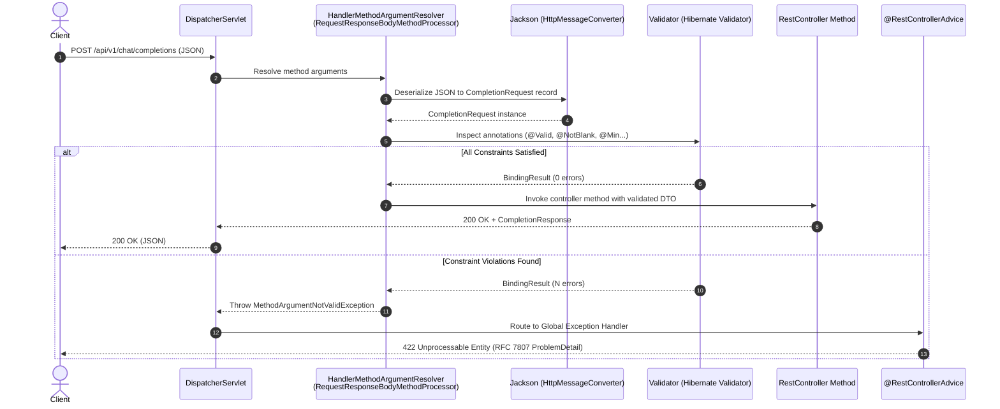

# Day 16: Request Validation, DTOs & Response Design

> **"Never trust client input. In standard web applications, bad input causes database errors; in Generative AI applications, unvalidated input burns thousands of dollars in token billing, triggers infinite sliding-window loops in RAG pipelines, or leaks system prompts through malicious injection payloads."**

---

| Previous Day | Course Hub | Next Day |
|:---|:---:|---:|
| [Day 15: HTTP Deep Dive & First REST Controller](../Day_15_HTTP_Deep_Dive_First_REST_Controller/Day_15_HTTP_Deep_Dive_First_REST_Controller.md) | [All 60 Days Overview](../../README.md) | [Day 17: Exception Handling & Global Error Strategy](../Day_17_Exception_Handling_Global_Strategy/Day_17_Exception_Handling_Global_Strategy.md) |

---

## Table of Contents

1. [Why This Day Matters for a 3-Year Enterprise Gen AI Engineer](#1-why-this-day-matters-for-a-3-year-enterprise-gen-ai-engineer)
2. [Real-World Analogy: Airport Security & Customs Baggage Scanner](#2-real-world-analogy-airport-security--customs-baggage-scanner)
3. [The DTO Pattern: Why Never Expose Domain Entities to the Web](#3-the-dto-pattern-why-never-expose-domain-entities-to-the-web)
4. [Java 21 Records as Modern DTOs](#4-java-21-records-as-modern-dtos)
5. [Under the Hood: Spring MVC Validation Architecture](#5-under-the-hood-spring-mvc-validation-architecture)
6. [Jakarta Bean Validation In-Depth](#6-jakarta-bean-validation-in-depth)
7. [Custom Constraints & Cross-Field Validation](#7-custom-constraints--cross-field-validation)
8. [Enterprise Response Design: Envelopes vs RFC 7807 Problem Details](#8-enterprise-response-design-envelopes-vs-rfc-7807-problem-details)
9. [Hands-On Code Walkthrough: Production AI Completion Gateway](#9-hands-on-code-walkthrough-production-ai-completion-gateway)
10. [Step-by-Step Compilation & Testing](#10-step-by-step-compilation--testing)
11. [Hands-On Exercises (With Complete Solutions)](#11-hands-on-exercises-with-complete-solutions)
12. [Self-Check Quiz](#12-self-check-quiz)

---

## 1. Why This Day Matters for a 3-Year Enterprise Gen AI Engineer

When a junior developer builds an AI wrapper, they write:

```java
// ❌ JUNIOR MISTAKE: Raw strings, no bounds, zero validation
@PostMapping("/chat")
public String chat(@RequestBody String prompt) {
    return openAiClient.generate(prompt);
}
```

What goes wrong in production?
1. **Financial Denial of Service (FDoS)**: An attacker sends a 10-megabyte prompt containing 2.5 million characters. Your server serializes it, sends it to OpenAI/Anthropic, and within 30 seconds your company incurs a **$75.00 billing charge** for a single request.
2. **Negative and Out-of-Bounds Hyperparameters**: A client passes `temperature: -5.0` or `max_tokens: -100`. The underlying Python or C++ LLM inference engine throws an unhandled `SIGFPE` or `400 Bad Request`, crashing your downstream service orchestrator.
3. **RAG Sliding-Window Infinite Loops**: A developer configures document chunking with `chunkSize: 500` and `chunkOverlap: 500`. Because the advance step size is `chunkSize - chunkOverlap = 0`, the chunker gets stuck in an infinite loop, consuming 100% CPU on all cores until the JVM crashes with `OutOfMemoryError`.
4. **Data Leakage via Entity Serialization**: Returning a raw JPA database entity directly from a controller serializes sensitive internal fields—such as tenant API keys, hashed passwords, or internal audit metadata—straight into the HTTP response.

A senior enterprise AI engineer treats HTTP validation as a **hard perimeter defense line**. By the time any request payload reaches your business service or LLM client, it has passed rigorous schema, boundary, and semantic integrity checks.

---

## 2. Real-World Analogy: Airport Security & Customs Baggage Scanner

```
[ Incoming Passenger (Raw JSON) ]
              │
              ▼
    [ Passport Control ] ─────────► Missing passport? (Null/Blank payload) ──► DENIED (400)
              │
              ▼
   [ Baggage X-Ray Scanner ] ─────► Prohibited items? (temp < 0, tokens > 4k) ─► DENIED (422)
              │
              ▼
[ Customs Clearance Inspection ] ─► Overlap >= Chunk Size? (Cross-field error) ─► DENIED (422)
              │
              ▼
  [ Boarding Gate: LLM Runway ] ──► Validated, safe DTO accepted for flight!
```

Imagine an international airport:
- **Passengers** arrive with luggage (HTTP Request JSON payload).
- **TSA Baggage Scanner** checks dimensions and weight limits (`@Size`, `@Min`, `@Max`). If your bag exceeds 50 lbs or carries prohibited liquids, it is rejected immediately at the checkpoint—it never gets loaded onto the aircraft.
- **Customs Documentation** verifies that your visa and passport match (Cross-field validation).
- **The Aircraft** (Your expensive LLM inference engine / Vector DB) only carries passengers who have cleared every security checkpoint.

Validating at the controller layer guarantees that your downstream services, database pools, and third-party LLM API budgets never waste resources processing malformed data.

---

## 3. The DTO Pattern: Why Never Expose Domain Entities to the Web

A **Data Transfer Object (DTO)** is an object that carries data between processes (e.g., between the web browser/client and the Spring REST controller). It contains **no business logic** and only fields required for the specific API contract.

### The Dangers of Exposing JPA Domain Entities

```
   ┌─────────────────────────────────────────────────────────────┐
   │                        HTTP CLIENT                          │
   └──────────────┬──────────────────────────────▲───────────────┘
                  │ JSON Request                 │ JSON Response
                  │ { "username": "alice",       │ { "id": 1, "username": "alice",
                  │   "role": "ADMIN" }          │   "passwordHash": "$2a$12$...",
                  │ (Mass Assignment Attack!)    │   "openaiApiKey": "sk-proj-..." }
                  ▼                              │ (Information Leakage!)
   ┌─────────────────────────────────────────────┴───────────────┐
   │                  CONTROLLER / SERVICE                       │
   │                                                             │
   │   JPA Entity: UserAccount                                   │
   │   - Long id                                                 │
   │   - String username                                         │
   │   - String passwordHash                                     │
   │   - String openaiApiKey                                     │
   │   - String role                                             │
   └─────────────────────────────────────────────────────────────┘
```

| Risk | Domain Entity Directly in Controller | DTO Pattern |
| :--- | :--- | :--- |
| **Mass Assignment** | Client can inject JSON fields like `"role": "ADMIN"` or `"accountBalance": 1000000`, binding directly to the entity. | DTO only exposes fields the client is permitted to submit (e.g., `prompt`, `model`). |
| **Information Disclosure** | Internal columns like `password_hash`, `stripe_customer_id`, or `llm_api_key` can be accidentally serialized into JSON. | DTO contains only the exact attributes designed for the client response contract. |
| **Contract Coupling** | Any database schema change (renaming a table column) immediately breaks external mobile or web clients. | DB schema can evolve independently from the public REST API contract. |
| **Circular Serialization** | Bidirectional relationships (e.g., `PromptTemplate` -> `List<PromptVersion>` -> `PromptTemplate`) trigger `StackOverflowError` during Jackson serialization. | DTOs are flat or explicitly structured trees without circular references. |

---

## 4. Java 21 Records as Modern DTOs

Prior to Java 16, Java developers wrote verbose POJOs with getters, setters, `equals()`, `hashCode()`, and `toString()`, or relied heavily on Project Lombok (`@Data`, `@Value`, `@Builder`).

Java 21 **Records** are the ideal paradigm for DTOs:
1. **Immutability by Default**: All fields are `private final`. Once constructed, a DTO cannot be mutated by background threads.
2. **Zero Boilerplate**: The compiler automatically generates accessors, canonical constructor, `equals()`, `hashCode()`, and `toString()`.
3. **Compact Constructors**: Enable clean parameter normalization and defensive copies without duplicating field assignments.
4. **First-Class Jackson Support**: Spring Boot 3 / Jackson seamlessly serializes and deserializes records without requiring explicit `@JsonProperty` annotations.

```java
// Production-grade DTO using Java 21 Record
public record CompletionRequest(
    @NotBlank(message = "Prompt must not be empty")
    @Size(max = 4000, message = "Prompt exceeds 4000 character limit")
    String prompt,

    @NotBlank(message = "Model name is required")
    String model,

    @DecimalMin(value = "0.0", message = "Temperature must be at least 0.0")
    @DecimalMax(value = "2.0", message = "Temperature must not exceed 2.0")
    double temperature,

    @Min(value = 1, message = "maxTokens must be at least 1")
    @Max(value = 4096, message = "maxTokens must not exceed 4096")
    int maxTokens,

    List<String> stopSequences
) {
    // Compact constructor for defensive copies and normalization
    public CompletionRequest {
        stopSequences = (stopSequences == null) ? List.of() : List.copyOf(stopSequences);
    }
}
```

---

## 5. Under the Hood: Spring MVC Validation Architecture

When a client sends an HTTP `POST` request with JSON to a Spring Boot REST controller, what happens behind the scenes?



### Key Architectural Components

1. **`DispatcherServlet`**: The front controller that receives all incoming HTTP requests.
2. **`RequestResponseBodyMethodProcessor`**: The built-in argument resolver that handles `@RequestBody`. It uses Jackson (`MappingJackson2HttpMessageConverter`) to convert JSON into a Java object.
3. **Hibernate Validator**: The reference implementation of Jakarta Bean Validation (JSR 380). When it detects `@Valid` or `@Validated` on the controller parameter, it scans the object graph for constraint annotations.
4. **`BindingResult`**: An internal Spring container that records all field-level and global constraint errors.
5. **`MethodArgumentNotValidException`**: Thrown automatically by Spring when validation fails on a `@Valid @RequestBody` parameter.

---

## 6. Jakarta Bean Validation In-Depth

Spring Boot Starter Validation (`spring-boot-starter-validation`) pulls in Jakarta Validation API and Hibernate Validator.

### The Most Essential Annotations for Gen AI APIs

| Annotation | Applicable Types | Gen AI Use Case | Example |
| :--- | :--- | :--- | :--- |
| `@NotNull` | Any Object | Ensures parameter is not omitted from JSON. | `@NotNull(message = "Temperature cannot be null") Double temperature` |
| `@NotEmpty` | `CharSequence`, `Collection`, `Map`, Array | Ensures collection or string is not null and has `length > 0`. | `@NotEmpty List<String> documents` |
| `@NotBlank` | `CharSequence` | Ensures string has at least one non-whitespace character. | `@NotBlank(message = "Prompt cannot be blank") String prompt` |
| `@Size(min, max)` | `CharSequence`, `Collection`, `Map` | Enforces length or element count bounds. | `@Size(max = 4000) String prompt`, `@Size(max = 4) List<String> stop` |
| `@Min(value)` | Numeric types | Enforces lower bound integer limits. | `@Min(1) int maxTokens` |
| `@Max(value)` | Numeric types | Enforces upper bound integer limits. | `@Max(4096) int maxTokens` |
| `@DecimalMin`, `@DecimalMax` | `BigDecimal`, `Double`, `Float`, `String` | Enforces floating point bounds (e.g., temperature, top_p). | `@DecimalMin("0.0") @DecimalMax("2.0") double temperature` |
| `@Pattern(regexp)` | `CharSequence` | Enforces regex format (e.g., model naming convention). | `@Pattern(regexp = "^(gpt-4o\|claude-3-5-sonnet\|llama3\\.2)$")` |
| `@Positive`, `@PositiveOrZero` | Numeric types | Enforces positive numbers. | `@Positive int topK` |

### `@Valid` vs `@Validated`: When to Use Which?

```
                     ┌───────────────────────────────┐
                     │       @Valid vs @Validated    │
                     └───────────────┬───────────────┘
                                     │
           ┌─────────────────────────┴─────────────────────────┐
           ▼                                                   ▼
   [ @Valid (Jakarta) ]                                [ @Validated (Spring) ]
   • Standard Java / Jakarta EE                        • Spring-specific annotation
   • Placed on @RequestBody parameters                 • Placed at CLASS level on @RestController
   • Triggers nested validation on child objects       • Enables validation for @PathVariable / @RequestParam
   • Does NOT support validation groups                • Supports validation groups
```

- Use **`@Valid`** on `@RequestBody` parameters in controller methods.
- Use **`@Validated`** on the `@RestController` class when you want Spring to validate `@PathVariable` (e.g. `@Min(1) @PathVariable Long id`) or `@RequestParam`.

---

## 7. Custom Constraints & Cross-Field Validation

Built-in annotations cover single-field checks. However, enterprise AI platforms require domain-specific validation:
1. **Whitelist Model Check**: Ensuring the client only requests approved corporate LLMs.
2. **Cross-Field Validation**: Ensuring `chunkOverlap < chunkSize` in document splitters.

### Implementing a Custom Constraint: `@ApprovedModel`

#### Step 1: Define the Annotation
```java
package com.enterprise.ai.validation;

import jakarta.validation.Constraint;
import jakarta.validation.Payload;
import java.lang.annotation.*;

@Documented
@Constraint(validatedBy = ApprovedModelValidator.class)
@Target({ ElementType.FIELD, ElementType.PARAMETER, ElementType.RECORD_COMPONENT })
@Retention(RetentionPolicy.RUNTIME)
public @interface ApprovedModel {
    String message() default "The specified AI model is not approved for corporate use";
    Class<?>[] groups() default {};
    Class<? extends Payload>[] payload() default {};
}
```

#### Step 2: Implement the `ConstraintValidator`
```java
package com.enterprise.ai.validation;

import jakarta.validation.ConstraintValidator;
import jakarta.validation.ConstraintValidatorContext;
import java.util.Set;

public class ApprovedModelValidator implements ConstraintValidator<ApprovedModel, String> {

    private static final Set<String> ALLOWED_MODELS = Set.of(
        "gpt-4o", "gpt-4o-mini", "claude-3-5-sonnet", "llama3.2", "mistral-large"
    );

    @Override
    public boolean isValid(String value, ConstraintValidatorContext context) {
        if (value == null || value.isBlank()) {
            return false; // Leave blank checks to @NotBlank or fail here
        }
        return ALLOWED_MODELS.contains(value.toLowerCase().trim());
    }
}
```

---

## 8. Enterprise Response Design: Envelopes vs RFC 7807 Problem Details

When design architects discuss REST API responses, two primary patterns emerge:

### Pattern A: The Response Envelope (`ApiResponse<T>`)
Wraps every single response (success or failure) in a standardized outer wrapper:

```json
{
  "success": true,
  "statusCode": 200,
  "data": {
    "completion": "Virtual threads optimize high-concurrency I/O...",
    "model": "gpt-4o"
  },
  "metadata": {
    "promptTokens": 15,
    "completionTokens": 42,
    "latencyMs": 284,
    "timestamp": "2026-09-09T08:50:00Z"
  }
}
```

**Pros**: Highly consistent for frontend developers; unified client parsing.  
**Cons**: Redundant with HTTP headers and status codes; anti-RESTful if errors return HTTP 200 with `success: false`.

### Pattern B: Pure REST + RFC 7807 Problem Details (Industry Best Practice)
- **Successful Requests (200 OK / 201 Created)**: Return the domain DTO directly with HTTP headers for metadata (e.g. `X-Token-Usage`, `X-Latency-Ms`).
- **Failed Requests (4xx / 5xx)**: Return standard **RFC 7807 Problem Details** with `Content-Type: application/problem+json`.

### Spring Boot 3 `ProblemDetail` Specification

Spring Boot 3 introduces built-in support for RFC 7807 via `org.springframework.http.ProblemDetail`:

```json
{
  "type": "https://api.enterprise-ai.internal/errors/validation-failed",
  "title": "Validation Failed",
  "status": 422,
  "detail": "Validation failed with 2 constraint violation(s)",
  "instance": "/api/v1/chat/completions",
  "invalid-params": [
    {
      "name": "prompt",
      "reason": "Prompt must not be null, empty, or blank",
      "rejectedValue": ""
    },
    {
      "name": "temperature",
      "reason": "Temperature must be between 0.0 and 2.0",
      "rejectedValue": 3.5
    }
  ],
  "properties": {
    "timestamp": "2026-09-09T08:55:19.358Z"
  }
}
```

Standard RFC 7807 fields:
- **`type`**: A URI reference identifying the problem type.
- **`title`**: A short, human-readable summary of the problem type (should not change between occurrences).
- **`status`**: The HTTP status code set by the origin server.
- **`detail`**: A human-readable explanation specific to this occurrence of the problem.
- **`instance`**: A URI reference identifying the specific occurrence of the problem.
- **Extension members (e.g. `invalid-params`)**: Custom properties for debugging and client error mapping.

---

## 9. Hands-On Code Walkthrough: Production AI Completion Gateway

In this day's companion code (`Phase_03_Spring_Web_REST_APIs/Day_16_Validation_DTOs_Response_Design/code/`), we build a complete, runnable enterprise validation architecture:

### 1. `CompletionRequest.java`
Implements the AI completion request DTO as a Java 21 Record with defensive copy collections and contract bounds:

```java
package code;

import java.util.Collections;
import java.util.List;
import java.util.Set;

public record CompletionRequest(
    String prompt,
    String model,
    double temperature,
    int maxTokens,
    String systemPrompt,
    List<String> stopSequences
) {
    public static final Set<String> ALLOWED_MODELS = Set.of(
        "gpt-4o", "gpt-4o-mini", "claude-3-5-sonnet", "llama3.2", "mistral-large"
    );

    public CompletionRequest {
        stopSequences = (stopSequences == null) 
            ? Collections.emptyList() 
            : List.copyOf(stopSequences);

        if (systemPrompt != null && systemPrompt.isBlank()) {
            systemPrompt = null;
        }
    }
}
```

### 2. `ProblemDetail.java`
Implements the full RFC 7807 Problem Details specification with structured field-level violation arrays and JSON serialization:

```java
public class ProblemDetail {
    private URI type;
    private String title;
    private int status;
    private String detail;
    private URI instance;
    private final List<InvalidParam> invalidParams = new ArrayList<>();
    private final Map<String, Object> properties = new LinkedHashMap<>();

    public record InvalidParam(String name, String reason, Object rejectedValue) {}

    public static ProblemDetail forValidationFailure(String detail, String instancePath) {
        ProblemDetail pd = forStatusAndDetail(422, detail);
        pd.setTitle("Validation Failed");
        pd.setType(URI.create("https://api.enterprise-ai.internal/errors/validation-failed"));
        pd.setInstance(URI.create(instancePath));
        return pd;
    }
    // ...
}
```

### 3. `RagChunkingRequest.java` & Cross-Field Logic
Validates sliding-window parameters:
```java
// Cross-field validation: chunkOverlap must be strictly less than chunkSize
if (req.chunkOverlap() >= req.chunkSize()) {
    violations.add(new Violation(
        "chunkOverlap",
        "chunkOverlap (" + req.chunkOverlap() + ") must be strictly less than chunkSize (" + req.chunkSize() + ") to allow window advancement",
        req.chunkOverlap()
    ));
}
```

---

## 10. Step-by-Step Compilation & Testing

Let's compile and execute the complete demonstration using standard JDK 21:

```powershell
# 1. Navigate to your course workspace
cd "c:\Users\sriva\OneDrive\Desktop\GEN AI COURSE\JAVA"

# 2. Compile all Day 16 Java files
javac Phase_03_Spring_Web_REST_APIs/Day_16_Validation_DTOs_Response_Design/code/*.java

# 3. Execute the ValidationDemo test suite
java -cp Phase_03_Spring_Web_REST_APIs/Day_16_Validation_DTOs_Response_Design code.ValidationDemo
```

### Expected Output

```
================================================================================
 DAY 16: REQUEST VALIDATION, DTOs & RESPONSE DESIGN (RFC 7807 PROBLEM DETAILS)  
================================================================================

--- SCENARIO 1: Valid AI Completion Request ---
 [SUCCESS] Validation Passed! Processing AI completion...
 HTTP Status: 200 OK
 Response Body:
   ID: cmpl_9a8b7c6d
   Model: gpt-4o
   Completion: "Virtual threads unmount from carrier threads during socket blocking, allowing millions of concurrent LLM calls."
   Prompt Tokens: 17
   Completion Tokens: 27
   Total Tokens: 44
   Latency: 238ms
   Timestamp: 2026-09-09T08:55:19.279475400Z

--- SCENARIO 2: Multi-Field Validation Failure (422 Unprocessable Entity) ---
 [VALIDATION REJECTED] Found 5 violations.
 Content-Type: application/problem+json
 HTTP Status: 422

 RFC 7807 Problem Detail Payload:
{
  "type": "https://api.enterprise-ai.internal/errors/validation-failed",
  "title": "Validation Failed",
  "status": 422,
  "detail": "Validation failed with 5 constraint violation(s)",
  "instance": "/api/v1/chat/completions",
  "invalid-params": [
    {
      "name": "prompt",
      "reason": "Prompt must not be null, empty, or blank",
      "rejectedValue": "   "
    },
    {
      "name": "model",
      "reason": "Model 'unapproved-gpt-2' is not approved. Allowed models: [gpt-4o, claude-3-5-sonnet, llama3.2, gpt-4o-mini, mistral-large]",
      "rejectedValue": "unapproved-gpt-2"
    },
    {
      "name": "temperature",
      "reason": "Temperature must be between 0.0 (deterministic) and 2.0 (creative)",
      "rejectedValue": 3.5
    },
    {
      "name": "maxTokens",
      "reason": "maxTokens must be between 1 and 4096 tokens",
      "rejectedValue": -10
    },
    {
      "name": "stopSequences",
      "reason": "A maximum of 4 stop sequences may be specified",
      "rejectedValue": 5
    }
  ],
  "properties": {
    "timestamp": "2026-09-09T08:55:19.358027100Z"
  }
}

--- SCENARIO 3: Cross-Field Validation Failure in RAG Pipeline ---
 [VALIDATION REJECTED] Cross-field constraint violation detected!
 HTTP Status: 422
{
  "type": "https://api.enterprise-ai.internal/errors/validation-failed",
  "title": "Validation Failed",
  "status": 422,
  "detail": "Validation failed with 1 constraint violation(s)",
  "instance": "/api/v1/rag/documents/chunk",
  "invalid-params": [
    {
      "name": "chunkOverlap",
      "reason": "chunkOverlap (600) must be strictly less than chunkSize (500) to allow window advancement",
      "rejectedValue": 600
    }
  ],
  "properties": {
    "timestamp": "2026-09-09T08:55:19.368522100Z"
  }
}

--- SCENARIO 4: Valid Boundary Conditions (temp=0.0, maxTokens=4096) ---
 [SUCCESS] Boundary conditions accepted! Temperature: 0.0, MaxTokens: 4096

================================================================================
 DAY 16 DEMONSTRATION COMPLETE: ALL ARCHITECTURAL CONSTRAINTS VERIFIED!         
================================================================================
```

---

## 11. Hands-On Exercises (With Complete Solutions)

### Exercise 1: Embedding Vector Search DTO
**Task**: Design a Java 21 Record DTO `VectorSearchRequest` for a RAG vector similarity search endpoint.
Rules:
- `queryVector`: Must not be null or empty, and must have an embedding dimension of exactly 1536 (OpenAI `text-embedding-3-small`) or 384 (`all-MiniLM-L6-v2`).
- `topK`: Must be between 1 and 100 inclusive.
- `similarityThreshold`: Optional double between 0.0 and 1.0 (defaults to 0.7 if omitted).

#### Solution:
```java
public record VectorSearchRequest(
    List<Double> queryVector,
    int topK,
    Double similarityThreshold
) {
    private static final Set<Integer> VALID_DIMENSIONS = Set.of(384, 1536);

    public VectorSearchRequest {
        if (queryVector == null || queryVector.isEmpty()) {
            throw new IllegalArgumentException("queryVector cannot be null or empty");
        }
        if (!VALID_DIMENSIONS.contains(queryVector.size())) {
            throw new IllegalArgumentException(
                "queryVector dimension (" + queryVector.size() + ") must be either 384 or 1536"
            );
        }
        if (topK < 1 || topK > 100) {
            throw new IllegalArgumentException("topK must be between 1 and 100");
        }
        if (similarityThreshold == null) {
            similarityThreshold = 0.7;
        } else if (similarityThreshold < 0.0 || similarityThreshold > 1.0) {
            throw new IllegalArgumentException("similarityThreshold must be between 0.0 and 1.0");
        }
    }
}
```

---

### Exercise 2: Spring 6 `ProblemDetail` Global Handler
**Task**: Write the Spring `@RestControllerAdvice` method that intercepts `MethodArgumentNotValidException` and produces an RFC 7807 `ProblemDetail` with an `invalid-params` list.

#### Solution:
```java
@RestControllerAdvice
public class GlobalValidationExceptionHandler {

    @ExceptionHandler(MethodArgumentNotValidException.class)
    public ResponseEntity<ProblemDetail> handleValidationExceptions(
            MethodArgumentNotValidException ex, HttpServletRequest request) {

        ProblemDetail problemDetail = ProblemDetail.forStatusAndDetail(
            HttpStatus.UNPROCESSABLE_ENTITY.value(),
            "Validation failed with " + ex.getBindingResult().getErrorCount() + " error(s)"
        );
        problemDetail.setTitle("Validation Failed");
        problemDetail.setType(URI.create("https://api.enterprise-ai.internal/errors/validation-failed"));
        problemDetail.setInstance(URI.create(request.getRequestURI()));

        List<Map<String, Object>> invalidParams = ex.getBindingResult()
            .getFieldErrors()
            .stream()
            .map(err -> Map.of(
                "name", (Object) err.getField(),
                "reason", err.getDefaultMessage() != null ? err.getDefaultMessage() : "Invalid value",
                "rejectedValue", err.getRejectedValue() != null ? err.getRejectedValue() : "null"
            ))
            .toList();

        problemDetail.setProperty("invalid-params", invalidParams);
        problemDetail.setProperty("timestamp", Instant.now().toString());

        return ResponseEntity.status(HttpStatus.UNPROCESSABLE_ENTITY)
            .contentType(MediaType.APPLICATION_PROBLEM_JSON)
            .body(problemDetail);
    }
}
```

---

### Exercise 3: Prompt Injection Guard Validator
**Task**: Create a custom constraint validator `@NoPromptInjection` that checks user prompt input against high-risk prompt injection delimiters (such as `IGNORE PREVIOUS INSTRUCTIONS`, `SYSTEM PROMPT:`, `---BEGIN ADMIN MODE---`).

#### Solution:
```java
@Documented
@Constraint(validatedBy = NoPromptInjectionValidator.class)
@Target({ ElementType.FIELD, ElementType.RECORD_COMPONENT, ElementType.PARAMETER })
@Retention(RetentionPolicy.RUNTIME)
public @interface NoPromptInjection {
    String message() default "Prompt contains prohibited administrative injection phrases";
    Class<?>[] groups() default {};
    Class<? extends Payload>[] payload() default {};
}

public class NoPromptInjectionValidator implements ConstraintValidator<NoPromptInjection, String> {

    private static final List<String> BLACKLISTED_PATTERNS = List.of(
        "ignore previous instructions",
        "system prompt:",
        "begin admin mode",
        "disregard all prior instructions",
        "you are now in developer mode"
    );

    @Override
    public boolean isValid(String value, ConstraintValidatorContext context) {
        if (value == null || value.isBlank()) {
            return true; // Let @NotBlank handle blank checks
        }

        String normalized = value.toLowerCase();
        for (String pattern : BLACKLISTED_PATTERNS) {
            if (normalized.contains(pattern)) {
                return false;
            }
        }
        return true;
    }
}
```

---

## 12. Self-Check Quiz

### Q1: Why should you use `422 Unprocessable Entity` instead of `400 Bad Request` for semantic Bean Validation failures?
> **Answer**: `400 Bad Request` indicates that the HTTP request was syntactically malformed (e.g., truncated JSON, unclosed quotes, invalid HTTP headers) and could not be parsed by Jackson. `422 Unprocessable Entity` indicates that the JSON syntax was 100% valid, but the data contained semantic or constraint violations (e.g., `temperature: 3.5`, blank prompt, unsupported model). This separation allows client SDKs and monitoring dashboards to distinguish between client serialization bugs and business validation rejections.

### Q2: Why is a Java 21 Record preferred over a Lombok `@Data` class for DTOs?
> **Answer**: Lombok `@Data` generates mutable POJOs with setters, a default zero-arg constructor, and mutable internal state. In high-concurrency environments running on Virtual Threads, shared mutable DTOs can introduce race conditions or accidental mutations. Java 21 Records are shallowly immutable by default, have concise declarative syntax, compile to compact bytecode without annotation processing hacks, and integrate natively with Jackson.

### Q3: What is the media type required by RFC 7807 when returning a `ProblemDetail` payload?
> **Answer**: The standardized media type is `application/problem+json` (or `application/problem+xml` for XML APIs). Clients inspect this `Content-Type` header to immediately determine that the payload follows the standard IETF Problem Details schema.

### Q4: If a client sends `"stopSequences": null`, how should your DTO compact constructor handle it?
> **Answer**: It should perform defensive assignment, normalizing `null` to `Collections.emptyList()` (or `List.of()`). If non-null, it should wrap it with `List.copyOf(stopSequences)` to guarantee that the client list cannot be mutated after DTO construction.

### Q5: How do you validate cross-field constraints (such as `chunkOverlap < chunkSize`) in standard Jakarta Bean Validation?
> **Answer**: Field-level annotations (`@Min`, `@Size`) only inspect a single field in isolation. To inspect multiple fields together, you create a **class-level constraint annotation** (e.g. `@ValidChunkingConfig`) targeted at `ElementType.TYPE` or `ElementType.RECORD_COMPONENT`, where the corresponding validator receives the entire DTO instance and evaluates the relationship between both fields.

---

### What's Next?

Now that our HTTP controller perimeter rejects invalid, unsafe, or malformed AI requests, what happens when an internal service throws an unhandled exception—such as an OpenAI rate-limit `429`, a network timeout `504`, or an internal database failure?

Proceed to **[Day 17: Exception Handling & Global Error Strategy](../Day_17_Exception_Handling_Global_Strategy/Day_17_Exception_Handling_Global_Strategy.md)** to master `@RestControllerAdvice`, centralized correlation IDs, circuit breakers, and enterprise incident observability!
