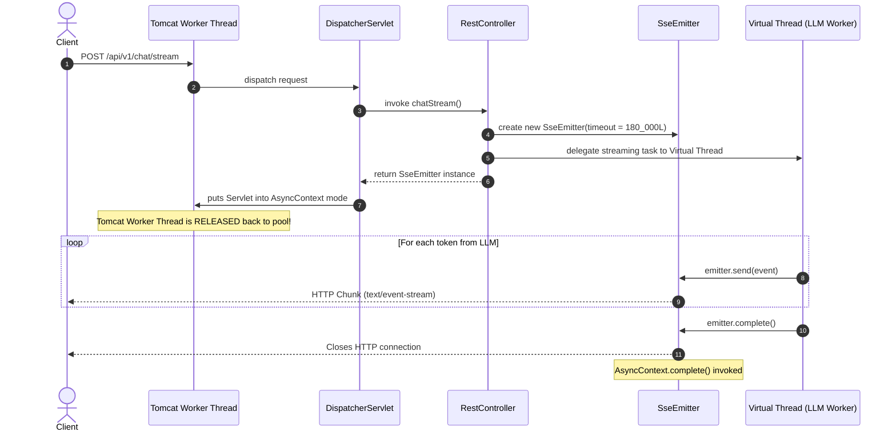

# Day 18: Async APIs, Streaming & Server-Sent Events (SSE)

Hey friend! Welcome to Day 18. Today we're learning how to build one of the most delightful, modern features in all of AI engineering: **Real-Time Token Streaming with Server-Sent Events (SSE)**!

You know how when you use ChatGPT, you don't stare at a blank white screen waiting for 30 seconds? Instead, words start appearing on your screen within 300 milliseconds, typing out smoothly line by line. 

If an AI takes 30 seconds to answer a complex question, waiting for the whole response feels like an eternity. But streaming words live drops the perceived waiting time down to just a fraction of a second! Today, we're going to build that exact real-time streaming experience in Spring Boot using Java 21 Virtual Threads and `SseEmitter`.

---

| Previous Day | Course Hub | Next Day |
|:---|:---:|---:|
| [Day 17: Exception Handling & Global Error Strategy](../Day_17_Exception_Handling_Global_Strategy/Day_17_Exception_Handling_Global_Strategy.md) | [All 60 Days Overview](../../README.md) | [Day 19: API Documentation & OpenAPI](../Day_19_API_Documentation_OpenAPI/Day_19_API_Documentation_OpenAPI.md) |

---

## 📌 What Will You Learn Today?

Today, you and I will master:
- **Why LLMs Demand Streaming**: Understanding how models create words one by one and why holding them back ruins user experience.
- **The W3C Server-Sent Events Protocol**: How the lightweight `text/event-stream` header keeps a connection open to push words to web clients.
- **Spring MVC's `SseEmitter`**: How Spring Boot lets you stream text chunks asynchronously without blocking server threads.
- **Virtual Threads + Streaming**: How Java 21 lets a single server stream AI text to 10,000 users simultaneously with minimal RAM.
- **Production Pitfalls**: Solving reverse proxy timeouts (ALB, NGINX) with heartbeat pings and canceling background work when users close their browser tab.

---

> 💡 **New Word Alert: Streaming Terms Demystified**
>
> 1. **SSE (Server-Sent Events)**: A standard web protocol where the server sends an HTTP header (`Content-Type: text/event-stream`) and keeps the line open, pushing new text chunks down to the browser as soon as they are ready.
> 2. **TTFT (Time-To-First-Token)**: The tiny fraction of a second before the first word shows up on screen. Lower TTFT makes your application feel lightning fast!
> 3. **`SseEmitter`**: The Spring MVC class that holds an open streaming connection to a browser. Whenever a new word is generated, you call `emitter.send("word")`.
> 4. **Heartbeat (Keep-Alive)**: Sending an empty comment (like `:\n\n`) every 15 seconds to remind cloud firewalls and reverse proxies: *"Hey, we're still talking, don't hang up on us!"*
> 5. **Client Disconnect**: When a user closes their browser tab mid-sentence. We use callbacks like `emitter.onCompletion()` and `emitter.onTimeout()` so our server stops generating tokens and frees up resources immediately.

---

## Table of Contents

1. [Why This Day Matters for a 3-Year Enterprise Gen AI Engineer](#1-why-this-day-matters-for-a-3-year-enterprise-gen-ai-engineer)
2. [Real-World Analogy: Morse Code Telegraph vs Bound Encyclopedias](#2-real-world-analogy-morse-code-telegraph-vs-bound-encyclopedias)
3. [The Physics of LLM Inference: Why Auto-Regressive Decoding Demands Streaming](#3-the-physics-of-llm-inference-why-auto-regressive-decoding-demands-streaming)
4. [The W3C Server-Sent Events (SSE) Wire Protocol Specification](#4-the-w3c-server-sent-events-sse-wire-protocol-specification)
5. [Spring MVC Async Architecture: `SseEmitter` & `AsyncContext`](#5-spring-mvc-async-architecture-sseemitter--asynccontext)
6. [Virtual Threads: Solving the SSE Thread Starvation Problem](#6-virtual-threads-solving-the-sse-thread-starvation-problem)
7. [Enterprise Production Pitfalls & Hardening](#7-enterprise-production-pitfalls--hardening)
   - [Reverse Proxy Idle Timeouts (AWS ALB, NGINX, Cloudflare)](#reverse-proxy-idle-timeouts)
   - [Client Disconnects & Leaked AI Workers](#client-disconnects--leaked-ai-workers)
8. [Frontend Consumption: `fetch-event-source` vs Native `EventSource`](#8-frontend-consumption-fetch-event-source-vs-native-eventsource)
9. [Hands-On Code Walkthrough](#9-hands-on-code-walkthrough)
10. [Step-by-Step Compilation & Execution](#10-step-by-step-compilation--execution)
11. [Hands-On Exercises (With Complete Solutions)](#11-hands-on-exercises-with-complete-solutions)
12. [Self-Check Quiz](#12-self-check-quiz)

---

## 1. Why This Day Matters for a 3-Year Enterprise Gen AI Engineer

Traditional web applications operate on a **request-response batch model**:
```
Client:  "Give me user profile #42"
Server:  [Reads SQL DB: 15ms]
Server:  Returns 200 OK + JSON payload
```

Large Language Models (LLMs) operate fundamentally differently:
- A model generating a 1,000-word response might take **25 to 45 seconds** of total GPU compute time.
- If you buffer the entire response on the backend before sending it to the client, the user stares at a frozen spinner for 45 seconds. Most users assume the application is broken and refresh the page, duplicating the GPU load.
- However, the model generates the **first token in ~350 milliseconds** (Time to First Token - **TTFT**) and produces subsequent tokens every **25 to 50 milliseconds**.

By streaming tokens over **Server-Sent Events (SSE)**, the user begins reading the response immediately. To the end user, your AI feels instantaneous, lively, and conversational.

In this lesson, you will master the end-to-end mechanics of real-time streaming in Java 21 and Spring Boot 3 using `SseEmitter`, Virtual Threads, keep-alive heartbeats, and graceful cancellation.

---

## 2. Real-World Analogy: Morse Code Telegraph vs Bound Encyclopedias

```
TRADITIONAL BATCH HTTP:
┌──────────────────┐               [ Wait 3 Weeks... ]               ┌──────────────────┐
│  Client asks:    │ ──────────────────────────────────────────────► │  Printer binds   │
│  "Explain Rome"  │ ◄────────────────────────────────────────────── │  500-page book   │
└──────────────────┘     [ Client receives 10-pound book at once ]   └──────────────────┘

SERVER-SENT EVENTS (SSE) STREAMING:
┌──────────────────┐                                                 ┌──────────────────┐
│  Client asks:    │ ──────────────────────────────────────────────► │ Telegraph        │
│  "Explain Rome"  │                                                 │ Operator         │
│                  │ ◄─── "Rome " (300ms) ────────────────────────── │                  │
│                  │ ◄─── "was " (340ms) ─────────────────────────── │                  │
│                  │ ◄─── "not " (380ms) ─────────────────────────── │                  │
│                  │ ◄─── "built " (420ms) ───────────────────────── │                  │
│                  │ ◄─── "in " (460ms) ──────────────────────────── │                  │
│                  │ ◄─── "a " (500ms) ───────────────────────────── │                  │
│                  │ ◄─── "day." (540ms) ─────────────────────────── │                  │
│                  │ ◄─── [done] (580ms) ─────────────────────────── │                  │
└──────────────────┘                                                 └──────────────────┘
```

Traditional HTTP is like ordering a 500-page encyclopedia by postal mail: you cannot read a single word until the entire volume has been bound, boxed, shipped, and delivered to your doorstep.

Server-Sent Events is like sitting beside a telegraph operator tapping out words in Morse code: you read each word the millisecond it comes across the wire.

---

## 🧭 The Plain English Bridge: How ChatGPT Streams Words in Spring Boot

If you've only built standard REST APIs where a method returns an object and ends, streaming requires understanding that **HTTP can stay open**:

| Streaming Concept | Traditional REST API | Server-Sent Events (SSE) | Plain English Advantage |
| :--- | :--- | :--- | :--- |
| **HTTP Response** | Returns `200 OK` + complete JSON payload, then closes connection. | Sends `Content-Type: text/event-stream`, leaves connection **open**. | Allows server to push new data chunks to the browser continuously. |
| **User Experience** | User waits 30 seconds staring at a frozen spinner. | User sees the first word in **300ms** (TTFT: Time To First Token). | Feels instantaneous and conversational, like ChatGPT. |
| **Spring Class** | Method returns `ResponseEntity<UserDTO>`. | Method returns **`SseEmitter`** or `Flux<String>`. | Call `emitter.send(token)` whenever the AI generates a new word. |
| **Format** | Standard JSON: `{"text": "full reply"}`. | Text lines starting with `data: `: `data: {"word": "Hello"}\n\n`. | Standard browser `EventSource` in JavaScript parses this automatically. |
| **Java 21 Superpower**| Holding 1,000 open connections consumed 1,000 OS threads (OOM crash!). | **Virtual Threads** hold 100,000 open connections with tiny memory overhead! | Scale streaming AI to millions of users on a single server. |

---

## 3. The Physics of LLM Inference: Why Auto-Regressive Decoding Demands Streaming

Modern autoregressive transformers (GPT-4o, Claude 3.5, Llama 3.2) generate text iteratively:

$$P(w_{t} \mid w_{1}, w_{2}, \dots, w_{t-1})$$

1. **Prefill Phase (Prompt Evaluation)**: The model processes the entire prompt in parallel on GPU tensor cores. Latency: ~100ms - 400ms.
2. **Decode Phase (Token Generation)**: The model predicts token $t_1$, appends it to context, runs the forward pass to predict token $t_2$, and repeats this loop one token at a time until an `<|end_of_text|>` token is emitted.

Because the GPU computes one token per step, holding back tokens until generation finishes wastes the user's cognitive processing time. Streaming matches the consumer's reading speed perfectly.

---

## 4. The W3C Server-Sent Events (SSE) Wire Protocol Specification

SSE is an open web standard defined by the W3C and WHATWG. Unlike WebSockets, SSE:
- Runs over standard **HTTP/1.1 or HTTP/2**.
- Is strictly **unidirectional** (Server -> Client).
- Works with standard corporate firewalls, API gateways, and HTTPS certificates without custom protocols.

### Wire Protocol Rules

1. **HTTP Headers**:
   ```http
   HTTP/1.1 200 OK
   Content-Type: text/event-stream;charset=UTF-8
   Cache-Control: no-cache
   Connection: keep-alive
   ```

2. **Event Frame Structure**:
   Each event consists of plain text key-value lines separated by `\n`, terminated by a **double newline** `\n\n`:

   ```
   id: tok_001
   event: token
   data: {"token":"Virtual ","index":1}

   id: tok_002
   event: token
   data: {"token":"Threads ","index":2}

   : heartbeat ping

   id: evt_done
   event: done
   data: {"finishReason":"stop","totalTokens":2}

   ```

| Field | Purpose |
| :--- | :--- |
| **`event:`** | Name of the event type (e.g. `token`, `error`, `done`). Frontend listens via `addEventListener("token", handler)`. |
| **`data:`** | The payload. Can be plain text or serialized JSON. |
| **`id:`** | Optional unique event ID. If disconnected, the browser sends `Last-Event-ID` header to resume. |
| **`:`** | Lines starting with a colon are **comments**. Browsers ignore comments, but network proxies treat them as active traffic! |

---

## 5. Spring MVC Async Architecture: `SseEmitter` & `AsyncContext`

In Spring MVC, how does a controller method return a streaming response without locking up the server?



### The Async Dispatch Lifecycle

1. The controller creates an `SseEmitter` and launches an asynchronous task.
2. The controller **immediately returns** the `SseEmitter` to Spring MVC.
3. Spring puts the underlying HTTP servlet request into **asynchronous mode** via `request.startAsync()`.
4. **The Tomcat worker thread is returned to Tomcat's thread pool immediately!** It is free to serve other incoming requests.
5. The background thread emits tokens to the client over time using `emitter.send()`.
6. When generation finishes, `emitter.complete()` closes the HTTP response.

---

## 6. Virtual Threads: Solving the SSE Thread Starvation Problem

### The Fatal Flaw of Traditional Platform Threads

In traditional Spring Boot (pre-Java 21):
- Tomcat maintains a thread pool of **200 platform threads**.
- If 200 users connect to an SSE endpoint and each stream takes 30 seconds, **all 200 threads are occupied waiting for tokens or holding socket locks**.
- Request #201 is queued. Once the queue fills, your entire Spring Boot server **stops accepting all HTTP traffic**—even lightweight `/health` check endpoints fail!

```
Platform Thread Pool (200 OS Threads):
[Thread 1: SSE User A (30s)]
[Thread 2: SSE User B (45s)]
...
[Thread 200: SSE User Z (25s)]
=============================================
❌ THREAD EXHAUSTION: Server dead for new traffic!
```

### The Java 21 Virtual Thread Solution

With Java 21 and Spring Boot 3 (`spring.threads.virtual.enabled=true`):
- Virtual Threads are lightweight user-mode threads managed by the JVM, costing only **~1 KB of RAM** each.
- When an SSE emitter blocks or sleeps waiting for the next LLM token, the virtual thread **unmounts from its carrier thread**.
- A single machine can easily maintain **50,000 concurrent SSE streams** using less than 200MB of RAM!

---

## 7. Enterprise Production Pitfalls & Hardening

### Reverse Proxy Idle Timeouts

In production, your Spring Boot app sits behind an ingress reverse proxy:
- **AWS Application Load Balancer (ALB)**: Default idle timeout is **60 seconds**.
- **NGINX**: `proxy_read_timeout` default is **60 seconds**.
- **Cloudflare**: Drops HTTP connections after **100 seconds** of no byte transmission.

If a deep reasoning model (such as OpenAI o1 or DeepSeek-R1) pauses for 65 seconds during its "Chain of Thought" deliberation before emitting its first token, **the reverse proxy will abruptly terminate the TCP connection with HTTP 504 Gateway Timeout!**

#### The Fix: Keep-Alive Heartbeats
Send an SSE comment (`: ping\n\n`) every 15 seconds. Comments are invisible to frontend JavaScript event listeners but reset the proxy's idle socket timer:

```java
// Schedule periodic heartbeat comments every 15 seconds
ScheduledExecutorService scheduler = Executors.newSingleThreadScheduledExecutor();
scheduler.scheduleAtFixedRate(() -> {
    try {
        emitter.send(SseEmitter.event().comment("ping"));
    } catch (Exception e) {
        scheduler.shutdown();
    }
}, 15, 15, TimeUnit.SECONDS);
```

---

### Client Disconnects & Leaked AI Workers

What happens when a user closes their browser tab 2 seconds into a 60-second generation?
- The client socket closes (`RST` or `FIN` packet sent).
- If your background generation loop doesn't check connection state, **it will continue calling the LLM API for another 58 seconds**, wasting tokens and money!

#### The Fix: Lifecycle Callbacks & Cancellation Flags

```java
SseEmitter emitter = new SseEmitter(180_000L);
AtomicBoolean isCancelled = new AtomicBoolean(false);

emitter.onCompletion(() -> log.info("SSE completed successfully"));
emitter.onTimeout(() -> {
    log.warn("SSE timed out");
    isCancelled.set(true);
    emitter.complete();
});
emitter.onError(ex -> {
    log.warn("Client disconnected abruptly: {}", ex.getMessage());
    isCancelled.set(true);
});

Thread.startVirtualThread(() -> {
    for (String token : llmTokenStream) {
        if (isCancelled.get()) {
            log.info("Client aborted. Canceling LLM inference job.");
            llmJob.cancel();
            break;
        }
        emitter.send(token);
    }
});
```

---

## 8. Frontend Consumption: `fetch-event-source` vs Native `EventSource`

The browser includes a native `EventSource` API:
```javascript
// ❌ LIMITATIONS OF NATIVE EVENTSOURCE:
// 1. Only supports HTTP GET (cannot send complex JSON body with prompts!)
// 2. Does not support custom Authorization headers (Bearer tokens)
const es = new EventSource('/api/v1/chat/stream');
```

In modern AI applications, use `fetch()` with a `ReadableStreamDefaultReader` or the official `@microsoft/fetch-event-source` library:

```javascript
// ✅ PRODUCTION PATTERN: POST with JSON body and Auth header
const response = await fetch('/api/v1/chat/stream', {
  method: 'POST',
  headers: {
    'Content-Type': 'application/json',
    'Authorization': `Bearer ${accessToken}`
  },
  body: JSON.stringify({
    prompt: "Explain Virtual Threads",
    model: "gpt-4o"
  })
});

const reader = response.body.getReader();
const decoder = new TextDecoder("utf-8");

while (true) {
  const { done, value } = await reader.read();
  if (done) break;
  
  const chunk = decoder.decode(value);
  // Parse lines: id, event, data
  console.log("Received chunk:", chunk);
}
```

---

## 9. Hands-On Code Walkthrough

In this day's companion code (`Phase_03_Spring_Web_REST_APIs/Day_18_Async_Streaming_SSE/code/`), we build:

1. **`SseTokenStreamer.java`**: Implements the official W3C SSE wire protocol:
   - Event formatting (`event:`, `id:`, `data: \n\n`)
   - Keep-alive heartbeat comments (`: ping\n\n`)
   - Atomic completion and thread-safe disconnect state
2. **`LLMTokenGenerator.java`**: Simulates an autoregressive LLM inference engine:
   - Initial `event: start` handshake
   - Simulated reasoning pause with periodic heartbeat pings
   - Token-by-token emission with millisecond delays
   - Final `event: done` with token accounting
3. **`StreamingDemo.java`**: Executable test suite demonstrating:
   - Real-time ChatGPT typewriter streaming
   - Deep reasoning keep-alive heartbeats
   - Early client cancellation and thread abort

---

## 10. Step-by-Step Compilation & Execution

```powershell
# 1. Navigate to course workspace
cd "c:\Users\sriva\OneDrive\Desktop\GEN AI COURSE\JAVA"

# 2. Compile Day 18 code
javac Phase_03_Spring_Web_REST_APIs/Day_18_Async_Streaming_SSE/code/*.java

# 3. Execute the StreamingDemo
java -cp Phase_03_Spring_Web_REST_APIs/Day_18_Async_Streaming_SSE code.StreamingDemo
```

### Verified Output

```
================================================================================
 DAY 18: ASYNC APIS, STREAMING & SERVER-SENT EVENTS (SSE) IN SPRING BOOT        
================================================================================

--- SCENARIO 1: Real-Time ChatGPT Typewriter Stream (text/event-stream) ---
 [CALLBACK] SseEmitter completed successfully.
 Wire Format Received by Browser (Content-Type: text/event-stream):
-----------------------------------------------------------------
id: evt_000
event: start
data: {"model":"gpt-4o","status":"generating"}

id: tok_001
event: token
data: {"token":"Java ","index":1}

id: tok_002
event: token
data: {"token":"21 ","index":2}

id: tok_003
event: token
data: {"token":"Virtual ","index":3}

...

id: evt_done
event: done
data: {"finishReason":"stop","totalTokens":16}

-----------------------------------------------------------------

--- SCENARIO 2: Deep Reasoning Model with Keep-Alive Heartbeats ---
 Wire Output with Heartbeat Comments (Keeps ALB/Cloudflare alive):
-----------------------------------------------------------------
id: evt_000
event: start
data: {"model":"deepseek-r1","status":"generating"}

: thinking-phase-heartbeat-1

: thinking-phase-heartbeat-2

id: tok_001
event: token
data: {"token":"Conclusion:","index":1}

...

id: evt_done
event: done
data: {"finishReason":"stop","totalTokens":4}

-----------------------------------------------------------------

--- SCENARIO 3: Client Tab Closed Mid-Stream (Early Cancellation) ---
 [CLIENT] Browser closed tab. Sending abort signal...
 [CALLBACK] Client disconnected. Freeing LLM worker thread.
  [LLM STREAM] Streamer closed by client. Aborting token generation.

================================================================================
 DAY 18 DEMONSTRATION COMPLETE: ALL SSE STREAMING PATTERNS OPERATIONAL!         
================================================================================
```

---

## 11. Hands-On Exercises (With Complete Solutions)

### Exercise 1: Spring MVC SSE Controller
**Task**: Write a complete `@RestController` method `/api/v1/chat/stream` that accepts a validated `CompletionRequest` and returns an `SseEmitter` streaming responses using a Virtual Thread.

#### Solution:
```java
@RestController
@RequestMapping("/api/v1/chat")
public class StreamingChatController {

    private final AIService aiService;

    public StreamingChatController(AIService aiService) {
        this.aiService = aiService;
    }

    @PostMapping(value = "/stream", produces = MediaType.TEXT_EVENT_STREAM_VALUE)
    public SseEmitter streamChat(@Valid @RequestBody CompletionRequest request) {
        // 3-minute timeout for deep reasoning models
        SseEmitter emitter = new SseEmitter(180_000L);

        // Execute on a Virtual Thread
        Thread.startVirtualThread(() -> {
            try {
                aiService.streamCompletion(request, token -> {
                    try {
                        emitter.send(SseEmitter.event()
                            .name("token")
                            .data(Map.of("token", token)));
                    } catch (IOException e) {
                        throw new RuntimeException("Emitter send failed", e);
                    }
                });

                emitter.send(SseEmitter.event()
                    .name("done")
                    .data(Map.of("status", "complete")));
                emitter.complete();
            } catch (Exception ex) {
                emitter.completeWithError(ex);
            }
        });

        return emitter;
    }
}
```

---

### Exercise 2: Heartbeat Keep-Alive Service
**Task**: Implement a reusable `HeartbeatManager` that periodically sends an SSE comment `: ping\n\n` every 10 seconds to keep an `SseEmitter` alive, and automatically cancels itself when the emitter completes or errors.

#### Solution:
```java
public class HeartbeatManager implements AutoCloseable {

    private final ScheduledExecutorService scheduler = 
        Executors.newSingleThreadScheduledExecutor(Thread.ofVirtual().factory());
    private ScheduledFuture<?> task;

    public void start(SseEmitter emitter, long intervalSeconds) {
        this.task = scheduler.scheduleAtFixedRate(() -> {
            try {
                emitter.send(SseEmitter.event().comment("ping"));
            } catch (Exception e) {
                close();
            }
        }, intervalSeconds, intervalSeconds, TimeUnit.SECONDS);

        emitter.onCompletion(this::close);
        emitter.onTimeout(this::close);
        emitter.onError(ex -> close());
    }

    @Override
    public void close() {
        if (task != null) task.cancel(true);
        scheduler.shutdown();
    }
}
```

---

### Exercise 3: JavaScript Frontend Streaming Reader
**Task**: Write modern browser JavaScript using `fetch()` and `ReadableStreamDefaultReader` that consumes the `text/event-stream` endpoint and renders tokens progressively into a DOM element `#chat-output`.

#### Solution:
```javascript
async function streamAIResponse(promptText) {
  const outputEl = document.getElementById("chat-output");
  outputEl.textContent = "";

  const response = await fetch("/api/v1/chat/stream", {
    method: "POST",
    headers: { "Content-Type": "application/json" },
    body: JSON.stringify({ prompt: promptText, model: "gpt-4o" })
  });

  const reader = response.body.getReader();
  const decoder = new TextDecoder("utf-8");
  let buffer = "";

  while (true) {
    const { done, value } = await reader.read();
    if (done) break;

    buffer += decoder.decode(value, { stream: true });
    const lines = buffer.split("\n\n");
    buffer = lines.pop(); // Keep incomplete trailing chunk in buffer

    for (const block of lines) {
      if (block.startsWith(":")) continue; // Ignore heartbeat comments
      
      const match = block.match(/data:\s*(.*)/);
      if (match) {
        try {
          const payload = JSON.parse(match[1]);
          if (payload.token) {
            outputEl.textContent += payload.token;
          }
        } catch (e) {
          console.error("Malformed JSON in SSE block", e);
        }
      }
    }
  }
}
```

---

## 12. Self-Check Quiz

### Q1: Why is SSE (Server-Sent Events) preferred over WebSockets for AI chat completions?
> **Answer**: SSE is strictly unidirectional (server-to-client), which perfectly matches the AI completion model where the client sends one prompt and the server streams back tokens. Unlike WebSockets, SSE runs over standard HTTP/1.1 or HTTP/2, natively supports HTTP headers (like `Authorization: Bearer`), works effortlessly through standard corporate firewalls, reverse proxies, and API gateways, and supports automatic reconnection.

### Q2: What happens to the Tomcat thread when a controller method returns `SseEmitter`?
> **Answer**: The Tomcat worker thread places the underlying HTTP request into asynchronous mode (`AsyncContext`) and is **immediately returned to Tomcat's thread pool**. The thread does not block waiting for tokens. Background threads (ideally Java 21 Virtual Threads) write data to the client using `emitter.send()`.

### Q3: Why does NGINX or AWS ALB kill an SSE connection after 60 seconds if heartbeats are not sent?
> **Answer**: Reverse proxies enforce an **idle socket timeout** (typically 60s). If no bytes flow through the TCP socket within that window, the proxy assumes the backend or client crashed and closes the connection with an HTTP 504. Emitting periodic comments (e.g., `: ping\n\n`) transmits bytes over the wire, resetting the proxy's idle timer.

### Q4: How do you handle client tab closure or abort during token generation?
> **Answer**: Register callbacks via `emitter.onError()` and `emitter.onTimeout()`. When the client disconnects, the socket write will throw a `ClientAbortException` / `IOException: Broken pipe`. The callback flips a cancellation flag (`isCancelled.set(true)`), causing your LLM streaming loop to terminate immediately and release downstream GPU resources.

### Q5: Why is Java 21 Virtual Threads a game-changer for SSE architectures?
> **Answer**: Platform threads are heavy 1:1 OS threads costing ~1MB of stack memory each. A pool of 200 platform threads can only support 200 concurrent active SSE streams before starving the application. Virtual Threads cost ~1KB, allowing a standard Spring Boot application to easily support tens of thousands of concurrent real-time token streams.

---

## 13. Day 18 Wrap-Up & What's Next

You did something truly remarkable today! You moved beyond traditional "send a request and wait frozen for 10 seconds" web architecture into the exciting world of **real-time streaming**.

Remember these golden takeaways:
- **SSE vs. WebSockets**: When you only need the server to send data one-way (like an AI typing out tokens word by word), SSE over standard HTTP is simpler, lighter, and friendlier to corporate firewalls than bi-directional WebSockets.
- **SseEmitter doesn't hog threads**: The web server thread is released immediately while lightweight virtual threads pump tokens down the wire.
- **Heartbeats save streams**: Sending little `: ping\n\n` comments every 15 seconds keeps proxies like Nginx and AWS ALBs from rudely cutting off long generations.

### What's Coming Up Next?
Now you have rock-solid REST endpoints that validate input, handle errors gracefully, and stream real-time tokens like ChatGPT. But how will frontend teams, mobile developers, or other microservices know what endpoints exist and how to talk to them without asking you 50 questions a day?

Tomorrow in **[Day 19: API Documentation & OpenAPI (Swagger / SpringDoc)](../Day_19_API_Documentation_OpenAPI/Day_19_API_Documentation_OpenAPI.md)**, we'll build interactive, beautiful documentation dashboards where anyone can browse your endpoints and click "Try it out" right inside the browser. Keep up the great momentum—you're doing incredible!

