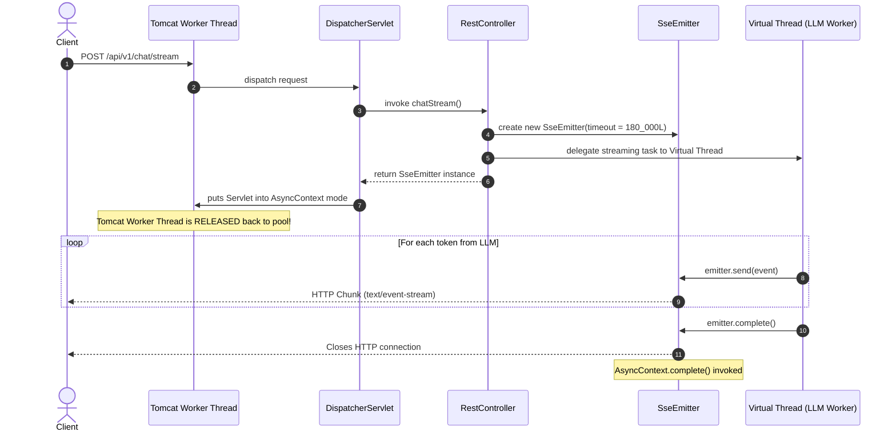

# 🌊 Day 18: Async APIs, Streaming & Server-Sent Events (SSE)
## Building Real-Time ChatGPT-Style Token Streaming with Java 21 Virtual Threads & Spring `SseEmitter`

| ⬅️ Previous Day | 📚 Course Hub | ➡️ Next Day |
|:---|:---:|---:|
| [← Day 17: Exception Handling & Global Error Strategy](../Day_17_Exception_Handling_Global_Strategy/Day_17_Exception_Handling_Global_Strategy.md) | [All 60 Days Overview](../../README.md) | [Day 19: API Documentation & OpenAPI →](../Day_19_API_Documentation_OpenAPI/Day_19_API_Documentation_OpenAPI.md) |

[](../../README.md)
[](../../README.md)
[](../../README.md)
[](../../README.md)

---

## 1. Topic Overview

Server-Sent Events (SSE) is a standardized W3C web protocol that maintains a persistent, unidirectional HTTP connection (`text/event-stream`), enabling servers to push incremental chunks of text to client browsers in real time. In enterprise Generative AI engineering, SSE is the industry-standard mechanism powering typewriter-style token streaming (such as ChatGPT), reducing Time-to-First-Token (TTFT) from 30 seconds of perceived waiting to under 350 milliseconds without the network complexity or firewall friction of WebSockets.

---

## 2. Basic Foundations (True Zero)

### Plain English Definitions
- **Server-Sent Events (SSE)**: A lightweight web protocol where an HTTP connection remains open, allowing the server to push text fragments formatted as `data: {...}\n\n` to the client over standard HTTP/1.1 or HTTP/2.
- **TTFT (Time-To-First-Token)**: The latency between a user submitting an AI prompt and the very first generated word rendering on screen.
- **`SseEmitter`**: A Spring MVC asynchronous response handler that holds an open HTTP socket to a client browser so backend worker threads can emit tokens over time using `emitter.send()`.
- **Keep-Alive Heartbeat**: Periodic SSE comment lines (e.g., `: ping\n\n`) sent every 10–15 seconds to prevent cloud load balancers (AWS ALB, NGINX, Cloudflare) from closing idle connections during complex reasoning deliberation.
- **Client Disconnection Handling**: Detection routines (`emitter.onError`, `emitter.onTimeout`) that abort ongoing GPU token generation when a user navigates away or closes their browser tab mid-sentence.

### Relatable Physical Analogy: Morse Code Telegraph vs. Bound Encyclopedias
```
TRADITIONAL BATCH HTTP:
┌──────────────────┐               [ Wait 3 Weeks... ]               ┌──────────────────┐
│  Client asks:    │ ──────────────────────────────────────────────► │  Printer binds   │
│  "Explain Rome"  │ ◄────────────────────────────────────────────── │  500-page book   │
└──────────────────┘     [ Client receives 10-pound book at once ]   └──────────────────┘

SERVER-SENT EVENTS (SSE) STREAMING:
┌──────────────────┐                                                 ┌──────────────────┐
│  Client asks:    │ ──────────────────────────────────────────────► │ Telegraph        │
│  "Explain Rome"  │                                                 │ Operator         │
│                  │ ◄─── "Rome " (300ms) ────────────────────────── │                  │
│                  │ ◄─── "was " (340ms) ─────────────────────────── │                  │
│                  │ ◄─── "not " (380ms) ─────────────────────────── │                  │
│                  │ ◄─── "built " (420ms) ───────────────────────── │                  │
│                  │ ◄─── "in " (460ms) ──────────────────────────── │                  │
│                  │ ◄─── "a " (500ms) ───────────────────────────── │                  │
│                  │ ◄─── "day." (540ms) ─────────────────────────── │                  │
│                  │ ◄─── [done] (580ms) ─────────────────────────── │                  │
└──────────────────┘                                                 └──────────────────┘
```

Traditional HTTP is like ordering a 500-page encyclopedia by mail: you cannot read a single word until the entire book is printed, bound, and delivered. Server-Sent Events is like sitting beside a telegraph operator: you read each word the exact millisecond it clicks across the wire.

### Minimal Beginner-Friendly Working Code Example

Let us examine a minimal working Spring Boot controller that streams 5 words one-by-one:

```java
package com.javagenai.day18;

import org.springframework.boot.SpringApplication;
import org.springframework.boot.autoconfigure.SpringBootApplication;
import org.springframework.http.MediaType;
import org.springframework.web.bind.annotation.GetMapping;
import org.springframework.web.bind.annotation.RequestMapping;
import org.springframework.web.bind.annotation.RestController;
import org.springframework.web.servlet.mvc.method.annotation.SseEmitter;

import java.io.IOException;

@SpringBootApplication
@RestController
@RequestMapping("/api/v1/streaming")
public class MinimalStreamingApp {

    public static void main(String[] args) {
        SpringApplication.run(MinimalStreamingApp.class, args);
    }

    @GetMapping(value = "/words", produces = MediaType.TEXT_EVENT_STREAM_VALUE)
    public SseEmitter streamWords() {
        SseEmitter emitter = new SseEmitter(60_000L); // 60-second timeout

        // Launch asynchronous work on a Virtual Thread
        Thread.startVirtualThread(() -> {
            try {
                String[] words = {"Spring", "AI", "streams", "tokens", "live!"};
                for (String word : words) {
                    emitter.send(SseEmitter.event().data(word + " "));
                    Thread.sleep(200); // Simulate model generation delay
                }
                emitter.complete(); // Close the HTTP stream cleanly
            } catch (Exception ex) {
                emitter.completeWithError(ex);
            }
        });

        return emitter; // Returns immediately; Tomcat worker thread is freed!
    }
}
```

#### Line-by-Line Walkthrough
1. `produces = MediaType.TEXT_EVENT_STREAM_VALUE`: Configures the HTTP header `Content-Type: text/event-stream;charset=UTF-8`.
2. `SseEmitter emitter = new SseEmitter(60_000L)`: Instantiates the streaming handler with an explicit socket timeout.
3. `Thread.startVirtualThread(...)`: Offloads token production to a lightweight Java 21 Virtual Thread.
4. `return emitter`: Controller method terminates in under 2ms, **releasing the underlying Tomcat worker thread back to the connection pool**.
5. `emitter.send(...)`: Pushes formatted SSE chunks down the open socket to the browser.
6. `emitter.complete()`: Closes the stream normally when generation finishes.

---

## 3. Core Concept Walkthrough (Basic → Intermediate)

### 3.1 The Physics of Auto-Regressive Decoding
Modern transformer models generate responses iteratively:

$$P(w_{t} \mid w_{1}, w_{2}, \dots, w_{t-1})$$

1. **Prefill Phase**: Evaluates input prompt embeddings across tensor cores (~150ms).
2. **Decode Phase**: Predicts token $t_1$, appends it to context, and runs forward passes predicting subsequent tokens one at a time (~25ms–40ms per token).

Because the LLM engine generates text sequentially, holding tokens until the 1,000th token completes forces users to wait 30 seconds. Streaming delivers words at human reading speed.

### 3.2 W3C SSE Wire Protocol Specification
SSE runs over standard HTTP without WebSocket handshakes:

```http
HTTP/1.1 200 OK
Content-Type: text/event-stream;charset=UTF-8
Cache-Control: no-cache
Connection: keep-alive
```

#### Frame Structure:
Every event consists of plain text lines separated by `\n` and terminated with a **double newline** `\n\n`:

```
id: tok_001
event: token
data: {"token":"Virtual ","index":1}

id: tok_002
event: token
data: {"token":"Threads ","index":2}

: keep-alive heartbeat

id: evt_done
event: done
data: {"finishReason":"stop","totalTokens":2}

```

| Field | Purpose | Client Behavior |
| :--- | :--- | :--- |
| **`event:`** | Defines event classification (`token`, `start`, `done`) | Frontend listens via `addEventListener("token", cb)` |
| **`data:`** | Text or serialized JSON payload | Parsed by frontend stream reader |
| **`id:`** | Unique event sequence identifier | Used in `Last-Event-ID` if reconnecting |
| **`:` (colon)**| Comment line | Ignored by JavaScript; keeps proxies alive |

### 3.3 Spring MVC Async Architecture: `SseEmitter` & `AsyncContext`



### 3.4 Virtual Threads vs. Platform Threads in Streaming
In traditional Java (platform threads):
- Tomcat maintains ~200 OS threads.
- If 200 users start an SSE stream lasting 30 seconds, **all 200 threads are locked in blocking socket writes**.
- Request 201 queues up; when the queue fills, the server crashes with thread starvation.

In Java 21 with Virtual Threads (`spring.threads.virtual.enabled=true`):
- Virtual threads cost ~1KB of memory.
- When an SSE emitter waits for the next token, the virtual thread unmounts from its carrier thread.
- A single server can sustain **50,000 concurrent active SSE connections** effortlessly.

---

## 4. Prerequisite & Supporting Concepts

### Prerequisite / Supporting Concept: SSE vs. WebSockets

| Feature | Server-Sent Events (SSE) | WebSockets |
| :--- | :--- | :--- |
| **Directionality** | Unidirectional (Server $\rightarrow$ Client) | Full Duplex (Bi-directional) |
| **Protocol** | Standard HTTP/1.1 or HTTP/2 | Custom `ws://` or `wss://` upgrade |
| **Headers & Auth** | Full HTTP header support (`Authorization: Bearer`) | Initial handshake only; complex custom auth |
| **Corporate Firewalls**| Transparently traverses proxies/firewalls | Frequently blocked or closed by enterprise proxies |
| **Ideal Use Case** | AI text generation, stock tickers, notifications | Multiplayer gaming, collaborative whiteboards |

### Prerequisite / Supporting Concept: The Plain English Bridge to Streaming

| Streaming Concept | Traditional REST API | Server-Sent Events (SSE) | Plain English Translation |
| :--- | :--- | :--- | :--- |
| **HTTP Lifetime** | Returns full JSON and closes immediately | Keeps HTTP connection open | Leaves the telephone call active to speak new words |
| **Perceived Speed** | 30-second blank spinner | 300ms Time-To-First-Token | Words appear immediately as they are generated |
| **Spring Class** | `ResponseEntity<UserDTO>` | `SseEmitter` | Spring's megaphone for broadcasting data chunks |
| **Wire Syntax** | Single JSON object | `data: ...\n\n` text blocks | Lightweight stream recognized by all browsers |

---

## 5. Advanced Depth (Intermediate → Advanced)

### 5.1 Preventing Reverse Proxy Timeouts with Heartbeats
In enterprise environments, requests traverse ingress load balancers (AWS ALB, NGINX, Cloudflare). Most enforce a default **60-second idle socket timeout**. If a complex reasoning model (e.g., DeepSeek-R1, OpenAI o1) deliberates for 65 seconds before generating its first token, the load balancer forcibly terminates the connection with an HTTP `504 Gateway Timeout`.

#### Solution: Keep-Alive Heartbeat Scheduler
```java
package com.javagenai.day18.streaming;

import org.springframework.web.servlet.mvc.method.annotation.SseEmitter;
import java.io.IOException;
import java.util.concurrent.*;

public class SseHeartbeatManager implements AutoCloseable {
    private final ScheduledExecutorService scheduler = 
        Executors.newSingleThreadScheduledExecutor(Thread.ofVirtual().factory());
    private ScheduledFuture<?> task;

    public void start(SseEmitter emitter, long intervalSeconds) {
        this.task = scheduler.scheduleAtFixedRate(() -> {
            try {
                // Sends an SSE comment ': ping\n\n' which resets proxy socket idle timers
                emitter.send(SseEmitter.event().comment("ping"));
            } catch (IOException | IllegalStateException e) {
                close();
            }
        }, intervalSeconds, intervalSeconds, TimeUnit.SECONDS);

        emitter.onCompletion(this::close);
        emitter.onTimeout(this::close);
        emitter.onError(ex -> close());
    }

    @Override
    public void close() {
        if (task != null) task.cancel(true);
        scheduler.shutdown();
    }
}
```

### 5.2 Aborting Leaked Inference on Client Disconnect
When a user closes their browser tab mid-stream:
- The socket closes with a broken pipe (`IOException` / `ClientAbortException`).
- Without cancellation checks, the backend will continue invoking expensive LLM APIs until completion.

```java
// Production Cancellation Pattern
SseEmitter emitter = new SseEmitter(180_000L);
AtomicBoolean isCancelled = new AtomicBoolean(false);

emitter.onTimeout(() -> isCancelled.set(true));
emitter.onError(ex -> isCancelled.set(true));

Thread.startVirtualThread(() -> {
    for (String token : llmTokenStream) {
        if (isCancelled.get()) {
            logger.info("Client disconnected. Terminating LLM generation job immediately.");
            llmClient.abortJob();
            break;
        }
        try {
            emitter.send(SseEmitter.event().name("token").data(token));
        } catch (IOException e) {
            isCancelled.set(true);
            break;
        }
    }
});
```

---

## 6. Quick Recap

| Concept | Implementation Construct | Operational Function |
| :--- | :--- | :--- |
| **Media Type** | `text/event-stream` | Informs client and proxies of persistent HTTP stream |
| **Spring Emitter** | `SseEmitter` | Asynchronously writes data events to client |
| **Thread Scaling** | Java 21 Virtual Threads | Allows 50,000+ open SSE sockets without thread exhaustion |
| **Idle Keep-Alive** | SSE comments (`: ping\n\n`) | Prevents AWS ALB/NGINX 60s idle socket disconnects |
| **Client Disconnect**| `emitter.onError()` | Aborts backend token generation when tab closes |
| **Protocol Format** | `event:`, `id:`, `data:`, `\n\n` | W3C standard event framing |

---

## 7. Self-Check Questions & Practice Exercises

### Self-Check Questions

1. **Why is Server-Sent Events (SSE) better suited for AI completion streaming than WebSockets?**
   - *Answer*: LLM token generation is strictly unidirectional (prompt in, stream of tokens out). SSE operates over standard HTTP/1.1 or HTTP/2, natively supports standard authorization headers, works through firewalls without custom protocol upgrades, and handles reconnection automatically.
2. **What happens to the Tomcat server thread when an `@RestController` method returns an `SseEmitter`?**
   - *Answer*: Spring MVC places the underlying request into asynchronous mode (`AsyncContext`) and immediately returns the Tomcat worker thread to the pool. Background worker threads (virtual threads) take over writing tokens to the client.
3. **Why do AWS Application Load Balancers or NGINX proxies drop SSE connections during deep reasoning model inference?**
   - *Answer*: Reverse proxies enforce an idle socket timeout (typically 60s). If the model deliberates for longer than 60s before producing the first token, zero bytes traverse the socket, prompting the proxy to drop the connection with HTTP 504.
4. **How do keep-alive heartbeats solve the idle proxy timeout issue without affecting frontend logic?**
   - *Answer*: By sending periodic SSE comment lines (e.g., `: ping\n\n`). These transmit bytes over the TCP socket to reset the proxy's idle timer, while browser `EventSource` and fetch readers ignore comment lines.
5. **Why are Java 21 Virtual Threads critical when deploying enterprise SSE microservices?**
   - *Answer*: Platform threads consume ~1MB of memory and are limited to small pools (e.g., 200 threads). Virtual Threads consume ~1KB, enabling a single JVM instance to handle tens of thousands of concurrent open streaming sockets without thread exhaustion.

---

### Hands-On Practice Exercises

#### 🏋️ Exercise 1: Build a Production Streaming Chat Controller with `SseEmitter`
**Objective**: Build a complete `@RestController` endpoint `POST /api/v1/chat/stream` that accepts a prompt and streams tokens back to the client using a Virtual Thread:

```java
package com.javagenai.day18;

import org.springframework.http.MediaType;
import org.springframework.web.bind.annotation.*;
import org.springframework.web.servlet.mvc.method.annotation.SseEmitter;

import java.io.IOException;
import java.util.List;
import java.util.Map;
import java.util.concurrent.atomic.AtomicBoolean;

@RestController
@RequestMapping("/api/v1/chat")
public class StreamingChatController {

    public record StreamPromptRequest(String prompt, String model) {}

    @PostMapping(value = "/stream", produces = MediaType.TEXT_EVENT_STREAM_VALUE)
    public SseEmitter streamTokens(@RequestBody StreamPromptRequest request) {
        SseEmitter emitter = new SseEmitter(180_000L); // 3-minute timeout
        AtomicBoolean aborted = new AtomicBoolean(false);

        emitter.onTimeout(() -> aborted.set(true));
        emitter.onError(ex -> aborted.set(true));

        Thread.startVirtualThread(() -> {
            try {
                // Simulated token generator
                List<String> tokens = List.of("Enterprise ", "AI ", "streaming ", "with ", "Spring ", "Boot ", "3!");
                for (int i = 0; i < tokens.size(); i++) {
                    if (aborted.get()) {
                        System.out.println("Client aborted stream. Halting token generator.");
                        break;
                    }

                    emitter.send(SseEmitter.event()
                        .name("token")
                        .id("tok_" + i)
                        .data(Map.of("token", tokens.get(i), "index", i)));

                    Thread.sleep(150);
                }

                if (!aborted.get()) {
                    emitter.send(SseEmitter.event().name("done").data(Map.of("status", "COMPLETE")));
                    emitter.complete();
                }
            } catch (Exception ex) {
                emitter.completeWithError(ex);
            }
        });

        return emitter;
    }
}
```

#### 🏋️ Exercise 2: Build a Frontend Modern JavaScript Streaming Reader
**Objective**: Construct modern client-side JavaScript using `fetch` and `ReadableStreamDefaultReader` that handles `POST` streams with JSON bodies:

```javascript
async function streamCompletion(userPrompt) {
  const outputContainer = document.getElementById("chat-output");

  const response = await fetch("/api/v1/chat/stream", {
    method: "POST",
    headers: {
      "Content-Type": "application/json",
      "Authorization": "Bearer session_token_xyz"
    },
    body: JSON.stringify({ prompt: userPrompt, model: "gpt-4o" })
  });

  const reader = response.body.getReader();
  const decoder = new TextDecoder("utf-8");
  let buffer = "";

  while (true) {
    const { done, value } = await reader.read();
    if (done) break;

    buffer += decoder.decode(value, { stream: true });
    const events = buffer.split("\n\n");
    buffer = events.pop(); // Keep partial trailing chunk

    for (const eventBlock of events) {
      if (eventBlock.startsWith(":")) continue; // Skip heartbeat comments

      const dataMatch = eventBlock.match(/data:\s*(.*)/);
      if (dataMatch) {
        try {
          const payload = JSON.parse(dataMatch[1]);
          if (payload.token) {
            outputContainer.textContent += payload.token;
          }
        } catch (err) {
          console.warn("Non-JSON SSE data:", dataMatch[1]);
        }
      }
    }
  }
}
```

---

| ⬅️ Previous Day | 📚 Course Hub | ➡️ Next Day |
|:---|:---:|---:|
| [← Day 17: Exception Handling & Global Error Strategy](../Day_17_Exception_Handling_Global_Strategy/Day_17_Exception_Handling_Global_Strategy.md) | [All 60 Days Overview](../../README.md) | [Day 19: API Documentation & OpenAPI →](../Day_19_API_Documentation_OpenAPI/Day_19_API_Documentation_OpenAPI.md) |
