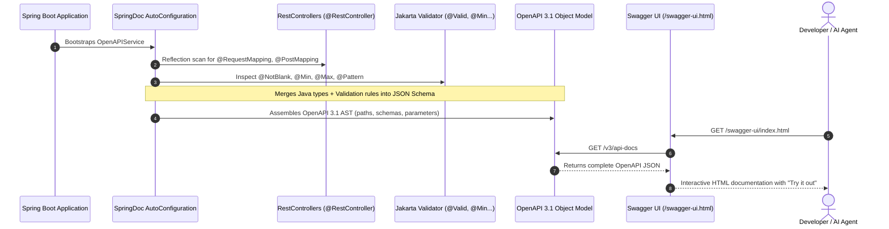

# 📖 Day 19: API Documentation & OpenAPI (Swagger / SpringDoc)
## Living Contract Architecture: Automated Schemas, Swagger UI & LLM Agent Tool Calling

| ⬅️ Previous Day | 📚 Course Hub | ➡️ Next Day |
|:---|:---:|---:|
| [← Day 18: Async APIs, Streaming & SSE](../Day_18_Async_Streaming_SSE/Day_18_Async_Streaming_SSE.md) | [All 60 Days Overview](../../README.md) | [Day 20: Testing REST APIs End-to-End →](../Day_20_Testing_REST_APIs/Day_20_Testing_REST_APIs.md) |

[](../../README.md)
[](../../README.md)
[](../../README.md)
[](../../README.md)

---

## 1. Topic Overview

OpenAPI 3.1 is the formal, machine-readable specification standard that describes REST API operations, parameters, schemas, and security requirements. In enterprise Generative AI engineering, automated documentation generated by SpringDoc OpenAPI turns your Java codebase into a living contract—powering interactive Swagger UI exploration for frontend teams, generating client SDKs, and exporting precise JSON Schemas directly to autonomous LLM agents for tool-calling and function execution.

---

## 2. Basic Foundations (True Zero)

### Plain English Definitions
- **OpenAPI**: An open, vendor-neutral specification (defined in JSON or YAML) that documents the complete surface area of a REST API—including URLs, request bodies, query parameters, HTTP headers, status codes, and error formats.
- **Swagger / Swagger UI**: A browser-based graphical user interface generated directly from the OpenAPI specification that allows engineers to visually explore endpoints and test API calls with a single click.
- **SpringDoc OpenAPI (`springdoc-openapi-starter-webmvc-ui`)**: The Spring Boot 3 library that automatically scans `@RestController` endpoints, Java 21 Records, and Jakarta Bean Validation constraints (`@NotBlank`, `@Min`, `@Max`) at startup to synthesize an OpenAPI 3.1 specification.
- **JSON Schema**: A vocabulary that allows you to annotate and validate JSON documents, forming the underlying schema language used by OpenAPI and autonomous LLMs alike.
- **Tool-Calling Schema**: The structured JSON Schema representation of a Java method provided to LLMs (like GPT-4o or Claude 3.5), allowing autonomous AI agents to parse user intent and invoke backend enterprise endpoints.

### Relatable Physical Analogy: The Restaurant Menu & Kitchen Automation
```
TRADITIONAL OUTDATED WIKI:
[ Handwritten napkin note: "Soup of the day is Tomato" ]
  │
  ▼
Customer orders Tomato soup ──► Kitchen ran out 2 weeks ago! (API Contract Drift)

OPENAPI 3 & SWAGGER UI:
[ Digital Synchronized Kitchen Display System (OpenAPI JSON Specification) ]
  │
  ├──► Customer Interactive Tablet (Swagger UI):
  │    Guests browse ingredients, calorie counts, and place orders with one tap.
  │
  ├──► Supply Chain Automation (Client SDK Generation):
  │    Suppliers automatically reorder ingredients when inventory drops.
  │
  └──► Robotic Sous-Chef (Autonomous LLM Tool-Calling):
       Robots read standardized recipe schemas to prepare meals without human intervention.
```

OpenAPI is not merely a documentation website—it is the **executable blueprint** defining how external software and autonomous agents interface with your enterprise systems.

### Minimal Beginner-Friendly Working Code Example

Let us examine how adding a single starter dependency turns a plain Spring Boot controller into a live Swagger UI dashboard:

```java
package com.javagenai.day19;

import io.swagger.v3.oas.annotations.Operation;
import io.swagger.v3.oas.annotations.tags.Tag;
import org.springframework.boot.SpringApplication;
import org.springframework.boot.autoconfigure.SpringBootApplication;
import org.springframework.web.bind.annotation.*;

import java.util.List;

@SpringBootApplication
@RestController
@RequestMapping("/api/v1/models")
@Tag(name = "AI Model Directory", description = "Endpoints for discovering approved foundation models")
public class MinimalOpenApiApp {

    public static void main(String[] args) {
        SpringApplication.run(MinimalOpenApiApp.class, args);
    }

    @GetMapping
    @Operation(summary = "List Available LLM Models", description = "Returns active enterprise model identifiers")
    public List<String> listModels() {
        return List.of("gpt-4o", "claude-3-5-sonnet", "llama-3.2");
    }
}
```

#### Line-by-Line Walkthrough
1. `@Tag(name = "AI Model Directory", ...)`: Groups this controller under a dedicated visual section in the Swagger UI navigation tree.
2. `@Operation(summary = "...", description = "...")`: Attaches a plain-language summary and operational explanation to the `GET /api/v1/models` endpoint.
3. When the application launches, SpringDoc inspects these annotations and automatically publishes:
   - Raw OpenAPI JSON at `http://localhost:8080/v3/api-docs`
   - Interactive Swagger UI dashboard at `http://localhost:8080/swagger-ui.html`

---

## 3. Core Concept Walkthrough (Basic → Intermediate)

### 3.1 SpringDoc Architecture Under the Hood
SpringDoc eliminates manual documentation updates by deriving schemas directly from compiled bytecode:



### 3.2 Global API Configuration & Metadata
Define global contact information, servers, and security requirements in a dedicated configuration class:

```java
package com.javagenai.day19.config;

import io.swagger.v3.oas.annotations.OpenAPIDefinition;
import io.swagger.v3.oas.annotations.info.Contact;
import io.swagger.v3.oas.annotations.info.Info;
import io.swagger.v3.oas.annotations.info.License;
import io.swagger.v3.oas.annotations.servers.Server;
import org.springframework.context.annotation.Configuration;

@Configuration
@OpenAPIDefinition(
    info = @Info(
        title = "Enterprise Gen AI Gateway API",
        version = "v1.4.0",
        description = "High-performance gateway for LLM inference, RAG embeddings, and prompt orchestration.",
        contact = @Contact(name = "AI Platform Core Team", email = "ai-platform@enterprise.internal"),
        license = @License(name = "Apache 2.0", url = "https://www.apache.org/licenses/LICENSE-2.0")
    ),
    servers = {
        @Server(url = "https://ai-gateway.corp.internal/api/v1", description = "Production Kubernetes Mesh"),
        @Server(url = "http://localhost:8080/api/v1", description = "Local Developer Sandbox")
    }
)
public class OpenApiConfig {}
```

### 3.3 Documenting Java 21 Records with `@Schema`
When documenting Java 21 Records, place `@Schema` annotations directly on the record components:

```java
package com.javagenai.day19.dto;

import io.swagger.v3.oas.annotations.media.Schema;
import jakarta.validation.constraints.*;

public record CompletionRequest(
    @Schema(
        description = "User prompt submitted for text completion.",
        example = "Explain the difference between Stack and Heap memory in Java 21."
    )
    @NotBlank(message = "Prompt must not be empty")
    @Size(max = 4000, message = "Prompt exceeds 4000 characters")
    String prompt,

    @Schema(
        description = "Corporate approved foundation model name.",
        example = "gpt-4o",
        allowableValues = {"gpt-4o", "gpt-4o-mini", "claude-3-5-sonnet", "llama-3.2", "mistral-large"}
    )
    @NotBlank(message = "Model is required")
    String model,

    @Schema(
        description = "Sampling temperature: 0.0 is deterministic; 2.0 is highly creative.",
        example = "0.7",
        minimum = "0.0",
        maximum = "2.0"
    )
    @DecimalMin("0.0")
    @DecimalMax("2.0")
    double temperature,

    @Schema(
        description = "Maximum number of tokens to generate in the completion.",
        example = "1024",
        minimum = "1",
        maximum = "4096"
    )
    @Min(1)
    @Max(4096)
    int maxTokens
) {}
```

### 3.4 API Versioning Strategies in Enterprise AI

```
                     ┌─────────────────────────────────────────┐
                     │         API Versioning Strategies       │
                     └────────────────────┬────────────────────┘
                                          │
         ┌────────────────────────────────┼────────────────────────────────┐
         ▼                                ▼                                ▼
[ URI Path Versioning ]          [ Header Versioning ]          [ Query Param Versioning ]
/api/v1/chat/completions         X-API-Version: 2               /api/chat?v=2
/api/v2/chat/completions         
• Transparent in logs            • Clean URLs                   • Easiest to test in browser
• Easy to route in NGINX/ALB     • Harder to cache at CDN       • Pollutes query parameters
• INDUSTRY STANDARD FOR AI       • Invisible in browser history • Rarely used in enterprise
```

#### Deprecating Legacy Routes Cleanly:
```java
@Deprecated
@Operation(
    summary = "Legacy Completion Endpoint",
    description = "Use /api/v2/chat/completions instead. Deprecated since v1.4.",
    deprecated = true
)
@PostMapping("/api/v1/completions")
public ResponseEntity<?> legacyComplete() { ... }
```

### 3.5 The Bridge to Autonomous Agents: Tool-Calling Schemas
Autonomous LLMs (GPT-4o, Claude 3.5) cannot call arbitrary binary functions. They require a formal **JSON Schema** describing tool signatures:

```json
{
  "type": "function",
  "function": {
    "name": "generate_ai_completion",
    "description": "Generate text completion using approved enterprise LLMs.",
    "parameters": {
      "type": "object",
      "required": ["prompt", "model"],
      "properties": {
        "prompt": { "type": "string", "description": "User prompt to be completed by the LLM." },
        "model": { "type": "string", "enum": ["gpt-4o", "gpt-4o-mini", "claude-3-5-sonnet", "llama-3.2"] },
        "temperature": { "type": "number", "description": "Sampling temperature between 0.0 and 2.0." },
        "maxTokens": { "type": "integer", "description": "Maximum number of tokens to generate." }
      }
    }
  }
}
```
Because SpringDoc synthesizes standardized JSON Schemas from your Java records, you can export your Spring Boot endpoints directly into an AI agent's tool catalog!

---

## 4. Prerequisite & Supporting Concepts

### Prerequisite / Supporting Concept: Automatic Jakarta Validation Translation
SpringDoc automatically translates Jakarta Bean Validation annotations into OpenAPI schema constraints without redundant declarations:
- `@Min(1)` $\rightarrow$ `minimum: 1`
- `@Max(4096)` $\rightarrow$ `maximum: 4096`
- `@Size(max = 4000)` $\rightarrow$ `maxLength: 4000`
- `@NotBlank` $\rightarrow$ Added to the schema's `required: [...]` list

### Prerequisite / Supporting Concept: The Plain English Bridge to OpenAPI

| Concept | Manual Documentation | SpringDoc OpenAPI | Why It Matters |
| :--- | :--- | :--- | :--- |
| **API Contract** | Manually written Confluence or Word page | Generated OpenAPI 3.1 JSON | Code is the single source of truth; zero doc drift |
| **Interactive Testing**| Typing curl commands into terminal | Swagger UI "Try it out" button | Instant testing in the browser without third-party tools |
| **Client SDKs** | Writing manual client libraries by hand | Automated generators (`openapi-generator`) | Generate TypeScript and Python SDKs in CI/CD |
| **AI Agent Tools** | Writing bespoke JSON schemas by hand | Exporting SpringDoc schema directly | LLM agents can inspect and call Java APIs autonomously |

---

## 5. Advanced Depth (Intermediate → Advanced)

### 5.1 Documenting Complex Multipart & File Upload Endpoints
In RAG (Retrieval-Augmented Generation) document ingestion pipelines, endpoints receive binary files (PDFs, Markdown) alongside JSON metadata:

```java
package com.javagenai.day19.controller;

import io.swagger.v3.oas.annotations.Operation;
import io.swagger.v3.oas.annotations.Parameter;
import io.swagger.v3.oas.annotations.media.Content;
import io.swagger.v3.oas.annotations.media.Schema;
import io.swagger.v3.oas.annotations.responses.ApiResponse;
import io.swagger.v3.oas.annotations.tags.Tag;
import org.springframework.http.MediaType;
import org.springframework.http.ResponseEntity;
import org.springframework.web.bind.annotation.*;
import org.springframework.web.multipart.MultipartFile;

@RestController
@RequestMapping("/api/v1/rag")
@Tag(name = "Document Ingestion", description = "RAG ingestion and vectorization endpoints")
public class RagDocumentController {

    @Operation(
        summary = "Ingest Knowledge Document",
        description = "Uploads a PDF or Markdown document, chunks the text, and stores vector embeddings in pgvector."
    )
    @ApiResponse(responseCode = "201", description = "Document vectorized and stored successfully")
    @PostMapping(value = "/ingest", consumes = MediaType.MULTIPART_FORM_DATA_VALUE)
    public ResponseEntity<String> ingestDocument(
        @Parameter(description = "Raw document file (PDF, TXT, MD)", required = true)
        @RequestPart("file") MultipartFile file,

        @Parameter(description = "Target collection namespace", example = "engineering-handbook")
        @RequestParam("collection") String collection
    ) {
        return ResponseEntity.status(201).body("Ingested " + file.getOriginalFilename());
    }
}
```

### 5.2 Common Mistakes & Misconceptions

#### Mistake 1: Hardcoding Model Lists in Plain Text Comments
```java
// ❌ BAD: Model list in plain comment; does not show up as selectable dropdown in Swagger UI!
@Schema(description = "Allowed models: gpt-4o, claude-3-5-sonnet")
String model;

// ✅ GOOD: Uses allowableValues to render an interactive dropdown enum in Swagger UI
@Schema(
    description = "Approved foundation model name",
    allowableValues = {"gpt-4o", "claude-3-5-sonnet", "llama-3.2"}
)
String model;
```

#### Mistake 2: Exposing Internal Database IDs in OpenAPI Schemas
Never expose internal auto-incrementing database primary keys (`id: 104`) in public API schemas. Use external UUIDs or resource slugs (`id: "cmpl_9a8b7c"`), preventing resource enumeration attacks.

---

## 6. Quick Recap

| Annotation / Construct | Scope | Role in Architecture | Enterprise AI Value |
| :--- | :--- | :--- | :--- |
| **`@OpenAPIDefinition`** | Class | Declares global API title, version, and server URLs | Sets corporate metadata for API gateway |
| **`@Tag`** | Class / Method | Categorizes endpoints into logical groups | Organizes inference, RAG, and admin endpoints |
| **`@Operation`** | Method | Documents HTTP summary and description | Describes token generation behaviors |
| **`@ApiResponse`** | Method | Documents status codes (`200`, `422`, `504`) | Exposes RFC 7807 Problem Details schemas |
| **`@Schema`** | Record field | Enriches fields with descriptions and examples | Supplies JSON Schema for LLM tool-calling |
| **Swagger UI** | `/swagger-ui.html` | Interactive browser dashboard | Enables rapid testing without Postman |

---

## 7. Self-Check Questions & Practice Exercises

### Self-Check Questions

1. **Why does SpringDoc automatically reflect Jakarta Validation annotations into OpenAPI schemas?**
   - *Answer*: SpringDoc includes built-in model converters that inspect Jakarta Bean Validation annotations. It automatically maps `@Min(1)` to `minimum: 1`, `@Max(4096)` to `maximum: 4096`, `@Size(max = 4000)` to `maxLength: 4000`, and `@NotBlank` to the schema's `required` list, eliminating documentation duplication.
2. **Where are the raw OpenAPI JSON specification and Swagger UI accessed in a default Spring Boot 3 application?**
   - *Answer*: Raw JSON specification: `/v3/api-docs` (or `/v3/api-docs.yaml`). Interactive Swagger UI dashboard: `/swagger-ui.html` (redirects to `/swagger-ui/index.html`).
3. **Why is URI path versioning (`/api/v1/...`) preferred over HTTP header versioning for AI microservices?**
   - *Answer*: URI paths are explicit in server access logs, reverse-proxy routing rules (AWS ALB/NGINX), and caching layers. Furthermore, autonomous AI agents and client SDK generators parse explicit URLs reliably without dropping custom headers.
4. **How does OpenAPI documentation bridge the gap to autonomous AI Agent Tool Calling (Function Calling)?**
   - *Answer*: Foundation models require standardized JSON Schemas to understand tool signatures, parameters, and constraints. Because OpenAPI 3.1 schemas adhere to JSON Schema, SpringDoc's generated schemas can be fed directly to LLMs as tool definitions.
5. **How do you mark an endpoint as deprecated in OpenAPI?**
   - *Answer*: Add `@Deprecated` to the Java method and set `@Operation(deprecated = true)`. Swagger UI will render the endpoint with a strikethrough visual style.

---

### Hands-On Practice Exercises

#### 🏋️ Exercise 1: Document a Vector Similarity Search Controller
**Objective**: Annotate a Spring REST controller endpoint `POST /api/v1/rag/search` using `@Operation`, `@Tag`, and `@ApiResponse` annotations:

```java
package com.javagenai.day19;

import io.swagger.v3.oas.annotations.Operation;
import io.swagger.v3.oas.annotations.media.Content;
import io.swagger.v3.oas.annotations.media.Schema;
import io.swagger.v3.oas.annotations.responses.ApiResponse;
import io.swagger.v3.oas.annotations.responses.ApiResponses;
import io.swagger.v3.oas.annotations.tags.Tag;
import org.springframework.http.ProblemDetail;
import org.springframework.http.ResponseEntity;
import org.springframework.web.bind.annotation.*;

import java.util.List;

public record SearchResult(String chunkId, String text, double score) {}
public record VectorSearchRequest(List<Double> queryVector, int topK) {}

@RestController
@RequestMapping("/api/v1/rag")
@Tag(name = "RAG Retrieval", description = "Vector similarity search and context retrieval")
public class RagSearchController {

    @Operation(
        summary = "Perform Semantic Vector Search",
        description = "Queries the pgvector database for top-K nearest document chunks using cosine distance."
    )
    @ApiResponses({
        @ApiResponse(
            responseCode = "200",
            description = "Nearest neighbor document chunks retrieved successfully",
            content = @Content(mediaType = "application/json", schema = @Schema(implementation = SearchResult.class))
        ),
        @ApiResponse(
            responseCode = "422",
            description = "Validation Error: Query vector dimension mismatch",
            content = @Content(mediaType = "application/problem+json", schema = @Schema(implementation = ProblemDetail.class))
        ),
        @ApiResponse(
            responseCode = "503",
            description = "Vector database cluster unavailable",
            content = @Content(mediaType = "application/problem+json", schema = @Schema(implementation = ProblemDetail.class))
        )
    })
    @PostMapping("/search")
    public ResponseEntity<List<SearchResult>> search(@RequestBody VectorSearchRequest request) {
        return ResponseEntity.ok(List.of(new SearchResult("chk_101", "Virtual threads unmount...", 0.94)));
    }
}
```

#### 🏋️ Exercise 2: Document Server-Sent Events (SSE) Streaming in OpenAPI
**Objective**: Document an SSE streaming endpoint in OpenAPI 3 indicating the `text/event-stream` media type:

```java
package com.javagenai.day19;

import io.swagger.v3.oas.annotations.Operation;
import io.swagger.v3.oas.annotations.media.Content;
import io.swagger.v3.oas.annotations.media.Schema;
import io.swagger.v3.oas.annotations.responses.ApiResponse;
import org.springframework.http.MediaType;
import org.springframework.web.bind.annotation.PostMapping;
import org.springframework.web.bind.annotation.RequestBody;
import org.springframework.web.bind.annotation.RestController;
import org.springframework.web.servlet.mvc.method.annotation.SseEmitter;

public record StreamTokenEvent(String token, int index) {}

@RestController
public class SseDocumentationDemoController {

    @Operation(
        summary = "Stream Chat Completion Tokens",
        description = "Streams tokens token-by-token using Server-Sent Events (SSE) as they are produced by the LLM."
    )
    @ApiResponse(
        responseCode = "200",
        description = "Continuous stream of token events terminated by a 'done' event",
        content = @Content(
            mediaType = MediaType.TEXT_EVENT_STREAM_VALUE,
            schema = @Schema(implementation = StreamTokenEvent.class)
        )
    )
    @PostMapping(value = "/api/v1/chat/stream", produces = MediaType.TEXT_EVENT_STREAM_VALUE)
    public SseEmitter streamChat(@RequestBody String prompt) {
        return new SseEmitter();
    }
}
```

---

| ⬅️ Previous Day | 📚 Course Hub | ➡️ Next Day |
|:---|:---:|---:|
| [← Day 18: Async APIs, Streaming & SSE](../Day_18_Async_Streaming_SSE/Day_18_Async_Streaming_SSE.md) | [All 60 Days Overview](../../README.md) | [Day 20: Testing REST APIs End-to-End →](../Day_20_Testing_REST_APIs/Day_20_Testing_REST_APIs.md) |
