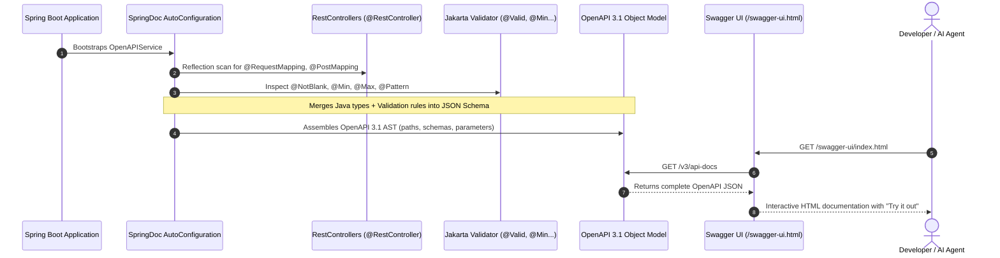

# Day 19: API Documentation & OpenAPI (Swagger / SpringDoc)

> **"If your API is not documented in machine-readable OpenAPI schemas, humans won't know how to integrate with it, frontend teams will file endless Slack tickets, and autonomous AI agents will be unable to call your tools. In modern enterprise architectures, your code is your contract."**

---

| Previous Day | Course Hub | Next Day |
|:---|:---:|---:|
| [Day 18: Async APIs, Streaming & SSE](../Day_18_Async_Streaming_SSE/Day_18_Async_Streaming_SSE.md) | [All 60 Days Overview](../../README.md) | [Day 20: Testing REST APIs End-to-End](../Day_20_Testing_REST_APIs/Day_20_Testing_REST_APIs.md) |

---

## Friendly Welcome: Why Good APIs Need Clear Menus

Hey there, friend! Welcome to Day 19.

Picture this: You just built an incredible coffee vending machine. It can brew espresso, steam almond milk, add vanilla syrups, and grind fresh beans on demand. But there is a catch: you didn't put any labels on the buttons, and there is no menu on the front! When customers walk up, they have to guess: *"Do I press button 1 for a Latte, or does button 1 wipe the machine?"*

In software, building an amazing REST API without clear documentation is just like that unlabeled vending machine. Frontend developers, mobile app teams, and external partners have to ping you on Slack constantly asking: *"What parameters do I pass? Is the field named `model` or `modelName`? What happens if I pass a negative number?"*

Today, we are going to give our APIs a gorgeous, interactive menu that writes itself! With **SpringDoc OpenAPI**, Spring Boot automatically scans your Java records, controller methods, and validation annotations to generate a live, interactive web dashboard (**Swagger UI**). Anyone with a web browser can browse your endpoints, read detailed field descriptions, and test them with a single click—no guesswork, no manual typing of curl commands, and zero outdated wiki pages!

---

> 💡 **New Word Alert! Key Concepts for Today**
>
> - **OpenAPI**: The industry-standard specification (written in JSON or YAML) that describes what a REST API does. It lists all endpoints, required request bodies, query parameters, status codes, and data structures. Think of it as the formal blueprint or nutritional label for your web service.
> - **Swagger / Swagger UI**: A visual, interactive web application generated directly from your OpenAPI blueprint. Instead of staring at raw JSON code, you get a clean web page in your browser where you can click buttons, type test inputs, and hit "Try it out" to see live responses.
> - **SpringDoc**: A popular Spring Boot library (`springdoc-openapi-starter-webmvc-ui`) that connects your Java Spring controllers to Swagger UI. It inspects your `@RestController`, `@Valid`, `@NotBlank`, and record definitions at application startup and builds the OpenAPI documentation completely automatically.
> - **Schema**: The blueprint of a data object. For example, a "ChatRequest Schema" specifies that `prompt` is a required string with a minimum length of 1, and `temperature` is an optional number between 0.0 and 2.0.
> - **Tool-Calling Schema**: When building autonomous AI agents (using Spring AI or LangChain4j), LLMs like GPT-4o or Claude need to know what Java tools they can call. They read these exact same OpenAPI JSON schemas to figure out how to interact with your backend!

---

## The Plain English Bridge: Code is the Single Source of Truth

In traditional software development, engineers would write their Java code, and then manually copy details over to a private Confluence wiki page or Word document to describe how the API worked.

Do you know what always happened within two weeks?
1. Someone changed a field from `temperature` to `samplingTemp` in Java.
2. They forgot to update the wiki.
3. The frontend team spent four hours pulling their hair out trying to figure out why their requests were failing with `400 Bad Request`.

This painful problem is called **Documentation Drift**.

With **SpringDoc OpenAPI**, we practice **Documentation as Code**. Your Java code *is* the documentation. When you add `@Min(1)` to a Java record field, SpringDoc instantly updates the OpenAPI schema. When you rename a parameter, the documentation updates the second you rerun your application. You write the code once, and you get living, breathing, 100% accurate documentation completely for free!

---

## Table of Contents

1. [Why This Day Matters for a 3-Year Enterprise Gen AI Engineer](#1-why-this-day-matters-for-a-3-year-enterprise-gen-ai-engineer)
2. [Real-World Analogy: Architectural Blueprints & Interactive Building Tours](#2-real-world-analogy-architectural-blueprints--interactive-building-tours)
3. [SpringDoc OpenAPI 3 Architecture in Spring Boot 3](#3-springdoc-openapi-3-architecture-in-spring-boot-3)
4. [Essential OpenAPI Annotations In-Depth](#4-essential-openapi-annotations-in-depth)
5. [Documenting Java 21 Records with `@Schema`](#5-documenting-java-21-records-with-schema)
6. [API Versioning Strategies in Enterprise AI Platforms](#6-api-versioning-strategies-in-enterprise-ai-platforms)
7. [The Bridge to Autonomous Agents: OpenAPI to LLM Function Calling](#7-the-bridge-to-autonomous-agents-openapi-to-llm-function-calling)
8. [Hands-On Code Walkthrough](#8-hands-on-code-walkthrough)
9. [Step-by-Step Compilation & Execution](#9-step-by-step-compilation--execution)
10. [Hands-On Exercises (With Complete Solutions)](#10-hands-on-exercises-with-complete-solutions)
11. [Self-Check Quiz](#11-self-check-quiz)
12. [Day 19 Wrap-Up & What's Next](#12-day-19-wrap-up--whats-next)

---

## 1. Why This Day Matters for a 3-Year Enterprise Gen AI Engineer

When a junior developer writes a REST controller, they document it by copying and pasting a sample curl command into a private wiki or README. Within two weeks:
- A parameter is renamed from `model` to `modelName`. The wiki is never updated.
- A new validation rule (`temperature` must be between `0.0` and `2.0`) is added. Frontend developers spend 3 hours debugging why their requests return `422 Unprocessable Entity`.
- The partner integration team requests an official SDK, but no OpenAPI definition exists to generate client stubs.
- **The AI Team wants to expose the service as a Tool for an autonomous AI Agent (e.g. LangChain, Spring AI, or Anthropic Computer Use)**. Because LLMs require formal JSON Schema definitions to understand how to call functions, the service cannot participate in agentic workflows!

A senior enterprise AI engineer uses **SpringDoc OpenAPI** to turn the Java codebase into a **single source of truth**. Your Java 21 records, Jakarta validation constraints (`@NotBlank`, `@Min`, `@Max`), and controller annotations automatically generate:
1. An interactive **Swagger UI** testing dashboard for frontend engineers.
2. A machine-readable **OpenAPI 3.1 specification** for CI/CD contract testing.
3. Automated client SDK generation (TypeScript, Python, Go).
4. **OpenAI / Claude Tool-Calling JSON Schemas** enabling LLMs to call your backend APIs as autonomous tools!

---

## 2. Real-World Analogy: Architectural Blueprints & Interactive Building Tours

```
TRADITIONAL OUTDATED WIKI:
[ Sticky note on wall: "Yellow wire controls elevator" ]
  │
  ▼
Electrician cuts yellow wire ──► Explodes main generator! (API Contract Drift)

OPENAPI 3 & SWAGGER UI:
[ CAD Computer-Aided Architectural Blueprint (OpenAPI JSON Specification) ]
  │
  ├──► Live Interactive 3D Simulation (Swagger UI):
  │    Inspectors can flip switches and test water pressure in real time.
  │
  ├──► Prefabricated Parts Manufacturer (SDK Generators):
  │    Automatically manufactures matching pipes for plumbers (TypeScript/Python clients).
  │
  └──► Autonomous Maintenance Drones (LLM Function Calling):
       Robots read the CAD schematics to repair valves without human intervention.
```

OpenAPI is not just "a webpage where you can click buttons." It is the **formal mathematical blueprint** of your application's external boundary.

---

## 3. SpringDoc OpenAPI 3 Architecture in Spring Boot 3

In Spring Boot 3 (Java 21), the standard library for OpenAPI is **SpringDoc OpenAPI v2**:

```xml
<dependency>
    <groupId>org.springdoc</groupId>
    <artifactId>springdoc-openapi-starter-webmvc-ui</artifactId>
    <version>2.5.0</version>
</dependency>
```

### How SpringDoc Works Under the Hood



SpringDoc performs **zero manual synchronization**:
- When you add `@Min(1) @Max(4096) int maxTokens` to a Java 21 Record, SpringDoc automatically reflects on the class and populates `"minimum": 1, "maximum": 4096` in the OpenAPI JSON schema.
- When you add `@NotBlank String prompt`, SpringDoc adds `"prompt"` to the `"required": [...]` array.

---

## 4. Essential OpenAPI Annotations In-Depth

### Configuration Class: Global API Metadata

```java
@Configuration
@OpenAPIDefinition(
    info = @Info(
        title = "Enterprise Gen AI Gateway",
        version = "v1.0.0",
        description = "Unified high-performance gateway for LLM inference, RAG embeddings, and prompt orchestration.",
        contact = @Contact(name = "AI Platform Team", email = "ai-core@enterprise.internal"),
        license = @License(name = "Apache 2.0", url = "https://www.apache.org/licenses/LICENSE-2.0")
    ),
    servers = {
        @Server(url = "https://ai-gateway.corp.internal/api/v1", description = "Production Gateway"),
        @Server(url = "http://localhost:8080/api/v1", description = "Local Sandbox")
    }
)
public class OpenApiConfig {}
```

### Controller Documentation Annotations

| Annotation | Placement | Purpose | Example |
| :--- | :--- | :--- | :--- |
| `@Tag` | Class or Method | Groups related endpoints under a logical section in Swagger UI. | `@Tag(name = "Chat Inference", description = "Endpoints for LLM token generation")` |
| `@Operation` | Method | Describes the exact HTTP method action, summary, and behavior. | `@Operation(summary = "Generate Chat Completion", description = "Streams tokens or returns full response...")` |
| `@ApiResponse` | Method | Documents the HTTP status code, description, and return schema. | `@ApiResponse(responseCode = "422", description = "Validation Failed (RFC 7807 Problem Details)")` |
| `@Parameter` | Method Arg | Documents query parameters or path variables. | `@Parameter(description = "Conversation session ID", example = "sess_9812")` |

---

## 5. Documenting Java 21 Records with `@Schema`

With Java 21 Records, you place `@Schema` annotations directly on the record components. SpringDoc extracts both the schema metadata and Jakarta Bean Validation constraints simultaneously:

```java
public record CompletionRequest(
    @Schema(
        description = "User prompt submitted for text completion.",
        example = "Explain how Java 21 Virtual Threads optimize I/O-bound LLM API calls."
    )
    @NotBlank(message = "Prompt must not be empty")
    @Size(max = 4000, message = "Prompt exceeds 4000 characters")
    String prompt,

    @Schema(
        description = "Corporate approved foundation model name.",
        example = "gpt-4o",
        allowableValues = {"gpt-4o", "gpt-4o-mini", "claude-3-5-sonnet", "llama3.2", "mistral-large"}
    )
    @NotBlank(message = "Model is required")
    String model,

    @Schema(
        description = "Sampling temperature: 0.0 is deterministic; 2.0 is highly creative.",
        example = "0.7",
        minimum = "0.0",
        maximum = "2.0"
    )
    @DecimalMin("0.0")
    @DecimalMax("2.0")
    double temperature,

    @Schema(
        description = "Maximum number of tokens to generate in the completion.",
        example = "1024",
        minimum = "1",
        maximum = "4096"
    )
    @Min(1)
    @Max(4096)
    int maxTokens
) {}
```

---

## 6. API Versioning Strategies in Enterprise AI Platforms

In enterprise production, models and APIs evolve rapidly. How do you roll out breaking changes without crashing existing client apps?

```
                     ┌─────────────────────────────────────────┐
                     │         API Versioning Strategies       │
                     └────────────────────┬────────────────────┘
                                          │
         ┌────────────────────────────────┼────────────────────────────────┐
         ▼                                ▼                                ▼
[ URI Path Versioning ]          [ Header Versioning ]          [ Query Param Versioning ]
/api/v1/chat/completions         X-API-Version: 2               /api/chat?v=2
/api/v2/chat/completions         
• Transparent in logs            • Clean URLs                   • Easiest to test in browser
• Easy to route in NGINX/ALB     • Harder to cache at CDN       • Pollutes query parameters
• INDUSTRY STANDARD FOR AI       • Invisible in browser history • Rarely used in enterprise
```

### Why URI Path Versioning Wins in Gen AI Gateways
1. **Network Caching & Ingress Routing**: AWS ALB, Kong, and Envoy route `/api/v1/*` to legacy pods and `/api/v2/*` to modern pods with zero header inspection overhead.
2. **AI Agent Compatibility**: Autonomous LLM agents parse URLs directly. Ambiguous headers often get dropped by agentic tool runners.
3. **Deprecation Signals**: In OpenAPI, mark legacy paths using `@Deprecated` or `@Operation(deprecated = true)`. Swagger UI visually strikes through deprecated endpoints:

```java
@Deprecated
@Operation(
    summary = "Legacy Completion Endpoint",
    description = "Use /api/v2/chat/completions instead. Deprecated since v1.4.",
    deprecated = true
)
@PostMapping("/api/v1/completions")
public ResponseEntity<?> legacyComplete(...) { ... }
```

---

## 7. The Bridge to Autonomous Agents: OpenAPI to LLM Function Calling

One of the greatest superpowers of OpenAPI in the Generative AI era is that **OpenAI, Anthropic Claude, and Google Gemini speak OpenAPI JSON Schema natively**.

When an LLM performs **Function Calling (Tool Calling)**, you pass it a list of tool definitions formatted as JSON Schema:

```json
{
  "type": "function",
  "function": {
    "name": "generate_ai_completion",
    "description": "Generate text completion using approved enterprise LLMs.",
    "parameters": {
      "type": "object",
      "required": ["prompt", "model"],
      "properties": {
        "prompt": {
          "type": "string",
          "description": "User prompt to be completed by the LLM."
        },
        "model": {
          "type": "string",
          "enum": ["gpt-4o", "gpt-4o-mini", "claude-3-5-sonnet", "llama3.2"]
        },
        "temperature": {
          "type": "number",
          "description": "Sampling temperature between 0.0 and 2.0."
        }
      }
    }
  }
}
```

Because SpringDoc generates this exact JSON Schema from your Java 21 records, you can export your Spring Boot endpoints directly into your AI agent's tool catalog!

---

## 8. Hands-On Code Walkthrough

In this day's companion code (`Phase_03_Spring_Web_REST_APIs/Day_19_API_Documentation_OpenAPI/code/`), we build:

1. **`ChatCompletionApiSpec.java`**: Object model representing OpenAPI 3.1 structures (Info, Servers, Operations, Schemas).
2. **`OpenApiSchemaGenerator.java`**: Enterprise schema generator that produces:
   - Official OpenAPI 3.1 JSON document.
   - OpenAI / Claude compatible Tool-Calling JSON Schema.
3. **`OpenApiDemo.java`**: Runnable driver class that compiles and verifies schema generation.

---

## 9. Step-by-Step Compilation & Execution

```powershell
# 1. Navigate to course workspace
cd "c:\Users\sriva\OneDrive\Desktop\GEN AI COURSE\JAVA"

# 2. Compile Day 19 code
javac Phase_03_Spring_Web_REST_APIs/Day_19_API_Documentation_OpenAPI/code/*.java

# 3. Execute OpenApiDemo
java -cp Phase_03_Spring_Web_REST_APIs/Day_19_API_Documentation_OpenAPI code.OpenApiDemo
```

### Verified Output

```
================================================================================
 DAY 19: API DOCUMENTATION & OPENAPI (SWAGGER / SPRINGDOC) IN GEN AI GATEWAYS   
================================================================================

--- PART 1: Generated OpenAPI 3.1 JSON Specification ---
{
  "openapi": "3.1.0",
  "info": {
    "title": "Enterprise Gen AI Gateway API",
    "version": "v1.4.0",
    "description": "High-concurrency LLM inference, RAG embeddings, and prompt orchestration gateway.",
    "contact": { "email": "ai-platform@enterprise.internal" },
    "license": { "name": "Apache 2.0" }
  },
  "servers": [
    { "url": "https://ai-gateway.internal.corp/api/v1", "description": "Production Kubernetes Cluster" },
    { "url": "http://localhost:8080/api/v1", "description": "Local Developer Sandbox" }
  ],
  "paths": {
    "/chat/completions": {
      "post": {
        "tags": ["Inference"],
        "summary": "Create Chat Completion",
        "description": "Dispatches a validated prompt to the configured LLM provider and returns completion statistics.",
        ...
      }
    }
  },
  "components": {
    "schemas": {
      "CompletionRequest": {
        "type": "object",
        "required": ["prompt", "model"],
        "properties": {
          "prompt": {
            "type": "string",
            "description": "User prompt to be completed by the LLM.",
            "example": "Explain the difference between Stack and Heap memory in Java 21."
          },
          "model": {
            "type": "string",
            "description": "The corporate approved foundation model name.",
            "example": "gpt-4o",
            "enum": ["gpt-4o", "gpt-4o-mini", "claude-3-5-sonnet", "llama3.2", "mistral-large"]
          },
          "temperature": {
            "type": "number",
            "description": "Sampling temperature between 0.0 (deterministic) and 2.0 (creative).",
            "example": 0.7,
            "minimum": 0.0,
            "maximum": 2.0
          },
          "maxTokens": {
            "type": "integer",
            "description": "Maximum number of tokens to generate.",
            "example": 1024,
            "minimum": 1.0,
            "maximum": 4096.0
          }
        }
      }
    }
  }
}

--- PART 2: LLM Tool-Calling Function Schema (OpenAI / Claude Compatible) ---
{
  "type": "function",
  "function": {
    "name": "generate_ai_completion",
    "description": "Generate text completion using approved enterprise LLMs.",
    "parameters": {
      "type": "object",
      "required": ["prompt", "model"],
      "properties": {
        "prompt": { "type": "string", "description": "User prompt to be completed by the LLM." },
        "model": { "type": "string", "enum": ["gpt-4o", "gpt-4o-mini", "claude-3-5-sonnet", "llama3.2", "mistral-large"] },
        "temperature": { "type": "number" },
        "maxTokens": { "type": "integer" }
      }
    }
  }
}
```

---

## 10. Hands-On Exercises (With Complete Solutions)

### Exercise 1: Documenting a RAG Vector Search Controller
**Task**: Annotate a Spring REST controller endpoint `POST /api/v1/rag/search` using `@Operation`, `@Tag`, and multiple `@ApiResponse` annotations (200 OK with `List<SearchResult>`, 422 for dimension mismatch, 503 for vector DB downtime).

#### Solution:
```java
@Tag(name = "RAG Retrieval", description = "Vector similarity search and document context retrieval")
@RestController
@RequestMapping("/api/v1/rag")
public class RagSearchController {

    @Operation(
        summary = "Perform Semantic Vector Search",
        description = "Queries the pgvector database for the top-K most similar text chunks using cosine distance."
    )
    @ApiResponses({
        @ApiResponse(
            responseCode = "200",
            description = "Successfully retrieved nearest neighbor document chunks",
            content = @Content(mediaType = "application/json", schema = @Schema(implementation = SearchResult.class))
        ),
        @ApiResponse(
            responseCode = "422",
            description = "Validation Error: Query vector dimension does not match index dimension (1536)",
            content = @Content(mediaType = "application/problem+json", schema = @Schema(implementation = ProblemDetail.class))
        ),
        @ApiResponse(
            responseCode = "503",
            description = "Vector database cluster unavailable or connection pool exhausted",
            content = @Content(mediaType = "application/problem+json", schema = @Schema(implementation = ProblemDetail.class))
        )
    })
    @PostMapping("/search")
    public ResponseEntity<List<SearchResult>> search(@Valid @RequestBody VectorSearchRequest request) {
        // Implementation
        return ResponseEntity.ok(List.of());
    }
}
```

---

### Exercise 2: Documenting Server-Sent Events (SSE) in OpenAPI
**Task**: Document an SSE streaming endpoint in OpenAPI 3. How do you specify `text/event-stream` media type and the event payload schema?

#### Solution:
```java
@Operation(
    summary = "Stream Chat Completion Tokens",
    description = "Streams tokens token-by-token using Server-Sent Events (SSE) as they are produced by the LLM."
)
@ApiResponse(
    responseCode = "200",
    description = "Continuous stream of token events terminated by a 'done' event",
    content = @Content(
        mediaType = MediaType.TEXT_EVENT_STREAM_VALUE,
        schema = @Schema(implementation = StreamTokenEvent.class)
    )
)
@PostMapping(value = "/chat/stream", produces = MediaType.TEXT_EVENT_STREAM_VALUE)
public SseEmitter streamChat(@Valid @RequestBody CompletionRequest request) {
    // SSE streaming implementation
    return new SseEmitter();
}
```

---

### Exercise 3: Automated Tool-Calling Schema Exporter
**Task**: Write a Spring service method that queries SpringDoc's `OpenAPI` bean, finds an operation with a specific tag (e.g. `"AgentTool"`), and converts its request body schema into an OpenAI function calling definition map.

#### Solution:
```java
@Service
public class AgentToolRegistry {

    private final OpenAPIService openApiService;

    public AgentToolRegistry(OpenAPIService openApiService) {
        this.openApiService = openApiService;
    }

    public List<Map<String, Object>> getAgentTools() {
        OpenAPI openApi = openApiService.build();
        List<Map<String, Object>> tools = new ArrayList<>();

        openApi.getPaths().forEach((path, pathItem) -> {
            pathItem.readOperations().forEach(operation -> {
                if (operation.getTags() != null && operation.getTags().contains("AgentTool")) {
                    Map<String, Object> tool = Map.of(
                        "type", "function",
                        "function", Map.of(
                            "name", operation.getOperationId() != null ? operation.getOperationId() : operation.getSummary(),
                            "description", operation.getDescription(),
                            "parameters", operation.getRequestBody().getContent().get("application/json").getSchema()
                        )
                    );
                    tools.add(tool);
                }
            });
        });

        return tools;
    }
}
```

---

## 11. Self-Check Quiz

### Q1: Why does SpringDoc automatically reflect Jakarta Validation annotations (`@Min`, `@Size`) into the OpenAPI schema without requiring `@Schema` min/max properties?
> **Answer**: SpringDoc includes built-in model converters that inspect Jakarta Bean Validation annotations on classes and record components. It maps `@Min(1)` to `minimum: 1`, `@Max(4096)` to `maximum: 4096`, `@Size(max=4000)` to `maxLength: 4000`, and `@NotNull` / `@NotBlank` to the schema's `required` list. This prevents duplication between validation logic and documentation.

### Q2: What is the URL for the raw OpenAPI 3 JSON document and the interactive HTML UI in a default Spring Boot 3 application?
> **Answer**: The raw JSON specification is available at `/v3/api-docs` (or `/v3/api-docs.yaml` for YAML). The interactive HTML GUI is available at `/swagger-ui.html` (which redirects to `/swagger-ui/index.html`).

### Q3: Why is URI path versioning (`/api/v1/...` vs `/api/v2/...`) preferred over header versioning for AI microservices?
> **Answer**: URI path versioning is visible and static in HTTP access logs, reverse-proxy routing rules (AWS ALB/NGINX), and caching layers. Furthermore, autonomous AI agents and client SDK generators work best with explicit URLs rather than stateful HTTP headers.

### Q4: How does OpenAPI documentation enable autonomous AI Agent Tool Calling (Function Calling)?
> **Answer**: LLMs (GPT-4o, Claude 3.5, Gemini) cannot call arbitrary Java methods. They require a standardized JSON Schema describing the function's name, description, parameters, types, and constraints. Because OpenAPI 3 schemas are fully compliant with JSON Schema, SpringDoc's generated schemas can be fed directly to LLMs as tool definitions.

### Q5: How do you mark an API endpoint as deprecated in OpenAPI?
> **Answer**: Add `@Deprecated` to the controller method and set `@Operation(deprecated = true)`. Swagger UI will display the endpoint with a strikethrough style and indicate to API consumers that the endpoint is slated for removal.

---

## 12. Day 19 Wrap-Up & What's Next

Congratulations on finishing Day 19! You have turned your Spring Boot backend from a mysterious black box into an open, self-documenting platform.

Here is what you unlocked today:
- **Swagger UI (`/swagger-ui.html`)**: Frontend engineers and teammates can test your endpoints in real time without needing Postman or command line curl commands.
- **Single Source of Truth**: When you change your Java records or validation constraints (`@NotBlank`, `@Min`, `@Max`), your documentation updates automatically.
- **The LLM Bridge**: The OpenAPI schemas generated by SpringDoc are the exact same schemas autonomous AI agents (like GPT-4o or Claude 3.5) read to call your Java code as tools!

### What's Coming Up Next?
Now our REST API can accept requests, validate inputs, stream tokens, and document itself like a champ. But how do we know our code won't break at 3 AM on Saturday when a user enters an unexpected prompt?

Tomorrow, in **[Day 20: Testing REST APIs End-to-End (`@WebMvcTest`, `MockMvc`, Testcontainers)](../Day_20_Testing_REST_APIs/Day_20_Testing_REST_APIs.md)**, we'll write rock-solid automated tests to verify our controllers, exceptions, and streaming endpoints without starting slow manual servers. It's the grand finale of Phase 3, and you're going to love it!

