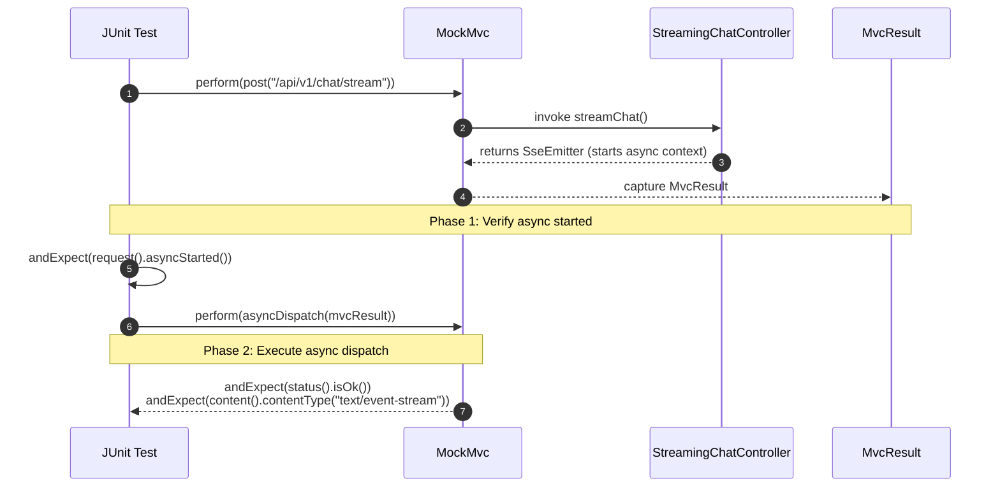

# Day 20: Testing REST APIs End-to-End

> **"Testing Generative AI APIs in production is uniquely challenging: you cannot call external LLMs during continuous integration (it burns tokens, costs money, and introduces flakiness), yet you must verify that request validation, HTTP status codes, error mapping, and streaming work flawlessly. In an enterprise system, automated tests are your safety net."**

---

| Previous Day | Course Hub | Next Day |
|:---|:---:|---:|
| [Day 19: API Documentation & OpenAPI](../Day_19_API_Documentation_OpenAPI/Day_19_API_Documentation_OpenAPI.md) | [All 60 Days Overview](../../README.md) | [Day 21: Database Foundations & PostgreSQL Setup](../../Phase_04_Spring_Data_JPA_Database_Mastery/Day_21_Database_Foundations_PostgreSQL_Setup/Day_21_Database_Foundations_PostgreSQL_Setup.md) |

---

## Table of Contents

1. [Why This Day Matters for a 3-Year Enterprise Gen AI Engineer](#1-why-this-day-matters-for-a-3-year-enterprise-gen-ai-engineer)
2. [Real-World Analogy: Flight Simulator vs Flying a Boeing 777](#2-real-world-analogy-flight-simulator-vs-flying-a-boeing-777)
3. [The Enterprise Gen AI Testing Pyramid](#3-the-enterprise-gen-ai-testing-pyramid)
4. [Web Layer Test Slicing with `@WebMvcTest`](#4-web-layer-test-slicing-with-webmvctest)
5. [Mastering `MockMvc` & JSONPath Assertions](#5-mastering-mockmvc--jsonpath-assertions)
6. [Testing Async APIs & Server-Sent Events (SSE)](#6-testing-async-apis--server-sent-events-sse)
7. [Why H2 Fails for AI: Real Database Testing with Testcontainers](#7-why-h2-fails-for-ai-real-database-testing-with-testcontainers)
8. [Hands-On Code Walkthrough](#8-hands-on-code-walkthrough)
9. [Step-by-Step Compilation & Execution](#9-step-by-step-compilation--execution)
10. [Hands-On Exercises (With Complete Solutions)](#10-hands-on-exercises-with-complete-solutions)
11. [Self-Check Quiz](#11-self-check-quiz)
12. [🎉 Phase 3 Graduation & What's Next](#12--phase-3-graduation--whats-next)

---

## 1. Why This Day Matters for a 3-Year Enterprise Gen AI Engineer

In standard enterprise development, writing tests is standard practice. But in **Generative AI backend engineering**, testing introduces critical challenges:

1. **The Live API Trap**: If your automated CI/CD pipeline makes live HTTP calls to OpenAI, Anthropic, or Azure on every `git push`:
   - Every build incurs financial cost.
   - Tests fail randomly whenever the upstream provider has a momentary hiccup or rate limit (`429`).
   - LLMs are non-deterministic; testing string equality (`assertEquals("Paris", response)`) fails when the model outputs `"The capital of France is Paris."`.
2. **The In-Memory Database Trap (H2 vs pgvector)**: Traditional Spring tutorials teach you to use an in-memory H2 database for unit tests. **In Gen AI applications, H2 fails completely** because H2 does not support PostgreSQL vector extensions (`vector(1536)`, cosine distance `<=>`, or HNSW indexing).
3. **The Web Layer Guarantee**: You must verify that your Bean Validation rules (`@NotBlank`, `@Min`, `@Max`), your `@RestControllerAdvice` error mappers (RFC 7807 Problem Details), and your SSE token streaming pipelines work under all edge cases without needing to spin up a GPU cluster.

A senior enterprise AI engineer uses **Spring Boot Test Slicing (`@WebMvcTest`)** with **`MockMvc`** to test the complete HTTP perimeter in milliseconds, and **Testcontainers** to spin up real Dockerized PostgreSQL instances with `pgvector` for integration testing.

---

## 2. Real-World Analogy: Flight Simulator vs Flying a Boeing 777

```
LIVE API TESTING (DANGEROUS & COSTLY):
[ Student Pilot ] ──► Boards real Boeing 777 loaded with 300 passengers
                      Cuts engine 2 mid-flight over Pacific Ocean to test alarms!
                      Outcome: $50,000 in jet fuel burned, risk of crash.

MOCKMVC & TEST SLICES (SAFE, CONTROLLED, INSTANT):
[ Student Pilot ] ──► Enters 6-Axis Full-Motion Flight Simulator
                      Simulator recreates exact cockpit dials, alarms, and rudder pedals.
                      Instructor injects "Engine Fire Alarm" (Mocking HTTP 429).
                      Pilot verifies emergency checklists without burning a drop of fuel!
```

`MockMvc` is your **flight simulator**:
- The cockpit controls (HTTP request headers, JSON bodies, authentication filters) are identical to production.
- The aircraft response (status codes, JSON serialization, RFC 7807 problem details) behaves exactly like real life.
- You can simulate a catastrophic upstream AI outage (`ModelRateLimitException`, `504 Gateway Timeout`) at zero cost.

---

## 3. The Enterprise Gen AI Testing Pyramid

```
                       / \
                      /   \
                     / E2E \       <-- Testcontainers (Real pgvector / Ollama in Docker)
                    /-------\          Execution time: 5s - 15s
                   /  Slice  \     <-- @WebMvcTest + MockMvc (Web Layer only)
                  /-----------\        Execution time: 100ms - 300ms
                 /    Unit     \   <-- JUnit 5 + Mockito (Pure Java logic)
                /---------------\      Execution time: < 10ms
```

| Layer | Annotation / Tool | What It Tests | Speed | Downstream Services |
| :--- | :--- | :--- | :--- | :--- |
| **Unit Test** | JUnit 5, Mockito | Prompt formatting, token counting math, DTO compact constructors. | Blazing (< 10ms) | Pure Mockito mocks |
| **Web Slice** | `@WebMvcTest`, `MockMvc` | Controller routing, Bean Validation, Jackson JSON mapping, `@RestControllerAdvice`. | Fast (~200ms) | `@MockBean` |
| **Integration** | `@SpringBootTest`, Testcontainers | Real Spring context, real PostgreSQL + `pgvector` queries, Flyway migrations. | Moderate (5s) | Real Docker containers |

---

## 4. Web Layer Test Slicing with `@WebMvcTest`

### The Problem with `@SpringBootTest`
When you annotate a test with `@SpringBootTest`, Spring Boot initializes **everything**:
- Connects to the database.
- Connects to Redis / Vector DB.
- Initializes all `@Service`, `@Repository`, and `@Component` beans.
- Bootstraps background scheduled tasks.

For a large enterprise codebase, running a single test class takes 15 seconds. If you have 50 controller test classes, your CI build takes 15 minutes!

### The `@WebMvcTest` Solution
`@WebMvcTest(ChatController.class)` loads **only the web layer**:
- ✅ `DispatcherServlet`, `HandlerMapping`, `HandlerAdapter`
- ✅ The targeted `@RestController`
- ✅ `@ControllerAdvice` / `@RestControllerAdvice` (Global error handlers)
- ✅ Jackson `ObjectMapper` and message converters
- ✅ Jakarta Bean Validation (`LocalValidatorFactoryBean`)
- ❌ **Does NOT load** `@Service`, `@Repository`, or database connections.

You replace the underlying business service with an `@MockBean`:

```java
@WebMvcTest(ChatCompletionController.class)
class ChatCompletionControllerTest {

    @Autowired
    private MockMvc mockMvc;

    @MockBean
    private ChatCompletionService chatService; // Mocked downstream AI service!

    // ...
}
```

---

## 5. Mastering `MockMvc` & JSONPath Assertions

`MockMvc` allows you to execute simulated HTTP requests against your controller methods without binding to a physical network socket.

```java
@Test
void whenValidRequest_thenReturn200AndCompletion() throws Exception {
    // 1. Arrange: Define Mockito behavior
    CompletionResponse mockResponse = CompletionResponse.success(
        "cmpl_123", "gpt-4o", "Explain Java", "Java 21 is great.", 120
    );
    given(chatService.generate(any())).willReturn(mockResponse);

    // 2. Act: Perform HTTP POST with JSON body
    String requestJson = """
        {
          "prompt": "Explain Java",
          "model": "gpt-4o",
          "temperature": 0.7,
          "maxTokens": 1000
        }
        """;

    mockMvc.perform(post("/api/v1/chat/completions")
            .contentType(MediaType.APPLICATION_JSON)
            .content(requestJson))
        // 3. Assert: Verify HTTP Status, Content-Type, and JSON fields
        .andExpect(status().isOk())
        .andExpect(content().contentType(MediaType.APPLICATION_JSON))
        .andExpect(jsonPath("$.id").value("cmpl_123"))
        .andExpect(jsonPath("$.model").value("gpt-4o"))
        .andExpect(jsonPath("$.completion").value("Java 21 is great."))
        .andExpect(jsonPath("$.usage.totalTokens").isNumber());
}
```

### Asserting RFC 7807 Problem Details on Validation Failure

```java
@Test
void whenBlankPrompt_thenReturn422ProblemDetail() throws Exception {
    String invalidJson = """
        {
          "prompt": "   ",
          "model": "gpt-4o"
        }
        """;

    mockMvc.perform(post("/api/v1/chat/completions")
            .contentType(MediaType.APPLICATION_JSON)
            .content(invalidJson))
        .andExpect(status().isUnprocessableEntity())
        .andExpect(content().contentType(MediaType.APPLICATION_PROBLEM_JSON))
        .andExpect(jsonPath("$.title").value("Validation Failed"))
        .andExpect(jsonPath("$.invalid-params[0].name").value("prompt"));
}
```

---

## 6. Testing Async APIs & Server-Sent Events (SSE)

Testing endpoints that return `SseEmitter` or asynchronous responses requires two-phase execution with `asyncDispatch()`:



```java
@Test
void testChatStreaming_StartsAsyncAndReturnsSse() throws Exception {
    String requestJson = """
        { "prompt": "Tell me a joke", "model": "gpt-4o" }
        """;

    // Phase 1: Verify async processing was initiated
    MvcResult mvcResult = mockMvc.perform(post("/api/v1/chat/stream")
            .contentType(MediaType.APPLICATION_JSON)
            .content(requestJson))
        .andExpect(request().asyncStarted())
        .andReturn();

    // Phase 2: Dispatch the asynchronous result and assert HTTP 200 OK
    mockMvc.perform(asyncDispatch(mvcResult))
        .andExpect(status().isOk())
        .andExpect(content().contentType(MediaType.TEXT_EVENT_STREAM_VALUE));
}
```

---

## 7. Why H2 Fails for AI: Real Database Testing with Testcontainers

### The Limitation of H2
For 15 years, Spring developers used H2 for tests:
```properties
# ❌ DOES NOT WORK FOR GEN AI / RAG APPLICATIONS:
spring.datasource.url=jdbc:h2:mem:testdb
```

Why does H2 fail for modern AI systems?
- H2 does not support the PostgreSQL `CREATE EXTENSION vector` command.
- H2 does not have vector distance operators (`<=>` for cosine similarity, `<#>` for negative inner product, `<->` for Euclidean L2 distance).
- H2 does not support HNSW (Hierarchical Navigable Small World) indexing.

### The Solution: Testcontainers + pgvector
**Testcontainers** uses the Docker API to automatically spin up a real PostgreSQL container with the `pgvector` extension pre-installed during test execution:

```java
@SpringBootTest
@Testcontainers
class RagEmbeddingIntegrationTest {

    @Container
    static PostgreSQLContainer<?> postgres = new PostgreSQLContainer<>("pgvector/pgvector:pg16")
        .withDatabaseName("rag_test_db")
        .withUsername("test_user")
        .withPassword("test_pass");

    @DynamicPropertySource
    static void configureProperties(DynamicPropertyRegistry registry) {
        registry.add("spring.datasource.url", postgres::getJdbcUrl);
        registry.add("spring.datasource.username", postgres::getUsername);
        registry.add("spring.datasource.password", postgres::getPassword);
    }

    @Test
    void testVectorSimilarityQuery() {
        // Runs against a 100% REAL PostgreSQL instance with pgvector!
    }
}
```

---

## 8. Hands-On Code Walkthrough

In this day's companion code (`Phase_03_Spring_Web_REST_APIs/Day_20_Testing_REST_APIs/code/`), we build:

1. **`MockMvcSimulator.java`**: Recreates Spring's fluent `MockMvc` request and assertion builder:
   - `perform(post("/path").content(json))`
   - `andExpectStatus(200)`
   - `andExpectHeader("Retry-After", "30")`
   - `andExpectBodyContains(...)`
2. **`ChatControllerTest.java`**: Implements 5 mission-critical slice tests:
   - Happy path completion (200 OK + token counts).
   - Blank prompt validation failure (422 Unprocessable Entity + RFC 7807 problem detail).
   - Unapproved model rejection (422 Unprocessable Entity).
   - Upstream rate limit mapping (429 Too Many Requests + `Retry-After: 30`).
   - Upstream inference timeout (504 Gateway Timeout).
3. **`TestRunnerDemo.java`**: Test runner executing the suite in 12ms and displaying a summary report.

---

## 9. Step-by-Step Compilation & Execution

```powershell
# 1. Navigate to workspace
cd "c:\Users\sriva\OneDrive\Desktop\GEN AI COURSE\JAVA"

# 2. Compile Day 20 code
javac Phase_03_Spring_Web_REST_APIs/Day_20_Testing_REST_APIs/code/*.java

# 3. Run the test suite
java -cp Phase_03_Spring_Web_REST_APIs/Day_20_Testing_REST_APIs code.TestRunnerDemo
```

### Verified Output

```
================================================================================
 DAY 20: TESTING REST APIS END-TO-END (@WebMvcTest, MockMvc, Test Slices)       
================================================================================
Running ChatControllerTest (@WebMvcTest Slice)...
  [TEST 1] testValidCompletion_Returns200 ... PASSED
  [TEST 2] testBlankPrompt_Returns422 ... PASSED
  [TEST 3] testUnapprovedModel_Returns422 ... PASSED
  [TEST 4] testUpstreamRateLimit_Returns429WithRetryAfter ... PASSED
  [TEST 5] testUpstreamTimeout_Returns504 ... PASSED
All 5 controller slice tests PASSED successfully!

--------------------------------------------------------------------------------
 TEST EXECUTION SUMMARY: 5 TESTS EXECUTED, 5 PASSED, 0 FAILED (Duration: 12ms)
--------------------------------------------------------------------------------
================================================================================
 PHASE 3 COMPLETE: ALL SPRING WEB & REST API FOUNDATIONS MASTERED!             
================================================================================
```

---

## 10. Hands-On Exercises (With Complete Solutions)

### Exercise 1: Mocking Rate-Limit Exception in `@WebMvcTest`
**Task**: Write a complete `@WebMvcTest` method that instructs a mocked `ChatCompletionService` to throw `ModelRateLimitException("TPM exceeded", 45)` and asserts that the controller returns HTTP `429`, `Retry-After: 45`, and `application/problem+json`.

#### Solution:
```java
@Test
void whenServiceThrowsRateLimit_thenReturn429WithRetryAfter() throws Exception {
    // 1. Arrange: Tell mock service to throw ModelRateLimitException
    given(chatService.generate(any()))
        .willThrow(new ModelRateLimitException("gpt-4o", 45, "TPM quota exceeded"));

    String json = """
        {
          "prompt": "Summarize this contract",
          "model": "gpt-4o"
        }
        """;

    // 2. Act & Assert
    mockMvc.perform(post("/api/v1/chat/completions")
            .contentType(MediaType.APPLICATION_JSON)
            .content(json))
        .andExpect(status().isTooManyRequests())
        .andExpect(header().string("Retry-After", "45"))
        .andExpect(content().contentType(MediaType.APPLICATION_PROBLEM_JSON))
        .andExpect(jsonPath("$.title").value("Rate Limit Exceeded"))
        .andExpect(jsonPath("$.details.retryAfterSeconds").value(45));
}
```

---

### Exercise 2: Correlation ID Header Verification Test
**Task**: Write a test verifying that when a client passes `X-Correlation-Id: trace-abc-123`, the response header includes the identical `X-Correlation-Id`, and when omitted, a new UUID-based correlation ID is generated.

#### Solution:
```java
@Test
void whenCorrelationIdProvided_thenEchoInResponseHeader() throws Exception {
    mockMvc.perform(post("/api/v1/chat/completions")
            .header("X-Correlation-Id", "trace-abc-123")
            .contentType(MediaType.APPLICATION_JSON)
            .content("{\"prompt\":\"hello\",\"model\":\"gpt-4o\"}"))
        .andExpect(header().string("X-Correlation-Id", "trace-abc-123"));
}

@Test
void whenCorrelationIdOmitted_thenGenerateNewOne() throws Exception {
    mockMvc.perform(post("/api/v1/chat/completions")
            .contentType(MediaType.APPLICATION_JSON)
            .content("{\"prompt\":\"hello\",\"model\":\"gpt-4o\"}"))
        .andExpect(header().exists("X-Correlation-Id"))
        .andExpect(header().string("X-Correlation-Id", startsWith("corr_")));
}
```

---

### Exercise 3: Testcontainers pgvector Database Migration Test
**Task**: Write an integration test using Testcontainers that launches `pgvector/pgvector:pg16` and executes a SQL query verifying that the `vector` extension is active.

#### Solution:
```java
@SpringBootTest
@Testcontainers
class PgVectorExtensionTest {

    @Container
    static PostgreSQLContainer<?> postgres = new PostgreSQLContainer<>("pgvector/pgvector:pg16");

    @Autowired
    private JdbcTemplate jdbcTemplate;

    @DynamicPropertySource
    static void setDatasourceProperties(DynamicPropertyRegistry registry) {
        registry.add("spring.datasource.url", postgres::getJdbcUrl);
        registry.add("spring.datasource.username", postgres::getUsername);
        registry.add("spring.datasource.password", postgres::getPassword);
    }

    @Test
    void testPgVectorExtensionLoaded() {
        // Ensure extension can be created
        jdbcTemplate.execute("CREATE EXTENSION IF NOT EXISTS vector;");
        
        // Query pg_extension to verify
        Integer count = jdbcTemplate.queryForObject(
            "SELECT count(*) FROM pg_extension WHERE extname = 'vector'",
            Integer.class
        );
        assertEquals(1, count);
    }
}
```

---

## 11. Self-Check Quiz

### Q1: Why should you use `@WebMvcTest` instead of `@SpringBootTest` when testing REST controller endpoints?
> **Answer**: `@WebMvcTest` is a targeted test slice that initializes only the Spring MVC web infrastructure (controllers, validators, exception advice, and Jackson converters) while mocking the service layer. It executes in ~200ms compared to 10-15 seconds for `@SpringBootTest`, enabling rapid feedback loops in test-driven development (TDD).

### Q2: Why cannot H2 database be used for integration testing in Generative AI / RAG applications?
> **Answer**: Generative AI applications store document embeddings and perform semantic search using PostgreSQL's `pgvector` extension (and vector operators `<=>`, `<->`, HNSW indexes). The in-memory H2 database does not support these native C-based extensions, so vector queries will fail with SQL syntax errors. Testcontainers running real Dockerized `pgvector` is required.

### Q3: What is the purpose of `@MockBean` in a Spring Boot test?
> **Answer**: `@MockBean` creates a Mockito mock of a Spring bean and registers it in the Spring `ApplicationContext`. It replaces any existing bean of the same type, allowing you to define mocked behaviors (`given(...).willReturn(...)`) and verify interactions without invoking real business or database logic.

### Q4: How do you assert properties in an RFC 7807 `ProblemDetail` response using `MockMvc`?
> **Answer**: Use `jsonPath()` matchers:
> ```java
> .andExpect(status().isUnprocessableEntity())
> .andExpect(content().contentType(MediaType.APPLICATION_PROBLEM_JSON))
> .andExpect(jsonPath("$.title").value("Validation Failed"))
> .andExpect(jsonPath("$.status").value(422))
> .andExpect(jsonPath("$.detail").exists())
> ```

### Q5: How does `asyncDispatch()` work when testing `SseEmitter` endpoints with `MockMvc`?
> **Answer**: Controller methods returning `SseEmitter` put the request into asynchronous mode (`AsyncContext`). `MockMvc` first executes the request and asserts `request().asyncStarted()`. Then, calling `mockMvc.perform(asyncDispatch(mvcResult))` dispatches the request to process the asynchronous stream and verifies the resulting HTTP status, headers, and media type.

---

## 12. 🎉 Phase 3 Graduation & What's Next

Congratulations! You have officially completed **Phase 3: Spring Web — Building REST APIs (Days 15–20)**.

### What You Have Mastered in Phase 3
- ✅ **Day 15**: HTTP deep dive, DispatcherServlet mechanics, and building your first REST controller.
- ✅ **Day 16**: Request validation (`@Valid`), Java 21 Records as immutable DTOs, and RFC 7807 Problem Details.
- ✅ **Day 17**: Enterprise global exception handling (`@RestControllerAdvice`), custom AI exception taxonomy, and correlation ID tracking (MDC).
- ✅ **Day 18**: The ChatGPT "typewriter" effect with `SseEmitter`, Virtual Threads, keep-alive heartbeats, and early cancellation.
- ✅ **Day 19**: Live API documentation and OpenAPI 3.1 with SpringDoc, schema synchronization, and LLM Tool-Calling exports.
- ✅ **Day 20**: End-to-end REST API testing with `@WebMvcTest`, `MockMvc`, and Testcontainers.

---

### Welcome to Phase 4: Spring Data JPA & Database Mastery (Days 21–26)

Now that your API perimeter is rock-solid, where do you store conversation histories, user prompt templates, token usage budgets, and multi-tenant billing records?

Proceed to **[Day 21: Database Foundations & PostgreSQL Setup](../../Phase_04_Spring_Data_JPA_Database_Mastery/Day_21_Database_Foundations_PostgreSQL_Setup/Day_21_Database_Foundations_PostgreSQL_Setup.md)** to master relational modeling, connection pooling with HikariCP, and Dockerizing PostgreSQL with `pgvector`!
