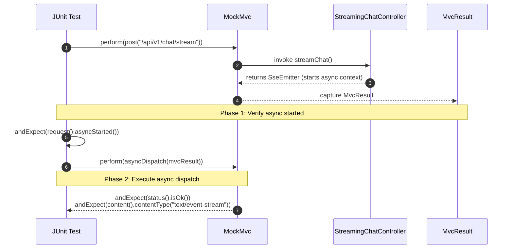

# 🧪 Day 20: Testing REST APIs End-to-End
## Web Layer Test Slicing with `@WebMvcTest`, `MockMvc`, JSONPath & Testcontainers

| ⬅️ Previous Day | 📚 Course Hub | ➡️ Next Day |
|:---|:---:|---:|
| [← Day 19: API Documentation & OpenAPI](../Day_19_API_Documentation_OpenAPI/Day_19_API_Documentation_OpenAPI.md) | [All 60 Days Overview](../../README.md) | [Day 21: Database Foundations & PostgreSQL Setup →](../../Phase_04_Spring_Data_JPA_Database_Mastery/Day_21_Database_Foundations_PostgreSQL_Setup/Day_21_Database_Foundations_PostgreSQL_Setup.md) |

[](../../README.md)
[](../../README.md)
[](../../README.md)
[](../../README.md)

---

## 1. Topic Overview

Automated REST API testing verifies that web controllers, request validation rules, exception advisors, and response serialization pipelines function with absolute mathematical precision without incurring third-party cloud costs. In enterprise Generative AI engineering, where calling production LLMs in continuous integration builds burns expensive API credits and introduces non-deterministic flakiness, test slicing with `@WebMvcTest`, `MockMvc`, and `Testcontainers` provides high-speed, deterministic verification of the entire API perimeter in milliseconds.

---

## 2. Basic Foundations (True Zero)

### Plain English Definitions
- **Unit Test**: A test focused exclusively on a single Java method or record in isolation, executing in microseconds with zero network or database dependencies.
- **Mock (`@MockBean`)**: A simulated stunt-double object injected into the Spring test context that returns pre-programmed responses (e.g. `given(service.generate(...)).willReturn(...)`) instead of invoking slow or billable real services.
- **`MockMvc`**: A Spring testing framework component that simulates HTTP client requests (`GET`, `POST`, `PUT`, `DELETE`) against controllers without booting a physical network socket or Tomcat server.
- **Test Slicing (`@WebMvcTest`)**: An annotation that bootstraps only the Spring MVC web layer (controllers, validators, exception advice, Jackson mappers) while skipping database connections and heavy background services, running tests in ~200 milliseconds.
- **JSONPath (`jsonPath("$.status")`)**: A standardized query syntax for JSON payloads that enables targeted assertions on response fields, arrays, and nested attributes.
- **Testcontainers**: A Java testing library that automatically provisions real Docker containers (such as PostgreSQL with `pgvector`) during integration test runs and tears them down cleanly upon completion.

### Relatable Physical Analogy: Flight Simulator vs. Flying a Boeing 777
```
LIVE API TESTING (DANGEROUS & COSTLY):
[ Student Pilot ] ──► Boards real Boeing 777 loaded with 300 passengers.
                      Shuts down Engine 2 mid-flight over Pacific Ocean to test alarms!
                      Outcome: $50,000 in jet fuel burned, extreme safety risk.

MOCKMVC & TEST SLICES (SAFE, CONTROLLED, INSTANT):
[ Student Pilot ] ──► Enters 6-Axis Full-Motion Flight Simulator.
                      Simulator recreates exact cockpit dials, alarms, and rudder pedals.
                      Instructor injects "Engine Fire Alarm" (Mocking HTTP 429).
                      Pilot verifies emergency checklists without burning a drop of fuel!
```

`MockMvc` is your **enterprise flight simulator**:
- The cockpit controls (HTTP headers, JSON payloads, authentication tokens) match production exactly.
- The aircraft response (status codes, JSON serialization, RFC 7807 problem details) behaves identical to real life.
- You can simulate a catastrophic upstream AI outage (`ModelRateLimitException`, `504 Gateway Timeout`) at zero financial cost.

### Minimal Beginner-Friendly Working Code Example

Let us examine a minimal `@WebMvcTest` that tests a controller endpoint using `MockMvc`:

```java
package com.javagenai.day20;

import org.junit.jupiter.api.Test;
import org.springframework.beans.factory.annotation.Autowired;
import org.springframework.boot.test.autoconfigure.web.servlet.WebMvcTest;
import org.springframework.http.MediaType;
import org.springframework.test.web.servlet.MockMvc;

import static org.springframework.test.web.servlet.request.MockMvcRequestBuilders.get;
import static org.springframework.test.web.servlet.result.MockMvcResultMatchers.*;

@WebMvcTest(MinimalHelloController.class)
public class MinimalMockMvcTest {

    @Autowired
    private MockMvc mockMvc;

    @Test
    void testHelloEndpoint_Returns200AndJson() throws Exception {
        mockMvc.perform(get("/api/v1/hello")
                .accept(MediaType.APPLICATION_JSON))
            .andExpect(status().isOk())
            .andExpect(content().contentType(MediaType.APPLICATION_JSON))
            .andExpect(jsonPath("$.status").value("ONLINE"));
    }
}
```

#### Line-by-Line Walkthrough
1. `@WebMvcTest(MinimalHelloController.class)`: Boots only the Spring MVC infrastructure and the specified controller.
2. `@Autowired private MockMvc mockMvc`: Injects the mock HTTP dispatcher.
3. `mockMvc.perform(get("/api/v1/hello"))`: Dispatches a simulated HTTP `GET` request.
4. `.andExpect(status().isOk())`: Verifies HTTP status `200 OK`.
5. `.andExpect(jsonPath("$.status").value("ONLINE"))`: Queries the returned JSON payload using JSONPath syntax.

---

## 3. Core Concept Walkthrough (Basic → Intermediate)

### 3.1 The Enterprise Gen AI Testing Pyramid

```
                       / \
                      /   \
                     / E2E \       <-- Testcontainers (Real pgvector / Ollama in Docker)
                    /-------\          Execution time: 5s - 15s
                   /  Slice  \     <-- @WebMvcTest + MockMvc (Web Layer only)
                  /-----------\        Execution time: 100ms - 300ms
                 /    Unit     \   <-- JUnit 5 + Mockito (Pure Java logic)
                /---------------\      Execution time: < 10ms
```

| Layer | Target | Tooling | Execution Speed | Downstream Dependencies |
| :--- | :--- | :--- | :--- | :--- |
| **Unit Tests** | Single method, DTO normalization | JUnit 5, Mockito | Blazing (< 10ms) | Pure Mockito stubs |
| **Web Slice** | Controllers, validation, advice | `@WebMvcTest`, `MockMvc` | Fast (~200ms) | Mocked via `@MockBean` |
| **Integration**| Real JPA queries, pgvector | `@SpringBootTest`, Testcontainers | Moderate (5s - 15s) | Real Dockerized databases |

### 3.2 Testing Happy Path Completions with `MockMvc`
When testing a controller that depends on an AI service, mock the service interface:

```java
package com.javagenai.day20.test;

import com.javagenai.day20.controller.ChatCompletionController;
import com.javagenai.day20.service.ChatCompletionService;
import com.javagenai.day20.dto.CompletionResponse;
import org.junit.jupiter.api.Test;
import org.springframework.beans.factory.annotation.Autowired;
import org.springframework.boot.test.autoconfigure.web.servlet.WebMvcTest;
import org.springframework.boot.test.mock.mockito.MockBean;
import org.springframework.http.MediaType;
import org.springframework.test.web.servlet.MockMvc;

import static org.mockito.ArgumentMatchers.any;
import static org.mockito.BDDMockito.given;
import static org.springframework.test.web.servlet.request.MockMvcRequestBuilders.post;
import static org.springframework.test.web.servlet.result.MockMvcResultMatchers.*;

@WebMvcTest(ChatCompletionController.class)
class ChatCompletionControllerTest {

    @Autowired
    private MockMvc mockMvc;

    @MockBean
    private ChatCompletionService chatService;

    @Test
    void whenValidRequest_thenReturn200AndCompletion() throws Exception {
        CompletionResponse mockResponse = new CompletionResponse("cmpl_123", "gpt-4o", "Java 21 is great.", 42);
        given(chatService.generate(any())).willReturn(mockResponse);

        String requestJson = """
            {
              "prompt": "Explain Java",
              "model": "gpt-4o",
              "temperature": 0.7,
              "maxTokens": 1000
            }
            """;

        mockMvc.perform(post("/api/v1/chat/completions")
                .contentType(MediaType.APPLICATION_JSON)
                .content(requestJson))
            .andExpect(status().isOk())
            .andExpect(content().contentType(MediaType.APPLICATION_JSON))
            .andExpect(jsonPath("$.id").value("cmpl_123"))
            .andExpect(jsonPath("$.model").value("gpt-4o"))
            .andExpect(jsonPath("$.completion").value("Java 21 is great."));
    }
}
```

### 3.3 Asserting Validation Failures & RFC 7807 Problem Details
Verify that invalid client input is rejected before entering business logic:

```java
@Test
void whenBlankPrompt_thenReturn422ProblemDetail() throws Exception {
    String invalidJson = """
        {
          "prompt": "   ",
          "model": "gpt-4o"
        }
        """;

    mockMvc.perform(post("/api/v1/chat/completions")
            .contentType(MediaType.APPLICATION_JSON)
            .content(invalidJson))
        .andExpect(status().isUnprocessableEntity())
        .andExpect(content().contentType(MediaType.APPLICATION_PROBLEM_JSON))
        .andExpect(jsonPath("$.title").value("Validation Failed"))
        .andExpect(jsonPath("$.invalid-params[0].name").value("prompt"));
}
```

### 3.4 Testing Async APIs & Server-Sent Events (SSE)
Because `SseEmitter` operates asynchronously, testing it requires two-phase execution with `asyncDispatch()`:



```java
@Test
void testChatStreaming_StartsAsyncAndReturnsSse() throws Exception {
    String requestJson = """
        { "prompt": "Tell me a joke", "model": "gpt-4o" }
        """;

    // Phase 1: Verify asynchronous dispatch was initiated
    MvcResult mvcResult = mockMvc.perform(post("/api/v1/chat/stream")
            .contentType(MediaType.APPLICATION_JSON)
            .content(requestJson))
        .andExpect(request().asyncStarted())
        .andReturn();

    // Phase 2: Dispatch the asynchronous result and assert HTTP 200 OK
    mockMvc.perform(asyncDispatch(mvcResult))
        .andExpect(status().isOk())
        .andExpect(content().contentType(MediaType.TEXT_EVENT_STREAM_VALUE));
}
```

---

## 4. Prerequisite & Supporting Concepts

### Prerequisite / Supporting Concept: Why H2 Fails for Vector AI Testing
For 15 years, tutorials recommended in-memory H2 databases for testing. In Generative AI systems, **H2 fails completely**:
- H2 cannot execute PostgreSQL's `CREATE EXTENSION vector;`.
- H2 does not support vector distance operators (`<=>` for cosine similarity, `<#>` for dot product).
- H2 does not support HNSW vector indexes.

### Prerequisite / Supporting Concept: The Testcontainers Solution
Testcontainers launches a real, temporary PostgreSQL instance containing the `pgvector` extension inside Docker during test execution:

```java
@SpringBootTest
@Testcontainers
class RagEmbeddingIntegrationTest {

    @Container
    static PostgreSQLContainer<?> postgres = new PostgreSQLContainer<>("pgvector/pgvector:pg16")
        .withDatabaseName("rag_test_db")
        .withUsername("test_user")
        .withPassword("test_pass");

    @DynamicPropertySource
    static void configureProperties(DynamicPropertyRegistry registry) {
        registry.add("spring.datasource.url", postgres::getJdbcUrl);
        registry.add("spring.datasource.username", postgres::getUsername);
        registry.add("spring.datasource.password", postgres::getPassword);
    }
}
```

---

## 5. Advanced Depth (Intermediate → Advanced)

### 5.1 Simulating Upstream Outages: Rate Limits & Timeouts
Verify that custom `@RestControllerAdvice` error mappers handle upstream faults gracefully:

```java
@Test
void whenUpstreamRateLimitOccurs_thenReturn429WithRetryAfterHeader() throws Exception {
    given(chatService.generate(any()))
        .willThrow(new ModelRateLimitException("gpt-4o", 45, "TPM limit exceeded"));

    mockMvc.perform(post("/api/v1/chat/completions")
            .contentType(MediaType.APPLICATION_JSON)
            .content("{\"prompt\":\"summarize\",\"model\":\"gpt-4o\"}"))
        .andExpect(status().isTooManyRequests())
        .andExpect(header().string("Retry-After", "45"))
        .andExpect(content().contentType(MediaType.APPLICATION_PROBLEM_JSON))
        .andExpect(jsonPath("$.title").value("Rate Limit Exceeded"));
}
```

### 5.2 Common Mistakes & Misconceptions

#### Mistake 1: Using `@SpringBootTest` for Simple Controller Route Testing
`@SpringBootTest` bootstraps the entire application context, taking 10–15 seconds per test file. Use `@WebMvcTest` to test controllers in ~200 milliseconds.

#### Mistake 2: Calling Live AI Models in CI/CD Pipelines
Never invoke live OpenAI or Anthropic APIs during automated test runs. It burns money, leaks credentials to build workers, and causes builds to fail randomly due to network latency.

---

## 6. Quick Recap

| Testing Construct | Annotation / Tool | Execution Scope | Enterprise AI Purpose |
| :--- | :--- | :--- | :--- |
| **Web Slice** | `@WebMvcTest` | Controller + Advice layer only | Rapid testing of perimeter routing and DTO validation |
| **Mock Dispatcher** | `MockMvc` | In-memory HTTP client | Simulates HTTP requests without network sockets |
| **Service Mock** | `@MockBean` | Injected Mockito stub | Stubs AI responses and simulates upstream rate limits |
| **JSON Query** | `jsonPath()` | JSON payload assertion | Verifies RFC 7807 problem detail fields |
| **Async Dispatch** | `asyncDispatch()` | Resumes async request | Verifies `SseEmitter` streaming responses |
| **Vector DB Container**| `Testcontainers` | Real Docker container | Runs pgvector cosine similarity tests against real PostgreSQL |

---

## 7. Self-Check Questions & Practice Exercises

### Self-Check Questions

1. **Why is `@WebMvcTest` preferred over `@SpringBootTest` for testing REST controllers?**
   - *Answer*: `@WebMvcTest` boots only the web infrastructure (controllers, validation, exception advice, Jackson converters) while mocking the service layer. It executes in ~200ms compared to 10–15 seconds for `@SpringBootTest`, dramatically accelerating build pipelines.
2. **Why can an in-memory H2 database not be used for integration testing in RAG applications?**
   - *Answer*: H2 does not support PostgreSQL's native C-based `pgvector` extension, its vector distance operators (`<=>`), or HNSW indexing. Vector queries will fail with syntax errors. Real containerized PostgreSQL via Testcontainers is required.
3. **What is the function of `@MockBean` in a Spring Boot test?**
   - *Answer*: It creates a Mockito mock of a Spring bean, registers it in the test `ApplicationContext`, and replaces any real bean of that type, allowing developers to define return values and simulate exceptions.
4. **How do you verify RFC 7807 Problem Details responses using `MockMvc`?**
   - *Answer*: By asserting the HTTP status, media type (`application/problem+json`), and JSONPath properties (`jsonPath("$.title")`, `jsonPath("$.status")`, `jsonPath("$.invalid-params")`).
5. **How does `asyncDispatch()` work when testing Server-Sent Events endpoints?**
   - *Answer*: Because `SseEmitter` puts the request into asynchronous mode, `MockMvc` first verifies `request().asyncStarted()`. Then `mockMvc.perform(asyncDispatch(mvcResult))` processes the async stream and asserts the resulting HTTP status, headers, and media type.

---

### Hands-On Practice Exercises

#### 🏋️ Exercise 1: Write a Rate-Limit Exception Mock Test
**Objective**: Construct a `@WebMvcTest` method verifying that when the mocked service throws `ModelRateLimitException`, the controller responds with HTTP 429 and a `Retry-After: 30` header:

```java
package com.javagenai.day20;

import org.junit.jupiter.api.Test;
import org.springframework.beans.factory.annotation.Autowired;
import org.springframework.boot.test.autoconfigure.web.servlet.WebMvcTest;
import org.springframework.boot.test.mock.mockito.MockBean;
import org.springframework.http.MediaType;
import org.springframework.test.web.servlet.MockMvc;

import static org.mockito.ArgumentMatchers.any;
import static org.mockito.BDDMockito.given;
import static org.springframework.test.web.servlet.request.MockMvcRequestBuilders.post;
import static org.springframework.test.web.servlet.result.MockMvcResultMatchers.*;

@WebMvcTest(ChatController.class)
public class RateLimitMockTest {

    @Autowired
    private MockMvc mockMvc;

    @MockBean
    private ChatService chatService;

    @Test
    void whenUpstreamRateLimited_thenReturn429WithRetryAfter() throws Exception {
        given(chatService.generate(any()))
            .willThrow(new ModelRateLimitException("gpt-4o", 30, "TPM limit exceeded"));

        mockMvc.perform(post("/api/v1/chat")
                .contentType(MediaType.APPLICATION_JSON)
                .content("{\"prompt\":\"hello\",\"model\":\"gpt-4o\"}"))
            .andExpect(status().isTooManyRequests())
            .andExpect(header().string("Retry-After", "30"))
            .andExpect(content().contentType(MediaType.APPLICATION_PROBLEM_JSON))
            .andExpect(jsonPath("$.title").value("Rate Limit Exceeded"));
    }
}
```

#### 🏋️ Exercise 2: Write a Correlation ID Echo Test
**Objective**: Write a test verifying that passing `X-Correlation-Id: trace-12345` echos the identical header in the response:

```java
package com.javagenai.day20;

import org.junit.jupiter.api.Test;
import org.springframework.beans.factory.annotation.Autowired;
import org.springframework.boot.test.autoconfigure.web.servlet.WebMvcTest;
import org.springframework.boot.test.mock.mockito.MockBean;
import org.springframework.http.MediaType;
import org.springframework.test.web.servlet.MockMvc;

import static org.springframework.test.web.servlet.request.MockMvcRequestBuilders.post;
import static org.springframework.test.web.servlet.result.MockMvcResultMatchers.*;

@WebMvcTest(ChatController.class)
public class CorrelationIdTest {

    @Autowired
    private MockMvc mockMvc;

    @MockBean
    private ChatService chatService;

    @Test
    void whenCorrelationIdProvided_thenEchoInHeader() throws Exception {
        mockMvc.perform(post("/api/v1/chat")
                .header("X-Correlation-Id", "trace-12345")
                .contentType(MediaType.APPLICATION_JSON)
                .content("{\"prompt\":\"hello\",\"model\":\"gpt-4o\"}"))
            .andExpect(header().string("X-Correlation-Id", "trace-12345"));
    }
}
```

---

## 🎓 Phase 3 Graduation Milestone: You Did It!

You have officially completed **Phase 3: Spring Web — Building REST APIs (Days 15–20)**!
- **Day 15**: HTTP Semantics, REST Controllers & Prompt CRUD APIs
- **Day 16**: Request Validation, Java 21 Record DTOs & RFC 7807 Problem Details
- **Day 17**: Global Exception Handling, `@RestControllerAdvice` & Correlation IDs
- **Day 18**: Real-time Token Streaming with `SseEmitter` & Virtual Threads
- **Day 19**: OpenAPI 3.1, Swagger UI & LLM Agent Tool Calling Schemas
- **Day 20**: End-to-end REST Testing with `@WebMvcTest`, `MockMvc` & Testcontainers

You are now prepared to dive into enterprise persistence and vector storage in **Phase 4: Spring Data JPA & Database Mastery (Days 21–26)**!

---

| ⬅️ Previous Day | 📚 Course Hub | ➡️ Next Day |
|:---|:---:|---:|
| [← Day 19: API Documentation & OpenAPI](../Day_19_API_Documentation_OpenAPI/Day_19_API_Documentation_OpenAPI.md) | [All 60 Days Overview](../../README.md) | [Day 21: Database Foundations & PostgreSQL Setup →](../../Phase_04_Spring_Data_JPA_Database_Mastery/Day_21_Database_Foundations_PostgreSQL_Setup/Day_21_Database_Foundations_PostgreSQL_Setup.md) |
