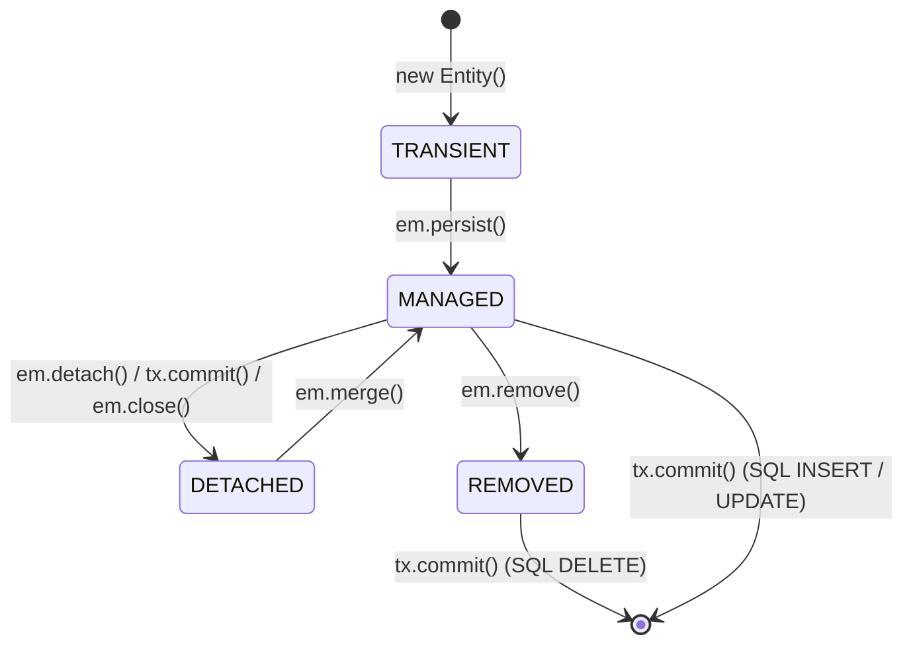

# 🏛️ Day 21: JPA & Hibernate Foundations
## Object-Relational Mapping, the Persistence Context, L1 Cache & Dirty Checking

| ⬅️ Previous Day | 📚 Course Hub | ➡️ Next Day |
|:---|:---:|---:|
| [← Day 20: Testing REST APIs End-to-End](../../Phase_03_Spring_Web_REST_APIs/Day_20_Testing_REST_APIs/Day_20_Testing_REST_APIs.md) | [All 60 Days Overview](../../README.md) | [Day 22: Spring Data Repositories & Queries →](../Day_22_Spring_Data_Repositories_Queries/Day_22_Spring_Data_Repositories_Queries.md) |

[](../../README.md)
[](../../README.md)
[](../../README.md)
[](../../README.md)

---

## 1. Topic Overview

Jakarta Persistence API (JPA) and Hibernate form the foundational Object-Relational Mapping (ORM) framework in Java enterprise applications, bridging the conceptual gap between object-oriented domain graphs and relational database tables. In enterprise Generative AI engineering, JPA is the backbone for persistently storing multi-turn chat sessions, dynamically versioning prompt templates, and managing multi-tenant token billing ledgers—where understanding Hibernate's First-Level Cache and automatic Dirty Checking prevents silent data corruption and excessive database round-trips.

---

## 2. Basic Foundations (True Zero)

### Plain English Definitions
- **Database (PostgreSQL)**: A durable disk-backed filing system where enterprise data survives server reboots, container restarts, and power outages.
- **ORM (Object-Relational Mapping)**: The automated translation layer that converts rich Java 3D objects (classes, records, references) into flat 2D relational spreadsheet tables (rows, columns, foreign keys).
- **JPA (Jakarta Persistence API)**: The standard Java interface specification (JSR 338) defining annotations (`@Entity`, `@Table`, `@Id`) and interfaces (`EntityManager`). JPA contains no executable code—it is an official rulebook.
- **Hibernate**: The production-grade Java workhorse engine that implements the JPA specification, generating vendor-specific SQL, managing JDBC connection pools, and orchestrating dirty checking.
- **Persistence Context & First-Level Cache (L1 Cache)**: An in-memory scratchpad held by Hibernate during an active database transaction that caches loaded entities and eliminates duplicate queries for the same primary key.
- **Dirty Checking**: Hibernate's automatic change-detection mechanism. If you modify a field on a managed object (`prompt.setName("New Name")`), Hibernate compares the object against its initial snapshot and automatically issues an SQL `UPDATE` statement when the transaction commits—with zero manual `save()` calls required!

### Relatable Physical Analogy: The Photographic Darkroom
```
OBJECT WORLD (Java 21):                          RELATIONAL WORLD (PostgreSQL):
Rich, living entities with methods,               Flat 2D spreadsheet tables
inheritance, and direct references.               with foreign keys and scalar types.
            │                                                      ▲
            └──────────────┐                        ┌──────────────┘
                           ▼                        │
              ┌──────────────────────────────────────────┐
              │           THE PERSISTENCE CONTEXT        │
              │         (Photographer's Darkroom)        │
              └──────────────────────────────────────────┘
```

Imagine a traditional photography darkroom:
1. **Unexposed Film (`TRANSIENT`)**: You buy a roll of film at the store (`new PromptEntity()`). It exists in your pocket; the darkroom has no record of it.
2. **The Chemical Bath & Drying Rack (`MANAGED`)**: You bring the negative into the darkroom (`em.persist()`). It is pinned to the drying rack (First-Level Cache).
   - If you use a fine brush to touch up a spot on the negative on the rack, you do not need to call a special "save" command.
   - When the technician starts the development printer (**`em.flush()`**), **every modification you made on the rack is automatically burned onto the paper prints (PostgreSQL tables)!**
3. **Framed Photo in Customer's Living Room (`DETACHED`)**: You deliver the print and close the darkroom door (Transaction completed). Drawing on the framed photo at home will **never alter the negative inside the darkroom**.
4. **The Shredder (`REMOVED`)**: You flag a ruined negative for disposal (`em.remove()`). It is permanently shredded upon closing the darkroom.

### Minimal Beginner-Friendly Working Code Example

Let us examine a minimal JPA entity and observe how Hibernate automatically persists and tracks it:

```java
package com.javagenai.day21;

import jakarta.persistence.*;
import java.time.Instant;

@Entity
@Table(name = "prompt_templates")
public class MinimalPromptEntity {

    @Id
    @GeneratedValue(strategy = GenerationType.IDENTITY)
    private Long id;

    @Column(nullable = false)
    private String name;

    @Column(columnDefinition = "TEXT", nullable = false)
    private String templateContent;

    // Default constructor required by JPA reflection
    public MinimalPromptEntity() {}

    public MinimalPromptEntity(String name, String templateContent) {
        this.name = name;
        this.templateContent = templateContent;
    }

    // Getters and Setters
    public Long getId() { return id; }
    public String getName() { return name; }
    public void setName(String name) { this.name = name; }
    public String getTemplateContent() { return templateContent; }
    public void setTemplateContent(String templateContent) { this.templateContent = templateContent; }
}
```

#### Line-by-Line Walkthrough
1. `@Entity`: Marks this class as a JPA-managed domain entity mapped to a relational table.
2. `@Table(name = "prompt_templates")`: Specifies the exact PostgreSQL table name.
3. `@Id`: Declares the unique primary key attribute.
4. `@GeneratedValue(strategy = GenerationType.IDENTITY)`: Delegates ID generation to PostgreSQL's native `SERIAL` / `IDENTITY` column sequence.
5. `@Column(columnDefinition = "TEXT")`: Maps large prompt text strings to PostgreSQL's unbounded `TEXT` data type instead of the default `VARCHAR(255)`.

---

## 3. Core Concept Walkthrough (Basic → Intermediate)

### 3.1 The 4 Canonical Entity Lifecycle States



1. **`TRANSIENT`**: Instantiated with `new PromptEntity(...)`. Exists in JVM heap memory only; has no database primary key and is not associated with any persistence context.
2. **`MANAGED`**: Associated with an active `EntityManager` and database transaction. Has a primary key. **Dirty Checking is ACTIVE**: any setter called will be tracked and synchronized to PostgreSQL automatically.
3. **`DETACHED`**: Possesses a database primary key, but its persistence context was closed or cleared. Changes to detached entities are ignored until re-attached via `em.merge()`.
4. **`REMOVED`**: Marked for deletion via `em.remove(entity)`. Scheduled for an SQL `DELETE` statement when the transaction flushes.

### 3.2 The First-Level Cache (Identity Map)
Within an active transaction:
```java
PromptEntity p1 = em.find(PromptEntity.class, 1L);
PromptEntity p2 = em.find(PromptEntity.class, 1L);

System.out.println(p1 == p2); // ALWAYS TRUE! Identical memory address.
```
1. The first lookup issues an SQL `SELECT` against PostgreSQL, stores the entity in the L1 Cache map, and saves a baseline snapshot.
2. The second lookup **executes zero SQL queries**—it returns the existing managed object directly from memory!

### 3.3 Automatic Dirty Checking & Deferred Write-Behind
When an entity is `MANAGED`, Hibernate takes a snapshot of its fields. Upon transaction commit or `em.flush()`:
1. Hibernate compares current field values with the snapshot copy.
2. If differences exist, it automatically constructs a SQL `UPDATE` statement.
3. It queues the statement in its internal **ActionQueue** and flushes it using JDBC batching.

```java
@Transactional
public void updatePromptTitle(Long id, String newTitle) {
    PromptEntity prompt = promptRepository.findById(id).orElseThrow();
    prompt.setName(newTitle); 
    // ZERO need to call promptRepository.save(prompt)!
    // Hibernate automatically executes SQL UPDATE when the method finishes!
}
```

### 3.4 Production AI Entity Modeling: `PromptTemplate.java`

```java
package com.enterprise.ai.domain;

import jakarta.persistence.*;
import org.hibernate.annotations.CreationTimestamp;
import org.hibernate.annotations.UpdateTimestamp;
import java.time.Instant;

@Entity
@Table(
    name = "prompt_templates",
    indexes = {
        @Index(name = "idx_prompt_name_version", columnList = "name, version", unique = true),
        @Index(name = "idx_prompt_model_family", columnList = "modelFamily")
    }
)
public class PromptTemplate {

    @Id
    @GeneratedValue(strategy = GenerationType.IDENTITY)
    private Long id;

    @Column(nullable = false, length = 120)
    private String name;

    @Column(nullable = false, columnDefinition = "TEXT")
    private String templateContent;

    @Column(nullable = false, length = 50)
    private String modelFamily; // e.g. "gpt-4o", "claude-3-5"

    @Column(nullable = false)
    private int version;

    @Column(nullable = false)
    private boolean active = true;

    // Optimistic locking: Prevents race conditions during concurrent updates
    @Version
    private Long optimisticVersion;

    @CreationTimestamp
    @Column(nullable = false, updatable = false)
    private Instant createdAt;

    @UpdateTimestamp
    @Column(nullable = false)
    private Instant updatedAt;

    // Getters, setters, constructors
}
```

---

## 4. Prerequisite & Supporting Concepts

### Prerequisite / Supporting Concept: JPA vs. Hibernate Architecture

```
┌──────────────────────────────────────────────────────────┐
│             Jakarta Persistence API (JPA)                │
│    (Standard Interface Specification: JSR 338)           │
│    Packages: jakarta.persistence.*                       │
│    Core Types: EntityManager, Entity, Table, Column      │
└────────────────────────────┬─────────────────────────────┘
                             │ Implemented by
                             ▼
┌──────────────────────────────────────────────────────────┐
│                   Hibernate ORM 6.x                      │
│    (Battle-tested Production Engine & Implementation)    │
│    Core Types: Session, SessionFactory, ActionQueue      │
└──────────────────────────────────────────────────────────┘
```

### Prerequisite / Supporting Concept: The Plain English Bridge to JPA

| Database Tool | What You Write | Why Modern Teams Use JPA | Plain English Analogy |
| :--- | :--- | :--- | :--- |
| **Raw JDBC** | 30 lines of `ps.setString()` and `rs.getString()` per query | High maintenance, SQL typos, manual connection closing | Digging with a hand shovel |
| **JPA Specification**| `@Entity`, `@Id`, `@Column` | Standardized, vendor-neutral Java persistence API | Blueprint for a power excavator |
| **Hibernate Engine** | Implements JPA; generates SQL dialects automatically | Handles L1 caching, dirty checking, and schema generation | The actual excavator engine |
| **Spring Data JPA** | `public interface PromptRepo extends JpaRepository<...>` | Auto-generates standard CRUD methods at startup | A self-driving autonomous excavator |

---

## 5. Advanced Depth (Intermediate → Advanced)

### 5.1 Common Mistakes & Misconceptions

#### Mistake 1: The "Phantom Update" via In-Memory Mutation
```java
// ❌ DANGEROUS: Modifying a managed entity in memory triggers a permanent SQL UPDATE!
@Transactional
public String assembleSystemPrompt(Long promptId, String userQuestion) {
    PromptTemplate template = promptRepository.findById(promptId).orElseThrow();
    template.setTemplateContent(template.getTemplateContent() + " Context: " + userQuestion);
    // Hibernate dirty checking DETECTS this modification!
    // It writes the user's private question into the shared database prompt template!
    return template.getTemplateContent();
}

// ✅ GOOD: Use a separate local variable or DTO for string interpolation
@Transactional(readOnly = true)
public String assembleSystemPrompt(Long promptId, String userQuestion) {
    PromptTemplate template = promptRepository.findById(promptId).orElseThrow();
    return template.getTemplateContent().replace("{userQuestion}", userQuestion);
}
```

#### Mistake 2: Redundant `save()` Calls on Managed Entities
In Spring Data JPA, writing `repository.save(entity)` at the end of a `@Transactional` method when the entity was already loaded in that transaction is redundant and adds no value—Hibernate's dirty checking already flushes updates automatically.

#### Mistake 3: Disabling Dirty Checking Overhead for Read-Heavy Queries
For endpoints that only read prompts without modifying them, annotate the service method with `@Transactional(readOnly = true)`. This instructs Hibernate to **skip taking snapshot copies**, cutting Persistence Context heap memory consumption by 50%!

---

## 6. Quick Recap

| Concept | Annotation / Construct | Role in Architecture | Enterprise AI Application |
| :--- | :--- | :--- | :--- |
| **Entity Declaration**| `@Entity` + `@Table` | Maps Java class to relational table | Defines prompt and conversation schemas |
| **Text Mapping** | `@Column(columnDefinition="TEXT")`| Unbounded string storage | Stores large prompt templates and completions |
| **Optimistic Lock** | `@Version` | Prevents lost update anomalies | Protects token usage ledgers under concurrency |
| **Identity Map** | First-Level Cache | Deduplicates queries within transaction | Eliminates duplicate SELECT queries for session IDs |
| **Dirty Checking** | Snapshot Comparison | Auto-generates SQL UPDATE on commit | Updates prompt versions without manual save calls |
| **Read Optimization**| `@Transactional(readOnly = true)`| Disables snapshot creation | Cuts heap memory by 50% for inference lookups |

---

## 7. Self-Check Questions & Practice Exercises

### Self-Check Questions

1. **If you load an entity in a `@Transactional` method, change a property with `entity.setName("New")`, and never call `repository.save()`, does it persist to PostgreSQL?**
   - *Answer*: **YES**. Hibernate Dirty Checking automatically compares the managed entity against its baseline snapshot upon transaction commit / `flush()` and emits an SQL `UPDATE` statement.
2. **What is the difference between JPA and Hibernate?**
   - *Answer*: JPA is an official interface specification (JSR 338) defining annotations and interfaces without implementation code. Hibernate is the production engine that implements JPA, generating SQL dialects and managing the persistence context.
3. **What is the primary benefit of the First-Level Cache (L1 Cache)?**
   - *Answer*: It acts as an Identity Map within a single transaction, guaranteeing that multiple requests for the same entity ID return the identical object reference (`==`) and execute only a single SQL `SELECT` query.
4. **When does an entity transition from `MANAGED` to `DETACHED`?**
   - *Answer*: When the active transaction commits and the persistence context is closed, or when `em.detach(entity)` or `em.clear()` is called explicitly.
5. **Why is `@Version` essential for token billing ledgers in high-concurrency AI systems?**
   - *Answer*: When concurrent threads deduct tokens from a user's balance, race conditions can cause lost updates. `@Version` enables Optimistic Locking, causing Hibernate to verify the version column during update and throw `OptimisticLockException` if a conflict occurs.

---

### Hands-On Practice Exercises

#### 🏋️ Exercise 1: Build a Conversation Session Entity with Token Tracking
**Objective**: Construct a JPA entity `ConversationSession` with an indexed `userId`, `totalTokensUsed`, optimistic locking versioning, and creation timestamps:

```java
package com.javagenai.day21;

import jakarta.persistence.*;
import org.hibernate.annotations.CreationTimestamp;
import org.hibernate.annotations.UpdateTimestamp;
import java.time.Instant;

@Entity
@Table(
    name = "conversation_sessions",
    indexes = @Index(name = "idx_session_user_id", columnList = "user_id")
)
public class ConversationSession {

    @Id
    @GeneratedValue(strategy = GenerationType.IDENTITY)
    private Long id;

    @Column(name = "user_id", nullable = false, length = 64)
    private String userId;

    @Column(nullable = false, length = 200)
    private String title;

    @Column(name = "total_tokens_used", nullable = false)
    private int totalTokensUsed = 0;

    @Version
    private Long version;

    @CreationTimestamp
    @Column(name = "created_at", nullable = false, updatable = false)
    private Instant createdAt;

    @UpdateTimestamp
    @Column(name = "updated_at", nullable = false)
    private Instant updatedAt;

    public ConversationSession() {}

    public ConversationSession(String userId, String title) {
        this.userId = userId;
        this.title = title;
    }

    public void addTokens(int tokens) {
        if (tokens < 0) throw new IllegalArgumentException("Tokens cannot be negative");
        this.totalTokensUsed += tokens;
    }

    // Getters and setters omitted for brevity
}
```

#### 🏋️ Exercise 2: Re-attaching a Detached Entity via `em.merge()`
**Objective**: Demonstrate how to properly update a detached entity received from an HTTP PUT request using `em.merge()`:

```java
package com.javagenai.day21;

import jakarta.persistence.EntityManager;
import org.springframework.stereotype.Service;
import org.springframework.transaction.annotation.Transactional;

@Service
public class PromptUpdateService {

    private final EntityManager em;

    public PromptUpdateService(EntityManager em) {
        this.em = em;
    }

    @Transactional
    public MinimalPromptEntity updatePromptFromDto(Long id, String updatedContent) {
        // Create detached instance representing client input
        MinimalPromptEntity detachedPrompt = new MinimalPromptEntity();
        // Em.merge loads managed instance from DB, copies properties, and returns managed reference
        MinimalPromptEntity managedPrompt = em.find(MinimalPromptEntity.class, id);
        managedPrompt.setTemplateContent(updatedContent);

        // Automatic dirty checking synchronizes changes upon method return!
        return managedPrompt;
    }
}
```

---

| ⬅️ Previous Day | 📚 Course Hub | ➡️ Next Day |
|:---|:---:|---:|
| [← Day 20: Testing REST APIs End-to-End](../../Phase_03_Spring_Web_REST_APIs/Day_20_Testing_REST_APIs/Day_20_Testing_REST_APIs.md) | [All 60 Days Overview](../../README.md) | [Day 22: Spring Data Repositories & Queries](../Day_22_Spring_Data_Repositories_Queries/Day_22_Spring_Data_Repositories_Queries.md) |
