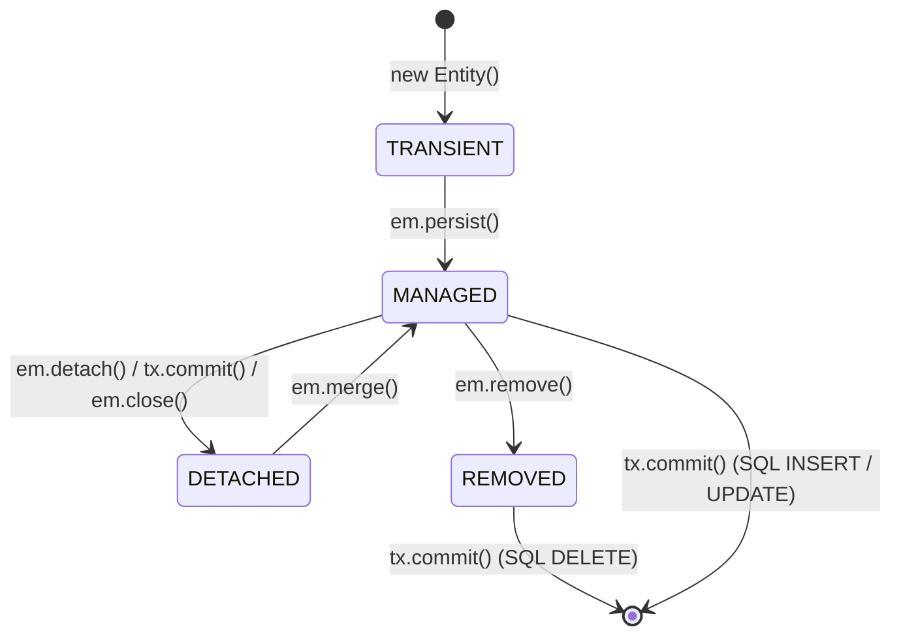

# Day 21: JPA & Hibernate Foundations

> **"In a Generative AI platform, you cannot keep conversation histories, prompt templates, and token billing ledgers in RAM. You must persist them durably. But if you don't understand how Hibernate's Persistence Context and Dirty Checking operate under the hood, your application will suffer from silent database overwrites, N+1 query storms, and catastrophic OutOfMemoryErrors."**

---

| Previous Day | Course Hub | Next Day |
|:---|:---:|---:|
| [Day 20: Testing REST APIs End-to-End](../../Phase_03_Spring_Web_REST_APIs/Day_20_Testing_REST_APIs/Day_20_Testing_REST_APIs.md) | [All 60 Days Overview](../../README.md) | [Day 22: Spring Data Repositories & Queries](../Day_22_Spring_Data_Repositories_Queries/Day_22_Spring_Data_Repositories_Queries.md) |

---

## Table of Contents

1. [Why This Day Matters for a 3-Year Enterprise Gen AI Engineer](#1-why-this-day-matters-for-a-3-year-enterprise-gen-ai-engineer)
2. [Real-World Analogy: The Photographic Darkroom & Drying Rack](#2-real-world-analogy-the-photographic-darkroom--drying-rack)
3. [The Object-Relational Impedance Mismatch](#3-the-object-relational-impedance-mismatch)
4. [JPA vs Hibernate: Specification vs Implementation](#4-jpa-vs-hibernate-specification-vs-implementation)
5. [The Persistence Context & First-Level Cache (L1 Cache)](#5-the-persistence-context--first-level-cache-l1-cache)
6. [The 4 Entity Lifecycle States In-Depth](#6-the-4-entity-lifecycle-states-in-depth)
7. [Under the Hood: Automatic Dirty Checking & Write-Behind Flushing](#7-under-the-hood-automatic-dirty-checking--write-behind-flushing)
8. [Mapping AI Domain Models in JPA](#8-mapping-ai-domain-models-in-jpa)
9. [Hands-On Code Walkthrough: Building a Mini-Persistence Context](#9-hands-on-code-walkthrough-building-a-mini-persistence-context)
10. [Step-by-Step Compilation & Execution](#10-step-by-step-compilation--execution)
11. [Hands-On Exercises (With Complete Solutions)](#11-hands-on-exercises-with-complete-solutions)
12. [Self-Check Quiz](#12-self-check-quiz)

---

## 1. Why This Day Matters for a 3-Year Enterprise Gen AI Engineer

When building production Generative AI platforms, your relational database (PostgreSQL) is the source of truth for:
- **Conversation Sessions & Message History**: Multi-turn chat context assembled before invoking an LLM.
- **Dynamic Prompt Templates**: Storing, versioning, and A/B testing prompts across engineering teams without redeploying code.
- **Token Accounting & Quotas**: Tracking token consumption, rate limits, and billing ledgers per customer tenant.
- **RAG Document Chunk Metadata**: Storing source URLs, document authors, chunk sequence IDs, and permissions.

### Where Junior Developers Crash in Production
1. **The Phantom Update**: A developer queries a prompt template, modifies a field in memory for an ephemeral prompt assembly, and finishes the request. To their horror, **Hibernate automatically issues an SQL UPDATE statement to PostgreSQL**, permanently corrupting the production prompt template in the database! (They didn't understand **Dirty Checking**).
2. **OutOfMemoryError During Prompt Retrieval**: Loading 1,000 conversation messages inside a single `@Transactional` method causes Hibernate's First-Level Cache to store both the loaded entities and their snapshot copies in heap memory, causing garbage collection pauses and OOMs.
3. **The Unnecessary Save Trap**: Writing `promptRepository.save(prompt)` at the end of a method when the entity is already managed, causing redundant queries or developer confusion.
4. **`LazyInitializationException`**: Accessing child messages after a transaction closes because the entity entered the `DETACHED` state.

To build fast, leak-free, concurrent AI systems, you must understand the exact lifecycle transitions between Java heap memory and PostgreSQL relational tables.

---

## 2. Real-World Analogy: The Photographic Darkroom & Drying Rack

```
OBJECT WORLD (Java 21):                          RELATIONAL WORLD (PostgreSQL):
Rich, 3D living entities with                     Flat 2D spreadsheet tables
methods, inheritance, references.                 with foreign keys and scalar types.
            │                                                      ▲
            └──────────────┐                        ┌──────────────┘
                           ▼                        │
              ┌──────────────────────────────────────────┐
              │           THE PERSISTENCE CONTEXT        │
              │         (Photographer's Darkroom)        │
              └──────────────────────────────────────────┘
```

Imagine a traditional photography darkroom:
1. **Unexposed Film (`TRANSIENT`)**: You buy a roll of film at the store (`new PromptEntity()`). It exists in your pocket. The darkroom has no idea it exists. It has no negative ID number.
2. **The Chemical Bath & Drying Rack (`MANAGED`)**: You bring the negative into the darkroom (`em.persist()`). It is pinned to the drying rack (First-Level Cache).
   - If you use a fine brush to touch up a spot on the negative while it's on the rack, you don't need to call a special "save" command.
   - When the darkroom technician turns on the development printer (**`em.flush()`**), **every modification you made on the rack is automatically burned onto the paper prints (PostgreSQL tables)!**
3. **Framed Photo in Customer's Living Room (`DETACHED`)**: You deliver the printed photo to a customer and close the darkroom door (Transaction closed). If the customer draws a moustache on the photo with a sharpie in their living room, **the negative in your darkroom is NOT modified**.
4. **The Shredder (`REMOVED`)**: You mark a ruined negative for the shredder (`em.remove()`). When the technician cleans the darkroom at the end of the day, it is permanently destroyed.

---

## 3. The Object-Relational Impedance Mismatch

Java is an **Object-Oriented** language based on graphs of objects, encapsulation, polymorphism, and identity references (`==`). Relational databases (PostgreSQL) are based on **Relational Algebra**, mathematical sets, foreign keys, and normalized flat tables.

| Dimension | Object World (Java) | Relational World (SQL / Postgres) |
| :--- | :--- | :--- |
| **Identity** | Memory address (`obj1 == obj2`) or `equals()` | Primary Key (`id = 42`) |
| **Relationships** | Direct references (`prompt.getMessages()`, directional or bidirectional) | Foreign Keys (`session_id REFERENCES sessions(id)`) |
| **Navigation** | Graph traversing (`session.getMessages().get(0).getTokens()`) | Relational `JOIN` operations |
| **Data Types** | Enums, Records, Collections, Custom classes | `VARCHAR`, `INTEGER`, `BOOLEAN`, `JSONB`, `TEXT` |
| **Inheritance** | Class hierarchies (`abstract class BasePrompt extends ...`) | Not natively supported (simulated via Single Table, Joined, or Table-per-Class) |

**ORM (Object-Relational Mapping)** bridges this mismatch by automatically translating object graphs into SQL table operations.

---

## 🧭 The Mid-Level Java Developer Bridge: From JDBC to Spring Data JPA

If you learned database access with classic JDBC, here is how the layers evolved and why we use Spring Data JPA today:

| Database Tool | What You Write | Pros & Cons | Plain English Translation |
| :--- | :--- | :--- | :--- |
| **Raw JDBC** | `PreparedStatement ps = conn.prepareStatement("SELECT * FROM users");` followed by 30 lines of `rs.getString("username")`. | ❌ Verbose, repetitive, manual connection closing, SQL typos caught only at runtime. | Digging with a shovel: you do every tiny manual step yourself. |
| **JPA (Jakarta Persistence API)** | `@Entity public class User { ... }` | An **official specification** (interface standards) defining how Java objects should map to tables. | The blueprint for a power excavator. |
| **Hibernate** | The engine implementing JPA. Handles SQL generation, 1st-level cache, and dirty checking. | ✅ Auto-generates SQL dialect (Postgres, MySQL, Oracle), tracks field changes automatically. | The physical excavator engine executing work. |
| **Spring Data JPA** | `public interface UserRepository extends JpaRepository<User, Long> {}` | 🏆 **Zero implementation code!** Spring auto-generates `findAll()`, `findById()`, and `save()` at startup. | A self-driving excavator: you tell it where to dig, and it handles everything. |

---

## 4. JPA vs Hibernate: Specification vs Implementation

A common point of confusion for backend developers is the relationship between JPA and Hibernate:

```
┌──────────────────────────────────────────────────────────┐
│             Jakarta Persistence API (JPA)                │
│    (Standard Interface Specification: JSR 338)           │
│    Packages: jakarta.persistence.*                       │
│    Core Types: EntityManager, Entity, Table, Column      │
└────────────────────────────┬─────────────────────────────┘
                             │ Implemented by
                             ▼
┌──────────────────────────────────────────────────────────┐
│                   Hibernate ORM 6.x                      │
│    (Battle-tested Production Engine & Implementation)    │
│    Core Types: Session, SessionFactory, ActionQueue      │
└──────────────────────────────────────────────────────────┘
```

- **JPA is an Interface**: It defines standard annotations (`@Entity`, `@Table`, `@Id`) and interfaces (`EntityManager`, `Query`). You cannot run JPA by itself—it has no executable code!
- **Hibernate is the Engine**: It is the actual Java library that opens JDBC connections, executes dirty checking, parses JPQL, and translates Java operations into vendor-specific PostgreSQL SQL queries.

In modern Spring Boot 3, you program against **JPA standards**, and Spring Boot auto-configures **Hibernate** as the default JPA provider.

---

## 5. The Persistence Context & First-Level Cache (L1 Cache)

The **Persistence Context** is an in-memory buffer where Hibernate manages entity instances during an active transaction.

```
┌──────────────────────────────────────────────────────────────┐
│                    PERSISTENCE CONTEXT                       │
│                                                              │
│  1. FIRST-LEVEL CACHE (Identity Map):                        │
│     Key (ID)   │ Value (Managed Reference)                   │
│     ───────────┼─────────────────────────────────────────    │
│     Long: 1    │ PromptEntity@7a8b (name: "rag-prompt")      │
│     Long: 2    │ PromptEntity@4c12 (name: "eval-prompt")     │
│                                                              │
│  2. SNAPSHOT MAP (Dirty Checking Baseline):                  │
│     Key (ID)   │ Initial State Snapshot                      │
│     ───────────┼─────────────────────────────────────────    │
│     Long: 1    │ Copy: {name: "rag-prompt", version: 1}      │
│     Long: 2    │ Copy: {name: "eval-prompt", version: 1}      │
└──────────────────────────────────────────────────────────────┘
```

### The Identity Map Guarantee
Within a single Persistence Context (a single `@Transactional` method):
```java
PromptEntity p1 = em.find(PromptEntity.class, 1L);
PromptEntity p2 = em.find(PromptEntity.class, 1L);

System.out.println(p1 == p2); // ALWAYS TRUE! Same memory address.
```
1. `em.find(1L)` executes a SQL `SELECT` against PostgreSQL, creates `PromptEntity@7a8b`, puts it in the L1 Cache, and stores a snapshot copy.
2. The second `em.find(1L)` **executes ZERO SQL queries**. It inspects the L1 Cache map, finds the existing instance, and returns the exact same object reference!

---

## 6. The 4 Entity Lifecycle States In-Depth



### 1. `TRANSIENT` (New in RAM)
- Created using `new PromptEntity(...)`.
- Has no database identity (`id == null`).
- Not associated with any Persistence Context.
- If the JVM crashes or the variable goes out of scope, it is garbage collected. No database changes occur.

### 2. `MANAGED` (Tracked by Persistence Context)
- Associated with an active `EntityManager` and transaction.
- Has a database identity (`id != null`).
- **Dirty Checking is ACTIVE**: Any setter called on this object will be detected by Hibernate and synchronized to the database.

### 3. `DETACHED` (Transaction Closed)
- Has a database identity (`id != null`), but its Persistence Context was closed, cleared (`em.clear()`), or the transaction committed.
- Changes made to a detached entity are **NOT tracked**. Calling setters will never trigger SQL updates unless explicitly re-attached via `em.merge()`.

### 4. `REMOVED` (Scheduled for Deletion)
- Was managed, but passed to `em.remove(entity)`.
- Scheduled for an SQL `DELETE` statement when the transaction flushes.

---

## 7. Under the Hood: Automatic Dirty Checking & Write-Behind Flushing

### How Dirty Checking Works
When an entity enters the `MANAGED` state (via `em.find()` or `em.persist()`), Hibernate makes an internal deep snapshot of all entity fields.

At transaction boundary (or when `em.flush()` is invoked):
1. Hibernate iterates over all entities in the Persistence Context.
2. It compares the current field values against the snapshot copy:
   ```java
   if (!entity.field.equals(snapshot.field)) {
       // Entity is DIRTY!
   }
   ```
3. If differences exist, Hibernate dynamically constructs a SQL `UPDATE` statement containing the modified columns and queues it in its internal **ActionQueue**.

### The "Write-Behind" (Deferred Execution) Pattern
Hibernate **does NOT immediately execute SQL queries** the moment you call `persist()` or modify a setter.

```
Java Code:
em.persist(prompt1);           ──► (No SQL executed yet!)
prompt2.setName("new-name");   ──► (No SQL executed yet!)
em.remove(prompt3);            ──► (No SQL executed yet!)
...
Transaction Commit / Flush:    ──► ActionQueue batches and orders statements:
                                   1. Batch INSERTs
                                   2. Batch UPDATEs
                                   3. Batch DELETEs
```

This drastically reduces database round-trips and allows JDBC batching optimizations.

---

## 8. Mapping AI Domain Models in JPA

Here is how a senior AI engineer designs a production prompt template entity:

```java
package com.enterprise.ai.domain;

import jakarta.persistence.*;
import org.hibernate.annotations.CreationTimestamp;
import org.hibernate.annotations.UpdateTimestamp;
import java.time.Instant;

@Entity
@Table(
    name = "prompt_templates",
    indexes = {
        @Index(name = "idx_prompt_name_version", columnList = "name, version", unique = true),
        @Index(name = "idx_prompt_model_family", columnList = "modelFamily")
    }
)
public class PromptTemplate {

    @Id
    @GeneratedValue(strategy = GenerationType.IDENTITY)
    private Long id;

    @Column(nullable = false, length = 120)
    private String name;

    // Use TEXT for large prompt contents (LLM system instructions)
    @Column(nullable = false, columnDefinition = "TEXT")
    private String templateContent;

    @Column(nullable = false, length = 50)
    private String modelFamily; // e.g. "gpt-4o", "claude-3-5"

    @Column(nullable = false)
    private int version;

    @Column(nullable = false)
    private boolean active = true;

    // Optimistic locking: Prevents concurrent overwrites when multiple AI engineers edit prompts
    @Version
    private Long optimisticVersion;

    @CreationTimestamp
    @Column(nullable = false, updatable = false)
    private Instant createdAt;

    @UpdateTimestamp
    @Column(nullable = false)
    private Instant updatedAt;

    // Getters, setters, constructors...
}
```

### Key Architectural Annotations
- **`@Column(columnDefinition = "TEXT")`**: Standard `@Column` maps to `VARCHAR(255)`. Prompts exceed 255 characters; using `TEXT` stores unbounded prompt strings in PostgreSQL.
- **`@Version`**: Enables **Optimistic Locking**. If two backend threads try to update the prompt simultaneously, Hibernate detects the version collision and throws `OptimisticLockException` rather than silently overwriting changes.
- **`@CreationTimestamp` / `@UpdateTimestamp`**: Managed automatically by Hibernate on insert/update without manual `Instant.now()` calls.

---

## 9. Hands-On Code Walkthrough: Building a Mini-Persistence Context

In this day's companion code (`Phase_04_Spring_Data_JPA_Database/Day_21_JPA_Hibernate_Foundations/code/`), we built a standalone simulation of Hibernate's core engine:

1. **`EntityState.java`**: The 4 canonical states (`TRANSIENT`, `MANAGED`, `DETACHED`, `REMOVED`).
2. **`PromptEntity.java`**: Domain model with snapshot creation and dirty detection logic.
3. **`MiniPersistenceContext.java`**:
   - `firstLevelCache`: Map acting as identity map.
   - `snapshots`: Map acting as dirty checking baseline.
   - `flush()`: Inspects changes and emits exact SQL statements (`INSERT`, `UPDATE`, `DELETE`).
4. **`JPALifecycleDemo.java`**: Driver demonstrating all 5 core lifecycle scenarios.

---

## 10. Step-by-Step Compilation & Execution

```powershell
# 1. Navigate to course workspace
cd "c:\Users\sriva\OneDrive\Desktop\GEN AI COURSE\JAVA"

# 2. Compile Day 21 code
javac Phase_04_Spring_Data_JPA_Database/Day_21_JPA_Hibernate_Foundations/code/*.java

# 3. Execute the JPA Lifecycle Demo
java -cp Phase_04_Spring_Data_JPA_Database/Day_21_JPA_Hibernate_Foundations code.JPALifecycleDemo
```

### Verified Output

```
================================================================================
 DAY 21: JPA & HIBERNATE FOUNDATIONS — PERSISTENCE CONTEXT & ENTITY LIFECYCLE   
================================================================================

--- SCENARIO 1: Transient -> Managed -> Flush (INSERT) ---
 1. Instantiated new entity with 'new': State = TRANSIENT
  [JPA persist] Entity transitioned to MANAGED: PromptEntity[id=101, name='code-explainer-prompt', model='claude-3-5-sonnet', version=1, active=true]
 2. Called em.persist(): State = MANAGED, Assigned ID = 101
 3. Before flush, SQL statement count: 0

  --- EXECUTING JPA FLUSH (DIRTY CHECKING & SQL SYNCHRONIZATION) ---
  [SQL INSERT] INSERT INTO prompt_templates (id, name, template_content, model_family, version, active) VALUES (101, 'code-explainer-prompt', 'Explain the following Java code step-by-step: {code}', 'claude-3-5-sonnet', 1, true)
 4. After flush, SQL statement count: 1

--- SCENARIO 2: First-Level Cache (Identity Map Proof) ---
 Fetching prompt ID 1 for the first time:
  [JPA find] L1 CACHE MISS. Querying database: SELECT * FROM prompt_templates WHERE id = 1

 Fetching prompt ID 1 for the second time in same persistence context:
  [JPA find] L1 CACHE HIT! Returning existing managed instance for ID: 1
 Are both object references IDENTICAL in JVM memory (firstFetch == secondFetch)? true

--- SCENARIO 3: Automatic Dirty Checking on Managed Entity ---
 Modifying template content via standard Java setter...
 Note: We NEVER called em.update() or em.save()!

  --- EXECUTING JPA FLUSH (DIRTY CHECKING & SQL SYNCHRONIZATION) ---
  [DIRTY CHECKING] Entity ID 101 is UNCHANGED. Zero SQL generated.
  [SQL UPDATE (Dirty Checking)] UPDATE prompt_templates SET name = 'default-rag-prompt', template_content = 'UPDATED: You are a senior Java architect. Explain: {code}', model_family = 'gpt-4o', version = 2, active = true WHERE id = 1

--- SCENARIO 4: Detached Entity (Modifications Ignored) ---
  [JPA detach] Entity transitioned to DETACHED: ID 1
 Called em.detach(): State = DETACHED
 Modified detached entity name. Triggering flush...

  --- EXECUTING JPA FLUSH (DIRTY CHECKING & SQL SYNCHRONIZATION) ---
  [DIRTY CHECKING] Entity ID 101 is UNCHANGED. Zero SQL generated.

--- SCENARIO 5: Managed -> Removed -> Flush (DELETE) ---
 Removing prompt ID 101...
  [JPA remove] Entity marked as REMOVED: ID 101
 State after em.remove(): REMOVED

  --- EXECUTING JPA FLUSH (DIRTY CHECKING & SQL SYNCHRONIZATION) ---
  [SQL DELETE] DELETE FROM prompt_templates WHERE id = 101

================================================================================
 COMPLETE AUDIT OF GENERATED SQL STATEMENTS:
   [1] INSERT INTO prompt_templates (id, name, template_content, model_family, version, active) VALUES (101, 'code-explainer-prompt', 'Explain the following Java code step-by-step: {code}', 'claude-3-5-sonnet', 1, true)
   [2] SELECT * FROM prompt_templates WHERE id = 1
   [3] UPDATE prompt_templates SET name = 'default-rag-prompt', template_content = 'UPDATED: You are a senior Java architect. Explain: {code}', model_family = 'gpt-4o', version = 2, active = true WHERE id = 1
   [4] DELETE FROM prompt_templates WHERE id = 101
================================================================================
 DAY 21 DEMONSTRATION COMPLETE: ALL JPA LIFECYCLE PATTERNS VERIFIED!          
================================================================================
```

---

## 11. Hands-On Exercises (With Complete Solutions)

### Exercise 1: Conversation Session Entity with Token Tracking
**Task**: Write the complete JPA entity `ConversationSession` with:
- Auto-incrementing primary key `id`.
- `userId` (indexed, non-null).
- `title` (max 200 characters).
- `totalTokensUsed` (integer, non-negative).
- Optimistic locking version field.
- Timestamps for creation and update.

#### Solution:
```java
@Entity
@Table(
    name = "conversation_sessions",
    indexes = @Index(name = "idx_session_user_id", columnList = "user_id")
)
public class ConversationSession {

    @Id
    @GeneratedValue(strategy = GenerationType.IDENTITY)
    private Long id;

    @Column(name = "user_id", nullable = false, length = 64)
    private String userId;

    @Column(nullable = false, length = 200)
    private String title;

    @Column(name = "total_tokens_used", nullable = false)
    private int totalTokensUsed = 0;

    @Version
    private Long version;

    @CreationTimestamp
    @Column(name = "created_at", nullable = false, updatable = false)
    private Instant createdAt;

    @UpdateTimestamp
    @Column(name = "updated_at", nullable = false)
    private Instant updatedAt;

    public void addTokens(int tokens) {
        if (tokens < 0) throw new IllegalArgumentException("Tokens cannot be negative");
        this.totalTokensUsed += tokens;
    }

    // Getters, setters, constructors
}
```

---

### Exercise 2: Disabling Dirty Checking for High-Throughput Read Queries
**Task**: In an AI chat application, prompt templates are queried thousands of times per second. How do you configure a Spring service method to tell Hibernate **NOT to create snapshot copies** (saving 50% heap memory and eliminating dirty-checking overhead)?

#### Solution:
```java
@Service
public class PromptTemplateService {

    private final PromptTemplateRepository repository;

    public PromptTemplateService(PromptTemplateRepository repository) {
        this.repository = repository;
    }

    // @Transactional(readOnly = true) sets Hibernate's FlushMode to MANUAL
    // and configures the JDBC connection to read-only.
    // Hibernate skips taking snapshot copies in the Persistence Context!
    @Transactional(readOnly = true)
    public PromptTemplate getActivePrompt(String name) {
        return repository.findByNameAndActiveTrue(name)
            .orElseThrow(() -> new EntityNotFoundException("Prompt template not found: " + name));
    }
}
```

---

### Exercise 3: Re-attaching a Detached Entity via `em.merge()`
**Task**: Explain the difference between `em.persist()` and `em.merge()`. What happens when you pass a detached entity to `em.merge()`?

#### Solution:
```java
// 1. Client sends updated PromptDTO from Web UI:
PromptEntity detachedPrompt = new PromptEntity();
detachedPrompt.setId(42L); // Holds existing DB ID
detachedPrompt.setName("Updated Title");

// 2. In Service:
// em.persist(detachedPrompt); 
// ❌ WRONG! Calling persist() on an entity with an existing ID throws EntityExistsException

PromptEntity managedPrompt = em.merge(detachedPrompt);
// ✅ CORRECT! 
// em.merge() executes:
// a. Queries PostgreSQL for ID 42 (or loads from L1 cache).
// b. Copies all field values from detachedPrompt onto the managed entity.
// c. Returns the MANAGED reference (managedPrompt).
// d. On transaction commit, dirty checking detects changes and issues SQL UPDATE.
```

---

## 12. Self-Check Quiz

### Q1: If you fetch an entity inside a `@Transactional` method, change a property with `entity.setName("New")`, and never call `repository.save()`, does the change save to PostgreSQL?
> **Answer**: **YES**. This is the core principle of **Hibernate Dirty Checking**. As long as the entity is in the `MANAGED` state within an active transaction, Hibernate automatically compares the entity against its original snapshot upon transaction commit / `flush()` and issues an SQL `UPDATE` statement.

### Q2: Why is calling `repository.save(entity)` on an already managed entity redundant in Spring Data JPA?
> **Answer**: Because Spring Data JPA's `save()` method simply calls `em.persist()` (if the entity has no ID) or `em.merge()` (if it has an ID). If the entity was already loaded in the same transaction, it is already `MANAGED`, so calling `save()` performs an unnecessary `em.merge()` call that does nothing beyond what dirty checking would already do automatically.

### Q3: What is the purpose of the First-Level Cache (L1 Cache) in Hibernate?
> **Answer**: The First-Level Cache acts as an **Identity Map** scoped to the current `EntityManager` / transaction. It ensures that multiple requests for the same entity ID within the same transaction return the identical Java object reference (`==`) and execute only a single SQL `SELECT` query, preventing redundant database round-trips.

### Q4: When does an entity transition from `MANAGED` to `DETACHED`?
> **Answer**: An entity transitions to `DETACHED` when:
> 1. The transaction commits and the associated `EntityManager` is closed (standard web request lifecycle).
> 2. `em.detach(entity)` is explicitly called for that entity.
> 3. `em.clear()` is called, detaching all entities in the Persistence Context.

### Q5: Why is `@Version` essential for token usage ledgers in high-concurrency AI systems?
> **Answer**: When multiple concurrent requests (e.g. Virtual Threads serving chat completions) update the user's token usage balance simultaneously, a race condition could cause lost updates (thread B overwriting thread A's deduction). `@Version` activates **Optimistic Locking**; Hibernate checks `WHERE version = ?` during update, throwing an `OptimisticLockException` if another thread modified the row in the interim.

---

### What's Next?

Now that you understand the underlying mechanics of JPA, `EntityManager`, and Hibernate's Persistence Context, how do you query, filter, and page data without writing raw boilerplate boilerplate JDBC or low-level `EntityManager` code?

Proceed to **[Day 22: Spring Data Repositories & Query Methods](../Day_22_Spring_Data_Repositories_Queries/Day_22_Spring_Data_Repositories_Queries.md)** to master `JpaRepository`, dynamic query derivation, custom `@Query` annotations, and JPQL vs native PostgreSQL queries!
