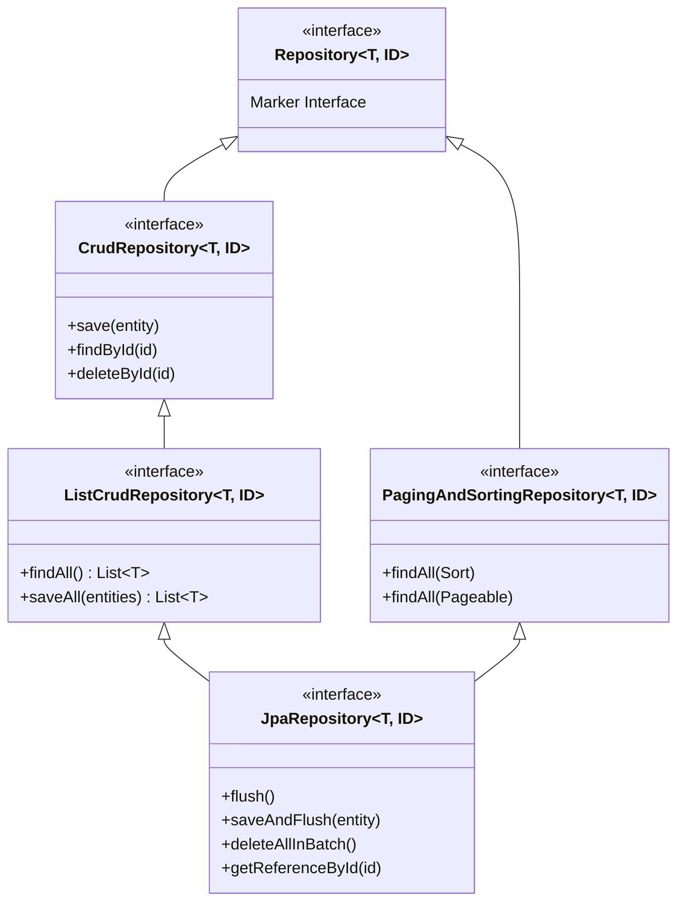

# 🔍 Day 22: Spring Data Repositories & Query Methods
## Query Derivation DSL, Custom JPQL, `Slice<T>` vs `Page<T>` & Specifications

| ⬅️ Previous Day | 📚 Course Hub | ➡️ Next Day |
|:---|:---:|---:|
| [← Day 21: JPA & Hibernate Foundations](../Day_21_JPA_Hibernate_Foundations/Day_21_JPA_Hibernate_Foundations.md) | [All 60 Days Overview](../../README.md) | [Day 23: Entity Relationships & Fetch Strategies →](../Day_23_Entity_Relationships_Fetch_Strategies/Day_23_Entity_Relationships_Fetch_Strategies.md) |

[](../../README.md)
[](../../README.md)
[](../../README.md)
[](../../README.md)

---

## 1. Topic Overview

Spring Data JPA is an automated data access framework that generates type-safe database query implementations at application startup by parsing repository interface method names and annotations. In enterprise Generative AI engineering, Spring Data repositories empower developers to query chronological conversation context windows, execute high-performance aggregate token consumption metrics, and implement infinite-scroll chat histories using `Slice<T>` without writing hundreds of lines of repetitive SQL boilerplate.

---

## 2. Basic Foundations (True Zero)

### Plain English Definitions
- **`JpaRepository<T, ID>`**: A standard Spring Data interface. When extended by your custom repository interface, it automatically provides fully functioning CRUD operations (`save()`, `findById()`, `findAll()`, `deleteById()`) without writing a single line of implementation code.
- **Query Derivation (Derived Queries)**: Spring Data's capability to parse English-like method names (such as `findBySessionIdOrderByCreatedAtAsc(...)`) and dynamically synthesize the exact parameterized SQL query at container startup.
- **JPQL (Java Persistence Query Language)**: An object-oriented query language syntax resembling SQL, where you query Java Entity classes and attribute fields (`SELECT p FROM PromptTemplate p WHERE p.active = true`) rather than raw database tables and columns.
- **`Page<T>` vs. `Slice<T>`**: Pagination interfaces. `Page<T>` executes an extra, expensive `SELECT COUNT(*)` query to compute total pages, while `Slice<T>` queries `LIMIT size + 1` with zero count overhead—making `Slice<T>` the gold standard for infinite-scroll AI chat streams.
- **Spring Data Specifications**: A type-safe programmatic query builder based on the JPA Criteria API that allows developers to assemble dynamic database search filters (e.g., optional model, keyword, and date range filters) using simple `if` statements.

### Relatable Physical Analogy: The Voice-Activated Archival Clerk
```
TRADITIONAL RAW JDBC:
[ Developer ] ──► Handwrites a 15-page requisition form in Latin:
                  "SELECT m.id, m.content, m.tokens FROM messages m WHERE..."
                  If a single column typo occurs, the database throws a fatal error.

SPRING DATA JPA:
[ Developer ] ──► Declares interface method:
                  "findBySessionIdOrderByCreatedAtAsc(String sessionId)"
                  
[ Smart Clerk ] ─► Listens to the method name, immediately understands the intent,
 (Dynamic Proxy)   generates the exact SQL, executes it against PostgreSQL,
                   and hands back a typed List<ChatMessage> in milliseconds!
```

Spring Data JPA is your **voice-activated archival clerk**. You declare the question in plain English within an interface, and Spring dynamically builds the runtime SQL query engine on your behalf.

### Minimal Beginner-Friendly Working Code Example

Let us examine how to declare and execute a Spring Data derived query with zero implementation code:

```java
package com.javagenai.day22;

import org.springframework.boot.SpringApplication;
import org.springframework.boot.autoconfigure.SpringBootApplication;
import org.springframework.boot.CommandLineRunner;
import org.springframework.context.annotation.Bean;
import org.springframework.data.jpa.repository.JpaRepository;
import org.springframework.stereotype.Repository;

import java.util.List;

@Repository
interface PromptRepository extends JpaRepository<MinimalPromptEntity, Long> {
    // Spring Data automatically generates the SQL query:
    // SELECT * FROM prompt_templates WHERE name = ?
    List<MinimalPromptEntity> findByName(String name);
}

@SpringBootApplication
public class MinimalRepositoryApp {

    public static void main(String[] args) {
        SpringApplication.run(MinimalRepositoryApp.class, args);
    }

    @Bean
    public CommandLineRunner testRepo(PromptRepository repo) {
        return args -> {
            repo.save(new MinimalPromptEntity("code-review", "You are a senior Java reviewer..."));
            List<MinimalPromptEntity> results = repo.findByName("code-review");
            System.out.println("Discovered prompt records: " + results.size());
        };
    }
}
```

#### Line-by-Line Walkthrough
1. `interface PromptRepository extends JpaRepository<MinimalPromptEntity, Long>`: Inherits standard CRUD capabilities for `MinimalPromptEntity` using `Long` as the primary key type.
2. `List<MinimalPromptEntity> findByName(String name)`: Spring Data parses the method name `findByName` and binds the parameter `name` to an auto-generated `WHERE name = ?` SQL clause.
3. Zero implementation code is written. Spring instantiates a dynamic runtime proxy implementing this interface at startup.

---

## 3. Core Concept Walkthrough (Basic → Intermediate)

### 3.1 The Spring Data Repository Hierarchy



- **`ListCrudRepository<T, ID>`**: Standardizes return types to `List<T>` rather than legacy `Iterable<T>`.
- **`JpaRepository<T, ID>`**: The enterprise standard. Extends `ListCrudRepository` and `PagingAndSortingRepository`, adding persistence context management like `flush()`, `saveAndFlush()`, and batch deletes.

### 3.2 Method Name Query Derivation DSL
Spring Data splits method names into a **subject** and a **predicate**:

```
    findBySessionIdAndRoleOrderByCreatedAtDesc
    ├───┘ ├─────────┴─────┘ ├─────────────────┘
   Prefix     Criteria            Sorting
```

| Keyword | Repository Method Example | SQL Equivalent |
| :--- | :--- | :--- |
| `And` | `findBySessionIdAndRole(s, r)` | `WHERE session_id = ? AND role = ?` |
| `Between` | `findByTokenCountBetween(min, max)` | `WHERE token_count BETWEEN ? AND ?` |
| `LessThan` / `After` | `findByCreatedAtAfter(instant)` | `WHERE created_at > ?` |
| `IsNull` | `findByDeletedAtIsNull()` | `WHERE deleted_at IS NULL` |
| `Containing` | `findByContentContainingIgnoreCase(kw)` | `WHERE LOWER(content) LIKE LOWER('%' \|\| ? \|\| '%')` |
| `Top` / `First` | `findTop10BySessionIdOrderByCreatedAtDesc(s)` | `WHERE session_id = ? ORDER BY created_at DESC LIMIT 10` |

### 3.3 Custom Queries with `@Query`: JPQL vs. Native SQL

#### 1. Custom JPQL: Entity-Centric & Type-Safe
Operates on entity names and fields rather than database tables and columns:
```java
@Query("""
    SELECT m FROM ChatMessage m
    WHERE m.sessionId = :sessionId
      AND m.tokenCount <= :maxTokens
    ORDER BY m.createdAt ASC
""")
List<ChatMessage> findEligibleContextMessages(
    @Param("sessionId") String sessionId,
    @Param("maxTokens") int maxTokens
);
```

#### 2. Native SQL: Unleashing PostgreSQL Power
Executes directly against PostgreSQL, enabling specialized extensions like `pgvector`:
```java
@Query(
    value = """
        SELECT * FROM document_chunks
        ORDER BY embedding <=> cast(:queryVector as vector)
        LIMIT :topK
    """,
    nativeQuery = true
)
List<DocumentChunk> findNearestNeighbors(
    @Param("queryVector") String queryVector,
    @Param("topK") int topK
);
```

### 3.4 Pagination: The Hidden Cost of `Page<T>` vs. `Slice<T>`
When paginating large chat histories:

```
Page<T>:   Query 1: SELECT * FROM messages WHERE session_id = ? LIMIT 20 OFFSET 0;
           Query 2: SELECT COUNT(*) FROM messages WHERE session_id = ?; ⚠️ (Costly full scan!)

Slice<T>:  Query 1: SELECT * FROM messages WHERE session_id = ? LIMIT 21 OFFSET 0;
           (Zero COUNT(*) queries executed! 10x faster for infinite scroll feeds!)
```

```java
// Production Chat Pagination with Slice<T>
Pageable pageable = PageRequest.of(0, 20, Sort.by("createdAt").descending());
Slice<ChatMessage> recentMessages = messageRepository.findBySessionId("sess_101", pageable);

if (recentMessages.hasNext()) {
    // Renders "Load older messages" in frontend
}
```

### 3.5 Dynamic Queries with Spring Data Specifications
Avoid combinatorial method explosions when users filter prompt templates by multiple optional attributes:

```java
package com.javagenai.day22.spec;

import com.javagenai.day22.model.PromptTemplate;
import org.springframework.data.jpa.domain.Specification;

public class PromptSpecifications {

    public static Specification<PromptTemplate> hasModel(String model) {
        return (root, query, cb) -> 
            (model == null || model.isBlank()) ? null : cb.equal(root.get("modelFamily"), model);
    }

    public static Specification<PromptTemplate> isActive(Boolean active) {
        return (root, query, cb) -> 
            active == null ? null : cb.equal(root.get("active"), active);
    }

    public static Specification<PromptTemplate> keywordSearch(String kw) {
        return (root, query, cb) -> 
            (kw == null || kw.isBlank()) ? null : 
            cb.like(cb.lower(root.get("templateContent")), "%" + kw.toLowerCase() + "%");
    }
}
```

```java
// Composing dynamic queries cleanly in service layer
Specification<PromptTemplate> spec = Specification
    .where(PromptSpecifications.hasModel(filter.model()))
    .and(PromptSpecifications.isActive(filter.active()))
    .and(PromptSpecifications.keywordSearch(filter.keyword()));

List<PromptTemplate> results = promptRepository.findAll(spec);
```

---

## 4. Prerequisite & Supporting Concepts

### Prerequisite / Supporting Concept: Bulk Updates with `@Modifying`
When executing bulk DML operations (e.g. deleting old conversation logs), bypass the in-memory entity lifecycle and execute direct database updates:

```java
@Modifying(clearAutomatically = true)
@Transactional
@Query("UPDATE ChatMessage m SET m.deleted = true WHERE m.createdAt < :cutoff")
int softDeleteMessagesOlderThan(@Param("cutoff") Instant cutoff);
```
> **CRITICAL**: Always set `clearAutomatically = true` to clear the First-Level Cache and prevent stale in-memory entity references from overwriting database updates!

### Prerequisite / Supporting Concept: The Plain English Bridge to Repositories

| Repository Concept | What You Did in JDBC | Spring Data Way | Plain English Advantage |
| :--- | :--- | :--- | :--- |
| **Basic CRUD** | 50 lines of `INSERT`, `SELECT`, `UPDATE` SQL | Extend `JpaRepository<T, ID>` | Instant CRUD without writing code |
| **Search Queries** | Manual string concatenation | Method name derivation | Type-safe queries verified at application startup |
| **Infinite Scroll** | Hand-rolled `LIMIT` and `OFFSET` loops | Return `Slice<T>` | Eliminates the brutal `COUNT(*)` database scan |
| **Dynamic Search** | 10 `if` statements concatenating SQL | `Specification<T>` | Modular, reusable search filters |

---

## 5. Advanced Depth (Intermediate → Advanced)

### 5.1 Keyset Pagination (Cursor-Based) vs. Offset Pagination
Standard `OFFSET` pagination degrades significantly as the offset increases (e.g. `OFFSET 100000` forces PostgreSQL to scan and discard 100,000 rows).

#### Solution: Keyset Pagination ($O(1)$ Speed)
Seek directly by indexed primary key:
```java
@Query("""
    SELECT m FROM ChatMessage m
    WHERE m.sessionId = :sessionId
      AND (:lastSeenId IS NULL OR m.id < :lastSeenId)
    ORDER BY m.id DESC
    LIMIT :limit
""")
List<ChatMessage> findChatHistoryKeyset(
    @Param("sessionId") String sessionId,
    @Param("lastSeenId") Long lastSeenId,
    @Param("limit") int limit
);
```

### 5.2 Common Mistakes & Misconceptions

#### Mistake 1: Using `Page<T>` on High-Volume Chat History Tables
Using `Page<T>` on tables with millions of chat messages forces a `SELECT COUNT(*)` on every request, creating severe database latency bottlenecks. Always use `Slice<T>` or Keyset Pagination for chat logs.

#### Mistake 2: Forgetting `clearAutomatically = true` on `@Modifying` Queries
Executing `@Modifying` updates without clearing the Persistence Context leaves stale entities inside Hibernate's L1 cache, causing subsequent queries in the same transaction to return outdated state.

---

## 6. Quick Recap

| Technique | Construct | Performance Characteristics | Enterprise AI Role |
| :--- | :--- | :--- | :--- |
| **Derived Queries** | Method name DSL | Parsed at startup; type-safe | Fetching session messages by timestamp |
| **Custom JPQL** | `@Query("SELECT ...")` | Portable object queries | Summing token consumption per user |
| **Native Query** | `@Query(nativeQuery=true)`| Raw SQL dialect access | Executing pgvector `<=>` similarity search |
| **`Slice<T>`** | `Pageable` input | Executes `LIMIT size + 1`; NO COUNT(*) | High-speed infinite-scroll chat streams |
| **Specification** | `JpaSpecificationExecutor`| Dynamic JPA Criteria builder | Multi-attribute prompt marketplace filtering |
| **Bulk DML** | `@Modifying` | Single SQL update statement | Archiving or purging expired chat messages |

---

## 7. Self-Check Questions & Practice Exercises

### Self-Check Questions

1. **Why is `Slice<T>` preferred over `Page<T>` for paginating AI chat messages?**
   - *Answer*: `Page<T>` executes two SQL queries: the data query and an expensive `SELECT COUNT(*)` query. `Slice<T>` queries `LIMIT size + 1` in a single query with zero count overhead, eliminating database table scan bottlenecks during infinite scrolling.
2. **What is the difference between JPQL and Native SQL in Spring Data?**
   - *Answer*: JPQL operates on Java entity classes and attributes, providing vendor-neutral, portable queries. Native SQL (`nativeQuery = true`) executes raw database dialect queries, allowing access to vendor-specific features like PostgreSQL's `pgvector` or `JSONB`.
3. **Why must `@Modifying(clearAutomatically = true)` be configured on bulk update queries?**
   - *Answer*: Because bulk DML queries execute directly in the database, bypassing Hibernate's in-memory Persistence Context. Clearing the context prevents stale entities in the L1 Cache from overwriting updated database records.
4. **How does Spring Data generate repository query implementations without developer code?**
   - *Answer*: At application startup, Spring Data inspects repository interfaces and generates dynamic runtime bytecode proxies (backed by `SimpleJpaRepository`) registered as Spring beans.
5. **How does Keyset Pagination outperform Offset Pagination on massive datasets?**
   - *Answer*: Offset pagination forces the database to read and discard all rows up to the offset value ($O(N)$). Keyset pagination seeks directly to indexed primary keys (`WHERE id < :lastSeenId`) in $O(1)$ constant time.

---

### Hands-On Practice Exercises

#### 🏋️ Exercise 1: Build a Native pgvector Cosine Similarity Repository Query
**Objective**: Construct a repository method executing a native PostgreSQL query that computes cosine distance (`<=>`) against an embedding vector and returns the top-K nearest document chunks:

```java
package com.javagenai.day22;

import org.springframework.data.jpa.repository.JpaRepository;
import org.springframework.data.jpa.repository.Query;
import org.springframework.data.repository.query.Param;
import org.springframework.stereotype.Repository;

import java.util.List;

@Repository
public interface DocumentChunkRepository extends JpaRepository<DocumentChunkEntity, Long> {

    @Query(
        value = """
            SELECT *, 1 - (embedding <=> cast(:queryVector as vector)) AS similarity_score
            FROM document_chunks
            WHERE document_id = :docId
              AND (1 - (embedding <=> cast(:queryVector as vector))) >= :minSimilarity
            ORDER BY embedding <=> cast(:queryVector as vector) ASC
            LIMIT :topK
        """,
        nativeQuery = true
    )
    List<DocumentChunkEntity> searchSimilarChunks(
        @Param("docId") String docId,
        @Param("queryVector") String queryVector,
        @Param("minSimilarity") double minSimilarity,
        @Param("topK") int topK
    );
}
```

#### 🏋️ Exercise 2: Build a Dynamic Token Audit Specification
**Objective**: Build a Spring Data Specification that filters token usage ledgers dynamically by user ID, date range, and model family:

```java
package com.javagenai.day22;

import jakarta.persistence.criteria.Predicate;
import org.springframework.data.jpa.domain.Specification;

import java.time.Instant;
import java.util.ArrayList;
import java.util.List;

public class TokenAuditSpecifications {

    public static Specification<TokenAuditRecord> filterAudits(
            String userId, Instant from, Instant to, String modelName) {
        return (root, query, cb) -> {
            List<Predicate> predicates = new ArrayList<>();

            if (userId != null && !userId.isBlank()) {
                predicates.add(cb.equal(root.get("userId"), userId));
            }
            if (from != null) {
                predicates.add(cb.greaterThanOrEqualTo(root.get("createdAt"), from));
            }
            if (to != null) {
                predicates.add(cb.lessThanOrEqualTo(root.get("createdAt"), to));
            }
            if (modelName != null && !modelName.isBlank()) {
                predicates.add(cb.equal(root.get("modelFamily"), modelName));
            }

            return cb.and(predicates.toArray(new Predicate[0]));
        };
    }
}
```

---

| ⬅️ Previous Day | 📚 Course Hub | ➡️ Next Day |
|:---|:---:|---:|
| [← Day 21: JPA & Hibernate Foundations](../Day_21_JPA_Hibernate_Foundations/Day_21_JPA_Hibernate_Foundations.md) | [All 60 Days Overview](../../README.md) | [Day 23: Entity Relationships & Fetch Strategies →](../Day_23_Entity_Relationships_Fetch_Strategies/Day_23_Entity_Relationships_Fetch_Strategies.md) |
